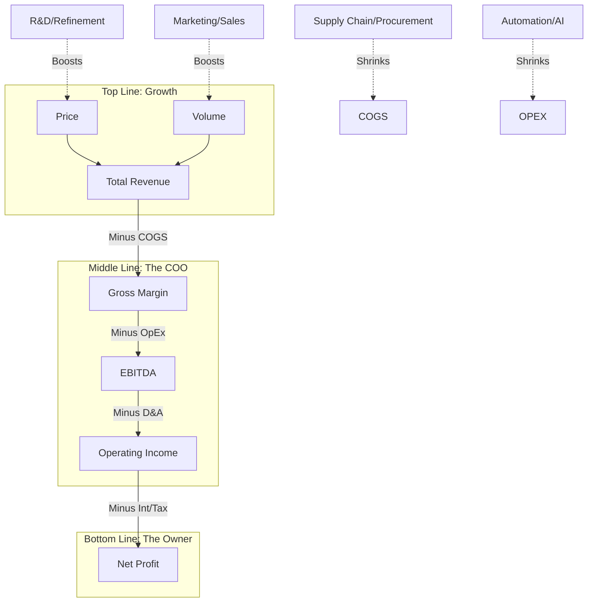
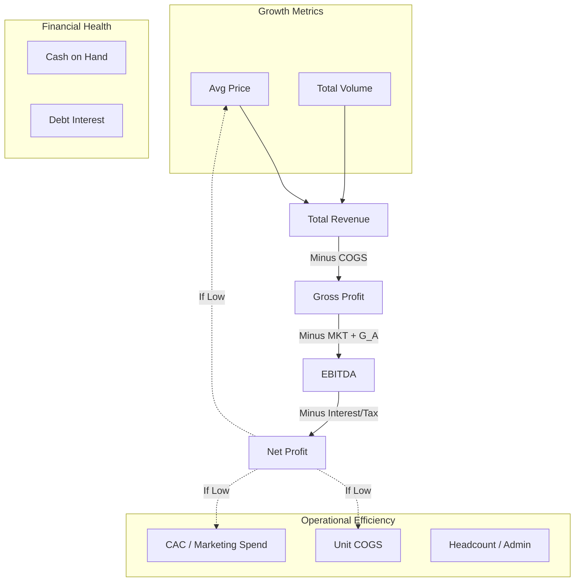

To summarize everything we’ve built together, we can look at the business as a **mathematical funnel** where strategy meets execution.

The ultimate goal of any business—from **Hermès** to a **1-Person SaaS**—is to ensure that the maximum amount of money survives the journey from the first sale to the final bank deposit.

### 1. The Master Formula (The "Multiplication String")

Profitability isn't just one number; it is a chain reaction of efficiencies. To find the **Net Profit ()**, we multiply the Top Line by the "Survival Rates" of each stage:

* **Top Line ():** Driven by **Marketing** (Volume) and **Product Quality** (Price).
* **Operational Efficiency ():** Driven by the **COO** and the **Factory/Supply Chain**.
* **Financial Structure ():** Driven by the **CFO** and **Legal** (Debt and Taxes).

---

### 2. The Strategic "Clash"

We categorized businesses into two primary archetypes based on how they handle this formula:

| Strategy | The Focus | Example | Key Philosophy |
| --- | --- | --- | --- |
| **Protecting the Filter** | **Price () & Margin** | Hermès, SaaS | "I sell to fewer people, but I keep almost every dollar." |
| **Increasing the Flow** | **Volume () & Speed** | Walmart, P&G | "I sell to everyone, and I survive on pennies per dollar." |

**The Indie Hacker** is the ultimate "Filter" business—using automation to keep **Operating Efficiency ()** near 100% by eliminating traditional "drains" like office rent and massive headcounts.

---

### 3. The COO’s Control Center

We defined the COO as the manager of the **Operating Margin**. They pull four specific levers to prevent "profit leakage":

1. **Production (GM):** Reducing waste and labor in the "factory."
2. **Marketing (OE):** Lowering the cost to acquire a customer (CAC).
3. **Delivery (OE):** Optimizing the supply chain and shipping.
4. **Scaling (OE):** Ensuring the company can grow  without growing "bloat" (fixed costs).

---

### 4. Summary Flow Diagram

This is the "Mental Map" of the entire conversation:

---

Final Takeaway

Whether you are analyzing **Microsoft** or starting your own **Shopify store**, the logic is identical: Use **CapEx** and **OpEx** to drive **Volume and Price**, then use **Operational Discipline** to make sure that growth doesn't get "eaten" by the internal drains of the business.

This is a great way to "label" the business from a leadership perspective. By assigning a **Strategic Tag** to each variable, you move from accounting terminology to **Management Action**.

Here is how we can tag the levers to show who owns the "Bet," who owns the "Execution," and who owns the "Structure."

---

### The Tagged CEO Dashboard

---

### 1. The [GROWTH BET]: Price () & Volume ()

This is where the CEO and CMO place their bets on the future.

* **The Bet:** "If we spend  on **Marketing** (Volume) and **R&D** (Price/Refinement), the market will reward us with more customers and higher pricing power."
* **Ownership:** Marketing, Sales, and Product Development.
* **Risk:** If the bet fails, your **Operating Efficiency** drops because you spent the money but didn't get the revenue.

### 2. The [PRODUCTION EXECUTION]: Gross Margin ()

This is the "Execution" of the physical or digital product itself.

* **The Goal:** To deliver the product as cheaply and perfectly as possible.
* **Ownership:** COO, Supply Chain, Manufacturing, and Procurement.
* **Key Levers:** * **Delivery Efficiency:** Shipping and logistics.
* **Direct Labor:** Reducing man-hours per unit.
* **Material Yield:** Minimizing waste.

### 3. The [OPERATIONAL DISCIPLINE]: Operating Efficiency ()

This is the "Scaling" lever. It measures how well the company manages its "Weight."

* **The Goal:** To ensure that as the company grows, the "Bloat" doesn't eat the profit.
* **Ownership:** COO, HR, and IT.
* **Key Levers:** * **Sales Efficiency:** Lowering the CAC (Customer Acquisition Cost).
* **Administrative Automation:** Using tech to replace manual back-office tasks.
* **Retention:** Keeping customers so you don't have to "re-buy" them.

### 4. The [FINANCIAL STRUCTURE]: Interest () & Tax ()

This is the "Foundation" of the business.

* **The Goal:** To ensure the profit isn't "leaked" to outside entities like banks or governments more than legally necessary.
* **Ownership:** CFO, Treasury, and Legal.
* **Key Levers:** Debt refinancing, Tax credits, and Cash management.

---

### Summary Table with Strategic Tags

| Variable | Strategic Tag | Primary Focus | If this fails... |
| --- | --- | --- | --- |
| **** | **[GROWTH BET]** | Market Share & Value | The company stops growing and becomes a "Zombie." |
| **** | **[EXECUTION]** | Quality & Delivery | The product becomes too expensive to sell; "The Factory is Broken." |
| **** | **[DISCIPLINE]** | Scaling & Waste | Corporate bloat eats all the growth; "The Office is Broken." |
| **** | **[STRUCTURE]** | Capital & Compliance | The bank or government takes the winnings; "The Foundation is Weak." |

---

### The Indie Hacker Version:

For the solo-founder, the tags are even more personal:

* **[BET]:** The hours spent coding a new feature or writing a Twitter thread.
* **[EXECUTION]:** The cost of the API and hosting.
* **[DISCIPLINE]:** Staying away from expensive software tools you don't need.
* **[STRUCTURE]:** Using a simple LLC or tax-efficient setup.

**Would you like me to draw a final Mermaid diagram that uses these specific Tags ([BET], [EXECUTION], [DISCIPLINE]) as the labels for the boxes?**

To build a 1-page **CEO Dashboard**, you need to move from "accounting rows" to "strategic levers." This dashboard shouldn't just show you what happened; it should show you *why* it happened and which part of the formula needs your attention.

Here is the structure of the **"Formula-First" CEO Dashboard.**

---

### 1. The "Vital Signs" (The Multipliers)

At the top of the page, you track the **Survival Rates**. If these drop, the business is "leaking" money.

* **Gross Margin % ():** Is the product becoming more expensive to make?
* **Operating Efficiency % ():** Is our "Growth Engine" (Marketing/Sales) becoming less efficient?
* **EBITDA Margin:** The raw cash-generating power of the operations.
* **Net Margin:** What finally hits the bank.

---

### 2. Dashboard Structure: The 4 Columns

I would structure the dashboard into four columns that map directly to your departments and the **KaTeX** formula.

| **Column A: Growth ()** | **Column B: Efficiency ()** | **Column C: Operations ()** | **Column D: Financials ()** |
| --- | --- | --- | --- |
| **Owner:** CMO / Product | **Owner:** COO / Factory | **Owner:** COO / HR | **Owner:** CFO |
| **Price ():** Avg. order value. | **Unit COGS:** Direct cost per item. | **CAC:** Cost to get 1 customer. | **Debt Ratio:** Total debt vs cash. |
| **Volume ():** Total units/subs. | **Waste/Yield:** % of materials lost. | **LTV:** Total value of 1 customer. | **Interest Rate:** Cost of borrowing. |
| **Churn Rate:** How many  left? | **Labor Productivity:** Units per hour. | **Burn Rate:** Monthly fixed OpEx. | **Tax Rate:** Effective % paid. |

---

### 3. The Visual Flow (Mermaid)

This is how the CEO "reads" the dashboard. You start at the top left (Market) and end at the bottom right (Profit).

---

### 4. The "Red Flag" Analysis

A CEO uses this dashboard to play **"The Why Game"**:

1. **If Revenue is up but Net Profit is down:** * *Diagnosis:* Your **Operating Efficiency ()** is failing. You are "buying" growth too dearly (Marketing costs are too high).
2. **If Gross Margin () is dropping:** * *Diagnosis:* Your **Factory/Supply Chain** is inefficient, or you are being forced to discount your **Price ()**.
3. **If EBITDA is high but Net Profit is low:** * *Diagnosis:* Your **Financial Structure ()** is the problem. You have too much debt, and the bank is the real owner of your hard work.

---

### How the "Indie Hacker" uses this:

For the solo-founder, this 1-page dashboard is even simpler.

* **The Growth Column** is their **Stripe Dashboard**.
* **The Efficiency Column** is their **AWS/OpenAI Bill**.
* **The Operations Column** is their **Google Ads/Twitter Analytics**.

**Would you like me to create a "What-If" calculator based on this dashboard? We could see, for example, what happens if you increase Price by 5% vs. decreasing Marketing Spend by 10%.**