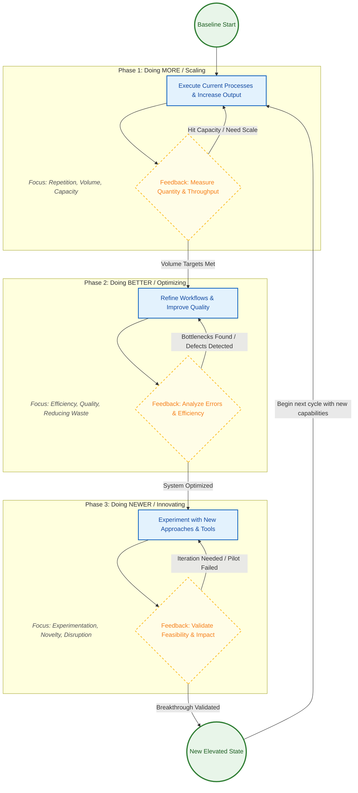

## More, Better, New

Scale, Optimize and innovate.

```mermaid
flowchart TD
    %% --- Definitions and Styling ---
    classDef process fill:#E3F2FD,stroke:#1565C0,stroke-width:2px,color:#0D47A1;
    classDef feedback fill:#FFFDE7,stroke:#FBC02D,stroke-width:2px,stroke-dasharray: 5 5,color:#F57F17;
    classDef milestone fill:#E8F5E9,stroke:#2E7D32,stroke-width:3px,color:#1B5E20;
    classDef labelBox fill:none,stroke:none,color:#555,font-style:italic;


    %% --- The Journey Starts ---
    Start((Baseline Start)):::milestone --> P1_Action

    %% --- PHASE 1: DOING MORE (The Scale Loop) ---
    subgraph Phase1 [Phase 1: Doing MORE / Scaling]
        direction TB
        P1_Label[Focus: Repetition, Volume, Capacity]:::labelBox
        P1_Action[Execute Current Processes & Increase Output]:::process
        P1_Check{Feedback: Measure Quantity & Throughput}:::feedback
        
        P1_Action --> P1_Check
        P1_Check -- "Hit Capacity / Need Scale" --> P1_Action
    end

    %% --- Transition to Phase 2 ---
    P1_Check -- "Volume Targets Met" --> P2_Action

    %% --- PHASE 2: DOING BETTER (The Optimization Loop) ---
    subgraph Phase2 [Phase 2: Doing BETTER / Optimizing]
        direction TB
        P2_Label[Focus: Efficiency, Quality, Reducing Waste]:::labelBox
        P2_Action[Refine Workflows & Improve Quality]:::process
        P2_Check{Feedback: Analyze Errors & Efficiency}:::feedback

        P2_Action --> P2_Check
        P2_Check -- "Bottlenecks Found / Defects Detected" --> P2_Action
    end

    %% --- Transition to Phase 3 ---
    P2_Check -- "System Optimized" --> P3_Action

    %% --- PHASE 3: DOING NEWER (The Innovation Loop) ---
    subgraph Phase3 [Phase 3: Doing NEWER / Innovating]
        direction TB
        P3_Label[Focus: Experimentation, Novelty, Disruption]:::labelBox
        P3_Action[Experiment with New Approaches & Tools]:::process
        P3_Check{Feedback: Validate Feasibility & Impact}:::feedback

        P3_Action --> P3_Check
        P3_Check -- "Iteration Needed / Pilot Failed" --> P3_Action
    end

    %% --- The Upward Spiral Closing ---
    EndState((New Elevated State)):::milestone

    P3_Check -- "Breakthrough Validated" --> EndState
    
    %% The critical loop back to the beginning at a higher level
    EndState -- "Begin next cycle with new capabilities" --> P1_Action
```