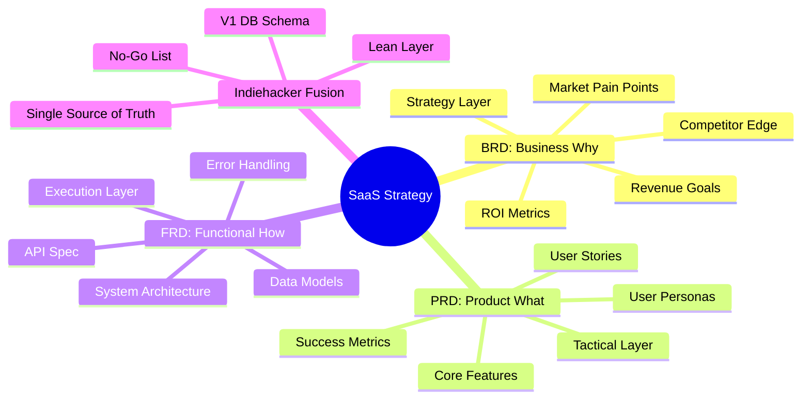
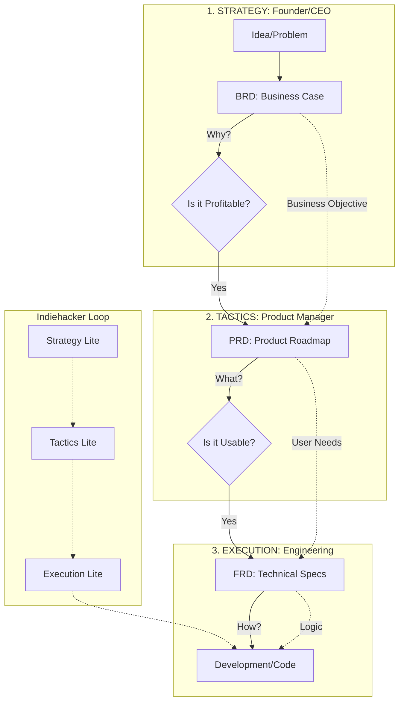
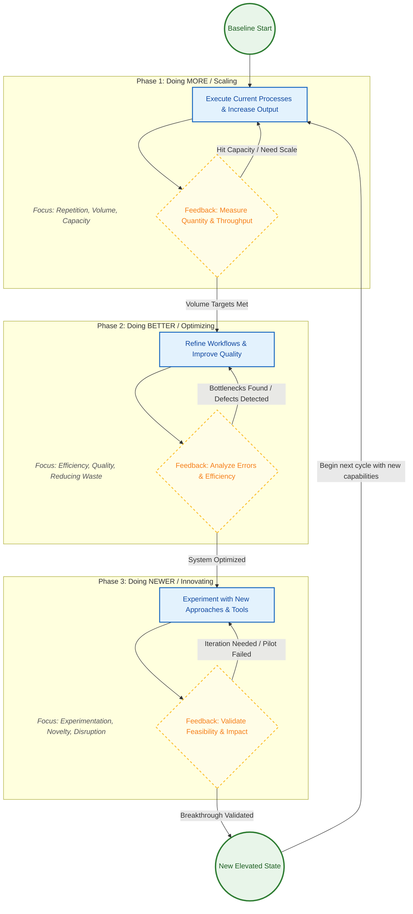
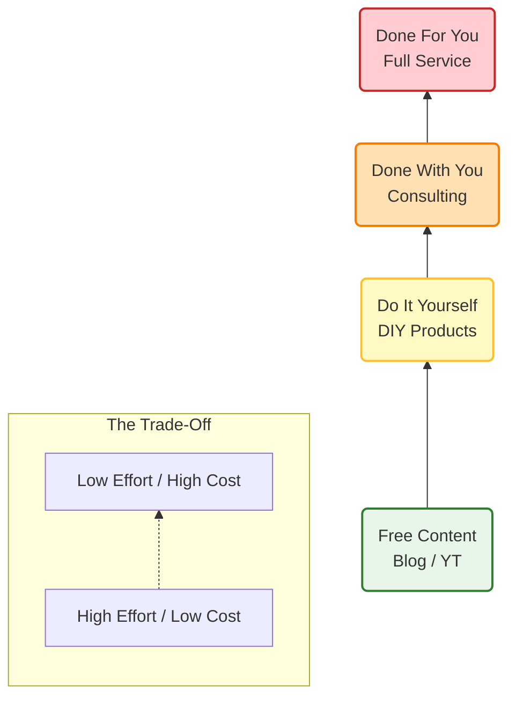
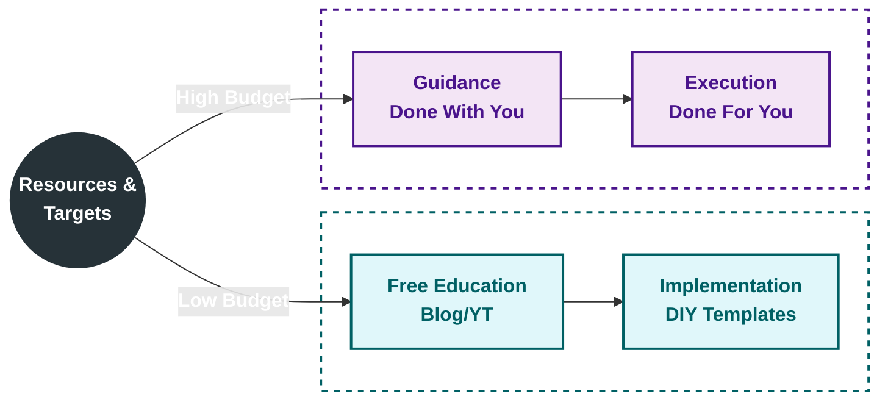
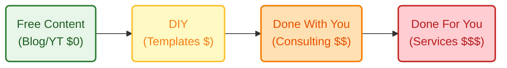
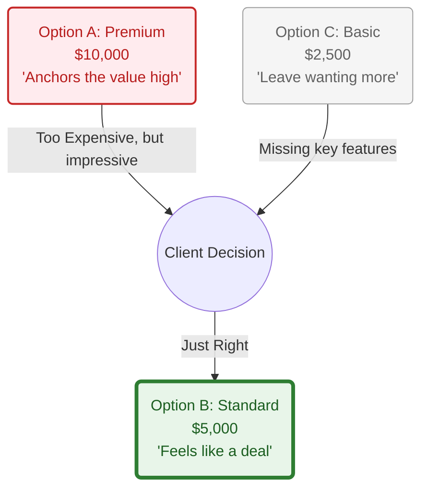
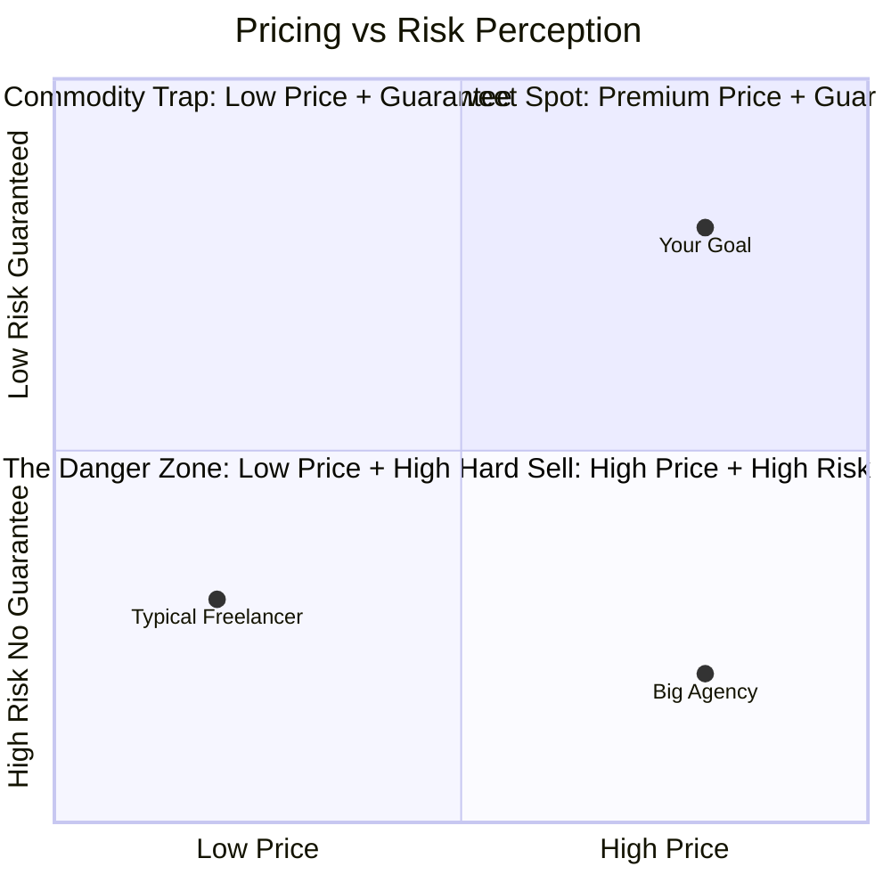
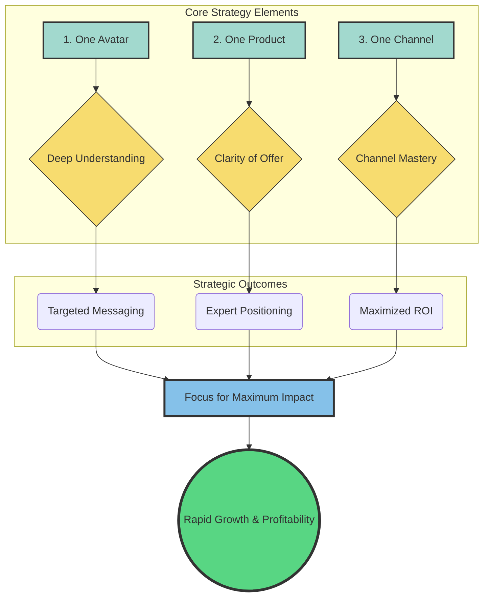

# From Why to How

To build a successful startup, you need to bridge the massive gap between a "big idea" and the daily work of a developer or designer.

The relationship between a **BRD**, **PRD**, and **FRD** acts as that bridge, moving from high-level vision to ground-level execution.

Here is how these documents relate to the "Why, What, and How" and where they fit into your entrepreneurial workflow.

## 1. The Relationship: Why, What, and How

Think of these documents as a funnel that clarifies detail as it moves toward implementation.

| Document | Core Question | Focus | Responsibility |
| :--- | :--- | :--- | :--- |
| **BRD** (Business) | **WHY** are we doing this? | Business goals, ROI, market opportunity, and problem statements. | Entrepreneur / CEO / Stakeholders |
| **PRD** (Product) | **WHAT** are we building? | Features, user experience, personas, and success metrics. | Product Manager / Founder |
| **FRD** (Functional) | **HOW** will it work technically? | System behavior, logic, API calls, and technical specifications. | Tech Lead / Developers |


## 2. Integration into the Entrepreneurial Workflow
As an entrepreneur, your workflow follows three distinct layers: **Strategy, Tactics, and Execution.**

### Stage 1: Strategy (The "Why") — Plug in the BRD
In this phase, you are defining the commercial intent. You aren't worried about buttons or database schemas; you are worried about survival and growth.
* **Workflow Action:** You identify a market gap or a customer pain point.
* **Document:** **Business Requirements Document (BRD).**
* **Key Section:** "The business objective is to capture 5% of the market by offering a cheaper alternative to X."
* **Value:** It ensures you don't build a product that works perfectly but has no business model.

### Stage 2: Tactics (The "What") — Plug in the PRD
Once you know *why* you are building it, you need to design the solution. This is tactical planning.
* **Workflow Action:** You map out the user journey and define the features that satisfy the BRD objectives.
* **Document:** **Product Requirements Document (PRD).**
* **Key Section:** "The mobile app will have a one-click checkout feature to reduce friction for the target user."
* **Value:** It provides a blueprint for the design and product teams, aligning the vision with the user's needs.

### Stage 3: Execution (The "How") — Plug in the FRD
This is the delivery phase. You hand the tactical plan to the builders (engineers) to define the technical plumbing.
* **Workflow Action:** Breaking down PRD features into technical tasks, system architecture, and specific logic.
* **Document:** **Functional Requirements Document (FRD).**
* **Key Section:** "When the 'Buy' button is clicked, the system must trigger an API call to the Stripe gateway and return a 200 Success status within 2 seconds."
* **Value:** It prevents technical debt and ensures the development team builds the features exactly as intended.

Summary of the Workflow Loop

1.  **Founder/Strategy** $\rightarrow$ **BRD** $\rightarrow$ "We need to make money from underserved pet owners."
2.  **Product/Tactics** $\rightarrow$ **PRD** $\rightarrow$ "We will build a mobile app for booking local pet sitters with instant chat."
3.  **Engineering/Execution** $\rightarrow$ **FRD** $\rightarrow$ "The chat interface will use WebSocket technology to ensure real-time messaging."

> **Pro Tip for Startups:** If you are a lean team, you might combine these. A **PRD** is the most vital document for a startup; it often inherits the "Why" from the BRD and includes enough "How" (functional logic) to get a developer started.


To help you move from strategy to execution, here are lean, SaaS-focused templates for each document. These are designed to be "living documents" that you can iterate on as you scale.

## 1. Business Requirements Document (BRD)

**Purpose:** Pitching the business case to stakeholders, investors, or partners.

* **Executive Summary:** A 2-sentence pitch. What is the SaaS, and why does the world need it now?
* **Problem Statement:** What is the "hair on fire" problem your customers face?
* **Business Objectives:** What does success look like in business terms? (e.g., "Onboard 100 paid users by Q3.")
* **Target Audience:** Market segments (e.g., "SMBs in the FinTech space.")
* **Revenue Model:** SaaS pricing strategy (Freemium, Per-seat, Tiered).
* **Competitive Landscape:** Top 3 competitors and your "unfair advantage."

## 2. Product Requirements Document (PRD)

**Purpose:** Defining the user experience and feature set for designers and PMs.

* **User Personas:** Who exactly is clicking the buttons? (e.g., "Admin Annie" vs. "Employee Eric").
* **User Stories:** Written as: *“As a [user type], I want to [action] so that [benefit].”*
* **Functional Scope:** High-level list of features (e.g., Dashboard, Stripe Integration, SSO).
* **Non-Functional Requirements:** Performance, Security, and Scalability needs.
* **Success Metrics:** Product-led growth (PLG) metrics (e.g., Activation rate, Churn).
* **Wireframes/Mockups:** Links to Figma or low-fidelity sketches.

## 3. Functional Requirements Document (FRD)

**Purpose:** Defining technical logic, data, and architecture for the dev team.

* **System Architecture:** Diagram of the stack (e.g., React frontend, Node.js backend, PostgreSQL database).
* **API Specifications:** List of endpoints, request/response structures, and authentication methods (JWT, OAuth).
* **Data Models:** Entity-Relationship diagrams (How the "User" table connects to the "Subscription" table).
* **Logic & Rules:**
    * *Example:* "When a user hits 80% of their monthly storage limit, trigger a 'Storage Full' email sequence."
* **Error Handling:** What happens when things break? (e.g., specific error codes for failed payments).
* **Environment Specs:** Staging vs. Production requirements.


**Comparison Checklist for your SaaS Workflow**

| Feature | BRD (Business) | PRD (Product) | FRD (Technical) |
| :--- | :--- | :--- | :--- |
| **Login** | "We need to ensure users are authenticated for security." | "User can log in via Google or Email/Password." | "Use Firebase Auth; store UUID in the Users table." |
| **Pricing** | "Targeting a $19/mo subscription price point." | "Pricing page with 3 tiers and a toggle for Annual/Monthly." | "Integrate Stripe Checkout; webhook triggers status change." |
| **Dashboard** | "Increase user engagement by showing ROI data." | "Display a chart of cost savings over the last 30 days." | "Fetch data from /analytics endpoint; render using Chart.js." |

---

### Strategy Tip for SaaS Founders

In the early days (MVP stage), you can save time by merging the **PRD** and **FRD** into a single **Product Spec**.

Keep the **BRD** separate as your "North Star" for business strategy, but let the tactical and technical documents live together until your team grows beyond 5–10 people.

**Would you like me to take one of your specific SaaS ideas and draft a sample User Story list for the PRD?**



## The Indie Hacker way of BRD

For an indiehacker or solo-developer, you are the **CEO (BRD)**, the **Product Manager (PRD)**, and the **Lead Engineer (FRD)** all in one.

In this context, writing three separate 20-page documents is a waste of time. 

However, skipping the *thinking* behind them is why most solo projects fail or never launch.



For you, these documents should morph into a **Single Source of Truth (SSOT)** that focuses on speed and clarity.

### 1\. The "Lean Fusion" Document

Instead of three docs, create one **Product Blueprint**. Your goal is not to "inform stakeholders" but to "prevent decision fatigue." When you sit down to code at 10 PM, you shouldn't be wondering *what* to build; you should just be executing.

#### The Solo-Dev BRD Section (The "Reality Check")

  * **The "Why" remains critical:** Write down exactly how you will make $1. If you can’t define the revenue hook here, don't write a line of code.
  * **The "No-Go" List:** Define what you are **not** building. This prevents "scope creep," the solo-developer's greatest enemy.

#### The Solo-Dev PRD Section (The "User Path")

  * **User Flows over Feature Lists:** Instead of listing "Chat functionality," draw a simple flow: *Land on page -\> Auth -\> Send Message -\> Notification.*
  * **The "V1" Definition:** What is the absolute smallest set of features that someone will pay for? (The MVP).

#### The Solo-Dev FRD Section (The "Architecture Notes")

  * **Stack Decisions:** Don't document the API in detail; just list your tech choices to stop yourself from switching frameworks halfway through. (e.g., "Next.js + Supabase + Tailwind").
  * **Schema Sketch:** A quick bulleted list of your database tables is usually enough.

-----

### 2\. Comparison: Corporate vs. Indiehacker

| Feature | Corporate (BRD/PRD/FRD) | Indiehacker (The Blueprint) |
| :--- | :--- | :--- |
| **Format** | Formal PDFs/Google Docs | Notion page, Obsidian, or a Readme.md |
| **Goal** | Consensus & Approval | Speed & Reducing Mental Load |
| **Change** | Strict Version Control | Constant iteration |
| **Detail** | Every edge case covered | Just enough to start coding tomorrow |

-----

### 3\. The Solo-Dev Workflow Plug-in

Here is how you actually use these concepts without the "corporate" weight:

#### Step 1: Strategy (The "BRD Lite")

Spend **1 hour** answering: "Who pays for this, and why don't they use the current free/cheap alternative?"

  * *Output:* A 1-paragraph mission statement.

#### Step 2: Tactics (The "PRD Lite")

Spend **2 hours** listing the screens.

  * *Output:* A "To-Do" list in Trello or GitHub Issues. **If a feature isn't on this list, it doesn't exist for V1.**

#### Step 3: Execution (The "FRD Lite")

Spend **30 minutes** on your DB schema and choosing your libraries.

  * *Output:* A simple diagram or list of tables (e.g., `Users`, `Posts`, `Billing`).

-----

### 4\. The "Solo-Dev" Template (Markdown Version)

Copy this into your project's `README.md` or a Notion page:

```markdown
# Project Name: [SaaS Name]

## 1. The Why (BRD)
- **Problem:** [Describe the pain point]
- **Value Prop:** [How I solve it]
- **Monetization:** [e.g., $9/mo Subscription via Stripe]

## 2. The What (PRD)
- **Primary User Flow:** Landing -> Auth -> Core Feature -> Payment.
- **V1 Features:** - [ ] Auth (Google/Email)
  - [ ] Feature A (The core value)
  - [ ] Settings (Billing/Delete account)

## 3. The How (FRD)
- **Stack:** T3 Stack (Next.js, Prisma, TRPC)
- **DB Schema:** - User: id, email, stripe_id
  - Data: id, user_id, content, timestamp
```

**Would you like me to help you define the "No-Go" list for your project to make sure you actually launch V1?**

To write effective user stories for your **PRD**, you want to follow a standard industry format. This ensures that when you switch from "Manager" to "Developer," you know exactly what success looks like.

### The User Story Skeleton
The most effective structure for a SaaS user story is the **"Role-Action-Benefit"** formula, followed by **Acceptance Criteria (AC)**.

**The Skeleton:**
* **Story:** As a **[Type of User]**, I want to **[Perform an Action]** so that **[Achieve a Value]**.
* **Acceptance Criteria:** A bulleted checklist that defines when the task is "Done."

---

### The Example: User Authentication
You asked for a story that starts with "the user logs into the app."

#### **User Story: Account Access**
> **As a** Registered User,  
> **I want to** log into the application using my email and password  
> **So that** I can access my private dashboard and saved data securely.

#### **Acceptance Criteria (The "Functional" logic):**
* [ ] User is presented with a clean login screen containing Email and Password fields.
* [ ] The "Login" button is disabled if the fields are empty.
* [ ] **Validation:** System checks the database to see if the user exists and the password matches.
* [ ] **Success Path:** If credentials are correct, user is redirected to the `/dashboard`.
* [ ] **Error Path:** If credentials fail, show a generic error: *"Invalid email or password."* (Do not specify which one for security).
* [ ] **State Persistence:** User session is maintained (JWT or Session cookie) so they don't have to re-login on refresh.
* [ ] **Password Masking:** The password field characters must be hidden by default.

---

### Why this is critical for a Solo-Dev
Writing the **Acceptance Criteria (AC)** is where you save hours of time. Without it, you sit down to code "Login" and suddenly find yourself wasting 4 hours on a "Forgot Password" flow or "OAuth with Google" that wasn't actually necessary for your MVP.

**AC prevents "Developer Procrastination"**—the habit of coding the easy things instead of the hard features that make the product work.

### Pro-Tip: The "Edge Case" Story
For a robust SaaS, you should also have a "Negative" user story to clarify the functional requirements of the **FRD**:

* **Story:** *As a Security-Conscious User, I want the system to lockout an IP after 5 failed login attempts so that my account is protected from brute-force attacks.*

---

**Would you like me to write the next user story for what happens immediately *after* they see the dashboard?**

*****************

# More, Better, New

Scale, Optimize and innovate.




---

This concept is classic **"Value Ladder"** or **"Agency Pricing Model"** theory.

The core dynamic here is an **inverse relationship**: as the financial cost goes up, the client's time/effort commitment should go down.

Here are two ways to improve the visualization: one focusing on the **progression (The Ladder)** and one focusing on the **trade-off (The Matrix)**.

### Option 1: The "Value Ladder" (Best for showing progression)

This version organizes the nodes vertically, showing that as you step up, the service level increases and the "Time Cost" for the client decreases.



Call it...value ladder, sales funnel or **Tier of Service**

The point is: there is a trade-off!

### Option 2: The "Decision Matrix" (Best for comparisons)

This version visually separates the "Self-Serve" options from the "Service" options, making it clear that they are two different paths based on what the user possesses more of (Time vs. Money).



<!-- ```mermaid
flowchart LR
    %% Styles
    classDef root fill:#212121,color:#fff,stroke-width:0px;
    classDef time path fill:#E1F5FE,stroke:#0277BD;
    classDef money path fill:#FCE4EC,stroke:#C2185B;
    classDef node fill:#fff,stroke:#333,stroke-width:1px;

    Center((Resource<br/>Check)):::root

    %% Left Path: I have Time
    subgraph TimeRich [Path A: I have Time]
        direction TB
        Blog[Free Education<br/>(Blog/YT)]:::node
        DIY[Implementation<br/>(DIY Templates)]:::node
        
        Blog --> DIY
    end

    %% Right Path: I have Capital
    subgraph MoneyRich [Path B: I have Money]
        direction TB
        DWY[Guidance / Consulting<br/>(Done With You)]:::node
        DFY[Execution / Agency<br/>(Done For You)]:::node

        DWY --> DFY
    end

    %% Routing
    Center -- "Low Budget" --> Blog
    Center -- "High Budget" --> DWY
``` -->

### Key Improvements Made:

1.  **Grouped by "Who does the work":**
      * **Self-Serve:** The client does the heavy lifting (Blog, DIY).
      * **Service:** You do the heavy lifting (Consulting, DFY).
2.  **Color Coding:** In Option 1, I used a "Heat Map" approach (Green = Cheap, Red = Expensive).
3.  **Terminology Update:**
      * Added **"Free Education"** to clarify what Blog/YT actually is.
      * Grouped Consulting under **"Guidance"** versus Services under **"Execution"**—this is a key distinction for buyers.

Which logic fits your mental model better: the **Ladder** (climbing up) or the **Matrix** (choosing a path)?


Here is the simplified **Value Ladder** in Left-to-Right mode, preserving the color gradient to show the transition from "Cheap/Free" to "Premium."



---

Building on the "Value Ladder" concept, here are actionable tips to refine your agency pricing model.

The goal is to move away from "selling time" (which caps your income) to "selling value" (which creates scale).

### 1\. The "Goldilocks" Strategy (The Power of Three)

Never send a proposal with just one price. 

If you give one price, the question is "Yes or No?" 

If you give three prices, the question changes to "Which one?"

  * **Option 1 (The Decoy / Anchor):** A very high-priced "Do It All" package. Its primary job is to make Option 2 look reasonable.
  * **Option 2 (The Target):** The package you actually want to sell. It should feel like a "steal" compared to Option 1.
  * **Option 3 (The Downsell):** A stripped-down version for budget clients.

Here is how to visualize the **Psychology of Choice** in your proposals:



### 2\. Productize Your Services (The "Menu" Approach)

Stop writing custom proposals for every lead. It kills your "Doing Better" efficiency loop. Turn your service into a product with a fixed scope, fixed price, and fixed timeline.

  * **Bad:** "I'll do your SEO for $100/hr." (Client hears: *I don't know how long this will take.*)
  * **Good:** "The 'Growth Sprint' Package: 4 Blog posts, Audit, and Backlink strategy. Delivered in 2 weeks. $3,000." (Client hears: *Certainty and Outcome.*)

### 3\. Change "Retainers" to "Subscriptions"

"Retainer" sounds like a lawyer fee where you pay for *access* to a person. "Subscription" sounds like a utility where you pay for *continuous value*.

  * **Tip:** If you move a client from a Project (L3 in your ladder) to a Recurring model, offer a "Continuity Discount."
      * *Example:* "The project is $5k. But if you sign up for our 6-month maintenance plan ($1k/mo), I'll waive the setup fee."

### 4\. Value-Based Pricing (The "10x Rule")

Price your services based on the **value you create**, not the **cost to you**.
If your service saves the client $100,000 or makes them $100,000, charging $10,000 is a "no-brainer" investment (10x ROI), even if it only takes you 5 hours to do the work.

### 5\. The "Risk Reversal" Diagram

Clients are afraid of making a mistake. 

You can charge 20-50% more if you remove their risk.



**How to read this chart:**

  * Most freelancers compete in the bottom left (Cheap and risky).
  * Big Agencies are often bottom right (Expensive and risky/slow).
  * **Your Opportunity (Top Right):** If you charge a premium price but offer a **Performance Guarantee** (e.g., "We hit the KPI or we work for free until we do"), you become the safest and best option, justifying the higher fee.

**Next Step:**
Do you want to draft a specific **"Option 1 / 2 / 3"** package structure for your specific niche? (e.g., tell me if you do Web Dev, Marketing, or Consulting).

# Focus strategy

That's a great question about a popular business focus strategy! The concept of **"One Avatar, One Product, One Channel"** is primarily a **marketing and focus strategy**, although its adoption and enforcement can certainly come from a CEO or executive level.



Here is the logic behind it and why it's so often advocated, especially for startups and small to mid-sized businesses:

## 🎯 The Logic: Focus for Maximum Impact

The core philosophy is that **focus creates clarity, clarity drives results, and results allow for scaling.** By limiting variables, a business can achieve exceptional proficiency and market penetration in a very specific area before attempting to diversify.

### 1. One Avatar (Ideal Customer)

* **Deep Understanding:** An "avatar" is a detailed profile of your single, ideal customer. By focusing on just one, you can understand their pain points, desires, media consumption habits, and language at a deep, almost personal level.
* **Highly Effective Messaging:** This deep understanding allows you to craft marketing messages that speak directly to that person's needs, making the message instantly relevant and compelling. It avoids the weak, generic messaging that tries to appeal to everyone.

### 2. One Product (Clear Solution/Offer)

* **Clarity of Offer:** Offering just one core product or service eliminates customer confusion. The customer doesn't have to weigh the pros and cons of five different options; they see a clear solution to their specific problem.
* **Positioning as the Expert:** Focusing your entire business around one solution positions you in the market as the undisputed expert in that specific thing, which builds trust and justifies a premium price.
* **Simplified Operations:** Internally, your team (product development, sales, customer service) can pour 100% of its energy into perfecting that single offer, leading to a better, more efficient delivery.

### 3. One Channel (Distribution/Marketing Platform)

* **Mastery Over Mediocrity:** Instead of spreading resources thin across every social media platform, website, or paid ad network, you focus on mastering the *one* channel where your **One Avatar** spends the most time.
* **Maximized ROI:** By achieving mastery, you can optimize your marketing spend, content strategy, and execution on that single platform to get the highest possible return on investment.
* **Energy Conservation:** As an entrepreneur or small team, energy and attention are limited resources. Concentrating efforts prevents "shiny object syndrome" and helps conserve energy for execution.

---

## 📈 Is it a CEO Strategy?

While the concept itself is a **marketing/growth framework**, it absolutely requires **CEO-level commitment and strategic discipline** to implement effectively, especially the *One Product* and *One Channel* parts.

* **Strategic Decision:** Deciding to *not* pursue other seemingly lucrative products or marketing channels is a difficult, high-level strategic decision that often has to be enforced by the leadership team.
* **Focus for Early Growth:** The strategy is most famously associated with business leaders like **Alex Hormozi** (who advocates for **"One Offer. One Avatar. One Channel."**) as a formula for reaching initial milestones (like \$1 million in revenue).
* **Long-Term View:** While critical for initial growth and getting a firm footing, a business will eventually need to expand to multiple products/offers and diversify channels to achieve **long-term scale and resilience** (e.g., to mitigate the risk of one platform's algorithm changing).

In summary, it's a powerful **focus-driven marketing strategy** that relies on strong leadership—often the CEO—to ensure the entire organization maintains that intense, singular focus.

Would you like me to find some resources or examples of companies that successfully used this focus strategy?

That's a great question about a popular business focus strategy! The concept of **"One Avatar, One Product, One Channel"** is primarily a **marketing and focus strategy**, although its adoption and enforcement can certainly come from a CEO or executive level.

Here is the logic behind it and why it's so often advocated, especially for startups and small to mid-sized businesses:

## 🎯 The Logic: Focus for Maximum Impact

The core philosophy is that **focus creates clarity, clarity drives results, and results allow for scaling.** By limiting variables, a business can achieve exceptional proficiency and market penetration in a very specific area before attempting to diversify.

### 1. One Avatar (Ideal Customer)

* **Deep Understanding:** An "avatar" is a detailed profile of your single, ideal customer. By focusing on just one, you can understand their pain points, desires, media consumption habits, and language at a deep, almost personal level.
* **Highly Effective Messaging:** This deep understanding allows you to craft marketing messages that speak directly to that person's needs, making the message instantly relevant and compelling. It avoids the weak, generic messaging that tries to appeal to everyone.

### 2. One Product (Clear Solution/Offer)

* **Clarity of Offer:** Offering just one core product or service eliminates customer confusion. The customer doesn't have to weigh the pros and cons of five different options; they see a clear solution to their specific problem.
* **Positioning as the Expert:** Focusing your entire business around one solution positions you in the market as the undisputed expert in that specific thing, which builds trust and justifies a premium price.
* **Simplified Operations:** Internally, your team (product development, sales, customer service) can pour 100% of its energy into perfecting that single offer, leading to a better, more efficient delivery.

### 3. One Channel (Distribution/Marketing Platform)

* **Mastery Over Mediocrity:** Instead of spreading resources thin across every social media platform, website, or paid ad network, you focus on mastering the *one* channel where your **One Avatar** spends the most time.
* **Maximized ROI:** By achieving mastery, you can optimize your marketing spend, content strategy, and execution on that single platform to get the highest possible return on investment.
* **Energy Conservation:** As an entrepreneur or small team, energy and attention are limited resources. Concentrating efforts prevents "shiny object syndrome" and helps conserve energy for execution.

---

## 📈 Is it a CEO Strategy?

While the concept itself is a **marketing/growth framework**, it absolutely requires **CEO-level commitment and strategic discipline** to implement effectively, especially the *One Product* and *One Channel* parts.

* **Strategic Decision:** Deciding to *not* pursue other seemingly lucrative products or marketing channels is a difficult, high-level strategic decision that often has to be enforced by the leadership team.
* **Focus for Early Growth:** The strategy is most famously associated with business leaders like **Alex Hormozi** (who advocates for **"One Offer. One Avatar. One Channel."**) as a formula for reaching initial milestones (like \$1 million in revenue).
* **Long-Term View:** While critical for initial growth and getting a firm footing, a business will eventually need to expand to multiple products/offers and diversify channels to achieve **long-term scale and resilience** (e.g., to mitigate the risk of one platform's algorithm changing).

In summary, it's a powerful **focus-driven marketing strategy** that relies on strong leadership—often the CEO—to ensure the entire organization maintains that intense, singular focus.

Would you like me to find some resources or examples of companies that successfully used this focus strategy?

That's a great exercise! I will fill the **Decision** column with typical strategic actions and then provide a hypothetical small business example.

## 📝 One Avatar, One Product, One Channel Strategy

| Element | Decision |
| :--- | :--- |
| **One Avatar** | **Select a single, specific niche.** (e.g., "U.S. certified personal trainers aged 25-35 struggling with client retention.") |
| **One Product** | **Define a single, compelling, non-negotiable offer.** (e.g., "A 4-week, guaranteed client-retention coaching program.") |
| **One Channel** | **Commit 100% of marketing budget/time to one platform.** (e.g., "Run all paid ads exclusively on Instagram Stories.") |

---

## 🚀 Hypothetical Small Business Sample Launch Strategy

### 🌟 Business: "Fit Finances"

* **Goal:** Launch a profitable, scalable business in the fitness industry.

| Element | Decision Made | Rationale |
| :--- | :--- | :--- |
| **1. One Avatar** | **Decision:** Fitness Studio Owners (specifically, independent yoga/Pilates studios with 1-3 employees in medium-sized cities). | This is a specific, high-pain, high-value niche. They are busy, struggle with back-office tasks, and value time over cost. |
| **2. One Product** | **Decision:** A 12-Month "Zero-Headache Bookkeeping Service" at \$500/month, inclusive of all tax preparation. | A single, clear, recurring revenue offer that solves their biggest pain point (finances) completely. The price point is justified by the peace of mind. |
| **3. One Channel** | **Decision:** Direct outreach and content creation exclusively on **LinkedIn**. | Studio owners are professionals. LinkedIn is the best channel for professional B2B outreach and building credibility through case studies and owner-focused content. |

### 💡 Launch Execution Summary

The owner of "Fit Finances" will spend 80% of their marketing time:

1.  **Creating LinkedIn content** (e.g., "3 Tax Mistakes Costing Your Yoga Studio \$5,000/Year").
2.  **Using LinkedIn Sales Navigator** to find and directly message target studio owners with a highly personalized pitch about the "Zero-Headache Service."
3.  **Refining their product** based only on the feedback received from this one specific Avatar and Channel.

This focused approach allows them to become the **recognized financial solution for boutique fitness studio owners** quickly and efficiently before ever trying to serve personal trainers or use Facebook ads.


The strategic choices in the "Decision" column are all about **narrowing the focus** to maximize resources and achieve market penetration. 

They reflect the hard choices a leader must make to commit fully to the "One, One, One" model.

Here is a deeper breakdown of the logic behind those typical strategic decisions:

| Element | Strategic Choice (Decision) | Deeper Logic & Purpose |
| :--- | :--- | :--- |
| **One Avatar** | **Select a single, specific niche.** (e.g., "U.S. certified personal trainers aged 25-35 struggling with client retention.") | The purpose is **Relatability and Precision.** The choice is to ignore the *majority* of the market (everyone else) to serve a *select few* exceptionally well. The more specific the avatar (including demographics, psychographics, and their core problem/pain point), the easier it is to write advertising copy, create product features, and design sales scripts that resonate instantly. |
| **One Product** | **Define a single, compelling, non-negotiable offer.** (e.g., "A 4-week, guaranteed client-retention coaching program.") | The purpose is **Clarity and Confidence.** The choice is to sell a *solution* (the result) rather than a *process* (the features). A "non-negotiable" offer means you standardize it to maximize profit and simplify delivery. This choice is usually tied to a **guarantee** or a promise of a huge, specific result, which builds massive confidence and trust in the market. |
| **One Channel** | **Commit 100% of marketing budget/time to one platform.** (e.g., "Run all paid ads exclusively on Instagram Stories.") | The purpose is **Mastery and Optimization.** The choice is to sacrifice the potential of being "everywhere" to ensure you are **dominant** in one place. By committing 100% of resources, you learn the channel's algorithm, ad policies, and audience nuances faster than any competitor, leading to lower costs and higher conversion rates on that single platform. You avoid being mediocre on five platforms. |

### Why These Decisions Are Hard (But Necessary)

These decisions are difficult for entrepreneurs because they require saying **"No"** to many potential opportunities:

* **Saying No to Avatars:** You have to turn away seemingly good customers who don't fit your profile because they dilute your messaging and consume valuable resources.
* **Saying No to Products:** You must resist the urge to create add-ons or new services, even if customers ask for them, until the core product is perfected and scaled.
* **Saying No to Channels:** You must ignore trendy new social platforms or successful channels used by competitors until you have fully maximized the potential of your single chosen channel.

The overall strategic logic is that **intense focus on a narrow target market with a perfected solution delivered via a mastered channel is the fastest way to initial, profitable growth.**

# SaaS KPIs

You have hit on the most critical challenge in SaaS finance: the difference between **long-term profitability (LTV:CAC)** and **short-term cash flow (capital efficiency)**.

A 3:1 LTV:CAC ratio means your business model is *theoretically* sound, but if it takes too long to collect that revenue, you will still run out of money.

## ⚠️ The Cash Flow Killer: High CAC Payback Period

The primary issue that could be hiding behind a healthy LTV:CAC is the **CAC Payback Period**, also known as **Months to Recover CAC**.

### 1. The Issue Explained

The formula for LTV is based on the *gross profit* generated over the *entire estimated customer lifetime*.

If that lifetime is 5 years, the 3:1 ratio looks great, but you need to wait 5 years to realize that $3.

**The Cash Flow Problem:**
* You spend **$1,000** today to acquire a customer (CAC).
* That customer pays **$100/month** (MRR) and has a **gross margin of 80%** (so $80/month in profit).
* **CAC Payback Period:** $\$1000 / \$80 = 12.5$ months.

You have to fund that $1,000 for **12.5 months** before the customer pays it back. If you are a high-growth startup acquiring 100 new customers per month, you are spending **$100,000 per month** in the red, just to acquire customers whose payback is over a year away. This rapidly depletes your cash reserves, forcing you to constantly seek external funding, even if your LTV:CAC is 10:1!

### 2. Other Underlying Cash Flow Issues

While the Payback Period is the main culprit, other issues can compound the problem:

* **Low Gross Margins:** If your cost of goods sold (COGS)—like hosting, support, and integration costs—is very high, your gross profit per customer is low. This means your payback period lengthens dramatically.
* **High Burn Rate:** If your fixed operating expenses (salaries, rent, software tools) are growing faster than your MRR, your **Net Burn** (expenses - revenue) will remain high. The LTV:CAC only focuses on acquisition efficiency, not overall operational efficiency.
* **Churning Before Payback:** If your average customer leaves after 9 months, but your payback period is 12 months, you are losing money on every customer, regardless of what your *projected* LTV suggests.

---

## 🧭 Leading Indicators for Cash Flow & Viability

Leading indicators are what you track today to predict the financial and operational outcomes 6-12 months from now. They are crucial for cash flow because they help you adjust your spending *before* you run out of money.

Here are the most important leading indicators in SaaS:

| Leading Indicator | What It Predicts | How It Impacts Cash Flow |
| :--- | :--- | :--- |
| **CAC Payback Period** | Future cash flow and capital efficiency. | **Shorter is better.** The faster you recoup CAC (ideally $\le 12$ months), the faster you can redeploy that capital to acquire the next customer. |
| **Lead Velocity Rate (LVR)** | Future revenue (MRR/ARR growth). | **Growth is a cash drain.** A high LVR signals you need to budget more for Sales/Marketing next quarter to convert those leads, impacting the Burn Rate. |
| **Time to Value (TTV)** | Future retention and expansion MRR. | **Shorter is better.** The faster a customer uses the core features and sees ROI, the lower the risk of early churn (which ruins your payback). |
| **Net Revenue Retention (NRR)** | Future LTV and business health. | **NRR > 100% is the goal.** This shows your existing customers are growing faster than your revenue lost to churn. This revenue costs nothing to acquire, directly improving your cash position. |
| **Activation Rate** | Future churn rate. | The percentage of users who complete key setup steps. A low rate predicts **high churn** and wasted CAC. Improving this is a direct way to shorten the Payback Period. |
| **Bookings Growth** | Future ARR/MRR. | The total dollar value of new contracts signed (even if the cash hasn't been recognized as revenue yet). This is a strong, immediate signal of sales team performance and future cash stability. |

To manage cash flow, you must obsess over keeping your **CAC Payback Period** short and driving your **NRR** above 100%.