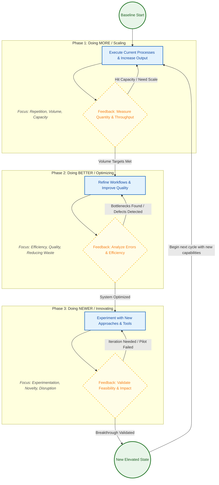
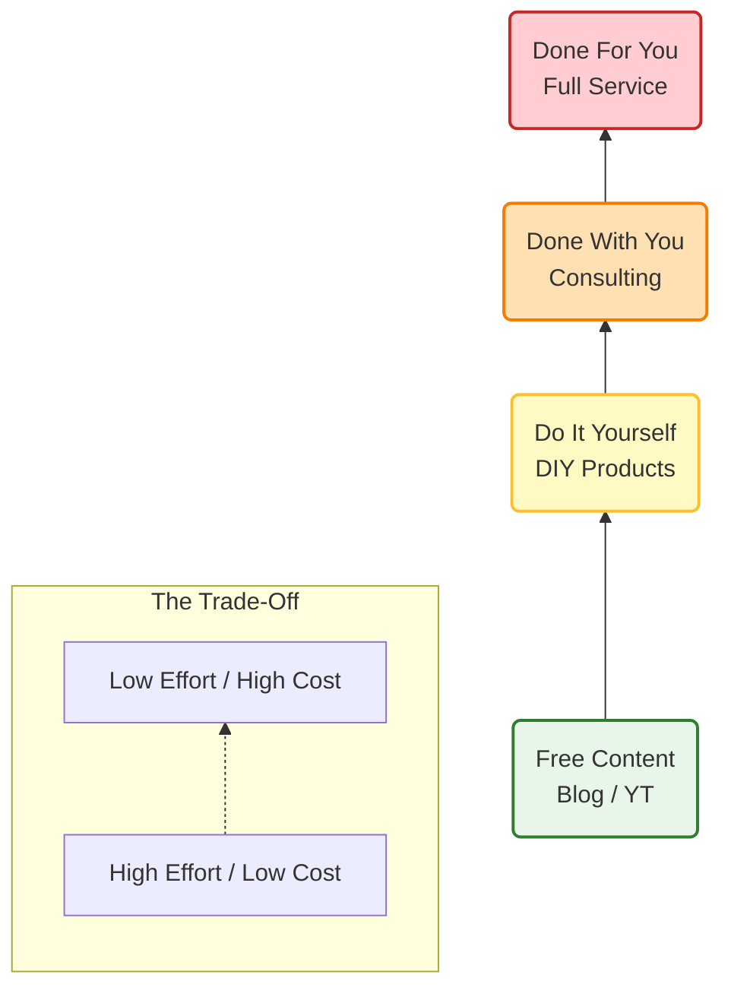
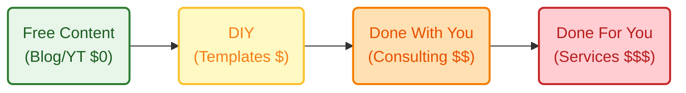

## More, Better, New

Scale, Optimize and innovate.




---

This concept is classic **"Value Ladder"** or **"Agency Pricing Model"** theory. The core dynamic here is an **inverse relationship**: as the financial cost goes up, the client's time/effort commitment should go down.

Here are two ways to improve the visualization: one focusing on the **progression (The Ladder)** and one focusing on the **trade-off (The Matrix)**.

### Option 1: The "Value Ladder" (Best for showing progression)

This version organizes the nodes vertically, showing that as you step up, the service level increases and the "Time Cost" for the client decreases.



### Option 2: The "Decision Matrix" (Best for comparisons)

This version visually separates the "Self-Serve" options from the "Service" options, making it clear that they are two different paths based on what the user possesses more of (Time vs. Money).

```mermaid
flowchart LR
    %% Styles
    classDef root fill:#212121,color:#fff,stroke-width:0px;
    classDef time path fill:#E1F5FE,stroke:#0277BD;
    classDef money path fill:#FCE4EC,stroke:#C2185B;
    classDef node fill:#fff,stroke:#333,stroke-width:1px;

    Center((Resource<br/>Check)):::root

    %% Left Path: I have Time
    subgraph TimeRich [Path A: I have Time]
        direction TB
        Blog[Free Education<br/>(Blog/YT)]:::node
        DIY[Implementation<br/>(DIY Templates)]:::node
        
        Blog --> DIY
    end

    %% Right Path: I have Capital
    subgraph MoneyRich [Path B: I have Money]
        direction TB
        DWY[Guidance / Consulting<br/>(Done With You)]:::node
        DFY[Execution / Agency<br/>(Done For You)]:::node

        DWY --> DFY
    end

    %% Routing
    Center -- "Low Budget" --> Blog
    Center -- "High Budget" --> DWY
```

### Key Improvements Made:

1.  **Grouped by "Who does the work":**
      * **Self-Serve:** The client does the heavy lifting (Blog, DIY).
      * **Service:** You do the heavy lifting (Consulting, DFY).
2.  **Color Coding:** In Option 1, I used a "Heat Map" approach (Green = Cheap, Red = Expensive).
3.  **Terminology Update:**
      * Added **"Free Education"** to clarify what Blog/YT actually is.
      * Grouped Consulting under **"Guidance"** versus Services under **"Execution"**—this is a key distinction for buyers.

Which logic fits your mental model better: the **Ladder** (climbing up) or the **Matrix** (choosing a path)?


Here is the simplified **Value Ladder** in Left-to-Right mode, preserving the color gradient to show the transition from "Cheap/Free" to "Premium."


