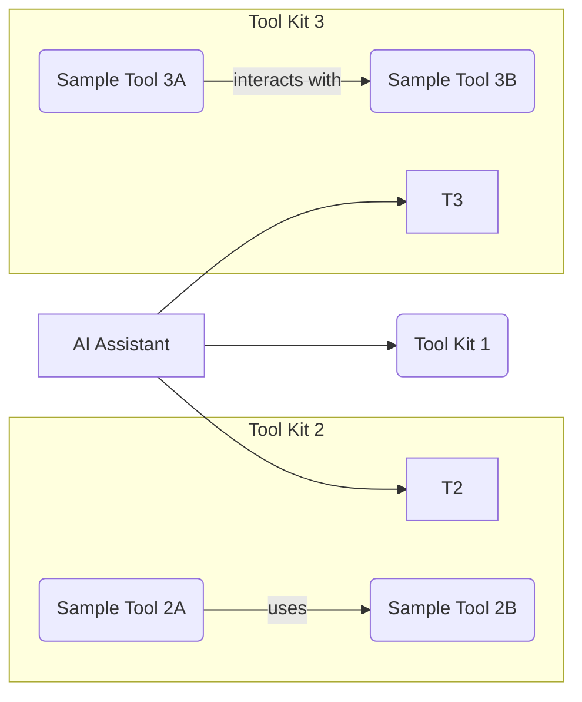

### MCP



Very cool uses cases for MCP - https://github.com/punkpeye/awesome-mcp-servers


<!-- https://www.youtube.com/watch?v=HyzlYwjoXOQ&t=11s -->




**MCP** aka Model Context Protocol - https://openai.github.io/openai-agents-python/mcp/

* https://modelcontextprotocol.io/introduction


<!-- https://www.youtube.com/watch?v=Ek8JHgZtmcI&t=333s -->




Thanks to Alejandro for once again sharing the code - https://github.com/alejandro-ao/mcp-server-example




Agents call the LLMs more than once in a loop, that simulates a chain of thoughts process

1. Agents start with a **tought** with the first query
2. Thanks to the system prompts, it knows the available functions with the possible **actions** to take
3. the **observation** is the result of that action

> It can also be seen as: query -> think -> (this uses the same input/output protocol) -> iterate with tool kit -> respond

We are able to switch tool kits, or to add more, so that the agent can choose which one to use.



Every MCP server is going to be treated as a **toolbox**...



The idea of the MCP (protocol) is that we will be able to **connect a given app to the MCP servers** with tools that other people are building.


In rest APIs there are few http verbs like get, post, path, put, delete...with MCP, we are concerned mainly about resources (file, dbs...) and tools (action)


* https://github.com/jlowin/fastmcp
    * https://gofastmcp.com/getting-started/welcome

```sh
#uv add fastmcp
pip install fastmcp
#uv pip install fastmcp
```

> 🚀 The fast, Pythonic way to build MCP servers and clients


For that, **the app we are building must have an MCP client**: https://modelcontextprotocol.io/clients

* https://modelcontextprotocol.io/clients#claude-code
* https://github.com/continuedev/continue
* https://github.com/cline/cline
* https://github.com/lastmile-ai/mcp-agent
    * https://github.com/lastmile-ai/openai-agents-mcp
* https://modelcontextprotocol.io/clients#windsurf-editor
    * This was known as codeium!
* Agents can be aware of the tools inside the MCP server - https://openai.github.io/openai-agents-python/mcp/


And then, when connected to the server, it will have access to certain tools, custom prompts, resources like markdown... 

* See also - https://www.docker.com/blog/introducing-docker-mcp-catalog-and-toolkit/



Agents call the LLMs more than once in a loop, that simulates a chain of thoughts process

1. Agents start with a **tought** with the first query
2. Thanks to the system prompts, it knows the available functions with the possible **actions** to take
3. the **observation** is the result of that action

> It can also be seen as: query -> think -> (this uses the same input/output protocol) -> iterate with tool kit -> respond

We are able to switch tool kits, or to add more, so that the agent can choose which one to use.



* We will need - https://github.com/modelcontextprotocol/python-sdk

> MIT | The official Python SDK for Model Context Protocol servers and clients



All of this should resonate with [function calling](https://jalcocert.github.io/JAlcocerT/how-to-use-openai-function-calling/) and **proper doc string** so that the LLM knows which tool is the appropiate one



Currently, the MCP spec defines [two kinds of servers](https://openai.github.io/openai-agents-python/mcp/#mcp-servers), based on the **transport mechanism** they use:

1. **stdio** servers run as a subprocess of your application. You can think of them as running "locally".
2. **HTTP over SSE** servers run remotely. You connect to them via a URL.

The docs from fastMCP explains the details perfectly: https://gofastmcp.com/servers/fastmcp#transport-options




1. The standard input/output (STDIO) transport is the default and most widely compatible option:


* The client starts a new server process for each session
* Communication happens through standard input/output streams
* The server process terminates when the client disconnects

```py
from mcp.server.fastmcp import FastMCP

if __name__ == "__main__":
    mcp.run(transport="stdio")
```

2. For long-running servers that **serve multiple clients**, FastMCP supports SSE:


* The server runs as a persistent web server
* Multiple clients can connect simultaneously
* The server stays running until explicitly terminated
* This is ideal for remote access to services


```py
# Configure with specific parameters (Synchronous run)
mcp.run(
    transport="sse", 
    host="127.0.0.1",  # Override default host
    port=8888,         # Override default port
    log_level="debug"  # Set logging level
)

# You can also run asynchronously with the same parameters
# import asyncio
# asyncio.run(
#     mcp.run_sse_async(
#         host="127.0.0.1", 
#         port=8888, 
#         log_level="debug"
#     )
# )
```

* Synchronous code is generally easier to understand and reason about because the operations happen sequentially. You execute a line, it finishes, and then the next line executes.
    * Suitable for: Tasks that are relatively quick or where you don't need to perform other operations concurrently while this task is running.


Given that multiple users will be accessing the deployed app on a central server, **Server-Sent Events (SSE)** is likely the more appropriate approach to consider over standard input/output (stdio) for real-time or near real-time data updates. Here's why:

**Server-Sent Events (SSE)**

* **Unidirectional Real-time Communication:** SSE is designed for efficient one-way communication from the server to the clients. This is ideal for scenarios where the server needs to push updates to the users without the overhead of continuous client requests. Think of live dashboards, notification feeds, or progress updates.
* **Resource Efficiency:** For pushing data, SSE is generally more resource-efficient than constantly polling the server via HTTP requests (which is a common workaround if you're not using a push technology). Each HTTP request involves overhead (headers, connection setup), whereas an SSE connection is persistent, reducing this overhead for subsequent updates.
* **Simplicity and Standard:** SSE is built on standard HTTP and is relatively straightforward to implement on both the server and client-side using standard browser APIs (EventSource).
* **Automatic Reconnection:** The SSE specification includes automatic reconnection capabilities, which can improve the robustness of your application in the face of network hiccups.

**Standard Input/Output (stdio)**

* **Primarily for Local Interaction:** Stdio (standard input, standard output, standard error) is fundamentally designed for interaction between a process and its **local environment** (e.g., a user typing commands in a terminal, or a script reading from a file and writing to the console).
* **Not Designed for Concurrent Network Communication:** Stdio is not inherently built for handling multiple concurrent network connections from different users on a server. Managing concurrent input and output streams for numerous users would be complex and likely inefficient.
* **Limited in Web Applications:** In the context of a web application deployed on a central server, direct interaction with stdio for each user session is not a standard or scalable architecture. Web servers typically handle requests and responses using network protocols like HTTP.

**Why SSE is Better for Your Use Case:**

Considering your requirement for a centrally deployed application serving multiple users, you'll likely need to push updates or data to these users asynchronously.

SSE provides a clean and efficient way to achieve this without the need for each user to constantly request updates. This reduces server load and network traffic compared to polling.




**In summary**, for a PoC where a central server needs to provide updates to multiple concurrent users, Server-Sent Events (SSE) offers a more suitable and efficient architecture than relying on standard input/output.


> MCP servers can be added to Agents!

The Agents SDK will call `list_tools()` on the MCP servers each time the Agent is run.

This makes the LLM aware of the MCP server's tools. When the LLM calls a tool from an MCP server, the SDK calls `call_tool()` on that server.

* https://github.com/openai/openai-agents-python/tree/main/examples/mcp

```sh
#git clone https://github.com/openai/openai-agents-python
git clone https://github.com/JAlcocerT/openai-agents-python
cd examples/mcp
```

```sh
#python -m venv solvingerror_venv #create the venv
python3 -m venv mcp_venv #create the venv

#solvingerror_venv\Scripts\activate #activate venv (windows)
source mcp_venv/bin/activate #(linux)
```

**Install dependencies** with:

```sh
#pip install openai-agents==0.0.12
pip install -r requirements.txt #all at once
#pip freeze | grep langchain

#pip show openai-agents
#pip list
pip freeze > requirements-output.txt #generate a txt with the ones you have!
```

<!-- https://www.youtube.com/watch?v=KHDMoQ2Sp2s -->



Model Context Protocol (MCP) is an open standard designed to **connect large language models (LLMs) with external data sources and tools**, allowing these models to access and interact with real-world information more effectively.

This protocol, introduced by Anthropic, simplifies the integration process for developers, making it easier to build context-aware applications without the need for custom coding for each combination of AI model and external system.


#### MCP Streamlit Ollama


Thanks to https://github.com/Nikunj2003/LLaMa-MCP-Streamlit


```sh
git clone https://github.com/JAlcocerT/LLaMa-MCP-Streamlit

```

This is going to use all the playwright tools: https://github.com/executeautomation/mcp-playwright at the `mcp_server.py`

But people are already doing cool things...https://github.com/mcpdotdirect/evm-mcp-server or https://github.com/strowk/mcp-k8s-go

```py
from mcp import StdioServerParameters

server_params = StdioServerParameters(
    command="npx",
    args=["-y", "@executeautomation/playwright-mcp-server"],
    env=None,
)
```


> Playwright Model Context Protocol Server - Tool to automate Browsers and APIs in Claude Desktop, Cline, Cursor IDE..... 🔌
