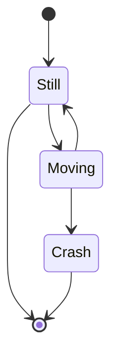
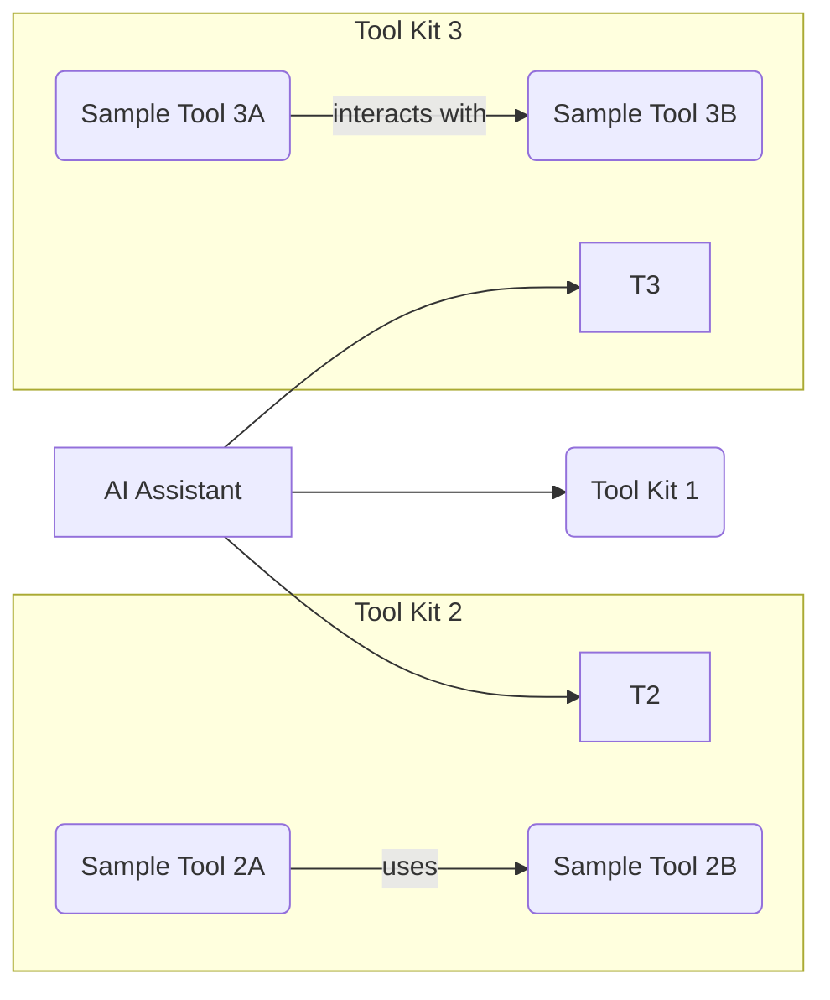

1. [What](#mcp) it is Model Context Protocol?
2. [MCP Examples](#mcp-examples)

* MCP server example from AlejandroAO that integrates the tools to Claude Desktop and Claude code (those being the MCP clients)
    * https://github.com/alejandro-ao/mcp-server-example

* [MCP with Streamlit and Ollama](#mcp-streamlit-ollama)
    * https://github.com/Nikunj2003/LLaMa-MCP-Streamlit

* MCP with LangChain
    * https://github.com/langchain-ai/langchain-mcp-adapters

https://mcpservers.org/servers/browsermcp/mcp

https://gofastmcp.com/clients/transports#sse-server-sent-events
https://github.com/jlowin/fastmcp

https://github.com/punkpeye/awesome-mcp-servers?tab=readme-ov-file#travel-and-transportation
https://github.com/githejie/mcp-server-calculator
https://mcpservers.org/servers/executeautomation/mcp-playwright
https://mcpservers.org/category/web-scraping
https://github.com/lastmile-ai/openai-agents-mcp

https://openai.github.io/openai-agents-python/mcp/#mcp-servers

## MCP

* https://github.com/modelcontextprotocol/python-sdk
    * https://github.com/modelcontextprotocol/python-sdk/issues


Very cool uses cases for MCP - https://github.com/punkpeye/awesome-mcp-servers


<!-- https://www.youtube.com/watch?v=HyzlYwjoXOQ&t=11s -->




**MCP** aka Model Context Protocol - https://openai.github.io/openai-agents-python/mcp/

* https://modelcontextprotocol.io/introduction

### Before Starting with MCP...


1. Agents


  
  


2. LangGraph vs LangChain

* **LangChain:** Primarily focuses on creating **linear or sequential graphs**, often represented as **Directed Acyclic Graphs (DAGs)**. The flow of execution typically moves in one direction without looping back in the same execution.

* **LangGraph:** Creates **stateful graphs** that allow for much more **complex workflows**. The key difference is the ability to have **cycles** and maintain a persistent **state** across the graph's execution. This enables iterative processes, conditional looping, multi-agent interactions with memory, and more dynamic control flow.

LangGraph builds upon the foundation of LangChain's capabilities but adds the crucial elements of state management and cyclical execution to handle more sophisticated and agentic applications.



Think about LangChain as the ~ building blocks and LangGraph as Orchestration Framework for Agents





- The system supports **dynamic state management**, maintaining context and ensuring coherent interactions across different agents.
- **Fault tolerance** is built in, meaning the system can recover from failures in individual agents.
- LangGraph is **flexible and customizable**, supporting custom agent logic and communication protocols.
- It is scalable, suitable for **enterprise-level applications**, and excels in handling complex workflows with a high volume of interactions.

- The framework is particularly useful for applications like **chatbots**, **retrieval-augmented generation (RAG)** systems, and **self-correcting agents**.

That's a nuanced but important distinction. Here's a breakdown:

**LangChain's Approach to Agents:**

* **Provides the Building Blocks:** LangChain offers a comprehensive set of modules and abstractions for building agents. This includes:
    * **Agent Types:** Various pre-designed agent architectures (like ReAct, OpenAI Functions Agent, etc.) that define how the agent reasons and acts.
    * **AgentExecutor:** A runtime that drives the agent's execution loop (observe, think, act).
    * **Tools:** Interfaces for agents to interact with the outside world (search, calculators, databases, etc.).
    * **Toolkits:** Collections of related tools.
    * **Prompting Strategies:** Guidelines for crafting prompts that guide the agent's behavior.
    * **Memory:** Components to allow agents to retain information from previous interactions.

* **Requires Assembly:** While LangChain provides all the necessary components, you still need to **assemble and configure** these pieces to create a functional agent. You choose the agent type, provide the LLM, select the tools, and set up the memory.

* **Focus on Flexibility:** LangChain's agent framework is designed to be flexible, allowing you to customize various aspects of the agent's behavior.

**LangGraph's Approach to Agents:**

* **Orchestration Framework for Agents:** LangGraph is specifically designed as an **orchestration framework** for building more complex and stateful **agentic workflows**. It provides a lower-level and more controllable way to define the interactions between different components, which are often agents themselves or tools used by agents.

* **Graph-Based Structure for Agent Interactions:** LangGraph uses a graph structure where nodes can represent individual agents, tools, or decision points. Edges define how the control and information flow between these nodes.

* **Emphasis on Stateful, Multi-Actor Systems:** LangGraph excels at managing the state of complex, multi-agent systems where different agents might need to collaborate, iterate, or react to each other's outputs over multiple steps.

* **Greater Control and Customization:** LangGraph offers more granular control over the agent's thought process and execution flow compared to some of LangChain's higher-level `AgentExecutor` abstractions. This allows for building highly customized agent behaviors, including human-in-the-loop integration and more sophisticated control logic.




**Recommendation for Building Agents:** The LangChain documentation itself now often **recommends using LangGraph for building agents**, especially for more sophisticated and customized use cases, as it overcomes some limitations of the traditional `AgentExecutor`.

**In essence:**

* **LangChain provides the foundational tools and concepts for building agents, but you need to put them together.** It offers various agent "recipes" (agent types) but still requires you to do the cooking.
* **LangGraph is a framework that helps you design and orchestrate the entire "kitchen" for complex agent interactions.** It gives you more control over how different agents and tools work together in a stateful and potentially cyclical manner.

It would be great if you **understand what state graphs** are: https://mermaid.js.org/syntax/stateDiagram.html or with https://graphviz.readthedocs.io/en/stable/
or....https://github.com/terrastruct/d2



Yes, that's correct! **LangGraph utilizes the concept of state graphs as its fundamental structure for defining the flow and logic of your LLM application or agent.** Understanding state graphs is key to effectively using LangGraph.

Think of a state graph as a way to model the different stages or conditions your application can be in, and how it transitions between these states based on certain events or outputs. In the context of LangGraph and LLMs, these states often represent the current information the agent has, the stage of a task it's in, or the outcome of a previous step.

Here's a breakdown to help you understand state graphs in LangGraph:

**Core Components of a LangGraph State Graph:**

1.  **Nodes:**
    * Represent individual steps or operations in your application's flow.
    * These nodes can be:
        * **LLM Calls:** Invoking a language model with a specific prompt.
        * **Tool Calls:** Executing external tools (like search engines, calculators, APIs).
        * **Functions:** Running Python code to process data or make decisions.
        * **Control Flow Logic:** Implementing conditional branching or loops.
    * Each node takes the current state as input and produces an output that updates the state.

2.  **Edges:**
    * Represent the transitions between nodes. They define the possible paths the application can take.
    * Edges can be:
        * **Direct Edges:** An unconditional transition from one node to the next. After one node finishes, the flow always goes to the connected node.
        * **Conditional Edges:** Transitions that depend on the output of a node or the current state. These allow for branching logic, where the next node to be executed is determined dynamically.

3.  **State:**
    * A central piece of information that is passed between nodes as the graph is traversed.
    * The state is typically a dictionary containing all the relevant data the application needs to operate, such as:
        * User input.
        * LLM outputs from previous steps.
        * Results from tool calls.
        * Internal variables or flags.
    * Each node in the graph takes the current state as input and returns an update to this state.

**How to Understand State Graphs in LangGraph:**

1.  **Visualize the Flow:** The best way to understand a LangGraph is often to visualize it. Imagine a flowchart where each box is a node (an action or step) and the arrows are the edges (transitions). Some arrows might have conditions attached to them.

2.  **Track the State:** Follow the state as it moves through the graph. See how each node consumes the current state and modifies it with its output. Understanding what information is being carried along is crucial.

3.  **Identify the Entry and Exit Points:** A LangGraph typically has a starting node where the process begins and potentially one or more end nodes or conditions where the process might terminate.

4.  **Analyze the Edges:** Pay close attention to the types of edges. Are they direct or conditional? What determines which path is taken when there are conditional edges? This reveals the decision-making logic of the graph.

5.  **Consider Cycles (Loops):** LangGraph allows for cycles in the graph, enabling iterative processes or the ability to revisit previous steps based on certain conditions. Understand what triggers these loops and how they eventually terminate.

**Analogy:**

Think of a board game with different spaces (nodes) and rules for moving between them (edges). The current position of your game piece and any resources you've collected (state) determine where you can go next. Some spaces might always lead to the same next space, while others might have different paths depending on a dice roll (a condition based on the output of a node).

**Example Scenario (Simplified):**

Imagine a simple agent that answers questions using a knowledge base. A LangGraph for this might look like:

1.  **`Get User Query` (Node):** Takes user input and adds it to the state.
2.  **`Determine Search Keywords` (Node/LLM Call):** Takes the user query from the state and uses an LLM to extract relevant keywords, updating the state with these keywords.
3.  **`Search Knowledge Base` (Node/Tool Call):** Takes the keywords from the state, performs a search, and adds the search results to the state.
4.  **`Generate Answer` (Node/LLM Call):** Takes the user query and search results from the state and uses an LLM to generate an answer, updating the state with the answer.
5.  **`Respond to User` (Node):** Takes the generated answer from the state and presents it to the user.

The edges would likely be direct transitions between these nodes in this simple example. A more complex scenario might involve conditional edges to handle cases where no relevant information is found in the knowledge base, requiring the agent to ask clarifying questions or try a different approach.





**In essence, understanding LangGraph's state graphs involves grasping how information flows through a series of interconnected steps, with the "state" acting as the central data container that is modified and used to make decisions about the next steps.** By visualizing the graph and tracking how the state evolves, you can gain a clear understanding of the application's logic and behavior.



3. What it is a RAG?


### MCP Examples

<!-- https://www.youtube.com/watch?v=Ek8JHgZtmcI&t=333s -->




Thanks to Alejandro for once again sharing the code - https://github.com/alejandro-ao/mcp-server-example




Agents call the LLMs more than once in a loop, that simulates a chain of thoughts process

1. Agents start with a **tought** with the first query
2. Thanks to the system prompts, it knows the available functions with the possible **actions** to take
3. the **observation** is the result of that action

> It can also be seen as: query -> think -> (this uses the same input/output protocol) -> iterate with tool kit -> respond

We are able to switch tool kits, or to add more, so that the agent can choose which one to use.



Every MCP server is going to be treated as a **toolbox**...



The idea of the MCP (protocol) is that we will be able to **connect a given app to the MCP servers** with tools that other people are building.


In rest APIs there are few http verbs like get, post, path, put, delete...with MCP, we are concerned mainly about resources (file, dbs...) and tools (action)


Thanks to **fastMCP** we can quickly build a **MCP Server**:

* https://github.com/jlowin/fastmcp
    * https://gofastmcp.com/getting-started/welcome

```sh
#uv add fastmcp
pip install fastmcp
#uv pip install fastmcp
```

> 🚀 The fast, Pythonic way to build MCP servers and clients


For that, **the app we are building must have an MCP client**: https://modelcontextprotocol.io/clients

* https://modelcontextprotocol.io/clients#claude-code

* https://github.com/continuedev/continue

* https://github.com/cline/cline
* https://github.com/lastmile-ai/mcp-agent
    * https://github.com/lastmile-ai/openai-agents-mcp

* https://modelcontextprotocol.io/clients#windsurf-editor
    * This was known as codeium!
* Agents can be aware of the tools inside the MCP server - https://openai.github.io/openai-agents-python/mcp/


And then, when connected to the server, it will have access to certain tools, custom prompts, resources like markdown... 

* See also - https://www.docker.com/blog/introducing-docker-mcp-catalog-and-toolkit/



Agents call the LLMs more than once in a loop, that simulates a chain of thoughts process

1. Agents start with a **tought** with the first query
2. Thanks to the system prompts, it knows the available functions with the possible **actions** to take
3. the **observation** is the result of that action

> It can also be seen as: query -> think -> (this uses the same input/output protocol) -> iterate with tool kit -> respond

We are able to switch tool kits, or to add more, so that the agent can choose which one to use.



* We will need - https://github.com/modelcontextprotocol/python-sdk

> MIT | The official Python SDK for Model Context Protocol servers and clients



All of this should resonate with [function calling](https://jalcocert.github.io/JAlcocerT/how-to-use-openai-function-calling/) and **proper doc string** so that the LLM knows which tool is the appropiate one



Currently, the MCP spec defines [two kinds of servers](https://openai.github.io/openai-agents-python/mcp/#mcp-servers), based on the **transport mechanism** they use:

1. **stdio** servers run as a subprocess of your application. You can think of them as running "locally".
2. **HTTP over SSE** servers run remotely. You connect to them via a URL.

The docs from fastMCP explains the details perfectly: https://gofastmcp.com/servers/fastmcp#transport-options




1. The standard input/output (STDIO) transport is the default and most widely compatible option:


* The client starts a new server process for each session
* Communication happens through standard input/output streams
* The server process terminates when the client disconnects

```py
from mcp.server.fastmcp import FastMCP

if __name__ == "__main__":
    mcp.run(transport="stdio")
```

2. For long-running servers that **serve multiple clients**, FastMCP supports SSE:


* The server runs as a persistent web server
* Multiple clients can connect simultaneously
* The server stays running until explicitly terminated
* This is ideal for remote access to services


```py
# Configure with specific parameters (Synchronous run)
mcp.run(
    transport="sse", 
    host="127.0.0.1",  # Override default host
    port=8888,         # Override default port
    log_level="debug"  # Set logging level
)

# You can also run asynchronously with the same parameters
# import asyncio
# asyncio.run(
#     mcp.run_sse_async(
#         host="127.0.0.1", 
#         port=8888, 
#         log_level="debug"
#     )
# )
```

* Synchronous code is generally easier to understand and reason about because the operations happen sequentially. You execute a line, it finishes, and then the next line executes.
    * Suitable for: Tasks that are relatively quick or where you don't need to perform other operations concurrently while this task is running.


Given that multiple users will be accessing the deployed app on a central server, **Server-Sent Events (SSE)** is likely the more appropriate approach to consider over standard input/output (stdio) for real-time or near real-time data updates. Here's why:

**Server-Sent Events (SSE)**

* **Unidirectional Real-time Communication:** SSE is designed for efficient one-way communication from the server to the clients. This is ideal for scenarios where the server needs to push updates to the users without the overhead of continuous client requests. Think of live dashboards, notification feeds, or progress updates.
* **Resource Efficiency:** For pushing data, SSE is generally more resource-efficient than constantly polling the server via HTTP requests (which is a common workaround if you're not using a push technology). Each HTTP request involves overhead (headers, connection setup), whereas an SSE connection is persistent, reducing this overhead for subsequent updates.
* **Simplicity and Standard:** SSE is built on standard HTTP and is relatively straightforward to implement on both the server and client-side using standard browser APIs (EventSource).
* **Automatic Reconnection:** The SSE specification includes automatic reconnection capabilities, which can improve the robustness of your application in the face of network hiccups.

**Standard Input/Output (stdio)**

* **Primarily for Local Interaction:** Stdio (standard input, standard output, standard error) is fundamentally designed for interaction between a process and its **local environment** (e.g., a user typing commands in a terminal, or a script reading from a file and writing to the console).
* **Not Designed for Concurrent Network Communication:** Stdio is not inherently built for handling multiple concurrent network connections from different users on a server. Managing concurrent input and output streams for numerous users would be complex and likely inefficient.
* **Limited in Web Applications:** In the context of a web application deployed on a central server, direct interaction with stdio for each user session is not a standard or scalable architecture. Web servers typically handle requests and responses using network protocols like HTTP.

**Why SSE is Better for Your Use Case:**

Considering your requirement for a centrally deployed application serving multiple users, you'll likely need to push updates or data to these users asynchronously.

SSE provides a clean and efficient way to achieve this without the need for each user to constantly request updates. This reduces server load and network traffic compared to polling.




**In summary**, for a PoC where a central server needs to provide updates to multiple concurrent users, Server-Sent Events (SSE) offers a more suitable and efficient architecture than relying on standard input/output.


> MCP servers can be added to Agents!

The Agents SDK will call `list_tools()` on the MCP servers each time the Agent is run.

This makes the LLM aware of the MCP server's tools. When the LLM calls a tool from an MCP server, the SDK calls `call_tool()` on that server.

* https://github.com/openai/openai-agents-python/tree/main/examples/mcp

```sh
#git clone https://github.com/openai/openai-agents-python
git clone https://github.com/JAlcocerT/openai-agents-python
cd examples/mcp
```

```sh
#python -m venv solvingerror_venv #create the venv
python3 -m venv mcp_venv #create the venv

#solvingerror_venv\Scripts\activate #activate venv (windows)
source mcp_venv/bin/activate #(linux)
```

**Install dependencies** with:

```sh
#pip install openai-agents==0.0.12
pip install -r requirements.txt #all at once
#pip freeze | grep langchain

#pip show openai-agents
#pip list
pip freeze > requirements-output.txt #generate a txt with the ones you have!
```

<!-- https://www.youtube.com/watch?v=KHDMoQ2Sp2s -->



Model Context Protocol (MCP) is an open standard designed to **connect large language models (LLMs) with external data sources and tools**, allowing these models to access and interact with real-world information more effectively.

This protocol, introduced by Anthropic, simplifies the integration process for developers, making it easier to build context-aware applications without the need for custom coding for each combination of AI model and external system.


#### MCP Streamlit Ollama


Thanks to https://github.com/Nikunj2003/LLaMa-MCP-Streamlit


```sh
git clone https://github.com/JAlcocerT/LLaMa-MCP-Streamlit

```

This is going to use all the playwright tools: https://github.com/executeautomation/mcp-playwright at the `mcp_server.py`

But people are already doing cool things...https://github.com/mcpdotdirect/evm-mcp-server or https://github.com/strowk/mcp-k8s-go

```py
from mcp import StdioServerParameters

server_params = StdioServerParameters(
    command="npx",
    args=["-y", "@executeautomation/playwright-mcp-server"],
    env=None,
)
```


> Playwright Model Context Protocol Server - Tool to automate Browsers and APIs in Claude Desktop, Cline, Cursor IDE..... 🔌


#### MCP with LangChain

This library provides a lightweight wrapper that makes Anthropic Model Context Protocol (MCP) tools compatible with LangChain and LangGraph.

<!-- https://www.youtube.com/watch?v=hccNm88bk6w -->




* https://github.com/langchain-ai/langchain-mcp-adapters
    * https://pypi.org/project/langchain-mcp-adapters/

Understand first:

* https://pypi.org/project/langgraph/
    * https://github.com/langchain-ai/langgraph
    * https://langchain-ai.github.io/langgraph/

[](https://star-history.com/langchain-ai/langgraph&Date)


[](https://star-history.com/langchain-ai/langchain&langchain-ai/langgraph&Sinaptik-AI/pandas-ai&mlflow/mlflow&langfuse/langfuse&Date)


LangGraph works with multiple LLM providers:


  
  


> 🛠️ Convert MCP tools into LangChain tools that can be used with LangGraph Agents


For observability, you can plug langgraph with langfuse - https://langfuse.com/docs/integrations/langchain/example-python-langgraph



  



  


<!--  -->


{}

Think of it as a way to orchestrate complex, multi-actor workflows in a more structured and robust manner than just chaining together LangChain components.

**What is LangGraph?**

At its core, LangGraph allows you to define a **stateful graph** where each node in the graph represents a step in your workflow. These steps can involve:

* **LLM calls:** Interacting with language models.
* **Tools:** Executing external functions or APIs (like search, calculators, databases).
* **Conditional logic:** Making decisions based on the current state.
* **Loops:** Repeating steps based on certain conditions.
* **Transitions:** Defining how the workflow moves from one node to another.

The "stateful" aspect is crucial. LangGraph manages a state object that evolves as the workflow progresses through the graph. Each node can update this state, and subsequent nodes can access and utilize the information in the state. This makes it easier to build more sophisticated and context-aware applications.

<!-- https://www.youtube.com/watch?v=OX89LkTvNKQ -->



https://langchain-ai.github.io/langgraph/agents/mcp/


**Key Concepts in LangGraph:**

* **Nodes:** The building blocks of your graph. Each node typically performs a specific action (e.g., call an LLM, use a tool).
* **Edges:** Define the transitions between nodes. You can have simple linear transitions or more complex conditional transitions.
* **State:** A shared object that holds information relevant to the entire workflow. Nodes can read from and write to this state.
* **Graph:** The overall structure that connects nodes and edges, defining the flow of the application.

**Can LangGraph be used with Agents?**

**Absolutely, and this is one of its most powerful use cases!** LangGraph is specifically designed to address some of the complexities involved in building and managing sophisticated agent workflows.

Here's why LangGraph is a great fit for agents:

* **Structured Agent Loops:** Traditional LangChain agents often involve a loop of "observe-think-act". LangGraph provides a more explicit and manageable way to define this loop as a cycle within the graph. You can clearly define the "observe" node (e.g., getting the latest tool output), the "think" node (the LLM deciding the next action), and the "act" node (executing a tool).
* **Complex Decision Making:** Agents often need to make complex decisions about which tool to use or how to respond. LangGraph's conditional edges allow you to define different paths in the graph based on the LLM's output or the current state. For example, if the LLM decides to use a search tool, the workflow can transition to a "search" node; otherwise, it might transition to a "final answer" node.
* **Handling Multiple Actors:** In more advanced agent scenarios, you might have multiple "actors" or specialized agents working together. LangGraph can represent these different actors as nodes in the graph, with clear transitions defining how they interact and pass information.
* **Improved Observability and Debugging:** The explicit graph structure in LangGraph can make it easier to understand the flow of your agent and debug issues. You can visualize the graph and track the state as it evolves through the different nodes.
* **State Management for Context:** Agents need to maintain context over multiple interactions. LangGraph's state management makes it easier to carry information (like previous observations, goals, and intermediate results) between different steps in the agent's reasoning process.
* **Customizable Agent Behavior:** LangGraph provides a flexible framework for building agents with highly customized behaviors. You're not limited to predefined agent types; you can design the exact flow and decision-making process you need.

LangGraph is a powerful tool for building more complex and manageable workflows, and it's particularly well-suited for creating sophisticated and customizable agents with structured reasoning and decision-making processes.

{}

**In essence, LangGraph provides a more robust and structured way to build the "control flow" of your agents.** Instead of relying on the often implicit looping and decision-making within the agent's prompt and LLM output parsing, LangGraph makes these aspects explicit in the graph definition.


{}

LangChain's core concept for structuring sequences of operations is indeed **chains**, and these chains are typically represented as **Directed Acyclic Graphs (DAGs)**.

**Directed Acyclic Graph (DAG):**

* **Directed:** The flow of data and execution has a specific direction from one step to the next.
* **Acyclic:** There are no loops or cycles in the graph. Once a step is executed, you don't go back to a previous step in the same execution flow.

This DAG structure is excellent for many tasks where you have a clear sequence of operations, like:

* Retrieval then generation
* Summarization of multiple documents
* Question answering over a knowledge base

**LangGraph's Structure:**

LangGraph, on the other hand, is built around the concept of **Stateful Graphs**. While it can certainly represent DAGs, its key advantage lies in its ability to create more complex workflows that can include **cycles**.

**Stateful Graph:**

* **Nodes:** Represent individual steps or actors (which can be LangChain runnables, tools, or even other LangGraph graphs).
* **Edges:** Define the transitions between nodes. LangGraph supports different types of edges, including:
    * **Direct Edges:** Unconditional flow from one node to another.
    * **Conditional Edges:** The next node to execute is determined based on the current state of the graph.
    * **Cyclic Edges:** Allow the workflow to loop back to previous nodes based on certain conditions.
* **State:** A central piece of data that is passed between nodes and can be updated by them. This state allows the graph to maintain context across multiple steps and iterations.

**How LangGraph Enables More Complex Workflows:**

The ability to have cycles and manage state explicitly allows LangGraph to implement more sophisticated agentic behaviors, such as:

* **Iterative Reasoning:** An agent might go through a thought-process loop multiple times, refining its answer or plan based on intermediate results.
* **Tool Use with Feedback:** An agent can use a tool, observe the result, and then decide whether to use another tool, revise its approach, or respond to the user. This often involves looping back to a decision-making step.
* **Multi-Agent Collaboration:** Different agents can interact and exchange information within the graph, with the flow of interaction potentially involving cycles until a final goal is reached.
* **Human-in-the-Loop:** The graph can pause at certain points to get human feedback and then resume execution based on that input, potentially revisiting previous steps.


{}


**In essence:**

* **LangChain** focuses on building linear/sequential or acyclic sequences (DAGs) of operations.
* **LangGraph** provides a framework for building more complex, **stateful workflows that can include cycles**, enabling more advanced agentic capabilities.

Think of LangChain as providing the individual building blocks and simple recipes, while LangGraph provides a more advanced orchestration system that allows you to create intricate and dynamic processes with feedback loops and persistent memory.


LangGraph can structure the core agent loop of thinking, acting (using a tool), and observing the result, with clear conditions for continuing the loop or finishing.


* https://github.com/von-development/awesome-LangGraph

>  A curated list of awesome projects, resources, and tools for building stateful, multi-actor applications with LangGraph 🦜🕸️ 

<!-- https://www.youtube.com/watch?v=WAV66F-Zbio -->




#### MCP with LangGraph

* https://pypi.org/project/langgraph/
* https://github.com/esxr/langgraph-mcp/tree/main
    * https://github.com/esxr/langgraph-mcp/blob/main/src/langgraph_mcp/mcp_wrapper.py
* https://langchain-ai.github.io/langgraph/agents/mcp/
* https://github.com/esxr/langgraph-mcp/blob/main/src/langgraph_mcp/mcp_wrapper.py

<!-- https://www.youtube.com/watch?v=OX89LkTvNKQ -->




If you inspect the https://github.com/esxr/langgraph-mcp repository, you will see dependencies on:

1. MilvusDB - https://github.com/JAlcocerT/Docker/tree/main/AI_Gen/Z_VectorDBs/MilvusDB
2. OpenAI API Key
3. LangSmith (optional for monitoring LLM)


#### Generating project Docs with LLMs


---


## Conclusions


### Interesting MCP Servers

1. https://github.com/executeautomation/mcp-playwright?tab=readme-ov-file

> Playwright Model Context Protocol Server - Tool to automate Browsers and APIs in Claude Desktop, Cline, Cursor IDE and More 🔌