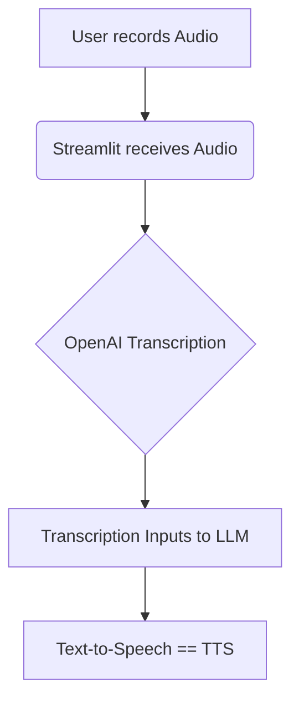

**Tl;DR**

Creating a streamlit app that rates your speech based on **OpenAI TTS/S2T capabilities**.

**Intro**

An overview to the existing open source alternatives for audio to text conversion (also called Speech to Text).

But first: how to [create a PoC](#the-speech-rater) to help people get better at public speaking.

## The Speech Rater

How about using streamlit to input and output audio?

Well, plugging LLMs to that is kind of easy:



  
  



  
    
    
    
    
    
      
    
    
      
    
    
      
      
      
      
      
    
  


It was all about getting the [streamlit audio part right](#streamlit-audio).



## S2T

The process of converting spoken words into written text is called **transcription**.

The output of this process is also often referred to as a transcript.



Make sure to have the right PyTorch installed: https://pytorch.org/get-started/locally/



### OpenAI Whisper

This one requires OpenAI API Key.

But its worth to give it a try.

* https://github.com/openai/whisper (MIT Licensed ❤️)
  * https://pypi.org/project/whisper/#history

> MIT | Robust Speech Recognition via Large-Scale Weak Supervision

* <https://www.reddit.com/r/Python/comments/xqlay2/speech_to_text_that_actually_works_my_first/>



  
  



### Ecoute

* Project Source Code: https://github.com/SevaSk/ecoute
    * License: [MIT](https://github.com/SevaSk/ecoute?tab=MIT-1-ov-file#readme)

> Ecoute is a live transcription tool that provides real-time transcripts for both the user's microphone input (You) and the user's speakers output (Speaker) in a textbox. 


```sh
git clone https://github.com/SevaSk/ecoute
cd ecoute
```

```sh
#python -m venv solvingerror_venv #create the venv
python3 -m venv ecoute_venv #create the venv

#solvingerror_venv\Scripts\activate #activate venv (windows)
source ecoute_venv/bin/activate #(linux)


pip3 install torch torchvision torchaudio --index-url https://download.pytorch.org/whl/cpu
```

```sh
pip install -r requirements.txt
pip install whisper==1.10.0
```

* <https://pypi.org/project/whisper/#history>


```sh
#OPENAI_API_KEY="sk-somekey" #linux
#$Env:OPENAI_API_KEY = "sk-somekey" #PS
 #cmd
```

#### ecoute requirements

* Record Audio from speakers: <https://github.com/s0d3s/PyAudioWPatch>
  * https://pypi.org/project/PyAudioWPatch/#history



The project has **only wheels for Windows**, and your system is not Windows, hence the error


* OpenAI Whisper: <https://pypi.org/project/openai-whisper/#history>





```sh
python main.py
# python main.py --api
```

```Dockerfile
# Use the specified Python base image
FROM python:3.10-slim

# Set the working directory in the container
WORKDIR /app

# Install necessary packages
RUN apt-get update && apt-get install -y \
    git \
    build-essential

#choco install ffmpeg

# Clone the private repository
RUN git clone https://github.com/SevaSk/ecoute

WORKDIR /app/ecoute

# Copy the project files into the container
COPY . /app

RUN pip install -r requirements.txt

# Keep the container running
#CMD ["tail", "-f", "/dev/null"]

```

Ecoute is a live transcription tool that provides real-time transcripts for both the user's microphone input (You) and the user's speakers output (Speaker) in a textbox.

It also generates a suggested response using OpenAI's GPT-3.5 for the user to say based on the live transcription of the conversation.

```sh
docker build -t ecoute .
#docker tag ecoute docker.io/fossengineer/ecoute:latest
#docker push docker.io/fossengineer/ecoute:latest
```

```yml
#version: '3'

services:
  ai-ecoute:
    image: fossengineer/ecoute  # Replace with your image name and tag
    container_name: ecoute
    ports:
      - "8001:8001"
    volumes:
      - ai-privategpt:/app
    command: /bin/bash -c "main.py && tail -f /dev/null" #make run
    
volumes:
  ai-ecoute:

```




### oTranscribe

* https://github.com/oTranscribe/oTranscribe
  * <https://otranscribe.com/>

> MIT |  A free & open tool for transcribing audio interviews 

### WriteOutAI

* https://github.com/beyondcode/writeout.ai

> MIT |  Transcribe and translate your audio files - for free 


### WHISHPER

* https://github.com/pluja/whishper
* https://whishper.net/

>  aGPL | Transcribe any audio to text, translate and edit subtitles 100% locally with a web UI. Powered by whisper models! 



  




  



* https://whishper.net/guides/install/


  
  


---

## Conclusions

Now we have seen the differences between **TTS and S2T** (Transcription) frameworks out there!

Time to do [cool things](https://github.com/JAlcocerT/Streamlit-MultiChat/blob/main/Z_Tests/OpenAI/Audio/audio-input.py) with them.

Like...putting together a *voice assistant* with Streamlit:



  
  


For TTS, lately OpenAI have made interesting upgrades, with [4o-mini](https://platform.openai.com/docs/models/gpt-4o-mini-tts).

* Voice Synthesis: TTS systems use various techniques to create synthetic voices. E
  * arly systems used concatenative synthesis (piecing together recorded human speech), while modern systems often use more advanced techniques like statistical parametric synthesis and neural network-based synthesis, which can produce more natural-sounding speech.   

### Streamlit Audio

With the `st.audio_input` component, a lot of cool stuff can be done: https://docs.streamlit.io/develop/api-reference/widgets/st.audio_input

See `st.audio_input` - https://docs.streamlit.io/develop/api-reference/widgets/st.audio_input

**Thanks to Benji** youtube video: https://www.youtube.com/watch?v=UnjaSkrfWOs



I have added a sample working script at the [MultiChat project](https://github.com/JAlcocerT/Streamlit-MultiChat), here: https://github.com/JAlcocerT/Streamlit-MultiChat/blob/main/Z_Tests/OpenAI/Audio/audio-input.py

See also [another way to do T2S](https://github.com/JAlcocerT/Streamlit-MultiChat/blob/main/Z_Tests/OpenAI/openait2a.py) with openAI: https://github.com/JAlcocerT/Streamlit-MultiChat/blob/main/Z_Tests/OpenAI/Audio/openai-tts.py

### More Audio Generation

1. https://github.com/SevaSk/ecoute
2. https://pypi.org/project/PyAudioWPatch/#description

**TRY Ecoute IN WINDOWS**

```sh
python3 -m venv ecoutevenv
source ecoutevenv/bin/activate

apt install ffmpeg

git clone https://github.com/SevaSk/ecoute ./ecoute_repo
cd ecoute_repo
python -m pip install -r requirements.txt

chmod +x cygwin_cibuildwheel_build.sh

./cygwin_cibuildwheel_build.sh

#deactivate
```

3. LocalAI - With **voice cloning**! The reason why I dont like to put my voice over the internet :)

* https://github.com/mudler/LocalAI/
  * https://github.com/mudler/LocalAI/blob/master/docker-compose.yaml

> Runs gguf, transformers, diffusers and many more models architectures. Allows to generate Text, Audio, Video, Images. **Also with voice cloning capabilities.**

4. [Willow on GitHub](https://github.com/toverainc/willow). See [HeyWillow](https://heywillow.io/#)

> Apache v2 | Open source, local, and self-hosted Amazon Echo/Google Home competitive Voice Assistant alternative


5. [Zonos](https://noted.lol/zonos/): eleven labs alternative

* https://github.com/Zyphra/Zonos

> Zonos-v0.1 is a leading **open-weight text-to-speech** model trained on more than 200k hours of varied multilingual speech, delivering expressiveness and quality on par with—or even surpassing—top TTS providers.

> > Found out about it at https://noted.lol/zonos/