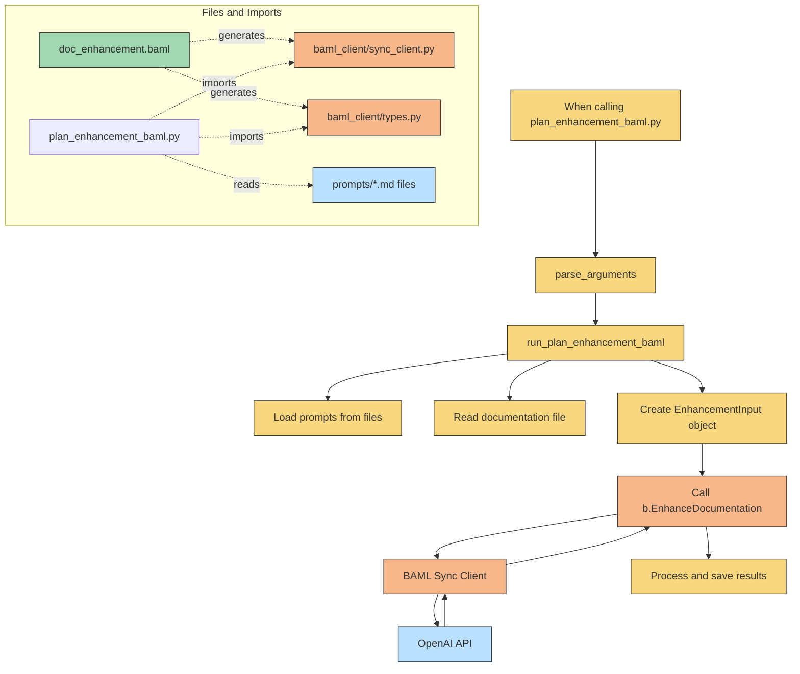

**TL;DR**

* See how to use [GeminiCLI](#gemini)
* More [MCP via Gemini](#gemini-cli-x-mcp) and [better MCP](#more-mcp-tools)
* Recap on Codex and Claude Code
* Bonus: See how to do cool **type safe LLM calls** via [BAML](#baml)


  



## Gemini

Gemini models are great: https://ai.google.dev/gemini-api/docs/models#gemini-2.5-flash

Specially their very high **context window of 1M tokens**

And as of now, they are on top of the LLM Leaderboard: https://lmarena.ai/leaderboard

Querying Gemini was as simple as getting your [API Key](https://aistudio.google.com/app/apikey) and doing:


Your `.env` definition:

```sh
GEMINI_API_KEY=some-apikey
GOOGLE_CLOUD_PROJECT="project-whatever"
```

Then execute:

```sh
#source .env
curl "https://generativelanguage.googleapis.com/v1beta/models/gemini-2.0-flash:generateContent?key=${GEMINI_API_KEY}" \
  -H 'Content-Type: application/json' \
  -X POST \
  -d '{
    "contents": [
      {
        "parts": [
          {
            "text": "Explain how AI works in a few words"
          }
        ]
      }
    ]
  }'
```




```sh
npx https://github.com/google-gemini/gemini-cli
export GOOGLE_CLOUD_PROJECT="YOUR_PROJECT_ID"
#gemini
#npx https://github.com/google-gemini/gemini-cli -y && gemini
```

```sh
#source .env
curl "https://generativelanguage.googleapis.com/v1beta/models/gemini-2.0-flash:generateContent?key=${GEMINI_API_KEY}" \
  -H 'Content-Type: application/json' \
  -X POST \
  -d '{
    "contents": [
      {
        "parts": [
          {
            "text": "Explain how AI works in a few words"
          }
        ]
      }
    ]
  }'
```

---


Could you look at the structure of the input-sources/sdlc-speedup folder and generate a documentation for Skeleton for it?


Your task is to create **technical documentation for the SpeedUp cloned project** and write a post as markdown file where specified.


**Output Format (Astro Theme Template):**

The final documentation should be formatted to be easily integrated with the Astro theme located at `/home/jalcocert/Desktop/IT/project-documentation-generator-geminiCLI/docs/src/content/docs/reference`.

Please consider the following:

* **Markdown Output:** Generate the documentation in Markdown format (`.md` files) as this is the primary format for Astro content.
* **Frontmatter:** Respect the following Astro frontmatter at the beginning of each Markdown file (e.g., `title`, `description`)

* Add H2/H3 and bullet points to structure the information of the post
* Provide a final section in H2 to the post so that we can see the files that have been used to generate it
* Make a plan also as per the information of the tree -L commands to enhance the documentation at a later stage.
* Inspect also the most likely files of the project to provide value and direction on tech details
* Consider information like repository structure and real app files, not markdowns

---

could you write one post for each front end component? 



You could also do these queries to [Gemini with python](https://ai.google.dev/gemini-api/docs/quickstart?lang=python)

### Gemini CLI

* https://github.com/google-gemini/gemini-cli

```sh
npx https://github.com/google-gemini/gemini-cli #one time install
#npm install -g @google/gemini-cli #global install
gemini

gemini --prompt "are you able to be queried with non interactive mode?" -m gemini-2.5-flash --yolo --debug
```


The flags used for Gemini are:

`--yolo` automatically accepts all actions
`--debug` shows debug information
`--model` allows to specify the model to use

* https://developers.google.com/gemini-code-assist/auth/auth_success_gemini

<!-- https://www.youtube.com/watch?v=KUCZe1xBKFM -->



**Gemini CLI via API Key**  https://aistudio.google.com/app/apikey


I had to login via API key as per:


As I could not do it via [regular google auth](https://github.com/google-gemini/gemini-cli/issues/1901)


> You could do it as per [this issue](https://github.com/google-gemini/gemini-cli/issues/1502#issuecomment-3007518759)

* https://console.cloud.google.com/welcome?hl=en&inv=1&invt=Ab1Jlw&project=starlit-advice-464112-j9
* https://console.developers.google.com/apis/api/cloudaicompanion.googleapis.com
* https://console.cloud.google.com/apis/dashboard


```sh
#source .env && npx https://github.com/google-gemini/gemini-cli && gemini
export GOOGLE_CLOUD_PROJECT="xxxx" && gemini
```


> Be aware of the costs: https://aistudio.google.com/app/usage

#### Gemini CLI x MCP

A very interesting feature is the MCP integration https://github.com/google-gemini/gemini-cli/blob/main/docs/cli/configuration.md

As seen here, we can use MCP Tools with [windsurf, like Context7](https://jalcocert.github.io/JAlcocerT/ai-understanding-mcp-framework/#context7-with-windsurf-ide).

But how to add it to Gemini CLI?

```sh
gemini
/mcp
```

You will just need a `/.gemini/settings.json` as per [the docs](https://github.com/google-gemini/gemini-cli/blob/main/docs/cli/configuration.md)

And just add some [MCP server connection](https://geminicli.com/docs/tools/mcp-server/) like:

```json
{
    "theme": "Default", // Keep any existing settings
    "mcpServers": {
      "context7": {
        "url": "https://mcp.context7.com/sse"
      }
    }
  }
```

Once logged in again to GeminiCLI, you will get access to the MCP tools:


See how GeminiCLI works **plugged to MCP**:


#### Gemini CLI x Git-MCP

What else can be connected to Gemini via MCP?

PRety much anything: https://github.com/punkpeye/awesome-mcp-servers

**For example** - https://github.com/idosal/git-mcp

> Apache v2 | Put an end to code hallucinations! GitMCP is a free, open-source, remote MCP server for any GitHub project

You can add it to Windsurf by: https://gitmcp.io/openai/codex or https://gitmcp.io/google-gemini/gemini-cli

```json
{
  "mcpServers": {
    "gitmcp": {
      "serverUrl": "https://gitmcp.io/google-gemini/gemini-cli"
    },
    "context7": {
      "command": "npx",
      "args": ["-y", "@upstash/context7-mcp"]
    }
  }
}
```


See how you can use mcp with windsurf:


#### Gemini CLI x Databases

* https://github.com/runekaagaard/mcp-alchemy

#### Logging GeminiCLI

```sh
#npx https://github.com/google-gemini/gemini-cli -y && gemini
gemini --debug -p "How do I use the Gemini CLI to log my thinking process?"
```


### Other CLI Tools

These 2 I already have tested and covered on [this post](https://jalcocert.github.io/JAlcocerT/vide-coding/#openai).

#### Codex CLI

If you like **OpenAI taste**: https://platform.openai.com/docs/guides/tools-image-generation

* https://platform.openai.com/usage
* https://platform.openai.com/docs/models
    * https://platform.openai.com/chat/edit?models=o1

You can get started as per [openai manual](https://help.openai.com/en/articles/11096431-openai-codex-cli-getting-started)

```sh
#codex
codex --approval-mode full-auto
#codex --provider openai --model o3-mini --quiet --approval-mode full-auto "$(cat ./prompts/codex-tree-stack-components.md)" > ./Outputs_Model/output-codex-tree-stack-components-plan.json #saved the full reply with errors 
```

If you have containerized codex:

```sh
docker exec -it codex-container bash
docker exec -it codex-container bash -c "uv run endtoend.py"

#docker exec -t codex-container bash -c "cd /app/input-sources && codex --provider openai --model o4-mini --quiet --approval-mode full-auto \"$$(cat ./orchestrator/prompts/prompt-init-userguide-iterative.md)\" > .//output-init-userguide-iterative.json"
#docker exec -t $DOCKER_ENV_VARS "$CONTAINER_NAME" bash -c "cd /app/input-sources && $CODEX_COMMAND"
#codex --provider openai --model o4-mini --quiet --approval-mode full-auto "who are you"
#codex --provider openai --model o4-mini --quiet --approval-mode full-auto "$$(cat ./orchestrator/prompts/prompt-init-userguide-iterative.md)" > ./outputs_model/output-init-userguide-iterative.json

#Dev Containers: attach to running container
```

Remember that the quiet mode always requires a string with the question already passed!

And use your favourite model: https://platform.openai.com/docs/models Which at this point offer a **200k context Window**

You could say that at this point o3 > o1 > 4o / GPT 4.1:

```sh
codex --provider openai --model gpt-4.1-mini #32k tokens
codex --provider openai --model gpt-4.1-nano #8k tokens
```

```sh
codex --approval-mode full-auto "create the fanciest todo-list app" --provider ollama

#codex
#/model

#codex -m o3-mini
#codex --provider openai --model o3-mini "Please create a data analysis script that cleans data"
codex --provider openai --model o3-mini --quiet --approval-mode full-auto "$(cat ./prompts/codex-tree-stack-components.md)" > ./Outputs_Model/output-codex-tree-stack-components-plan.json #saved the full reply with errors 
```

Remember that using providers you will get some associated cost. Like: https://platform.openai.com/usage


#### Claude Code

With Anthropic, you have the magestic Claude 4 Opus - https://www.anthropic.com/claude/opus

```sh
npm install -g @anthropic-ai/claude-code
```

Same as GeminiCLI, it can also be connected to MCP: https://docs.anthropic.com/en/docs/claude-code/mcp

Also with **200K context window**.

They have added interesting features in the meantime: subagents and also MCP calls

See details at: 
* https://github.com/davepoon/claude-code-subagents-collection
* https://docs.anthropic.com/en/docs/claude-code/sub-agents


#### Claude Task Master

If you are familiar with **BRD/PRD** and similar project management concepts, Claude Task Master is a tool that can create ai driven projects in such a way.

* https://github.com/eyaltoledano/claude-task-master

From my experience, a good Cursor/Windsurf rule/guideline also does the trick: https://windsurf.com/editor/directory

#### Goose

* https://github.com/block/goose
  * https://block.github.io/goose/docs/experimental/subagents/
  * https://block.github.io/goose/docs/guides/goose-cli-commands/

See how to setup Goose:


## More MCP Tools

[Git MCP](#gemini-cli-x-git-mcp) was a great discovery. 

Same as [Context7 MCP](https://jalcocert.github.io/JAlcocerT/ai-understanding-mcp-framework/#context7-with-windsurf-ide).

And the fact that GeminiCLI can be connected to MCP is amazing.

But there are other interesting MCP tools already...


Which can be discovered from within Windsurf's MCP store!

### Scrira MCP Chat

* https://github.com/zaidmukaddam/scira-mcp-chat
   * https://mcpchat.scira.ai/chat/

>  Apache v2 | A minimalistic MCP client with a good feature set. 

## BAML

Last year I got to learn a little bit about [OpenAI Function Calling here](https://jalcocert.github.io/JAlcocerT/how-to-use-openai-function-calling/).




- **Standard OpenAI Function Calling**: More direct, but less type-safe and more verbose
- **BAML Approach**: More structured, type-safe, and maintainable, but requires learning BAML

Standard OpenAI function calling involves:

1. **Manual Schema Definition**: You define JSON schemas for functions directly in your code
2. **Manual Execution**: You intercept function calls and execute them yourself
3. **Manual Response Handling**: You parse and process the results manually
4. **No Type Safety**: No compile-time checking of parameters or return types

Choose based on your project's needs:

- For quick prototypes or small scripts: Standard OpenAI approach
- For larger applications, complex schemas, or team development: BAML approach

While it requires **learning BAML syntax** and adding a code generation step, the benefits outweigh these costs for any project that needs reliable, maintainable AI integrations.

The BAML approach is particularly valuable for:

- Projects with complex JSON schemas
- Teams where different people work on models vs. business logic
- Production systems where type safety and reliability are important
- Applications that need to evolve their schemas or prompts over time

**Further `.md` and tests can be found**:  https://github.com/JAlcocerT/Streamlit-MultiChat/tree/main/Z_Tests/OpenAI/BAML




> BAML uses Pydantic model under the hood as well!


* https://marketplace.visualstudio.com/items?itemName=Boundary.baml-extension
* https://docs.boundaryml.com/home
  * https://gitmcp.io/BoundaryML/baml - This can be added to windsurf as MCP reference about BAML via SSE
  * https://gitmcp.io/BoundaryML/baml/chat - Or just ask via web UI

```sh
ext install Boundary.baml-extension
```
You might hear about BAML as per its **type safe guarantees for LLMs**:
<!-- https://www.youtube.com/watch?v=XwT7MhT_BEY -->



When comparing with BAML, you can see several key differences:

1. Type Safety:

* Without BAML: You manually define JSON schemas, no compile-time checking
* With BAML: Types are checked at compile time with [Pydantic](https://jalcocert.github.io/JAlcocerT/data-analytics-concepts/#data-validation)

2. Configuration vs. Code:

* Without BAML: Function definitions are mixed with business logic
* With BAML: Function definitions are in declarative BAML files

3. Maintenance:

* Without BAML: Parameter changes require code updates in multiple places
* With BAML: Changes in one BAML file propagate to generated code


> "*Every system in the world should be able to run LLMs, not just Python*. Vaibhav Gupta."

* https://github.com/BoundaryML/baml
* https://pypi.org/project/baml-py/

For a python project with uv:

```sh
uv init
uv add baml-py
#uv sync
```

> **Apache v2** | The AI framework that adds the **engineering to prompt engineering** (Python/TS/Ruby/Java/C#/Rust/Go compatible)

BAML, which stands for "Basically a Made-up Language," is an open-source AI framework designed to bring traditional software engineering rigor and best practices to the development of applications that utilize Large Language Models (LLMs).

Essentially, it offers a **structured and type-safe way to define and manage how you interact with LLMs**, moving beyond simple text prompts to a more robust, function-based approach.




BAML helps you be better with LLMs by addressing several common pain points in LLM application development. 

Firstly, it transforms raw LLM prompts into defined "functions" with **specific input parameters and expected output types**.

This "schema engineering" ensures that your LLM outputs are reliable and consistently formatted, significantly reducing parsing errors and the need for complex error handling.

Secondly, it drastically **improves iteration speed with built-in IDE tooling and a "playground"** that allows you to visualize and test your prompts rapidly, speeding up development cycles and enabling quicker experimentation with different ideas.

Finally, BAML promotes maintainability and scalability by **abstracting away the complexities of integrating with various LLM providers**, offering features like model rotation, retry policies, and fallbacks, all while generating type-safe client code for multiple programming languages.



> The core of BAML are RUST functions :) 

> > Similarly as numpy goes to C.

Make sure to add baml as a dependency to your [virtual environment](https://jalcocert.github.io/JAlcocerT/useful-python-stuff/):

```sh
#uv init
uv add baml-py
#uv add pydantic
#uv add typing-extensions
#uv add baml-py pydantic typing-extensions

uv run baml-cli init #https://docs.boundaryml.com/guide/installation-language/python
uv run baml-cli generate #generates ./baml_client python files
```


Those will produce `*.py` files!

### BAML Architecture 

**BAML's architecture** is centered around a clear separation of concerns:

1. **BAML Schema (`baml_src/*.baml` files)**: *to be defined by the user, allows for BAML setup*
   - Define the contract/interface 
   - Specify what functions exist, what data types they use
   - Configure which LLM providers to call

2. **Generated Client Code (`baml_client/` folder)**: *its generated automatically by BAML and its used for reliable type safety*
   - Handles all the technical details of calling models correctly
   - Manages parsing responses, error handling, retry logic
   - Provides type-safe interfaces for your business logic

3. **Your Business Logic** (like `plan_enhancement_baml.py`): *instead of the typical python script that calls OpenAI API*
   - Only needs to import and use the generated clients
   - Focuses purely on solving your business problem
   - Remains clean and readable

> This architecture means your main Python files can remain focused on business logic, while all the complexity of reliable LLM calling is abstracted away in the generated client code.

**Benefits**

- **Type Safety**: Compile-time checking for LLM interactions
- **Maintainability**: Change models without changing business code
- **Testability**: Built-in testing framework
- **Separation of Concerns**: Business logic separate from LLM interaction details

**Workflow**: see [details](#baml-workflow)

1. Define your schema in .baml files
2. Run baml generate (or npx @boundaryml/baml generate) to create client code `./baml_client`
3. Import and use the client in your business logic

> When you need to change your LLM interface, modify BAML files, re-generate, and the changes propagate

### BAML Workflow

The typical development workflow when using BAML follows these steps: https://docs.boundaryml.com/guide/installation-language/python

1. **Define Your Schema in BAML** (`baml_src/doc_enhancement.baml`):
   - Create data structures (input/output classes)
   - Define functions with their input/output types
   - Configure LLM clients and prompt templates

2. **Generate the Client Code**:

```bash
npx @boundaryml/baml generate #this one will generate .ts client files
```

You will have busy port 3031 if you installed the BAML IDE extension:

```sh
ps aux | grep -i '[b]aml'
```

- This creates Pydantic models and API client code in `baml_client/`

3. **Write Your Business Logic** (`plan_enhancement_baml.py`):
   - Import the generated client
   - Handle file I/O, argument parsing, etc.
   - Call the BAML functions and process results

4. **Iterate When Needed**:
   - If you need to change schemas or prompts, modify the BAML file
   - Regenerate the client code
   - Update your Python script if necessary



This separation helps maintain a **clean architecture** where:

- BAML files handle the "what" (data structures and LLM interactions)
- Python code handles the "how" (business logic, file handling, etc.)

Get your code ready:

```sh
#git checkout -b baml main

#./baml_src/doc_enhancement.baml
#plan_enhancement_baml.py

npm install -g @boundaryml/baml
#npx @boundaryml/baml --version
#0.201.0
#sudo npm install -g @boundaryml/baml@0.201.0
npx @boundaryml/baml generate
```

All BAML does under the hood is *to generate a web request* (you will be able to see the raw curl) and configurable via `client.baml`

* https://marketplace.visualstudio.com/items?itemName=Boundary.baml-extension

There is a `baml_client` and you can do:

```sh
from baml_client import b
#you can now bring your classes that will check types and so on, just like TS does, but in python, thanks to BAML (typechecking in prompts)
```

And there wont be any dependencies on baml code once it has been run and the `./client_baml/*.py` files (or ts, whatever) are generated.

> So you will just ship the `baml_client` part!

**BAML examples**

1. Semantic streaming feature - A react components that know how to renders itself

2. There is a LLM Client Call Graph to debug which model is being called

3. No Internet connection required

4. Gpt 3.5 + BAML > 4o with structured outputs | *Function-calling for every model, in your favorite language*

We let the LLM speak the language it thinks its better for the reply and then we take what we want from that reply (that does not have to be a JSON like with structured outputs)

**Competitors**: PydanticAI, or maybe https://github.com/langchain-ai/langgraph-codeact

> langgraph-codeact his library implements the CodeAct architecture in LangGraph. This is the architecture is used by [Manus.im](https://manus.im/).

It implements an alternative to JSON function-calling, which enables solving more complex tasks in less steps.

YOu also have the OSS equivalent: https://github.com/FoundationAgents/OpenManus

> > This is achieved by making use of the full power of a Turing complete programming language (such as Python used here) to combine and transform the outputs of multiple tools.

* https://www.boundaryml.com/
* baml.com/chat
* Use BAML in a playground via: https://www.promptfiddle.com/

* https://gloochat.notion.site/benefits-of-baml
* https://gloochat.notion.site/BAML-Advanced-Prompting-Workshop-Dec-2024-161bb2d26216807b892fed7d9d978a37?pvs=74

<!-- https://www.youtube.com/watch?v=Xece-W7Xf48 -->




* https://github.com/hellovai/ai-that-works


```
write me a webscrapper with selenium to extract a products on a site

write the baml code + python code example
```


### BAML as a DSL 

They call BAML a **DSL (Domain-Specific Language)** because it's precisely that: a programming language tailored specifically to a particular "domain" of problems.

In this case, the domain is **building reliable AI workflows and agents, particularly around prompt engineering for Large Language Models (LLMs).**

Here's why that classification fits and what it means:

* **Specialized Focus:** Unlike a General-Purpose Language (GPL) like Python, JavaScript, or Java, which are designed to solve a wide range of problems across various domains, a DSL like BAML has a very narrow and specific focus.

Its syntax, keywords, and constructs are all designed to express concepts directly relevant to interacting with LLMs – defining prompts, specifying input/output schemas, handling model clients, streaming, retries, and so on.




* **Higher Level of Abstraction for the Domain:** 
BAML allows you to express your intentions for LLM interactions at a higher level of abstraction than you would in a GPL. Instead of writing boilerplate code to serialize JSON schemas into prompts, handle API calls, and parse messy outputs, BAML provides dedicated syntax for these tasks. For example, the `function ChatAgent(...) -> StopTool | ReplyTool { client "openai/gpt-4o-mini" prompt #"...#" }` syntax is very specific to defining an LLM function, its model, and its prompt structure.

* **Improved Readability and Maintainability within the Domain:** Because its syntax is specialized, BAML code becomes more readable and understandable for anyone working within the LLM application development domain. It clearly delineates the structure of your prompts and expected outputs, making it easier to maintain and debug your LLM-driven logic over time compared to managing hundreds of complex f-strings in a general-purpose language.

* **Generated Code:** BAML files are typically compiled or transformed into code in a GPL (like Python, TS, Go, etc.). This means you write your LLM logic in the specialized BAML DSL, and then BAML's tooling generates the necessary "boilerplate" code in your application's primary language, which you then integrate into your project. This is a common characteristic of external DSLs.



In essence, BAML is a DSL because it provides a dedicated, purpose-built language to solve a specific problem set (LLM prompt engineering and workflow automation), offering specialized syntax and abstractions that make working within that domain more efficient, reliable, and understandable.

> A DSL, like the one [Kibana has](https://jalcocert.github.io/JAlcocerT/setup-bi-tools-docker/#kibana)!

### BAML vs Function Calling

This completes our implementation of all three approaches:

* Basic JSON mode (simplest)
* Function calling (schema-defined): as seen on [this post](https://jalcocert.github.io/JAlcocerT/how-to-use-openai-function-calling/)
* BAML (type-safe, declarative): **new**




1. **Schema Definition** (`baml_src/doc_enhancement.baml`):
   - Defines the data structures and function signatures
   - Contains class definitions for inputs and outputs
   - Specifies the OpenAI client configuration
   - Declares prompts and system messages

2. **Generated Client** (`baml_client/` directory):
   - Auto-generated from BAML definitions
   - Contains Pydantic models for type checking
   - Provides a strongly-typed client interface
   - Generated using `npx @boundaryml/baml generate` command

3. **Python Implementation** (`plan_enhancement_baml.py`):
   - Imports the generated BAML client
   - Handles business logic like loading files and parsing arguments
   - Makes type-safe API calls using the client
   - Processes and formats the results

The type-safe, declarative approach (BAML) offers several significant advantages over just schema-defined approaches (like function calling):

**1. Compile-Time Validation vs. Runtime Validation**

**Function Calling:**
- Schema validation happens at runtime
- Errors in schema structure are only discovered when the API is called
- Typos or incorrect field types aren't caught until execution

**BAML:**
- Validation happens at compile/generation time
- The code generator catches errors before your application runs
- IDE can provide immediate feedback on type mismatches

**2. Language Integration**

**Function Calling:**
- Schema is defined as a JSON structure in your code
- No native language integration with your programming language
- No autocomplete or type hints in your IDE

**BAML:**
- Generates native language bindings (Pydantic models in Python)
- Full IDE support with autocomplete and type hints
- Seamless integration with the language's type system

**3. Separation of Concerns**

**Function Calling:**
- Schema definition mixed with business logic
- Changes to schema require modifying application code
- Difficult to reuse schemas across different applications

**BAML:**
- Clear separation between schema and implementation
- Schemas defined in dedicated `.baml` files
- Easy to reuse schemas across multiple applications




### BAML Is and Is not

It's important to understand what BAML does and doesn't do for type safety:

**What BAML Does:**

1. **Type-safe Input/Output Handling**:
   - Defines data structures in a declarative language
   - Generates Pydantic models for runtime type checking
   - Validates inputs before sending to LLM and outputs after receiving responses

2. **API Integration Management**:
   - Generates all the code needed to connect to the LLM provider (OpenAI in our case)
   - Handles authentication, request formatting, response parsing

3. **Prompt Engineering**: 
   - Uses your defined templates from BAML files
   - Handles variable interpolation in prompts

4. **Response Format Enforcement**:
   - Sets the appropriate parameters like `response_format={"type": "json_object"}`
   - Processes and validates the response through Pydantic models

**What BAML Doesn't Do:**

1. **Magically Make LLM Outputs Type-Safe**:
   - BAML doesn't modify your prompts to ensure type safety
   - The LLM could still generate invalid responses
   - BAML will catch these invalid responses through Pydantic validation

2. **Replace Good Prompt Engineering**:
   - You still need to write clear prompts that guide the LLM
   - BAML provides the structure, but you provide the guidance

The type safety comes from the combination of:
- The schema you defined (which becomes [Pydantic](https://jalcocert.github.io/JAlcocerT/data-analytics-concepts/#data-validation) models)
- The response format configuration in the API call
- The runtime validation after the response is received

BAML's power is that it generates all the infrastructure to properly request, validate, and process responses according to your defined schema, letting you **focus on defining your schema and business logic without writing boilerplate code**.

---

## Conclusions

You can see which of these cli tools you have installed globally via npm:

```sh
npm list -g --depth=0
```

Personally, I keep using Codex (Combined with Windsurf IDE) as Im pretty confortable with my setup.

But GeminiCLI MCP integration is a great contender.

Just cant be changing the workflow every week!

[](https://star-history.com/BoundaryML/baml&google-gemini/gemini-cli&pydantic/pydantic-ai&Date)

if you are exploring a new workflow, see also: 

* WARP IDE
   * https://www.warp.dev/

* AIDER


If you are tired of CLI and need some UI:

* https://opal.withgoogle.com/landing/
  * https://developers.googleblog.com/en/introducing-opal/ Share AI mini apps without code

<!-- https://www.youtube.com/watch?v=CJyg30kowg0 -->




Or go the **n8n** route, as seen with:

* https://jalcocert.github.io/JAlcocerT/real-estate-website/#n8n-automation-for-real-estate


See how **embeded boubles** look: https://morita-web.pages.dev/

### Context Engineering

Apparently, this is an alternative already to vibe coding: Context Engineering

* https://github.com/coleam00/context-engineering-intro

<!-- https://www.youtube.com/watch?v=uohI3h4kqyg -->



> MIT | Context engineering is the new vibe coding - it's the way to actually make AI coding assistants work.

> > Claude Code is the best for this so that's what this repo is centered around, but you can apply this strategy with any AI coding assistant!

### Tokenization vs Dynamic Chunking

And even new approaches keep coming:

* https://arxiv.org/abs/2507.07955

<!-- Twitter
https://x.com/sukjun_hwang/status/1943703574908723674 -->


<!-- 
https://www.youtube.com/watch?v=7wf7fsI-Gp4 
-->

