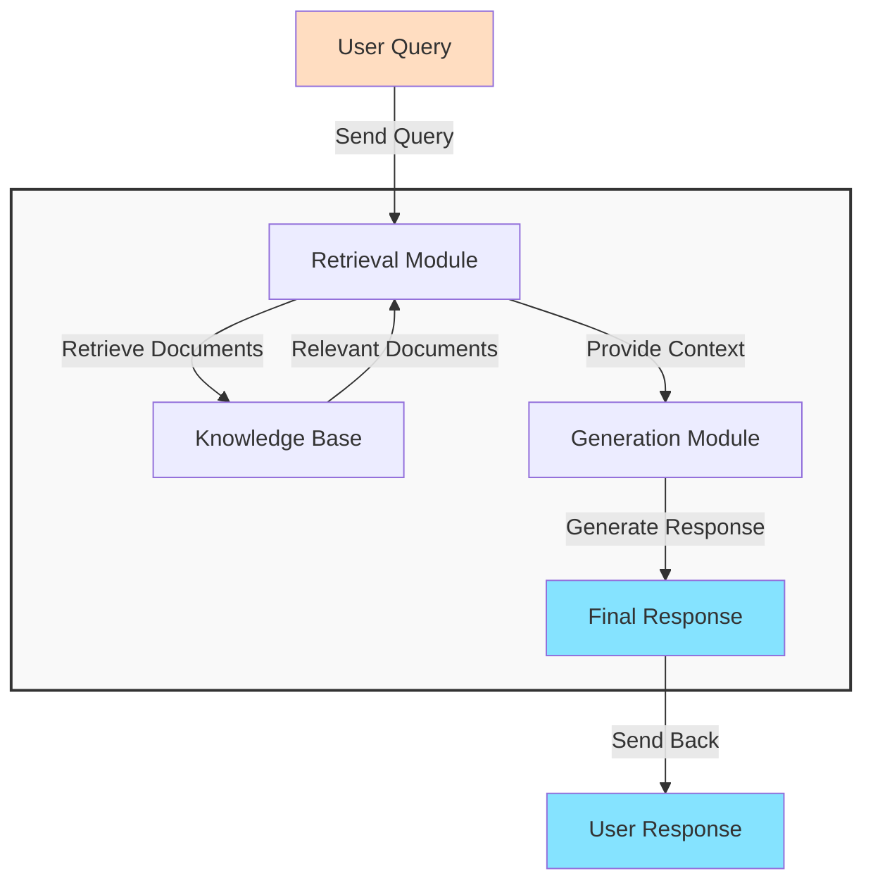

How to create a Python Apps to **chat with your data as context**?


See **[Data-ChatBot](https://github.com/JAlcocerT/Data-Chat)** source code 💻 


## How to use RAGs

Previously this year, I got lucky enough to find these **open source projects**:


  
  


They both use [**LangChain** as RAG framework](#exploring-langchain)

And they were great to give me an understanding oon what a RAG is and how to build one.

We can build very interesting **QnA** over knowledge apps: https://github.com/langchain-ai/chat-langchain

### General RAG Architecture

This is the general idea of a **RAG architecture**:



And as you can imagine, there as few **frameworks already out there**.


Normally, you will see that [RAG frameworks relate](#interesting-rag-resoures) with: [VectorDBs](#vectordbs), Embedding Models and [LLMs](#interesting-api-keys-for-llms)


## RAG Frameworks

As you can imagine, there are few frameworks available to implement a **RAG with Python**:

[](https://star-history.com/#langchain-ai/langchain&run-llama/llama_index&deepset-ai/haystack&Sinaptik-AI/pandas-ai&type=Date)

### Llama-Index

You might Know Llama-Index because of its **RAG capabilities**.

* https://github.com/run-llama/llama_index
  * https://docs.llamaindex.ai/en/stable/

> LlamaIndex is a framework for building **context-augmented generative AI** applications with LLMs including agents and workflows.

#### ChatBot for Real Estate - LlamaIndex

**[LLamaIndex](https://github.com/run-llama/llama_index)** is awsome.

And for a real estate agent bot, LlamaIndex + **Mem0** does the trick.

How Exactly?

See [this repo folder](https://github.com/JAlcocerT/Data-Chat/tree/main/LLamaIndex/With_Mem0).

You will need [OpenAI & Anthropic APIs](#interesting-api-keys-for-llms)


For the [**Real Estate Web** Project](https://github.com/JAlcocerT/ScrewFastMoiRealEstate) commented in [this post](https://jalcocert.github.io/JAlcocerT/astro-web-setup/) I was asked to provide a **QnA Bot**



  



#### LLamaIndex Use Cases

But LLamaIndex can do much more than that.

For some reason it is the **RAG framework** used at [the PrivateGPT project](https://fossengineer.com/selfhosting-privateGPT/).

For example, we can use [LlamaIndex Pandas Query Engine](https://jalcocert.github.io/JAlcocerT/using-langchain-with-pandas-df/#llamaindex-and-pandas-dataframes) to chat with Pandas DF's as well

### Exploring LangChain

The [**LangChain**](https://github.com/langchain-ai/langchain) framework is amazing.

* https://pypi.org/project/langchain/
* https://python.langchain.com/v0.2/docs/introduction/

It can helpful to:

1. Chat with **PDFs**
2. Even with **CSV's**...
3. ...or a **Database**!


  
  



You might be interested to see also [**LangGraph**](https://github.com/langchain-ai/langgraph)


4. There is another one! - [Langchain with Pandas DF](#langchain-pandasdf-chat)

#### LangChain PandasDF Chat

With LangChain, we can create an agent to **chat with a Pandas DF**.

It will actually create internal prompts, so that the agent will create the python pandas queries so that you get the data you wanted feed to the LLM reply.

I have explored LangChain + Pandas DF at [this post](https://jalcocert.github.io/JAlcocerT/using-langchain-with-pandas-df/) and in this [DataChat repo folder](https://github.com/JAlcocerT/Data-Chat/tree/main/LangChain/ChatWithPandas)



Kind of [PandasAI](#exploring-pandasai), but with LangChain


#### LangChain Markdown Chat

I have covered this one on [this repo folder](https://github.com/JAlcocerT/Data-Chat/tree/main/LangChain/Markdown)

```sh
sudo apt install python3.12-venv
sudo apt install python3.12-dev

pip install -r requirements.txt
pip install "unstructured[md]"
```

Load your API:

```sh
git clone https://github.com/pixegami/langchain-rag-tutorial
source .env

#export OPENAI_API_KEY="your-api-key-here"
#set OPENAI_API_KEY=your-api-key-here
#$env:OPENAI_API_KEY="your-api-key-here"
echo $OPENAI_API_KEY
```

Then we can do:

```sh
python3 create_database.py
python query_data.py "How does Alice meet the Mad Hatter?"
```

> Thanks to Pixegami YT Video and code https://github.com/pixegami/langchain-rag-tutorial



<!-- 
https://www.youtube.com/watch?v=tcqEUSNCn8I
 -->

### Exploring PandasAI

I was using the [**PandasAI**](https://github.com/Sinaptik-AI/pandas-ai) project previously to `talk with dataframes` as covered on [this Post](https://jalcocert.github.io/JAlcocerT/how-to-use-pandasAI/)

* https://pypi.org/project/pandasai/
* https://platform.openai.com/


  
  


### HayStack as RAG Framework

The [**Haystack**](https://github.com/deepset-ai/haystack) framework is completely new to me.

```sh
pip install haystack-ai
```


### EmbedChain - Mem0

It seems that the [embedchain project](https://fossengineer.com/embedchain-ai/) got absorbed into a bigger one.

Im talking about the **mem0 framework**.

```sh
#!pip install embedchain==0.1.0
```

Try embedchain and see how it gets a website content as reference:

```py
import os
os.environ['OPENAI_API_KEY'] = 'sk-youropenaikey'

from embedchain.store.assistants import OpenAIAssistant

assistant = OpenAIAssistant(name="OpenAI DevDay Assistant", instructions="You are an organizer of the OpenAI DevDay Conference")

# Option 2: You can also configure more things by instantiating like this
# assistant = OpenAIAssistant(
#     name="OpenAI DevDay Assistant",
#     instructions="You are an organizer of the OpenAI DevDay Conference",
#     tools=[],
#     data_sources=[{"source": "https://www.youtube.com/watch?v=U9mJuUkhUzk", "data_type": "youtube_video"}]
# )

# Option 3: You can load an existing assistant by using assistant id
# assistant = OpenAIAssistant(assistant_id="xxxx")

assistant.add("https://openai.com/blog/new-models-and-developer-products-announced-at-devday")

while(True):
  question = input("❓ Enter question: ")
  if question in ["exit", "quit", "q"]:
    print("Exiting....")
    break
  answer = assistant.chat(question)
  print("💡 Assistant: ", answer)
  print()
```


---

## Summing Up

We have seen some interesting **RAG Frameworks working in Python**

[](https://star-history.com/#langchain-ai/langchain&run-llama/llama_index&deepset-ai/haystack&Sinaptik-AI/pandas-ai&type=Date)

Whats next from here?

Why not building something cool?

[](https://star-history.com/langchain-ai/langchain&deepset-ai/haystack&Sinaptik-AI/pandas-ai&Date)

### Interesting API keys for LLMs

Other LLMs that I have not covered yet in posts

* Mistral AI
* https://openrouter.ai/modelsOpenRouter

> You can always use [Ollama](https://fossengineer.com/ollama-web-ui/)!

LLMs that have already appeared:

* Anthropic API - https://console.anthropic.com/workbench/
* GROQ API -  https://console.groq.com/keys
* OpenAI API -  https://platform.openai.com/api-keys - This one has been **handy to try those RAG projects**


---

## FAQ


### More Github Actions CI/CD

1. Setup [GHA CI/CD](https://fossengineer.com/docker-github-actions-cicd/) as per **[this guide and see use cases](https://jalcocert.github.io/JAlcocerT/github-actions-use-cases/)**
2. https://jalcocert.github.io/JAlcocerT/create-streamlit-chatgpt/#conclusion---and-what-i-learnt

* https://github.com/nektos/act

```sh
#https://github.com/nektos/act/releases/tag/v0.2.70

wget https://github.com/nektos/act/releases/download/v0.2.70/act_Linux_x86_64.tar.gz

tar -xzf act_Linux_x86_64.tar.gz
sudo mv act /usr/local/bin/
sudo chmod +x /usr/local/bin/act

act --version
```

Then go to the repo folder (where `./github/workflows` are)

```sh
act
```

### Running LLMs Locally

* [GPT4ALL Guide](https://fossengineer.com/genai-with-python-gpt4all/)
  * https://github.com/nomic-ai/gpt4all

### Interesting RAG Resoures

#### VectorDBs

[Vector Admin](https://fossengineer.com/selfhosting-vector-admin-docker/) to manage them with UI.

Qdrant or [ChromaDB](https://fossengineer.com/selfhosting-chromadb-docker/) can be deployed with Containers.

<!-- https://www.youtube.com/shorts/zNLSwy_DJ_U -->

