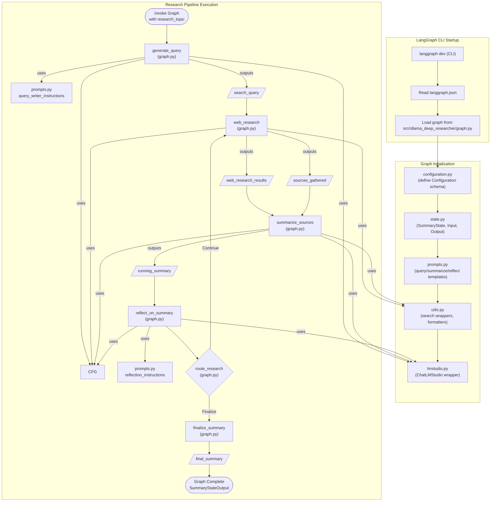

Wait...what it is **LangGraph**?

Let me jump forward a little bit and give you a summary from the project we are going to see:




* I provided: can you give me a summary on what it is langgraph and how it relates to AI agents?
* And the web research query generated was: LangGraph overview and its role in AI agents 2025

**Summary**

LangGraph is an advanced orchestration framework built on top of LangChain, designed to create, deploy, and manage autonomous AI agents powered by large language models (LLMs). 

It models AI workflows as **stateful graphs**, where nodes represent individual agents or task stages and edges define the flow of control, supporting complex behaviors such as branching, loops, and conditional transitions.

Unlike traditional DAG-based frameworks, **LangGraph introduces cyclic computational capabilities**, enabling agents to maintain and update context or memory dynamically across interactions for coherent, goal-directed behavior.

At its core, LangGraph’s **stateful graph architecture** allows AI agents to remember conversation history, track events, and adapt decisions based on evolving information. 

This makes it well-suited for building sophisticated multi-agent systems that can perform complex, multi-step tasks autonomously. LangGraph also integrates dynamic external tools and supports both short-term session memory and long-term persistent memory, often leveraging tools like Zep for automatic fact management, enhancing agents’ contextual awareness and decision-making over time.

**The framework provides fine-grained orchestration and control over agent workflows, including APIs for state management**, debugging tools such as a visual studio, and multiple deployment options for scalable, reliable AI agent development.

It facilitates human-in-the-loop interventions when necessary and exemplifies its capabilities in applications like multi-agent flight and hotel booking systems that handle conditional routing and tool operations.

Overall, LangGraph serves as a foundational cognitive **architecture that balances agent control** with agency, enabling the creation of intelligent, adaptable AI agents applicable across diverse domains such as business process automation, complex decision-making, and interactive AI applications like chatbots and virtual assistants. 

It is recognized for driving innovation in next-generation AI applications and integrates seamlessly with cloud platforms like Amazon Bedrock for scalable multi-agent deployments.

**Sources:**

* Understanding LangGraph and Its Role in Enterprise Agentic AI Systems : https://www.linkedin.com/pulse/understanding-langgraph-its-role-enterprise-agentic-aisystems-ehsan-rbbkf/
* Building Autonomous AI Agents with LangGraph: A Comprehensive Guide : https://neuralpai.medium.com/building-autonomous-ai-agents-with-langgraph-a-comprehensive-guide-e32f8698d05d
* A primer on AI Agents with LangGraph, understand all about it : https://medium.com/@Shrishml/a-primer-on-ai-agents-with-langgraph-understand-all-about-it-0534345190dc
* Revolutionizing AI Workflows: Introducing LangGraph for State Management : https://azumo.com/insights/exploring-langgraph-a-powerful-library-for-state-management-in-ai-workflows
* The Agentic Imperative Series Part 3 — LangChain & LangGraph ... - Medium : https://medium.com/@adnanmasood/the-agentic-imperative-series-part-3-langchain-langgraph-building-dynamic-agentic-workflows-7184bad6b827
* Understanding State in LangGraph: A Beginners Guide : https://medium.com/@gitmaxd/understanding-state-in-langgraph-a-comprehensive-guide-191462220997
* LangGraph - LangChain : https://www.langchain.com/langgraph
* Building LLM Agents with LangGraph: A Comprehensive Guide : https://dev.to/chatgptnexus/2025011912-38-22-article-3b0h
* Build multi-agent systems with LangGraph and Amazon Bedrock : https://aws.amazon.com/blogs/machine-learning/build-multi-agent-systems-with-langgraph-and-amazon-bedrock/
* LangGraph: A Detailed Technical Exploration of the Next-Generation AI ... : https://www.linkedin.com/pulse/langgraph-detailed-technical-exploration-ai-workflow-jagadeesan-n9woc
* What is LangGraph? - IBM : https://www.ibm.com/think/topics/langgraph
* How to Build AI Agents with LangGraph: A Step-by-Step Guide : https://medium.com/@lorevanoudenhove/how-to-build-ai-agents-with-langgraph-a-step-by-step-guide-5d84d9c7e832



So, in a way, its a framework to make **customized LLM workflows**.

One step forward of what I covered with the groq YT summarizer:


  
  


And allow us to do not *just* DAG workflows, like with LangChain:


  
  



<!-- Thanks to LangGraph, we can have programatic agent workflows. -->


## About LangGraph

LangGraph is one of the [most used tools recently](https://jalcocert.github.io/JAlcocerT/comparing-rag-and-use-cases/#trendy-ai-concepts) to build AI apps.

* https://pypi.org/project/langgraph/
  * https://langchain-ai.github.io/langgraph/
* https://github.com/von-development/awesome-LangGraph

**LangGraph is a Python library under the MIT license designed for building programatically sophisticated AI applications involving multiple agents and complex, stateful conversational workflows.**

* https://langchain-ai.github.io/langgraph/concepts/template_applications/
* https://langchain-ai.github.io/langgraph/how-tos/

It offers a **programmatic and flexible way to define the interactions and state transitions** between different components (agents or steps) within these workflows.

Key features and benefits include:

* **Building complex conversational workflows:** Enabling the creation of multi-turn interactions and intricate logic.
* **Agent orchestration:** Providing tools to manage and coordinate the actions of multiple agents.
* **Customizable architectures:** Allowing developers to define unique interaction patterns between agents.
* **Long-term memory:** Facilitating the persistence of information across multiple steps and agent interactions.
* **Human-in-the-loop:** Integrating human intervention into the workflow for review or decision-making.
* **Resilient language agents:** Aiming to create robust and reliable AI systems capable of handling complex tasks.

In essence, LangGraph provides a more structured and **code-driven approach to building multi-agent systems** compared to more declarative methods, offering greater control and flexibility for complex AI applications. 

* https://github.com/langchain-ai/langgraph
  * https://langchain-ai.github.io/langgraph/tutorials/workflows/

> MIT | Build resilient language agents as graphs

<!-- https://www.youtube.com/watch?v=aHCDrAbH_go&t=120s -->




Lets have a look to a sample project with [langGraph](#local-deep-researcher-project)


## Local Deep Researcher Project

To properly understand LangGraph, I was in search of a cool project.

I have cloned the original project: https://github.com/langchain-ai/local-deep-researcher



  
  



<!--  -->

<!--  -->


> MIT | Fully local web research and report writing assistant 

You will need to follow these steps and have [**ollama** ready](https://github.com/JAlcocerT/Docker/tree/main/AI_Gen/Ollama):

```sh
git clone https://github.com/JAlcocerT/local-deep-researcher #it was called ollama deep researcher before
```

Adjust the `.env` file with the search engine and local LLM to be used.

By default, duckduckgo dooes not require to have any API associated, and for the LLM you can use:

```sh
docker exec -it ollama sh
ollama pull deepseek-r1:8b
```

Once ready, run the project with UV:

```sh
uvx \
                 --refresh \
                 --from "langgraph-cli[inmem]" \
                 --with-editable . \
                 --python 3.11 \
                 langgraph dev
```

You will get a a firefox **browser tab** with the following diagram and place to ask questions:

<!--  -->


> I could not resist to ask to provide a research on Titanium for [bycicle applications](https://jalcocert.github.io/JAlcocerT/buying-bicycle-through-data-analytics/)


<!-- https://youtu.be/sGUjmyfof4Q?t=568 -->






By default uses **[duckduckgo](https://pypi.org/project/duckduckgo-search/), with no API key required**. You will need one for SearXNG, Tavily or Perplexity


The dependencies are specified [here](https://github.com/JAlcocerT/local-deep-researcher/blob/main/pyproject.toml#L11)



 1. **LangGraph**
    – Declared in `pyproject.toml` (“langgraph>=0.2.55”)
    – Used to build the **research‐pipeline state-machine** in
      [src/ollama_deep_researcher/graph.py](https://github.com/JAlcocerT/local-deep-researcher/blob/main/src/ollama_deep_researcher/graph.py#L50)
    – The Dockerfile / CMD spins up the LangGraph dev server (via `langgraph-cli`)
2. LangChain (and its connectors)
    – Core runtime:   `langchain_core`
    – OpenAI connector, which is used for LMStudio:  `langchain_openai` / `openai`
    – [Ollama connector](https://python.langchain.com/docs/integrations/llms/ollama/):  `langchain_ollama`
    – Community extras:  `langchain-community`
    – You’ll see these imported in:
      • src/ollama_deep_researcher/lmstudio.py
      • src/ollama_deep_researcher/graph.py
3. Pydantic
    – For your typed configuration model (env‐driven settings)
    – Check out src/ollama_deep_researcher/configuration.py
4. Search-and-scraping utilities
    – HTTP clients: `httpx` & `requests`
    – HTML→Markdown: `markdownify`
    – **Search backends**: `duckduckgo-search`, `tavily-python`, `langchain-community`’s `SearxSearchWrapper`
    – All wired up in [src/ollama_deep_researcher/utils.py](https://github.com/JAlcocerT/local-deep-researcher/blob/main/src/ollama_deep_researcher/utils.py#L9)
5. Environment & CLI glue
    – `python-dotenv` for .env loading
    – `uv`/`uvx` (the “uv” package manager) + `langgraph-cli[inmem]` to launch the dev server (Dockerfile)




When you run:

```sh
langgraph dev #coming from the separated langgraph-cli tool
```

> Run LangGraph API server in development mode with hot reloading

   
* https://langchain-ai.github.io/langgraph/cloud/reference/cli/
* https://pypi.org/project/langgraph-cli/
* https://github.com/langchain-ai/langgraph/tree/main/libs/cli/langgraph_cli

It spins up a little ASGI web‐server and opens the browser UI for you. Under the hood, the CLI uses:

* **FastAPI** (built on Starlette)
  – to expose the HTTP (and WebSocket) endpoints
  – serves the static “prebuilt” React app
* **Uvicorn**
  – as the ASGI server to actually run the FastAPI app
* **React** (TypeScript + Vite)
  – the single-page app you see in your browser, bundled into the `langgraph-prebuilt` package


All of your “business­-logic” lives in the `src/ollama_deep_researcher` folder.

See this [diagram for clarity](https://mermaid.live/edit#pako:eNqdVW1v4jgQ_iuWpT21Ei0tb6V8OGnVAseJLm1CVek2q8ibDODbxMnZTtm22_9-YzsJ0ObutMcXzPiZmWcezwwvNMpioCO6SrJttGFSk-V1IAh-Pnw4-Y9PhSM-yEeQxNfoX-SkTaaS5Rsyz1jMxfrnwqni69p6B3TOxNpFuprPqugBdTg0fQ5oghAHj-GRHKHxOKBfSsRk-ru_-IQoD1hMaujpnyoTNWrqfbz97Xo8QZjhS1y0lczSURAIJaN2liQsZWEMkIcSFDAZbUC2Xaz8aZcPSZ6c_FrltecqukOAiAPxrkxX4kxwzVnCn5nmhl4Zc_FpMpsitygTK74upL01WQNxFMOKCyBX-1dEIbmU7VTwlx-XYwygNNNQOvpFmjL55BtTCzPnhW6RRaHxe-d46y1ubpc-uuYoRq5V6fxXAfKprWwI_gxtCasEIk00pHmCAdUuxP1yNjcBCs2Tyt3pR7ZYdA5StcgqkynTGs87x_nNzeLaPG-qdBHzrPS92jA9v_GtqYpw_O4l3SNY4ezRKmBPZUn2bLnZk0327oF-ov3vFTb_-DtEhX2BCY7S_-55r2wwcstzSMzz1oGrnrCDcITqzMRj9g3csKE8W643pGrQUGc5j1CbY9eHd4hfgwDsEgjtExpBqx7eE_HO4H8UCtQPcmcEe9sA1jncSo5PFnKhtCwiQ081x8BpaLDuaV7aM9t-eOXffW5ju7oqHFPa_lI9i2_R5MFDWlv4Wg9kczUPXhOTA6vtgwN7zeTB8wyV_TTmUCRaGUrkF-JPLdeskBGocM00LgaI9_liDItznXhv1KxHJywdm7kjuIn8oXlPx8OLvbKqi7ouzzesZSEEbufQ0TkQ2XOD4dmtWM53mIka2sjXc5P3lu-heY_v4YXX1Gplamyu5kYrQxBvcb8cvyBVLBH-qSVe6-oMGv3M4tRcFFB21JvbCRdmHbvbycz8j6xK078LgVjnY2W2Pk0iT5zIYxGbWS7_57D4BDRg4P0d7VazGeZ6TdEWXUse0xGqAi2aAi5R85O-GEhAsRNTCOgIjzGT38zueEWfnIk_siyt3FCw9YaOVixR-KvIY0x2zRnWtINgMpBXWSE0HQ16lzYGHb3Q73R00j0bnHYuemfnF91u93LY67XoE5o7F6ed80H_bDgc9Lv9Qa_Xf23RZ5v3_LTT7wy7w85ldzjonPf7g9e_ATyoqG4) on the execution flow:



The piece that LangGraph is actually serving (and that shows up in Studio as your state‐machine/UI) is the [graph object exported from the `langgraph.json` file](https://github.com/JAlcocerT/local-deep-researcher/blob/main/langgraph.json).


* `src/ollama_deep_researcher/graph.py` This is where you build your **StateGraph**:
      – add nodes (generate_query, web_research, summarize_sources, reflect_on_summary, finalize_summary)
      – wire up edges (including the route_research function that loops or finalizes)
      – compile into the graph that LangGraph Studio runs.

To change the flow of your LLM calls (add/remove/branch nodes, change loop logic), this is the file to edit.

Beyond that, there are three supporting “extension points” you’ll almost certainly want to tweak when you customize your LLM‐driven pipeline:

  1. **Prompts** `src/ollama_deep_researcher/prompts.py`
      - All of your JSON templates and instructions live here.
      - Adjust your system messages or output formats.
  2. **LLM‐wrapper classes** `src/ollama_deep_researcher/lmstudio.py` (and the use of `ChatOllama` in graph.py)
      - Swap in new providers or change temperatures, streaming modes, etc.
  3. **Configuration & utilities**
      - `src/ollama_deep_researcher/configuration.py` controls env-vars, defaults for model name, provider, loop count, etc.
      - `src/ollama_deep_researcher/utils.py` web-search implementations; strip tokens, format sources, etc.

If you ever need to go deeper—for example, to completely redesign the LangGraph Studio UI—you’d have to clone and modify the langgraph-cli repo (FastAPI + React/TypeScript).

The `graph.py` for the orchestration logic and `prompts.py` for what you ask the LLM to do.

The purpose of `state.py` is to define the “shape” of the **in‐memory state** that your LangGraph will carry around as it executes your research pipeline.

Concretely [the state file](https://github.com/JAlcocerT/local-deep-researcher/blob/main/src/ollama_deep_researcher/state.py) provides three dataclasses:

1. SummaryState
* This is your running state object.  It has fields for:
  – research_topic: the user’s original topic
  – search_query: the current query you asked the LLM to run
  – web_research_results: a list of the raw text results returned by each web_research node
  – sources_gathered: a list of the formatted source metadata you’ll feed into summaries
  – research_loop_count: how many times you’ve gone through the loop so far
  – running_summary: your accumulated summary text
* Notice that web_research_results and sources_gathered are wrapped with
  Annotated[..., operator.add].  That tells LangGraph that whenever a node returns a new list for one of those fields, it should do `old_list + new_list` (i.e.
append) rather than overwrite.
2. SummaryStateInput
* Defines the very first inputs your graph expects when you call `.invoke(...)`.
* Here it just has `research_topic`.
3. SummaryStateOutput
* Defines what you get back when the graph finishes.
* Here it just exposes `running_summary`.

When you do

```py
StateGraph(
SummaryState,
input=SummaryStateInput,
output=SummaryStateOutput,
config_schema=…
)
```

You’re telling LangGraph:

* “This is the shape of my mutable state and how to merge updates.”
* “This is the payload I start with.”
* “This is the payload I return at the end.”

If you want to track additional bits of data (say timing metrics, alternate summaries, etc.) or change how fields combine between nodes, this is the file you’d edit.


### Tweaks to Local Deep Researcher


I dont have a crazy fast GPU, so my first thought was to use [codex](https://jalcocert.github.io/JAlcocerT/vide-coding/#openai) to simply plug alternatively **OpenAI models**:


* OpenAI API Keys - <https://platform.openai.com/api-keys>
* Anthropic - <https://console.anthropic.com/settings/keys>
* Groq - <https://console.groq.com/keys>
* For [Ollama](https://github.com/JAlcocerT/Docker/tree/main/AI_Gen/Ollama), you need [this setup](https://fossengineer.com/selfhosting-llms-ollama/)


## Other LangGraph Resurces

* https://github.com/esxr/langgraph-mcp/tree/main

### Big Tool

LangGraph Big Tool caught my attention [while writting the RAG Post](https://jalcocert.github.io/JAlcocerT/comp.aring-rag-and-use-cases/#langgraph-bigtool)