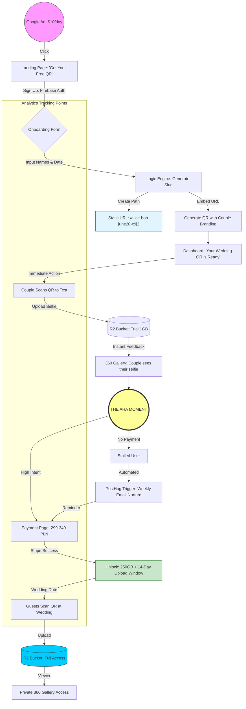

**Tl;DR**

Tired of spreadsheets? 

Aiming for High*er* ltv, high*er* cac?

**Intro**

You can just use classic spreadsheets.

Or level up with: https://www.quadratichq.com/

> Source Open | Infinite spreadsheet with Python, SQL, and AI.

* https://github.com/quadratichq/quadratic/tree/main
  * https://github.com/quadratichq/quadratic/issues/416

```sh
docker build -t quadratic --platform=linux/amd64 .
```

You can go for a full fledge CRM.

> Or...with No Code DBs x BaseRow?


### CRM

Should you use GHL? Close?

* https://www.close.com/pricing#solo

Overkill with salesforce or hubspot?

Why dont you try Twenty?


  
  


* https://twenty.com/releases
    * https://github.com/twentyhq/twenty

<!-- https://www.youtube.com/watch?v=UZBy_n4XjGs -->




### Note Tools

For PDFs you have:

* https://github.com/freedomofpress/dangerzone

> agpl |  Take potentially dangerous PDFs, office documents, or images and convert them to safe PDFs 

[Notion](https://www.notion.com/product/notion-for-product-development)? Obsidian?

Or...

<!-- 
https://youtu.be/jyzcDIudczA 
-->




Why not just **Affine**?



  


You can also try the official one *even w/o an account*: `https://app.affine.pro/`


Or the good old note apps like: Joplin or **LogSeq**?

* https://github.com/logseq/logseq/pkgs/container/logseq-webapp - *This will be very light weight*

```sh
wget -P ~/Applications https://github.com/logseq/logseq/releases/download/0.10.15/Logseq-linux-x64-0.10.15.AppImage
```


  
  


| Aspect | Logseq | Affine | Joplin  |
|--------|--------|--------|--------------------------|
| **Storage** | Flat Markdown files (git-native) | Database/blocks (export MD) | SQLite (export MD)  [slashdot](https://slashdot.org/software/comparison/Joplin-vs-Logseq/) |
| **Paradigm** | Block outliner, bi-links, queries | Canvas + docs + DBs (Notion-like) | Hierarchical notebooks/tags  [zblesk](https://zblesk.net/blog/tried-and-ditched-logseq-and-affine/) |
| **Web Access** | Docker/self-host (limited plugins) | Native web/self-host (full) | No native web editor  [discuss.logseq](https://discuss.logseq.com/t/anything-going-on-with-web-version/15390) |
| **Integrations** | 500+ plugins, HTTP API, Readwise | API/collab focus | Plugins, E2E sync (Dropbox)  [logseq.github](https://logseq.github.io/marketplace/) |
| **Self-Host** | Docker + git volume | Full Docker/server | Server CLI (no UI)  [discuss.logseq](https://discuss.logseq.com/t/local-on-server-storage-for-self-hosted-logseq/6613) |
| **Best For** | PKM graphs, solo dev (you) | Visual teams/projects | Simple encrypted notes  [youtube](https://www.youtube.com/watch?v=C7kx5X3PxU0) |
| **Mobile** | Good Android/iOS | Beta web/mobile | Strong cross-platform  [slashdot](https://slashdot.org/software/comparison/Joplin-vs-Logseq/) |
| **Learning Curve** | Medium (queries/templates) | Low-medium | Low  [zblesk](https://zblesk.net/blog/tried-and-ditched-logseq-and-affine/) |

See also [memos](https://usememos.com/): https://github.com/usememos/memos which is also markdown native **and MIT**.

And be prepared for **more vibe coded tools** to appear, like: https://github.com/OlaProeis/ironPad

>  Ironpad is a local-first, file-based project management system I've been building with AI. Rust backend (Axum), Vue 3 frontend, markdown files as the database, Git integration for versioning 


If you are starting out some new business adventure: *logseq + markdown + git* can be your friend.

Plus, you can use it via Nekko in few environment via web.



  


And get away with firefliesAI webhooks syncing your meeting notes/sales speech feedback right into it.

* https://app.fireflies.ai/settings
  * https://docs.fireflies.ai/graphql-api/webhooks
  * https://docs.fireflies.ai/graphql-api/query/transcripts

```sh
#https://github.com/JAlcocerT/my-logseq-notes
#cd scripts
python3 verify_connection.py
python3 backfill_meeting.py 01Kabcdef12446579
```

* https://tailscale.com/docs/features/tailscale-funnel

<!-- https://www.youtube.com/watch?v=MpxmfpCl20c&t=10s -->

```sh
#~/Desktop/my-logseq-notes/scripts$ docker compose up -d
sudo tailscale set --operator=$USER
#tailscale funnel 5000
tailscale funnel --https=443 localhost:5000
tailscale serve status
#openssl rand -base64 12 #for webhook secret
```

You will get some `https://tailscaleuserdevice.tail123456.ts.net/` to connect to fireflies AI webhooks.




Some people use Logseq export x GHA x HUGO to make their websites :)

```sh
git clone https://github.com/JAlcocerT/my-logseq-notes
sudo docker compose -f ./z-homelab-setup/evolution/2602_docker-compose.yml up -d logseq

#https://github.com/imputnet/helium-linux/releases
sudo docker compose -f 2602_docker-compose.yml up -d neko
#sudo docker compose -f ./z-homelab-setup/evolution/2602_docker-compose.yml up -d neko
```

From there you can have a part for: *book ideas, business requirements, sales, daily notes / journal...*

<!-- 
https://www.youtube.com/watch?v=RzT20ejft3c 
-->



---

## Conclusions

As long as u understand consumer...u see how much **risk/uncertainty averse** we are


  
  


Tu dinero es una commodity, mi tiempo no.

Plus: Si atiendes a cualquiera = no escasez = eres malo.

### A cool workflow from a landing?

1. Get a landing or service and collect qualified leads


  
  


> The magic happens at [this gha workflow](https://github.com/JAlcocerT/slubne-chwile-y26/actions/workflows/drip.yml)



2. With the information they provided do the following...

3. ...move water through your sales pipeline!

To articulate this effectively, you need to pivot from "I'm writing scripts" to "I'm building an **Autonomous Revenue Engine**."

In the eyes of a Business Development Lead like Arthur, **GTM (Go-to-Market) Engineering** is the "holy grail" because it moves AI from a toy (ChatGPT) to a tool (automated pipelines).

Here is how to frame your specific stack using the terminology from the summit:

1. The Value Proposition (The "Elevator Pitch")

Instead of listing tools, describe the **flow of value**:

> "I’m building a **modular GTM stack** that automates the transition from 'unstructured signal' to 'personalized outreach' without human intervention."

2. Breaking Down the Stack for RevOps

When Arthur asks how it works, explain it as a **three-stage orchestration**:

* **The Discovery Layer (Firecrawl + Apify):**
* *What to say:* "I use Firecrawl and Apify to solve the **'Data Freshness'** problem. Instead of relying on stale CRM data, I programmatically scrape real-time triggers—like new product launches or Reddit discussions—to feed the 'Answer Engine' context."


* **The Insight Layer (Fireflies.ai):**
* *What to say:* "I integrate **Fireflies.ai** to pull RevOps intelligence from actual sales calls. This allows the system to 'learn' the common objections and successful talk tracks, which then informs the tone of the automated outreach."


* **The Orchestration Layer (GitHub Actions + APIs):**
* *What to say:* "I use **GitHub Actions** as my orchestration engine. It treats GTM like software—it’s version-controlled, scheduled, and highly scalable. It triggers the programmatic drip campaigns via API based on the logic processed in the previous layers."


How this maps to RevOps (The "Business Speak")

"Why build it this way?" use these points to show you're an entrepreneur:

| Technical Feature | RevOps / GTM Benefit |
| --- | --- |
| **GitHub Actions** | **Zero Infrastructure Overhead:** High-frequency automation that runs in the background without needing a dedicated server. |
| **Programmatic API Drips** | **Hyper-Personalization at Scale:** Moving beyond "Hi [First_Name]" to "Hi [Name], I saw your recent comment on Reddit regarding [Topic]..." |
| **Fireflies Integration** | **Closing the Feedback Loop:** Sales insights are automatically fed back into marketing copy, ensuring the "Brand Voice" stays human. |

<!-- 
https://youtu.be/mSgmiUwZjrY 
-->



---

## FAQ

You can give it a try to pocketbase as well



<!-- 
https://youtu.be/p7U24YSFrW4?is=6Refm-LlVTokBeug 
-->