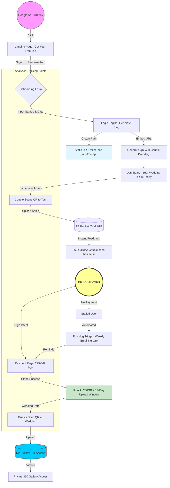

https://skills.sh/

https://www.youtube.com/watch?v=qfWpPEgea2A&t=191s

https://www.youtube.com/watch?v=rlLwSr-wIAg&t=431s

https://github.com/martingaido/ai-prompt-engineering-docs/blob/main/gemini-for-google-workspace-prompting-guide-101.pdf

https://www.youtube.com/watch?v=tYg6T_DAP-k

**Tl;DR**

Tired of spreadsheets?

**Intro**

You can just use spreadsheets

* https://www.quadratichq.com/

> Source Open | Infinite spreadsheet with Python, SQL, and AI.

https://github.com/quadratichq/quadratic/tree/main
https://github.com/quadratichq/quadratic/issues/416

```sh
docker build -t quadratic --platform=linux/amd64 .
```


You can go for a full fledge CRM.

No Code DBs x BaseRow?

### No Code Data Tools

* https://github.com/glideapps/glide-data-grid

* Baserow


### CRM

GHL?

* https://www.close.com/pricing#solo

Overkill with salesforce or hubspot?

* https://twenty.com/releases
    * https://github.com/twentyhq/twenty

https://www.youtube.com/watch?v=UZBy_n4XjGs

### Note Tools

[Notion](https://www.notion.com/product/notion-for-product-development)? Obsidian?

Or...


---

## Conclusions


### A cool workflow from a landing?

1. Get a landing or service and collect qualified leads


  
  


> The magic happens at [this gha workflow](https://github.com/JAlcocerT/slubne-chwile-y26/actions/workflows/drip.yml)



2. With the information they provided do the following...
3. ...move water through your sales pipeline!

To articulate this effectively, you need to pivot from "I'm writing scripts" to "I'm building an **Autonomous Revenue Engine**."

In the eyes of a Business Development Lead like Arthur, **GTM (Go-to-Market) Engineering** is the "holy grail" because it moves AI from a toy (ChatGPT) to a tool (automated pipelines).

Here is how to frame your specific stack using the terminology from the summit:

1. The Value Proposition (The "Elevator Pitch")

Instead of listing tools, describe the **flow of value**:

> "I’m building a **modular GTM stack** that automates the transition from 'unstructured signal' to 'personalized outreach' without human intervention."

2. Breaking Down the Stack for RevOps

When Arthur asks how it works, explain it as a **three-stage orchestration**:

* **The Discovery Layer (Firecrawl + Apify):**
* *What to say:* "I use Firecrawl and Apify to solve the **'Data Freshness'** problem. Instead of relying on stale CRM data, I programmatically scrape real-time triggers—like new product launches or Reddit discussions—to feed the 'Answer Engine' context."


* **The Insight Layer (Fireflies.ai):**
* *What to say:* "I integrate **Fireflies.ai** to pull RevOps intelligence from actual sales calls. This allows the system to 'learn' the common objections and successful talk tracks, which then informs the tone of the automated outreach."


* **The Orchestration Layer (GitHub Actions + APIs):**
* *What to say:* "I use **GitHub Actions** as my orchestration engine. It treats GTM like software—it’s version-controlled, scheduled, and highly scalable. It triggers the programmatic drip campaigns via API based on the logic processed in the previous layers."


How this maps to RevOps (The "Business Speak")

"Why build it this way?" use these points to show you're an entrepreneur:

| Technical Feature | RevOps / GTM Benefit |
| --- | --- |
| **GitHub Actions** | **Zero Infrastructure Overhead:** High-frequency automation that runs in the background without needing a dedicated server. |
| **Programmatic API Drips** | **Hyper-Personalization at Scale:** Moving beyond "Hi [First_Name]" to "Hi [Name], I saw your recent comment on Reddit regarding [Topic]..." |
| **Fireflies Integration** | **Closing the Feedback Loop:** Sales insights are automatically fed back into marketing copy, ensuring the "Brand Voice" stays human. |


---

## FAQ