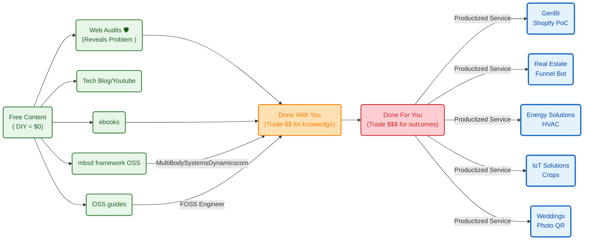
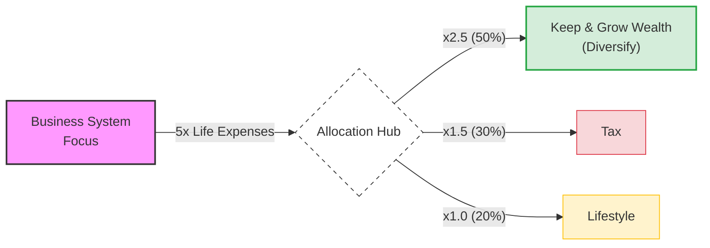

**Tl;DR**

Hows my brand and outbound email marketing going?

**Intro**

* Why Im writting this post: *bc if you are good, you should not be [giving for free your upside](#risk-and-opportunities)*
* What [Ive learnt](#conclusions) with it: *Ive ended*


## Mail


* https://fossengineer.com/selfhosting-maildev/

There will never be [better weddings](https://jalcocert.github.io/JAlcocerT/poc-101/#better-weddings) without the mail outbound and to lower the CaC, you can [use email DRIP](https://jalcocert.github.io/JAlcocerT/quick-weddings-poc/#drip-to-convert) to increase the conversion rate to the people that was attracted, but didnt buy.


https://github.com/JAlcocerT/slubnechwile-chwile-y26-claude
https://github.com/JAlcocerT/leads-slubnechwile
https://github.com/JAlcocerT/slubne-chwile-y26
## Videos

Ive...kinda been doing videos for a while: had this [initial flow with OpenAI x OBS x Canva](https://jalcocert.github.io/JAlcocerT/my-youtube-ai-workflow/#my-initial-workflow), which i [upgraded in late 2024](https://jalcocert.github.io/JAlcocerT/my-youtube-ai-workflow/#updating-my-yt-video-wf-ai-powered).


  


I [had some thoughts](https://jalcocert.github.io/JAlcocerT/my-youtube-ai-workflow/#data-driven-videos-with-streamlit) around making data driven videos with streamlit, remotion...

But those had to wait, as I had to get an action cam and [get in love with ffmpeg cli first](https://jalcocert.github.io/JAlcocerT/my-action-cam-video-workflow/#quick-videos---ffmpeg-cli), get [gyroflow](https://jalcocert.github.io/JAlcocerT/my-action-cam-video-workflow/#gyroflow) to brick my linux GUI and brick [my pixel8](https://jalcocert.github.io/JAlcocerT/pixel-8-pro-tricks/)

For automatic chapers see [this script](https://jalcocert.github.io/JAlcocerT/my-action-cam-video-workflow/#youtube-video-descriptions)

To extract thumbnails from your video [see this](https://jalcocert.github.io/JAlcocerT/photo-video-tinkering/#thumbnails)

I also went crazy and made some [simple video edits with kdenlive](https://jalcocert.github.io/JAlcocerT/photo-video-tinkering/#kdenlive)


https://jalcocert.github.io/JAlcocerT/photo-video-tinkering/#video-editing
https://jalcocert.github.io/JAlcocerT/photo-management-tools/

But things accelerated and I had a chat with a youtuber friend [about text to video and brainrot shorts](https://jalcocert.github.io/JAlcocerT/photo-video-tinkering/#text2video)

But at the time i tried some [animations as a code](https://jalcocert.github.io/JAlcocerT/animations-as-a-code/) with [python x matplotlib x financial data](https://jalcocert.github.io/JAlcocerT/animations-as-a-code/#matplotlib-animations), then, made [some map animations](https://jalcocert.github.io/JAlcocerT/geo-maps-and-data/#animated-videos)

https://github.com/JAlcocerT/DataInMotion

Later, i bite [remotion x yfinance](https://jalcocert.github.io/JAlcocerT/video-creation-with-remotion/#yfinance-x-remotionjs) and also [made data animations](https://jalcocert.github.io/JAlcocerT/ai-scripts-and-animated-data/) around [f1](https://jalcocert.github.io/JAlcocerT/ai-scripts-and-animated-data/#f1) and [its race data](https://jalcocert.github.io/JAlcocerT/f1-data-animated/)

https://github.com/JAlcocerT/eda-f1

Then, i tinkered around [repo to ~~post~~ video](https://jalcocert.github.io/JAlcocerT/oss-automatic-docs-and-tech-video/#about-foss---repo-to-video)

How could I not...use [remotion for mechanisms videos](https://jalcocert.github.io/JAlcocerT/video-creation-with-remotion/#mechanisms-x-remotionjs)

https://github.com/JAlcocerT/3Design
https://github.com/JAlcocerT/mbsd


Not as a full time thing, not as a...minor thing.

But there has been output: 

And in theory, there is nothing stopping you [to go viral](https://jalcocert.github.io/JAlcocerT/youtube-video-as-a-code/)


Videos is going to be an important [part of JAlcocerTech-Core](#conclusions)


### VSL

I had to sit and ask myself: [what do I do](https://jalcocert.github.io/JAlcocerT/what-do-i-do/)?

Concluded that: I do independent consulting work, driving business outcomes by building enterprise analytics systems

When you dont have [a story line for chatting](https://jalcocert.github.io/JAlcocerT/what-do-i-do/#conclusions) you are far from any sales pitch.

https://jalcocert.github.io/JAlcocerT/jalcocertech-services-update/#inbound-marketing-x-branded-videos

### Promo Video

https://jalcocert.github.io/JAlcocerT/poc-101/#from-html-to-promo-video

### PAS

Problem - Amplification - Solution

If you watch TV, you should be aware of that already.


### Why not just RemotionJS

```sh

```

https://www.remotion.dev/prompts/cinematic-tech-intro


---

## Conclusions

Any [solar panel](https://youtube.com/shorts/e_GwgidIPFg) with no load has potential (V)

Yet, makes no actual work / provides power / throughput

Dont be an open solar panel, embrace the [risk and opportunities](#risk-and-opportunities):


  
  



---

## FAQ

### Typst

* https://typst.app/
* https://typst.app/universe/package/graceful-genetics
* https://github.com/qjcg/awesome-typst

> https://github.com/JAlcocerT/mbsd/tree/master/integrated-engine-lab/typst-report

### Gyroflow CLI 101


### Risk and Opportunities

#### The Wheel Strategy

The exact dynamic of the two sides of The Wheel strategy.

Step 1: Selling Cash-Secured Puts (Getting Paid for Downside Risk)

* **The Role:** You act like an **insurance seller** against a stock drop.
* **What You Give Up:** Downside protection. If the stock crashes, you are contractually obligated to buy 100 shares at the agreed strike price, regardless of how far it falls.
* **What You Get Paid For:** You collect an upfront cash premium for taking on that downside assignment risk. If the stock stays above your strike, you keep the cash free and clear.

Step 2: Selling Covered Calls (Getting Paid to Cap Upside Potential)

* **The Role:** You act like a **seller who sets a firm exit price**.
* **What You Give Up:** Unlimited upside. If the stock rallies significantly past your strike price, you do not participate in any gains beyond that strike because your shares are called away at the agreed price.
* **What You Get Paid For:** You collect an upfront cash premium in exchange for surrendering that potential runaway profit.

| Strategy Step | What You Are Selling | What You Give Away | Optimal Market Condition |
| --- | --- | --- | --- |
| **Step 1 (Cash-Secured Put)** | Downside obligation | Protection against a severe decline below the strike | Neutral to moderately bullish |
| **Step 2 (Covered Call)** | Upside obligation | Capital appreciation above the strike price | Neutral to moderately bullish |

In both phases, you monetize market uncertainty and time decay (theta) in exchange for setting fixed boundaries on your price outcomes.

#### Employment vs The Wheel

That is a sharp philosophical analogy—an employment contract structurally mirrors a permanent **covered straddle / collar**, exchanging volatility and unlimited upside for capped, predictable cash flow.

The Parallels: Employment vs. The Wheel

| Dimension | In "The Wheel" (Covered Call + Cash-Secured Put) | In a Standard Employment Contract |
| --- | --- | --- |
| **The "Premium"** | Regular cash credit (option premium) deposited into your account. | Your bi-weekly or monthly fixed salary/paycheck. |
| **The Upside Cap** | **Step 2 (Covered Call):** If the company/stock does a 10x, your shares are called away at the strike. You capture zero percent of the runaway upside. | If your department invents a billion-dollar product, you still receive your agreed baseline wage (perhaps plus a modest capped bonus). The equity shareholders capture the exponential upside. |
| **Downside Buffer** | **Step 1 (Cash-Secured Put):** You absorb gradual dips, buffered by the upfront premiums you collect. | If company revenue dips 15% in a quarter, your paycheck doesn't automatically drop by 15%. The business absorbs normal fluctuations. |
| **Catastrophic Tail Risk** | If the underlying company goes bankrupt to $0, you hold the bag on the assigned shares. | If the business faces systemic failure or insolvency, you face layoffs or restructuring (your human capital is "unassigned" from the income stream). |

Why the Analogy Fits

* **Monetizing Human Capital Theta:** In options, you sell options to capture **Theta (time decay)**. In employment, you literally sell blocks of your finite time (hours/weeks) for an agreed cash yield.

* **The Implied Volatility Trade-off:** Entrepreneurs and equity owners take on unlimited downside and retain unlimited upside (long volatility). Salaried employees effectively write a derivative contract against their labor: high win rate, steady small payouts, strictly bounded boundaries.

Where the analogy breaks down is assignment: when an option trader gets assigned, they own an equity asset; when an employee gets laid off, they hold uncompensated spare time rather than retained company shares.

### My Fav Diagrams






