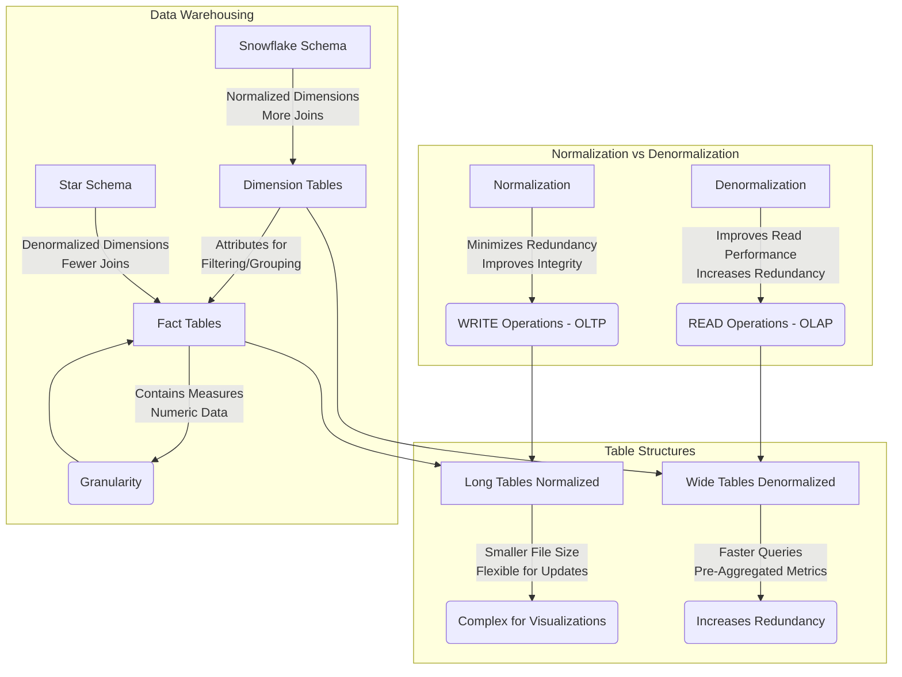

Long ago, I was covering [the analytical stack](https://jalcocert.github.io/JAlcocerT/self-taught-career-guide-for-data-analytics/#the-analytical-stack) and the most popular [concepts for a data analytics journey](https://jalcocert.github.io/JAlcocerT/data-basics-for-data-analytics/).

It is time to make **a recap**.

A recap on [SQL](#sq), [PySpark](#pyspark) and [Data Modelling](#concepts-for-data-analytics).


  
  




This Post is **WIP**


## Concepts for Data Analytics



Dont be scared. 

Both are **places where data is stored**.

**Data Warehouse (DWH):**

* **Purpose:**
    * Primarily designed for **structured data and business intelligence (BI) reporting**.
    * Focuses on providing clean, processed, and organized data for analytical queries.
* **Data Structure:**
    * Employs a "schema-on-write" approach, meaning data is transformed and structured before being loaded into the warehouse.
    * Typically handles structured data from transactional systems.
* **Use Cases:**
    * Traditional BI reporting, dashboards, and analytical queries.
    * Providing a single source of truth for business metrics.
* **Limitations:**
    * Limited flexibility in handling unstructured or semi-structured data.
    * Can be costly and complex to scale.
    * ETL (Extract, Transform, Load) processes can be time-consuming.

**Data Lakehouse:**

* **Purpose:**
    * Aims to combine the best of data lakes and data warehouses.
    * Enables both data science and BI workloads on a single platform.
* **Data Structure:**
    * Supports "schema-on-read" and "schema-on-write" approaches, allowing for flexibility in handling various data types.
    * Can store **structured, semi-structured, and unstructured data**.
* **Use Cases:**
    * Advanced analytics, machine learning, and AI.
    * BI reporting and dashboards.
    * Real-time analytics and streaming data processing.
* **Advantages:**
    * Increased flexibility and scalability.
    * Reduced data duplication and complexity.
    * Ability to perform diverse analytics on a single platform.
    * Supports ACID transactions.
* **Key differentiators:**
    * They enable data lakes to have the data management and transaction capabilities of a data warehouse.
    * They add metadata layers to data lakes, to provide increased data governance.

**Key Comparisons:**

* **Data Types:**
    * DWH: Primarily structured.
    * Lakehouse: Structured, semi-structured, and unstructured.
* **Schema:**
    * DWH: Schema-on-write.
    * Lakehouse: Schema-on-read and schema-on-write.
* **Use Cases:**
    * DWH: BI reporting.
    * Lakehouse: BI, AI, machine learning, and advanced analytics.
* **Flexibility:**
    * Lakehouses are much more flexible.

In essence, the **data lakehouse is a modern data architecture** that seeks to overcome the limitations of traditional data warehouses and data lakes.

It provides a more versatile and efficient platform for organizations to manage and analyze their data.





Thats was were can store.

But how to **process the data**?



Data processing engines are software systems designed to execute data transformations and computations at scale. They form the core of many modern data architectures, enabling the handling of massive datasets for analytics, machine learning, and other data-intensive applications. Here's a breakdown of their key characteristics and types:

**Core Functions:**

* **Data Transformation:**
    * They perform operations like filtering, sorting, aggregating, and joining data.
* **Scalability:**
    * They are designed to distribute workloads across multiple machines, allowing them to process large volumes of data.
* **Fault Tolerance:**
    * They often incorporate mechanisms to handle failures and ensure data processing continues even if some machines go offline.
* **Data Storage Integration:**
    * They can read data from and write data to various storage systems, such as data lakes, data warehouses, and databases.

**Types of Data Processing Engines:**

* **Batch Processing Engines:**
    * These engines process data in large, discrete batches.
    * They are well-suited for tasks that don't require real-time processing.
    * Examples:
        * **Apache Hadoop MapReduce:** A classic batch processing framework.
        * **Apache Spark (Spark SQL):** While Spark can also do streaming, Spark SQL is very good at batch processing.
* **Stream Processing Engines:**
    * These engines process data in real-time as it arrives.
    * They are used for applications that require low-latency processing of continuous data streams.
    * Examples:
        * **Apache Kafka Streams:** A stream processing library built on top of Apache Kafka.
        * **Apache Flink:** A powerful stream processing framework.
        * **Apache Spark Streaming/Structured Streaming:** Spark's stream processing capabilities.
* **Interactive Query Engines:**
    * These engines are designed for interactive data exploration and analysis.
    * They provide fast query response times, enabling users to quickly explore and analyze data.
    * Examples:
        * **Apache Spark SQL:** Also used for interactive queries.
        * **Apache Impala:** A massively parallel processing (MPP) SQL query engine.
        * **Presto/Trino:** Distributed SQL query engines.



In essence, data processing engines are the workhorses of modern data systems, enabling organizations to extract valuable insights from their vast data resources.



Looking into **open-source data catalog** tools?

Some of the most prominent ones:

* **Apache Atlas:**
    * A powerful and extensible metadata management and governance framework.
    * It provides capabilities for classifying, governing, and discovering data assets.
    * It's widely used in Hadoop ecosystems.
* **DataHub:**
    * Originally developed at LinkedIn, DataHub is a modern metadata platform.
    * It offers features for data discovery, data lineage, and data governance.
    * It's designed to be highly scalable and adaptable to evolving data environments.
* **OpenMetadata:**
    * A unified metadata platform that aims to provide a single place for all metadata.
    * it provides data discovery, data observability and data governance.
    * it has a strong and growing community.







* **Apache Iceberg:**
    * Apache Iceberg is a table format for large analytic datasets. It focuses on providing a high-performance, reliable, and evolving table format for data lakes. While **Iceberg stores metadata about the tables** (schema, partitions, etc.), it's primarily a table format, not a full-fledged data catalogue.
    
> It provides some of the underpinnings that a data catalogue would use.

* **Project Nessie:**
    * Project Nessie is a **Git-like transaction layer for data lakes**. It allows you to create branches and tags of your data, enabling version control and collaborative data management. While Nessie manages metadata and provides a versioned view of data, it's more about data versioning and branching than a comprehensive data catalogue.
    
> Nessie helps to manage the metadata that a data catalogue would use.

When discussing *Nessie namespaces* it's important to understand how they function within the context of Project Nessie and its relationship with data lake technologies like Apache Iceberg. Here's a breakdown:

**Understanding Nessie and Namespaces:**

* **Nessie's Role:**
    * Project Nessie provides a Git-like version control layer for data lakes. This allows for branching, tagging, and committing changes to data in a way that's familiar to software developers.
    * It primarily works with table formats like Apache Iceberg, enabling transactional capabilities and versioning.
* **Namespaces in Data Catalogs:**
    * In data catalogs, namespaces are used to organize and group tables and other data assets. They provide a hierarchical structure that makes it easier to manage large numbers of data objects.
    * Think of them like folders in a file system.
* **Nessie's Approach to Namespaces:**
    * Nessie handles namespaces in a somewhat unique way. Notably, Nessie namespaces are often described as "implicit."
    * This means that you don't necessarily have to explicitly create or delete namespaces in the same way you might in other systems.
    * Instead, Nessie infers namespaces based on the structure of your table identifiers.
    * Essentially, if you create a table with an identifier like `my_namespace.my_table`, Nessie will recognize `my_namespace` as a namespace.
    * From the documentation of Apache iceberg, regarding the Nessie catalog:
        * "Namespaces in Nessie are implicit and do not need to be explicitly created or deleted. The create and delete namespace methods are no-ops for the NessieCatalog."
* **Practical Implications:**
    * This implicit approach simplifies namespace management in Nessie.
    * It aligns with Nessie's goal of providing a flexible and efficient way to version and manage data lake assets.

**In essence:**

* A Nessie namespace is a logical grouping of data assets, primarily tables, within a Nessie-managed data lake.
* Nessie's handling of namespaces is often implicit, meaning they are inferred rather than always explicitly created.










https://jalcocert.github.io/JAlcocerT/data-analytics-concepts/
https://greatexpectations.io/blog/what-is-data-profiling




<!-- 
 https://greatexpectations.io/expectations/
 https://greatexpectations.io/blog/what-is-data-profiling
  -->

<!-- pydantic -->







**What is Normalization?**  

https://jalcocert.github.io/JAlcocerT/data-basics-for-data-analytics/#data-modelling-techniques





**What is s3?**  

MinIO - These are open s3 compatible buckets.

* https://github.com/jmlcas/minio





## Tools


  




Many of these tools are [SelfHostable with Docker Container **config files**](https://github.com/JAlcocerT/Docker/tree/main/Big_Data)



### SQL

You will see it with different names. But **its just [SQL](https://jalcocert.github.io/JAlcocerT/sql-data-analytics)**

TrinoSQL, MySQL,...

Name it as you want it.

Just control the basics and know that there will be some *ad-ons*.



**What is Normalization?**  
Normalization is a process of organizing data in a database to **minimize redundancy and dependency**.  
- **Redundancy**: Avoid storing the same data in multiple places to prevent inconsistencies and wasted space.  
- **Dependency**: Ensure that one piece of data doesn't overly depend on another to maintain data integrity.  
- **Key Benefits**:  
  - Reduces redundancy by breaking data into smaller, related tables.  
  - Improves data integrity and accuracy.  
  - Makes database maintenance easier.  
  - Follows structured rules (normal forms).  
  - Ideal for **WRITE-heavy operations** (**OLTP**).  

---

**What is Denormalization?**  
Denormalization combines normalized tables to improve **read performance**, often used in **data warehousing** and reporting scenarios.  
- **Key Benefits**:  
  - Increases redundancy to reduce the number of joins.  
  - Improves read performance with faster query response times.  
  - Sacrifices write efficiency as updates may need replication across tables.  
  - Ideal for **READ-heavy operations** (**OLAP**).  

---

**When to Use Long Tables vs. Wide Tables?**  
- **Long Tables (Normalized)**:  
  - Smaller file size and reduced data duplication.  
  - Flexible for adding new data points (e.g., new categories).  
  - Complexity for some visualizations due to required joins.  
  - Best for **WRITE-heavy workflows**.  
- **Wide Tables (Denormalized)**:  
  - Simpler for visualizations with pre-aggregated metrics in columns.  
  - Faster performance for querying in BI tools.  
  - Increases redundancy and file size.  
  - Best for **READ-heavy workflows**.  

---

**What Are Dimension Tables and Fact Tables in Data Warehousing?**  
- **Dimension Tables**:  
  - Contain descriptive attributes (e.g., customers, products, time, geography).  
  - Provide context for the measures stored in fact tables.  
  - Used for filtering, grouping, and labeling data in queries.  
- **Fact Tables**:  
  - Store measurable, numeric data (e.g., revenue, quantity).  
  - Contain foreign keys linking to dimension tables.  
  - Define granularity (e.g., daily sales, monthly sales).  

**Star Schema vs. Snowflake Schema**:  
- **Star Schema**: Dimension tables are **denormalized**, simplifying queries and improving performance.  
- **Snowflake Schema**: Dimension tables are **normalized** into sub-dimensions, reducing redundancy but requiring more complex queries.  

---

**What Are Primary Keys, Foreign Keys, and Indexes?**  
- **Primary Key**: A column(s) that uniquely identifies each row, enforcing data integrity.  
- **Foreign Key**: A column(s) in one table referencing the primary key of another table, establishing relationships.  
- **Indexes**: Improve data retrieval speed by providing a fast path to locate rows, often created on frequently searched columns.  




  
  




Talk [with a DB via LLMs as described **here**](https://jalcocert.github.io/JAlcocerT/how-to-chat-with-your-data/#chat-with-a-db-with-langchain) with **LangChain**





* [ChartDB](https://github.com/chartdb/chartdb) - Database diagrams editor that allows you to visualize and design your DB with a single query.
* [SQLiteViz](https://github.com/lana-k/sqliteviz)
* [SQliteBrowser](https://github.com/sqlitebrowser/sqlitebrowser)

* [DuckDB](https://github.com/duckdb/duckdb) ~ OLAP
  * [Huey](https://github.com/rpbouman/huey) an UI for DuckDB
  * GetHue - https://hub.docker.com/r/gethue/hue/tags - Hue is an open source SQL Assistant for Database & Data Warehouses. - https://github.com/cloudera/hue

* [ChartDB](https://github.com/chartdb/chartdb) - Database diagrams editor that allows you to visualize and design your DB with a single query.
* [SQLiteViz](https://github.com/lana-k/sqliteviz)
* [SQliteBrowser](https://github.com/sqlitebrowser/sqlitebrowser)




#### Snowflake

It is a data warehouse.

You can (or not) design it to have a **bronze/silver/gold** architecture (aka **MEDALLION** architecture).


  


#### Big Query

Big Query is GCP data warehouse, which has a SQL UI for us to make queries!


  


### PySpark

A wrapper in [Python](https://jalcocert.github.io/JAlcocerT/guide-python/) for Spark. [**PySpark**](https://jalcocert.github.io/JAlcocerT/guide-python-PySpark/).

Or Python for the distributed computing/storage era.

> https://github.com/vinta/awesome-python?tab=readme-ov-file#data-analysis

This is great for IoT Stuff, like we might have in [Telecom](https://jalcocert.github.io/JAlcocerT/telecom-concepts-101/).



**Why is PySpark called lazy?**  

PySpark is considered "lazy" because it does not execute any code until it absolutely has to.  
- When you call a transformation on a PySpark DataFrame or RDD, it does not compute the result until you call an action.  
- This allows Spark to **optimize the execution plan** by analyzing all transformations and determining the most efficient way to execute them.  

> It also delays execution until the result is actually needed, rather than executing each transformation as soon as it's specified.  

---

**What to use, Spark or Pandas? What's the difference?**  

The choice depends on the type and size of your data:  
- **Pandas**: Better for small datasets, with an intuitive and user-friendly interface.  
- **Spark**: Superior for large datasets due to better performance and scalability.  
Spark also offers features like **distributed processing, in-memory computing, streaming, and machine learning algorithms**.  

> Key difference: Pandas works with tabular data, while Spark supports both structured and unstructured data.  

---

**What is data redistributable?**  

Data redistribution is the **process of transferring data** between systems or locations to:  
- Improve performance  
- Enhance scalability  
- Reduce costs  

It’s often used for tasks like moving data between production and test systems or balancing loads across servers/clusters.

---

**What is a partition?**  

Partitions in Spark are **logical divisions of data** stored on a cluster node.  
- They split large datasets into smaller, manageable chunks for parallel processing.  
- Default: **Hash Partitioning**, using a hash function to assign data to partitions.  
- Alternative: **Range Partitioning**, which divides data into partitions based on a range of values.  

---

**What does GroupBy before partitioning do?**  

Grouping data before partitioning organizes it for more efficient processing.  
- Example: Summing values in a column can be optimized by grouping by that column first, ensuring each group’s sum is calculated only once.

---

- **Comprehending the 5V's of Big Data**

- Grasping various Big Data use cases (e.g., IoT, social media analysis, machine learning models, log analytics, etc.)
- Understanding the concept of a Data Lake
- Recognizing the key architectural layers and their roles:
  - Sources
  - Ingestion
  - Storage
  - Processing
  - Presentation
  - Security
  - Governance

- Understanding the CAP Theorem and Distributed Database Management Systems
- Grasping the concept of NoSQL Databases (e.g., Cassandra, HBase, MongoDB)
- Understanding the Ingestion and Processing layers:
  - Concepts: batch vs streaming, ETL vs ELT
  - Core tools: Hive, Spark, Kafka, Sqoop, MapReduce

- Understanding Storage layer concepts:
  - Bronze/Silver/Gold
  - Columnar vs row file formats
  - Partitioning and bucketing
  - Object storage and distributed file systems
  - Core tools: HDFS, S3, Azure Blob





#### DataBricks

[Databricks](https://jalcocert.github.io/JAlcocerT/data-basics-for-data-analytics/#databricks) is a **cloud-based unified analytics platform** for data engineering, data science, and machine learning, built around **Apache Spark**.  


  


It offers a **managed Spark environment** along with a collaborative workspace and various integrated tools.

Think of databricks essentially like a very cool jupyter notebooks `.ipynb` which can use pyspark, sql, R...



**Advantages of Databricks:**

* **Managed Spark Environment:** Databricks handles the complexities of setting up, configuring, and managing a Spark cluster.  You don't have to worry about installing Spark, configuring memory, or dealing with cluster failures.  This significantly reduces the operational overhead.

* **Scalability and Elasticity:**  Scaling your Spark cluster up or down is incredibly easy in Databricks. You can quickly provision more resources when needed for large jobs and then scale back down to save costs when the job is finished.  This elasticity is much harder to achieve with a local cluster.

* **Collaboration:** Databricks provides a collaborative workspace where multiple users can work on the same notebooks, share data, and collaborate on projects.  This is a major advantage for teams working on data science or machine learning projects.

* **Integrated Tools and Services:** Databricks integrates with various cloud storage services (AWS S3, Azure Blob Storage, Google Cloud Storage), data lakes, and other data sources.  It also provides built-in tools for data visualization, machine learning (MLflow), and job scheduling.  This streamlined integration simplifies the data workflow.

* **Performance Optimization:** Databricks optimizes the performance of Spark jobs through various techniques, such as caching, query optimization, and intelligent task scheduling.  This can lead to faster execution times compared to a locally managed cluster.

* **Serverless Options:** Databricks offers serverless compute options (like Photon) that further simplify cluster management and optimize cost by automatically scaling resources based on workload demands.

* **Security:** Databricks provides robust security features, including access control, data encryption, and compliance certifications.  Managing security on a local cluster can be more challenging.

* **Auto-termination:** You can configure clusters to automatically terminate after a period of inactivity, saving you money on compute costs.

* **Support:** Databricks provides support for its platform, which can be invaluable when you encounter issues.

**Advantages of a Local PySpark Cluster:**

* **Cost Control (Initially):**  Setting up a local cluster might seem cheaper initially, as you're not directly paying for a cloud service.  However, you need to factor in the costs of hardware, maintenance, electricity, and your own time for setup and administration.
* **Data Locality (Potentially):** If your data is already stored locally, accessing it from a local cluster can be faster than transferring it to the cloud. However, cloud storage solutions are becoming increasingly fast, and Databricks offers optimized ways to access data.
* **Control:** You have complete control over your local cluster environment. You can customize it exactly to your needs.  However, this also means you're responsible for everything.

**When to Choose Which:**

* **Choose Databricks if:**
    * You need to scale your Spark workloads easily.
    * You need a collaborative environment for your team.
    * You want to reduce the operational overhead of managing a Spark cluster.
    * You need access to integrated tools and services for data science and machine learning.
    * You prioritize performance and security.
    * You don't want to manage infrastructure.
* **Choose a Local PySpark Cluster if:**
    * You have very limited budget and your workloads are small and infrequent.
    * You need very specific customization options that aren't available in Databricks.
    * Your data is extremely sensitive and cannot be moved to the cloud (though Databricks offers various security measures).
    * You have the expertise to manage and maintain a Spark cluster.



For most data science and data engineering teams working with Spark, Databricks offers a more efficient, scalable, and collaborative environment compared to managing a local cluster.

While a local cluster might seem cheaper initially, the long-term costs and complexities of management often make Databricks a more cost-effective and productive solution.


<!--  -->


  





You're right to think of Google BigQuery as a competitor to Databricks, but it's important to understand that they approach the data problem from slightly different angles. Here's a breakdown:

**BigQuery:**

* **Focus:** A fully-managed, serverless data warehouse designed for analytical queries and business intelligence.
* **Strengths:**
    * **Serverless:** You don't manage any infrastructure. Google handles everything.
    * **Scalability:** Handles massive datasets with ease.
    * **Speed:** Optimized for fast SQL queries using Dremel technology.
    * **Ease of use:** Relatively easy to learn and use, especially if you're familiar with SQL.
    * **Integration:** Tightly integrated with the Google Cloud ecosystem.
* **Use Cases:**
    * Business intelligence and reporting
    * Data warehousing
    * Ad-hoc analysis
    * Building dashboards
    * Some machine learning with BigQuery ML

**Databricks:**

* **Focus:** A unified analytics platform built around Apache Spark, designed for data engineering, data science, and machine learning.
* **Strengths:**
    * **Flexibility:** Supports a wide range of data processing tasks, including ETL, streaming, and machine learning.
    * **Scalability:** Scales horizontally using Spark's distributed computing model.
    * **Collaboration:** Provides a collaborative workspace for teams.
    * **Openness:** Works with various cloud providers (AWS, Azure, GCP) and integrates with many data sources.
    * **Advanced ML:** Offers advanced machine learning capabilities with MLflow and integrations with popular ML frameworks.
* **Use Cases:**
    * Large-scale data engineering
    * Complex data transformations
    * Machine learning model training and deployment
    * Real-time analytics
    * Data science exploration

**Key Differences:**

* **Architecture:** BigQuery is a data warehouse with a columnar storage format and a query engine (Dremel). Databricks is a platform for data and AI, built on Spark, which is a distributed computing framework.
* **Ease of Use:** BigQuery is generally considered easier to use, especially for those familiar with SQL. Databricks has a steeper learning curve, particularly for data engineering tasks.
* **Infrastructure:** BigQuery is completely serverless. You don't manage any infrastructure. Databricks offers managed Spark clusters, but you still have some level of cluster configuration and management.
* **Machine Learning:** Both platforms support machine learning, but Databricks is generally preferred for more complex and advanced ML workloads.
* **Data Engineering:** Databricks excels in data engineering tasks due to its Spark foundation. BigQuery is less suited for complex data transformations.

**In Summary:**

* If your primary need is to perform fast analytical queries on large datasets for business intelligence and reporting, BigQuery is a great choice.
* If you need a more flexible and powerful platform for data engineering, data science, and machine learning, especially if you're working with Spark, Databricks is a better fit.

There's also some overlap in functionality. For example, you can perform some machine learning tasks in BigQuery using BigQuery ML.

And Databricks offers Databricks SQL, which provides a SQL interface for querying data in your data lake.


You're hitting on a key point about Databricks' architecture! Here's why it needs integration with other cloud providers:

**1. Storage:**

* **Data Lakehouse:** Databricks promotes the concept of a "data lakehouse," which combines the best of data lakes (raw, unstructured data) and data warehouses (structured, processed data). Cloud storage services like AWS S3, Azure Blob Storage, and Google Cloud Storage are the foundation of these data lakehouses. Databricks doesn't typically store the data itself; it leverages these cloud storage services.
* **Cost-effectiveness:** Cloud storage is generally more cost-effective for storing large volumes of data compared to storing it within Databricks itself.
* **Scalability and Durability:** Cloud storage providers offer highly scalable and durable storage solutions, ensuring your data is safe and accessible.

**2. Compute Resources:**

* **Spark Clusters:** Databricks runs on Apache Spark, which requires compute resources to process data. These resources are provided by the cloud provider in the form of virtual machines (VMs). Databricks provisions and manages these VMs to create your Spark clusters.
* **Variety of Instance Types:** Cloud providers offer a wide variety of VM instance types optimized for different workloads (e.g., compute-intensive, memory-intensive). Databricks allows you to choose the appropriate instance types for your Spark clusters.

**3. Ecosystem Integration:**

* **Cloud Services:** Cloud providers offer a rich ecosystem of services, including data ingestion tools, data transformation services, databases, machine learning platforms, and more. Databricks integrates with these services to provide a comprehensive data and AI platform.
* **Managed Services:** Databricks often integrates with managed services offered by cloud providers. For example, it might integrate with a managed Kafka service for real-time data streaming or a managed database service for accessing structured data.

**4. Deployment and Management:**

* **Infrastructure Management:** Databricks relies on the cloud provider's infrastructure for deploying and managing its platform. This includes networking, security, and access control.
* **Simplified Operations:** By integrating with cloud providers, Databricks can simplify the operations of its platform. For example, it can leverage the cloud provider's identity and access management (IAM) services for user authentication and authorization.

* **Databricks integrates with cloud providers primarily for storage, compute resources, ecosystem integration, and simplified deployment and management.**
* **Databricks generally does not store the data itself.** It analyzes the data that resides in cloud storage. However, there are some exceptions:
    * **Delta Lake:** Databricks is the creator of Delta Lake, an open-source storage layer that brings reliability to data lakes. Delta Lake files are typically stored in cloud storage, but Databricks plays a key role in managing and optimizing these files.
    * **Temporary Storage:** Databricks might use temporary storage for caching data during processing, but this is not meant for persistent data storage.



In essence, Databricks leverages the infrastructure and services of cloud providers to deliver its platform.

This allows Databricks to focus on its core strengths: providing a **unified analytics platform** for data engineering, data science, and machine learning, built around the power of Apache Spark.


### Data Engineering Tools

You will get to know: Airflow, Jenkins and similar cloud managed services, like Google Cloud Composer.


If you are preparing a **Data Engineering Interview**, make sure to check [this](https://wetrustindata.com/ace_your_technical_interview_practical/) and [this post](https://wetrustindata.com/ace_your_technical_interview_theory/)



  
  


**Similarities:**

* All three are automation tools.
* They can be used to automate complex tasks.
* They can be used to create pipelines.



**Airflow:**

* **Purpose:** Workflow orchestration.
* **Focus:** Scheduling and monitoring data pipelines (ETL, machine learning workflows).
* **Key Feature:** Directed Acyclic Graphs (DAGs) for defining dependencies.
* **Environment:** Typically self-managed or managed cloud offerings like Cloud Composer.
* **Open Source:** Apache project.

**Jenkins:**

* **Purpose:** CI/CD automation.
* **Focus:** Automating software builds, tests, and deployments.
* **Key Feature:** Extensive plugin ecosystem for various automation tasks.
* **Environment:** Typically self-managed.
* **Open Source:** Community-driven.

**Google Cloud Composer:**

* **Purpose:** Managed workflow orchestration.
* **Focus:** A managed Apache Airflow service on Google Cloud Platform (GCP).
* **Key Feature:** Simplifies Airflow setup and management, integrates with other GCP services.
* **Environment:** Google Cloud Platform.
* **Based on Open Source:** Managed service based on Apache Airflow.



**Differences:**

* **Primary Use:** Airflow and Composer are for data workflows; Jenkins is for software workflows.
* **Management:** Airflow is self-managed (or managed by other cloud providers), Jenkins is self-managed, and Composer is a fully managed service.
* **Cloud Integration:** Composer is tightly integrated with GCP; Airflow and Jenkins require manual integration with cloud services.
* **Scope:** airflow and composer are more data focused, jenkins is more code focused.


  



#### DBT

DBT can help us to make automatization the model/table creation in SQL.

Its very handy to have the tag section, so that you can create the logic of the table involving different CTEs (each of them defined in a different file).

DBT can also help us make tests (schema, rows, aggregations test) thanks to the [package **dbt_expectatitions**](https://hub.getdbt.com/calogica/dbt_expectations/latest/).

The test are configured with a `.yml` file

> Does it remind to **python [great expectations](https://docs.greatexpectations.io/docs/core/introduction/try_gx/)**? data profiling/validation, anybody? :)



  








#### ADF

**Talend is like Azure Data Factory.**

I mean, a **data integration tool**.

NOT a big data processing tool.

You can plug input sources from places like APIs or SAP and direct it towards your DWH (like snowflake).


**Azure Data Factory (ADF)** is a **data engineering tool** within the Azure ecosystem, designed for **orchestrating workflows** and **managing ETL/ELT processes**.


It shares similarities with **Airflow** for workflow orchestration and **dbt** for transformations, but with key differences:  

- **Compared to Airflow**:  ADF is a fully managed service that focuses on data pipelines, whereas Airflow is a general-purpose workflow orchestrator with more flexibility and customization but requires setup and maintenance.  

- **Compared to DBT**:  ADF focuses on end-to-end data movement and transformation (extract, load, transform), while dbt specializes in the "T" (transform) within the data warehouse. ADF can trigger dbt jobs as part of a pipeline.  


  
  


A escalable, low-code solution for **integrating and preparing data** for analytics.


---

## Conclusions

Tools are great.

But we need to keep improving the way we use them as well.



  



**T-Shape Tools**

**[Diagrams](https://jalcocert.github.io/JAlcocerT/how-to-use-mermaid-diagrams/)**. I should write it in capital letters.

> And you can do [diagrams with AI](https://jalcocert.github.io/JAlcocerT/ai-useful-yet-simple/#diagrams-with-ai)


[Time Management](https://jalcocert.github.io/JAlcocerT/time-management-data-analytics/) is definitely one of the skills i find most valuable.


Together with [effective meetings](https://jalcocert.github.io/JAlcocerT/effective-meetings-data-analytics/), RACI Matrix & [Project Charter](https://github.com/Azure/Azure-TDSP-ProjectTemplate/blob/master/Docs/Project/Charter.md)

> Always keeping in mind [Pareto Principle](https://jalcocert.github.io/JAlcocerT/chaos-theory-and-the-double-pendulum-with-python/#the-pareto-principle-8020-and-chaos)




### How to use the AIssistant for Tech?

So you want to use the AI assistant to get help on **tech questions**?

SSH into your server and...

...if you need, generate **ssh keys** to authenticate to your repo:

```sh
ls -al ~/.ssh

ssh-keygen -t ed25519 -C "your_email@example.com"  # Recommended
cat ~/.ssh/id_ed25519.pub  # Or id_rsa.pub if you generated an RSA key, paste it on github (Select "Settings."
# In the left sidebar, click "SSH and GPG keys."
# Click "New SSH key" (or "Add SSH key").)

ssh -T git@github.com #test it worked!

eval "$(ssh-agent -s)" # Start the agent
ssh-add ~/.ssh/id_ed25519 # Add your private key (you'll be prompted for the passphrase)
```

```sh
git clone git@github.com:JAlcocerT/Streamlit-AIssistant.git
```



Compatible with x86 and ARM64! Unfortunately, **not ARM32**


Now, do it with Python:

```sh
pip install --upgrade pip
#sudo apt install python3.12-venv
python3 -m venv Z_ST_AIssistant_venv

#Unix
source Z_ST_AIssistant_venv/bin/activate
#.\Z_ST_AIssistant_venv\Scripts\activate #Windows

pip install -r requirements.txt
```

Or with containers (you will need ~150mb of RAM):

```sh
cd Streamlit-AIssistant

sudo docker pull python:3.11.2 

time docker build -t st_aissistant:v2 . # ~2min
#time podman build -t st_aissistant:v2 . #~4min on a cx22 and ~4min 20s on a Pi4 4GB

# docker buildx create --use
# docker buildx build -t st_aissistant:v2a .

#docker buildx build --platform linux/amd64 --load --tag yourimage .
##docker buildx build --platform linux/amd64 --load --tag st_aissistant:v2b .

#cd Z_DeployMe
#docker-compose up -d
# sudo docker-compose --env-file ../.env up -d

# docker run -d \
#   --name AIstreamlitaissistant \
#   -v ai_streamlitaissistant:/app \
#   -w /app \
#   -p 8501:8501 \
#   ST_AIssistant \
#   /bin/sh -c "streamlit run Z_multichat.py"
  #tail -f /dev/null

# podman run -d --name=AIstreamlitaissistant -p 8502:8501 ....
```


```yml
services:
  streamlit_aissistant:
    image: st_aissistant:v2  
    container_name: st_aissistant #docker exec -it st_aissistant /bin/bash
    ports:
      - "8505:8501"    
    # env_file:
    #   - .env  # Ensure this line is present
    environment:
      - DEV_MODE=False  # Set to "1" for development mode, "0" for production mode
      - OPENAI_API_KEY=sk-proj-open-ai-api
      - AUTH_MODE=Stripe  # Must be set for production
      # - BASE_URL_MAILERLITE=${BASE_URL_MAILERLITE}  # Must be set for production
      # - SHEET_URL_FORMBRICKS=${SHEET_URL_FORMBRICKS}  # Must be set for production
      # - LIST_OF_PRODUCTS=${LIST_OF_PRODUCTS}  # Must be set for production
      - MENU_OPTIONS=Custom Agent,Email Summarizer,Diagram Creation
      - MENU_ICONS=bar-chart-line,envelope,pencil
      - SYSTEM_PROMPT="You are a helpful data analytics assistant, specialized in Python and SQL. You will help to migrate pyspark code into big query sql code and leave the comments in the code where appropiate."
    command: streamlit run Z_ST_AIssistant_v2.py
    #command: tail -f /dev/null
    # networks:
    #   - cloudflare_tunnel
    restart: unless-stopped
            
# networks:
#   cloudflare_tunnel:
#     external: true
```


## FAQ


<!-- ### How to make better EDA?

If you are using PySpark, you are probably interested in making better **Exploratory Data Analysis**

#noise
#predictably irrational
#black swans -->




Initially, I had this one for Telecom











### BI Tools Data Analytic Projects

Specially if you like SelfHosting: Superset, metabase and redash.


  
  


<!-- https://www.youtube.com/watch?v=_0_Qk0Oleeo -->

