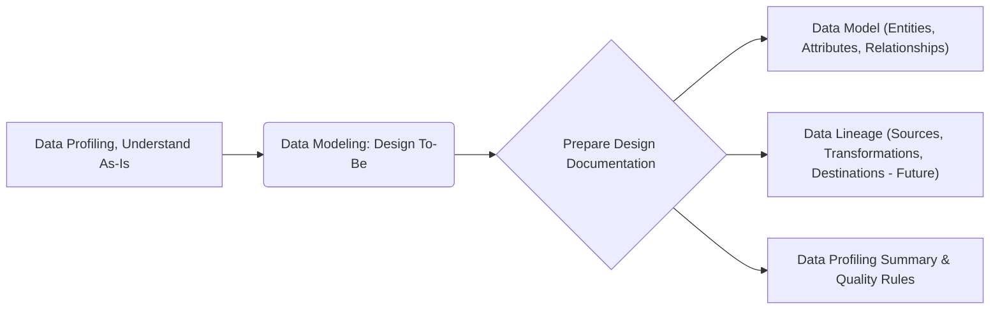
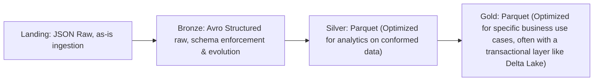
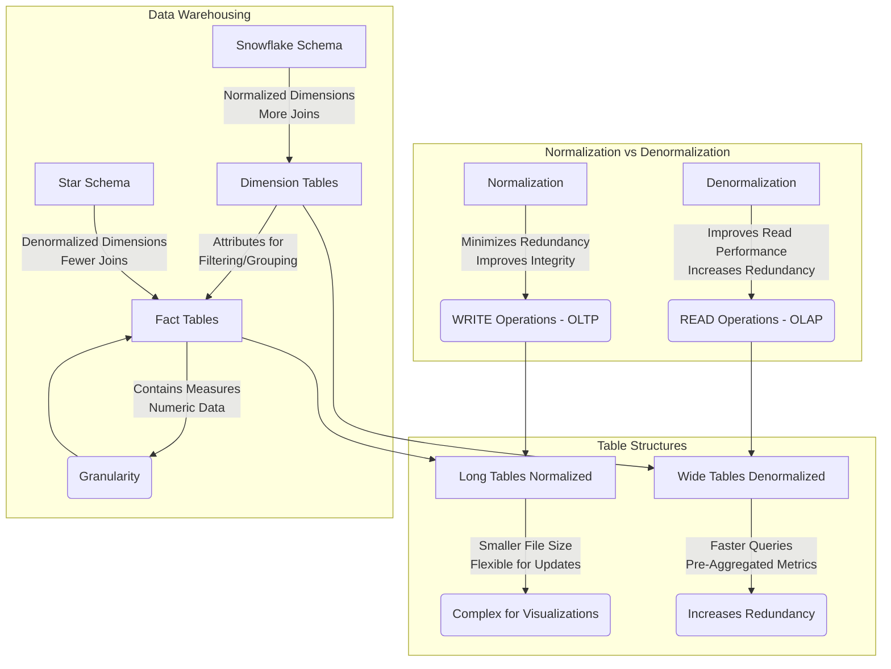

Long ago, I was covering [the analytical stack](https://jalcocert.github.io/JAlcocerT/self-taught-career-guide-for-data-analytics/#the-analytical-stack) and the most popular [concepts for a data analytics journey](https://jalcocert.github.io/JAlcocerT/data-basics-for-data-analytics/).

It is time to make **a recap**.

A recap on [SQL](#sq), [PySpark](#pyspark) and [Data Modelling](#concepts-for-data-analytics).


  
  




This Post is **WIP**


## Concepts for Data Analytics



Dont be scared. 

Both are **places where data is stored**.

**Data Warehouse (DWH):**

* **Purpose:**
    * Primarily designed for **structured data and business intelligence (BI) reporting**.
    * Focuses on providing clean, processed, and organized data for analytical queries.
* **Data Structure:**
    * Employs a "schema-on-write" approach, meaning data is transformed and structured before being loaded into the warehouse.
    * Typically handles structured data from transactional systems.
* **Use Cases:**
    * Traditional BI reporting, dashboards, and analytical queries.
    * Providing a single source of truth for business metrics.
* **Limitations:**
    * Limited flexibility in handling unstructured or semi-structured data.
    * Can be costly and complex to scale.
    * ETL (Extract, Transform, Load) processes can be time-consuming.

**Data Lakehouse:**

* **Purpose:**
    * Aims to combine the best of data lakes and data warehouses.
    * Enables both data science and BI workloads on a single platform.
* **Data Structure:**
    * Supports "schema-on-read" and "schema-on-write" approaches, allowing for flexibility in handling various data types.
    * Can store **structured, semi-structured, and unstructured data**.
* **Use Cases:**
    * Advanced analytics, machine learning, and AI.
    * BI reporting and dashboards.
    * Real-time analytics and streaming data processing.
* **Advantages:**
    * Increased flexibility and scalability.
    * Reduced data duplication and complexity.
    * Ability to perform diverse analytics on a single platform.
    * Supports ACID transactions.
* **Key differentiators:**
    * They enable data lakes to have the data management and transaction capabilities of a data warehouse.
    * They add metadata layers to data lakes, to provide increased data governance.

**Key Comparisons:**

* **Data Types:**
    * DWH: Primarily structured.
    * Lakehouse: Structured, semi-structured, and unstructured.
* **Schema:**
    * DWH: Schema-on-write.
    * Lakehouse: Schema-on-read and schema-on-write.
* **Use Cases:**
    * DWH: BI reporting.
    * Lakehouse: BI, AI, machine learning, and advanced analytics.
* **Flexibility:**
    * Lakehouses are much more flexible.

In essence, the **data lakehouse is a modern data architecture** that seeks to overcome the limitations of traditional data warehouses and data lakes.

It provides a more versatile and efficient platform for organizations to manage and analyze their data.





Thats was were can store.

But how to **process the data**?



Data processing engines are software systems designed to execute data transformations and computations at scale. They form the core of many modern data architectures, enabling the handling of massive datasets for analytics, machine learning, and other data-intensive applications. Here's a breakdown of their key characteristics and types:

**Core Functions:**

* **Data Transformation:**
    * They perform operations like filtering, sorting, aggregating, and joining data.
* **Scalability:**
    * They are designed to distribute workloads across multiple machines, allowing them to process large volumes of data.
* **Fault Tolerance:**
    * They often incorporate mechanisms to handle failures and ensure data processing continues even if some machines go offline.
* **Data Storage Integration:**
    * They can read data from and write data to various storage systems, such as data lakes, data warehouses, and databases.

**Types of Data Processing Engines:**

* **Batch Processing Engines:**
    * These engines process data in large, discrete batches.
    * They are well-suited for tasks that don't require real-time processing.
    * Examples:
        * **Apache Hadoop MapReduce:** A classic batch processing framework.
        * **Apache Spark (Spark SQL):** While Spark can also do streaming, Spark SQL is very good at batch processing.
* **Stream Processing Engines:**
    * These engines process data in real-time as it arrives.
    * They are used for applications that require low-latency processing of continuous data streams.
    * Examples:
        * **Apache Kafka Streams:** A stream processing library built on top of Apache Kafka.
        * **Apache Flink:** A powerful stream processing framework.
        * **Apache Spark Streaming/Structured Streaming:** Spark's stream processing capabilities.
* **Interactive Query Engines:**
    * These engines are designed for interactive data exploration and analysis.
    * They provide fast query response times, enabling users to quickly explore and analyze data.
    * Examples:
        * **Apache Spark SQL:** Also used for interactive queries.
        * **Apache Impala:** A massively parallel processing (MPP) SQL query engine.
        * **Presto/Trino:** Distributed SQL query engines.



In essence, data processing engines are the workhorses of modern data systems, enabling organizations to extract valuable insights from their vast data resources.

You might also hear about **The Data LakeHouse**

A data lakehouse is built on top of a data lake. It uses the data lake as its foundation for scalable and cost-effective storage.

The "house" part refers to the added layers of structure, governance, and transactional capabilities that transform the raw data lake into a more manageable and versatile platform.   

<!-- 
  
  
 -->

Examples of Data Lakehouse Technologies and Implementations:

* **Databricks** Lakehouse Platform: One of the pioneers of the data lakehouse concept, built around Apache Spark and Delta Lake.   
* AWS Lake House: Offers services like S3 for storage and technologies like Apache Iceberg, AWS Glue, and Amazon Redshift Spectrum to build a lakehouse architecture.
* Microsoft Fabric Lakehouse: A unified data analytics platform with a central data lakehouse.   
* **Snowflake**: Evolving to support data lakehouse patterns with features for querying data in external object storage.
* Google Cloud: Integrating BigQuery with data lake storage and governance tools like Dataplex to enable lakehouse capabilities.   
* Open Table Formats (Apache Iceberg, Delta Lake, Apache Hudi): These provide the foundational layer for building reliable and performant data lakehouses on various storage systems. 

> See The book *Building the data lakehouse* by Bill Inmon.

Looking into **open-source data catalog** tools?



* **Apache Atlas:**
    * A powerful and extensible metadata management and governance framework.
    * It provides capabilities for classifying, governing, and discovering data assets.
    * It's widely used in Hadoop ecosystems.

* **DataHub:**
    * Originally developed at LinkedIn, DataHub is a modern metadata platform.
    * It offers features for data discovery, data lineage, and data governance.
    * It's designed to be highly scalable and adaptable to evolving data environments.

> Which can be SelfHosted with Docker!

* **OpenMetadata:**
    * A unified metadata platform that aims to provide a single place for all metadata.
    * it provides data discovery, data observability and data governance.
    * it has a strong and growing community.






  
  





* **Apache Iceberg:**
    * Apache Iceberg is a table format for large analytic datasets. It focuses on providing a high-performance, reliable, and evolving table format for data lakes. While **Iceberg stores metadata about the tables** (schema, partitions, etc.), it's primarily a table format, not a full-fledged data catalogue.
    
> It provides some of the underpinnings that a data catalogue would use.

* **Project Nessie:**
    * Project Nessie is a **Git-like transaction layer for data lakes**. It allows you to create branches and tags of your data, enabling version control and collaborative data management. While Nessie manages metadata and provides a versioned view of data, it's more about data versioning and branching than a comprehensive data catalogue.
    
> Nessie helps to manage the metadata that a data catalogue would use.

When discussing *Nessie namespaces* it's important to understand how they function within the context of Project Nessie and its relationship with data lake technologies like Apache Iceberg. Here's a breakdown:

**Understanding Nessie and Namespaces:**

* **Nessie's Role:**
    * Project Nessie provides a Git-like version control layer for data lakes. This allows for branching, tagging, and committing changes to data in a way that's familiar to software developers.
    * It primarily works with table formats like Apache Iceberg, enabling transactional capabilities and versioning.
* **Namespaces in Data Catalogs:**
    * In data catalogs, namespaces are used to organize and group tables and other data assets. They provide a hierarchical structure that makes it easier to manage large numbers of data objects.
    * Think of them like folders in a file system.
* **Nessie's Approach to Namespaces:**
    * Nessie handles namespaces in a somewhat unique way. Notably, Nessie namespaces are often described as "implicit."
    * This means that you don't necessarily have to explicitly create or delete namespaces in the same way you might in other systems.
    * Instead, Nessie infers namespaces based on the structure of your table identifiers.
    * Essentially, if you create a table with an identifier like `my_namespace.my_table`, Nessie will recognize `my_namespace` as a namespace.
    * From the documentation of Apache iceberg, regarding the Nessie catalog:
        * "Namespaces in Nessie are implicit and do not need to be explicitly created or deleted. The create and delete namespace methods are no-ops for the NessieCatalog."
* **Practical Implications:**
    * This implicit approach simplifies namespace management in Nessie.
    * It aligns with Nessie's goal of providing a flexible and efficient way to version and manage data lake assets.

**In essence:**

* A Nessie namespace is a logical grouping of data assets, primarily tables, within a Nessie-managed data lake.
* Nessie's handling of namespaces is often implicit, meaning they are inferred rather than always explicitly created.







Imagine you're cooking a dish. Data lineage is like tracing the **ingredients** you used all the way back to their **origins** and knowing every **step** they went through to become part of your final meal.

**In simple terms, data lineage is about understanding:**

* **Where your data came from (its source).**
* **What happened to it along the way (the transformations and processes it went through).**
* **Where it ended up (its final destination).**

**Think of it like a data's journey:**

* **Source:** Maybe your customer data came from a website form, sales records, or a marketing email list. These are the "origins" or "ingredients."
* **Transformation:** This raw data might have been cleaned up (removing errors), combined with other data (like purchase history), or analyzed to create new information (like customer segments). These are the "cooking steps."
* **Destination:** Finally, this processed data might end up in a report, a dashboard, a machine learning model, or another database. This is the "final dish."

**Why is data lineage important?**

* **Trust:** It helps you trust your data because you know its history and can verify its quality.
* **Troubleshooting:** If you find an error in a report, you can trace back the lineage to find the source of the problem.
* **Compliance:** In some industries, knowing the origin and journey of data is required for regulatory compliance.
* **Understanding:** It provides a clear picture of how data flows through your systems, which is crucial for understanding your business processes.
* **Impact Analysis:** If you need to change something in your data systems, lineage helps you understand what other systems or reports might be affected.

**Example:**

Let's say a sales report shows a sudden drop in revenue. With data lineage, you could trace back:

1.  **The report:** It pulls data from a specific data warehouse table.
2.  **The data warehouse table:** This table is populated by a daily process that combines data from the CRM system and the order processing system.
3.  **The CRM system:** You might find that there was a problem with data entry in the CRM yesterday.
4.  **The order processing system:** This system was functioning correctly.





By following the data lineage, you quickly identify that the issue likely originated in the CRM data entry, allowing you to investigate and fix the problem.

So, data lineage is essentially the **history and the path** that your data takes from its birth to its current state, helping you understand, trust, and manage it effectively.


  
  


<!-- https://jalcocert.github.io/JAlcocerT/data-analytics-concepts/ -->
<!-- https://greatexpectations.io/blog/what-is-data-profiling -->




<!-- 
 https://greatexpectations.io/expectations/
 https://greatexpectations.io/blog/what-is-data-profiling
  -->

<!-- pydantic -->

Imagine you've just received a big box of assorted items, and you need to understand what's inside before you can use them effectively.

**Data profiling is like taking inventory of that box.**

**In simple terms, data profiling is the process of examining and analyzing your data to discover its characteristics, quality, and structure.** It's about getting a clear understanding of what your data actually looks like.

**Think of it as creating a detailed "data report card" that answers questions like:**

* **What kind of data is there?** (e.g., numbers, text, dates, categories)
* **How many records are there?**
* **What are the common values in each column?**
* **What are the unique values?**
* **Are there any missing values (blanks)?**
* **Are there any invalid or inconsistent values?** (e.g., a date in the future for a past event, a negative value for age)
* **What are the ranges and distributions of numerical data?** (e.g., minimum, maximum, average)
* **What are the lengths and patterns of text data?** (e.g., average string length, common formats)
* **Are there any potential data quality issues?** (e.g., duplicates, outliers)

**Why is data profiling important?**

* **Understanding Your Data:** It gives you a fundamental understanding of the data you're working with, which is crucial for any data-related project.
* **Data Quality Assessment:** It helps identify data quality problems that need to be addressed before using the data for analysis, reporting, or machine learning.
* **Data Cleaning and Preparation:** The insights gained from profiling inform data cleaning and preparation strategies. You know what kind of transformations or corrections are needed.
* **Schema Discovery and Validation:** It can help you understand the actual structure of your data, which might differ from the expected schema.
* **Building Trust in Data:** By understanding the characteristics and quality of your data, you can have more confidence in its reliability.
* **Informing Data Governance:** Profiling provides valuable information for establishing data quality rules and governance policies.

**Example:**

Let's say you have a customer database. By profiling the "Email Address" column, you might discover:

* The majority of entries look like valid email addresses.
* Some entries are missing (null values).
* Some entries have typos (e.g., ".con" instead of ".com").
* Some entries are in an unexpected format.

This information tells you that you need to implement data cleaning steps to handle missing values and correct the typos to ensure accurate communication with your customers.



**In essence, data profiling is the essential first step in any data project. It's about getting to know your data intimately so you can work with it effectively and avoid making decisions based on flawed or incomplete information.** 

> It's like inspecting your ingredients before you start cooking to ensure they are fresh and suitable for your recipe.




Imagine you're planning to build something complex, like a house or a website. Before you start laying bricks or writing code, you need a **blueprint**.

**Data modeling is like creating a blueprint for your data.**

In simple terms, it's the process of:

* **Identifying the important things (entities) you want to keep track of.** For example, in a customer database, these might be "Customers," "Products," and "Orders."
* **Figuring out the characteristics (attributes) of those things.** For a "Customer," these might be "Name," "Email," "Address," and "Phone Number." For a "Product," it could be "Name," "Price," and "Description."
* **Defining how these things relate to each other (relationships).** For instance, a "Customer" can place many "Orders," and each "Order" contains one or more "Products."

**Think of it like organizing your toys in a toy room:**

* **Entities:** The different types of toys you have (e.g., cars, dolls, building blocks).
* **Attributes:** The features of each toy (e.g., the color of a car, the size of a doll, the number of blocks).
* **Relationships:** How the toys interact (e.g., you can build a garage for your cars using the building blocks, a doll can sit in a car).

**Why is data modeling important?**

* **Organization:** It helps organize complex data in a clear and understandable way.
* **Consistency:** It ensures that data is stored consistently across different parts of a system.
* **Efficiency:** A good data model can make it easier and faster to retrieve and manage data.
* **Communication:** It provides a common language and understanding of the data for everyone involved in a project (developers, analysts, business users).
* **Foundation for Databases:** The data model serves as the blueprint for designing and building databases.
* **Avoiding Problems:** A well-thought-out model can prevent data inconsistencies, redundancies, and other problems down the line.



**Data modeling is about creating a structured and logical representation of the data you need, making it easier to work with and understand.**

It's the crucial first step in designing any system that stores and manages information. Just like a good blueprint is essential for a successful building, a good data model is essential for a successful data system.


As per my experience, we should follow this kind of process. Including a [Project Charter](https://github.com/Azure/Azure-TDSP-ProjectTemplate/blob/master/Docs/Project/Charter.md) is also a great idea.




It's a very logical and common sequence of steps in a data-centric project, especially when building or significantly revising a data system.

Imagine you're planning to build something complex, like a house or a website.

Before you start laying bricks or writing code, you need a **blueprint**.




**Data modeling is like creating a blueprint for your data.**

In simple terms, it's the process of:

* **Identifying the important things (entities) you want to keep track of.** For example, in a customer database, these might be "Customers," "Products," and "Orders."
* **Figuring out the characteristics (attributes) of those things.** For a "Customer," these might be "Name," "Email," "Address," and "Phone Number." For a "Product," it could be "Name," "Price," and "Description."
* **Defining how these things relate to each other (relationships).** For instance, a "Customer" can place many "Orders," and each "Order" contains one or more "Products."

**Think of it like organizing your toys in a toy room:**

* **Entities:** The different types of toys you have (e.g., cars, dolls, building blocks).
* **Attributes:** The features of each toy (e.g., the color of a car, the size of a doll, the number of blocks).
* **Relationships:** How the toys interact (e.g., you can build a garage for your cars using the building blocks, a doll can sit in a car).

**Why is data modeling important?**

* **Organization:** It helps organize complex data in a clear and understandable way.
* **Consistency:** It ensures that data is stored consistently across different parts of a system.
* **Efficiency:** A good data model can make it easier and faster to retrieve and manage data.
* **Communication:** It provides a common language and understanding of the data for everyone involved in a project (developers, analysts, business users).
* **Foundation for Databases:** The data model serves as the blueprint for designing and building databases.
* **Avoiding Problems:** A well-thought-out model can prevent data inconsistencies, redundancies, and other problems down the line.



**In summary, thebenefits are:**

* **Profiling provides the necessary context and understanding of the existing data.**
* **Modeling uses this understanding to create a well-informed and effective data structure.**
* **Documentation captures the design, including the planned data lineage, to guide future implementation and maintenance.**

> This systematic approach helps to ensure data quality, consistency, and traceability in your data systems.


## Tools

For your D&A journey, you will need some help from diverse tools.


  




Many of these tools are [SelfHostable with Docker Container **config files**](https://github.com/JAlcocerT/Docker/tree/main/Big_Data)



### SQL

You will see it with different names. But **its just [SQL](https://jalcocert.github.io/JAlcocerT/sql-data-analytics)**

TrinoSQL, MySQL,...

Name it as you want it.

Just control the basics and know that there will be some *ad-ons*.


**What is Normalization?**  

https://jalcocert.github.io/JAlcocerT/data-basics-for-data-analytics/#data-modelling-techniques



**What is Normalization?**  
Normalization is a process of organizing data in a database to **minimize redundancy and dependency**.  
- **Redundancy**: Avoid storing the same data in multiple places to prevent inconsistencies and wasted space.  
- **Dependency**: Ensure that one piece of data doesn't overly depend on another to maintain data integrity.  
- **Key Benefits**:  
  - Reduces redundancy by breaking data into smaller, related tables.  
  - Improves data integrity and accuracy.  
  - Makes database maintenance easier.  
  - Follows structured rules (normal forms).  
  - Ideal for **WRITE-heavy operations** (**OLTP**).  

---

**What is Denormalization?**  
Denormalization combines normalized tables to improve **read performance**, often used in **data warehousing** and reporting scenarios.  
- **Key Benefits**:  
  - Increases redundancy to reduce the number of joins.  
  - Improves read performance with faster query response times.  
  - Sacrifices write efficiency as updates may need replication across tables.  
  - Ideal for **READ-heavy operations** (**OLAP**).  

---

**When to Use Long Tables vs. Wide Tables?**  
- **Long Tables (Normalized)**:  
  - Smaller file size and reduced data duplication.  
  - Flexible for adding new data points (e.g., new categories).  
  - Complexity for some visualizations due to required joins.  
  - Best for **WRITE-heavy workflows**.  
- **Wide Tables (Denormalized)**:  
  - Simpler for visualizations with pre-aggregated metrics in columns.  
  - Faster performance for querying in BI tools.  
  - Increases redundancy and file size.  
  - Best for **READ-heavy workflows**.  

---

**What Are Dimension Tables and Fact Tables in Data Warehousing?**  
- **Dimension Tables**:  
  - Contain descriptive attributes (e.g., customers, products, time, geography).  
  - Provide context for the measures stored in fact tables.  
  - Used for filtering, grouping, and labeling data in queries.  
- **Fact Tables**:  
  - Store measurable, numeric data (e.g., revenue, quantity).  
  - Contain foreign keys linking to dimension tables.  
  - Define granularity (e.g., daily sales, monthly sales).  

**Star Schema vs. Snowflake Schema**:  
- **Star Schema**: Dimension tables are **denormalized**, simplifying queries and improving performance.  
- **Snowflake Schema**: Dimension tables are **normalized** into sub-dimensions, reducing redundancy but requiring more complex queries.  

---

**What Are Primary Keys, Foreign Keys, and Indexes?**  
- **Primary Key**: A column(s) that uniquely identifies each row, enforcing data integrity.  
- **Foreign Key**: A column(s) in one table referencing the primary key of another table, establishing relationships.  
- **Indexes**: Improve data retrieval speed by providing a fast path to locate rows, often created on frequently searched columns.  




  
  




Talk [with a DB via LLMs as described **here**](https://jalcocert.github.io/JAlcocerT/how-to-chat-with-your-data/#chat-with-a-db-with-langchain) with **LangChain**





* [ChartDB](https://github.com/chartdb/chartdb) - Database diagrams editor that allows you to visualize and design your DB with a single query.
* [SQLiteViz](https://github.com/lana-k/sqliteviz)
* [SQliteBrowser](https://github.com/sqlitebrowser/sqlitebrowser)

* [DuckDB](https://github.com/duckdb/duckdb) ~ OLAP
  * [Huey](https://github.com/rpbouman/huey) an UI for DuckDB
  * GetHue - https://hub.docker.com/r/gethue/hue/tags - Hue is an open source SQL Assistant for Database & Data Warehouses. - https://github.com/cloudera/hue

* [ChartDB](https://github.com/chartdb/chartdb) - Database diagrams editor that allows you to visualize and design your DB with a single query.
* [SQLiteViz](https://github.com/lana-k/sqliteviz)
* [SQliteBrowser](https://github.com/sqlitebrowser/sqlitebrowser)




#### Snowflake

**It is a data warehouse.**

You can (or not) design it to have a **bronze/silver/gold** architecture (aka **MEDALLION** architecture).

> You might also hear it as: RAW/Staging/PROD.


  


#### Big Query

**Big Query is GCP's data warehouse**, which has a SQL UI for us to make queries!


  
  


### PySpark

A wrapper in [Python](https://jalcocert.github.io/JAlcocerT/guide-python/) for Spark. [**PySpark**](https://jalcocert.github.io/JAlcocerT/guide-python-PySpark/).

Or **Python for the distributed computing/storage era**.

> https://github.com/vinta/awesome-python?tab=readme-ov-file#data-analysis

This is great for IoT Stuff, like we might have in [Telecom](https://jalcocert.github.io/JAlcocerT/telecom-concepts-101/).

Actually, you can have your own PySpark cluster and use it within JupyterHub (JHub):




**In essence:**

* JupyterHub acts as a central hub for accessing and working with big data tools and resources.
* It promotes collaboration, simplifies workflows, and enables scalable data analysis in big data environments.
* It is a tool that helps to bridge the gap between big data infrastructure, and the data scientists that need to use it.

Some **useful Pyspark stuff?**

```py
spark.read.format('avro')\
.load(f'{active_node}/raw/folder1/folder2/table/{year}/{month}/{day_selected}/00/00')\
.printSchema()

spark.read.format('avro')\
.load(f'{active_node}/raw/folder1/folder2/table/{year}/{month}/{day_selected}/00/00')\
.limit(1).toPandas().style.hide_index()
```

Avro and Parquet are the workhorses for storing and processing large datasets.

```py
spark.read.format('parquet')\
  .load(f'{active_node}/processed/folder1/folder2/table/{year}/{month}/{day_selected}/00/00')\
  .printSchema()         
```

Avro is good for write-intensive scenarios and schema evolution, while **Parquet excels in read-heavy analytical workloads due to its columnar nature**.

> That's why you will find mostly parquet at /processed, Staging or Silver layers. While avro will be closer to /raw, bronze.

Delta Lake builds upon formats like Parquet to provide a robust and reliable data lake architecture, enabling more complex data pipelines and analytical use cases with transactional guarantees and data governance.

```py
from pyspark.sql.functions import sum, col, desc,asc,countDistinct
import pyspark.sql.functions as F

df = spark.read.format('avro')\
    .load(f'{active_node}/raw/folder1/folder2/table/{year}/{month}/{day_selected}/00/00')

df.groupBy("idtype")\
    .agg(f.countDistinct("id").alias("macs"))\
    .sort(desc("macs"))\
    .show(35)
```

You can also read **json tables**: often the initial format for data ingestion or for simple data exchange but is usually transformed into more efficient formats for storage and analysis in big data systems

```py
df = ss.read.json(f"{active_node}/raw/folder1/folder2/table/{year}/{month}/{day_selected}/04/00")
```

> JSON is typical for Landing stages of a Data Lakehouse!

As you can imagine, as json are very close to data sources in big data, you might find interesting **schemas with 29k+ rows**. Yes, I wrote schema.

In such cases, you can **parse just the json fields you need** while reading:

```py
#from pyspark.sql import SparkSession
from pyspark.sql.types import StructType, StructField, StringType

# Initialize Spark session
spark = SparkSession.builder.appName("ExtractFields").getOrCreate()

# Define the schema
schema = StructType([
    StructField("props.cpe.DeviceInfo.ModelName", StringType(), True),
    StructField("props.cpe.DeviceInfo.SerialNumber", StringType(), True),
    StructField("props.cpe.DeviceInfo.SoftwareVersion", StringType(), True)
])

# Read the JSON file using the defined schema
df = spark.read.schema(schema).json(f"{active_node}/raw/folder1/folder2/table/{year}/{month}/{day_selected}/04/00")

# Show the extracted fields
df.show()
```



  **JSON**: JavaScript Object Notation (JSON) is a standard text-based format for representing structured data based on JavaScript object syntax.
  
  
  **YAML**: YAML is a human-readable data serialization language.
  
  You can also read yml:

```py
import yaml

# Replace 'your_file.yml' with the path to your YAML file
with open('your_file.yml', 'r') as file:
    yaml_data = yaml.safe_load(file)

# Access the data as you would with a Python dictionary
print(yaml_data)
```
  
  
  **TOML**: TOML aims to be a minimal configuration file format that's easy to read due to obvious semantics.






**Why is PySpark called lazy?**  

PySpark is considered "lazy" because it does not execute any code until it absolutely has to.  
- When you call a transformation on a PySpark DataFrame or RDD, it does not compute the result until you call an action.  
- This allows Spark to **optimize the execution plan** by analyzing all transformations and determining the most efficient way to execute them.  

> It also delays execution until the result is actually needed, rather than executing each transformation as soon as it's specified.  

---

**What to use, Spark or Pandas? What's the difference?**  

The choice depends on the type and size of your data:  
- **Pandas**: Better for small datasets, with an intuitive and user-friendly interface.  
- **Spark**: Superior for large datasets due to better performance and scalability.  
Spark also offers features like **distributed processing, in-memory computing, streaming, and machine learning algorithms**.  

> Key difference: Pandas works with tabular data, while Spark supports both structured and unstructured data.  

---

**What is data redistributable?**  

Data redistribution is the **process of transferring data** between systems or locations to:  
- Improve performance  
- Enhance scalability  
- Reduce costs  

It’s often used for tasks like moving data between production and test systems or balancing loads across servers/clusters.

---

**What is a partition?**  

Partitions in Spark are **logical divisions of data** stored on a cluster node.  
- They split large datasets into smaller, manageable chunks for parallel processing.  
- Default: **Hash Partitioning**, using a hash function to assign data to partitions.  
- Alternative: **Range Partitioning**, which divides data into partitions based on a range of values.  

---

**What does GroupBy before partitioning do?**  

Grouping data before partitioning organizes it for more efficient processing.  
- Example: Summing values in a column can be optimized by grouping by that column first, ensuring each group’s sum is calculated only once.

---

- **Comprehending the 5V's of Big Data**

- Grasping various Big Data use cases (e.g., IoT, social media analysis, machine learning models, log analytics, etc.)

- Understanding the concept of a Data Lake

- Recognizing the key architectural layers and their roles:
  - Sources
  - Ingestion
  - Storage
  - Processing
  - Presentation
  - Security
  - Governance

- Understanding the CAP Theorem and Distributed Database Management Systems
- Grasping the concept of NoSQL Databases (e.g., Cassandra, HBase, MongoDB)
- Understanding the Ingestion and Processing layers:
  - Concepts: batch vs streaming, ETL vs ELT
  - Core tools: Hive, Spark, Kafka, Sqoop, MapReduce

- Understanding Storage layer concepts:
  - Bronze/Silver/Gold
  - Columnar vs row file formats
  - Partitioning and bucketing
  - Object storage and distributed file systems
  - Core tools: HDFS, S3, Azure Blob

Let's break down each of these concepts related to code profiling in Python:

**🤔 What are code profilers?**

This section provides a concise definition of code profilers:

* **Tools that measure how quickly a computer program runs:** At their core, profilers are about performance measurement. They tell you how long different parts of your code take to execute.
* **Identify areas where it can be improved:** By pinpointing the slow parts of your code (bottlenecks), profilers guide you on where to focus your optimization efforts.
* **Help developers make their programs run faster and more efficiently:** The ultimate goal of using a profiler is to improve the speed and resource usage of your software.

**💡Here are 7 code profilers that you can use in Python.**

This introduces a list of specific Python tools designed for code profiling.

**👉Time and Timeit**

* **a simple way to time small bits of Python code:** These are built-in Python modules that allow you to measure the execution time of specific code snippets.
* **`time`:** Provides basic time-related functions, including getting the current time. You can use it to measure the time before and after a block of code to find the elapsed time.
* **`timeit`:** Designed specifically for accurately timing small code snippets by running them multiple times and averaging the results. This helps to reduce the impact of transient system variations.

**👉cProfile**

* **cProfile is a Python library that is used to measure the performance of code.** It's a standard library module, meaning it comes with Python.
* **It can be used to identify areas of code that are running slowly and need to be optimized.** `cProfile` provides detailed statistics about function calls, including how many times each function was called and the total and per-call execution time. It's a powerful tool for finding performance bottlenecks at the function level.

**👉FunctionTrace**

* **FunctionTrace is a tool used to trace the execution of a program.** Unlike `cProfile` which focuses on timing, `FunctionTrace` primarily records the sequence of function calls.
* **It records the sequence of functions that are called and the parameters that are passed to them.** This can be invaluable for understanding the flow of your program and debugging complex execution paths.
* **This helps to identify errors and optimize the performance of a program.** By seeing the order of function calls and their inputs, you can sometimes spot logical errors or inefficient call patterns that contribute to performance issues.

**👉pyinstrument**

* **Pyinstrument is a Python library that helps developers measure and analyzes the performance of their code.** It's an external library that you need to install.
* **It provides tools to measure how long code takes to execute and to identify which parts of the code are taking the most time.** Pyinstrument is known for its clear and interactive output, often presented as a call stack with timing information. This makes it easy to visualize where your program is spending its time.

**👉py-spy**

* **Py-Spy is a tool used to measure the performance of Python programs.** It's an external tool that can profile running Python processes without modifying the target code.
* **It can be used to measure the speed of code execution, memory usage, and other metrics.** This makes it useful for profiling production systems or long-running processes where you can't easily insert profiling code. Py-Spy samples the running process to gather performance data.

**👉Snakeviz**

* **Snakeviz is a tool for visualizing the run time of Python programs.** It's primarily a visualization tool that takes the output from profilers like `cProfile` and presents it in a graphical and interactive way.
* **It helps you to see how long each part of your code takes to run, so you can identify areas where you can make improvements.** Snakeviz often uses sunburst charts or similar visualizations to represent the call hierarchy and the time spent in each function. This makes it easier to understand complex profiling data.

**👉Yappi**

* **A tracing profiler that is multithreading, asyncio and gevent aware.** This highlights Yappi's key strength: its ability to accurately profile asynchronous and concurrent Python code.
* **Tracing profiler:** Like `FunctionTrace` and `cProfile`, it records detailed information about function calls.
* **Multithreading, asyncio and gevent aware:** This is crucial for modern Python applications that heavily rely on concurrency and asynchronicity. Standard profilers might not accurately represent the execution flow and timings in such applications, but Yappi is designed to handle these complexities.

In summary, these tools provide different ways to understand how your Python code behaves in terms of execution time and resource usage. 

Choosing the right profiler depends on your specific needs, the complexity of your code, and the level of detail you require.



Analogy with a four-layer data lakehouse architecture: Landing, Bronze, Silver, and Gold.

**1. Landing Layer:**

* **Purpose:** This is the initial point of **entry for raw data**, as it arrives from various source systems. The goal is to ingest the data quickly and reliably with minimal transformation.
* **Typical Format:** **JSON** often fits well here due to its flexibility and the fact that many source systems naturally produce JSON. You might also find other raw formats like CSV, XML, or even proprietary binary formats in the landing zone. The key is to keep it as close to the original source as possible.
* **Your Analogy Alignment:** JSON fits perfectly as a typical format in the **Landing** layer.

**2. Bronze Layer (Raw/Curated Raw):**

* **Purpose:** In this layer, the raw data from the landing zone is often made more consistent and reliable. This might involve basic data cleaning, standardization, and potentially schema enforcement (schema-on-write or schema evolution management). The data is still considered "raw" in the sense that it hasn't been heavily transformed for specific use cases.
* **Typical Format:** **Avro** becomes a strong contender in the Bronze layer. Its schema enforcement and evolution capabilities ensure data consistency as it moves downstream. Its binary format also offers better storage efficiency and parsing speed compared to JSON. You might also see Parquet starting to appear in the Bronze layer if the data is already well-structured and the primary goal is efficient storage of the raw data.
* **Your Analogy Alignment:** **Avro** aligns well with the **Bronze** layer, providing structure and efficiency to the raw data.

**3. Silver Layer (Conformed/Cleaned/Integrated):**

* **Purpose:** This layer focuses on data quality, integration, and creating a conformed view of the data. Data from various bronze tables might be joined, cleaned, transformed, and enriched to create business-oriented entities. The schema is typically well-defined and stable.
* **Typical Format:** **Parquet** is the dominant format in the Silver layer due to its **columnar storage**, which is highly optimized for analytical queries. The data in the silver layer is often queried and used for reporting, business intelligence, and data exploration.
* **Your Analogy Alignment:** **Parquet** fits perfectly into the **Silver** layer, providing the performance needed for analytical workloads on cleaned and integrated data.

**4. Gold Layer (Aggregated/Business-Specific):**

* **Purpose:** This is the final layer, tailored for specific business use cases and end-user consumption. Data in the gold layer is often highly aggregated, denormalized, and optimized for specific reporting dashboards, analytical applications, or machine learning models.
* **Typical Format:** **Parquet** remains a common format in the Gold layer due to its analytical performance. However, depending on the specific needs, you might also find data in other formats optimized for particular tools or applications. Delta Lake often plays a significant role here, providing transactional guarantees and data governance for these business-critical datasets built on Parquet.
* **Your Analogy Alignment:** Parquet continues to be relevant in the **Gold** layer for efficient consumption by business users and applications.

**Revised Analogy:**

* **Landing:** **JSON**, CSVs,... (Raw, as-is ingestion)
* **Bronze:** **Avro** (Structured raw, schema enforcement & evolution)
* **Silver:** **Parquet** (Optimized for analytics on conformed data)
* **Gold:** **Parquet** (Optimized for specific business use cases, often with a transactional layer like Delta Lake)





This **four-layer model** provides a more granular [view of the **data journey**](https://www.mermaidchart.com/play?utm_source=mermaid_live_editor&utm_medium=toggle#pako:eNp1zk1qwzAQBeCrPLwoCcQXcKEQJ1AIpinxsu5iKo9jEVlyNZJDUnr3yu6iq85yfr43X5lyLWdFdvY09qhOjUWq7VuTVWRbbc8FDvXxBSe6bkCSa0FqsgTt7LrJ3pHnTyjTeumdvXOB7eQdVnXwUYXouYWfL0X1PBDYds4rHtgGPIAnZ-IMJefxN7hcvF3yam0m9gVeyX9GDlgdx6AHfU9iMkCWzC1oJXAWys3ukEYtBVr_cbuF2yfu2Zn2X0xGVrrTCh9RtGURRGEoEpYNXBfY4qpDD0LwZIXU_DQZGLqxh9EXxp5NIFR04SU--_4BEPJ0GA)



#### DataBricks

[Databricks](https://jalcocert.github.io/JAlcocerT/data-basics-for-data-analytics/#databricks) is a **cloud-based unified analytics platform** for data engineering, data science, and machine learning, built around **Apache Spark**.  


  
    


It offers a **managed Spark environment** along with a collaborative workspace and various integrated tools.

Think of databricks essentially like a very cool jupyter notebooks `.ipynb` which can use pyspark, sql, R...



**Advantages of Databricks:**

* **Managed Spark Environment:** Databricks handles the complexities of setting up, configuring, and managing a Spark cluster.  You don't have to worry about installing Spark, configuring memory, or dealing with cluster failures.  This significantly reduces the operational overhead.

* **Scalability and Elasticity:**  Scaling your Spark cluster up or down is incredibly easy in Databricks. You can quickly provision more resources when needed for large jobs and then scale back down to save costs when the job is finished.  This elasticity is much harder to achieve with a local cluster.

* **Collaboration:** Databricks provides a collaborative workspace where multiple users can work on the same notebooks, share data, and collaborate on projects.  This is a major advantage for teams working on data science or machine learning projects.

* **Integrated Tools and Services:** Databricks integrates with various cloud storage services (AWS S3, Azure Blob Storage, Google Cloud Storage), data lakes, and other data sources.  It also provides built-in tools for data visualization, machine learning (MLflow), and job scheduling.  This streamlined integration simplifies the data workflow.

* **Performance Optimization:** Databricks optimizes the performance of Spark jobs through various techniques, such as caching, query optimization, and intelligent task scheduling.  This can lead to faster execution times compared to a locally managed cluster.

* **Serverless Options:** Databricks offers serverless compute options (like Photon) that further simplify cluster management and optimize cost by automatically scaling resources based on workload demands.

* **Security:** Databricks provides robust security features, including access control, data encryption, and compliance certifications.  Managing security on a local cluster can be more challenging.

* **Auto-termination:** You can configure clusters to automatically terminate after a period of inactivity, saving you money on compute costs.

* **Support:** Databricks provides support for its platform, which can be invaluable when you encounter issues.

**Advantages of a Local PySpark Cluster:**

* **Cost Control (Initially):**  Setting up a local cluster might seem cheaper initially, as you're not directly paying for a cloud service.  However, you need to factor in the costs of hardware, maintenance, electricity, and your own time for setup and administration.
* **Data Locality (Potentially):** If your data is already stored locally, accessing it from a local cluster can be faster than transferring it to the cloud. However, cloud storage solutions are becoming increasingly fast, and Databricks offers optimized ways to access data.
* **Control:** You have complete control over your local cluster environment. You can customize it exactly to your needs.  However, this also means you're responsible for everything.

**When to Choose Which:**

* **Choose Databricks if:**
    * You need to scale your Spark workloads easily.
    * You need a collaborative environment for your team.
    * You want to reduce the operational overhead of managing a Spark cluster.
    * You need access to integrated tools and services for data science and machine learning.
    * You prioritize performance and security.
    * You don't want to manage infrastructure.
* **Choose a Local PySpark Cluster if:**
    * You have very limited budget and your workloads are small and infrequent.
    * You need very specific customization options that aren't available in Databricks.
    * Your data is extremely sensitive and cannot be moved to the cloud (though Databricks offers various security measures).
    * You have the expertise to manage and maintain a Spark cluster.



For most data science and data engineering teams working with Spark, Databricks offers a more efficient, scalable, and collaborative environment compared to managing a local cluster.

While a local cluster might seem cheaper initially, the long-term costs and complexities of management often make Databricks a more cost-effective and productive solution.


<!--  -->


  





You're right to think of Google BigQuery as a competitor to Databricks, but it's important to understand that they approach the data problem from slightly different angles. Here's a breakdown:

**BigQuery:**

* **Focus:** A fully-managed, serverless data warehouse designed for analytical queries and business intelligence.
* **Strengths:**
    * **Serverless:** You don't manage any infrastructure. Google handles everything.
    * **Scalability:** Handles massive datasets with ease.
    * **Speed:** Optimized for fast SQL queries using Dremel technology.
    * **Ease of use:** Relatively easy to learn and use, especially if you're familiar with SQL.
    * **Integration:** Tightly integrated with the Google Cloud ecosystem.
* **Use Cases:**
    * Business intelligence and reporting
    * Data warehousing
    * Ad-hoc analysis
    * Building dashboards
    * Some machine learning with BigQuery ML

**Databricks:**

* **Focus:** A unified analytics platform built around Apache Spark, designed for data engineering, data science, and machine learning.
* **Strengths:**
    * **Flexibility:** Supports a wide range of data processing tasks, including ETL, streaming, and machine learning.
    * **Scalability:** Scales horizontally using Spark's distributed computing model.
    * **Collaboration:** Provides a collaborative workspace for teams.
    * **Openness:** Works with various cloud providers (AWS, Azure, GCP) and integrates with many data sources.
    * **Advanced ML:** Offers advanced machine learning capabilities with MLflow and integrations with popular ML frameworks.
* **Use Cases:**
    * Large-scale data engineering
    * Complex data transformations
    * Machine learning model training and deployment
    * Real-time analytics
    * Data science exploration

**Key Differences:**

* **Architecture:** BigQuery is a data warehouse with a columnar storage format and a query engine (Dremel). Databricks is a platform for data and AI, built on Spark, which is a distributed computing framework.
* **Ease of Use:** BigQuery is generally considered easier to use, especially for those familiar with SQL. Databricks has a steeper learning curve, particularly for data engineering tasks.
* **Infrastructure:** BigQuery is completely serverless. You don't manage any infrastructure. Databricks offers managed Spark clusters, but you still have some level of cluster configuration and management.
* **Machine Learning:** Both platforms support machine learning, but Databricks is generally preferred for more complex and advanced ML workloads.
* **Data Engineering:** Databricks excels in data engineering tasks due to its Spark foundation. BigQuery is less suited for complex data transformations.

**In Summary:**

* If your primary need is to perform fast analytical queries on large datasets for business intelligence and reporting, BigQuery is a great choice.
* If you need a more flexible and powerful platform for data engineering, data science, and machine learning, especially if you're working with Spark, Databricks is a better fit.

There's also some overlap in functionality. For example, you can perform some machine learning tasks in BigQuery using BigQuery ML.

And Databricks offers Databricks SQL, which provides a SQL interface for querying data in your data lake.


You're hitting on a key point about Databricks' architecture! Here's why it needs integration with other cloud providers:

**1. Storage:**

* **Data Lakehouse:** Databricks promotes the concept of a "data lakehouse," which combines the best of data lakes (raw, unstructured data) and data warehouses (structured, processed data). Cloud storage services like AWS S3, Azure Blob Storage, and Google Cloud Storage are the foundation of these data lakehouses. Databricks doesn't typically store the data itself; it leverages these cloud storage services.
* **Cost-effectiveness:** Cloud storage is generally more cost-effective for storing large volumes of data compared to storing it within Databricks itself.
* **Scalability and Durability:** Cloud storage providers offer highly scalable and durable storage solutions, ensuring your data is safe and accessible.

**2. Compute Resources:**

* **Spark Clusters:** Databricks runs on Apache Spark, which requires compute resources to process data. These resources are provided by the cloud provider in the form of virtual machines (VMs). Databricks provisions and manages these VMs to create your Spark clusters.
* **Variety of Instance Types:** Cloud providers offer a wide variety of VM instance types optimized for different workloads (e.g., compute-intensive, memory-intensive). Databricks allows you to choose the appropriate instance types for your Spark clusters.

**3. Ecosystem Integration:**

* **Cloud Services:** Cloud providers offer a rich ecosystem of services, including data ingestion tools, data transformation services, databases, machine learning platforms, and more. Databricks integrates with these services to provide a comprehensive data and AI platform.
* **Managed Services:** Databricks often integrates with managed services offered by cloud providers. For example, it might integrate with a managed Kafka service for real-time data streaming or a managed database service for accessing structured data.

**4. Deployment and Management:**

* **Infrastructure Management:** Databricks relies on the cloud provider's infrastructure for deploying and managing its platform. This includes networking, security, and access control.
* **Simplified Operations:** By integrating with cloud providers, Databricks can simplify the operations of its platform. For example, it can leverage the cloud provider's identity and access management (IAM) services for user authentication and authorization.

* **Databricks integrates with cloud providers primarily for storage, compute resources, ecosystem integration, and simplified deployment and management.**
* **Databricks generally does not store the data itself.** It analyzes the data that resides in cloud storage. However, there are some exceptions:
    * **Delta Lake:** Databricks is the creator of Delta Lake, an open-source storage layer that brings reliability to data lakes. Delta Lake files are typically stored in cloud storage, but Databricks plays a key role in managing and optimizing these files.
    * **Temporary Storage:** Databricks might use temporary storage for caching data during processing, but this is not meant for persistent data storage.



In essence, Databricks leverages the infrastructure and services of cloud providers to deliver its platform.

This allows Databricks to focus on its core strengths: providing a **unified analytics platform** for data engineering, data science, and machine learning, built around the power of Apache Spark.


### Data Engineering Tools

You will get to know: Airflow, Jenkins and similar cloud managed services, like Google Cloud Composer.


If you are preparing a **Data Engineering Interview**, make sure to check [this](https://wetrustindata.com/ace_your_technical_interview_practical/) and [this post](https://wetrustindata.com/ace_your_technical_interview_theory/)



  
  


**Similarities:**

* All three are automation tools.
* They can be used to automate complex tasks.
* They can be used to create pipelines.



**Airflow:**

* **Purpose:** Workflow orchestration.
* **Focus:** Scheduling and monitoring data pipelines (ETL, machine learning workflows).
* **Key Feature:** Directed Acyclic Graphs (DAGs) for defining dependencies.
* **Environment:** Typically self-managed or managed cloud offerings like Cloud Composer.
* **Open Source:** Apache project.

**Jenkins:**

* **Purpose:** CI/CD automation.
* **Focus:** Automating software builds, tests, and deployments.
* **Key Feature:** Extensive plugin ecosystem for various automation tasks.
* **Environment:** Typically self-managed.
* **Open Source:** Community-driven.

**Google Cloud Composer:**

* **Purpose:** Managed workflow orchestration.
* **Focus:** A managed Apache Airflow service on Google Cloud Platform (GCP).
* **Key Feature:** Simplifies Airflow setup and management, integrates with other GCP services.
* **Environment:** Google Cloud Platform.
* **Based on Open Source:** Managed service based on Apache Airflow.



**Differences:**

* **Primary Use:** Airflow and Composer are for data workflows; Jenkins is for software workflows.
* **Management:** Airflow is self-managed (or managed by other cloud providers), Jenkins is self-managed, and Composer is a fully managed service.
* **Cloud Integration:** Composer is tightly integrated with GCP; Airflow and Jenkins require manual integration with cloud services.
* **Scope:** airflow and composer are more data focused, jenkins is more code focused.


  



#### DBT

DBT can help us to make automatization the model/table creation in SQL.

Its very handy to have the tag section, so that you can create the logic of the table involving different CTEs (each of them defined in a different file).

DBT can also help us make tests (schema, rows, aggregations test) thanks to the [package **dbt_expectatitions**](https://hub.getdbt.com/calogica/dbt_expectations/latest/).

The test are configured with a `.yml` file

> Does it remind to **python [great expectations](https://docs.greatexpectations.io/docs/core/introduction/try_gx/)**? data profiling/validation, anybody? :)



  








#### ADF

**Talend is like Azure Data Factory.**

I mean, a **data integration tool**.


<!--
 https://www.youtube.com/watch?v=dFEzT-qfVIk
 -->

Here you have a fantastic introductory video to azure data factory:



> NOT a big data processing tool, like pyspark/databricks are.

You can plug input sources from places like APIs or SAP and direct it towards your DWH (like snowflake).


**Azure Data Factory (ADF)** is a **data engineering tool** within the Azure ecosystem, designed for **orchestrating workflows** and **managing ETL/ELT processes**.


It shares similarities with **Airflow** for workflow orchestration and **dbt** for transformations, but with key differences:  

- **Compared to Airflow**:  ADF is a fully managed service that focuses on data pipelines, whereas Airflow is a general-purpose workflow orchestrator with more flexibility and customization but requires setup and maintenance.  

- **Compared to DBT**:  ADF focuses on end-to-end data movement and transformation (extract, load, transform), while dbt specializes in the "T" (transform) within the data warehouse. ADF can trigger dbt jobs as part of a pipeline.  


  
  


A escalable, low-code solution for **integrating and preparing data** for analytics.


---

## Conclusions

Okay, here's a summary of the data analytics and engineering tools mentioned in the document, categorized for clarity:

**Data Storage (Where to Store Data):**

* **MinIO:** A high-performance, scalable, and cloud-native object storage solution. Ideal for modern data-intensive applications, big data architectures, analytics, and machine learning workloads. It's fast, S3 compatible, and Kubernetes-native.

**Data Processing Engines (How to Process Data):**

* **SQL (TrinoSQL, MySQL, etc.):** The fundamental language for querying and managing relational data. Essential for basic data manipulation and retrieval. Different versions (TrinoSQL, MySQL) exist with potential add-ons, but the core concepts remain crucial.
* **PySpark:** A Python wrapper for Apache Spark. Enables distributed computing and storage using Python. Great for handling large datasets, IoT data, and building scalable data processing pipelines. Can be used within environments like JupyterHub for collaborative big data analysis.
* **DataBricks:** A cloud-based unified analytics platform built around Apache Spark. Provides a managed Spark environment, collaborative workspaces (like enhanced Jupyter Notebooks), and integrated tools for data engineering, data science, and machine learning. Offers a more efficient and scalable environment compared to managing local Spark clusters.

**Data Warehouses (For Structured Analytics):**

* **Snowflake:** A cloud-based data warehouse service. Can be architected using a Medallion (bronze/silver/gold) approach for data organization and quality stages.
* **BigQuery:** Google Cloud Platform's data warehouse. Offers a SQL user interface for querying large datasets.

**Data Engineering Tools (Building and Automating Pipelines):**

* **Airflow (and Google Cloud Composer):** Workflow orchestration tools used to automate complex tasks and create data pipelines. Airflow is self-managed (or managed by other cloud providers), while Composer is a fully managed service on GCP. Primarily focused on data workflows.
* **Jenkins:** An automation tool primarily used for software workflows but can also be adapted for data pipelines. Self-managed and requires manual integration with cloud services.
* **DBT (Data Build Tool):** A tool that helps automate the creation of data models and tables within a data warehouse using SQL. Enables modular table logic (using tags and separate files for CTEs) and facilitates data testing (schema, row, aggregation tests) using packages like `dbt_expectations`.
* **ADF (Azure Data Factory):** A fully managed data integration tool within the Azure ecosystem. Designed for orchestrating workflows and managing ETL/ELT processes. Can connect to various data sources (APIs, SAP) and load data into data warehouses. Not a big data processing engine itself but can trigger tools like DBT.

**BI & Visualization Tools (For Data Analysis and Self-Hosting):**

* **Superset, Metabase, Redash:** Self-hostable Business Intelligence (BI) and data visualization tools (often deployable with Docker). Useful for creating dashboards and exploring data. Redash is highlighted for potentially being very helpful for IoT projects.

**Key Concepts Mentioned:**

* **MEDALLION Architecture (Bronze/Silver/Gold):** A data lakehouse architecture for organizing data in stages of increasing refinement and quality.
* **Data Vault:** A data modeling methodology designed for data warehousing, emphasizing historical tracking and auditability.
* **JupyterHub:** A central hub for accessing and working with big data tools and resources, promoting collaboration and simplifying workflows for data scientists.
* **T-Shape Tools:** The idea of having deep expertise in one or two core tools while also having a broader understanding of other related technologies.
* **Diagrams:** Emphasized as a crucial tool for understanding and communicating complex systems.
* **Time Management, Effective Meetings, RACI Matrix & Project Charter, Pareto Principle:** Mentioned as valuable soft skills and project management concepts.
* **Data Warehousing Concepts:** Table structures (Fact Tables, Dimension Tables), Schemas (Star Schema, Snowflake Schema), Granularity, Normalization vs. Denormalization, and their implications for OLTP (Write operations) and OLAP (Read operations).
* **AI Assistants:** The author mentions their own AI assistants for technical help and job searching.


> Always keeping in mind [Pareto Principle](https://jalcocert.github.io/JAlcocerT/chaos-theory-and-the-double-pendulum-with-python/#the-pareto-principle-8020-and-chaos)




### How to use the AIssistant for Tech?

So you want to use the AI assistant to get help on **Tech Questions**?

SSH into your server and...

...if you need, generate **ssh keys** to authenticate to your repo:




```sh
ls -al ~/.ssh

ssh-keygen -t ed25519 -C "your_email@example.com"  # Recommended
cat ~/.ssh/id_ed25519.pub  # Or id_rsa.pub if you generated an RSA key, paste it on github (Select "Settings."
# In the left sidebar, click "SSH and GPG keys."
# Click "New SSH key" (or "Add SSH key").)

ssh -T git@github.com #test it worked!

eval "$(ssh-agent -s)" # Start the agent
ssh-add ~/.ssh/id_ed25519 # Add your private key (you'll be prompted for the passphrase)
```

```sh
git clone git@github.com:JAlcocerT/Streamlit-AIssistant.git
```


Now, do it with Python:

```sh
pip install --upgrade pip
#sudo apt install python3.12-venv
python3 -m venv Z_ST_AIssistant_venv

#Unix
source Z_ST_AIssistant_venv/bin/activate
#.\Z_ST_AIssistant_venv\Scripts\activate #Windows

pip install -r requirements.txt
```

Or with containers (you will need ~150mb of RAM):

```sh
cd Streamlit-AIssistant

sudo docker pull python:3.11.2 

time docker build -t st_aissistant:v2 . # ~2min
#time podman build -t st_aissistant:v2 . #~4min on a cx22 and ~4min 20s on a Pi4 4GB

# docker buildx create --use
# docker buildx build -t st_aissistant:v2a .

#docker buildx build --platform linux/amd64 --load --tag yourimage .
##docker buildx build --platform linux/amd64 --load --tag st_aissistant:v2b .

#cd Z_DeployMe
#docker-compose up -d
# sudo docker-compose --env-file ../.env up -d

# docker run -d \
#   --name AIstreamlitaissistant \
#   -v ai_streamlitaissistant:/app \
#   -w /app \
#   -p 8501:8501 \
#   ST_AIssistant \
#   /bin/sh -c "streamlit run Z_multichat.py"
  #tail -f /dev/null

# podman run -d --name=AIstreamlitaissistant -p 8502:8501 ....
```


```yml
services:
  streamlit_aissistant:
    image: st_aissistant:v2  
    container_name: st_aissistant #docker exec -it st_aissistant /bin/bash
    ports:
      - "8505:8501"    
    # env_file:
    #   - .env  # Ensure this line is present
    environment:
      - DEV_MODE=False  # Set to "1" for development mode, "0" for production mode
      - OPENAI_API_KEY=sk-proj-open-ai-api
      - AUTH_MODE=Stripe  # Must be set for production
      # - BASE_URL_MAILERLITE=${BASE_URL_MAILERLITE}  # Must be set for production
      # - SHEET_URL_FORMBRICKS=${SHEET_URL_FORMBRICKS}  # Must be set for production
      # - LIST_OF_PRODUCTS=${LIST_OF_PRODUCTS}  # Must be set for production
      - MENU_OPTIONS=Custom Agent,Email Summarizer,Diagram Creation
      - MENU_ICONS=bar-chart-line,envelope,pencil
      - SYSTEM_PROMPT="You are a helpful data analytics assistant, specialized in Python and SQL. You will help to migrate pyspark code into big query sql code and leave the comments in the code where appropiate."
    command: streamlit run Z_ST_AIssistant_v2.py
    #command: tail -f /dev/null
    # networks:
    #   - cloudflare_tunnel
    restart: unless-stopped
            
# networks:
#   cloudflare_tunnel:
#     external: true
```





Compatible with x86 and ARM64!


---

## FAQ


Tools are great.

> But we need to keep improving the way we use them as well.


  



**T-Shape Tools**

**[Diagrams](https://jalcocert.github.io/JAlcocerT/how-to-use-mermaid-diagrams/)**. I should write it in capital letters.

> And you can do [diagrams with AI](https://jalcocert.github.io/JAlcocerT/ai-useful-yet-simple/#diagrams-with-ai)


[Time Management](https://jalcocert.github.io/JAlcocerT/time-management-data-analytics/) is definitely one of the skills i find most valuable.


Together with [effective meetings](https://jalcocert.github.io/JAlcocerT/effective-meetings-data-analytics/), RACI Matrix & [Project Charter](https://github.com/Azure/Azure-TDSP-ProjectTemplate/blob/master/Docs/Project/Charter.md)




**What is s3?**  

MinIO - These are open s3 compatible buckets.

* https://github.com/jmlcas/minio

MinIO is a powerful, high-performance object storage server, and it's important to position it correctly. Here's how I would sell MinIO, focusing on its strengths and addressing the "big data storage" question:

**Key Selling Points:**

* **High Performance:**
    * Emphasize MinIO's speed and efficiency. It's designed for demanding workloads, capable of handling massive data volumes and high throughput.
    * Highlight its use of SIMD instructions and other optimizations that make it exceptionally fast.
* **Kubernetes-Native:**
    * MinIO integrates seamlessly with Kubernetes, making it ideal for cloud-native applications and microservices architectures.
    * This is a huge selling point for modern, containerized environments.
* **S3-Compatible:**
    * MinIO is fully compatible with the Amazon S3 API, which means you can use existing S3 tools and libraries without modification.
    * This reduces vendor lock-in and simplifies migration.
* **Scalability:**
    * MinIO is designed to scale horizontally, allowing you to easily add storage capacity as your needs grow.
    * This is critical for handling large datasets.
* **Software-Defined:**
    * MinIO is software-defined, giving you flexibility in choosing your hardware and deployment environment.
    * This allows for deployment on commodity hardware.
* **Edge-Ready:**
    * MinIO's small footprint and resource efficiency make it suitable for edge computing deployments.
* **Open Source:**
    * MinIO is open source, which provides transparency, community support, and cost-effectiveness.

**Addressing the "Big Data Storage" Question:**

* MinIO is *absolutely* suitable for big data storage, but it's essential to clarify how it fits into the big data ecosystem.
    * **It's not a traditional distributed file system like HDFS. Instead, it's an object storage system**.
    * Object storage is excellent for storing unstructured data, which is a significant component of big data.
    * MinIO is often used as the storage layer for big data analytics platforms like Apache Spark, Presto, and TensorFlow.
    * Explain that minio is very good at storing the data that big data applications use.
    * It is not the big data processing engine itself.
* **Use Cases:**
    * Highlight specific big data use cases where MinIO excels:
        * Data lakes
        * Machine learning datasets
        * Log storage
        * Media storage
        * Backup and archival.
* **Performance for Analytics:**
    * Emphasize MinIO's high performance, which is crucial for real-time analytics and machine learning.




<!-- https://studio.youtube.com/video/KzZ2zCvHhl0/edit -->




**In essence:**

* Position MinIO as a high-performance, scalable, and cloud-native object storage solution that's ideal for modern data-intensive applications.
* Clarify that it's a critical component of big data architectures, providing the storage layer for analytics and machine learning workloads.
* Focus on its speed, S3 compatibility, and kubernetes nativeness.


<!-- ### How to make better EDA?

If you are using PySpark, you are probably interested in making better **Exploratory Data Analysis**

#noise
#predictably irrational
#black swans -->




Initially, I had this one for Telecom











### BI Tools Data Analytic Projects

Specially if you like SelfHosting: Superset, metabase and redash.

But if you are not afraid of some Python, you can also try with Streamlit.


  
  


<!-- https://www.youtube.com/watch?v=_0_Qk0Oleeo -->

If you want to get started with BI Tools, check how to **quickly setup REDASH**:



> It can be veeery helpful for [IoT Projects!](https://jalcocert.github.io/RPi/tags/iot/)


### DSc Tools for D&A Projects

1. https://github.com/mlflow/mlflow

> Apache v2 | Open source platform for the machine learning lifecycle

2. https://github.com/langfuse/langfuse

> 🪢 [OLangfuse](https://langfuse.com/) is an pen source **LLM engineering platform**: LLM Observability, metrics, evals, prompt management, playground, datasets. Integrates with OpenTelemetry, Langchain, OpenAI SDK, LiteLLM, and more. 🍊YC W23


Langfuse can be selfhosted as per: https://langfuse.com/self-hosting/local

```sh
# Get a copy of the latest Langfuse repository
git clone https://github.com/langfuse/langfuse.git
cd langfuse

# Run the langfuse docker compose
docker compose up #important DONT DO docker-compose, it works using v2
#sudo docker stop portainer #if you get port 9000 conflict
#sudo docker start portainre
```

> Go to port `3000` to see the web UI


3. LangGraph: https://www.langchain.com/langgraph

It allows you to **create complex workflows** by defining tasks as nodes in a directed graph, with edges representing the flow of data.



- The system supports **dynamic state management**, maintaining context and ensuring coherent interactions across different agents.
- **Fault tolerance** is built in, meaning the system can recover from failures in individual agents.
- LangGraph is **flexible and customizable**, supporting custom agent logic and communication protocols.
- It is scalable, suitable for **enterprise-level applications**, and excels in handling complex workflows with a high volume of interactions.

- The framework is particularly useful for applications like **chatbots**, **retrieval-augmented generation (RAG)** systems, and **self-correcting agents**.



<!-- https://www.youtube.com/watch?v=qaWOwbFw3cs -->



> This is an agentic fwk!

4. Concepts Like:

* Reranking models for RAG
* Summarization Techniques: https://python.langchain.com/v0.1/docs/use_cases/summarization/
* Hypothetical Documents Embeddings: https://python.langchain.com/v0.1/docs/use_cases/query_analysis/techniques/hyde/
* MultiVector Retrieval
* ReACT fwk