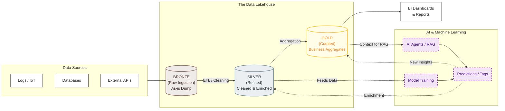
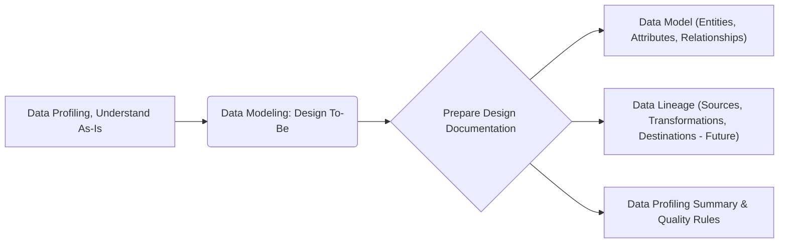

**Intro**

For industries like healthcare, the data lineage is a must.

Fortunately, tools like **Apache Iceberg + Nessie** can help you to create the proper architecture.

You can also find tools like Great Expectations to validate your data.

And finally, tools like Pydantic to validate your data within your Python code.




## Data Management Concepts

A very important distinction in data management. 

See differences between **data validation and data profiling**.



### Data Validation

If you work within D&A already, you might have heard about:

* GX's: *which is helpful to set **data validation rules**, once you know which data you expect as per domain knowledge or previous Data Profiling*
    * https://greatexpectations.io/expectations/
    * https://greatexpectations.io/blog/what-is-data-profiling
* Pydantic: *specially now that they go into the AI space*



Pydantic and Great Expectations both play roles in data validation, but they serve different purposes and operate at different levels.

**Pydantic:**

* **Purpose:**
    * Pydantic is primarily a data validation and settings management library. It's used to define data structures (models) using Python type annotations.
    * It enforces type hints at runtime, ensuring that the data you're working with conforms to the expected structure and types.
    * It's particularly useful for:
        * API development (validating request/response data).
        * Configuration management (parsing and validating settings from files or environment variables).
        * Data serialization/deserialization (converting data between Python objects and JSON, etc.).
* **How it works:**
    * You define data models using Python classes with type annotations.
    * Pydantic automatically validates the data against these annotations.
    * It provides clear error messages if the data is invalid.
    * It can also coerce data types (e.g., converting a string to an integer).
* **Key features:**
    * Type validation.
    * Data serialization/deserialization.
    * Settings management.
    * Custom validation.

**Great Expectations:**

* **Purpose:**
    * Great Expectations is a data testing and validation framework. It's designed to ensure data quality throughout your data pipelines.
    * It focuses on defining and executing "expectations" about your data, such as:
        * Column data types.
        * Value ranges.
        * Data uniqueness.
        * Data completeness.
    * It's used for:
        * Data quality monitoring.
        * Data pipeline testing.
        * Data documentation.
* **How it works:**
    * You define "expectations" about your data using a declarative syntax.
    * Great Expectations executes these expectations against your data.
    * It generates reports that show which expectations passed or failed.
    * It can be integrated into your data pipelines to automatically validate data.
* **Key features:**
    * Data quality testing.
    * Data validation.
    * Data documentation.
    * Integration with various data sources.

**Similarities and Differences:**

* **Data Validation:**
    * Both Pydantic and Great Expectations are data validation tools.
    * However, Pydantic focuses on validating data structures at the application level, while Great Expectations focuses on validating data quality at the data pipeline level.
* **Scope:**
    * Pydantic is more about ensuring that your application receives and processes data in the correct format.
    * Great Expectations is more about ensuring that your data itself is accurate and consistent.
* **Use Cases:**
    * Pydantic is often used in API development and configuration management.
    * Great Expectations is often used in data engineering and data science workflows.
* **Level of Operation:**
    * Pydantic works at the application level, as data is being passed into python objects.
    * Great expectations works at the data level, as data is within dataframes, or databases.




* **Pydantic is for validating data structures** within your Python code.
* Great Expectations is for validating the quality and consistency of your data as it moves through your data pipelines.

They can complement each other.

You might use Pydantic to validate the data you receive from an API and then use Great Expectations to validate the data after it's been processed and stored in your database.

* **Purpose:**
    * Data validation is the process of ensuring that data meets specific criteria or constraints. It's about checking if the data is *correct* according to predefined rules.
    * It's a proactive measure, aimed at preventing incorrect or inconsistent data from entering your systems.
* **Focus:**
    * Verifying that data conforms to expected formats, types, ranges, and business rules.
    * Enforcing data integrity and consistency.
* **Examples:**
    * Checking if a date field is in a valid date format.
    * Ensuring that a customer's age is within a reasonable range.
    * Verifying that a product ID exists in a master product list.
    * Checking if a string is a valid email address.
    * Checking if required fields contain data.
* **When it's used:**
    * During data entry.
    * In data pipelines.
    * Before data is loaded into a database.
    * When an API receives data.

### Data Profiling

* **Purpose:**
    * Data profiling is the process of examining data to understand its characteristics and quality. It's about discovering the *actual* state of the data.
    * It's a reactive or exploratory process, aimed at gaining insights into the data's structure, content, and relationships.

* **Focus:**
    * Analyzing data distributions, frequencies, patterns, and anomalies.
    * Identifying data quality issues, such as missing values, inconsistencies, and outliers.
    * Understanding data relationships and dependencies.
* **Examples:**
    * Determining the percentage of missing values in each column.
    * Identifying the unique values and their frequencies in a categorical column.
    * Calculating the minimum, maximum, and average values of a numerical column.
    * Discovering data patterns, such as common text strings.
    * Identifying correlations between columns.
* **When it's used:**
    * During data exploration and analysis.
    * Before data integration or migration.
    * To assess data quality and identify areas for improvement.
    * When investigating data anomalies.
    * To understand the nature of new data.

**Key Differences Summarized:**

* **Validation:** Checks if data *conforms* to rules.
* **Profiling:** *Describes* the characteristics of the data.
* **Validation:** Proactive (prevents errors).
* **Profiling:** Reactive/Exploratory (discovers issues).
* **Validation:** Focuses on *correctness*.
* **Profiling:** Focuses on *understanding*.

**In essence:**

* Data validation ensures that data is "right" according to your rules.
* Data profiling helps you understand what your data "is" in reality.

They are **complementary processes**.

> You often use data profiling to understand your data and then define data validation rules based on those insights.

### Data Modelling

This deserves its own post...


I made a project with a **Raspberry Pi with [Mongo & DataBricks CE](https://jalcocert.github.io/RPi/posts/rpi-iot-mongodatabricks/)**. [Data Modelling](https://jalcocert.github.io/JAlcocerT/data-basics-for-data-analytics/#databricks) is always an important part!


---

## Conclusions

```mermaid
flowchart LR
    %% --- Styles ---
    classDef bronze fill:#EFEBE9,stroke:#8D6E63,stroke-width:3px,color:#3E2723;
    classDef silver fill:#ECEFF1,stroke:#78909C,stroke-width:3px,color:#263238;
    classDef gold fill:#FFFDE7,stroke:#FBC02D,stroke-width:3px,color:#F57F17;
    
    %% Tool Styles
    classDef storage fill:#cfd8dc,stroke:#37474F,stroke-width:2px,color:#37474F;
    classDef format fill:#b2dfdb,stroke:#00695c,stroke-width:2px,color:#004D40;
    classDef quality fill:#ffecb3,stroke:#ff6f00,stroke-width:2px,stroke-dasharray: 5 5,color:#BF360C;
    classDef code fill:#e1bee7,stroke:#4a148c,stroke-width:1px,stroke-dasharray: 2 2,color:#4a148c;

    %% ================= Physical Foundation =================
    subgraph PhysicalLayer [The Physical Foundation]
        S3[("S3 / Minio<br/>(Object Storage)")]:::storage
    end

    %% ================= Table Format & Catalog Layer =================
    %% This layer sits conceptually *between* physical files and the logical layers
    subgraph ManagementLayer [Table Management & Catalog]
        Iceberg("Apache Iceberg<br/>(Table Format / ACID)"):::format
        Nessie("Nessie<br/>(Data Git / Catalog)"):::format
        Iceberg -.->|Managed by| Nessie
        S3 --- Iceberg
    end


    %% ================= Logical Medallion Flow =================
    subgraph Lakehouse [Logical Data Flow]
        direction TB
        
        Source[Raw Data Sources]

        %% --- Ingestion Pipeline ---
        subgraph Ingest [ETL: Ingestion]
            Pydantic1[("Pydantic<br/>(Schema define)")]:::code
        end

        %% --- Bronze Layer ---
        Bronze[("BRONZE Layer<br/>(Raw Iceberg Tables)")]:::bronze

        %% --- Processing Pipeline 1 ---
        subgraph Process1 [ETL: Cleaning]
            GX1[("Great Expectations<br/>(Quality Gate: Null checks, types)")]:::quality
        end

        %% --- Silver Layer ---
        Silver[("SILVER Layer<br/>(Enriched Iceberg Tables)")]:::silver

        %% --- Processing Pipeline 2 ---
        subgraph Process2 [ETL: Aggregation]
            GX2[("Great Expectations<br/>(Quality Gate: Business Rules)")]:::quality
        end

        %% --- Gold Layer ---
        Gold[("GOLD Layer<br/>(Aggregated Iceberg Tables)")]:::gold
        
        %% --- The Connections ---
        Source --> Pydantic1 --> Bronze
        Bronze --> GX1 --> Silver
        Silver --> GX2 --> Gold
    end

    %% Mapping Logical to Physical/Management
    %% The logical layers ARE Iceberg tables sitting on S3
    Bronze -.-> Iceberg
    Silver -.-> Iceberg
    Gold -.-> Iceberg
```




### BI Tools and DBs

These tools work to bring proper data to Gold layer, where we tend to have **reporting and BI tools**:


  


One of my favourite, is Dbeaver:

```sh
flatpak install flathub io.dbeaver.DBeaverCommunity

#flatpak install flathub io.conduktor.Conduktor #Kafka Desktop Client
#https://flathub.org/apps/dev.k8slens.OpenLens #k8s IDE
```


  
  


If you are not so much [familiar with SQL](https://jalcocert.github.io/JAlcocerT/sql-data-analytics/), no need to worry.

You can get help from LLMs to query directly your databases:


  
  



### AI Assisted Analytics

1. Github Copilot

2. [Google Code Assist](https://codeassist.google/#available-in-your-favorite-ides-and-platforms) with this [vscode extension](https://marketplace.visualstudio.com/items?itemName=Google.geminicodeassist)

```sh
ext install Google.geminicodeassist
```

> You can add cool extensions [like so](https://jalcocert.github.io/JAlcocerT/git-recap/#vscode)

When authorized you will see [this](https://developers.google.com/gemini-code-assist/auth/auth_success_gemini) and Gemini Code Assistant will be ready!

3. OSS code assistants:

* Codeium -  which is now called windsurf!
* Tabby - https://fossengineer.com/selfhosting-Tabby-coding-assistant/
* [Bito AI](https://docs.bito.ai/feature-guides/ai-that-understands-your-code/how-it-works)

4. IDE's with built in code assistant:

* Zed - https://zed.dev/download
* Rivet - https://github.com/Ironclad/rivet/releases - Integrate it with Ollama/Claude/GPT4...
* cursor.sh - use it with your own OpenAI/Anthropic/Azure keys


{}

```sh
#wget https://github.com/Ironclad/rivet/releases/download/app-v1.7.8/rivet_1.7.8_amd64.AppImage
#chmod +x rivet_1.7.8_amd64.AppImage
./rivet_1.7.8_amd64.AppImage
```

{}


{}

```sh
code --list-extensions

#https://marketplace.visualstudio.com/items?itemName=Bito.Bito
#ext install Bito.Bito

#https://marketplace.visualstudio.com/items?itemName=ex3ndr.llama-coder&ssr=false#review-details
#ext install ex3ndr.llama-coder

#https://marketplace.visualstudio.com/items?itemName=Codeium.CodeiumVS
#https://marketplace.visualstudio.com/items?itemName=GitHub.copilotvs
```

{}

You can also try [PandasAI](https://pypi.org/project/pandasai/) and [Sketch](https://pypi.org/project/sketch/) with Python.

---

## FAQ

### Other Tools For Data Analytics


{}

* **Airflow:**
    * **A workflow orchestration tool**.
    * Used to programmatically author, schedule, and monitor data pipelines.
    * Ideal for managing complex ETL processes, data transformations, and machine learning workflows.
* **Jenkins:**
    * A continuous integration/continuous delivery **(CI/CD) automation server**.
    * Used to automate software builds, tests, and deployments.
    * Ideal for automating the software development lifecycle, ensuring code quality, and enabling rapid releases.

> [Airflow, which you can use with docker](https://fossengineer.com/airflow-docker/), is awsome to schedule Python data Pipelines.

* Alternatives:
    * Mage - https://www.youtube.com/watch?v=sNagAw91PW0
    * Prefect - https://www.youtube.com/watch?v=f_MPmRj7P_w


> You can also [SelfHost Jenkins](https://fossengineer.com/selfhosting-jenkins-ci-cd/)

{}