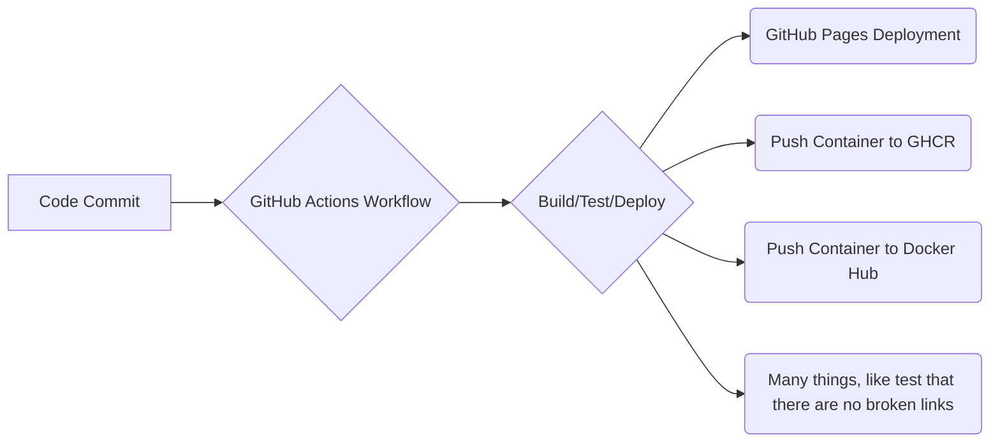

**Tl;DR**

YOu might come to this post bc of selfhosting and containers.

And stay when you realize how much you can do with proper devops setup in your homelab.

**Intro**

Why DevOps?

Because we want to move fast from idea to development and ship to production for your users. 
<!-- https://www.youtube.com/shorts/551lh10g_go -->



[Containers](#containers) are one of the tools that you can use withing Development Operations.


## Containers

As you know, they are an amazing technology to pack apps so that they work reliably in any computer.

Some people might think that [docker](https://github.com/JAlcocerT/Docker) = containers, when its containers > docker, podman...

1. https://github.com/NucleoFusion/cruise

>  MIT | Cruise is a powerful, intuitive, and fully-featured TUI (Terminal User Interface) for interacting with Docker. Built with Go and Bubbletea, it offers a visually rich, keyboard-first experience for managing containers, images, volumes, networks, logs and more — all from your terminal. 

2. [Lazydocker](https://jalcocert.github.io/JAlcocerT/selfhosted-apps-06-2025/#conclusions)

3. CRON jobs via UI: https://docs.linuxserver.io/images/docker-healthchecks/

4. FAIL2BAN: <https://docs.linuxserver.io/images/docker-fail2ban/#docker-compose-recommended-click-here-for-more-info>

5. Crontab for Docker - https://github.com/mcuadros/ofelia

I love to use [containers for **SelfHosting**](https://jalcocert.github.io/Linux/docs/linux__cloud/selfhosting/)

They allow us to package complete applications.

Making the deploy process on other servers kind of *copy and paste*.



```sh
echo "Updating system and installing required packages..." && \
sudo apt-get update && \
sudo apt-get upgrade -y && \
echo "Downloading Docker installation script..." && \
sudo curl -fsSL https://get.docker.com -o get-docker.sh && \
sudo sh get-docker.sh && \
echo "Docker installed successfully. Checking Docker version..." && \
sudo docker version && \
echo "Testing Docker installation with 'hello-world' image..." && \
sudo docker run hello-world && \
echo "Installing Docker Compose..." && \
sudo apt install docker-compose -y && \
echo "Docker Compose installed successfully. Checking version..." && \
sudo docker-compose --version && \
echo "Checking status of Docker service..." && \
sudo systemctl status docker | grep "Active" && \
sudo docker run -d -p 8000:8000 -p 9000:9000 --name=portainer --restart=always -v /var/run/docker.sock:/var/run/docker.sock -v portainer_data:/data portainer/portainer-ce
```






```sh
echo "Updating system and installing required packages..." && \
sudo apt-get update && \
sudo apt-get upgrade -y && \
echo "Installing Podman..." && \
sudo apt-get -y install podman && \
echo "Podman installed successfully. Checking Podman version..." && \
podman --version && \
echo "Testing Podman installation with 'hello-world' image..." && \
sudo podman run hello-world && \
echo "Installing Podman Compose..." && \
sudo apt-get -y install podman-compose && \
echo "Podman Compose installed successfully. Checking version..." && \
podman-compose --version && \
echo "Checking status of Podman service..." && \
sudo systemctl status podman | grep "Active" && \
sudo podman run -d -p 8000:8000 -p 9000:9000 --name=portainer --restart=always -v /var/run/podman/podman.sock:/var/run/podman/podman.sock -v portainer_data:/data portainer/portainer-ce
```



## CI/CD Tools


  


### Github CI/CD

GitHub Actions, a **CI/CD framework** provided by GitHub, allows you to automate the build, test, and deployment processes for your software projects.

You can do cool things, like:




  
  


#### How to use Github Actions CI/CD?



With GitHub Actions, you can define workflows to automate tasks such as compiling code, running tests, performing code analysis, and generating build artifacts.

It supports various programming languages and offers great flexibility in customizing your CI pipeline.

In addition to Continuous Integration (CI), GitHub Actions also supports Continuous Deployment (CD) by integrating with different deployment strategies and environments.

This allows you to automate the deployment of your application to various platforms and hosting services, such as cloud providers or dedicated servers, ensuring a seamless release process.



This is how I've used **GH Actions in my projects:**


 
  

  

    




  Also this webpage is created with [HUGO and GH Actions!](https://github.com/JAlcocerT/JAlcocerT/blob/main/.github/workflows/pages.yaml)


GitHub Workflows enable automatic Docker container creation given conditions (like a new push).

To start, go to your repository, click on **Actions**, and then **New workflow**.

You can select a workflow template that suits your project or follow the steps below to create your own `.yml` file for CI/CD.

The CI/CD workflow configuration is stored in `.github/workflows/ci_cd.yml`:

```yml
name: CI/CD Pipeline

on:
  push:
    branches:
      - main

jobs:
  build-and-push:
    runs-on: ubuntu-latest

    steps:
    - name: Checkout repository
      uses: actions/checkout@v2

    - name: Set up Docker Buildx
      uses: docker/setup-buildx-action@v1
```

This setup prepares your Docker image.

Next, you can **push the image to a container registry**, such as [GitHub Container Registry](#pushing-containers-to-ghcr) or [DockerHub](#pushing-docker-containers-to-dockerhub).

#### Pushing Containers to GitHub Container Registry

To push the created container to GitHub Container Registry, add the following to your workflow:

```yml
    - name: Login to GitHub Container Registry
      uses: docker/login-action@v1
      with:
        registry: ghcr.io
        username: ${{ github.actor }}
        password: ${{ secrets.CICD_TOKEN_For_This_WF }}

    - name: Build and push Docker image
      uses: docker/build-push-action@v2
      with:
        context: .
        push: true
        tags: ghcr.io/your_github_username/your_repo_name:v1.0        
```

You’ll need a **CICD_TOKEN_For_This_WF** secret so GitHub can authenticate the action.

Obtain this token from **GitHub Settings** under `Developer Settings -> Personal Access Tokens`.

Next, add this token as a repository secret under `Repo Settings -> Secrets & variables -> Actions -> New repository Secret`.


Ensure the secret name matches the variable used in your `.yml` configuration.


To make your Docker image publicly accessible, set the package visibility to public under `https://github.com/yourGHuser?tab=packages` and update the **Visibility of the Package**.

Now, anyone can pull your Docker image using:

```sh
docker pull ghcr.io/your_github_username/your_repo_name:v1.0
```

### How to Self-Host Jenkins?

We have all been new to CI/CD at some point.

If you want to **tinker with Jenkins**, a great way is to [**Self-Host** Jenkins with Docker](https://fossengineer.com/selfhosting-jenkins-ci-cd/).


  


## Ansible

It's all about the **playbook**!

* https://github.com/devopsjourney1/ansible-rasp


  
  


<!-- UI: ansible semaphore
<https://www.youtube.com/watch?v=NyOSoLn5T5U>
<https://github.com/ChristianLempa/videos/tree/main/ansiblesemaphore-tutorial> -->

<!-- 
and terraform? -->

**Ansible and Docker: Working Together**

**Ansible** is an open-source software provisioning, configuration management, and application-deployment tool. It automates repetitive tasks such as:

* Configuration management
* Application deployment
* Intra-service orchestration

Ansible uses a simple syntax written in YAML called **playbooks**, which allows you to describe automation jobs in a way that approaches plain English.

**Docker**, on the other hand, is an open-source platform that automates the deployment, scaling, and management of applications. It does this through **containerization**, which is a lightweight form of virtualization.

Docker allows developers to package an application with all of its dependencies into a standardized unit for software development.

> This ensures that the application will run the same, regardless of the environment it is running in.

Ansible and Docker are both powerful technologies that are widely used in the field of software development and operations (DevOps). They serve different but complementary purposes.

These two tools can work together in a few different ways:

* **Ansible can manage Docker containers:** Ansible can be used to automate the process of managing Docker containers. Ansible has modules like `docker_image` and `docker_container` which can be used to download Docker images and to start, stop, and manage the life cycle of Docker containers.
* **Ansible can be used to install Docker:** You can write an Ansible playbook to automate the process of installing Docker on a server.
* **Docker can run Ansible:** You can create Docker containers that have Ansible installed. This might be useful if you want to run Ansible commands or playbooks inside a Docker container for testing or isolation.

In a typical DevOps pipeline, *Docker can be used for creating a reproducible build and runtime environment* for an application, while **Ansible can be used to automate the process of deploying that application** across various environments. This combination can help teams create efficient, reliable, and reproducible application deployment pipelines.


```sh
apt install ansible
ansible --version
```


## Kubernetes


K8s vs K3s...


* https://www.xda-developers.com/kubernetes-cluster-raspberry-pi-guide/

Kubernetes - A tool to manage and automate automated workflows in the cloud. It orchestrates the infrastructure to accomodate the changes in workload.

The developer just need to define a yml with the desired state of your K8s cluster.

In this project we will be collecting **Temperature and Humidity Data** from a DHT11 or a DHT22 Sensor working together with a Raspberry Pi.

The data store will be in MongoDB, which will live in a Docker container.

Rancher is an open source container management platform built for organizations that deploy containers in production. Rancher makes it easy to run Kubernetes everywhere, meet IT requirements, and empower DevOps teams.

### Rancher: k3s

Setting up a High-availability K3s Kubernetes Cluster for Rancher.

We just need to [have Docker installed](https://jalcocert.github.io/RPi/posts/selfhosting-with-docker/) and thanks to Rancher we can **run our own Kubernetes Cluster**.

* <https://hub.docker.com/r/rancher/k3s/tags>
* <https://github.com/rancher/rancher>
* <https://www.rancher.com/community>

### Master Node

```yml
services:
  k3s:
    image: rancher/k3s
    container_name: k3s
    privileged: true
    volumes:
      - k3s-server:/var/lib/rancher/k3s
    ports:
      - "6443:6443"
    restart: unless-stopped

volumes:
  k3s-server:

#docker run -d --name k3s --privileged rancher/k3s  

```


### Using kubectl

**kubectl** is a command-line tool that allows you to run commands against Kubernetes clusters.

It is the primary tool for interacting with and managing Kubernetes clusters, providing a versatile way to handle all aspects of cluster operations.

Common kubectl Commands:
 
kubectl get pods: Lists all pods in the current namespace.
kubectl create -f <filename>: Creates a resource specified in a YAML or JSON file.
kubectl apply -f <filename>: Applies changes to a resource from a file.
kubectl delete -f <filename>: Deletes a resource specified in a file.
kubectl describe <resource> <name>: Shows detailed information about a specific resource.
kubectl logs <pod_name>: Retrieves logs from a specific pod.
kubectl exec -it <pod_name> -- /bin/bash: Executes a command, like opening a bash shell, in a specific container of a pod.

> You will need to understand what are the K8s master/Slave


## Monitoring

You can try with a custom Grafana dashboard or with Beszel:


  


Or with Uptime Kuma:

Be aware of the http **status codes**: https://it-tools.tech/http-status-codes

With Uptime Kuma, you can get quickly an uptime pages for your services:


  



> People [build business](#uptime-kuma-api) around this kind of things: https://status.perplexity.com/, see https://instatus.com/pricing

<!-- 
https://www.youtube.com/watch?v=fxVNTffZC2U 
-->



If you want to play deeper with uptime kuma, see their API: https://uptime-kuma-api.readthedocs.io/en/latest/

> See also https://github.com/ivbeg/awesome-status-pages

### Grafana

GrafanaPrometheusNodeExp.JPG

https://jalcocert.github.io/JAlcocerT/setup-bi-tools-docker/#grafana

### NetData

[SelfHost NetData with Docker](https://fossengineer.com/selfhosting-server-monitoring-with-netdata-and-docker/)


* [Redis](https://www.youtube.com/watch?v=qucL1F2YEKE)
* SandStorm [SelfHost WebApps](https://docs.sandstorm.io/en/latest/)

## Server-less Functions - FaaS

Cloud Native [Function-as-a-Service Platform](https://github.com/OpenFunction/OpenFunction) 

> Thanks to [DevOps Toolkit](https://www.youtube.com/watch?v=UGysOX84v2c) for showing this. 


---


## Conclusions


<!-- 
Observability Platform for LLMs
  https://github.com/traceloop/openllmetry
  https://github.com/langfuse/langfuse
  
  Epam Dial + prometheus + grafana
  Or with LangSmith
Also DataDog - https://docs.datadoghq.com/llm_observability/ -->


<!-- Goals:
  • AI Gen
    LangChain
    LocalModels: with Docker
    From Streamlit to Chainlit / Gradio: https://pypi.org/project/gradio/
    LLMOps: MLFlow, Airflow, VectorDBs… Onboarding Guide - GenAI-X Innovation Team - EPAM Knowledge Base
      mlflow/mlflow: Open source platform for the machine learning lifecycle (github.com)
    GPT4-Turbo
  • V3 of ML trainnings - To include MLFlow
Airflow to start some job? -->


---

## FAQ

**How to monitor the Status of my Services?**

You can get help from [Uptime Kuma with Docker](https://fossengineer.com/selfhosting-uptime-Kuma-docker/).

### Transfering Files - What it is a FTP?

FTP stands for **File Transfer Protocol**, and an FTP server is a computer or software application that runs the FTP protocol.

Its primary purpose is to facilitate the transfer of files between different computers over a network, such as the internet or a local area network (LAN). 

#### Why FTPs?

In essence, FileZilla acts as **a bridge between your local computer and remote servers**, making it easy to work with files stored on those servers as if they were part of your own file system. 

It's a popular choice for developers, system administrators, and anyone who needs to transfer files to or from remote servers **securely and efficiently**.

* Sharing Large Files: FTP servers allow you to share really big files that are too large for email or messaging apps.
* Fast and Efficient: They make it easy for multiple people to download the same file at the same time, so you don't have to send it to each person individually.
* Access Anywhere: Your friends or family can access the files from anywhere with an internet connection. They don't have to be at your house.
* Backup and Storage: You can use an FTP server to back up important files and keep them safe in case something happens to your computer.

#### How to use FTP?

* **FileZilla** is open-source software (GPL), and it has desktop applications available for both Windows and Linux. 

FileZilla is similar to a remote folder connection. It allows you to connect to and manage files on remote servers over the internet or a network. Here's how it works:

* Connecting to Remote Servers: FileZilla allows you to connect to various types of remote servers, including FTP (File Transfer Protocol), SFTP (SSH File Transfer Protocol), FTPS (FTP Secure), and more. You provide the server's address (like a website URL or IP address), your username, and password (if required) to establish a connection.
    * http://192.168.3.200:3090/
    * user & pass

* Remote File Management: Once connected, FileZilla displays the files and directories on the remote server in one pane and your local computer's files and directories in another pane. It lets you navigate through the remote server's file system just like you would on your own computer.


```sh
apt update
apt install filezilla
```

* **FTP Servers** - Delfer / vsFTP

#### Other ways - WebDavs and SMB

* Have a look to [Nextcloud with Docker](https://jalcocert.github.io/RPi/posts/selfhosting-nextcloud/)
* [Samba Server with Docker](https://fossengineer.com/selfhosting-samba/)
    * Samba is the de facto open-source implementation of the SMB/CIFS protocol for Unix-like systems, including Linux. You can install and configure Samba on your Linux server to share files and directories with Windows and other SMB clients.

### What about Proxmox?

* https://www.proxmox.com/en/

### What about OMV?

[Open Media Vault](https://www.openmediavault.org/) - Debian Based NAS

### What it is LXC?

LXC (LinuX Containers) is a OS-level virtualization technology that allows creation and running of multiple isolated Linux virtual environments (VE) on a single control host.

### How to run Rust w/o OS?

https://www.youtube.com/watch?v=jZT8APrzvc4

### How to develop inside a Docker Container

https://www.youtube.com/watch?v=dihfA7Ol6Mw

### Linux and Robotics?

https://www.youtube.com/watch?v=-JVHvU3Oor8

---


## FAQ

### What are K8s PODs?

### Master and Nodes with Differente CPU archs?

### Rancher Alternatives


### What is it Kubeflow?

*  Kubeflow is the machine learning toolkit for Kubernetes:
    * <https://www.kubeflow.org/>
    * <https://github.com/kubeflow/examples>

Kubeflow is an **open-source platform for machine learning and MLOps on Kubernetes**.

It was introduced by Google in 2017 and has since grown to include many other contributors and projects. 

Kubeflow aims to make deployments of machine learning workflows on Kubernetes simple, portable and scalable3. Kubeflow offers services for creating and managing Jupyter notebooks, TensorFlow training, model serving, and pipelines across different frameworks and infrastructures3.

Purpose: Kubeflow is an open-source project designed to make deployments of machine learning (ML) workflows on Kubernetes easier, scalable, and more flexible.

Scope: It encompasses a broader range of ML lifecycle stages, including preparing data, training models, serving models, and managing workflows.

Kubernetes-Based: It’s specifically built for Kubernetes, leveraging its capabilities for managing complex, distributed systems.

Components: Kubeflow includes various components like Pipelines, Katib for hyperparameter tuning, KFServing for model serving, and integration with Jupyter notebooks.

Target Users: It's more suitable for organizations and teams looking to deploy and manage ML workloads at scale in a Kubernetes environment.

### What it is MLFlow?

* <https://mlflow.org/>
* <https://github.com/mlflow/mlflow>

Purpose: MLflow is an open-source platform primarily for managing the end-to-end machine learning lifecycle, focusing on tracking experiments, packaging code into reproducible runs, and sharing and deploying models.

Scope: It’s more focused on the experiment tracking, model versioning, and serving aspects of the ML lifecycle.

Platform-Agnostic: MLflow is designed to work across various environments and platforms. It's not tied to Kubernetes and can run on any system where Python is supported.

Components: Key components of MLflow include MLflow Tracking, MLflow Projects, MLflow Models, and MLflow Registry.

Target Users: It's suitable for both individual practitioners and teams, facilitating the tracking and sharing of experiments, models, and workflows.

While they serve different purposes, Kubeflow and MLflow can be used together in a larger ML system.

For instance, you might use MLflow to track experiments and manage model versions, and then deploy these models at scale using Kubeflow on a Kubernetes cluster.

Such integration would leverage the strengths of both platforms: MLflow for experiment tracking and Kubeflow for scalable, Kubernetes-based deployment and management of ML workflows.
In summary, while Kubeflow and MLflow are not directly related and serve different aspects of the ML workflow, they can be complementary in a comprehensive ML operations (MLOps) strategy.

### Kustomize

* What It Is: Kustomize is a standalone tool to customize Kubernetes objects through a declarative configuration file. It's also part of kubectl since v1.14.
* Usage in DevOps/MLOps:
* Configuration Management: Manage Kubernetes resource configurations without templating.
* Environment-Specific Adjustments: Customize applications for different environments without altering the base resource definitions.
* Overlay Approach: Overlay different configurations (e.g., patches) over a base configuration, allowing for reusability and simplicity.

### Useful Videos to Learn more about K8s

* <https://www.youtube.com/watch?v=PziYflu8cB8>
* <https://www.youtube.com/watch?v=s_o8dwzRlu4>
* <https://www.youtube.com/watch?v=DCoBcpOA7W4>
* <https://www.youtube.com/watch?v=n-fAf2mte6M>

### Uptime Kuma API

Yes, Uptime Kuma does provide an API, but it is primarily an internal API designed for the application's own use and is not officially supported for third-party integrations. 

It offers a Socket.io real-time communication API after authentication and some RESTful API endpoints for tasks like push monitors, status badges, and public status page data.[1]

Using the API (especially through unofficial wrappers like the Python wrapper "uptime-kuma-api"), you can programmatically add new monitors (websites or services) and retrieve some monitoring data.

For example, you can create a new HTTP monitor by specifying the type, name, and URL via the API.[2][3]

The API allows you to:

- Post new websites or services to monitor.
- Retrieve their status and monitoring data.
- Access real-time updates through Socket.io.
- Get status badges or integrate with Prometheus metrics.
  
However, the official API is somewhat limited and not guaranteed to be stable or fully documented for external use, so use it with caution.

In summary:
- You can add monitors programmatically.
- You can retrieve monitoring data (status, alerts).
- The API is mostly internal and unofficial but functional.
- There are third-party wrappers to help interact with it.

This means yes, you can post new websites to monitor and retrieve their data using the API, but expect it to be experimental or unofficial.[3][1][2]

[1](https://github.com/louislam/uptime-kuma/wiki/API-Documentation)
[2](https://github.com/lucasheld/uptime-kuma-api)
[3](https://pypi.org/project/uptime-kuma-api/)
[4](https://uptime-kuma-api.readthedocs.io)
[6](https://www.home-assistant.io/integrations/uptime_kuma/)
[7](https://echoesofping.hashnode.dev/comprehensive-guide-to-installing-and-using-uptime-kuma-for-uptime-monitoring)
[19](https://app.readthedocs.org/projects/uptime-kuma-api/)
[20](https://github.com/louislam/uptime-kuma)

Here is a summary of the full setup to integrate your **self-hosted Uptime Kuma with a Jamstack** site like Astro securely and efficiently:

- **Uptime Kuma Self-Hosted:** Runs your uptime monitoring and exposes an internal API for adding monitors and retrieving status data.

- **API Security:**  
  - Restrict the Uptime Kuma API with proper authentication (tokens or keys).  
  - Use CORS to allow requests only from your trusted domains.

- **Middleware Layer:**  
  - Deploy a middleware proxy between Uptime Kuma and your Astro site to handle security and data processing.  
  - Cloudflare Workers are an excellent choice for middleware, providing edge deployment, secure token handling, CORS management, caching, and request/response transformation.

- **Astro Jamstack Site:**  
  - Your Astro site calls the middleware endpoint (Cloudflare Worker) rather than directly contacting Uptime Kuma.  
  - This can be done client-side (CSR) for dynamic updates or during build time for static rendering.  
  - The middleware fetches data from Uptime Kuma securely and returns only the necessary information to the site.

Benefits of This Setup

- Keeps API keys and tokens secure and away from the client.  
- Protects your Uptime Kuma API with domain-based CORS and authentication.  
- Enables efficient, low-latency data fetching from the edge.  
- Allows flexible data formatting and caching to optimize your site performance.  

This architecture ensures both **security** and **scalability** for showing Uptime Kuma monitoring data seamlessly in your Jamstack site.[1][2]

[1](https://github.com/louislam/uptime-kuma/wiki/API-Documentation)
[2](https://github.com/lucasheld/uptime-kuma-api)

Exactly. In this setup, the API keys are **not included in the static site code**. Instead:

- Your Astro component makes requests to the Cloudflare Workers middleware endpoint.
- The Cloudflare Worker holds and uses the API keys securely on the server/edge side.
- The Worker fetches the data from your Uptime Kuma API using the keys and returns only the relevant information to the component.
- This way, the API keys never get exposed to the client or shipped in the static files.
- The component can pull updated data on page load or dynamically via client-side rendering without risking key exposure.

This approach keeps your credentials safe while allowing your static site to display real-time or updated monitoring data via the middleware.[1][2]

[1](https://github.com/louislam/uptime-kuma/wiki/API-Documentation)
[2](https://github.com/lucasheld/uptime-kuma-api)