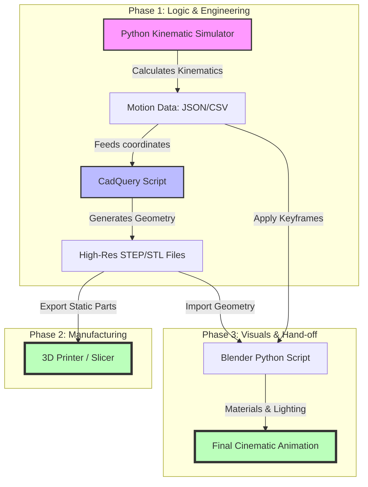

**Tl;DR**

A workflow around: Python 2D ~ mbsd + CadQuery + blender


  
  


**Intro**

Its been a while since I read/studied *Ingenieria del automovil: sistemas y comportamiento dinamico*.

How about making a come back?

```sh
git clone https://github.com/JAlcocerT/3Design
git clone https://github.com/JAlcocerT/mbsd
```



```sh
###make creative #read the post to understand this :)
# Step 1 — build the scene
~/Applications/Blender4.2/blender --background --python blender_scene_creative.py
#Runs the Python script to build the scene — imports STLs, sets up materials, lighting, camera, bakes keyframes, and saves slider_crank_creative.blend. This is equivalent to make scene.
  
# Step 2 — render it
~/Applications/Blender4.2/blender --background slider_crank_creative.blend --render-anim
#blender --background slider_crank_creative.blend --render-anim
#Opens the already-built .blend file and renders all frames to video. This is equivalent to make render.
#rsync -avP jalcocert@192.168.1.2:/home/jalcocert/3Design/z-cadquery/render/slider_crank_creative.mp4 .
mpv slider_crank_creative.mp4
```

<!-- https://youtu.be/0fmFl3hVgaA
 -->



This workflow replies to:

1. How does the mechanism move and what are the forces involved? Aka will it break while it operates?

2. How can I manufacture it? (Optional)

3. Before even manufacturing...does someone wants this new shiny invention? Aka: see how cool it renders 

## The Ecosystem

To get precision parts that are "ready to print" while also achieving "cool and realistic" animations, you are looking at a **Hybrid Pipeline**. 

The industry-standard approach for an agent is to generate the geometry in a **CAD-based (BREP/CSG)** environment and then "hand off" that model to a **Mesh-based (Blender)** environment for the cinematic treatment.

### BREP/CSG vs. Mesh: The Technical Divide

Understanding the difference is crucial for an AI agent, as the "logic" it uses to build the object changes entirely depending on the format.

**BREP (Boundary Representation)**

Used by: **CadQuery**, **FreeCAD**, SolidWorks.

* **The Concept:** Objects are defined by their mathematical boundaries. A cylinder isn't a collection of points; it is a mathematical instruction: *"A surface with radius R and height H."*
* **Best for Precision:** Because it’s math, you can zoom in infinitely and it’s always a perfect curve.
* **Ready to Print?** Yes. You can export to STEP (for CNC/molding) or high-density STL (for 3D printing).
* **Agent Logic:** "Find the face at $Z=10$ and drill a $5\text{mm}$ hole at the center."

**CSG (Constructive Solid Geometry)**

Used by: **OpenSCAD**.

* **The Concept:** Objects are created by Boolean operations (Union, Difference, Intersection) on simple primitives (cubes, spheres).
* **Best for Simplicity:** It is very "logical." To make a pipe, you subtract a small cylinder from a large cylinder.
* **Ready to Print?** Yes, but curves are often "faceted" (made of flat segments) unless you set the resolution very high.

**Mesh (Polygonal Modeling)**

Used by: **Blender**, Game Engines.

* **The Concept:** The object is a shell made of thousands of tiny triangles or squares (quads). 
* **Best for Visuals:** This is how you do "cool and realistic." You can distort the mesh, add "sculpted" details, or use "shaders" to make it look like rusted metal or glass.
* **Ready to Print?** Only if the mesh is "watertight" (no holes). Agents often struggle to keep meshes "non-manifold" (error-free for printing).


### The Ideal Workflow for an Agent

If you want the best of both worlds, set your agent up with this two-step process:

**Step A: The Engineering (CadQuery)**

The agent writes a CadQuery script. This ensures the part is perfectly dimensioned and the holes align for 3D printing.
```python
# Agent-generated CadQuery snippet
import cadquery as cq
result = (cq.Workplane("XY")
          .box(50, 50, 10)
          .faces(">Z").workplane()
          .hole(20))
# Export for printing
cq.exporters.export(result, 'part.stl')
```

**Step B: The Animation (Blender)**

The agent then runs a Python script inside Blender to import that STL and make it "cool."
* **Smoothing:** Apply a "Remesh" or "Subdivision Surface" modifier to hide the facets.
* **Materials:** Apply a "PBR" (Physically Based Rendering) material (e.g., Anodized Aluminum).
* **Physics:** Add a "Rigid Body" simulation so the parts clank together realistically.


### Why Not Just Use Blender for Everything?

If an agent tries to design a precision bolt-hole pattern in Blender using only mesh commands, it will eventually "break" the geometry. 

If it needs to change the hole size later, it has to move hundreds of vertices manually. In **CadQuery**, it just changes a single variable: `hole_dia = 5`.

---

## Conclusions

So here you have the working pipeline.

```sh
choco install blender --version=4.2.2 -y                                      
#5.1.0                       
#wget https://download.blender.org/release/Blender4.2/blender-4.2.2-linux-x64.tar.xz        
```

Oh, not a data pipeline [this time](#outro).

There is "Pro" way to handle this.

We have the **Logic** (Simulator)

Wow you need the **Geometry** (CAD), and finally the **Cinematics** (Blender).

```sh
cd z-cadquery
& "C:\Program Files\Blender Foundation\Blender 4.2\blender.exe" --python blender_scene.py                
& "C:\Program Files\Blender Foundation\Blender 4.2\blender.exe" --background slider_crank.blend
```

<!-- https://youtu.be/1WzRJM8HVKg -->




If you dont have a powerful GPU, you can consider [such colab x blender combo](https://www.youtube.com/watch?v=D0vvWMbur_o)

[](https://colab.research.google.com/github/JAlcocerT/Data-Chat/blob/main/LangChain/web/langchain-chroma-repo-readme.ipynb)



Since the kinematics are already resolved in Python, **CadQuery** is your best bridge because it lives in the same Python ecosystem.

We can import your simulator as a library directly into your CadQuery script.

The Three-Stage *3D Design* Pipeline...

1. The Geometry Engine (CadQuery)

Instead of hard-coding dimensions, you map your simulator's variables to CadQuery parameters.

* **Variable Mapping:** If your simulator says `joint_a` is at $(10, 5, 0)$, the agent writes a CadQuery function that places a bracket at those coordinates.
* **Assembly:** CadQuery has an `Assembly` class. You can define each part once and then use your simulator's output (arrays of coordinates and rotations) to "pose" the parts for each frame.

2. The Bridge (STL/STEP)

* **For 3D Printing:** Export the "Static" parts (the ones at rest) as high-resolution **STLs**.
* **For Animation:** You have two choices:
    * **Batch Export:** Export an STL for every frame of the simulation (heavy, but foolproof).
    * **Single Export + Transform:** Export each unique part once, and let Blender handle the movement using your simulator's data.

3. The Visual Engine (Blender)

This is where you make it "look cool."

* **Data-Driven Animation:** You don't need to manually animate. You can feed your simulator's CSV or JSON output into a Blender Python script (`bpy`).
* **The "Realism" Pass:** * **Beveling:** In CAD, edges are mathematically sharp. In Blender, you add a "Bevel Modifier" to catch highlights, which is the secret to making 3D objects look "real."
    * **Motion Blur:** Since you have the kinematic vectors, Blender can calculate perfect motion blur for the moving parts.

Comparison of Logic Flow

| Feature | **Simulator (Math)** | **CadQuery (Geometry)** | **Blender (Visuals)** |
| :--- | :--- | :--- | :--- |
| **Data Type** | Vectors / Matrices | BREP Solids | Meshes / Shaders |
| **Output** | Coordinate Arrays | STL / STEP Files | MP4 / EXR Frames |
| **Role** | "Where is it?" | "What is it?" | "How does it look?" |


Understanding the Data Hand-off

To understand why this works, it helps to visualize how the data transforms from a "Point" to a "Solid" to a "Render."

A Simple "Agentic" Workflow Strategy:

1. **The Simulator** outputs a JSON file: `{"frame_1": {"arm_angle": 45.0, "base_pos": [0,0,0]}}`.
2. **CadQuery** reads the JSON to generate the STL of the arm at that specific 45° angle for a 3D print check.
3. **Blender** reads the same JSON. It takes a generic "Arm.stl", places it at `[0,0,0]`, rotates it `45.0` degrees, applies a "Scratched Steel" material, and hits **Render**.


### Outro


Why would you be doing D&A when agents are taking over?

Not sure if you are aware, but any of the ones in the leaderboard understand perfectly pbip files, lookML or simply...create awsome full stack web apps with FastAPI and Vite if you care enough just to put clear requirements.

* https://github.com/JAlcocerT/PBi

No more excuses with DBs...Please

We have [ChartDB](https://jalcocert.github.io/JAlcocerT/audio-recap/#the-fastapi-speech-rater), DBGate, ...


```sh
docker run -e OPENAI_API_KEY=<YOUR_OPEN_AI_KEY> -p 8080:80 ghcr.io/chartdb/chartdb:latest
# sqlite3 <database_file_path> #sqlite3 ./users.db #sqlite3 ./stock_cache.db
# .dump > <output_file_path> 
#example
#sqlite3 ./stock_cache.db ".dump" > schema_export.sql && cat schema_export.sql
```


  



  



And specially:

* https://background-agents.com/ - Individual speed !+ organizational velocity :)
* https://arena.ai/leaderboard
* https://status.claude.com/ - Imagine the day that you'd be obsolete when this is down

```sh
claude
#/resume
#/remote-control
```

Isnt it time to do the mechanical engineering you always wanted to?

Or at least...to reflect whats the gas we are so concerned about now?

```sh
uv run tests/plot_historical_gweiss.py HESM --start 2015-01-01 --brand "@LibrePortfolio" --warmup-days 400
```

Wasnt it just a Time travel machine to consume energy that left the sun ~250/300M years ago?

Isnt it just crazy...?


---

## FAQ

### Why CadQuery?

* https://github.com/cadquery/cadquery

The choice between these three usually comes down to whether you want a **GUI-first**, **Logic-first**, or **Code-first** workflow.

For an AI agent driven by a Python simulator, **CadQuery** wins because it lives natively in the Python ecosystem, whereas the others require "handshakes" or custom languages.

Here is the direct comparison of why CadQuery is the superior choice for your specific "Simulator-to-CAD" pipeline:

1. CadQuery vs. OpenSCAD (The "Logic" Gap)

OpenSCAD is great for hobbyists, but it is a "walled garden."

* **Language Barrier:** OpenSCAD uses its own functional language. To connect it to your Python simulator, you have to write a Python script that generates a `.scad` text file, saves it, and then tells OpenSCAD to render it. This is "clunky" for an agent.
* **The "Fillet" Nightmare:** In OpenSCAD, rounding an edge (a fillet) is incredibly difficult and computationally expensive. In CadQuery, it is a simple `.fillet(2)` command.
* **Kernel Power:** OpenSCAD uses **CSG** (Constructive Solid Geometry). It’s basically just adding and subtracting blocks. CadQuery uses **BREP** (the same engine as SolidWorks), which understands "faces," "edges," and "vertices" as distinct mathematical objects.

2. CadQuery vs. FreeCAD (The "API" Gap)

FreeCAD actually uses the same geometry engine as CadQuery (OpenCASCADE), but their philosophies are opposites.

* **GUI vs. Headless:** FreeCAD is designed for a human to sit at a desk and click buttons. While it has a Python API, it is notoriously messy and "verbose" because it’s trying to manage a 3D interface at the same time.
* **State Management:** FreeCAD uses a "Document" model. You have to create a document, add an object, recompute the document, and manage the UI state. CadQuery is a **stateless library**; you just write code, and it outputs a model.
* **Agent Friendliness:** It is much easier for an LLM/Agent to learn the "Fluent API" of CadQuery (e.g., `model.faces(">Z").workplane().hole(5)`) than the complex object-tree manipulation required by FreeCAD's Python console.

Comparison Table: The "Agent" Perspective

| Feature | **CadQuery** | **OpenSCAD** | **FreeCAD** |
| :--- | :--- | :--- | :--- |
| **Integration** | **Direct Import:** Just `import cadquery`. | **External:** Must write/read `.scad` files. | **Heavy:** Requires the full FreeCAD app/libs. |
| **Geometry Engine** | Professional (BREP/OpenCASCADE). | Basic (CSG/CGAL). | Professional (BREP/OpenCASCADE). |
| **Readability** | High (Chainable Python). | Medium (C-like syntax). | Low (Complex API calls). |
| **Fillets/Chamfers** | One-line command. | Hard/Experimental. | Standard, but API-complex. |
| **Best For** | **Automated Pipelines & Agents.** | Quick 3D Printing hacks. | Manual Human Design. |

3. The "Secret Sauce": The CadQuery Fluent API

Because your simulator already knows where the "Joints" are, CadQuery allows your agent to use **selectors**.

Instead of telling the CAD tool: 
> *"Place a hole at $x=10.5, y=20.2$,"* The agent can tell CadQuery: 
> *"Find the face pointing in the $+Z$ direction and put a hole at its center."*

This makes the code much more robust. 

If the simulator changes the size of a part, the hole "follows" the face automatically because it was defined by **intent** rather than **coordinates**.

So...

* **Use OpenSCAD** only if you need a very tiny, lightweight script and don't care about "professional" file formats like STEP.
* **Use FreeCAD** if you want to manually open the file later and tweak it with a mouse.
* **Use CadQuery** if you want a seamless, pure-Python pipeline where your simulator and your CAD model share the same variables in real-time.

### About Euler Angles

In the world of 3D design and robotics, these are simply two different mathematical languages used to describe how an object is oriented in space.

 Think of them as **Directions** vs. **Rotations**.

1. Euler Angles: The "Human" Way

Euler angles describe a rotation as a sequence of three movements around the $X$, $Y$, and $Z$ axes. 

You probably know them as **Roll, Pitch, and Yaw**.

* **How they work:** You rotate by $x$ degrees, then $y$ degrees, then $z$ degrees. 
* **The Order Matters:** Rotating $X$ then $Y$ results in a different orientation than $Y$ then $X$. This is called "Rotation Order" (e.g., XYZ vs. ZYX).
* **The Problem (Gimbal Lock):** This is the "deal-breaker" for complex simulators. If you rotate one axis by $90^\circ$ so that it aligns with another axis, you lose a degree of freedom. The "gimbals" lock together, and the math breaks down because the computer doesn't know which way is "up" anymore.

2. Quaternions: The "Computer" Way

Quaternions are much harder for humans to visualize but are the "gold standard" for 3D engines like Blender, Unity, and high-end physics simulators.

* **The Concept:** Instead of three angles, a Quaternion uses four numbers $(w, x, y, z)$. It represents a single rotation around a specific vector (an imaginary line) in 3D space.
* **Why they are better for Agents:**
    * **No Gimbal Lock:** They never "lock up," no matter how crazy the rotation is.
    * **Smooth Interpolation:** If your simulator has data for Frame 1 and Frame 10, Quaternions allow Blender to calculate the "in-between" frames perfectly (this is called SLERP).
    * **Computational Efficiency:** They are faster for a computer to process than complex trigonometric Euler matrices.

| Feature | **Euler Angles** | **Quaternions** |
| :--- | :--- | :--- |
| **Format** | 3 numbers $(X, Y, Z)$ | 4 numbers $(W, X, Y, Z)$ |
| **Readability** | High (e.g., $90^\circ$ turn) | Low (Non-intuitive decimals) |
| **Reliability** | Risk of Gimbal Lock | Mathematically "Immune" |
| **Usage** | UI inputs, simple hinges | Physics engines, robotic arms |

Which one should your Simulator use?

* **If your mechanism stays in a single plane** (like a 2D scissor lift or a simple car steering): **Euler Angles** are fine and much easier for you to debug.
* **If your mechanism moves in 3D** (like a 6-axis robot arm or a drone): You **must** use **Quaternions**. 

In Python, you don't have to do the heavy math yourself. 

Libraries like `scipy.spatial.transform` or `mathutils` (inside Blender) can convert between the two instantly:

### Rendering on a mac M2

The first 2 steps are pretty straight forward on my x13 laptop.

But the rendering was taking ~8 min per image, despite dropping the resolution from 4k to 1080p at the script calling blender.

Luckily, a friend recently got a mac and I put the hands on it.

Like a geek, first thing I learn was how to open the terminal: ~~`CTRL+T`~~ `cmd`

Then I installed brew:

```sh

```

Node and Python followed:

```sh

```

And...

```sh
#npm install -g @anthropic-ai/claude-code #https://claude.ai/new
#claude
/login
/resume
#claude --dangerously-skip-permissions -p "promptwhateverrrr" #yolo
```