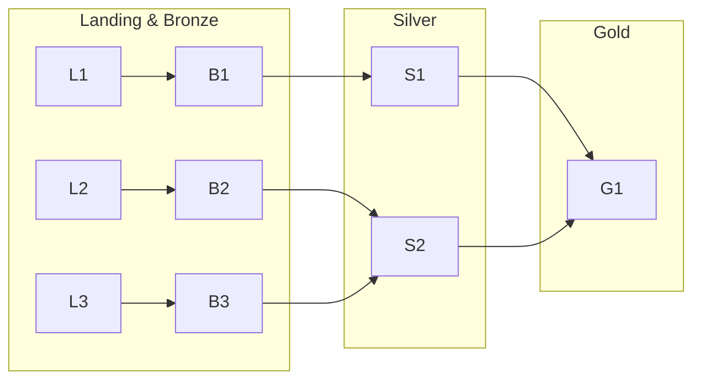

You might encounter this kind of **architectures in your data analytics** journey:




I love [diagrams](https://www.mermaidchart.com/play#pako:eNp90N9LwzAQB_B_5ciDKKwPzrc-qOsPZA9OwQ6UZYysuW5h7UWStAPL_neTlskQ8SUP37vPJbmelVoii1kURZxKTZXaxZwAaq0PMewFycyII4XI7bHBGCRWoq0dp4FUtT6We2EcFFloApitOHtzIcmM6tBwtoYouoek5yx_z9NlMX9ZbLJZkYMiQOoeODuNNPGN8IF26E_9nCd08MtURjdB-bEXaKEHk_1jhNl1q-n6x6WDyL2Yv2aJsPiMzqjSXo9bmIBpaeNUgxvrzM3IRkm3HhVoHUjhxNajgz3_kqa-tiSnXI3SP0tiqFwB3f2Rn8c99qD8rTFwJr5ag_FwRpfTJ1Bp04QOo1uSKEP0qW1ItsMC2ekbNbOQkA)


1. An **Operational Data Hub** (ODH) is a central, integrated data store that serves operational systems and analytical applications with near real-time or real-time data.

It acts as a single source of truth for operational data, consolidating information from various source systems.



* Real-time or near real-time data ingestion and delivery.
* Data integration and transformation.
* Support for operational analytics and decision-making.
* Lower latency compared to traditional data warehouses.




2. Data LakeHouses



Always make comprehensible **Designs & Docs** for all the parties involved in the project



### Data Modelling

Design a [Data Story](https://jalcocert.github.io/JAlcocerT/business-intelligence-data-analytics/#designing-an-analytical-flow)

https://jalcocert.github.io/JAlcocerT/data-basics-for-data-analytics/#others

* A **conceptual data model** is the highest level, and therefore the least detailed.
* A **logical data model** involves more detailed thinking about the implementation without actually implementing anything.
* Finally, the **physical data model** draws on the requirements from the logical data model to create a real database.


  
  


#### The Data LifeCycle

### Tech


  
  



  
  



```py
Test_Data = [("James","Sales","NY",90000,34,10000),
    ("Michael","Sales","NY",86000,56,20000),
    ("Robert","Sales","CA",81000,30,23000),
    ("Maria","Finance","CA",90000,24,23000),
    ("Raman","Finance","CA",99000,40,24000),
    ("Scott","Finance","NY",83000,36,19000),
    ("Jen","Finance","NY",79000,53,15000),
    ("Jeff","Marketing","CA",80000,25,18000),
    ("Kumar","Marketing","NY",91000,50,21000)
  ]

schema = ["employee_name","department","state","salary","age","bonus"]
Test_DF = spark.createDataFrame(data=Test_Data, schema = schema)
Test_DF.printSchema()
Test_DF.show(truncate=False)
```



1. **Diagrams**: Tools like Mermaid and Excalidraw for visualizing workflows and processes.
2. **Apache NiFi**: Automates and manages data flows between systems, supporting scalable data routing and transformation.
3. **Apache Iceberg**: A table format for large analytic datasets, improving performance and schema handling in big data ecosystems.
4. **MinIO**: Distributed, high-performance object storage, compatible with Amazon S3, commonly used for cloud-based and private storage solutions.
5. **Boto3**: AWS SDK for Python, used for managing AWS services like S3.
6. **Great Expectations**: A Python library for defining data quality checks and validating data integrity.
7. **Project Nessie**: Version control for data lakes, enabling Git-like data management and collaboration.
8. **Hue**: An open-source web interface for interacting with big data systems like Hadoop, simplifying SQL querying and data browsing.
9. **Argo Workflows**: Kubernetes-native workflow engine for orchestrating complex jobs and data pipelines.
10. **Kubernetes, Helm, HULL**: Kubernetes for container orchestration, Helm for packaging applications, and HULL for Helm chart linting.
11. **Rancher**: A platform that simplifies Kubernetes cluster management.
12. **RabbitMQ**: A message broker that enables distributed communication between applications.
13. **Parquet**: Columnar storage format optimized for querying large datasets.
14. **Avro**: A data serialization system with schema evolution capabilities.
15. **Apache Livy**: REST service for remote Spark job execution.
16. **Pydantic**: Data validation and settings management via Python type annotations.
17. **Celery**: Distributed task queue system for managing background processes.
18. **TRINO**: Distributed SQL query engine for large-scale data analysis.
19. **Open Data Hub**: Metadata platform for data management and integration.
20. **CleverCSV**: Python tool for working with messy CSV files.
21. **StringZilla**: Library for high-performance string operations across multiple languages.

These tools span across data flow automation, big data management, Kubernetes workflows, data validation, and distributed computing.




---


* Information to insight
* Stakeholder management
* Managing expectations
* Estimating tasks
* How to sell ideas
* What we are missing in the product?
    * *fomo, loss>>>gain*

## From the Experience

Whatever the industry you are working on, make sure to set and improve your [**workflow** for effectiveness](https://jalcocert.github.io/JAlcocerT/telecom-concepts-101/#workflow-for-effectiveness):

1. What's going on
2. Meeting Scheduler Template
3. RCA Template
4. MTG Summary Template - What's your takeaway after the time investment?

For ideas, you can check [this one](https://jalcocert.github.io/JAlcocerT/git-recap/#weekly-planning) and then tweak it as per your [daily/scrum ceremonies](https://jalcocert.github.io/JAlcocerT/telecom-concepts-101/#workflow-for-effectiveness).


Understand *the one thing* the client value the most. [Pareto](https://jalcocert.github.io/JAlcocerT/product-skills-for-data-analytics/)?


> Knowing the customer journey or the *what this product feels like*, always helps! The less friction, the more beautiful funnel you get

### PM Skills

Whenever you are involved on a project, make sure that there are clear:


  
    


Get ready to organize **effective meetings**:


  
    


There is no god meeting without a proper MoM notes and clear action points.

As a D&A Architect, you will also [prototype and create mockups](https://jalcocert.github.io/JAlcocerT/business-analytics-skills/#prototyping-mockups-and-wireframes)


#### Decision Making

Swot and cost-benefit analysis are fundamental and widely used simple **frameworks for decision-making**.

They each offer a distinct approach and are valuable tools in various contexts. 




**SWOT Analysis:**

* **Strengths:** Its simplicity and broad applicability are major strengths. It provides a structured way to think about both internal capabilities and external factors. It's a great starting point for strategic planning and can be used for individual decisions as well as organizational ones. The visual representation (often a 2x2 matrix) makes it easy to understand and communicate.
* **Weaknesses:** SWOT analysis can be subjective and doesn't inherently provide a way to weigh the different factors. It can also be static, offering a snapshot in time rather than a dynamic view. Without further analysis or prioritization, it might not lead to clear action steps.
* **Overall:** A valuable initial assessment tool. It helps frame the decision and identify key considerations. However, it often needs to be followed up with more detailed analysis and prioritization techniques.

**Satisficing Model:**

* **Strengths:** This model acknowledges the reality of bounded rationality – that decision-makers have limited time, information, and cognitive resources. It's a practical approach when speed and efficiency are crucial, or when the cost of finding the absolute best solution outweighs the potential benefits. It can prevent "analysis paralysis."
* **Weaknesses:** Satisficing might lead to suboptimal outcomes if the minimum criteria are set too low or if potentially much better options are overlooked. It relies heavily on the decision-maker's judgment in defining "satisfactory." In complex or high-stakes decisions, settling for the first acceptable option could have significant negative consequences.
* **Overall:** A realistic and often necessary approach in many situations. However, it's important to be mindful of the potential trade-offs and to ensure that the "minimum criteria" are thoughtfully considered, especially for important decisions.

**Cost-Benefit Analysis (CBA):**

* **Strengths:** CBA provides a quantitative and systematic way to evaluate options based on their economic impact. It helps to make decisions more objective and transparent. By assigning monetary values to both costs and benefits, it allows for a direct comparison of different alternatives. It's particularly useful for evaluating investments, projects, and policy decisions.
* **Weaknesses:** Assigning accurate monetary values to all costs and benefits, especially intangible ones (like environmental impact or social well-being), can be challenging and subjective. The results of a CBA are highly dependent on the assumptions made and the discount rate used. It might also oversimplify complex issues by focusing solely on economic factors.
* **Overall:** A powerful tool for evaluating the economic implications of decisions. However, it's crucial to acknowledge its limitations and to consider non-economic factors alongside the quantitative results. Transparency in the assumptions and calculations is essential for its credibility.




**In Conclusion:**

These three frameworks offer different lenses through which to approach decision-making.

They are not mutually exclusive and can even be used in conjunction.

For instance, a SWOT analysis might help identify potential areas for a cost-benefit analysis, or the concept of satisficing might be applied when considering various options identified through a SWOT.


### BA & Elicitation Skills

To tell better stories with data, you have to [ask the right questions](https://jalcocert.github.io/JAlcocerT/business-analytics-concepts/#business-analysis-key-questions):


* What are the kinds of changes we are doing?
* **What are the needs we are trying to satisfy?**
* Who are the stakeholders involved?
* **What do stakeholders consider to be of value?**


For MORE QUESTIONS, you can switch-on your **[product](https://jalcocert.github.io/JAlcocerT/product-skills-for-data-analytics/#faq) mindset**


<!--  -->


  





1. What are the key objectives (**OKR**) and goals of this data product or project?
2. Who are the primary end-users or target audience for this data product?
3. What are the most important KPIs or metrics that the data product should track and display?
4. What level of interactivity and customization is expected in the data product (e.g., dashboards, reports)?
5. How will the data product’s model performance be evaluated and validated?



See more questions [here](https://jalcocert.github.io/JAlcocerT/setup-bi-tools-docker/#syncing-expectations)



  
  


#### BPMN AND UML

In practice, as a Business Analyst might use both UML and BPMN:

* Use BPMN to **model end-to-end business processes**, identify areas for improvement, and communicate process flows to business stakeholders.
    * You will hear about: Microsoft Visio, LucidCharts, Miro, DrawIO,...
* Use UML (especially use case, activity, and sequence diagrams) to delve deeper into the **functional requirements** of a system that supports those business processes and to communicate system behavior to the development team.  
    * Lucidchart, Visio, DrawIO, [UMLet](https://github.com/umlet/umlet),...

While BPMN focuses on process flow, UML can complement this by providing different perspectives:

* Activity Diagrams: Can also be used to model process flows, especially when integrating system interactions.   
* Use Case Diagrams: Help define the interactions between users and the RPA bots or the systems they interact with. This clarifies the scope and goals of the automation.
* Sequence Diagrams: Can illustrate the interactions between the RPA bot and various systems over time, showing the sequence of actions and data exchange.   

#### SMART vs INVEST

It's helpful to understand that **INVEST** and **SMART** serve different purposes, though they can be related.

**INVEST** is a set of guidelines to help you create well-formed **user stories**.
**SMART** is a set of criteria to help you define **objectives or goals**.

Here's a breakdown of when each is most appropriate:

**INVEST: For User Stories**

INVEST helps ensure that your user stories are functional, valuable, and manageable within an Agile development process.

* **Independent:** Can be worked on without dependencies.
* **Negotiable:** Flexible and open to discussion.
* **Valuable:** Delivers value to the user.
* **Estimable:** Can be estimated in terms of effort.
* **Small:** Can be completed within a sprint.
* **Testable:** Can be verified through testing.

**When to Use INVEST:**

* When writing and evaluating user stories for Agile development.
* To ensure stories are actionable, manageable, and deliver value.


A successful user story should be a concise and clear description of a feature or functionality from the **end-user's perspective**. 

It helps the development team understand **who** will use the feature, **what** they want to achieve, and **why** it's important to them.



The key components that a successful user story typically contains, often remembered by the acronym **INVEST**:

**I - Independent:**

* **The story should be self-contained and not heavily dependent on other stories.** This allows the team to prioritize and work on stories in a flexible order. Dependencies can lead to delays and complexities in planning and execution.

**N - Negotiable:**

* **The story is a starting point for a conversation, not a contract.** The details of the story can be discussed and refined collaboratively between the product owner, development team, and stakeholders during backlog refinement or sprint planning. It leaves room for technical implementation details and alternative approaches.

**V - Valuable:**

* **The story must deliver value to the end-user or the business.** It should clearly articulate the benefit or outcome the user will experience by having this feature. This ensures the team is working on things that matter.

**E - Estimable:**

* **The story should be small enough that the development team can estimate the effort required to implement it.** This helps with sprint planning and forecasting. If a story is too large or vague, it becomes difficult to estimate accurately.

**S - Small:**

* **The story should be sized appropriately to be completed within a single sprint.** Smaller stories allow for faster feedback loops, easier tracking of progress, and reduced risk. Large epics should be broken down into smaller, manageable stories.

**T - Testable:**

* **The story should be written in a way that makes it clear how to verify if it has been implemented correctly.** This often involves defining clear acceptance criteria that can be used to create test cases.



Beyond the INVEST criteria, a well-formed user story often follows a simple template:

**As a [type of user], I want [some goal] so that [some reason/benefit].**

**Example:**

* **As a registered customer, I want to be able to reset my password so that I can regain access to my account if I forget it.**

**SMART: For Objectives and Goals**

SMART helps you define clear, measurable, and achievable objectives, whether *for a project, a sprint, or even a user story's acceptance criteria*.

* **Specific:** Clearly defined.
* **Measurable:** Progress can be tracked.
* **Achievable:** Realistic and attainable.
* **Relevant:** Aligned with overall goals.
* **Time-bound:** Has a defined timeframe.

**When to Use SMART:**

* When defining project goals, sprint goals, or any objectives you want to track.
* When writing **acceptance criteria for a user story.** (This is a very common and effective use of SMART in Agile.)
* When setting performance targets or any other kind of goal.




* You use INVEST to write a good user story.
* You use SMART to write the **acceptance criteria** for that user story. The acceptance criteria are the specific, measurable conditions that must be met to say the user story is complete, and those should be SMART.

**In the context of user stories:**

* You wouldn't say "a user story should be SMART" in place of "a user story should be INVEST."
* Instead, you'd say, "The **acceptance criteria** for a user story should be SMART."




**In addition to the core structure and INVEST principles, a successful user story often benefits from:**

* **Clear Acceptance Criteria:** These are specific, measurable, achievable, relevant, and time-bound (SMART) conditions that define when the story is considered complete and working correctly. They provide clarity for the developers and testers.
    * **Example Acceptance Criteria for the password reset story:**
        * Given I am on the "Forgot Password" page.
        * When I enter my registered email address and click "Submit".
        * Then I should receive an email with a link to reset my password.
        * And the reset password link should be valid for 24 hours.
        * And if I enter an invalid email address, I should see an error message.

* **Context and Background:** Briefly providing context or background information can help the team understand the user's needs and the overall purpose of the feature.

* **Prioritization:** While not part of the story itself, clearly prioritizing user stories helps the team understand which ones to work on first based on business value and urgency.

By including these elements, a user story becomes a powerful tool for communication, collaboration, and ensuring that the development team is building the right product for the right users.


<!-- 
referencia a persuasion escrito en jan 2022

y aqui cositas de neuromarketing

the buying brain....
`brainfluence`

 -->


> These are very helpful on end to end projects - where we went from raw data modelling to [BI solutions](https://jalcocert.github.io/JAlcocerT/setup-bi-tools-docker/#syncing-expectations):

You can also have handy a list of QQ to enable others perform their job:

* https://jalcocert.github.io/JAlcocerT/team-management-data-analytics/#enabling-others

---

## Conclusions


### The Information Workflow

Important from how you handle meetings, to how you write designs, to how you ask from others.



I like this way of summarizing whats required from others (useful for JIRA stories!)




  
  



### Diagrams and Retros

* https://github.com/excalidraw/excalidraw
    * https://excalidraw.com/

>  Virtual whiteboard for sketching hand-drawn like diagrams 


---

## FAQ

### Examples





> tienes una fabrica de leche y quieres extraer tres arhcivos: lsita de vacas, medidas de leche y otro de calidad de la leche. Quieres crear facts y dimensions: como lo harias?

¡Claro! Vamos a estructurar tus datos de la fábrica de leche en un modelo de datos dimensional, separando hechos (facts) y dimensiones (dimensions). Esto te permitirá analizar la información de manera eficiente y obtener insights valiosos.

**1. Identificación de Hechos (Facts)**

Los hechos son las mediciones numéricas que quieres analizar. En tu caso, los principales hechos son:

* **Medidas de Leche:** La cantidad de leche producida por cada vaca en un período de tiempo.
* **Calidad de la Leche:** Los indicadores de calidad de la leche (por ejemplo, contenido de grasa, proteínas, recuento de células somáticas).

**2. Identificación de Dimensiones (Dimensions)**

Las dimensiones son los atributos descriptivos que contextualizan los hechos. En tu caso, las dimensiones clave son:

* **Vacas:** Información sobre cada vaca (ID, raza, edad, etc.).
* **Tiempo:** Fechas y horas de las mediciones (día, semana, mes, año).
* **Calidad:** Los tipos de calidad de la leche (por ejemplo, contenido de grasa, proteínas, recuento de células somáticas).

**3. Diseño del Modelo Dimensional**

Podemos crear un esquema de estrella, que es común para el modelado de datos dimensionales. Tendremos una tabla de hechos central y tablas de dimensiones que la rodean.

**Tabla de Hechos: Producción de Leche**

* Esta tabla contendrá los hechos principales:
    * `ID_Vaca` (clave foránea a la tabla de dimensión "Vacas")
    * `ID_Tiempo` (clave foránea a la tabla de dimensión "Tiempo")
    * `ID_Calidad` (clave foránea a la tabla de dimensión "Calidad")
    * `Cantidad_Leche` (la cantidad de leche producida)
    * `Valor_Calidad` (el valor de la calidad de la leche)

**Tablas de Dimensiones:**

* **Vacas:**
    * `ID_Vaca` (clave primaria)
    * `Raza`
    * `Edad`
    * `Fecha_Nacimiento`
    * Otros atributos relevantes de las vacas
* **Tiempo:**
    * `ID_Tiempo` (clave primaria)
    * `Fecha`
    * `Hora`
    * `Dia_Semana`
    * `Mes`
    * `Año`
* **Calidad:**
    * `ID_Calidad` (clave primaria)
    * `Tipo_Calidad` (por ejemplo, "Grasa", "Proteína", "Células Somáticas")
    * `Unidad_Medida` (por ejemplo, "porcentaje", "unidades/mL")

**4. Procesamiento de Datos (ETL)**

Necesitarás un proceso ETL (Extracción, Transformación, Carga) para mover los datos desde tus archivos originales a este modelo dimensional.

* **Extracción:** Lee los datos de tus archivos CSV (lista de vacas, medidas de leche, calidad de la leche).
* **Transformación:** Limpia y transforma los datos según sea necesario. Esto puede incluir:
    * Estandarizar formatos de fecha y hora.
    * Manejar valores faltantes.
    * Convertir unidades de medida.
    * Crear claves primarias y foráneas.
* **Carga:** Carga los datos transformados en las tablas de hechos y dimensiones de tu almacén de datos.

**5. Análisis y Reportes**

Con este modelo dimensional, podrás realizar análisis como:

* Producción de leche por vaca a lo largo del tiempo.
* Calidad de la leche por raza de vaca.
* Tendencias de producción de leche por mes o año.
* Comparación de la calidad de la leche entre diferentes vacas.

Espero que esta estructura te sea de utilidad.

> en bronze layer podriamos tener los datos cargados de API, que podriamos tener en silver y luego en gold?

¡Excelente pregunta! La arquitectura Medallion (Bronce, Plata, Oro) es una forma muy efectiva de organizar y procesar datos en un data lakehouse. Aquí te explico cómo podrías estructurar tus datos de la fábrica de leche en cada capa:

**Capa Bronce (Bronze Layer): Datos Crudos de la API**

* **Propósito**:
    * Esta capa almacena los datos tal cual los recibes de la API, sin ninguna transformación.
    * Su objetivo es preservar la integridad y el linaje de los datos originales.
    * Permite la recuperación de datos históricos y la re-ejecución de procesos si es necesario.
* **Contenido**:
    * Datos JSON o XML directamente de la API.
    * Registros de eventos de la API.
    * Archivos CSV o Parquet sin procesar.
    * En tu caso, aquí llegarían los datos de la API relacionados con:
        * Lecturas de sensores de producción de leche.
        * Resultados de análisis de calidad de leche.
        * Datos de identificación de vacas.
        * Información meteorológica que pueda afectar la producción.
* **Formato**:
    * Se recomienda usar formatos que conserven la estructura original de los datos, como JSON, Avro o Parquet.

**Capa Plata (Silver Layer): Datos Limpios y Estandarizados**

* **Propósito**:
    * Esta capa se enfoca en la limpieza, estandarización y validación de los datos.
    * Se aplican transformaciones básicas para asegurar la calidad y consistencia de los datos.
    * Se crea una versión "curada" de los datos, lista para análisis posteriores.
* **Contenido**:
    * Datos limpios y validados.
    * Tablas con esquemas definidos.
    * Datos estandarizados en formatos consistentes.
    * En tu caso, aquí tendrías:
        * Tablas de "vacas" con datos consistentes y validados.
        * Tablas de "mediciones de leche" con fechas y horas estandarizadas, y valores numéricos limpios.
        * Tablas de "calidad de la leche" con unidades de medida consistentes y valores validados.
        * Tablas de informacion del clima, con datos limpios y validados.
* **Formato**:
    * Formatos eficientes para el almacenamiento y la consulta, como Parquet o Delta Lake.

**Capa Oro (Gold Layer): Datos Agregados y Optimizados para el Análisis**

* **Propósito**:
    * Esta capa contiene datos altamente refinados, agregados y optimizados para casos de uso específicos.
    * Se crean modelos dimensionales (como el que discutimos anteriormente) para facilitar el análisis y la generación de informes.
    * Los datos están listos para ser consumidos por herramientas de BI y análisis.
* **Contenido**:
    * Tablas de hechos y dimensiones.
    * Agregaciones y resúmenes de datos.
    * Modelos de datos específicos para informes y paneles.
    * En tu caso, aquí tendrías:
        * Tablas de hechos de "producción de leche" y "calidad de la leche".
        * Tablas de dimensiones de "vacas", "tiempo" y "calidad".
        * Vistas y tablas agregadas para análisis de tendencias, rendimiento de vacas, etc.
* **Formato**:
    * Formatos optimizados para consultas rápidas, como Parquet o Delta Lake, organizados de manera eficiente.

**Resumen de beneficios**

* **Calidad de datos mejorada**: A medida que los datos avanzan por las capas, se someten a procesos de limpieza y validación.
* **Linaje de datos claro**: Cada capa preserva el historial de los datos, lo que facilita la auditoría y la resolución de problemas.
* **Eficiencia en el análisis**: La capa Oro proporciona datos optimizados para consultas y análisis, lo que acelera la toma de decisiones.
* **Flexibilidad**: La arquitectura Medallion se adapta a una variedad de casos de uso y herramientas de análisis.

Siguiendo esta estructura, podrás construir un data lakehouse robusto y eficiente para tu fábrica de leche.


> en la capa oro seria donde definimos nuestros facts y dimensions?

Sí, exactamente. La capa Oro es donde se definen y materializan los modelos dimensionales, incluyendo las tablas de hechos y dimensiones. Aquí te explico por qué:

**Capa Oro: El Destino para el Análisis**

* **Optimización para el consumo:**
    * La capa Oro está diseñada específicamente para el consumo de datos por parte de herramientas de BI, análisis y generación de informes.
    * Los datos se transforman y estructuran de manera que sean fáciles de entender y consultar para los usuarios finales.
* **Modelado dimensional:**
    * El modelado dimensional, con sus tablas de hechos y dimensiones, es una técnica común para organizar datos para el análisis.
    * Este modelo facilita la realización de consultas complejas y la generación de informes significativos.
* **Agregaciones y resúmenes:**
    * En la capa Oro, los datos se agregan y resumen para proporcionar información de alto nivel.
    * Esto reduce la necesidad de realizar cálculos complejos en tiempo real, lo que mejora el rendimiento de las consultas.

**Por qué la capa Oro es ideal para hechos y dimensiones**

* **Claridad y estructura:**
    * Las tablas de hechos y dimensiones proporcionan una estructura clara y organizada para los datos, lo que facilita su comprensión.
    * Esto es esencial para los usuarios de negocios que necesitan acceder y analizar los datos.
* **Rendimiento de las consultas:**
    * El modelado dimensional está optimizado para consultas analíticas, lo que permite obtener resultados rápidos y eficientes.
    * Esto es fundamental para las herramientas de BI que necesitan interactuar con los datos en tiempo real.
* **Facilidad de uso:**
    * La estructura de hechos y dimensiones simplifica la creación de informes y paneles, lo que permite a los usuarios explorar los datos de manera intuitiva.
    * Esto permite mayor facilidad a los usuarios finales, para la creación de reportes.

**En resumen, la capa Oro es el lugar donde los datos se transforman en información valiosa y fácil de usar para la toma de decisiones.**




### More T-Shaped Skills
