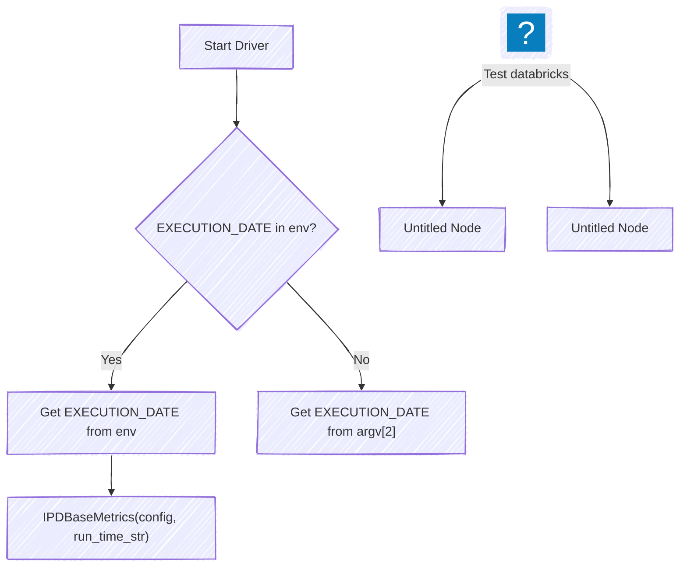

You might encounter this kind of architectures:


I love [diagrams](https://www.mermaidchart.com/play#pako:eNp90N9LwzAQB_B_5ciDKKwPzrc-qOsPZA9OwQ6UZYysuW5h7UWStAPL_neTlskQ8SUP37vPJbmelVoii1kURZxKTZXaxZwAaq0PMewFycyII4XI7bHBGCRWoq0dp4FUtT6We2EcFFloApitOHtzIcmM6tBwtoYouoek5yx_z9NlMX9ZbLJZkYMiQOoeODuNNPGN8IF26E_9nCd08MtURjdB-bEXaKEHk_1jhNl1q-n6x6WDyL2Yv2aJsPiMzqjSXo9bmIBpaeNUgxvrzM3IRkm3HhVoHUjhxNajgz3_kqa-tiSnXI3SP0tiqFwB3f2Rn8c99qD8rTFwJr5ag_FwRpfTJ1Bp04QOo1uSKEP0qW1ItsMC2ekbNbOQkA)




1. An Operational Data Hub (ODH) is a central, integrated data store that serves operational systems and analytical applications with near real-time or real-time data.

It acts as a single source of truth for operational data, consolidating information from various source systems.



* Real-time or near real-time data ingestion and delivery.
* Data integration and transformation.
* Support for operational analytics and decision-making.
* Lower latency compared to traditional data warehouses.




2. Data LakeHouses



Always make comprehensible **Designs & Docs** for all the parties involved in the project



### Data Modelling

Design a [Data Story](https://jalcocert.github.io/JAlcocerT/business-intelligence-data-analytics/#designing-an-analytical-flow)

https://jalcocert.github.io/JAlcocerT/data-basics-for-data-analytics/#others

* A **conceptual data model** is the highest level, and therefore the least detailed.
* A **logical data model** involves more detailed thinking about the implementation without actually implementing anything.
* Finally, the **physical data model** draws on the requirements from the logical data model to create a real database.


  
  


### Tech


  
  



  
  



```py
Test_Data = [("James","Sales","NY",90000,34,10000),
    ("Michael","Sales","NY",86000,56,20000),
    ("Robert","Sales","CA",81000,30,23000),
    ("Maria","Finance","CA",90000,24,23000),
    ("Raman","Finance","CA",99000,40,24000),
    ("Scott","Finance","NY",83000,36,19000),
    ("Jen","Finance","NY",79000,53,15000),
    ("Jeff","Marketing","CA",80000,25,18000),
    ("Kumar","Marketing","NY",91000,50,21000)
  ]

schema = ["employee_name","department","state","salary","age","bonus"]
Test_DF = spark.createDataFrame(data=Test_Data, schema = schema)
Test_DF.printSchema()
Test_DF.show(truncate=False)
```

---


## From the Experience

Whatever the industry you are working on, make sure to set and improve your [workflow for effectiveness](https://jalcocert.github.io/JAlcocerT/telecom-concepts-101/#workflow-for-effectiveness):

1. What's going on
2. Meeting Scheduler Template
3. RCA Template
4. MTG Summary Template


Understand *the one thing* the client value the most. [Pareto](https://jalcocert.github.io/JAlcocerT/product-skills-for-data-analytics/)?


### PM Skills


  
    


Get ready to organize effective meetings:


  
    



https://jalcocert.github.io/JAlcocerT/business-analytics-skills/#prototyping-mockups-and-wireframes

### BA & Elicitation Skills

To tell better stories with data, you have to [ask the right questions](https://jalcocert.github.io/JAlcocerT/business-analytics-concepts/#business-analysis-key-questions):


* What are the kinds of changes we are doing?
* **What are the needs we are trying to satisfy?**
* Who are the stakeholders involved?
* **What do stakeholders consider to be of value?**


For more questions, you can switch on your **[product](https://jalcocert.github.io/JAlcocerT/product-skills-for-data-analytics/#faq) mindset**


<!--  -->


  









<!-- 
referencia a persuasion escrito en jan 2022

y aqui cositas de neuromarketing

the buying brain....
`brainfluence`

 -->


> These are very helpful on end to end projects - where we went from raw data modelling to [BI solutions](https://jalcocert.github.io/JAlcocerT/setup-bi-tools-docker/#syncing-expectations):

You can also have handy a list of QQ to enable others perform their job:

https://jalcocert.github.io/JAlcocerT/team-management-data-analytics/#enabling-others

---

## Conclusions


  
  



---

## FAQ

### Example

> tienes una fabrica de leche y quieres extraer tres arhcivos: lsita de vacas, medidas de leche y otro de calidad de la leche. Quieres crear facts y dimensions: como lo harias?

¡Claro! Vamos a estructurar tus datos de la fábrica de leche en un modelo de datos dimensional, separando hechos (facts) y dimensiones (dimensions). Esto te permitirá analizar la información de manera eficiente y obtener insights valiosos.

**1. Identificación de Hechos (Facts)**

Los hechos son las mediciones numéricas que quieres analizar. En tu caso, los principales hechos son:

* **Medidas de Leche:** La cantidad de leche producida por cada vaca en un período de tiempo.
* **Calidad de la Leche:** Los indicadores de calidad de la leche (por ejemplo, contenido de grasa, proteínas, recuento de células somáticas).

**2. Identificación de Dimensiones (Dimensions)**

Las dimensiones son los atributos descriptivos que contextualizan los hechos. En tu caso, las dimensiones clave son:

* **Vacas:** Información sobre cada vaca (ID, raza, edad, etc.).
* **Tiempo:** Fechas y horas de las mediciones (día, semana, mes, año).
* **Calidad:** Los tipos de calidad de la leche (por ejemplo, contenido de grasa, proteínas, recuento de células somáticas).

**3. Diseño del Modelo Dimensional**

Podemos crear un esquema de estrella, que es com√∫n para el modelado de datos dimensionales. Tendremos una tabla de hechos central y tablas de dimensiones que la rodean.

**Tabla de Hechos: Producción de Leche**

* Esta tabla contendr√° los hechos principales:
    * `ID_Vaca` (clave foránea a la tabla de dimensión "Vacas")
    * `ID_Tiempo` (clave foránea a la tabla de dimensión "Tiempo")
    * `ID_Calidad` (clave foránea a la tabla de dimensión "Calidad")
    * `Cantidad_Leche` (la cantidad de leche producida)
    * `Valor_Calidad` (el valor de la calidad de la leche)

**Tablas de Dimensiones:**

* **Vacas:**
    * `ID_Vaca` (clave primaria)
    * `Raza`
    * `Edad`
    * `Fecha_Nacimiento`
    * Otros atributos relevantes de las vacas
* **Tiempo:**
    * `ID_Tiempo` (clave primaria)
    * `Fecha`
    * `Hora`
    * `Dia_Semana`
    * `Mes`
    * `Año`
* **Calidad:**
    * `ID_Calidad` (clave primaria)
    * `Tipo_Calidad` (por ejemplo, "Grasa", "Proteína", "Células Somáticas")
    * `Unidad_Medida` (por ejemplo, "porcentaje", "unidades/mL")

**4. Procesamiento de Datos (ETL)**

Necesitarás un proceso ETL (Extracción, Transformación, Carga) para mover los datos desde tus archivos originales a este modelo dimensional.

* **Extracción:** Lee los datos de tus archivos CSV (lista de vacas, medidas de leche, calidad de la leche).
* **Transformación:** Limpia y transforma los datos según sea necesario. Esto puede incluir:
    * Estandarizar formatos de fecha y hora.
    * Manejar valores faltantes.
    * Convertir unidades de medida.
    * Crear claves primarias y for√°neas.
* **Carga:** Carga los datos transformados en las tablas de hechos y dimensiones de tu almacén de datos.

**5. An√°lisis y Reportes**

Con este modelo dimensional, podr√°s realizar an√°lisis como:

* Producción de leche por vaca a lo largo del tiempo.
* Calidad de la leche por raza de vaca.
* Tendencias de producción de leche por mes o año.
* Comparación de la calidad de la leche entre diferentes vacas.

Espero que esta estructura te sea de utilidad.

> en bronze layer podriamos tener los datos cargados de API, que podriamos tener en silver y luego en gold?

¡Excelente pregunta! La arquitectura Medallion (Bronce, Plata, Oro) es una forma muy efectiva de organizar y procesar datos en un data lakehouse. Aquí te explico cómo podrías estructurar tus datos de la fábrica de leche en cada capa:

**Capa Bronce (Bronze Layer): Datos Crudos de la API**

* **Propósito**:
    * Esta capa almacena los datos tal cual los recibes de la API, sin ninguna transformación.
    * Su objetivo es preservar la integridad y el linaje de los datos originales.
    * Permite la recuperación de datos históricos y la re-ejecución de procesos si es necesario.
* **Contenido**:
    * Datos JSON o XML directamente de la API.
    * Registros de eventos de la API.
    * Archivos CSV o Parquet sin procesar.
    * En tu caso, aquí llegarían los datos de la API relacionados con:
        * Lecturas de sensores de producción de leche.
        * Resultados de an√°lisis de calidad de leche.
        * Datos de identificación de vacas.
        * Información meteorológica que pueda afectar la producción.
* **Formato**:
    * Se recomienda usar formatos que conserven la estructura original de los datos, como JSON, Avro o Parquet.

**Capa Plata (Silver Layer): Datos Limpios y Estandarizados**

* **Propósito**:
    * Esta capa se enfoca en la limpieza, estandarización y validación de los datos.
    * Se aplican transformaciones b√°sicas para asegurar la calidad y consistencia de los datos.
    * Se crea una versión "curada" de los datos, lista para análisis posteriores.
* **Contenido**:
    * Datos limpios y validados.
    * Tablas con esquemas definidos.
    * Datos estandarizados en formatos consistentes.
    * En tu caso, aquí tendrías:
        * Tablas de "vacas" con datos consistentes y validados.
        * Tablas de "mediciones de leche" con fechas y horas estandarizadas, y valores numéricos limpios.
        * Tablas de "calidad de la leche" con unidades de medida consistentes y valores validados.
        * Tablas de informacion del clima, con datos limpios y validados.
* **Formato**:
    * Formatos eficientes para el almacenamiento y la consulta, como Parquet o Delta Lake.

**Capa Oro (Gold Layer): Datos Agregados y Optimizados para el An√°lisis**

* **Propósito**:
    * Esta capa contiene datos altamente refinados, agregados y optimizados para casos de uso específicos.
    * Se crean modelos dimensionales (como el que discutimos anteriormente) para facilitar el análisis y la generación de informes.
    * Los datos est√°n listos para ser consumidos por herramientas de BI y an√°lisis.
* **Contenido**:
    * Tablas de hechos y dimensiones.
    * Agregaciones y res√∫menes de datos.
    * Modelos de datos específicos para informes y paneles.
    * En tu caso, aquí tendrías:
        * Tablas de hechos de "producción de leche" y "calidad de la leche".
        * Tablas de dimensiones de "vacas", "tiempo" y "calidad".
        * Vistas y tablas agregadas para an√°lisis de tendencias, rendimiento de vacas, etc.
* **Formato**:
    * Formatos optimizados para consultas r√°pidas, como Parquet o Delta Lake, organizados de manera eficiente.

**Resumen de beneficios**

* **Calidad de datos mejorada**: A medida que los datos avanzan por las capas, se someten a procesos de limpieza y validación.
* **Linaje de datos claro**: Cada capa preserva el historial de los datos, lo que facilita la auditoría y la resolución de problemas.
* **Eficiencia en el an√°lisis**: La capa Oro proporciona datos optimizados para consultas y an√°lisis, lo que acelera la toma de decisiones.
* **Flexibilidad**: La arquitectura Medallion se adapta a una variedad de casos de uso y herramientas de an√°lisis.

Siguiendo esta estructura, podr√°s construir un data lakehouse robusto y eficiente para tu f√°brica de leche.


> en la capa oro seria donde definimos nuestros facts y dimensions?

Sí, exactamente. La capa Oro es donde se definen y materializan los modelos dimensionales, incluyendo las tablas de hechos y dimensiones. Aquí te explico por qué:

**Capa Oro: El Destino para el An√°lisis**

* **Optimización para el consumo:**
    * La capa Oro está diseñada específicamente para el consumo de datos por parte de herramientas de BI, análisis y generación de informes.
    * Los datos se transforman y estructuran de manera que sean f√°ciles de entender y consultar para los usuarios finales.
* **Modelado dimensional:**
    * El modelado dimensional, con sus tablas de hechos y dimensiones, es una técnica común para organizar datos para el análisis.
    * Este modelo facilita la realización de consultas complejas y la generación de informes significativos.
* **Agregaciones y res√∫menes:**
    * En la capa Oro, los datos se agregan y resumen para proporcionar información de alto nivel.
    * Esto reduce la necesidad de realizar c√°lculos complejos en tiempo real, lo que mejora el rendimiento de las consultas.

**Por qué la capa Oro es ideal para hechos y dimensiones**

* **Claridad y estructura:**
    * Las tablas de hechos y dimensiones proporcionan una estructura clara y organizada para los datos, lo que facilita su comprensión.
    * Esto es esencial para los usuarios de negocios que necesitan acceder y analizar los datos.
* **Rendimiento de las consultas:**
    * El modelado dimensional está optimizado para consultas analíticas, lo que permite obtener resultados rápidos y eficientes.
    * Esto es fundamental para las herramientas de BI que necesitan interactuar con los datos en tiempo real.
* **Facilidad de uso:**
    * La estructura de hechos y dimensiones simplifica la creación de informes y paneles, lo que permite a los usuarios explorar los datos de manera intuitiva.
    * Esto permite mayor facilidad a los usuarios finales, para la creación de reportes.

**En resumen, la capa Oro es el lugar donde los datos se transforman en información valiosa y fácil de usar para la toma de decisiones.**

### More T-Shaped Skills
