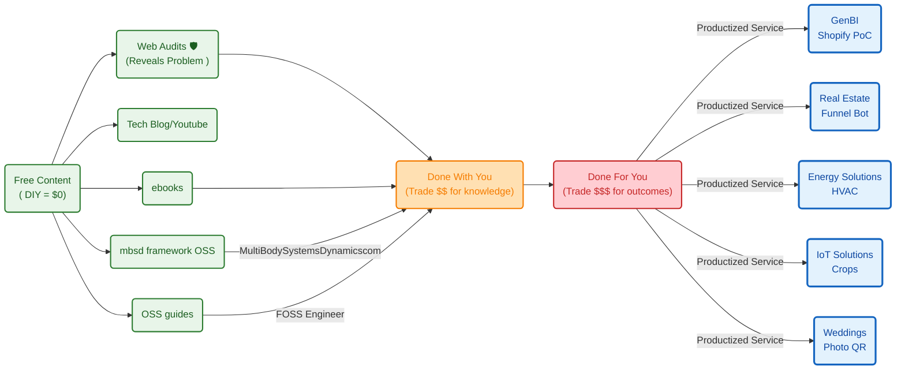

**TL;DR**


**Intro**

Coming from [this post](https://jalcocert.github.io/JAlcocerT/geo-maps-and-data/#geo-from-r-to-py)


https://www.youtube.com/watch?v=4R4xRH-Nyac

https://www.youtube.com/watch?v=uPM2gNSWX9o&list=PLAxJ4-o7ZoPcfLJ0w7k-woHJXkbjSiKb3

https://www.youtube.com/results?search_query=f4map

This is a good chance:


  
  


1. To have a look to French Real estate [again](https://jalcocert.github.io/JAlcocerT/ai-scripts-and-animated-data/#real-estate):


  


> Go to the [details of DFV geo exploration](#french-dfv-prices-x-geo)

2. To check how household income is evolving in spain as [a recap of this post](https://jalcocert.github.io/JAlcocerT/geo-maps-and-data/)

3. To use PyRouteTracker against more karting or trackday data:


Just this GoPro telemetry bc doing the reverse engineering to a Laguna mk2 was tricky and doing `candump` turned off the car before going to spa


4. Just imagine how a Drone x GPS could be!

5. Phyphox take off data: *remember that you can configure replicable experiments via QR!*

```sh
cd ./poc/airplane-phyphox
```

6. To think how the [solar rays simulations of a building](https://jalcocert.github.io/JAlcocerT/data-driven-insulation-evaluation/#the-sun-is-interesting) need more context of their surrounding:

```sh
#sudo snap install blender --classic --channel=5.1/stable
#cd ./poc/building-to-blender
#claude --dangerously-skip-permissions
cd ./poc/building-geo-to-blender
```

| Date | Astronomical daylight | Direct sun | Lost to terrain |
|---|---|---|---|
| 21 Dec 2026 | 8.8 h | **3.3 h** | **62%** |
| 1 Jul 2026 | 15.0 h | 12.0 h | 20% |

> Go to [the details](#solar-rays-x-buildings-in-a-geolocation)


7. Matching an [action cam video to a GPX](#video-x-gpx-matching) file: the physics of [coasting behind an ebike](#coasting-behind-an-ebike)


## SelfHosted GPX


https://github.com/gpxstudio/gpx.studio

> MIT | the online GPX file editor

https://gpx.studio/app#10.96/42.9481/-0.2867/0/70

1. GeoLibre - https://github.com/opengeos/GeoLibre that you can find https://geolibre.app/

2. [Dawarich](https://fossengineer.com/selfhosting-dawarich/) - with [Android app](#mobile-gpx-apps)

You have several integrations `http://localhost:3333/settings/integrations` like with [Velomate](https://fossengineer.com/selfhosting-velomate/)

https://github.com/JAlcocerT/Home-Lab/tree/main/dawarich

> Make sure to have proper [Application hosts in the .env](https://github.com/JAlcocerT/Home-Lab/blob/main/dawarich/.env.sample#L9)

> > on a fresh self-hosted install you should be able to sign in with the seeded default account:

  - Username: demo@dawarich.app
  - Password: safepassword (github.com (https://github.com/Freika/dawarich))

For Cloudflare exposure, the important bit is that the app container must join the shared tunnel network, and Rails must allow the public hostname in APPLICATION_HOSTS.
  - If you expose the same service both locally and through Cloudflare, the local port mapping can stay in place. The tunnel just adds another path in.
  - The tunnel side does not need a separate reverse proxy here; your existing cloudflared container can route directly to dawarich_app:3000.
  - Browser issues can look like app failures, but in this case the service was fine; the problem was the client path and DNS/IPv6 timing.

```sh

```

Go to CF and add `dawarich_app:3000`

3. More [Selfhosted GPX](https://jalcocert.github.io/JAlcocerT/geo-maps-and-data/#selfhosted-gpx) like https://github.com/tess1o/geopulse

<!-- 
https://www.youtube.com/watch?v=pK_fSEp_OzQ 
-->



4. Geolibre

5. Owntracks

6. https://github.com/traccar/traccar

7. [GeoPulse](https://fossengineer.com/selfhosting-geopulse/)

8. Others:

https://github.com/mendhak/gpslogger/

https://github.com/dietrichmax/colota


https://github.com/dawarich-app/atlas

### Mobile GPX Apps

`https://apps.apple.com/us/app/open-gpx-tracker/id984503772`

2. Dawarich `https://play.google.com/store/apps/details?id=com.zeitflow.dawarich&pli=1`


## GoPro GPS


## Building around GeoData

### French DFV Prices x Geo


```sh
python scripts/build_transaction_map.py
start maps\dvf_eaux_bonnes_2025_transactions.html
```


```sh
python scripts/build_france_transaction_map.py --max-mutations 1000
#  python scripts/build_france_transaction_map.py --department 64
maps\dvf_france_2025_transactions_preview.html

#start maps\dvf_france_2025_transactions_preview.html
start maps\dvf_combined_lyon_dept64_2025_transactions_preview.html
```

I put together a [quick video here](https://github.com/JAlcocerT/poc/tree/main/building-geo-fr-osm) around those

```sh
python -m py_compile scripts\build_price_video.py
```

<!-- 
https://youtu.be/bgx9B_77tYU 
-->




More info about other [housing data points](#finding-interesting-housing-data)


See where the sold houses are and how much sun they are getting in December, by combining: *22.8% of the inhabited corridor gets zero direct sun in December.*


Roughly nine steps, and the ordering has one non-obvious dependency: **the prices decide how big the DEM has to be**, so you can't fetch terrain first.

Pass 1 — the transaction study

**1. Probe the source before writing anything.** `curl -sI` on `files.data.gouv.fr/geo-dvf/latest/csv/{year}/communes/64/64204.csv` to find out what actually exists. Result: 2021–2025 only (`latest` is a rolling five-year window; 2014–2020 all 404). That single check decided the sample size for everything downstream.

**2. Look at raw rows before designing the €/m² rule.** Downloaded the five files (~180 KB total) and dumped a few multi-row mutations. That's where the rule came from: `Dépendance` rows carry *no* `surface_reelle_bati` at all, so `Appartement; Dépendance` is one flat sold with its cellar — keep it, and use the flat's surface as the denominator. Had I written the ingest first I'd have excluded those and thrown away most of the sample.

**3. Ingest → `fetch_geodvf.py`.** Group by `id_mutation` (the official key — no date+value+address heuristic needed), apply the pricing rule, log a *reason* for every rejection. → 485 mutations, 481 geocoded, 397 priced, median 1686 €/m².

**4. Now size the terrain from the prices.** Bbox of the transaction coordinates: 3.1 × 6.9 km, furthest point 3.8 km from centre. Since the horizon march needs 30 km, the DEM radius must be 30 + 3.8 ≈ 34 km. That's the dependency — terrain extent is a function of where the sales are.

**5. DEM fetch → `fetch_terrain.py`** (copied verbatim from `building-geo-to-blender`). 110 terrarium tiles, 34 MB, 80 s, no API key, no GDAL.

**6. Horizon per parcel → `sun_by_point.py`.** The one piece of genuinely new geometry: the sibling project marches rays from the *centre* of its DEM, this marches from an arbitrary offset inside a shared one. Deduped to **117 distinct coordinates** rather than 481 mutations, because DVF geocodes to the parcel. 17 s.

**7. Join and test → `join_analyze.py`.** Correlations, cluster-robust regressions, the faceted scatter, the Leaflet map. → the null result, which I then blamed on a +0.92 elevation/sun collinearity.

```
geo-DVF csv ──> mutations.csv ──┬──> bbox ──> DEM ──> horizons ──> sun_by_point.csv
                                │                                        │
                                └────────────────  join  ────────────────┘
                                                     ↓
                                        findings.json, chart, map
```

Pass 2 — the raster that overturned step 7's diagnosis

**8. Same DEM, grid instead of points → `build_sun_raster.py`.** 4 515 cells, 5 min 20 s. Then — before trusting a single number — **cross-check**: sample the raster at the 117 parcel coordinates and compare against pass 1. r = 0.999, mean absolute difference 1.5 h, signed difference −0.05 h.

**9. Bin by elevation → `analyze_bands.py`.** This is where the reframing happened: over the terrain the collinearity is only +0.24, versus +0.74 over sold parcels and +0.92 over sales. So the matched-elevation test became possible, and it made the null stronger.

**10. Composite → `composite_map.py`.** Blend the raster onto real OSM tiles. Nominally an illustration; actually the georeferencing check — the pale corridor lands exactly on the Valentin and the D918.

## The shape underneath it

Three habits did most of the work, and they're all lifted from your existing projects rather than invented:

- **Inspect the data before writing the parser.** Steps 1 and 2 each changed the design.
- **Two independent paths, then check they agree.** Your `building-geo-to-blender` cross-checks its analytic horizon against a Cycles render (38.4% vs 38.9%); here the raster cross-checks the point run, and the composite cross-checks the georeferencing. Every expensive claim has a cheap second opinion.
- **Refuse rather than degrade.** Both the point script and the raster script *exit* with the march radius that would fit instead of letting rays edge-clamp — because edge-clamping silently flattens distant ridges into a sunnier answer and leaves no trace in the output.

Stack: Python stdlib for the data plumbing, numpy for the marching, scipy for the statistics, Pillow for the rasters, matplotlib for the charts, Leaflet for the maps. No database, no GDAL, no npm.

### Solar Rays x Buildings in a Geolocation

For an off-grid or heat-pump build, annual totals are the
wrong statistic and December is the whole design constraint.


https://jalcocert.github.io/JAlcocerT/data-driven-insulation-evaluation/#the-sun-is-interesting

#### Blender x GIS


https://github.com/domlysz/BlenderGIS

<!-- https://www.youtube.com/watch?v=cSTCZVzS1fs -->




### Video x GPX matching


#### Coasting behind an ebike

The amount of power (assistance) an e-bike provides depends on the **motor rating**, the **jurisdiction/legal limits**, and the difference between **continuous** vs. **peak** power.

1. Typical Power Ratings (Nominal / Continuous)

* **250 Watts (Standard / EU, UK, Australia):** In Europe, the UK, and Australia, the legal maximum for a standard pedal-assist bike (pedelec) is **250 W continuous rated power**.
* **500 W to 750 Watts (US & Canada):** In the United States and Canada, legal e-bikes (Class 1, 2, and 3) typically allow up to **750 W** of nominal motor power.
* **1,000 W+ (Off-Road / Speed Pedelecs / DIY):** High-power cargo bikes, speed pedelecs, or off-road e-bikes range from 1,000 W up to 1,500 W+.

2. Nominal (Continuous) vs. Peak Power

Advertised motor wattage usually falls into two categories:

| Type | What It Means | Typical 250W Bike | Typical 750W Bike |
| --- | --- | --- | --- |
| **Nominal (Continuous) Power** | The power the motor can output continuously without overheating. (Used for legal compliance). | 250 W | 750 W |
| **Peak Power** | Short bursts of max power during heavy acceleration or steep hill climbing. | 400 W – 600 W | 1,000 W – 1,300 W |

3. Human Power vs. E-Bike Power

To put e-bike assistance in perspective relative to human effort:

* **Average Human Cyclist:** Produces around **100 W to 150 W** of sustained pedaling power.
* **Fit / Amateur Cyclist:** Produces around **200 W to 250 W**.
* **Pro Cyclist:** Sustains **350 W to 450 W** during intense efforts.

> You can imagine how hard was to cross from UK to FR [by a bike powered plane](https://en.wikipedia.org/wiki/MIT_Daedalus)!


```sh

```



For a non-professional cyclist, power output depends heavily on fitness level, body weight, and duration.

Cycling power is typically measured at **FTP** (Functional Threshold Power—the maximum average wattage you can hold for roughly 1 hour) or measured in **Watts per kilogram ($\text{W/kg}$)**.

---

Sustained Power (1-Hour Continuous Effort)

For an average adult male weighing around $75\text{ kg } (165\text{ lbs})$:

| Fitness Level | Sustained Power (FTP) | Relative Power ($\text{W/kg}$) | What That Looks Like in Real Life |
| --- | --- | --- | --- |
| **Untrained / Casual** | **$100\text{ -- }150\text{ W}$** | $1.3 \text{--} 2.0\text{ W/kg}$ | Commuting, casual gym bike, easy recreational riding. |
| **Recreational** | **$150\text{ -- }200\text{ W}$** | $2.0 \text{--} 2.7\text{ W/kg}$ | Rides 1–2 times a week, can maintain $20\text{--}24\text{ km/h}$ on flat road. |
| **Fit Amateur (Club Rider)** | **$200\text{ -- }260\text{ W}$** | $2.7 \text{--} 3.5\text{ W/kg}$ | Trains regularly, does weekend group rides, fast on flats. |
| **Strong Amateur Racer** | **$260\text{ -- }320\text{ W}$** | $3.5 \text{--} 4.2\text{ W/kg}$ | Competes in local races (Cat 3/4), very fast on climbs. |

---

Short-Burst / Sprint Power

If you ask a non-professional to stomp on the pedals as hard as possible for a brief burst:

* **5–10 Second Max Sprint:** An average non-pro can burst **$500\text{ to }900\text{ Watts}$**. A strong amateur sprinter can peak around **$1,000\text{ to }1,200\text{ Watts}$**.
* **1-Minute Hard Effort:** A healthy non-pro can hold **$300\text{ to }450\text{ Watts}$** before severe fatigue and acid buildup set in.

#### Bike Reverse Engineering Experiment

I remember that we made an experiment during the studies where we logged bike sensor data

This can be useful to estimate the power i applied to the bike

```sh
git clone 
cd ./
```

---

## Conclusions


Do more *with a feedback loop*.


Not sure about you, but im doing:




---

## FAQ

### Finding interesting housing data

1. For Spain

* https://penotariado.com/inmobiliario/en/housing-price-finder

You can correlate [with household income](https://www.ine.es/ADRH/?config=config_ADRH_2023.json&showLayers=ADRH_2023_Renta_media_por_hogar_cache&level=5)

2. For FR:

3. For DK:

4. For PL: 

### GPS Tracker

https://www.traccar.org/docker/
https://github.com/traccar/traccar-docker
