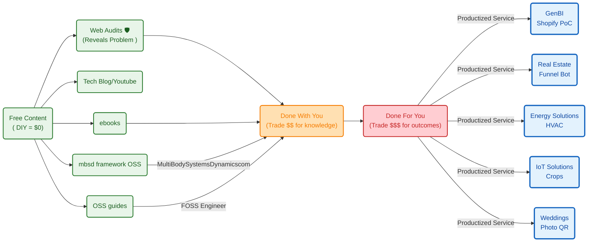

**TL;DR**


**Intro**

Coming from [this post](https://jalcocert.github.io/JAlcocerT/geo-maps-and-data/#geo-from-r-to-py)


https://www.youtube.com/watch?v=4R4xRH-Nyac

https://www.youtube.com/watch?v=uPM2gNSWX9o&list=PLAxJ4-o7ZoPcfLJ0w7k-woHJXkbjSiKb3

https://www.youtube.com/results?search_query=f4map

This is a good chance:


  
  


1. To have a look to French Real estate [again](https://jalcocert.github.io/JAlcocerT/ai-scripts-and-animated-data/#real-estate):


  


> Go to the [details of DFV geo exploration](#french-dfv-prices-x-geo)

2. To check how household income is evolving in spain as [a recap of this post](https://jalcocert.github.io/JAlcocerT/geo-maps-and-data/)

3. To use PyRouteTracker against more karting or trackday data:


Just this GoPro telemetry bc doing the reverse engineering to a Laguna mk2 was tricky and doing `candump` turned off the car before going to spa


4. Just imagine how a Drone x GPS could be!

5. Phyphox take off data: *remember that you can configure replicable experiments via QR!*

```sh
cd ./poc/airplane-phyphox
```

6. To think how the [solar rays simulations of a building](https://jalcocert.github.io/JAlcocerT/data-driven-insulation-evaluation/#the-sun-is-interesting) need more context of their surrounding:

```sh
#sudo snap install blender --classic --channel=5.1/stable
#cd ./poc/building-to-blender
#claude --dangerously-skip-permissions
cd ./poc/building-geo-to-blender
```

| Date | Astronomical daylight | Direct sun | Lost to terrain |
|---|---|---|---|
| 21 Dec 2026 | 8.8 h | **3.3 h** | **62%** |
| 1 Jul 2026 | 15.0 h | 12.0 h | 20% |

> Go to [the details](#solar-rays-x-buildings-in-a-geolocation)


7. Matching an [action cam video to a GPX](#video-x-gpx-matching) file: the physics of [coasting behind an ebike](#coasting-behind-an-ebike)


## SelfHosted GPX


https://github.com/gpxstudio/gpx.studio

> MIT | the online GPX file editor

https://gpx.studio/app#10.96/42.9481/-0.2867/0/70

1. GeoLibre - https://github.com/opengeos/GeoLibre that you can find https://geolibre.app/

2. Dawarich - with [Android app](#mobile-gpx-apps)

You have several integrations `http://localhost:3333/settings/integrations` like with [Velomate](https://fossengineer.com/selfhosting-velomate/)

3. More [Selfhosted GPX](https://jalcocert.github.io/JAlcocerT/geo-maps-and-data/#selfhosted-gpx) like https://github.com/tess1o/geopulse

<!-- 
https://www.youtube.com/watch?v=pK_fSEp_OzQ 
-->



### Mobile GPX Apps

`https://apps.apple.com/us/app/open-gpx-tracker/id984503772`

2. Dawarich `https://play.google.com/store/apps/details?id=com.zeitflow.dawarich&pli=1`


## GoPro GPS


## Building around GeoData

### French DFV Prices x Geo


```sh
python scripts/build_transaction_map.py
start maps\dvf_eaux_bonnes_2025_transactions.html
```


```sh
python scripts/build_france_transaction_map.py --max-mutations 1000
#  python scripts/build_france_transaction_map.py --department 64
maps\dvf_france_2025_transactions_preview.html

#start maps\dvf_france_2025_transactions_preview.html
start maps\dvf_combined_lyon_dept64_2025_transactions_preview.html
```

I put together a [quick video here](https://github.com/JAlcocerT/poc/tree/main/building-geo-fr-osm) around those

```sh
python -m py_compile scripts\build_price_video.py
```

<!-- 
https://youtu.be/bgx9B_77tYU 
-->




More info about other [housing data points](#finding-interesting-housing-data)



### Solar Rays x Buildings in a Geolocation


#### Blender x GIS


https://github.com/domlysz/BlenderGIS

<!-- https://www.youtube.com/watch?v=cSTCZVzS1fs -->




### Video x GPX matching


#### Coasting behind an ebike

The amount of power (assistance) an e-bike provides depends on the **motor rating**, the **jurisdiction/legal limits**, and the difference between **continuous** vs. **peak** power.

1. Typical Power Ratings (Nominal / Continuous)

* **250 Watts (Standard / EU, UK, Australia):** In Europe, the UK, and Australia, the legal maximum for a standard pedal-assist bike (pedelec) is **250 W continuous rated power**.
* **500 W to 750 Watts (US & Canada):** In the United States and Canada, legal e-bikes (Class 1, 2, and 3) typically allow up to **750 W** of nominal motor power.
* **1,000 W+ (Off-Road / Speed Pedelecs / DIY):** High-power cargo bikes, speed pedelecs, or off-road e-bikes range from 1,000 W up to 1,500 W+.

2. Nominal (Continuous) vs. Peak Power

Advertised motor wattage usually falls into two categories:

| Type | What It Means | Typical 250W Bike | Typical 750W Bike |
| --- | --- | --- | --- |
| **Nominal (Continuous) Power** | The power the motor can output continuously without overheating. (Used for legal compliance). | 250 W | 750 W |
| **Peak Power** | Short bursts of max power during heavy acceleration or steep hill climbing. | 400 W – 600 W | 1,000 W – 1,300 W |

3. Human Power vs. E-Bike Power

To put e-bike assistance in perspective relative to human effort:

* **Average Human Cyclist:** Produces around **100 W to 150 W** of sustained pedaling power.
* **Fit / Amateur Cyclist:** Produces around **200 W to 250 W**.
* **Pro Cyclist:** Sustains **350 W to 450 W** during intense efforts.

> You can imagine how hard was to cross from UK to FR [by a bike powered plane](https://en.wikipedia.org/wiki/MIT_Daedalus)!


```sh

```



For a non-professional cyclist, power output depends heavily on fitness level, body weight, and duration.

Cycling power is typically measured at **FTP** (Functional Threshold Power—the maximum average wattage you can hold for roughly 1 hour) or measured in **Watts per kilogram ($\text{W/kg}$)**.

---

Sustained Power (1-Hour Continuous Effort)

For an average adult male weighing around $75\text{ kg } (165\text{ lbs})$:

| Fitness Level | Sustained Power (FTP) | Relative Power ($\text{W/kg}$) | What That Looks Like in Real Life |
| --- | --- | --- | --- |
| **Untrained / Casual** | **$100\text{ -- }150\text{ W}$** | $1.3 \text{--} 2.0\text{ W/kg}$ | Commuting, casual gym bike, easy recreational riding. |
| **Recreational** | **$150\text{ -- }200\text{ W}$** | $2.0 \text{--} 2.7\text{ W/kg}$ | Rides 1–2 times a week, can maintain $20\text{--}24\text{ km/h}$ on flat road. |
| **Fit Amateur (Club Rider)** | **$200\text{ -- }260\text{ W}$** | $2.7 \text{--} 3.5\text{ W/kg}$ | Trains regularly, does weekend group rides, fast on flats. |
| **Strong Amateur Racer** | **$260\text{ -- }320\text{ W}$** | $3.5 \text{--} 4.2\text{ W/kg}$ | Competes in local races (Cat 3/4), very fast on climbs. |

*(Note: Female cyclists average roughly 15–20% lower raw wattage for similar fitness tiers due to lower average body mass and muscle fraction, sitting around $80\text{--}120\text{ W}$ for casual up to $180\text{--}240\text{ W}$ for top amateurs).*

---

Short-Burst / Sprint Power

If you ask a non-professional to stomp on the pedals as hard as possible for a brief burst:

* **5–10 Second Max Sprint:** An average non-pro can burst **$500\text{ to }900\text{ Watts}$**. A strong amateur sprinter can peak around **$1,000\text{ to }1,200\text{ Watts}$**.
* **1-Minute Hard Effort:** A healthy non-pro can hold **$300\text{ to }450\text{ Watts}$** before severe fatigue and acid buildup set in.


---

## Conclusions

Not sure about you, but im doing:




---

## FAQ

### Finding interesting housing data

1. For Spain

* https://penotariado.com/inmobiliario/en/housing-price-finder

You can correlate [with household income](https://www.ine.es/ADRH/?config=config_ADRH_2023.json&showLayers=ADRH_2023_Renta_media_por_hogar_cache&level=5)

2. For FR:

3. For DK:

4. For PL: 