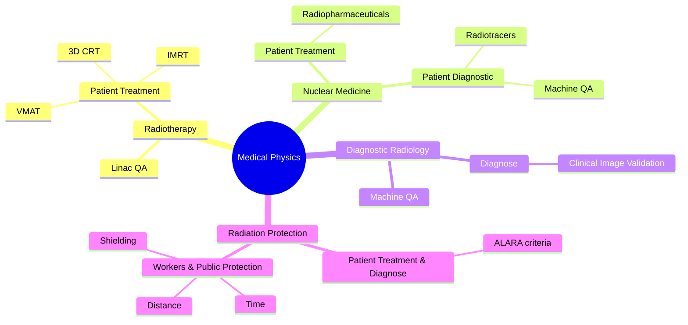

**Tl;DR**

Not a post about IQVIA nor [FMCG](https://jalcocert.github.io/JAlcocerT/fmcg-concepts-101/), nor [D&A tech stack](https://jalcocert.github.io/JAlcocerT/career/) for healthcare analytics.

But one to make the **development operations more efficient** for a PHD team in a hospital.

**Intro**

It all comes down to doing + sharing/helping.


  
  


Even better if you do so around a well defined offer, so people know what to expect.


  
  


In this case, it has been a **success story** based on **github actions x containers best practices**


  


What we have done:

1. Define the problem

2. Solution proposal: container image versioning and automatic creation

* Defining the workflow config: https://github.com/jlleongarcia/X-ray-imaging-analysis/commit/2a2eb68132834b39ce8ff3e9e77e8d7d87e801b5

* Making a manual test run towards v1.0: https://github.com/jlleongarcia/X-ray-imaging-analysis/actions/runs/20484822267/job/58865117916 which was before [like so](https://github.com/jlleongarcia/X-ray-imaging-analysis/commit/5443b3149024814a901531319421f2254434f012)

3. Enabling the public ghcr artifacts to public to share within other hospitals: https://github.com/jlleongarcia/X-ray-imaging-analysis/pkgs/container/x-ray-imaging-analysis


Its also recommended to provide a docker-compose for users who want to **build their own image**:

```yml
version: '3.8'

services:
  streamlit-app:
    # Build context points to the current directory (where this file lives)
    build: 
      context: .
      dockerfile: Dockerfile
    container_name: X-ray-imaging-analysis
    restart: unless-stopped
    ports:
    - "8502:8502"
    # Define the healthcheck to ensure the container is truly ready for the tunnel
    healthcheck:
      test: ["CMD", "curl", "-f", "http://localhost:8502"]
      interval: 30s
      timeout: 10s
      retries: 3
```

And one for the ones that just want to pull a particular *already built* image version with certain features:

```sh
docker pull ghcr.io/jlleongarcia/x-ray-imaging-analysis:v1.0
```

```yml
version: '3.8'

services:
  streamlit-app:
    image: ghcr.io/jlleongarcia/x-ray-imaging-analysis:v1.0 #this one is already build, you just pull it (and run it)
    container_name: x-ray-imaging-analysis
    restart: unless-stopped
    ports:
    - "8502:8502"
    # Define the healthcheck to ensure the container is truly ready for the tunnel
    healthcheck:
      test: ["CMD", "curl", "-f", "http://localhost:8502"]
      interval: 30s
      timeout: 10s
      retries: 3
```

```sh
sudo docker stats x-ray-imaging-analysis
```

On my latest projects, I try to differenciate the docker-compose for:

* Development: which builts the image locally
* For Production: which just pull a particular image version with certain features
  * With NGINX/Cloudflare tunnel - which i tend to call portainer version
  * With Traefik - which i tend to call traefik version


  



---

## Conclusions

We started out with the framework: Whats working, whats not and whats next?

The problem was clearly the way of shipping the code to production and the maintanability/ trazability of the versions.

Thats where bringing the CI/CD strategy with the containers automated built method was a game changer.

Regarding the what's next: I recommended to have a look for automated SSL certificates for their internal domain.

Knowing how to control infrastructure (servers/homelab) and providing SSL/https is a must.


  
  



**Healthcare Analytics** is a broad field, and it can be applied to many different areas of healthcare:



**Powered by** the start doing section of last year: *Collect **case studies** / success stories: Flask web app https on a server for SMB / real estate DFY w custom chatbot / hospital D&A CI/CD radiophysics / from zero to astro web hero for a mechanical engineer...and add them to the `consulting.jalcocer` and/or as article on the main www site.*


<!-- https://youtu.be/eFS7crQpm_s -->
<!--  -->

The success story has been recorded [here](https://youtu.be/3lcywTUeP5k)



---

## FAQ


> Latest features shipped properly: https://github.com/JAlcocerT/X-ray-imaging-analysis + youtube video