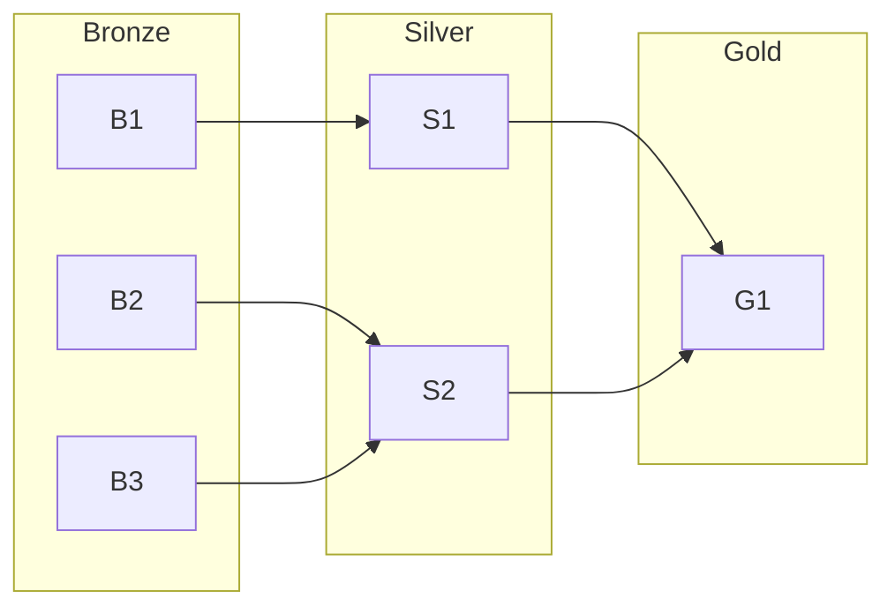

An image is worth a 1000 words.

I cant disagree with that sentence, specially since I discovered these tools:

1. [MermaidJS](#mermaidjs)
2. [Python Diagrams and DrawIO](#other-diagram-tools)

## MermaidJS

A game changer for documenting processes and architecture diagrams:

* https://mermaid.live/

**Example** A top down flow chart:

```
graph TD;
    Apps-->Double-Click;
    Double-Click-->.deb
    Double-Click--> Appimage
    Apps-->Terminal;
    Terminal-->APT/NALA;
```

Dont be afraid, the **MermaidJS docs are just amazing** to follow: https://mermaid.js.org/intro/

Im in love with Mermaid to create really quick **diagrams for D&A Architechtural designs**:



## Other Diagram Tools

How could it not be a possibility with Python?
1. [Python Diagrams](https://fossengineer.com/free-diagram-tools/#python-diagrams)

And if you want, you have a SelfHosted option:

2. [DrawIO](https://fossengineer.com/selfhosting-drawio-with-docker/)


These tools play great with **PPTs as a code**: SliDev, Remark, MARP


3. Excalidraw!

* https://github.com/excalidraw/excalidraw



<!-- 
https://www.youtube.com/watch?v=Z5W68WXldr0 -->

> A great video to understand Excalidraw, doom and how a proxie works!