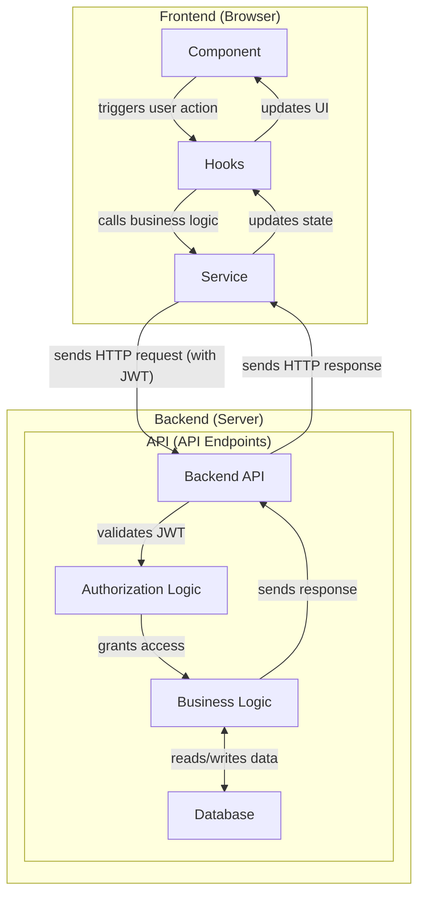

**TL;DR**

About Front-End and how to do better auth.

With [Selfhosted OAUTH alternatives](#conclusions) recap.

**Intro**

This has been the year of getting better at authentication.

I got to setup properly: [Logto](#logto) and [TinyAuth](https://jalcocert.github.io/JAlcocerT/testing-tinyauth/) as two different auth alternatives.

Via Flask, we can also have [hardcoded users to be logged in](#flask-userpwd-challenge), which you can improve by being part of the `.env`

I also got to know the PB way of authenticating users.



A **FE guy recommended** me to look:

* https://tanstack.com/query/latest - Powerful asynchronous state management, server-state utilities and data fetching
* https://redux-toolkit.js.org/rtk-query/overview - RTK Query is an optional addon included in the Redux Toolkit package, and its functionality is built on top of the other APIs in Redux Toolkit.


## FE Can do a lot

Front End and its html, [css](https://jalcocert.github.io/JAlcocerT/blog/dev-web-code-css/) and [JS](https://jalcocert.github.io/JAlcocerT/javascript-for-static-websites/)/[TS](https://jalcocert.github.io/JAlcocerT/whats-typescript/) can do a lot of things.

Not only great looking static blogs or content driven sites.

But also apps, like these for invoice generation, that actually perform some task:

> We can generate PDFs while being statically deployed.


  



>> The client’s CPU (and browser engine) does the layout and PDF generation 😧

It seem all that is just the **beauty of [SPAs](https://github.com/JAlcocerT/serverless-invoices/blob/main/WHAT_IS_SPA.md)**.

Because I got it deployed statically for free at cloudflare pages [like so](https://github.com/JAlcocerT/serverless-invoices/blob/main/Deploy_to_CF.md), with all its features working: https://serverless-invoices.pages.dev/

Its also interesting to see how it works the invoice editor, purely static. Idea for the markdown editor? 

Ill have to see also [react-invoice deployed at vercel](https://react-invoice-nu.vercel.app/) or [wikiJS](https://github.com/requarks/wiki) to get more ideas

If you are confussed...I have been too.

Get a broader view: I have added this [SSG / SPA / SPA+Webhooks / Full Stack 101](https://github.com/JAlcocerT/serverless-invoices/blob/main/ARCHITECTURE_OPTIONS.md)

| Model | What it is | Pros | Cons | Good for | Typical hosting/runtime |
| --- | --- | --- | --- | --- | --- |
| SPA | Client‑side rendered app; one `index.html`, routes in browser | Simple hosting, rich UX, offline possible, minimal infra | Larger initial JS, SEO needs care, auth done client‑side | Tools, dashboards, single‑user/private apps | Static host (CF Pages/Netlify/Vercel) + SPA fallback |
| PWA | SPA/SSG with Service Worker + manifest for offline/install | Offline/cache, installable, better UX | SW complexity, cache invalidation, browser quirks | Field apps, recurring tools, low‑connectivity use | Same as SPA/SSG + Service Worker |
| SPA + Webhooks | SPA UI + serverless functions reacting to provider webhooks; small state in KV/DB; client reads via `/api/me` | Keep static hosting; entitlements/auth/events without full backend; low cost | Extra moving parts (functions, secrets, KV); client gating (not true server auth) | Feature unlocks, subscription gates, light auth/roles, Stripe/MailerLite/Logto/PocketBase events | Static host + Functions (CF Workers/Pages Functions, Netlify/Vercel) + KV/D1 |
| SSG | Pages pre‑rendered at build time | Great SEO/TTFB, CDN‑only, predictable costs | Rebuilds for content changes (unless ISR); dynamic per‑user needs client fetch | Marketing/docs, blogs, mostly static content | Static host; optional ISR/edge revalidation |
| JAMstack | Architecture: static frontends + APIs + serverless; can be SPA or SSG | Scales via CDN, decoupled services, strong DX | Requires integration glue (webhooks/functions), service sprawl | Sites/apps that mix static + APIs; headless CMS | Static host + Functions + external APIs (headless CMS, auth, payments) |
| SSR (full‑stack) | HTML rendered per request (server/edge) with API/backend | Fast first render, great SEO for dynamic routes, secure server auth, streaming | Needs runtime/server, higher ops complexity/cost | Multi‑user SaaS, personalized content, complex auth | App platform (Node SSR: Nuxt/Next/Nest/Express) on server/edge |


See how JAMstack is an alternative to SPA+Webhooks




See that IndexedDB storing *for the moment* my imported [sample invoice json](https://github.com/JAlcocerT/serverless-invoices/blob/main/serverless-invoices-example.json)



### FE Separation of Concerns

An excellent representation of a modern, well-structured front-end application architecture is the model follows the **separation of concerns** principle.

This is a cornerstone of building scalable and maintainable software.

But why this layered approach is so effective?

#### Component: The Presentation Layer 🎭

The **Component** is a pure presentation layer. Its sole responsibility is to render the UI and respond to user events. It shouldn't contain any complex business logic. 

Its job is to be "dumb"—it displays data it receives and passes user interactions up to the next layer.

This makes components highly reusable and easy to reason about.

For example, a `<UserProfile>` component simply takes `user` data as a prop and displays the name, photo, and bio.

It doesn't know *how* that data was fetched.


#### Hooks: The Business Logic Layer 🧠

**Hooks** act as the bridge between the UI and the data layer. They contain the application's **business logic**.

A hook's job is to manage state, handle side effects (like data fetching), and expose a clean, reusable interface for components. 

For example, a `useUserProfile()` hook would be responsible for fetching the user's data from an API and managing the loading and error states. 

It encapsulates all that complexity so the component doesn't have to. It's the "smart" part of the application that knows *what* to do with data.

***

#### Services: The Data Layer 🔌

**Services** are the low-level data access layer. 

They are responsible for communicating with external resources like a backend API (e.g., FastAPI) or a database (e.g., PocketBase, or PB as you mentioned).

A service contains the raw functions for making HTTP requests, handling authentication tokens, and formatting data. They don't know anything about the UI or how the data will be used. They simply provide a clean, promise-based API for other parts of the application to use. 

By separating your application this way, you gain several key advantages:

* **Reusability:** Your services can be used by any hook, and your hooks can be used by any component, without code duplication.
* **Testability:** As discussed earlier, you can test each layer in isolation. The service tests ensure your API calls work correctly, the hook tests verify your business logic, and the component tests check that the UI renders properly.
* **Maintainability:** If your backend API changes, you only need to update your services. If you want to change a UI design, you only need to modify a component. This prevents a domino effect of changes across the entire codebase.

## About Business Logic

You've hit on a common point of confusion.

**Business logic** is a broad term, and in modern development, it exists on both the front end (FE) and the back end (BE). 

Your hooks can and should contain business logic, but it's a specific type of logic.

### Business Logic on the Front End (Hooks)

The business logic in your **hooks** is primarily about **application state and user interface orchestration**. 

It dictates *how* the front end should behave and react to user input and back-end responses. This is often called **client-side business logic**.

Examples include:

* **Form Validation:** Checking if a user's input is valid before sending it to the back end.
* **UI State Management:** Logic for showing a loading spinner, handling a "Remember Me" checkbox, or toggling UI elements.
* **Data Transformation:** Formatting data from the back end for a better user experience (e.g., converting a raw date string into a "3 days ago" format).

This logic should be focused on improving the user experience and making the application feel responsive and intelligent without requiring a round-trip to the server.

***

### Business Logic on the Back End

The business logic on the **back end** is the **core, authoritative logic** that governs your application's data and security. This is where the most critical rules and operations reside. It's the **server-side business logic**.

Examples include:

* **Security & Authorization:** The ultimate decision on whether a user can access or modify a resource. This is non-negotiable and must be handled on the server.
* **Data Validation & Integrity:** Ensuring that data written to the database is always valid and adheres to all constraints (e.g., a user's email is unique, a product's price is positive).
* **Complex Calculations:** Processing a user's shopping cart, calculating taxes and shipping, or running any resource-intensive operations.

***

### Why the Distinction Matters

You need both. The logic in your front-end hooks and the logic on your back end work together to create a seamless experience.

* **Defense in Depth:** The front-end validation in your hooks provides a great user experience by giving instant feedback, but the back-end validation is the last line of defense. You should **never trust a front-end request**, as it can be bypassed.
* **Scalability & Maintainability:** By separating the logic, you can scale each part independently. A bug in your UI logic won't compromise your data, and changes to your back end can be made without completely refactoring the front end.

So, to summarize: **hooks are a part of the front end**, and they contain **client-side business logic** to improve the user experience. The **back end contains the authoritative server-side business logic** that secures your application and manages your data. 

## Authentication vs Authorization

That's a crucial question in web security, and the distinction is often a source of confusion. In simple terms:

* **Authentication** is about **who you are**.
* **Authorization** is about **what you can do**.

> Getting philosophical here 

Think of a real-world analogy, like a secured building:

1.  **Authentication (Your ID Card):** When you arrive at the front door, the security guard asks for your ID. You present it, and the guard verifies that you are indeed the person named on the card. This process confirms your identity. You have been **authenticated**.

2.  **Authorization (Your Key Card Permissions):** Once inside, you use your key card to open a specific door. The key card is programmed to only give you access to the floors and rooms you are allowed to enter. You can go into the office kitchen, but not the executive conference room. This process determines your level of access and what you are permitted to do. You have been **authorized** for specific areas.


| Aspect | Authentication | Authorization |
| :--- | :--- | :--- |
| **Question it Answers** | Who are you? | What are you allowed to do? |
| **Process** | Verifying identity. | Granting or denying access to resources based on permissions. |
| **Credentials Used** | Username/password, biometrics (fingerprint), tokens (JWT), smart cards, etc. | Roles, permissions, access policies, scopes (in OAuth). |
| **Order of Operations** | **Always comes first.** You must be authenticated before you can be authorized. | **Always follows authentication.** The system needs to know who you are before it can decide what you can access. |
| **Example in Web Security** | You enter your email and password to log in to an application. The application verifies your credentials. | The application sees that you are an "admin" and shows you a dashboard with options to manage users, which a regular user wouldn't see. Or, an API request with your token only grants you access to your own user profile data. |

In the context of the previous discussion:

* **OAuth** is an **authorization** protocol. Its main job is to define the secure process for an application to get a token that grants it specific permissions to access a user's resources.

* A **JWT** can be used for both **authentication** and **authorization**. The act of a server validating the JWT's signature to confirm it came from a trusted source is part of authentication. The "claims" inside the JWT's payload (e.g., `role: "admin"`) provide the authorization information that the resource server uses to decide what the user can do.


## Authentication Tools

I have been very happy with [LogTo](#logto) so far.

[](https://star-history.com/steveiliop56/tinyauth&traefik/traefik&Sinaptik-AI/pandas-ai&pydantic/pydantic-ai&Date)


### Logto

* https://logto.io/

>  🧑‍🚀 Authentication and authorization infrastructure for SaaS and AI apps, built on OIDC and OAuth 2.1 with multi-tenancy, SSO, and RBAC. 

The documentation is pretty detailed, and they keep adding new features: https://docs.logto.io/end-user-flows/collect-user-profile

Their blog normally brings quite interesting ideas:

* [MCP](https://jalcocert.github.io/JAlcocerT/ai-understanding-mcp-framework/) is cool, but their auth is hard: https://blog.logto.io/mcp-auth?ref=newsletter. And there are some tools to bring that authentication to MCP:
  * https://mcp-auth.dev/?ref=blog
  * https://github.com/orgs/mcp-auth/repositories
    * https://github.com/sooperset/mcp-atlassian
  * https://github.com/stacklok/toolhive
    * https://docs.stacklok.com/toolhive/guides-ui/install


But most importantly, Logto works: they send the email for people to validate etc

This is their TypeScript SDK for interacting with Logto's Management API: https://github.com/logto-io/logto/blob/master/packages/api/README.md

But I feel most confortable with the Python one, as tested on few pet projects:


  
  


### TinyAuth

If you have done your Traefik v3.3 setup at your server, you can try this one.

We can say that its part of the [SelfHosted group](#conclusions).

* I have been testing this on my homelab at: https://tinyauth.jalcocertech.com/login


  
  


### Flask User/PWD Challenge

Just a simply user and password.

Because why not:


  
  



> Thats similar to what I was doing with Streamlit Auth *hardcoded users/pwds*

### PocketBase

Lately I got to try [PocketBase](https://jalcocert.github.io/JAlcocerT/pocketbase/).

We can interact with a **PB instance via Curls** and Bearer tokens:

```sh
#source .env #to get PB admin email and the pwd!

TOKEN=$(curl -s -X POST "$PB/api/admins/auth-with-password" \
  -H 'content-type: application/json' \
  -d "{\"identity\":\"$ADMIN_EMAIL\",\"password\":\"$ADMIN_PASS\"}" | jq -r .token)
echo "$TOKEN"
```

```sh
curl -s -X POST "$PB/api/collections/users/records" \
  -H "Authorization: Bearer $TOKEN" \
  -H "Content-Type: application/json" \
  -d '{
    "username": "jalcocert",
    "email": "jalcocert@whatever.com",
    "emailVisibility": true,
    "password": "somepass",
    "passwordConfirm": "somepass",
    "name": "jalcocert"
  }'
```

#### PB Auth via SDK

We can authenticate programatically to PB via scripts.

---

## Conclusions

There are many excellent open-source and **self-hosted OAuth providers**, often falling under the broader category of **Identity and Access Management (IAM)** solutions. 

These tools give you full control over your user data and authentication flows, a significant advantage for security and customization.

Here are some of the most popular and well-regarded options:

1. Keycloak

**Keycloak** is arguably the most well-known and feature-rich open-source IAM solution. It's sponsored by Red Hat and is a mature, enterprise-ready platform.
* **Key Features:** Single Sign-On (SSO), Multi-Factor Authentication (MFA), identity brokering (social login with GitHub, Google, etc.), user federation with LDAP/Active Directory, and fine-grained authorization policies.
* **Protocols:** It's a powerhouse, supporting OAuth 2.0, OpenID Connect (OIDC), and SAML 2.0.
* **Deployment:** Easy to deploy with Docker and Kubernetes, and it can be backed by standard databases like PostgreSQL or MySQL.
* **Pros:** Huge community, extensive documentation, and a robust feature set out of the box.
* **Cons:** Can have a steep learning curve and may require more resources than a lighter-weight solution.

2. Authelia

**Authelia** is an open-source authentication and authorization server designed to be a companion for reverse proxies.
* **Key Features:** Provides a web portal with SSO and MFA. It works by protecting web applications behind a reverse proxy (like Nginx, Traefik, or Caddy).
* **Protocols:** OpenID Connect 1.0 provider.
* **Deployment:** Very lightweight and efficient, often deployed in a Docker container.
* **Pros:** Simple to set up for protecting multiple services, very resource-efficient, and great for home labs or small-to-medium deployments.
* **Cons:** Primarily focused on a specific use case (reverse proxy protection), and not a full-featured IAM for general application use.

* https://github.com/asalimonov/authelia-admin

3. Authentik

**Authentik** is a newer, full-featured open-source identity provider.
* **Key Features:** Combines a wide range of features from user management and authentication to API protection and more. It has a modern, user-friendly interface.
* **Protocols:** Supports OAuth 2.0/OIDC, SAML, LDAP, and RADIUS.
* **Deployment:** Designed to be easily deployed on Docker Compose or Kubernetes.
* **Pros:** Highly flexible and integrates with a variety of services, transparent security with open-source code, and provides a lot of functionality in one package.
* **Cons:** Being a newer project, the community is smaller than Keycloak, and it might not have the same level of battle-tested enterprise deployments yet.

> The choice among these depends on your specific needs: a full-featured platform (Keycloak, Authentik), a lightweight solution for protecting existing services (Authelia), or a modular API-first approach (Ory).

The **Identity Provider (IdP)** is the component that primarily regulates authentication. 🔐

The IdP is the system that manages user identities and is responsible for verifying a user's credentials. It's the central authority that holds the user's information and confirms that they are who they claim to be.

***

### How the IdP Fits In

In the context of the authentication and authorization concepts we've discussed, the **Identity Provider** plays a key role:

* **Verifying Credentials:** When a user enters a username and password (or uses a biometric scan, etc.), the IdP is the service that checks these credentials against its own database. It performs the act of **authentication**.
* **Issuing a Token:** Once the user is authenticated, the IdP issues a security token, often a **JWT**, to represent that verified identity. This token is what the user's application will use in subsequent requests.
* **Centralized Authority:** The IdP allows for a centralized approach to authentication. Instead of every application or service having to build its own login system, they can delegate this responsibility to a trusted IdP. This is a core principle behind **Single Sign-On (SSO)**.

In the **OAuth** flow, the **Authorization Server** often doubles as the **Identity Provider**. 

For example, when you "Sign in with Google," Google's servers act as the IdP, authenticating you and then issuing a token that the third-party application can use for authorization.

> Similarly, the open-source and self-hosted solutions like **Keycloak** or **Okta** are designed to be both the Identity Provider and the Authorization Server for your applications. 

---

## FAQ

**Web Security Concepts**

In the world of web security, **OAuth**, **JWT**, and **bearer tokens** are related concepts, but they serve different purposes.

OAuth is a protocol, JWT is a token format, and a bearer token is a token type.

> A good analogy is: OAuth is the lockbox that holds the key, a JWT is a specific type of key (a self-contained one), and a bearer token is a kind of key that grants access to anyone who holds it.

And there has been a recent LogTo blog post about these: https://blog.logto.io/jwt-vs-oauth/?

### OAuth: The Authorization Protocol 🤝

**OAuth** (Open Authorization) is an **authorization framework** that defines a process for a user to grant a third-party application access to their resources on a different service, without having to share their credentials.

For example, when you "Sign in with Google" to a new website, you're using OAuth.

> Google manages your authentication and, after you give your consent, issues a token to the new website that grants it limited access to your data. 

***

### JWT: The Token Format 📄

A **JSON Web Token (JWT)** is a specific, compact, and self-contained **token format** that is often used within the OAuth framework. A JWT isn't a protocol itself, but a standardized way of securely transmitting information between parties as a JSON object.

A JWT has three parts:
* **Header:** Specifies the type of token (JWT) and the signing algorithm.
* **Payload:** Contains "claims," which are statements about the user or resource. These can include user ID, roles, and expiration time.
* **Signature:** A cryptographic signature that verifies the token's integrity and authenticity. This signature ensures the token hasn't been tampered with.

Because a JWT is self-contained, a resource server can validate the token's signature without needing to communicate with the authorization server, which is why it's a popular choice for building stateless APIs.

***

### Bearer Token: The Token Type 🔑

A **bearer token** is a type of **access token** that grants access to anyone who "bears" or possesses it. It's the most common type of access token used in OAuth 2.0. When an application receives a bearer token, it includes it in the `Authorization` header of subsequent requests to access protected resources.

The key characteristic of a bearer token is that it's a "possession-based" key. 

If an attacker steals a bearer token, they can use it to access resources as if they were the legitimate user, until the token expires. 

This is why it's critical to transmit bearer tokens only over a secure channel like HTTPS and to store them securely.

***

### How They All Fit Together

The typical flow is:

1.  A user initiates an action on a **client application** (e.g., clicking "Log in with Google").
2.  The client application directs the user to an **authorization server** (e.g., Google's login page), which is part of the OAuth framework.
3.  The user authenticates with the authorization server and grants the client application consent to access their data.
4.  The authorization server issues a **JWT**, which is formatted to be a **bearer token**, and sends it back to the client application.
5.  The client application uses this **JWT bearer token** in the `Authorization` header of its requests to the **resource server** (e.g., a photo album API).
6.  The resource server validates the JWT's signature and, if it's valid, grants the client application access to the requested resources.

### FE Concepts

In modern web development frameworks like React, **hooks**, **services**, and **components** are architectural concepts that help you build organized, reusable, and maintainable applications.

They relate to the security concepts we've discussed by defining **where** and **how** authentication and authorization logic should be handled within your application's front end.

#### 1. Components

A **component** is the fundamental building block of a front-end application. It's a self-contained, reusable piece of code (often a JavaScript function or class) that renders a part of the user interface (UI). Think of a component as a LEGO brick: it can be a button, a form, a user profile card, or an entire page. Components handle the visual representation of your data and respond to user actions.

* **Example:** A `<LoginButton>` component that renders a button to initiate the login process.
* **Security Relation:** Components are where you might **display** a UI based on a user's authorization. For example, a `<Dashboard>` component might check if a user is an admin before rendering a "Manage Users" button.

***

#### 2. Services

A **service** (or a "utility" or "helper") is a piece of code that encapsulates a specific function or responsibility, usually for interacting with a back-end API. Services don't handle UI; their job is to abstract away complex logic like making HTTP requests, managing data, or in our case, handling security flows.

* **Example:** A `AuthService` that contains methods like `login()`, `logout()`, `getToken()`, and `isLoggedIn()`. This service would be responsible for sending the username and password to your back-end API or handling the OAuth redirect and token storage.
* **Security Relation:** This is where the core authentication and authorization logic should reside. Instead of every component making its own API calls, they all rely on the `AuthService`. This promotes the **separation of concerns** and makes your code more secure and easier to manage.

***

#### 3. Hooks

A **hook** (specific to React, but a similar concept exists in other frameworks) is a function that lets you "hook into" a component's lifecycle and state. Hooks allow you to reuse stateful logic without changing your component hierarchy. They are a powerful way to make your components "smarter" without cluttering them.

* **Example:** A `useAuth()` hook that provides components with the current user's login status (`isLoggedIn`), their profile data, and methods for login/logout. This hook might internally use the `AuthService` we mentioned.
* **Security Relation:** Hooks are the most modern way to connect your components to your services. A component might call `const { isLoggedIn, userRole } = useAuth();` to get the user's status. It then uses this information to determine what to display. This keeps the component's code clean and focused on rendering, while the hook handles the complex security logic by interacting with the `AuthService`.

***

#### How They All Fit Together in a Security Context

Imagine you're building a dashboard that only "admin" users can see. The process would look like this:

1.  A **Component** (`<AdminDashboard>`) needs to know if the user is an admin.
2.  It uses a **Hook** (`useAuth()`) to get the `userRole` from a centralized state. The hook is responsible for fetching and managing this state.
3.  The hook gets the user's role by calling a method on an **Service** (`AuthService.getUserRole()`).
4.  The `AuthService` retrieves the role from the user's stored **JWT token** (which was obtained during the OAuth flow), and returns it to the hook.
5.  The hook returns the `userRole` to the component.
6.  The component then uses a conditional statement like `if (userRole === 'admin')` to decide what UI to render.

This architecture ensures that your authentication logic is **centralized in services**, exposed to components in a clean way via **hooks**, and used by your **components** to render the correct UI for the user.


### Testing on Hooks vs Testing on Components

A front-end developer would tell you that because it's a core principle of modern front-end development. The idea is to separate the **logic** from the **UI**, which makes code easier to test, reuse, and maintain.

**Why Testing Hooks is Simpler than Testing Components**

The core reason is that **hooks contain the business logic**, while **components contain the UI rendering logic**. Testing these two things separately is more efficient and robust.

**1. Isolation of Logic:**
* **Hooks:** Hooks are pure JavaScript functions. They don't have any UI to render or user events to simulate. You can test them like any other function: you provide specific inputs (props or state) and assert that they return the expected output (a state or value). For example, a `useAuth()` hook can be tested by calling it and checking if the `isLoggedIn` value is correct after a simulated login action. This is called **unit testing**.
* **Components:** Components involve a lot more complexity. They render UI elements, respond to user clicks, and handle state changes. To test a component, you need a full rendering environment (like the DOM), which is more complex and slower to set up. You would have to "mount" the component, find the right button, simulate a click, and then assert that the UI changed as expected.

**2. Speed and Efficiency:**
* **Hooks:** Since hooks are just functions, their tests run incredibly fast. This allows you to have a large number of tests that can be run quickly and frequently, which is essential for a continuous integration workflow.
* **Components:** Testing components often involves more overhead, leading to slower test suites.

**3. Test Portability:**
* **Hooks:** The logic within a hook is not tied to any single component. You can create a test once for your `useAuth()` hook, and that test will cover the authentication logic for every component that uses it.
* **Components:** A test for a single component is specific to that component. If you have 10 different components that all use the `useAuth()` hook, you don't need to write 10 separate tests for the authentication logic—you just need one for the hook itself.

By focusing on testing the logic in the hooks, you ensure that the core functionality is bug-free and that the components are simply a clean, thin layer that uses that proven logic to display the correct UI. This practice leads to a more robust, maintainable, and scalable codebase.
