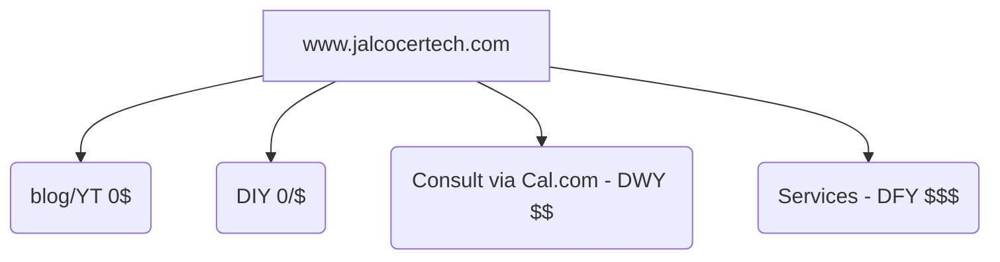

**TL;DR**

I have launched recently a quick ebook on web version and downloadable as PDF as well.

Also a simple waiting list.

But most importantly, is to have a happy real estate client:


    



**Intro** 

Ive been playing quite a lot with PB and quick astro themes lately.

I could not waste the opportunity to make some **tech upgrades** for a friend.

Specially since I could get Strapi and PayloadCMS working within containers:


  
  



There are tons of CMS. 

Some of them I have [pending to try](https://jalcocert.github.io/JAlcocerT/mailerlite-for-saas/#conclusions).


  
  



But...to get one working is not that easy.



As everything can be code, included an ebook...

```sh
#ssh
git clone https://github.com/JAlcocerT/obfuscate #git pull
cd obfuscate && make up-external #make build #make restart
#sudo docker network ls
#docker network connect cloudflared_tunnel book-publisher-api
```

> Go to https://one.dash.cloudflare.com/ and add `book-publisher-api:8002` which is `http://192.168.1.2:8002/api/book` and can be mapped to the subdomain `https://diy.jalcocertech.com/`

There will be more like these coming soon, like on VPS/HomeLabs.

Probably driven by a 1 FastAPI : n ebooks model, with pocketbase and/or stipe integration.




  


Because in the end having a website is a matter of: 

1. How much you really need it? - Aka, will you earn money>costs with it?
2. Knowledge - Do you know how to make one? if now, can you learn how to do it quick?
3. Ultimately, how much are you willing to pay for it? Or better said, how much you asses your $/h rate compared to others?

> Plot twist, if you claim to earn a lot of money and also claim to have clients, you wont mind to pay interesting $/h rates to others to build it for you. Would you?

> > Yea, I liked the [DIY vs DWY vs DFY](#outro) model :)

## The Stack

After starting more than one year ago with this repository as a concept.


  
  





Most of the times, you will just need a quick waiting list to validate an idea.

Like these:

1. https://github.com/Soufianeelc/nextjs-waitlist-page

> MIT |  An open-source next.js [waitlist landing page](https://nextjs-waitlist-page.vercel.app/) with EmailOctopus API 📩 

2. https://github.com/basehub-ai/nextjs-waitlist

> They are [very cool](https://nextjs-waitlist.basehub.com/)

But these projects, despite been open, require some API to work, like resend.

And if you are OK to potentially get some random emails, you can use this DIY one: *it pushes the emails to a csv that you can play with later on with listmonk, mailerlite, or whatever tool*

```sh
#ssh
git clone https://github.com/JAlcocerT/simple-waiting-list #git pull
cd simple-waiting-list && make up-external #make build #make restart
#sudo docker network ls
```

Vibe coding power: 

```
Create a simple waiting list based on nextjs and a cool and modern UI, including a dockerfile and docker-compose.yml that will control the title, description, and other variables via environment variables and will save the email leads to a JSON.

When a user is added it will say "Thank you for your interest" and will redirect to the landing page.
If a user email is already added, it will say we already have your email.
```

Testing something new, I will use [CapJS to add a CAPTCHA](https://jalcocert.github.io/JAlcocerT/encryption-101/#pow-captcha) to the waiting list.

Just to avoid some unnecesary *crap and trols*.


  


Email wont be validated though.

But no APIs required: Just the CapJS container, login to the dashboard and get `CAP_SITE_KEY` and `CAP_SECRET_KEY`.

```sh
git init
git branch -m main
git config user.name
git config --global user.name "JAlcocerT"
git config --global user.name
git add .
git commit -m "Initial commit: Starting simple waiting list"

#sudo apt install gh
gh auth login
gh repo create simple-waiting-list --private --source=. --remote=origin --push
    
#git init && git add . && git commit -m "Initial commit: Starting simple waiting list" && gh repo create simple-waiting-list --private --source=. --remote=origin --push
```


You can see how many valid attempts have been from the CapJS dashboard.


Could this be a good enough proxy of people entering the app? :)

```sh
make help
# Available commands:
#   make dev                - Run development server
#   make container          - Run in Docker container
#   make view-leads         - View all leads from leads.json
#   make export-csv         - Export leads to CSV
```




### New Theme

Its a combination of:


  
  


With:


  
  



1. Simplifcation of the Astro Payroll Theme, that I forked [here](https://github.com/JAlcocerT/payroll-workers-pb)


2. The gallery look and feel from the [previous version source code](https://github.com/JAlcocerT/real-estate-moi/tree/main/moirealestate-astro-theme) at `./real-estate-moi/ScrewFastMoiRealEstate`. Commented [here](https://jalcocert.github.io/JAlcocerT/making-flask-cms-for-ssg/#real-estate), as I tried to combined [FlaskCMS](https://github.com/JAlcocerT/real-estate-moi/tree/main/moirealestate-flaskcms) x the Astro theme.


```sh
git clone https://github.com/JAlcocerT/real-estate-moi
cd moirealestate-astro-theme

#npm run dev -- --host 0.0.0.0 --port 4321
#sudo docker-compose up -d astro-dev
```



  
  


I just followed this steps to initiate the repo programatically and push it with `gh`: <https://github.com/JAlcocerT/moi-realestate-pb>

```sh
git init
git branch -m main
git config user.name
git config --global user.name "JAlcocerT"
git add .
git commit -m "Initial commit"
```

```sh
#sudo apt install gh
gh auth login
gh repo create moi-realestate-pb --private --source=. --remote=origin --push
```

I brought the repos as submodules 101, for the first time ever:

```sh
git status
git submodule status
git remote -v
```

So to use this in the future

```sh
git clone --recurse-submodules https://github.com/JAlcocerT/moi-realestate-pb.git
# or, after a normal clone:
#git submodule update --init --recursive
```

Now here we have the old working screw fast with photo gallery: `./moi-realestate-pb/submodules/real-estate-moi/ScrewFastMoiRealEstate`

You just need to run it and go to `http://localhost:4321/property/`


  


So...how is this going to **actually work**?

### Validate the Website



 









---

## Conclusions

See the difference with a cool *(but no so fast)* website.

Im sure that this website works, because their service is great.


But if people dont know you or you are starting a brand: *you better make it easy for people to like you.*

Anyways, building a brand is not easy.

But if you have one, it should not be a problem to start your consultation services.


  


As I see it now:



Oh, and the blog will writings will be continued on 2026 into `blog.jalcocertech.com`

This will be kept as a full tinkering.

On the blog will be more curated and on the official `www` site the success stories.

And bc as if we are out of sight, we are out of mind we have to [make our services known](#making-website-services-known) somehow.

Including the dirty [ads](#ads).

### Outro

Buying a house is a big decision.

Specially with these salaries and prices:~250k a flat vs 25k/y household income


* https://www.viviendasylocalesgranada.com/ficha/piso/granada/zaidin/4348/27213492/es/
* https://www.ine.es/ADRH/?config=config_ADRH_2023.json&showLayers=ADRH_2023_Renta_media_por_hogar_cache&level=5

When you are trying to do business with people with interesting amount of assets, they tend to measure the value of your offer in **$ per hour** that you will save them.

Think that some business owner can have huge ARR plus [stocks providing dividends](https://jalcocert.github.io/JAlcocerT/stonks/#eda-on-yfinance).

Just Remember that your solution should give them more (>>>) than their PassiveIncome ($)/ 1700 h in a year

From the doing side, some who trade time for money with a good tech job, will not go lower than 100k$/1700h ~$60/h.

So hopefully, the matching is between a person with business who needs something to earn more, on the scale of >300k ARR that can afford to spend those >60$/h = 10k$/month/person *(a ~3% of their ARR)* on tech expertise to make their business better.

#### Get customers via Ads

If you have something to offer but no clients, you better have a good website and a good [ad campaign](https://jalcocert.github.io/JAlcocerT/wedding-photo-galleries/#the-ads).

As you can imagine, a business its a constant fight between supply and demand.

Have something to supply, rise demand, then rise again your ability to supply by getting efficient etc.


#### Get customers via a sales pipeline

Lets say, for example, with [Apify](https://jalcocert.github.io/JAlcocerT/apify/) which is one of the very [interesting APIs available](https://jalcocert.github.io/JAlcocerT/interesting-apis/) nowadays.

Your journey with lead generation can start here: https://apify.com/store/categories/lead-generation

### Copy Paste Plugins for Webs

If what you need are leads, look no further than Apify. As I covered [here](https://jalcocert.github.io/JAlcocerT/apify/).

But your business might need some automation: which [n8n](#n8n) can do

Or some email subscriptions: which [MailerLite](#mailerlite) can do

#### N8N

With the right knowledge, you can **use n8n to do all the automations** you need and avoid paying similar software or doing the work manually.



Build n8n workflows: https://n8nworkflows.xyz/?price=free


  


Just...try things.


  


Because most of the software around, like n8n and wordpress are free to use.

Master a thing and help others!

That level of focus is what platforms like elestio achieve: https://elest.io/open-source/n8n

#### MailerLite

If you have an audience and are interested to bring email subscriptions to your website, MailerLite is a good option.



You will need to authenticate that you own the email and also the domain (with DNS).

Go to your [mailerlite dashboard UI](https://dashboard.mailerlite.com)

I am using Cloudflare for that domain, and the DNS were updated automatically via UI.

There are some **CName and txt records** and they will be **DNS only**, not proxied.


**Create a new form** and you will get the JS to place before the `</head>` of your web.

```js
<!-- MailerLite Universal -->
<script>
    (function(w,d,e,u,f,l,n){w[f]=w[f]||function(){(w[f].q=w[f].q||[])
    .push(arguments);},l=d.createElement(e),l.async=1,l.src=u,
    n=d.getElementsByTagName(e)[0],n.parentNode.insertBefore(l,n);})
    (window,document,'script','https://assets.mailerlite.com/js/universal.js','ml');
    ml('account', 'some_acount_id');
</script>
<!-- End MailerLite Universal -->
```

> You can also get **MailerLite working with a button**, so that it opens as pop up:

```html
<a class="ml-onclick-form" href="javascript:void(0)" onclick="ml('show', 'some_id_here', true)">Click here to show form</a>

and use it with your components, for example
<form id="simple-newsletter-form" class="input-container" method="post" action="javascript:void(0);" onsubmit="ml('show', 'some_id_here', true); return false;">
    <input type="submit" value="Ready to Know?" class="ml-onclick-form" style="appearance: button; -webkit-appearance: button; cursor: pointer;">
</form>
```



### Making Website Services Known

I was recently having a walk and saw several designers advertising their services on the street. 

With the typical "I can design your website" printed with a cool logo.


> Creating these and print them should not be a problem as you can master the power of [PDFs /reports / infographics](https://jalcocert.github.io/JAlcocerT/things-as-a-code/#reports-as-a-code) and QR codes as a code.

The prices? They were mentioned at ~1500$.

With a waiting time from 3 days to 4 weeks: *I guess it depends on how their backlog / [sales pipeline](https://jalcocert.github.io/JAlcocerT/apify/) goes*

1. https://websitebastler.at/preise/
2. https://bscwebdesign.at/en/services/
3. Others dont put prices though: https://hastastudio.com/projekty/kaze-habitat/

Wow, 1500/(8*3) = ~65$/h that we mentioned before.

Kaboommmm 🤯

In other european countries, what I see more and more is that behind every website, there is some kind of gov funding: https://organizate.info/

They have a ~2008 design vibe though, see an [example](https://www.zierzoware.com/)

### How to Deploy Strapi - Headless CMS


<!-- https://jamstack.org/headless-cms/

https://github.com/mooxl/astroad/tree/main
 -->

Headless CMS based on nodejs

<https://www.youtube.com/watch?v=HsojvBVk6JQ>

<https://www.youtube.com/watch?v=kJ4c9U5JStU>


Consume the API from any client (React, Vue, Angular), mobile apps or even IoT devices, using REST or
GraphQL.


#### F/OSS CMS

Directus: Directus is an open-source headless CMS that offers real-time data synchronization and versioning.

It provides a database-agnostic API and a user-friendly admin interface. And it can also handdle authentication

* https://github.com/directus/directus

> Headless Data Platform

Cockpit: Cockpit is a lightweight, self-hosted, and open-source CMS. It's designed for developers and offers an API-first approach with flexible content types and fields.

* Strapi: As mentioned earlier, Strapi is a popular open-source headless CMS that allows you to create, manage, and expose content via RESTful APIs or GraphQL.

ButterCMS: ButterCMS provides a headless content management system with a RESTful API. It's designed for developers and integrates easily with various tech stacks.

Tipe: Tipe is an open-source headless CMS with a focus on simplicity and developer-friendliness. It offers a visual editor for content and GraphQL API support.