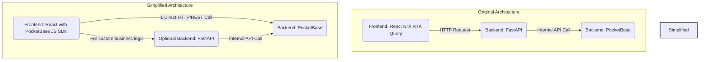

**TL;DR** 

I finally got to try [PB](#pocketbase). 

It can be used as auth for your [Flask Web Apps](#pocketbase-x-flask) and also be connected via [JS SDK to FE](#pb-sdk).

Along the way, I got to know few [new concepts](#concepts), like: Redux, Dexie...

**Intro** *This is way far from my confort zone, yet here we go*

Despite not been able to code in Go, I really admire few projects already that use Go.

[HUGO](https://jalcocert.github.io/JAlcocerT/using-hugo-as-website/) was the first for me.

Then I had a look to [Gotify](https://jalcocert.github.io/JAlcocerT/wedding-photo-galleries/#gotify)

And now is time to Pocketbase, also written in Go.

1. What it is [PB](#pocketbase)?

2. Using PB with Flask - *Some day PB + Stripe*

3. Understanding PB Collections, overpowered SQLite? - https://pocketbase.io/docs/working-with-relations/

> A very cool selfcontained row based DB

4. PB gives you an [API endpoint](#pb-api) out of the box for your BE logic
5. The [PB JS SDK](#pb-sdk)

<!-- https://www.youtube.com/watch?v=Hw797S85yQE -->



## PocketBase

PocketBase is a single, **self-contained Go application** that bundles several key components into one executable file:

* **An embedded SQLite database:** This is the core storage engine. So yes, it does contain a database.
* **A RESTful API:** This provides an interface to interact with the data in the database.
* **An authentication system:** It handles user sign-up, login, and authorization.
* **A web-based admin UI:** This allows you to manage your [collections](https://pocketbase.io/docs/collections/), data, and users without writing any code.
* **Real-time subscriptions:** It enables your frontend to listen for live data changes.

Because it provides all of these features out-of-the-box, it's designed to be a full backend for applications, allowing you to build a project without having to set up a separate database server, API, and authentication system.

* https://pocketbase.io/
    * https://pocketbase.io/docs/
    * https://github.com/pocketbase/pocketbase

> **MIT** | Open Source realtime backend in 1 file 

**PocketBase** is an open-source, all-in-one backend for web and mobile applications. It's written in Go, and it's designed to be a single, self-hosted file that provides a complete backend solution out-of-the-box.

Its features include:

* **An embedded database (SQLite)**: It comes with its own database, so there's no need to set one up separately.
* **Real-time database**: It supports real-time subscriptions, allowing clients to get live updates.
* **Authentication and user management**: It handles user sign-ups, logins, and OAuth providers (like Google, GitHub, etc.) automatically.
* **File storage**: It includes functionality for uploading and managing files - *So you can store images there, instead into minIO/s3.*
* **A convenient admin dashboard**: You get a graphical interface to manage your data, users, and settings without writing any code.

> While PocketBase **includes** a database, it's more accurate to call it a **backend-as-a-service (BaaS)** or a "realtime backend" rather than *just a database*. 

> > You can also try with the **pocketbase demo instance**: https://pocketbase.io/demo/

### PB 101

In simple terms: [PB can be selfhosted](https://github.com/JAlcocerT/Home-Lab/tree/main/pocketbase).

It does not offer a paid hosted service like Supabase.

Its better for read than for writes and its [data model and collections](#programatic-pb-interaction) are very useful.

**Selfhosting PB**

Spin Pocketbase into your PC building a Go container with the project:


  
  



* https://github.com/pocketbase/pocketbase/discussions/3279 -  Self host with Docker and Docker Compose #3279 

```sh
git clone https://github.com/JAlcocerT/Docker/
cd ./Dev/BaaS/PB
docker compose -f PB_docker-compose.yml up -d
```

```sh
curl -s http://localhost:8080/api/health || echo "PocketBase not accessible"
#curl -s http://localhost:9000/api/health || echo "PocketBase not accessible"
```


> You can use PB admin UI via the default: http://localhost:8080/_/

> > And log in as per your `.env` credentials if you provided any, or just created an account


**What you need to know about PB**

PB uses sqlite as its DB!

1. You have a `pb_data/data.db` that you can inspect with a client:

```sh
 sqlite3 ./data.db
#SQLite version 3.37.2 2022-01-06 13:25:41
#Enter ".help" for usage hints.
sqlite> .tables
# _authOrigins           _params                knowledge_source_tags
# _collections           _superusers            knowledge_sources    
# _externalAuths         agent_types            role_prompts         
# _mfas                  chat_model_info        users                
# _migrations            chat_models          
# _otps                  knowledge_source_info
# sqlite> 
```

> You could also use the [DBCode](https://dbcode.io/) extension, and if you like ipynb, check their [notebooks for DBs](https://dbcode.io/docs/notebooks/getting-started) and related `.dbcnb`

```sh
#Your database. Inside VS Code.
ext install DBCode.dbcode
```

>> [DBCode supports](https://dbcode.io/docs/supported-databases/bigquery) several [DBs](https://jalcocert.github.io/JAlcocerT/databases-101/), including [GCP BQ](https://jalcocert.github.io/JAlcocerT/understanding-google-cloud-platform/#big-query):


As per this awsome article: https://kerkour.com/sqlite-for-servers be aware that:

* pb is concurrent for reads (select and with SQL queries)
* nonconcurrent for writes/updates of data!!!

2. `./pb_hooks` and `./pb_migrations` folder are checked first whenever PB gets intialized (its configures any initial collections for example)


#### About PB_Hooks

What `./pb_hooks/` does: Holds PocketBase server-side hook scripts. PocketBase auto-loads any `*.pb.js` files here and executes them to customize backend behavior.

When they run:

* On server start/bootstrapping.
* On specific collection events if you register handlers (before/after create, update, delete, auth, etc.).

Common use cases:

* App-wide configuration at startup (e.g., storage, SMTP, auth providers).
* Data validation and defaulting before/after record writes.
* Side effects like webhooks, audit logs, denormalization.
* Access control beyond collection rules.

> In short, `pb_hooks/` lets you programmatically configure and extend PocketBase on the server, and this specific hook configures S3 file storage from environment variables.

#### About PB_Migrations

What pb_migrations/ does: Version-controlled schema for PocketBase. Each file defines a migration that creates/updates/deletes collections, fields, rules, and indexes.

Where: `./pocketbase/pb_migrations/`

How they look: Timestamped files like, `1754901820_some_user_settings.js`

```sh
date +%s #get current unix ts so that you can add it to new files
```

When/how applied:

* Applied on the PocketBase server (via CLI or your container entrypoint). They must run before the frontend SDK can use those collections/fields.
* You can run them during build/startup or manually with the PB CLI. 
  * In many setups, the Docker image executes migrations at startup.

Why important:

* Acts as the single source of truth for your PB schema.
* Safe to commit to VCS; supports rollbacks.
* Ensures environments (local, staging, prod) have the same collections, rules, and indexes.

### Programatic PB Interaction

Overview of Core Data Entities as per https://deepwiki.com/pocketbase/pocketbase/2.2-data-model

The **PocketBase data model** is built on three primary entities:

1. Collections - Schema definitions that describe the structure of data (similar to tables in traditional databases)
2. Records - Individual data entries stored within collections (similar to rows in a table)
3. Fields - The attributes or properties that define the structure of records (similar to columns)

You might need to create **collections in pocketbase**

And you can do so via the UI:


But you can interact with collections via scripts.

* https://deepwiki.com/pocketbase/pocketbase/9.2-collection-schema-management

I have made **few samples python scripts** next to the docker configs: https://github.com/JAlcocerT/Docker/tree/main/Dev/BaaS/PB

```sh
cd ./Dev/BaaS/PB
python3 create_user_settings.py
```

> Once executed, Validate within the UI that they are as you wanted it to be: `http://localhost:8080/_/#/collections`

You can also **export the existing collections** into json:


  
  




Via UI `http://localhost:9000/_/#/settings`,you can also export them, but this will be a .json, if you plan to use it at `pb_migrations`, make sure to convert it to `.js`



To make the code a little bit cleaner, we can have the **collection creator** to get the collection details **from a JSON with the details**, instead of hardcode them.


  
  


```sh
python3 create_json_collection.py user_settings
make create-specific COLLECTIONS="posts user_settings" #if some exist, it will skip it
```

And I also brought a way to list and delete collections:

```sh
make list-collections
make delete-collection COLLECTIONS="user_settings"
```

We can also export existing collections from the UI, or programatically: See [this md](https://github.com/JAlcocerT/Docker/blob/main/Dev/BaaS/PB/SCRIPT_USAGE.md#collection-export)


{}

There are two different formats:

📊 Format Comparison:
🔴 Full Format (what you just exported):

Raw PocketBase API format - exactly as stored in PocketBase
Contains IDs, timestamps, metadata
Relations use collectionId (like "_pb_users_auth_")
Not directly usable for recreation

🟢 Template Format (for 
create_json_collection.py
):
Clean, portable format - designed for recreation
No IDs or timestamps
Relations use collectionName (like "users")
Directly compatible with your JSON creation system

{}

> All that should get you started to **interact with PB via Python Scripts 🐍**

> > But dont forget that you can also get collections initialized into PB thanks to `./pb_migrations/*.js` 


### PocketBase x Flask

If you are vibecoding, you can get a quick sample [Flask](https://jalcocert.github.io/JAlcocerT/web-apps-with-flask/) Web App connected to Pocketbase as its BE.

Then, it can signup/in users and create posts:

```sh
#https://github.com/JAlcocerT/Docker/tree/main/Dev/BaaS/PB
cd ./Dev/BaaS/PB
uv run flask_pocketbase_app.py 
```


  



It creates a `posts` collection with these fields:

* title (text, required)
* content (editor, required)
* author (text, required)
* published (boolean, default: false)
* tags (select, optional)
* featured_image (file, optional)


If you create a post via adding a new record into the posts collection, it will be reflected in the Flask UI.

> It was all one prompt and Claude Sonnet 4 magic...

This can be a quick and local alternative to bring user authentication.

But, even if you ask for the email, it wont be validated.

Unlike [LogTo](https://jalcocert.github.io/JAlcocerT/testing-tinyauth/#logto-authentication) was doing for us properly and out-of-thebox:


For **LogTo References**, see these posts:


  
  



And these sample webapps with their code:


  
  


#### PocketBase x Stripe

People are building in public: https://www.reddit.com/r/pocketbase/comments/1cfnt5f/i_built_a_pocketbase_stripe_extension_and_open/

* https://github.com/mrwyndham/pocketbase-stripe
    * And seeling on top of it - https://www.fastpocket.dev/
* https://github.com/mrwyndham/pocketbase-mcp

>  MCP server for building PocketBase apps really quickly - Need a front end quick consider FastPocket 


### PB x Collections JS

I was wondering how to get specific **pb collections initialized** from the first moment.

I tried to do some py script that setup the collections I need.

But it seems that there is another way: via `./pb_migrations/*.json` files

* https://pocketbase.io/docs/js-migrations/
* https://deepwiki.com/pocketbase/pocketbase/7-migrations-system

```sh
#docker stop $(docker ps -a -q) #stop all
#docker kill $(docker ps -q)

#make up-local-setup
du -sh ./* | sort -h
```

```sh
#docker volume ls
docker volume prune -f
docker volume ls -f dangling=true
docker system df -v
#docker volume ls -q | grep -v '^portainer_data$'
#docker volume rm $(docker volume ls -q | grep -v '^portainer_data$')

#sudo docker prune
#docker system prune -a
#docker system prune -a --volumes
```

Adding a timestamp string to get trazability:

```sh
touch devops/pocketbase/pb_migrations/$(date +%s)_created_my_collection.js
```

If you **define those collections** with proper syntax, you will get them initialized from the get to when you run the PB container.

### PB API

**Does PocketBase provide REST API endpoints?**

**Yes, absolutely.** This is one of its core features. When you set up PocketBase and define your data "collections" (similar to database tables), it automatically generates a RESTful API for you. 

> You don't have to write any code for the basic CRUD (Create, Read, Update, Delete) operations.

For example, if you create a collection called `posts`, PocketBase will automatically provide endpoints like:
* `GET /api/collections/posts/records`: To get all posts.
* `POST /api/collections/posts/records`: To create a new post.
* `GET /api/collections/posts/records/{id}`: To get a specific post.
* `PUT /api/collections/posts/records/{id}`: To update a specific post.
* `DELETE /api/collections/posts/records/{id}`: To delete a specific post.


Comparing FastAPI and PocketBase highlights the difference between a flexible framework and a "batteries-included" backend solution.

**FastAPI vs. PocketBase**: A Clarification

The key difference lies in their fundamental nature:

* **FastAPI is a web framework.** Its purpose is to help you build an API from the ground up. You have complete control over every endpoint, the database you use, the authentication system, and all the business logic. You write the code for every action.

* **PocketBase is a Backend-as-a-Service (BaaS).** Its purpose is to give you a working backend instantly. It provides the endpoints for common tasks (CRUD, authentication, file uploads) for you. You configure the behavior and data models through its admin dashboard, and if you need custom logic, you can extend it with Go or JavaScript hooks.

Think of it like this:

| Aspect | FastAPI | PocketBase |
| :--- | :--- | :--- |
| **Control** | High. You write all the code. | Low for core features. High for custom extensions. |
| **Setup Time** | Slower. You need to configure everything (database, auth, etc.). | Very fast. It's a single file, and everything is included. |
| **Performance** | Excellent and highly customizable. Asynchronous by default. | Also excellent, as it's written in Go. Can be very fast for I/O-bound tasks. |
| **Language** | Python | Go (though you can use JavaScript to extend it). |
| **Scalability** | You are responsible for scaling your application (e.g., using a larger database, load balancers). | Vertically scalable (on a single server). Not designed for horizontal scaling across multiple servers. |

**In summary:** *What should you go for?*

* **Use PocketBase** if you want to build a project quickly and don't want to spend time on backend boilerplate. It's ideal for prototypes, small-to-medium sized applications, and projects where you want a complete, **self-hosted solution with minimal effort.**

* **Use FastAPI** if you need fine-grained control over your API, require specific business logic that a BaaS can't handle, or if your project needs to scale horizontally with complex, custom architectures. It's the right choice for building highly specific, performance-critical, and large-scale services.


### PB SDK

PocketBase provides a **JavaScript SDK**, and using it is the recommended way to connect your frontend to the PocketBase backend.

This SDK makes it much easier to interact with the auto-generated REST API and other features, so it's a huge step toward making your app "ready."

* https://github.com/pocketbase/js-sdk
  * https://www.npmjs.com/package/pocketbase

```sh
npm i pocketbase
```

> MIT | PocketBase JavaScript SDK

- PocketBase excels at: authentication, simple CRUD, schema validation, real-time subscriptions, admin UI, and serving configuration/user-profile style data.
- FastAPI excels at: business logic orchestration, multi-service integration, server-side validation/transforms, secure gateways, streaming/long-running tasks, and transactional operations against Postgres.


#### What the JavaScript SDK Does 🚀

The SDK is a library that handles all the low-level communication for you, saving you from writing manual `fetch` requests. 

It provides a clean, user-friendly interface for common tasks:

* **Authentication**: It simplifies user sign-up, login, and managing user sessions. Instead of manually handling tokens, you can use methods like `pb.collection('users').authWithPassword(...)`.
* **CRUD Operations**: It provides simple methods for interacting with your data collections. For example, to get a list of posts, you'd use `pb.collection('posts').getList(...)` instead of constructing a complex `GET` request.
* **Real-time Subscriptions**: This is one of the most powerful features. The SDK allows you to subscribe to a collection or a single record and receive real-time updates whenever data changes. This is perfect for building live chat apps, notifications, or dashboards without constantly polling the server.
* **File Uploads**: It streamlines the process of uploading files, which can be tricky to handle with raw `fetch` requests.
* **Persistence**: The SDK can automatically store and manage the user's authentication token, so the user stays logged in across sessions without you having to manually handle local storage.

### Why Use the SDK Instead of Raw REST Calls?

You could theoretically build your entire frontend by making raw `fetch` calls to PocketBase's REST API.

However, using the SDK is far more efficient and less error-prone.

Think of the SDK as a wrapper that handles the complexities of the API, allowing you to focus on your frontend UI and logic. 

It's like using a car's dashboard controls instead of manually adjusting the engine components.

### Is My App "Ready" with the SDK?

Connecting your frontend with the PocketBase JS SDK gets you very close to a functional app, but "ready" depends on your definition.

* **✅ Ready for core functionality**: Yes, you will have a working backend for authentication, data storage, and file management. The SDK makes it trivial to get and save data.
* **❌ Not for custom business logic**: The SDK is for client-side interactions. If you need custom server-side logic (e.g., sending an email after a record is created or performing complex data validations that can't be handled by PocketBase's "API rules"), you'd need to extend PocketBase using its Go or JavaScript "hooks."


The PocketBase JS SDK is a complete **solution for a client-driven app**. Which resonates with [SSGs](https://jalcocert.github.io/JAlcocerT/create-your-website/) for me...


> It is designed specifically for this purpose, making it easy to build a full-featured application by focusing almost exclusively on your frontend code.

#### Example 1

Given an app with such architecture:

┌─────────────────────┐

│ Frontend (React) │

│ - RTK Query │

│ - Components │

│ - State Management│

└─────────┬───────────┘

│ HTTP/REST

▼

┌─────────────────────┐

│ FastAPI Backend │

│ - Business Logic │

│ - Authentication │

│ - API Endpoints │

│ - Data Validation │

└─────────┬───────────┘

│ HTTP/REST

▼

┌─────────────────────┐

│ PocketBase │

│ - SQLite DB │

│ - Auto REST API │

│ - User Auth │

│ - File Storage │

└─────────────────────┘

Based on the architecture you described, the PocketBase JavaScript SDK wouldn't directly simplify the communication between your **FastAPI backend and the PocketBase database**. 

Your FastAPI backend is already handling that interaction. The purpose of the JS SDK is to connect a **client-side** application (like your React frontend) directly to the PocketBase backend.

The Problem with Your Current Architecture

Your current architecture, while perfectly functional, introduces an unnecessary layer for most simple data operations.

* **Frontend (React)**: Uses **RTK Query** to make API calls to...
* **Backend (FastAPI)**: This is your middleman. It receives the request, processes it, and then makes its **own** API call to...
* **PocketBase**: The final destination for the data.

This setup means for every simple data retrieval or update, the request goes through an extra hop, which can add latency and complexity.

**How the PocketBase JS SDK Would Simplify It**

The PocketBase JS SDK is designed to be used by the frontend to **bypass the middleman (FastAPI)** for operations that don't require complex server-side business logic.

A simplified and more common architecture with PocketBase would look like this:

* **Frontend (React)**:
    * Uses the **PocketBase JS SDK** for all standard CRUD operations, authentication, and real-time updates.
    * Makes direct API calls to PocketBase's auto-generated REST endpoints.
* **Backend (FastAPI)**:
    * This layer would be **optional**. It would only exist for specific, custom business logic that the frontend can't handle. For example, if you need to integrate with a third-party payment provider or run a complex data analysis that can't be done on the client.
* **PocketBase**: Serves as the primary backend for most of your application's data needs.

By using the SDK, your React app would directly interact with PocketBase, which handles all the boilerplate. RTK Query would still be valuable, but you'd configure it to call PocketBase's endpoints directly, or even better, use the SDK's built-in methods.


The PocketBase JS SDK is meant to **replace your FastAPI backend for standard API functionality**.



It makes the FastAPI layer largely redundant for tasks like fetching user data, creating posts, or managing file uploads, allowing you to build and prototype your app much faster.

> You would only add a custom backend with a framework like FastAPI if PocketBase's built-in functionality isn't sufficient for your specific needs.

### PB and Auth via SDK

---

## Conclusions


I also placed the **PB SelfHosted Setup,** here:

1. See that your PB is ready:

```sh
curl http://192.168.1.11:8080/api/health
```

2. Read users collection info: *which should be empty*

```sh
curl http://192.168.1.11:8080/api/collections/users/records
```

3. Create a new record into the users collection (via curl with auth)

```sh
source .env

# curl -X POST -H "Content-Type: application/json" -d '{
#     "email": "testuser@example.com",
#     "password": "my_secure_password",
#     "passwordConfirm": "my_secure_password"
# }' http://192.168.1.11:8080/api/collections/users/records

curl -X POST -H "Content-Type: application/json" -d '{
    "email": "'"${NEW_USER_EMAIL}"'",
    "password": "'"${NEW_USER_PASSWORD}"'",
    "passwordConfirm": "'"${NEW_USER_PASSWORD}"'"
}' "${POCKETBASE_URL}/api/collections/users/records"
```

The difference between a simple `curl` command and one with flags like `-X POST -H` is about specifying the details of an **HTTP request**.



This gets to the heart of how web applications and APIs communicate!

**`curl`** is a command-line tool that's used to transfer data from or to a server. When you run `curl http://example.com`, you're making a **simple HTTP GET request** by default.

This is the most basic type of request, used to retrieve data from a server, much like what your browser does when you visit a webpage.

**`curl -X POST -H ...`** is a more complex command that includes specific **flags** to define a more detailed request:

* **`-X POST`**: This flag explicitly sets the **HTTP method** to `POST`.
  * While `GET` is for fetching data, `POST` is for sending data to a server to create or update a resource.
  * Other common http methods include `PUT` and `DELETE`.
* **`-H`**: This flag allows you to set a specific **HTTP header**. Headers contain important metadata about the request, such as the data format (`Content-Type: application/json`), the authentication token (`Authorization: Bearer <token>`), or information about the client making the request. You can use `-H` multiple times to send different headers.
* **`-d`**: This flag (often used with `POST` or `PUT`) sends **data** in the body of the request, such as the JSON object you used to create a new user.

In summary, a simple `curl` command is a basic request to fetch information, while the one with flags is a targeted, detailed instruction to the server, specifying not just what you want, but *how* you want to interact with it.


**What are Bearer Tokens?**

Yes, those tokens you're using are indeed **Bearer tokens**. 

A Bearer token is a standard type of access token used for authentication and authorization in web APIs.

The name "bearer" simply means **"the bearer of this token is authorized."** It's like a concert ticket 🎫—the person holding the ticket is the one who gets to enter, regardless of who originally bought it.

Here's how they work:

1.  You first send a request with your credentials (like email and password) to an authentication endpoint.
2.  If the credentials are valid, the server generates and sends you a Bearer token.
3.  For all subsequent requests to protected endpoints, you include this token in the `Authorization` header of your HTTP request. The format is always `Authorization: Bearer <token>`.
4.  The server then validates the token. If it's valid, it grants you access to the requested resource without needing to know your username and password again.

That's an excellent way to think about it.

Yes, a bearer token is a temporary replacement for the user's credentials. 

It's a token that represents the authenticated identity, and it allows you to make subsequent API calls without repeatedly sending the username and password.

**Key Points of Bearer Tokens**

* **Replacement, Not Credential**: The token isn't a new password; it's a signed, temporary key. The server generates it after validating the initial credentials (username and password).
* **Single-Use vs. Multi-Use**: Unlike the original credentials, which you should use only for the initial authentication, a bearer token is designed to be used multiple times. You'll include it in the `Authorization` header of every API request to a protected endpoint until it expires.
* **Statelessness**: Once the server issues the token, it doesn't need to keep a record of it. The token itself contains the necessary information (often signed with a secret key) for the server to verify its authenticity and the user's identity. This makes APIs scalable because the server doesn't have to manage a list of active sessions.
* **Expiration**: Tokens have a limited lifespan. This is a crucial security feature. If a token is stolen, an attacker can only use it for a short period before it becomes invalid. After a token expires, you must re-authenticate with your original credentials to get a new one.

In essence, you can think of the user's credentials (email/password) as a **key** to an armored vault, and the bearer token as a **temporary access card** you get from the vault's security desk. 

You use the key once to get into the building, but you then use the access card for all the other doors inside. 



>  Bearer tokens represents the authenticated identity, and it allows you to make subsequent API calls without repeatedly sending the username and password.

They are popular because they are **stateless** (the server doesn't need to store session information) and can be easily managed by the client.

However, they should always be sent over a secure, encrypted connection (HTTPS) because anyone who intercepts the token can use it.


4. You can also **create new PB collections via curl** (with proper auth thanks to those bearers):

Get the bearer with the following CLI:

```sh
#source .env #to get PB admin email and the pwd!

TOKEN=$(curl -s -X POST "$PB/api/admins/auth-with-password" \
  -H 'content-type: application/json' \
  -d "{\"identity\":\"$ADMIN_EMAIL\",\"password\":\"$ADMIN_PASS\"}" | jq -r .token)


TOKEN=$(curl -s -X POST "$PB/api/admins/auth-with-password" \
  -H 'content-type: application/json' \
  -d "{\"identity\":\"$PB_ADMIN_EMAIL\",\"password\":\"$PB_ADMIN_PASS\"}" | jq -r .token)

echo "$TOKEN" #see that you got it
```


You need to provide the PB Super admin email and pass to get the bearer.


Create the n**ew sample events PB collection** via curl:

```sh
curl -s -X POST "$PB/api/collections" \
  -H "Authorization: Bearer $TOKEN" \
  -H 'content-type: application/json' \
  -d '{
    "name": "events",
    "type": "base",
    "listRule": "",
    "viewRule": "",
    "createRule": "",
    "updateRule": "",
    "deleteRule": "",
    "indexes": [
      "CREATE INDEX events_slug_type_created ON events (slug, type, created)",
      "CREATE INDEX events_path_created ON events (path, created)"
    ],
    "schema": [
      { "name": "type", "type": "text", "required": false, "presentable": true, "unique": false,
        "options": { "min": null, "max": 64, "pattern": "" } },
      { "name": "path", "type": "text", "required": false, "presentable": true, "unique": false,
        "options": { "min": null, "max": 512, "pattern": "" } },
      { "name": "slug", "type": "text", "required": false, "presentable": true, "unique": false,
        "options": { "min": null, "max": 256, "pattern": "" } },
      { "name": "referrer", "type": "text", "required": false, "presentable": true, "unique": false,
        "options": { "min": null, "max": 512, "pattern": "" } },
      { "name": "userAgent", "type": "text", "required": false, "presentable": true, "unique": false,
        "options": { "min": null, "max": 512, "pattern": "" } },
      { "name": "ipHash", "type": "text", "required": false, "presentable": false, "unique": false,
        "options": { "min": null, "max": 64, "pattern": "" } },
      { "name": "meta", "type": "json", "required": false, "presentable": false, "unique": false,
        "options": {} }
    ]
  }'
```

5. And the **creation of a record inside an existing collection** (users, the default PB collection):*using the bearer we got on (4)*

```sh
# curl -s -X POST "$PB/api/collections/users/records" \
#   -H "Authorization: Bearer $TOKEN" \
#   -H "Content-Type: application/json" \
#   -d '{
#     "username": "jalcocert",
#     "email": "jalcocert@whatever.com",
#     "emailVisibility": true,
#     "password": "somepass",
#     "passwordConfirm": "somepass",
#     "name": "jalcocert"
#   }'

SERVICE_EMAIL=service@example.com
SERVICE_PASS='a-strong-password'
PB='localhost:9000'

CREATE_RES=$(curl -s -X POST "$PB/api/collections/users/records" \
  -H "Authorization: Bearer $TOKEN" \
  -H 'content-type: application/json' \
  -d "{
    \"email\": \"$SERVICE_EMAIL\",
    \"password\": \"$SERVICE_PASS\",
    \"passwordConfirm\": \"$SERVICE_PASS\",
    \"emailVisibility\": false,
    \"name\": \"Service User\"
  }")
echo "$CREATE_RES"
SERVICE_ID=$(echo "$CREATE_RES" | jq -r .id)
```

**Other learnings**

I got to know along the way about: 

1. An interesting site to get familiar with project documentation: https://deepwiki.com/pocketbase/pocketbase

> Which provides info about many more libraries

2. Connect your backend to your client libraries and frameworks https://github.com/get-convex/convex-backend


### Concepts


**Some new concepts**


1. **Concurrency** = Multiple Things Happening at the Same Time
Concurrency means multiple operations or processes running simultaneously and potentially accessing the same resources.

2. **Race Condition** = When Concurrency Goes Wrong
A race condition is a specific problem that occurs in concurrent systems when:

Multiple processes access shared data simultaneously
The final result depends on the unpredictable timing of these accesses
This leads to inconsistent or corrupted data

3. **Redux**, [browser storage technologies](#local-vs-session-storage), [IndexDB](#indexdb), RTK...

### Redux

Redux is a predictable **state management library** for JavaScript applications.

It helps you manage the state of your application in a single, centralized store, making it easier to understand how and when the state changes. 

> While it's most commonly used with React, it can be used with any other UI library. 

Redux is not a local data storage solution like localStorage or sessionStorage. It's a state management library for your application's memory.



**Core Principles**

Redux operates on three fundamental principles:

1.  **Single source of truth**: The state of your entire application is stored in a single object tree within a single store. This makes it easier to debug and test your application, as all state is in one place.

2.  **State is read-only**: The only way to change the state is by dispatching an **action**. An action is a plain JavaScript object that describes what happened. For example, `{ type: 'ADD_TODO', text: 'Learn Redux' }`. This ensures that views can't directly modify the state, preventing unpredictable behavior.

3.  **Changes are made with pure functions**: To specify how the state tree is transformed by actions, you write **reducers**. Reducers are pure functions that take the current state and an action as arguments, and return a new state. They must not mutate the original state or perform any side effects like API calls.

---

**How it Works**

The data flow in a Redux application follows a strict, one-way cycle:

1.  **View**: The user interacts with the application's UI, which dispatches an action.
2.  **Action**: An action object is dispatched to the store.
3.  **Reducer**: The store passes the action and the current state to the reducer. The reducer calculates and returns a new state.
4.  **Store**: The store updates its state with the new state from the reducer.
5.  **View**: The store notifies the view of the state change, and the view re-renders itself to reflect the new state.

This unidirectional data flow makes it easy to trace the source of any state change, which is a major benefit for debugging and maintenance. 







No, Redux is **not** a local data storage solution like `localStorage` or `sessionStorage`. It's a **state management library** for your application's memory.

**What Redux Does**

Redux holds your application's state in a single, centralized object called the **store**. 

This store exists only while your application is running in the browser's memory. When you refresh the page or close the tab, the Redux store and all its data are cleared.

---

**What Local Storage Does**

Local storage, on the other hand, is a browser feature that allows you to store key-value pairs of data persistently.

This data is saved on the user's computer and remains even after the browser is closed.

This makes it suitable for things like user preferences, authentication tokens, or cached data that you want to persist between sessions.

---

**Key Differences**

* **Persistence**: Redux data is temporary and lost on page refresh. Local storage data is persistent and remains until explicitly cleared.
* **Purpose**: Redux is for managing the dynamic state of an application (e.g., UI state, fetched data). Local storage is for saving persistent data across browser sessions.
* **Access**: Redux state is managed through a strict, predictable flow of actions and reducers. Local storage data is accessed directly through a simple API (`localStorage.getItem()`, `localStorage.setItem()`).



While you can use Redux and local storage together (e.g., to save your Redux state to local storage to persist it), they serve different purposes.

Redux manages the active state of your application, while local storage provides a way to save data on the user's device for long-term use.


### Local vs Session Storage

If you go to the inspect section of a website and you go the `application` part of it...

Under storage, you will see 2 options: locan and session storage:


> These 2 are **browser storage technologies!**




**1. localStorage**

**What it is**: Persistent key-value storage that survives browser restarts
**Storage Limit**: ~5-10MB per origin
**Scope**: Per origin (protocol + domain + port), shared across all tabs

**Pros:**
- ✅ **Persistent** - Data survives browser restart
- ✅ **Simple API** - Easy to use key-value interface
- ✅ **Synchronous** - No async/await needed
- ✅ **Cross-tab sharing** - All tabs see the same data
- ✅ **Wide browser support** - Available everywhere

**Cons:**
- ❌ **Limited storage** - Only 5-10MB
- ❌ **String-only** - Must JSON.stringify/parse objects
- ❌ **Blocking** - Synchronous operations can freeze UI
- ❌ **No transactions** - Race conditions possible
- ❌ **No indexing** - Linear search only

**2. sessionStorage**
**What it is**: Temporary key-value storage that dies when tab closes
**Storage Limit**: ~5-10MB per origin
**Scope**: Per tab/window only

**Pros:**
- ✅ **Tab-isolated** - Each tab has independent storage
- ✅ **Simple API** - Same as localStorage
- ✅ **Automatic cleanup** - Cleared when tab closes
- ✅ **Synchronous** - No async/await needed

**Cons:**
- ❌ **Temporary** - Lost when tab closes
- ❌ **Tab-isolated** - Can't share data between tabs
- ❌ **Limited storage** - Only 5-10MB
- ❌ **String-only** - Must JSON.stringify/parse objects
- ❌ **No transactions** - Race conditions possible




### RTK

RTK Query acts as an **abstraction layer** over browser storage.

### IndexDB

IndexedDB is the standard, low-level database API built into all modern web browsers.

It's designed for **client-side storage** of large amounts of structured data, including files and blobs.

Think of it as a NoSQL database that runs directly in the browser.

However, the native IndexedDB API is notoriously complex, verbose, and difficult to work with.

It's asynchronous and uses a callback-based system, which can lead to a lot of boilerplate code, even for simple operations.


**What it is**: Browser's built-in NoSQL database with transactions
**Storage Limit**: ~50MB+ (varies by browser)
**Scope**: Per origin, shared across tabs

**Pros:**
- ✅ **Large storage** - 50MB+ capacity
- ✅ **Object storage** - Can store complex objects directly
- ✅ **Transactions** - ACID properties for data integrity
- ✅ **Indexing** - Fast queries with indexes
- ✅ **Asynchronous** - Non-blocking operations
- ✅ **Persistent** - Survives browser restart

**Cons:**
- ❌ **Complex API** - Difficult to use directly
- ❌ **Asynchronous** - Requires Promise/callback handling
- ❌ **Browser variations** - Inconsistent implementations
- ❌ **No SQL** - NoSQL query limitations
- ❌ **Debugging difficulty** - Hard to inspect data


#### Dexie

* https://dexie.org/

Dexie.js is a powerful JavaScript library that acts as a **wrapper for IndexedDB**. 

What Dexie.js Does: **Dexie simplifies working with IndexedDB** by providing a much more intuitive, elegant, and developer-friendly API.

> It's like how jQuery simplified DOM manipulation or how a framework simplifies building a web application.

With Dexie, you can:

* **Use a Promise-based API:** This makes asynchronous operations much easier to handle with `async/await`.
* **Define a database schema:** You can easily define your "tables" (called object stores in IndexedDB) and indexes.
* **Perform powerful queries:** Dexie provides a simple, SQL-like syntax for querying your data.
* **Manage transactions:** It simplifies the complex transaction model of IndexedDB.
* **Handle database migrations:** It provides a clear way to update your database schema when your application evolves.
* **Get real-time updates:** Dexie supports "live queries" that can automatically update your UI when the data in the database changes.

**How it Relates to Redux and Local Storage**

Dexie, Redux, and local storage all deal with data, but they serve different and often complementary purposes:

| Feature           | **Redux** | **Local Storage** | **Dexie.js (and IndexedDB)** |
| ----------------- | ---------------------------------------- | ------------------------------------------------- | -------------------------------------------------- |
| **Purpose** | In-memory application state management   | Simple, persistent key-value storage              | Persistent, structured database storage            |
| **Data Flow** | Unidirectional, predictable (actions)    | Direct, synchronous API (get/set)                 | Asynchronous, promise-based (CRUD operations)      |
| **Persistence** | Temporary (lost on page refresh)         | Permanent (persists across sessions)              | Permanent (persists across sessions)               |
| **Data Size** | Best for small-to-medium UI state        | Small (typically a few megabytes)                 | Large (hundreds of megabytes or more)              |
| **Data Structure**| Any JavaScript object                    | Strings only (objects must be serialized)         | Any structured data, including blobs and files     |
| **Querying** | No built-in querying, state is read directly | Only by key                                     | Powerful querying with indexes and filters         |


**The Interplay:**

* **Redux vs. Dexie/Local Storage:** Redux is for "application state" (e.g., whether a modal is open, the currently selected item, the current state of a form). 

Dexie and local storage are for "persistent data" (e.g., user profiles, a list of todos, cached API data). 

The two can work together.

For example, you could fetch data from a server and save it to a Dexie database for offline use, and then load a small, relevant subset of that data into your Redux store to manage the UI state.

* **Dexie vs. Local Storage:** Dexie is a much more powerful and scalable solution than local storage. Use local storage for simple, small pieces of data (like a user's theme preference). 

Use Dexie when you need to store large amounts of structured data, perform complex queries, or build an application that works offline.