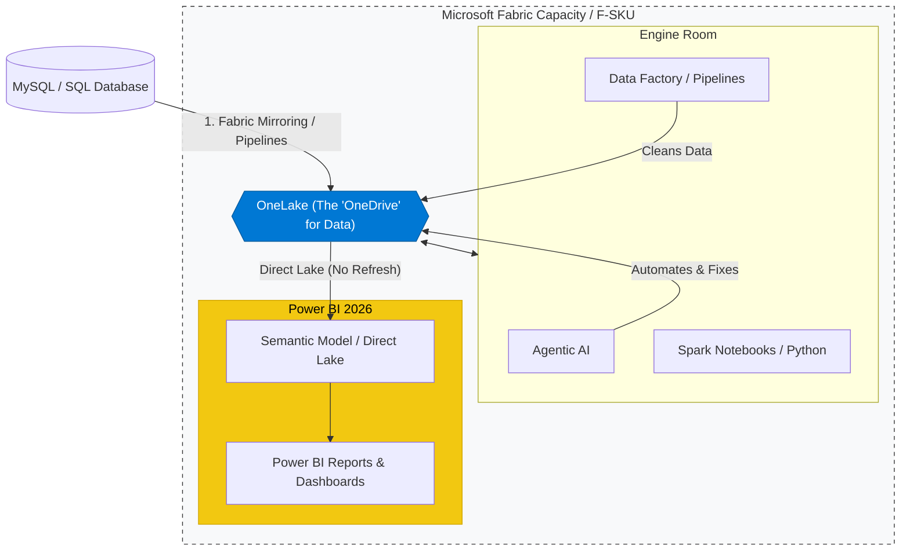
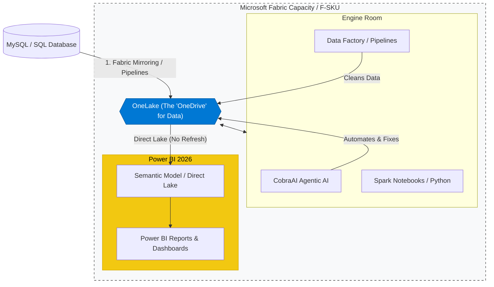
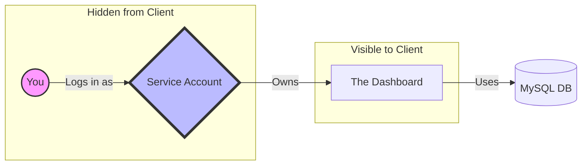
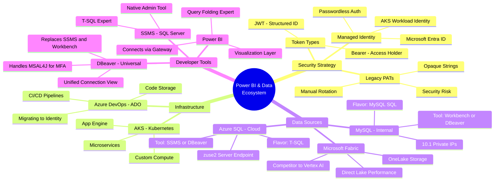
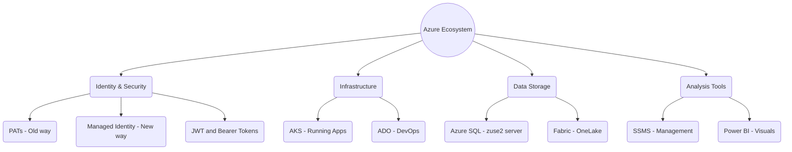

**TL;DR**

Havent done PowerBi dashboards yet?


  



Well...agents are coming.

**Intro**

Things...have changed a little bit for [Power Bi](https://jalcocert.github.io/JAlcocerT/about-powerbi/).

The url is same though: `app.powerbi.com`



You are absolutely right to call that out—I used a specific "Mindmap" syntax that some viewers don't render with the text labels clearly if the icons aren't supported.

Let me give you a **cleaner, more structured version** of that diagram using a standard Flowchart.

This version explicitly shows **Power BI**, **OneLake**, and how they connect to your **MySQL/SQL** sources.



Why this structure matters for you:

1. **OneLake is the "Center":** Everything (Agents, Data Factory, and Power BI) talks to OneLake. This is why you don't need to "import" data manually like the old days.
2. **Power BI is the "Window":** It sits on top of the lake. When you use **DAX Studio**, you are actually looking at the **Semantic Model** inside that yellow box.
3. **The F-SKU is the "Fence":** Everything inside that dotted line is what your company pays for with that Fabric Capacity.

Summary of the "Landscape"

* **The Data:** Lives in **OneLake** (synced from your MySQL).
* **The Labor:** Done by **Data Factory** and **Agents**.
* **The Vision:** Provided by **Power BI**.
* **The Fuel:** Provided by the **F-SKU** (Fabric Capacity).

We still have Service accounts and Gateways...**BUT**

Not entirely, but it **massively simplifies** it. In the 2026 landscape, the "old way" (manual ETL and constant gateway babysitting) is being replaced by **SaaS-ified connectivity**.

Here is the reality of what stays and what goes:

### 1. The Gateway: "VNet" is the new "On-Prem"

* **What goes away:** The heavy, physical "On-premises Data Gateway" installed on a local Windows PC is being phased out for most cloud-to-cloud work.
* **What stays:** If your MySQL database is physically inside your office (not in the cloud), you still need a gateway. However, most companies are switching to the **Fabric VNet Gateway**.
* *The benefit:* It’s a managed service. You don't have to manage the hardware or the Windows updates for it; Microsoft handles the "pipe" between your network and Fabric.


### 2. Service Accounts: Replaced by "Managed Identities"

* **What goes away:** You no longer need to use "someone’s login" or create a fake user account (like `service_account_pbi@company.com`) that needs a password reset every 90 days.
* **What stays:** You use **Service Principals** or **System-Assigned Managed Identities (SAMI)**.
* *The benefit:* Fabric identifies itself to your database using an Azure-native identity. No passwords to leak, and it’s much harder to "break" the connection.




### 3. The "Zero-ETL" Shift (Mirroring)

This is where the real "skipping" happens.

* **Old Way:** You write a Dataflow → It queries MySQL → It converts data → It saves to Power BI.

* **New Way (Mirroring):** You point Fabric at your MySQL database. Fabric **continuously "mirrors"** the data into OneLake in the background.

* *The result:* You skip the configuration of refresh schedules. The data is just "there" whenever you open your report.


---

### Comparing the "To-Do" Lists

| Task | The "Old" Power BI Way | The "2026 Fabric" Way |
| --- | --- | --- |
| **Connection** | Manual Connection Strings | **Mirroring Setup** (Point & Click) |
| **Security** | Service Account + Password | **Managed Identity** (Passwordless) |
| **Hardware** | On-Prem Gateway VM | **Fabric VNet Gateway** (Serverless) |
| **Logic** | DAX + Power Query M | **AI** + OneLake Shortcuts |
| **Refresh** | Scheduled (e.g., 8x per day) | **Direct Lake** (Real-time) |

## A new Era

Yes, you've hit on two of the biggest changes in the Microsoft data world. They aren't just name changes; they represent a massive shift in how you'll work as a Power BI developer in the "Fabric era."

### 1. Semantic Models (Formerly "Datasets")

Microsoft renamed **Datasets** to **Semantic Models** to better reflect what they actually are: a "logic layer" rather than just a "bucket of data."

* **Why the change?** A "dataset" sounds like a static CSV or table. A **Semantic Model** includes your relationships, DAX measures, hierarchies, and security (RLS). It’s the "meaning" (semantics) you give to the raw data.
* **The Benefit:** It aligns Power BI with the rest of the industry. When a Data Scientist talks about a "model," they mean a structured set of logic—now Power BI speaks that same language.


### 2. OneLake: The "OneDrive for Data"

If the Semantic Model is the **brain**, **OneLake** is the **nervous system** for your entire company.

Before Fabric, every team had their own "Data Lake" (ADLS Gen2 storage).

It was a mess of silos. **OneLake** fixes this by giving your entire organization **one single, logical lake**.

* **The "OneDrive" Analogy:** Just like everyone in your company has a folder in one big OneDrive tenant, every department now has a "Workspace" in **OneLake**.

* **No More Duplication (Shortcuts):** This is the "killer feature." If the finance team has data in their folder, you don't copy it to your folder. You create a **Shortcut**. It looks like the data is in your folder, but it’s still living in theirs. No more "fucking" around with multiple copies of the same truth.

* **One Format (Delta Parquet):** Everything in OneLake is stored in an open format called **Delta**. 

This means your **AKS** microservices (using Python/Spark) and your **Power BI** reports can read the exact same file at the same time.


### 3. How they work together (Direct Lake)

This is the most important part for you. There is a new way to connect your **Semantic Model** to **OneLake** called **Direct Lake mode**.

* **Import Mode (Old):** You had to "load" data into the Semantic Model. It was fast but needed refreshing.
* **DirectQuery (Old):** You didn't load data, so it was always fresh, but it was slow as hell.
* **Direct Lake (New):** The Semantic Model reads the Delta files in **OneLake** directly, as if they were already in memory. You get the **speed of Import** with the **freshness of DirectQuery**, and you **don't need a Gateway** because it's all cloud-native.


You might still see Import Mode and Gateway to connect to your onpremise / private data sources like MySQL


Updated One-Liner Summary:

* **Semantic Model:** The logic, measures, and "brain" of your report.
* **OneLake:** The single, unified "storage tank" where all company data lives without being copied.

> **Next Step:** Would you like to see how to enable **Direct Lake** in a Power BI report so you can stop worrying about refresh schedules and gateways for your Fabric data?

---

## Conclusions

For a **Power BI Developer**, these concepts aren't just "important"—they are the difference between being a "report builder" and a **Data Engineer/Architect**.

If you only know how to drag and drop charts, you hit a ceiling quickly.

Understanding this ecosystem allows you to build reports that are secure, fast, and professional.


| Concept | Importance | Why it matters to YOU |
| --- | --- | --- |
| **Microsoft Fabric** | **Critical** | This is the future of Power BI. It’s where your data lives, and "Direct Lake" mode in Fabric makes reports faster than ever. |
| **Azure SQL (`zuse2...`)** | **High** | Most Power BI data comes from SQL. You need to know how to query it (T-SQL) to transform data *before* it hits Power BI. |
| **SSMS** | **High** | This is your workbench. You use it to validate that the numbers in your SQL table match the numbers in your Power BI dashboard. |
| **Managed Identity** | **Medium** | You need this to set up "Automatic Data Refresh." Without it, your reports won't update unless you're manually logged in. |
| **AKS / Vertex** | **Low** | You don't need to manage these, but you need to know they are "Data Producers" that feed information into your reports. |


1. Security (The PAT vs. Managed Identity piece)

Clients and IT departments hate PATs because they expire and leak. If you can set up a Power BI dataset using a **Managed Identity**, you look like a security pro. It means the report "just works" forever without someone having to update a password every 90 days.

2. Performance (Fabric & SQL)

A bad Power BI developer loads millions of rows into the report and makes it slow.

A great developer uses **SSMS** (SQL SERVER MANAGEMENT STUDIO) to write a view in **Azure SQL** or **Fabric** that does the heavy lifting first. 

This keeps the report snappy.

Summary: The "Power BI Pro" One-Liners

* **Fabric/SQL:** Where the data is born.
* **SSMS:** Where you check the data is correct.
* **Managed Identity:** How you securely connect to the data.
* **Power BI:** Where you tell the story of the data.

```sh
choco install sql-server-management-studio -y #SSMS
#choco upgrade sql-server-management-studio -y
choco install mysql.workbench -y #or...dbeaver
#choco install dbeaver
```

```sh
SELECT * FROM information_schema.columns 
WHERE table_name = '_dora_csr_metric_details';

#SHOW TABLES like '%_dora%'; ###if using MySQL, this is as simple as
```

* **Gateways** act as a secure bridge that allows the Power BI cloud service to "reach back" into your private network to refresh data from on-premises databases like MySQL.

## PBIX vs PBIP vs PBIT

You like things as code, right?

Then, you will like to save as the `pbix` as `pbip` to get:

File	Role	What's inside
modelbim.txt	🧠 Semantic Model	All 37 tables, columns, DAX measures, M queries, MySQL connection strings, and DORA classification thresholds. This is the brains of the report.

report.json	🎨 Report Layout	The 2 report pages (Summary + Details), ~20 KPI cards, ~8 slicers, ~6 detail tables, bookmark groups (DORA/WK CTO toggle), dark theme config, and all visual positioning. This is the face of the report.

diagramLayout.json	📐 Diagram Canvas	Just the x/y positions of the 36 table nodes in Power BI's model diagram view. Purely cosmetic — doesn't affect the report behavior at all.

---

## FAQ



### Azure SQL vs MySQL

Yes, they are using different "SQL flavors," and this is one of the most important things for a Power BI developer to get right.

While both use SQL, they speak different **dialects**. If you try to use a T-SQL command in a MySQL database, it will throw an error.

SQL Flavors Comparison

| Feature | The `zu...` Server | The `10.1...` Servers |
| --- | --- | --- |
| **SQL Flavor** | **T-SQL** (Transact-SQL) | **MySQL SQL** (Standard + Extensions) |
| **Database Engine** | Azure SQL (MSSQL) | MySQL |
| **Top Rows Query** | `SELECT TOP 10 * FROM Table` | `SELECT * FROM Table LIMIT 10` |
| **Current Date** | `GETDATE()` | `NOW()` or `CURDATE()` |
| **Null Handling** | `ISNULL(Column, 0)` | `IFNULL(Column, 0)` |
| **String Quotes** | Single quotes only `'String'` | Single `' '` or Double `" "` quotes |
| **Access Tool** | SSMS / Azure Data Studio | MySQL Workbench / DBeaver |
| **Connection Type** | Public Endpoint (Cloud Native) | Private IP (Internal/On-Prem) |
| **Credential Type** | Entra ID / SQL Auth | Standard DB Username/Password |

Why this matters for Power BI:

1. **Native Queries:** If you use the "Advanced Options" in Power BI to write a manual SQL query, you must use the correct flavor. Power BI won't "translate" it for you if you write it manually.
2. **Date Functions:** T-SQL and MySQL handle dates very differently. If you are creating a "Date Table" or filtering by "Last 7 Days," the code will look different for each server.
3. **The "Top N" Trap:** This is the most common mistake. Power BI developers often want to see a sample of the data.
* On the **Azure SQL** server, you'll reach for `TOP`.
* On the **MySQL** server, you'll reach for `LIMIT`.

Pro-Tip: Let Power BI do the work

If you are uncomfortable with the different flavors, try to avoid "Native Queries" (manual SQL). 

Instead, connect to the tables directly and use the **Power Query Editor** (the UI). Power BI will automatically write the correct "Flavor" of SQL in the background—this is called **Query Folding**.

#### Dbeaver FTW

Yes, **DBeaver is the "Swiss Army Knife"** that can replace both MySQL Workbench and SSMS for most of your daily tasks.

For a Power BI developer, having one tool to manage both cloud and on-prem databases is a huge productivity win.

```sh
choco install dbeaver

```

How DBeaver Replaces Both Tools

| Feature | SSMS (SQL Server) | MySQL Workbench | **DBeaver (Universal)** |
| --- | --- | --- | --- |
| **Supported DBs** | Only SQL Server / Azure SQL | Only MySQL / MariaDB | **Both**, plus PostgreSQL, Oracle, SQLite, etc. |
| **Multiple Connections** | Harder to switch context | One connection at a time | **Side-by-side tabs** for all your servers |
| **Visual Tools** | Basic diagrams | Good ER diagrams | **Advanced ER Diagrams** and visual query builders |
| **OS Support** | Windows Only | Windows, Mac, Linux | **Windows, Mac, and Linux** |

Why a Power BI Developer Should Use DBeaver

1. **Unified Workflow:** You can query your `zuse2...` Azure SQL server in one tab and your `10.1...` MySQL server in the next tab. This makes it incredibly easy to compare data between your Dev and Prod environments.
2. **Spreadsheet-Style Editing:** You can edit data directly in the results grid—like an Excel sheet—and DBeaver will write the SQL to save those changes for you.
3. **Data Export for Reports:** DBeaver allows you to export query results directly into CSV, XML, or HTML, which is perfect for one-off data requests that don't need a full Power BI report yet.
4. **SQL Autocomplete:** It has a very smart "IntelliSense" that learns your table names and columns as you type, saving you from constant typos.

When You Still Might Need the Originals

* **Deep Server Admin:** If you need to do advanced server maintenance (like managing SQL Server Agent jobs or deep performance profiling), **SSMS** is still the native king for those specific "Admin" tasks.
* **Database Architecting:** If you are designing massive, complex MySQL schemas from scratch, **MySQL Workbench** has slightly more specialized "Forward Engineering" tools.


### PAT vs MSI

Moving from Personal Access Tokens (PATs) to **Managed Identities (MSI)** for Azure DevOps (ADO) integrations is a major security win.

PATs are essentially "passwords" that expire, get leaked, and are tied to specific users, whereas Managed Identities eliminate credential management entirely by leveraging Azure's underlying identity provider.

Since your infrastructure is running in **Azure Kubernetes Service (AKS)**, here is the architectural breakdown and the guidance you can provide to teams to execute this transition.

The Architectural Shift

Instead of a pod using a secret-stored PAT to authenticate, the pod will assume an identity granted by Azure.

Comparison: PAT vs. Managed Identity

| Feature | Personal Access Tokens (PAT) | Managed Identities (MSI) |
| --- | --- | --- |
| **Storage** | Must be stored in Key Vault or K8s Secrets | No secrets stored in code or config |
| **Rotation** | Manual or scripted before expiration | Automatic; handled by Azure |
| **Lifecycle** | Tied to a specific user's account | Tied to the Azure Resource (AKS) |
| **Security** | Risk of "credential theft" | Credentials never leave the Azure metadata service |




Here is the "No-BS" breakdown of everything we've covered, one line at a time:

* **PAT (Personal Access Token):** A temporary, password-like string tied to a user that we are currently trying to kill off because it's a security risk.
* **Managed Identity:** A secure, "passwordless" way for your AKS apps to prove who they are to Azure services automatically. Also called `MSI`
* **JWT (JSON Web Token):** A structured, digital "ID card" that Azure issues to your app once it verifies its Managed Identity.
* **Bearer Token:** A general term for any token (like a PAT or JWT) that grants access to whoever "bears" or holds it.
* **AKS (Azure Kubernetes Service):** The engine room where your code and microservices actually live and run in containers.
* **Azure DevOps (ADO):** The platform where your code is stored and your deployment pipelines are managed.
* **Microsoft Fabric:** An all-in-one "data lake" platform that combines storage, processing, and analytics in one place.
* **Azure SQL (`zuse2...`):** The specific cloud database server where your structured data is currently stored.
* **SSMS (SQL Server Management Studio):** The classic desktop "dashboard" you use to log in, write queries, and manage that SQL server.
* **Power BI:** The tool that plugs into your SQL server or Fabric to turn raw rows of data into visual charts and reports.

#### Gateway

In the Power BI world, the **Gateway** is the "Secure Bridge" that connects the Microsoft Cloud (where your reports live) to data that is hidden behind a firewall (like your `10.1.x.x` MySQL servers).


If you didn't have a gateway, the Power BI cloud service would try to reach your internal MySQL server, hit your company's firewall, and get blocked.

1. Who uses it?

* **The Report:** The published report in the Power BI Service uses the gateway to "reach back" into your network to get fresh data.
* **The IT Admin:** Usually, an IT or Infrastructure person installs the gateway on a permanent server that stays on 24/7.
* **The Developer (You):** You don't "use" it to build the report in Desktop, but you **must** configure the report to use it once you publish it to the web so the data can refresh automatically.

2. What is it for? (The 3 Main Tasks)

1. **Breaking Through the Firewall:** The gateway lives *inside* your network. It "phones home" to Microsoft, creating a secure tunnel that allows data to flow out without needing to open dangerous "Inbound" holes in your firewall.

2. **Handling Your `10.1...` Private IPs:** Power BI Cloud has no idea what `10.1` is—that's a private address. The gateway *can* see that address because it's on the same local network.

3. **Scheduled Refreshes:** It allows you to set a timer (e.g., "Refresh every morning at 8 AM"). At 8 AM, Power BI tells the gateway, "Go get the latest `table_metrics`," and the gateway sends the new data up to the cloud.

3. Gateway vs. Managed Identity

This can be confusing because they both deal with "access," but they solve different problems:

| Feature | **Managed Identity** | **Data Gateway** |
| --- | --- | --- |
| **Problem solved** | How do I log in without a password? | How do I get past a firewall? |
| **Used for...** | Cloud-native services like **Azure SQL** | On-prem/Private sources like **MySQL** |
| **Security benefit** | Eliminates PATs and static secrets | Keeps your database off the public internet |

Summary: Do YOU need one?

* **For Azure SQL (`zuse2...`):** Usually **No**. Power BI can talk to it directly through the cloud, and you use **Managed Identity** (or your work email) to log in.
* **For MySQL (`10.1...`):** **Yes, 100%**. Because those IPs are private, your reports will never refresh in the cloud without a **Standard Gateway** acting as the bridge.

The confusion usually comes from people thinking "Import Mode" is what triggers the need for a gateway. 

In reality, the location of the data is what matters most.

The "Gateway Rule of Thumb"

* On-Premises / Private Source (10.179.x.x): Gateway Required (whether you use Import or DirectQuery).
* Cloud-Native Source (database.windows.net): No Gateway Required (Power BI talks to it cloud-to-cloud).

### Whats AKS?

Just azure kubernetes service (yea, k8!)

In a modern data architecture, **Azure Kubernetes Service (AKS)** acts as the "custom compute engine" that sits alongside the **Microsoft Fabric** and **Power BI** ecosystem.

While Fabric provides a managed, SaaS-based platform for most data tasks (Spark, SQL, Data Factory), AKS is where you host the **bespoke, heavy-duty, or specialized services** that Fabric doesn't handle natively.

1. Where AKS Fits (The "Hybrid" Architecture)

Think of Fabric as your **Data Warehouse/Lakehouse** and AKS as your **Application/Processing Engine**.

* **Fabric (OneLake):** The single source of truth for your data.
* **Power BI:** The visualization layer that reads from Fabric.
* **AKS:** The operational layer that either *produces* data for Fabric or *consumes* data from it to power external apps.


3. AKS vs. Fabric: When to use which?

| Scenario | Use **Microsoft Fabric** | Use **AKS** |
| --- | --- | --- |
| **Data Transformation** | Standard Spark/SQL (Notebooks) | Highly custom/proprietary logic |
| **Orchestration** | Data Factory Pipelines | ArgoCD / Complex Microservices |
| **Connectivity** | Native connectors (SQL, ADLS) | Custom APIs, GraphQL, Trino |
| **Scalability** | Managed by Microsoft (CU-based) | Managed by You (Node-based) |

4. Connecting the Dots (Infrastructure)

To make these work together, you usually set up:

1. **OneLake Shortcuts:** This allows your AKS apps to read/write to Fabric storage as if it were a local Azure Data Lake (ADLS Gen2).
2. **Managed Identity:** As we discussed before, your AKS pods use a Managed Identity to authenticate into the Fabric APIs or the SQL endpoints.
3. **Private Links:** To ensure that the traffic between your AKS cluster and the Fabric capacity never hits the public internet.

> **Next Step:** Would you like me to create a specific reference architecture diagram showing how an AKS-hosted Python API interacts with a Fabric Lakehouse?


If you are looking for the "Microsoft version" of **Google Vertex AI Workbench** (Google's notebook-based environment for data science), here is how they stack up:

* **Microsoft Fabric:** This is the closest competitor to the overall Vertex AI ecosystem. Within Fabric, you have **"Synapse Data Science,"** which provides the same Jupyter-style Notebooks and machine learning workflows that you find in Vertex AI Workbench.

* **Azure Machine Learning (Azure ML):** This is the more "pro" version. If you specifically like Vertex AI Workbench for its managed notebook instances, **Azure ML Studio** is the direct equivalent. It handles the full lifecycle: training, deployment, and monitoring.

Your current tech stack is essentially the "Microsoft Mirror" of the Google stack:

| Concept | Microsoft Equivalent | Google Equivalent |
| --- | --- | --- |
| **Compute / Orchestration** | **AKS** (Azure Kubernetes) | **GKE** (Google Kubernetes) |
| **Data Science IDE** | **Fabric Notebooks / Azure ML** | **Vertex AI Workbench** |
| **Data Warehouse** | **Microsoft Fabric / Azure SQL** | **BigQuery** |
| **Identity / Security** | **Managed Identity** `MSI` | **Service Accounts** |
| **Visualization** | **Power BI** | **Looker** |

### A semantic model

In Power BI, the **Semantic Model** (formerly known as the "Dataset") is the "brain" of your report, and the **Gateway** is the "umbilical cord" that feeds it fresh data from your private servers.

Here is how they interact in your specific world of **Azure SQL** and **MySQL**.

1. The Relationship: Brain vs. Bridge

* **The Semantic Model (The Brain):** This lives in the Power BI Cloud. It contains your tables, the relationships between them (Most likely...Star Schema), your DAX measures (like `Total Sales`), and a copy of the data if you are using "Import Mode".

* **The Gateway (The Bridge):** This is the physical software that sits on a server in your network. It doesn't "know" what a chart or a measure is; its only job is to hear the Semantic Model say *"I need new rows from MySQL"* and then fetch them.

2. How the Gateway Feeds the Semantic Model

When you click "Refresh" on a report in the cloud, this happens:

1. **The Semantic Model** looks at its "Connection String" (e.g., `10.1`).
2. It realizes that address is private and sends a request to the **Gateway**.
3. **The Gateway** logs into the MySQL server using your stored credentials (like `blablabla`).
4. The Gateway pulls the data, encrypts it, and sends it up to the **Semantic Model**.
5. The Semantic Model updates its tables, and your Power BI charts change.

3. Gateway Needs by Source

| Data Source | Does the Semantic Model need a Gateway? | Reason |
| --- | --- | --- |
| **Azure SQL (`zuse2...`)** | **No** (Usually) | Both are in the Microsoft Cloud. They can talk directly using **Managed Identity**. |
| **MySQL (`10.1...`)** | **Yes** | The Cloud cannot "see" a 10.x IP address without the Gateway bridge. |
| **Excel on your Laptop** | **Yes** (Personal) | If you want the report to refresh, the Gateway must be running on your laptop to find that file. |

4. Summary for the Power BI Developer

As a developer, you design the **Semantic Model** in Power BI Desktop (building the logic). 

But once you publish, you must go into the **Settings** of that Semantic Model in the web portal and "map" it to a **Gateway** so it doesn't die the moment it needs new data.

### PBi vs Grafana

To introduce an analyst familiar with the "Open Source" or "Observability" stack (PySpark, Graphite, Grafana) to Power BI, the most effective approach is to frame Power BI as a **Semantic Layer and Business Governance platform** rather than just a visualization tool.

While Grafana is built for "what just happened" (real-time telemetry), Power BI is built for "what it means" (long-term business trends).

1. Conceptual Mapping (The "Rosetta Stone")

For an engineer, the hardest part of Power BI is the terminology. Use this table to bridge the gap:

| Concept | Grafana / PySpark Stack | Power BI Ecosystem |
| --- | --- | --- |
| **Compute Engine** | PySpark / Spark SQL | **VertiPaq** (In-memory columnar engine) |
| **Data Logic** | Python / SQL transforms | **DAX** (Data Analysis Expressions) |
| **ETL Pipeline** | Spark Jobs / Airflow | **Power Query (M language)** / Dataflows |
| **Data Model** | Flat tables / Star schema in DB | **Tabular Model** (The Semantic Layer) |
| **Visualization** | Panels & Dashboards | **Reports** (Interactive) vs **Dashboards** (KPI pins) |
| **Alerting** | Grafana Alerts / Graphite | **Data Alerts** / Power Automate integration |
| **Real-time** | Direct Push / Streaming | **DirectQuery** or **Streaming Datasets** |

2. The Power BI Architecture

Power BI isn't just one app. It’s a distributed system.

* **Power BI Desktop (The "IDE"):** Where you do the heavy lifting—data modeling, writing DAX, and designing reports. Think of this as your local development environment.
* **Power BI Service (The "Production Server"):** The cloud platform (SaaS) where you publish reports, manage security (RLS), and schedule refreshes.
* **Power BI Gateway (The "Bridge"):** The agent that allows the cloud Service to securely reach back into your on-prem databases or VPCs.

3. Key Differences in Mindset

An analyst moving from PySpark and Grafana needs to adjust to these three technical "shifts":

A. From "Query-on-the-Fly" to "The Semantic Model"

In Grafana, you often write a SQL/PromQL query for every single panel. 

In Power BI, you build **one robust Data Model** (the Semantic Layer) first. 

Once that model is built with established relationships, you simply drag and drop fields into visuals. 

You aren't writing a new query for every chart; you are querying the model you already built.

B. DAX vs. PySpark

* **PySpark** is procedural/functional. You tell the computer *how* to transform the data step-by-step.
* **DAX** is functional and context-aware. It feels like Excel formulas on steroids, but its power comes from **Filter Context**. For example, a single "Total Sales" measure will automatically calculate differently whether it's placed in a "Region" chart or a "Year" chart.

C. Data Freshness

* **Grafana/Graphite:** Optimized for sub-second/real-time telemetry.
* **Power BI:** Primarily uses **Import Mode** (snapshots of data cached in RAM). While it supports **DirectQuery** (live connection to the DB), it is usually used for historical analysis where data is refreshed on a schedule (e.g., every hour).
4. How to Transition (First Steps)

1. **Stop "Flattening" Data:** In PySpark, we often create one giant wide table for training or reporting. In Power BI, use a **Star Schema** (Fact and Dimension tables). It is significantly faster for the VertiPaq engine.
2. **Learn Power Query for ETL:** If the data isn't "clean" in your warehouse, use Power Query (M) to transform it. It’s the "Pandas" of the Microsoft world.
3. **Use Python/R integration:** If you have a complex PySpark script that handles proprietary logic, you can actually run Python scripts directly inside Power BI to import data or create custom visuals.

### Workspaces and Apps

In 2026, the way you organize and share your work has become even more integrated thanks to Microsoft Fabric.

Think of **Workspaces** and **Apps** as the "Kitchen" and the "Dining Room" of your data world.

1. Workspaces vs. Apps (The Kitchen vs. The Dining Room)

The distinction between where you *build* and where you *consume* is critical for a developer.

* **Workspaces (The Kitchen):**
* This is the collaborative area where you and other developers live.
* It's where the **Semantic Models** (datasets), reports, and **OneLake** items (like Lakehouses) are stored and edited.
* In the Fabric era, every Workspace is essentially a folder in **OneLake**.


* **Apps (The Dining Room):**
* This is the finished product you "publish" for your end-users.
* Users in an App cannot see your "messy" work-in-progress reports or the underlying Semantic Model. They only see what you’ve chosen to include.
* **Pro Tip:** You can now create multiple audiences within a single App, so the "Sales" team sees different reports than the "Finance" team, even though they are in the same App.

2. Dashboards vs. Reports: Still Different?

**Yes, absolutely.** This is the most common point of confusion. In 2026, they serve two very different psychological purposes for the user.

| Feature | **Power BI Report** | **Power BI Dashboard** |
| --- | --- | --- |
| **Purpose** | **Analysis & Exploration.** Used to find out "Why" something happened. | **Monitoring & Awareness.** Used to see "What" is happening at a glance. |
| **Pages** | Can be many pages. | **Single page only** (a "Canvas"). |
| **Sources** | Built on **one** Semantic Model. | Can pin visuals from **many** different reports/models. |
| **Interactivity** | High (Slicers, filters, drill-throughs). | Low (Clicking a "tile" usually just takes you to the underlying report). |
| **Creation** | Built in Power BI Desktop or Web. | **Only** created in the Power BI Service (Web). |

3. How it all connects to OneLake

The "modern" workflow looks like this:

1. **Data** lives in **OneLake** (in a Lakehouse or Warehouse).
2. You build a **Semantic Model** that points to that OneLake data (using **Direct Lake** mode for speed).
3. You create multiple **Reports** in your **Workspace** to analyze that data.
4. You "pin" the most important charts (KPIs) from those reports onto a single **Dashboard** for your boss.
5. You package the reports and the dashboard into an **App** and distribute it to the whole company.

One-Liner Review:

* **Workspace:** Your private dev area (The Kitchen).
* **App:** Your public delivery tool (The Dining Room).
* **Report:** Deep-dive, multi-page analysis.
* **Dashboard:** High-level, single-page summary.

You’re right—if you’ve been in the Power BI world for a few years, **Workspace**, **App**, and **Dashboard** feel like old news.

But Microsoft has done a "stealth upgrade" on them.

While the *names* stayed the same, the *engine* under the hood was completely replaced when **Fabric** arrived in 2024/2025.

What actually changed? (The "Then vs. Now")

| Concept | The "Old" Way (Pre-2024) | The "Fabric" Way (2026) |
| --- | --- | --- |
| **Workspace** | Just a folder for reports and datasets. | **A logical container in OneLake.** It now holds Notebooks, Lakehouses, and Spark jobs alongside reports. |
| **Dataset** | A siloed file you had to "Refresh" manually. | **Semantic Model.** A shared logic layer that can use **Direct Lake** to read data instantly without a refresh. |
| **Storage** | Every workspace had its own hidden storage. | **OneLake.** All workspaces share one massive "OneDrive for Data." No more duplicating data between teams. |
| **Apps** | A way to share a collection of reports. | **Audience-driven portals.** You can show different reports to different people within the *same* App. |

The Big Shift: Direct Lake

This is the one concept that definitely **wasn't** there before.

Previously, you had to choose between **Import** (Fast but needs refresh) and **DirectQuery** (Slow but real-time). **Direct Lake** is the "Holy Grail" that only exists because of Fabric and OneLake. 

It allows the Power BI engine to reach into OneLake and read the data files directly—giving you the speed of Import with the freshness of DirectQuery.

So, are Dashboards still different?

Yes, but their role has shrunk.

* **In the past:** Dashboards were the only way to combine data from two different datasets.
* **Now:** You can just use **Shortcuts in OneLake** to bring data from different teams into one Semantic Model.
* **Result:** Most pros now build **"Executive Summary" Reports** that look like dashboards but have more features. Real "Dashboards" are now mostly used for **Data Alerts** (e.g., "Email me if sales drop below 10%").

One-Liner Summary of the "Evolution":

* **Workspaces:** Now the headquarters for your entire data engineering team, not just Power BI.
* **Semantic Models:** The same "Dataset" brain, but now shared across the whole company via OneLake.
* **Direct Lake:** The new "instant-speed" connection that didn't exist in the old Power BI.