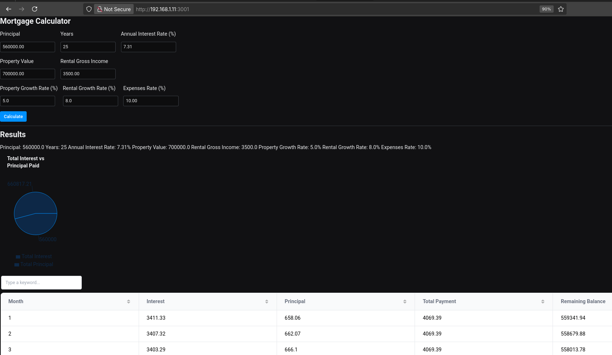

Reflex is another way to create [WebApps with Python](https://reflex.dev/blog/2024-12-20-python-comparison/).

It is based on **[React](https://jalcocert.github.io/JAlcocerT/javascript-for-static-websites/#react)** and Chakra UI for the frontend, and FastAPI and SQLAlchemy for the backend.

I think Reflex (exPicone), should be in between Streamlit and Flask in terms of UI and development complexity:

* https://reflex.dev/templates/dashboard/
* https://github.com/reflex-dev/reflex/releases
* https://reflex.dev/templates/
    * https://github.com/reflex-dev/templates
    * Like this BA sample app: https://build.reflex.dev/gen/28194790-f5cc-4625-bd30-cf2693890e08/
    * Or this process monitor: https://build.reflex.dev/gen/e6293a74-4a47-44a3-bc1e-8966863feb46/

```sh
pip install reflex
reflex init #https://reflex.dev/docs/api-reference/cli/

#sudo docker stop portainer
reflex run
#reflex run --backend-port 8001 --frontend-port 3001

python3 -m pip list | grep -i reflex
```


Make sure that Ports 3000 FE and 8000 BE (portainer) are available!

Or just adapt the `rxconfig.py`:

```py
#rxconfig.py

import reflex as rx

config = rx.Config(
    app_name="Py_Reflex",
    frontend_port=3001,
    backend_port=8005,
    backend_host=8006
)
```

You can also reach it via you home devices:

```sh
ip a show wlp3s0 | grep "inet\b" | awk '{print $2}' | cut -d/ -f1 #192.168.1.8:3001
#sudo ufw allow 3001/tcp
```

Why not just building something simple to try out?

Sky is the limit, as Reflex can do **real time data visualization** stuff thanks to websockets, like [flask can](https://jalcocert.github.io/JAlcocerT/web-apps-with-flask/)!


See the [source code magic](https://github.com/JAlcocerT/Python_is_awesome).
Applied to [RE here](https://gitlab.com/fossengineer1/py_stocks/-/tree/main/EDA_Mortage_Reflex) 🔥💻


[Vibe coding](https://jalcocert.github.io/JAlcocerT/vide-coding/) a Python reflex webapp:


  
  



## The Reflex Package

Reflex launched in December 2022 with the name Pynecone.

* https://github.com/reflex-dev/reflex

> Apache v2 | 🕸️ Web apps in pure Python 🐍

What I want to use it for?

How about enhancing these streamlit projects?


  
  


Enhancing in a way...that they are also good looking and providing UI/UX for mobile users?

**Lets have a look to Reflex.**

But first, get your [Python ready](https://jalcocert.github.io/JAlcocerT/useful-python-stuff/) for action:



```sh
wget https://www.python.org/ftp/python/3.11.5/Python-3.11.5.tgz
tar xzf Python-3.11.5.tgz

cd Python-3.11.5
./configure --enable-optimizations --with-ensurepip --prefix=/usr/local/python311  # Adjust path and version if needed


#compile
make -j$(nproc)  # Use all available cores for faster compilation
#install
sudo make altinstall  #  "altinstall" is IMPORTANT!
```

```sh
nano ~/.bashrc  # Or nano ~/.zshrc if you use zsh

export PATH="/usr/local/python311/bin:$PATH"
source ~/.bashrc  # Or source ~/.zshrc
```

```sh
python3.11 --version  # Or python3.x if you installed a different minor version
pip3.11 --version
pip3.11 install --upgrade virtualenv --user
```




```sh
sudo apt-get install python3-virtualenv

python3.11 -m venv my_env  # Creates a virtual environment named my_env
source my_env/bin/activate  # Activates the environment
```


### Reflex 101

The main Reflex app that encapsulates the backend and frontend.

Every Reflex app **needs an app** defined in its main module.

```py
# app.py
import reflex as rx

# Define state and pages
...

app = rx.App(
    # Set global level style.
    style={...},
    # Set the top level theme.
    theme=rx.theme(accent_color="blue"),
)
```

To start, we can do:

```sh
pip install reflex
reflex init
reflex run #this compiles and execute the sample app
```

The **front end UI** will be at `localhost:3000`



You will also need `localhost:8000` for the BE (which can conflict with Portainer!) 



```bash
sudo docker run -d -p 8000:8000 -p 9000:9000 --name=portainer --restart=always -v /var/run/docker.sock:/var/run/docker.sock -v portainer_data:/data portainer/portainer-ce
```

With reflex, we can do full stack web apps with just Python, for example [this chat](https://www.youtube.com/watch?v=NuNaI__4xiU&list=PLEsfXFp6DpzRDEA6ElMF_NuLu9cvoK49v&index=13)

```sh
git clone https://github.com/codingforentrepreneurs/reflex-gpt #thanks to codingforentrepreneurs once again!
```



> Learn to code by building [series from Coding Entrepreneur](https://www.youtube.com/watch?v=ITOZkzjtjUA&list=PLEsfXFp6DpzRDEA6ElMF_NuLu9cvoK49v) is great (and not only for Reflex)

<!-- 
https://imfing.github.io/hextra/docs/guide/shortcodes/filetree/
-->

These are the main files and **structure of a Reflex Project**:


    
   
   
    
    
  
  
    
    
      
    
    
      
    
  
  
  


**Explanation of the Reflex File Structure:**

* **`rxconfig.py`**: This is the configuration file for your Reflex application. It defines the app's name, backend/frontend ports, and other global settings. Every Reflex project has one.
* **`your_app_name.py`**: This is where the main Python code for your Reflex application resides. It defines your states, components, event handlers, and the `rx.App` instance. You might have multiple `.py` files if your app is larger.
* **`assets/` (folder)**: This is an optional folder where you can place static assets like custom CSS files, images, fonts, or other files that your frontend needs directly. Reflex copies these to the `public` directory during the build process.
    * `style.css`: An example CSS file.
    * `logo.png`: An example image file.
* **`.web/` (folder - usually hidden/ignored)**: This directory is created by Reflex during the build process. It contains the generated Next.js frontend code. You typically **do not interact with this folder directly** and should add it to your `.gitignore`.
    * `package.json`: Frontend dependencies.
    * `node_modules/`: Node.js packages used by the frontend.
    * `.next/`: Next.js build output.
* **`.gitignore`**: Essential for version control, specifying files and directories (like `.web/`, `__pycache__/`, `.venv/`) that Git should ignore.
* **`requirements.txt`**: A standard Python file listing your project's dependencies, including `reflex` itself, and any other Python libraries your backend code might use.

If you inspect, this is how the reflex `main.py` looks:

```py
"""Welcome to Reflex! This file outlines the steps to create a basic app.""" #Shown as title

import reflex as rx

from rxconfig import config


class State(rx.State):
    """The app state."""

    ...


def index() -> rx.Component:
    # Welcome Page (Index)
    return rx.container(
        rx.color_mode.button(position="top-right"),
        rx.vstack(
            rx.heading("Welcome to Reflex!", size="9"),
            rx.text(
                "Get started by editing ",
                rx.code(f"{config.app_name}/{config.app_name}.py"),
                size="5",
            ),
            rx.link(
                rx.button("Check out our docs!"),
                href="https://reflex.dev/docs/getting-started/introduction/",
                is_external=True,
            ),
            spacing="5",
            justify="center",
            min_height="85vh",
        ),
        rx.logo(),
    )


app = rx.App()
app.add_page(index)
```

Now, its all about adding components to the `def index()`, like: https://reflex.dev/docs/library/data-display/moment/

```py
rx.moment(MomentState.date_now) #you will need to define its associated MomentState(), also given in the docs
```

Not long after get that working, you will **build some demo, using graph components**:

* https://reflex.dev/docs/library/graphing/charts/barchart/
* https://reflex.dev/docs/library/graphing/charts/composedchart/




```py
#pip install reflex
#reflex init

import reflex as rx

from datetime import datetime, timezone


class MomentState(rx.State):
    date_now: datetime = datetime.now(timezone.utc)

    @rx.event
    def update(self):
        self.date_now = datetime.now(timezone.utc)


def moment_update_example():
    return rx.button(
        "Update",
        rx.moment(MomentState.date_now),
        on_click=MomentState.update,
    )

##

data = [
    {"name": "Page A", "uv": 4000, "pv": 2400, "amt": 2400},
    {"name": "Page B", "uv": 3000, "pv": 1398, "amt": 2210},
    {"name": "Page C", "uv": 2000, "pv": 9800, "amt": 2290},
    {"name": "Page D", "uv": 2780, "pv": 3908, "amt": 2000},
    {"name": "Page E", "uv": 1890, "pv": 4800, "amt": 2181},
    {"name": "Page F", "uv": 2390, "pv": 3800, "amt": 2500},
    {"name": "Page G", "uv": 3490, "pv": 4300, "amt": 2100},
]

def bar_simple():
    return rx.recharts.bar_chart(
        rx.recharts.bar(
            data_key="uv",
            stroke=rx.color("accent", 9),
            fill=rx.color("accent", 8),
        ),
        rx.recharts.x_axis(data_key="name"),
        rx.recharts.y_axis(),
        data=data,
        width="100%",
        height=250,
    )

def composed():
    return rx.recharts.composed_chart(
        rx.recharts.area(
            data_key="uv", stroke="#8884d8", fill="#8884d8"
        ),
        rx.recharts.bar(
            data_key="amt", bar_size=20, fill="#413ea0"
        ),
        rx.recharts.line(
            data_key="pv",
            type_="monotone",
            stroke="#ff7300",
        ),
        rx.recharts.x_axis(data_key="name"),
        rx.recharts.y_axis(),
        rx.recharts.cartesian_grid(stroke_dasharray="3 3"),
        rx.recharts.graphing_tooltip(),
        data=data,
        height=250,
        width="100%",
    )
#####

"""Welcome to Reflex! This file outlines the steps to create a basic app."""

import reflex as rx
from rxconfig import config


class State(rx.State):
    """The app state."""

    ...

def index() -> rx.Component:
    # Welcome Page (Index)
    return rx.container(
        rx.color_mode.button(position="top-right"),
        rx.vstack(
            rx.heading("Welcome to Reflex!", size="9"),
            rx.heading("Yessss, this works!", size="5"),
            
            rx.callout(
                "One step closer to do cool things :)",
                icon="info",
            ),
            rx.moment(MomentState.date_now),
            #moment_update_example(),
            bar_simple(),
            composed(),
            
            rx.text(
                "Get started by editing ",
                rx.code(f"{config.app_name}/{config.app_name}.py"),
                size="5",
            ),
            rx.link(
                rx.button("Check out our docs!"),
                href="https://reflex.dev/docs/getting-started/introduction/",
                is_external=True,
            ),
            spacing="5",
            justify="center",
            min_height="85vh",
        ),
        rx.logo(),
    )

app = rx.App()
app.add_page(index)
```




You will find also useful:

1. rx.input - https://reflex.dev/docs/library/forms/input/
2. rx.datatable - https://reflex.dev/docs/library/tables-and-data-grids/data-table/ or [table](https://reflex.dev/docs/library/tables-and-data-grids/table/)

#### Reflex Sample Apps

I could not resist to make this form: https://github.com/JAlcocerT/reflex-templates

And enjoy using this sample apps out of the box:

1. `./stock_market_dashboard`


2. `./stock_graph_app`


---

## Building with Reflex

Now its time to rebuild with Reflex some Streamlit apps I made!

### Historical Job Market Data with Reflex

For this one, id like to have a very simple graph for the seasonality of jobs and to use a sqlite DB to pull the data.



  
  








### Real Estate with Reflex

Lately Ive been playing with **RE data** driven apps.

But it was mostly with streamlit, where Im most confortable for now.


  
  


And with Reflex and some tricks with Gemini code assistant I got to this:


Which is a very interesting use case of Reflex components.

But that was a repurposed app, which required few more tricks to be cooler, now with a [composed chart](https://reflex.dev/docs/library/graphing/charts/composedchart/), but with the [piechart](https://reflex.dev/docs/library/graphing/charts/piechart/):

```sh
reflex run --backend-port 8001 --frontend-port 3001
```

> When running reflex, its exposed to home devices out of the box






When creating vibe coded apps, [the BRD and FRD](https://jalcocert.github.io/JAlcocerT/brd-vs-frd-for-data-analytics/) concepts for theweb app, keeping in mind the input, desired output, and additional "cool ideas" for the FRD.

Like this one: https://github.com/JAlcocerT/real-estate-reflex/blob/main/brd-frd.md



#### Vibe Coded Reflex Real Estate App


  
    
    
    
    
    
      
      
      
      
      
        
        
      
      
      
        
        
        
        
        
      
      
      
        
      
      
      
        
        
        
        
      
      
      
        
        
        
        
        
      
    
  


#### RE Questions

1. In which month does interest and payments are 50/50?
2. When does the rent cover the interest costs?
3. The interest/principal split just depends on: years and %interest
4. The PER of the flats depends on the city/neighbourhood you look



Just out of curiosity, see how each city/neighbourhood will have differant PER or yields:

* https://www.idealista.com/sala-de-prensa/informes-precio-vivienda/alquiler/andalucia/sevilla-provincia/dos-hermanas/
* https://www.idealista.com/sala-de-prensa/informes-precio-vivienda/venta/andalucia/sevilla-provincia/dos-hermanas/


> 1451 eur/m2 versus 9.3 eur/m2 - **PER** = 1451/(12*9.3) ~**13** or **7.6% yield**

* https://www.idealista.com/sala-de-prensa/informes-precio-vivienda/venta/andalucia/sevilla-provincia/utrera/
* https://www.idealista.com/sala-de-prensa/informes-precio-vivienda/alquiler/andalucia/sevilla-provincia/utrera/

> 1186 vs 7.5 **~PER 13.17 or 7.5% yield**

* https://www.idealista.com/sala-de-prensa/informes-precio-vivienda/alquiler/andalucia/cadiz-provincia/jerez-de-la-frontera/
* https://www.idealista.com/sala-de-prensa/informes-precio-vivienda/venta/andalucia/cadiz-provincia/jerez-de-la-frontera/

> 1475 vs 9.2 **~PER 13.36 or 7.4%**

* https://www.idealista.com/sala-de-prensa/informes-precio-vivienda/alquiler/andalucia/cadiz-provincia/tarifa/
* https://www.idealista.com/sala-de-prensa/informes-precio-vivienda/venta/andalucia/cadiz-provincia/tarifa/

> 3879 vs 12.5 **~PER 12.52 or 7.9%**




#### RE Resources

Remember that there are other costs associated with RE, not just interests.

You could also bring to the equation the inflation factor to your reflex app:

1. https://tradingeconomics.com/poland/consumer-price-index-cpi (see the change %)
2. https://tradingeconomics.com/poland/interest-rate


## Reflex Authentication

For Streamlit I got to know this very [simple hardcoded user/pwd authentication](https://github.com/JAlcocerT/Streamlit-MultiChat/blob/main/Streamlit_Pages/Auth_functions.py).


That was not the only way, as seen with [the AIssistant here](https://github.com/JAlcocerT/Streamlit-AIssistant/tree/main/Z_Auth_Ways) and explained at this post of [features under a wall](https://jalcocert.github.io/JAlcocerT/streamlit-is-cool/#features-under-a-wall):

1. Mailerlite: handles email verification
2. Google Sheets *filled via FormBricks*, no email verif

```py
#dont forget to import csv as pandas df with such format:
FORM_BRICKS_SHEET_URL="https://docs.google.com/spreadsheets/d/abcdef12345/export?format=csv&gid=0"
```

> Is it possible to have something similar to that with Reflex?

It seems that Reflex supports [few authentication methods](https://reflex.dev/docs/authentication/authentication-overview/):

if you need a [Captcha](https://github.com/masenf/reflex-google-recaptcha-v2) as seen [here](https://jalcocert.github.io/JAlcocerT/encryption-101/#pow-captcha), there are alternatives!

### Reflex x GSheets

The adaptation of the streamlit hardcoded auth to Reflex looks like so:


And with some tinkering, it can use [formbricks](https://formbricks.com/docs/xm-and-surveys/surveys/website-app-surveys/quickstart)


And by using [reflex modals](https://reflex.dev/docs/library/overlay/alert-dialog/), we can play with the pop up version:


### Reflex x WebHooks

With Formbricks, you can also set webhooks.



Its very simple, you reply to a survey with your email - you get early access. Make sure to provide a contact for users who want to un-enroll!


### Reflex x Mailerlite

[Mailerlite](https://jalcocert.github.io/JAlcocerT/blog/dev-forms/#mailerlite) its just a newsletter platform, with a cool API that can be used so that only subscribers (with validated emails) can interact in certain ways with your webapp.

https://gitlab.com/fossengineer1/cv-check/-/blob/main/Z_CVCheck_pdfmineropenAI_v3.py?ref_type=heads
https://jalcocert.github.io/JAlcocerT/ai-useful-yet-simple/#user-authentication

### Reflex x LocalDB

* [Local auth](https://github.com/masenf/reflex-local-auth)


### Reflex x Traefik x Middleware

Recently I got [Traefik https](https://fossengineer.com/selfhosting-traefik/) to work and I use it at [home for SelfHosting](https://jalcocert.github.io/JAlcocerT/selfhosted-apps-06-2025/).

### Reflex x Stripe

Aka a Paywall.

Which resonates with SaaS.


## Deploy Reflex

Remember, this is the trick to use reflex with any port:

```sh
reflex run --backend-port 8001 --frontend-port 3001
```

---

## Conclusions

I find it easier to iterate with streamlit, as there is no waiting time for compiling.

That makes it easier to iterate.

But definitely, Reflex apps can look really cool, **also on smartphones**!

### My favourite Reflex Components


1. If you enjoy **Plotly** as much as I do, you are lucky. See this beautiful [treemap](https://plotly.com/python/treemaps/) which I tinkered with with the [stock graph app template](https://github.com/JAlcocerT/reflex-templates/tree/main/stock_graph_app)


Or the [Stacked area chart](https://plotly.com/python/filled-area-plots/):


You can even bring [animations with plotly](https://plotly.com/python/animations/)

```sh
git clone https://github.com/JAlcocerT/reflex-templates/
cd reflex-templates/stock_graph_app

uv venv
uv pip install -r requirements.txt
uv run reflex run
```

2. There are few ways to bring tables into your apps 

3. The [callouts](https://reflex.dev/docs/library/data-display/callout/)

Useful if you try to login without an email who [made a survey](#reflex-x-gsheets)!

4. [Image](https://reflex.dev/docs/library/media/image/)

```py
rx.image(
    src="https://cyclingthere.pages.dev/_astro/PXL_20241008_144149173.Cj1pqXWc_1oH9Mo.webp",
    width="50px",
    height="50px"
)
```

It was very helpful:

* This [opengraph checker](https://opengraph.dev/panel?url=https%3A%2F%2Flibreportfolio.fyi%2F) ---> https://libreportfolio.fyi/libreportfolio-og.jpeg

5. Bringing [scripts](https://reflex.dev/docs/library/other/script/) into play: for example for web analytics


### SelfHosting Reflex

As per [Reflex docs](https://reflex.dev/docs/hosting/self-hosting/):

Then run your **Reflex app in production mode**:

```sh
#reflex run --env prod
uv run reflex run --env prod --backend-port 8001 --frontend-port 3001
```


> It can be visible fronm other home devices with this approach!

And for containers...it took me a while to make it work and be visible for other devices:

```sh
docker build -t my_custom_reflex_app:latest .

docker run \
  --env-file ./stock_graph_app/.env \
  -e GOOGLE_SHEET_CSV_URL="https://docs.google.com/spreadsheets/d/1pFwGaJHrA6VjwnGH1IOFlEepmRlfI-_Gc1iPTHkblIs/export?format=csv&gid=301359878" \
  -p 8033:8001 -p 3033:3001 \
  my_custom_reflex_app:latest

  #-e ${GOOGLE_SHEET_CSV_URL}
```

Production mode creates an optimized build of your app. By default, the static frontend of the app (HTML, Javascript, CSS) will be exposed on port 3000 and the backend (event handlers) will be listening on port 8000.

> You can also have [static build](https://reflex.dev/docs/hosting/self-hosting/#exporting-a-static-build)!

### Understanding Reflex with Windsurf

Vibe coding has helped me a lot understanding Reflex app.

I have asked to:

```
Can you now create a doc.md explaining how the app works?

Im interested to have Python modules used, how the UDFs are used, what external dependencies there are... 
```

And improved my UDF creation with:

```
could you see in the folder Z_UDF and udf-gsheet.py and create the logic that given a gsheets url, it will pull its data?

and then a second function, that will let us choose which columns we want to filter on the pulled data and optionally how many rows (by default will be all of them)

Add also a proper description when defining those functions
```

Keep git tricks handy though:

```sh
git restore stock_chart_display.py
```


One action, one commit. Something working **SYNC**.


### Ideas with Reflex

https://reflex.dev/docs/getting-started/use-cases/

1. Combine it with some of the authentication ways seen and create a **waiting list / lead magnet**.

I got the idea as soon as I saw:





```py
import reflex as rx

class FormState(rx.State):

    @rx.event
    def submit(self, form_data):
        return rx.toast(form_data)

def form() -> rx.Component:
    return rx.card(
        rx.form(
            rx.hstack(
                rx.image(src="/envelope.png"),
                rx.vstack(
                    rx.heading("Join Newsletter"),
                    rx.text(
                        "Get the latest updates and news about Reflex.",
                    ),
                ),
            ),
            rx.vstack(
                rx.text(
                    "Name ",
                    rx.text.span("*", color="red"),
                ),
                rx.input(
                    name="name",
                    required=True,
                ),
            ),
            rx.vstack(
                rx.text(
                    "Email ",
                    rx.text.span("*", color="red"),
                ),
                rx.input(
                    name="email",
                    type="email",
                    required=True,
                ),
            ),
            rx.vstack(
                rx.text("Message"),
                rx.textarea(
                    name="message",
                ),
            ),
            rx.button("Send", type="submit"),
            on_submit=FormState.submit,
        )
    )
```





2. https://github.com/JAlcocerT/Reflex_Stocks


---

## FAQ


  


**When to Use Which:**

* **Use Django:**
    * When building complex web applications with user authentication, database management, and API development.
    * For large-scale projects requiring robustness and scalability.
    * For projects that need a traditional web application structure.
* **Use Dash, Shiny, Streamlit, or Reflex:**
    * When creating interactive data visualizations and dashboards.
    * For rapid prototyping and sharing data science projects.
    * When you need to quickly build web applications with Python or R.
    * When your primary goal is to display and interact with data.
    * When you do not need complex user management.

**In essence:**

* Django is a general-purpose web framework.
* Dash, Shiny, Streamlit, and Reflex are specialized tools for building interactive data applications.




**1. Reflex:**

* **Focus:** Building interactive web apps with a reactive programming model.  It's designed for complex UIs where you need real-time updates and dynamic behavior.
* **Technology:** Uses a Python backend (typically FastAPI) and a frontend built with React.  This allows for a rich, single-page application (SPA) experience.
* **Strengths:** Excellent for data-driven applications, dashboards, and anything requiring frequent UI updates.  The reactive model makes complex interactions manageable.
* **Weaknesses:** Steeper learning curve compared to some other frameworks due to the reactive paradigm and the use of both Python and [JavaScript](https://jalcocert.github.io/JAlcocerT/javascript-for-static-websites/) (React under the hood, though you mostly interact with it through Python).  Can be overkill for very simple UIs.

**2. Flet:**

* **Focus:** Creating **cross-platform** desktop and web applications using Flutter (Google's UI toolkit).
* **Technology:** Python backend with a Flutter frontend.  This enables native-like performance on desktop and a good web experience.
* **Strengths:**  Fast development for both desktop and web from a single codebase.  Good performance and a modern UI.  Relatively easy to learn.
* **Weaknesses:**  While it handles web, its primary strength is cross-platform desktop development.  The UI might not feel *completely* native on the web compared to frameworks specifically designed for the web.

**3. Streamlit:**

* **Focus:** Rapidly building data-driven web applications and dashboards, especially for machine learning and data science.
* **Technology:** Pure Python, and it handles the frontend rendering for you.
* **Strengths:** Extremely easy to learn and use.  Excellent for quickly prototyping and deploying data science tools.  Has built-in support for displaying data visualizations and interactive widgets.
* **Weaknesses:**  Not ideal for complex, highly interactive applications.  The UI is more basic compared to Reflex or Flet.  Not as suitable for apps that require fine-grained UI control or complex event handling.

**4. PySimpleGUI (PyNiceGUI):**

* **Focus:** Making it easy to create simple GUIs in Python.  Its primary focus is on desktop applications.
* **Technology:** Wraps various GUI toolkits (Tkinter, Qt, WxPython, etc.) to provide a simplified API.
* **Strengths:** Very beginner-friendly.  Great for quickly creating simple desktop utilities or tools.
* **Weaknesses:**  Limited in terms of UI customization and modern look and feel.  Not designed for web applications.  While there is a project called NiceGUI which is a separate project from PySimpleGUI that allows you to create web UIs, it's not a direct web equivalent of PySimpleGUI. NiceGUI is more comparable to Streamlit, but with a different syntax and approach.

**Let's summarize the key differences:**

| **Feature**         | Reflex                 | Flet                    | Streamlit              | PySimpleGUI/NiceGUI        |
|-----------------|-------------------------|--------------------------|-----------------------|-----------------------------|
| Primary Focus   | Complex web apps       | Cross-platform (desktop & web) | Data-driven web apps | Simple desktop GUIs / web |
| Technology      | Python/React             | Python/Flutter           | Pure Python           | Python/Various GUI toolkits |
| Learning Curve  | Steeper                 | Moderate                  | Easiest                | Easiest (PySimpleGUI) / Moderate (NiceGUI) |
| UI Complexity   | High                    | Moderate                  | Low                   | Low (PySimpleGUI) / Moderate (NiceGUI) |
| Web Capabilities| Excellent               | Good                      | Good                  | Not designed for web (PySimpleGUI) / Good (NiceGUI) |
| Data Science    | Good                    | Moderate                  | Excellent               | Limited (PySimpleGUI) / Good (NiceGUI) |




**Which Python Web App fwk should you choose?**

* **Reflex:** If you need to build a complex, interactive web application with real-time updates and a **rich UI**.
* **Flet:** If you want to create a **cross-platform** application that runs on both desktop and web from a single codebase.
* **Streamlit:** If you're building a **data-driven web app** or dashboard quickly and easily, especially for data science projects.
* **PySimpleGUI:** If you need to create a simple desktop utility or tool with a basic UI.
* **NiceGUI:** If you want to create a simple web UI quickly and easily, with a focus on data visualization and interactivity.



Some of the most popular and in-demand full-stack tech stacks currently used in software development:

* **MERN Stack:**
    * MongoDB (Database)
    * Express.js (Backend Framework)
    * React.js (Frontend Library)
    * Node.js (Backend Runtime)
    * This JavaScript-based stack is highly popular for building dynamic, single-page applications.
* **MEAN Stack:**
    * MongoDB (Database)
    * Express.js (Backend Framework)
    * Angular (Frontend Framework)
    * Node.js (Backend Runtime)
    * Similar to MERN, but uses Angular instead of React.
* **LAMP Stack:**
    * Linux (Operating System)
    * Apache (Web Server)
    * MySQL (Database)
    * PHP (Backend Language)
    * A classic and reliable stack, widely used for building dynamic websites and web applications.
* **Python/Django Stack:**
    * Python (Backend Language)
    * Django (Backend Framework)
    * PostgreSQL or MySQL (Database)
    * Ideal for **data-driven** applications, machine learning projects, and **complex web applications**.
* **Ruby on Rails (RoR):**
    * Ruby (Backend Language)
    * Rails (Backend Framework)
    * PostgreSQL or MySQL (Database)
    * Known for its rapid development capabilities and convention-over-configuration approach.
* **Java Spring Boot Stack:**
    * Java (Backend Language)
    * Spring Boot (Backend Framework)
    * MySQL or PostgreSQL (Database)
    * React or Angular (Frontend)
    * A robust and scalable stack commonly used for enterprise-level applications.
* **.NET Stack:**
    * C# (Backend Language)
    * ASP.NET Core (Backend Framework)
    * SQL Server or PostgreSQL (Database)
    * A Microsoft-developed stack, well-suited for building scalable and secure web applications.
* **Serverless Stack:**
    * AWS Lambda or Google Cloud Functions (Backend)
    * API Gateway (API Management)
    * DynamoDB or Firestore (Database)
    * React or Vue.js (Frontend)
    * Focuses on serverless computing, offering scalability and cost-efficiency.
* **MEVN Stack:**
    * MongoDB (Database)
    * Express.js (backend framework)
    * Vue.js (frontend framework)
    * Node.js (server-side runtime)
* **Flutter/Firebase Stack:**
    * Dart (Programming language)
    * Flutter (UI toolkit)
    * Firebase (Backend-as-a-service)
    * Very popular for cross platform mobile app development.



Key Considerations:

* **Project Requirements:** The nature of your project will significantly influence your tech stack choice.
* **Team Expertise:** Your team's familiarity with specific technologies is crucial.
* **Scalability:** Consider the stack's ability to handle future growth.
* **Community Support:** A strong community provides ample resources and assistance.




When using Django for the backend, developers have a wide range of choices for their UI frontend.

Here are some of the most common and popular options:

**1. Django's Built-in Templating System:**

* This is the most straightforward option. Django's templating language allows you to embed dynamic content directly within your HTML.
* It's well-suited for simpler applications or when you want tight integration between the backend and frontend.
* Pros: Easy to learn, tightly integrated with Django.
* Cons: Can become less maintainable for complex UIs.

**2. React.js:**

* React is a very popular JavaScript library for building user interfaces.
* It's excellent for creating single-page applications (SPAs) and complex UIs.
* Pros: Component-based architecture, excellent performance, large community.
* Cons: Requires separate development for the frontend and backend, steeper learning curve.
* Often Django Rest Framework is used to create an API that the React front end consumes.

**3. Vue.js:**

* Vue.js is another progressive JavaScript framework for building user interfaces.
* It's known for its simplicity and ease of integration.
* Pros: Easy to learn, flexible, good performance.
* Cons: Smaller community compared to React, but growing rapidly.
* Often Django Rest Framework is used to create an API that the Vue.js front end consumes.

**4. Angular:**

* Angular is a powerful JavaScript framework developed by Google.
* It's well-suited for building large-scale applications.
* Pros: Comprehensive framework, strong type checking, good for enterprise applications.
* Cons: Steeper learning curve, can be more complex than React or Vue.
* Often Django Rest Framework is used to create an API that the Angular front end consumes.

**5. HTML, CSS, and JavaScript (Vanilla):**

* For simpler applications, you can use plain HTML, CSS, and JavaScript without any frameworks.
* This gives you complete control over the frontend.
* Pros: Lightweight, no external dependencies.
* Cons: Can become difficult to manage for complex UIs.

**6. Tailwind CSS:**

* While not a full front end framework, Tailwind CSS is very popular with django projects. It is a utility first CSS framework, that allows for very rapid UI development.
* It can be combined with any of the above, and is most often used with Django's built in templating, or with Vue.js.



**Key Considerations:**

* **Complexity:** For simple applications, Django's templating or vanilla JavaScript might suffice. For complex UIs, React, Vue, or Angular are better choices.
* **Single Page Applications:** If you're building an SPA, React, Vue, or Angular are ideal.
* **Team Expertise:** Choose a technology that your team is comfortable with.
* **API Development:** If you're using a JavaScript framework, you'll need to create an API using Django REST Framework (DRF) to connect the frontend and backend.

In summary, while Django's templating is a valid option, the trend leans heavily towards using JavaScript frameworks like React, Vue, or Angular for more modern and dynamic user interfaces.

Yes, you can achieve similar outcomes with Dash, Shiny, Streamlit, and Reflex as you can with Django, but the approaches and use cases differ significantly. Here's a breakdown:

**Core Differences:**

* **Django:**
    * A full-fledged web framework for building complex, scalable web applications.
    * Handles both frontend and backend, with robust ORM, templating, and routing.
    * Ideal for large, data-driven web applications and APIs.
* **Dash, Shiny, Streamlit, Reflex:**
    * Primarily focused on building interactive data visualizations and web applications with Python or R.
    * Emphasize rapid development and ease of use, particularly for data scientists and analysts.
    * Generally, they are not used for complex web applications that require a lot of user management, or complex relational databases.
    * They are more focused on data visualization, and data exploration.

**Similarities and Differences:**

1.  **Dash (Python):**
    * Built on top of Flask, React, and Plotly.
    * Excellent for creating interactive dashboards and data visualizations.
    * More customizable than Streamlit or Shiny.
    * Can handle more complex layouts and interactions.
    * Less focused on general web application development than Django.
    * Good for data dashboards.
2.  **Shiny (R):**
    * Specifically designed for R users to build interactive web applications.
    * Seamless integration with R's data analysis and visualization capabilities.
    * Ideal for sharing R-based analyses and models.
    * Less general-purpose than Django or Dash.
    * Good for R based data dashboards.
3.  **Streamlit (Python):**
    * Extremely easy to use for creating data-driven web applications.
    * Focuses on simplicity and rapid prototyping.
    * Automatically renders changes, making development very fast.
    * Less customizable than Dash or Django.
    * Excellent for quickly sharing data science projects.
    * Good for quick data app creation.
4.  **Reflex (Python):**
    * A newer framework that allows you to build fully reactive web apps in pure python.
    * Combines frontend and backend logic into a single python codebase.
    * Good for creating interactive web apps, with a focus on ease of use.
    * Less mature than Django.
    * Good for python first web apps.