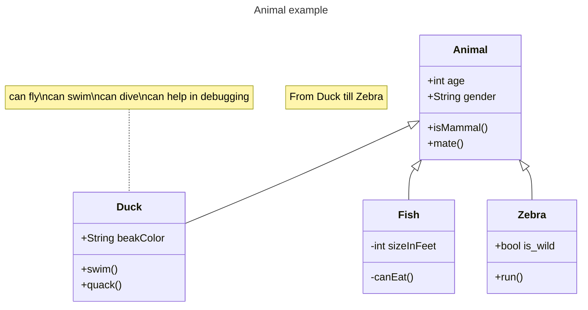
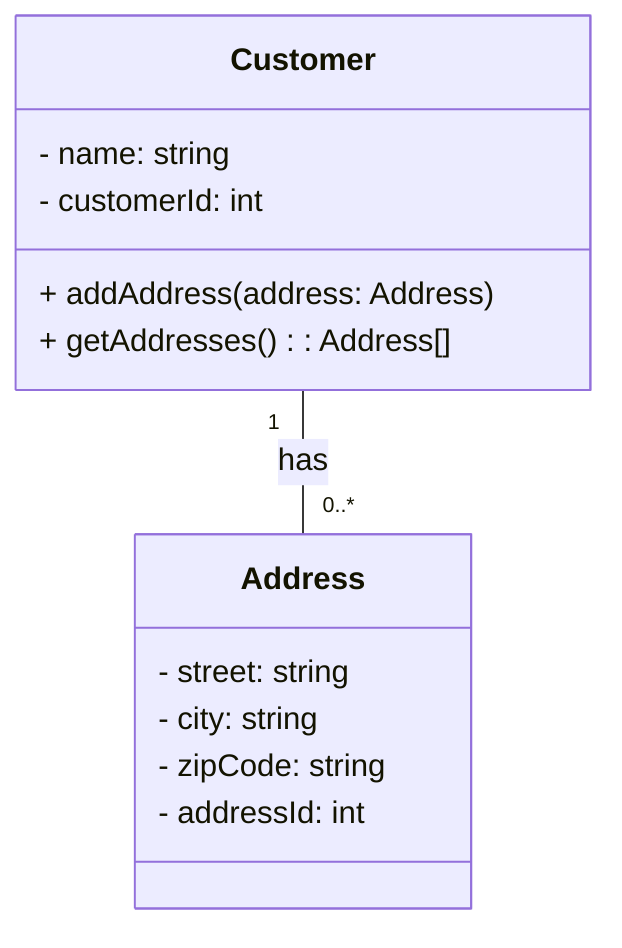

**Tl;DR**

Long overdue topic: *WT& is OOP?*

What I needed to get this going for good: https://github.com/JAlcocerT/MultiBodySystemDynamics-MBSD-

+++ With [examples](#applying-oop): [pendulum](#pendulum) + [3 bodies](#three-bodies)

**Intro**

Object oriented programming!

Its been a while since i used DevCpp for C programming.

I was trying for long to avoid such concept.

But not any more.


* https://mermaid.js.org/syntax/classDiagram.html



I was doubting when to go all in with the topic:

1. https://jalcocert.github.io/JAlcocerT/gabemorris12-mechanism-project-setup/

2. 


And with an 


Someone once told me that for **mechanisms I would need to learn OOP**.

And I can understand why now.


  
  



declarative programming language (not procedural! - you dont have to tell it (the procedure) how to do it, the query engine worries about the how for you)

great for data management, manipulation and analytics
relational data model

## OOP 101

Let's dive into Object-Oriented Programming (OOP).

**What is OOP?**

OOP is a programming paradigm (a style of programming) that revolves around the concept of "objects." Instead of focusing purely on functions and procedures, OOP organizes code into reusable, self-contained units that represent real-world entities or abstract concepts.

**Key Concepts:**

1.  **Objects:**
    * An object is an instance of a class. Think of it as a specific "thing" that belongs to a category. For example, if "Car" is a class, a specific car like "MyRedToyota" is an object.
    * Objects have two main characteristics:
        * **Attributes (Data):** These are the properties or characteristics of an object. For example, a "Car" object might have attributes like "color," "make," "model," and "speed."
        * **Methods (Behavior):** These are the actions or functions that an object can perform. For example, a "Car" object might have methods like "startEngine()," "accelerate()," and "brake()."

2.  **Classes:**
    * A class is a blueprint or template for creating objects. It defines the attributes and methods that objects of that class will have.
    * You can think of a class as a general description, while an object is a specific instance of that description.
    * For example, a class "Dog" can describe all the general attributes of a dog (breed, age, name) and all the general methods a dog can perform (bark, run, eat).

3.  **Encapsulation:**
    * Encapsulation is the bundling of data (attributes) and methods that operate on that data into a single unit (an object).
    * It also involves hiding the internal details of an object from the outside world, exposing only what is necessary. This helps to protect data and prevent unintended modifications.

4.  **Inheritance:**
    * Inheritance allows you to create new classes (derived classes or subclasses) based on existing classes (base classes or superclasses).
    * The derived class inherits the attributes and methods of the base class, and you can add new attributes and methods or override existing ones.
    * For Example, a "SportsCar" class may inherit from the "Car" class.

5.  **Polymorphism:**
    * Polymorphism means "many forms." In OOP, it refers to the ability of objects of different classes to respond to the same method call in different ways.
    * For example, if you have a "Shape" class with a "draw()" method, you can have subclasses like "Circle," "Square," and "Triangle" that each implement the "draw()" method in their own way.

**Methods (Functions Applied to Objects):**

Yes, you're right! Methods are essentially functions that are associated with a specific class and operate on the objects of that class. 

They define the behavior of the objects.

**Simple Example (Python):**

```python
class Dog:
    def __init__(self, name, breed):  # Constructor (initializes object)
        self.name = name
        self.breed = breed

    def bark(self):
        print(f"{self.name} says Woof!")

    def displayBreed(self):
        print(f"{self.name} is a {self.breed}")

# Creating objects (instances) of the Dog class
my_dog = Dog("Buddy", "Golden Retriever")
another_dog = Dog("Charlie", "Labrador")

# Calling methods on the objects
my_dog.bark()
another_dog.displayBreed()
```

In this example:

* `Dog` is the class.
* `my_dog` and `another_dog` are objects (instances) of the `Dog` class.
* `__init__`, `bark`, and `displayBreed` are methods.
* `name` and `breed` are attributes.

Let me know if you'd like to explore any of these concepts in more detail or see examples in other programming languages!


Yes, Python is known for its dynamic nature, and this extends to how it handles object properties. In essence, Python allows you to add or modify object properties at runtime, giving you a lot of flexibility.

Here's a breakdown:

* **Dynamic Attribute Assignment:**
    * Unlike some statically typed languages, Python doesn't strictly enforce that all object properties must be declared within the class definition. You can add new attributes to an object after it has been created.
    * This means you can effectively "tack on" properties as needed.

* **Practical Implications:**
    * This flexibility can be very useful for situations where you don't know all the properties an object will need in advance.
    * However, it's also important to use this feature responsibly, as excessive dynamic property addition can sometimes make code harder to understand and maintain.

* **Limitations:**
    * While you can add many properties, the underlying system does have memory limitations. So, you are limited by the amount of memory available to the python process.
    * Also, from a code maintance standpoint, adding excessive amounts of dynamic properties can create code that is hard to debug, and to understand.

In summary, Python's dynamic nature gives you a lot of freedom in working with object properties.

### OOP in Python

When it comes to **how C and Java handle object properties**, they differ significantly from Python's dynamic approach. 

**C:**

* **Static Structure:**
    * C is a statically typed language. This means that the structure of a "struct" (which is C's closest equivalent to a class) must be defined at compile time.
    * You must declare all the members (properties) of a struct when you define it. You cannot dynamically add or remove members during runtime.
    * Therefore, in C, the number of "properties" is fixed at compile time.
* **Memory Considerations:**
    * C gives you very direct control over memory. This means that the size of a struct is determined by the size of its members.

**Java:**

* **Class Definitions:**
    * Java is also a statically typed language. Class structures are defined at compile time.
    * You declare the fields (member variables) of a class within the class definition, and these fields are fixed.
    * While you can use data structures like HashMaps or Lists within a Java object to hold a variable number of data elements, the object itself will have a fixed set of defined fields.
* **Object-Oriented Structure:**
    * Java's object-oriented nature enforces a more rigid structure compared to Python. This promotes type safety and predictability.
    * It is possible to use reflection in java, to access and manipulate fields at runtime, but this is not the common way of programming, and has performance impacts.

**Key Differences:**

* **Dynamic vs. Static:**
    * Python: Dynamic, properties can be added at runtime.
    * C and Java: Static, properties are defined at compile time.
* **Flexibility vs. Structure:**
    * Python: Offers high flexibility.
    * C and Java: Emphasize structure and type safety.

In essence, C and Java prioritize a well-defined structure, which contributes to their performance and reliability. 

**Python prioritizes flexibility and ease of use.**

Yes, all the statements you've listed are **accurate and fundamental principles of Object-Oriented Programming (OOP)**. Let's break them down:

* **"OOP is a style of programming which allows to club data and behavior together"**: This is a core definition of OOP. It emphasizes encapsulation, where data (attributes) and the functions that operate on that data (methods) are bundled into objects.
* **"OOP is more suited for coding real life scenarios"**: This is a key advantage of OOP. Its ability to model real-world entities through objects and classes makes it very effective for complex systems.
* **"Objects are real world entities"**: Objects represent concrete instances of things, whether physical or conceptual.
* **"Classes are logical entities and are used for classification"**: Classes are blueprints or templates that define the structure and behavior of objects. They allow us to categorize objects based on shared characteristics.
* **"Class is a description of attributes and behavior that objects of that classification should possess"**: This reiterates the role of classes as blueprints, defining what objects of that class will have and do.
* **"Common attributes are created using a special method called \_\_init\_\_"**: The `__init__` method (constructor) is indeed used to initialize the attributes of an object when it's created.
* **"Objects can be created using ClassName() or using object literals for the built in classes"**: Correct. User defined classes are instantiated with ClassName(), and python provides object literals for built in classes like lists, dictionaries, tuples, and sets.
* **"Attributes are created using the syntax, reference\_variable.attribute\_name = value"**: This is how you dynamically add or modify attributes to objects.
* **"Behavior is created by defining a function inside the class having a special parameter called self"**: This is how methods are defined within classes, and `self` is essential for the methods to access the object's attributes and other methods.

In summary, you've captured the essence of OOP in Python (and OOP in general) very well.


### OOP Concepts



Yes, the relationship between a "Customer" and an "Address" is a very common and clear example of aggregation (a "has-a" relationship) in Object-Oriented Programming. Here's why:

* **"Has-A" Relationship:**
    * A customer *has* an address (or potentially multiple addresses). This directly aligns with the "has-a" concept of aggregation.
* **Independent Lifecycles:**
    * Crucially, an address can exist independently of a customer. An address exists whether or not a customer is currently assigned to it.
    * Similarly, a customer can exist without an address (though it might be impractical in some applications).
    * This independence of lifecycles is a key characteristic that distinguishes aggregation from composition.
* **Aggregation vs. Composition:**
    * If the relationship were composition, the address would be completely dependent on the customer. If the customer were deleted, the address would also be deleted.
    * In a typical scenario, addresses are often stored in a separate database or system, and they can be reused by multiple customers. This points strongly towards aggregation.

**In summary:**

* The "Customer has an Address" scenario perfectly illustrates aggregation.
* It is very important to understand the difference between aggregation and composition.
* The key difference is the objects life cycle dependencies.

Therefore, you're absolutely correct in recognizing that this is a classic "has-a" aggregation relationship.





Type safety is a crucial concept in programming languages that aims to prevent type errors. Let's break it down:

**What are Type Errors?**

Type errors occur when you try to perform an operation on a value of an incompatible type. For example:

* Trying to add a string ("hello") to an integer (5).
* Calling a method that expects an integer argument with a string argument.
* Accessing a field that doesn't exist on an object.

These errors can lead to unexpected behavior, crashes, and bugs in your programs.

**How Type Safety Works:**

Type safety mechanisms ensure that the compiler or runtime environment checks the types of values before performing operations. This checking can happen:

* **At Compile Time (Static Type Checking):**
    * Languages like C, C++, and Java perform type checking during compilation.
    * The compiler analyzes your code and flags type errors before the program is executed.
    * This helps catch errors early in the development process.
* **At Runtime (Dynamic Type Checking):**
    * Languages like Python and JavaScript perform type checking while the program is running.
    * The runtime environment checks the types of values just before an operation is performed.
    * If a type error is detected, the program typically throws an exception.

**Benefits of Type Safety:**

* **Reduced Bugs:** Type checking helps catch errors early, preventing them from causing problems in production.
* **Improved Code Reliability:** Type-safe code is generally more reliable and predictable.
* **Enhanced Code Maintainability:** Type information makes it easier to understand and modify code.
* **Better Performance (in some cases):** Static type checking can allow compilers to generate more efficient code.
* **Increased developer confidence:** Knowing that type errors are caught, allows developers to have more confidence in their code.

**Examples:**

* In Java:
    * `int x = "hello";` would result in a compile-time error because you're trying to assign a string to an integer variable.
* In Python:
    * `x = "hello" + 5` would result in a runtime `TypeError` because you're trying to add a string and an integer.

**In summary:** Type safety is a set of mechanisms that help ensure that your programs operate on values of the correct types, reducing the likelihood of errors and improving the overall quality of your code.


#### Method vs Functions

The key differences between functions and methods in object-oriented programming, particularly in languages like Python:

**Function:**

* **"Is a block of code with a name"**: This is a fundamental definition of a function. It's a reusable piece of code that performs a specific task.
* **"It can be invoked using the name of the function and passing parameters"**:  Correct. You call a function by its name, and you can provide input values (arguments) as parameters.
* **"Example: len([1,2,3])"**:  `len()` is a built-in function in Python that calculates the length of an iterable (like a list).
* **"Parameters are optional in a function"**:  This is also true. Some functions can be called without any parameters, while others require them.

**Method:**

* **"Is part of an object and represents the behavior of the object"**: This is a core concept of methods. They are functions associated with a specific object or class and define what that object can do.
* **"Can be invoked only on an object, using dot operator. Without an object we cannot invoke a method"**: Methods are called using the dot notation (`object.method()`), signifying that they belong to that particular object instance.
* **"Example: [1,2,3].reverse()"**: `reverse()` is a method that modifies the list object in place, reversing its elements.
* **"A method must have at least one parameter: self"**: In Python, this is a crucial point. The `self` parameter (or any name used to refer to the instance) is the first parameter in a method definition. It represents the object instance itself and allows the method to access and modify the object's attributes.

**Key takeaway:**

The image effectively summarizes the distinction between functions and methods. Functions are standalone blocks of code, while methods are tied to objects and operate on their data.




Let's break down these points about class relationships, aggregation, and association in OOP:

**1. Classes Can Have Relationships with Other Classes:**

* This is the fundamental idea. Objects don't exist in isolation; they interact and relate to each other. These interactions and connections are modeled as relationships between classes.
* These relationships are crucial for creating complex and realistic software systems.

**2. Aggregation: "Has-A" with Independent Lifecycles:**

* **Ownership:** In aggregation, one class (the "whole") contains or "has" another class (the "part"). For example, a "Library" might have "Book" objects.
* **Independent Lifecycles:** The key feature of aggregation is that the "part" objects can exist independently of the "whole" object. If the "Library" is deleted, the "Book" objects still exist.
* **Diamond Symbol:** In UML class diagrams (and sometimes in MermaidJS with modifications), aggregation is represented by a hollow diamond at the "whole" end of the relationship line. This visually distinguishes it from composition.
* **Example:** A "Department" has "Employees." If the "Department" is dissolved, the "Employees" still exist.

**3. Association: A General "Uses-A" Relationship:**

* **General Relationship:** Association is the most general type of relationship between classes. It indicates that objects of one class "use" or interact with objects of another class.
* **Local Variable Use:** If an object of one class is used only as a local variable within a method of another class, this is considered an association. This signifies a weak, temporary relationship.
* **No Strict Representation:** Because association is so general and often temporary, it's not always explicitly represented in class diagrams. It might be implied by method calls or attribute usage.
* **Class Variable/Method Usage:** Association also occurs when one class uses the class variables or methods of another class. This is a form of interaction that doesn't necessarily imply ownership or a strong lifecycle dependency.
* **Example:** A "Calculator" class might use a "Math" class to perform calculations. This is an association, but the "Calculator" doesn't "own" the "Math" class.

**Key Differences Between Aggregation and Association:**

* **Ownership:** Aggregation implies a form of ownership (even if the lifecycle is independent), while association is a more general "uses" relationship.
* **Lifecycle:** Aggregation has a clear concept of one class containing another, while association is often temporary.
* **Representation:** Aggregation is often explicitly represented with a diamond symbol, while association is often implied.

**In simpler terms:**

* **Aggregation:** "My car has an engine. The engine can exist without my car, but it's still part of my car."
* **Association:** "My car uses a gas station. The gas station and my car are related, but my car doesn't 'have' the gas station in the same way it has an engine."

I hope this clarifies the distinctions between aggregation and association.

#### Encapsulation

You've hit on a crucial aspect of encapsulation in Python with the double underscore (`__`) prefix. Let's break down how it works and why it's used.

**Double Underscore (Name Mangling):**

* Python uses a mechanism called "name mangling" when you prefix an attribute with double underscores (`__`).
* This doesn't make the attribute truly "private" in the sense of some other languages (like Java or C++).
* Instead, Python modifies the attribute's name to make it harder to access from outside the class.

**How Name Mangling Works:**

* When you use `__wallet_balance`, Python internally changes the attribute's name to something like `_ClassName__wallet_balance`.
* In the `Customer` class, `__wallet_balance` becomes something like `_Customer__wallet_balance`.

**Why It's Done:**

* **To reduce the risk of accidental name clashes:** If a subclass defines an attribute with the same name, name mangling prevents it from accidentally overriding the base class's attribute.
* **To provide a level of data hiding:** While not foolproof, it discourages direct access to attributes that are intended to be internal to the class.

**The Example and Its Output:**

* The code defines `__wallet_balance` with a double underscore.
* When you try to access `c1.__wallet_balance` directly, you get an `AttributeError`.
* This is because `__wallet_balance` doesn't exist as a direct attribute. Python has mangled its name.
* The only way to access the mangled variable is by using it's mangled name `_Customer__wallet_balance`, but this is heavily discouraged.
* The class's methods (`update_balance` and `show_balance`) can still access `__wallet_balance` because they are within the class's scope.

**Encapsulation:**

* As the text correctly states, this technique contributes to **encapsulation**.
* Encapsulation is about bundling data and methods that operate on that data into a single unit (the object) and controlling access to the data.
* By using name mangling and providing methods to interact with the data, you can enforce stricter control over how the object's state is modified.

**Important Considerations:**

* **Not True Privacy:** Name mangling is not a security feature. Determined programmers can still access mangled attributes.
* **Convention:** The single underscore (`_`) is a convention that indicates an attribute is intended to be internal, but it doesn't involve name mangling.
* **Getter and Setter Methods:** The best practice for controlled data access is to use getter and setter methods or properties, which allow you to validate and manipulate data before it's accessed or modified.

In essence, the double underscore is a Pythonic way to provide a level of data hiding and prevent accidental name clashes, contributing to the principles of encapsulation.


#### Inheritance

Inheritance is a fundamental concept in Object-Oriented Programming (OOP) that allows you to create new classes based on existing classes. It establishes an "is-a" relationship, meaning a subclass (or derived class) is a specialized type of its superclass (or base class).

**The Core Idea:**

* **Code Reusability:** Inheritance promotes code reuse. You define common attributes and methods in a superclass, and subclasses can inherit them, avoiding redundant code.
* **Hierarchy and Organization:** It allows you to create a hierarchy of classes, organizing your code in a logical and structured way.
* **Polymorphism:** Inheritance is essential for polymorphism, which allows objects of different classes to be treated as objects of a common superclass.

**Explanation of the Inheritance Example:**

1.  **Real-World Analogy:**
    * The analogy of a child inheriting attributes and behaviors from a parent is very accurate. A child might inherit eye color, hair color, or even personality traits from their parents.
    * In OOP, a subclass inherits attributes (data) and methods (behaviors) from its superclass.

2.  **Code Perspective (Java, C#, etc.):**
    * **Constructor:** The subclass does not directly inherit the superclass's constructor. However, the subclass can call the superclass's constructor using the `super()` keyword (or similar) to initialize inherited attributes.
    * **Non-Private Attributes:** Attributes declared as `public` or `protected` in the superclass are directly inherited by the subclass. `Private` attributes are not directly accessible.
    * **Non-Private Methods:** Methods declared as `public` or `protected` in the superclass are also inherited by the subclass.
    * **Why Private is hidden:** Private members are hidden to protect the internal state of the superclass. They are intended for internal use only.

3.  **Python's Behavior:**
    * Python's inheritance model is slightly different. In Python, private variables (those with double underscores, like `__my_variable`) are still inherited, but they undergo name mangling. This means their names are modified to make them less likely to clash with names in subclasses.
    * Essentially, even though they are inherited, name mangling makes it harder for a subclass to accidently overwrite a superclasses private variables.

4.  **"Owned by the Child Class":**
    * When a subclass inherits attributes and methods, it's as if those members were defined directly in the subclass.
    * The subclass can:
        * Use the inherited attributes and methods as its own.
        * Override inherited methods to provide its own specialized implementation.
        * Add new attributes and methods that are specific to the subclass.

**Example (Conceptual):**

```
// Superclass
class Animal {
    String name;
    void eat() {
        System.out.println("Animal is eating.");
    }
}

// Subclass
class Dog extends Animal {
    void bark() {
        System.out.println("Dog is barking.");
    }
}

// Usage
Dog myDog = new Dog();
myDog.name = "Buddy"; // Inherited attribute
myDog.eat(); // Inherited method
myDog.bark(); // Subclass-specific method
```

In this example:

* `Dog` inherits the `name` attribute and the `eat()` method from `Animal`.
* `Dog` adds its own `bark()` method.

Inheritance is a powerful tool for building well-structured and reusable code.


Yes, that's a correct and concise explanation of simple inheritance. Here's a breakdown of why it's accurate:

* **"Simple inheritance enables a derived class to inherit properties and behaviour from a single parent class."**
    * This accurately describes the core concept. "Simple" or "single" inheritance means a class derives from only one direct parent class.
    * "Properties" refers to the attributes or data members of a class.
    * "Behavior" refers to the methods or functions of a class.
* **"It allows a derived class to inherit the properties and behavior of a base class, thus enabling code reusability..."**
    * This highlights one of the primary benefits of inheritance: code reuse. You don't have to rewrite code that already exists in the base class.
* **"...as well as adding new features to the existing code."**
    * This points to the extensibility of inheritance. A derived class can:
        * Add its own unique attributes and methods.
        * Override (replace) inherited methods to provide specialized behavior.

**In essence, simple inheritance provides a way to create a hierarchy of classes where subclasses build upon and extend the functionality of their parent classes.**

Therefore, the statement you provided is accurate.


Let's delve deeper into each of these aspects of inheritance:

**1. A Class Can Inherit from Another Class:**

* This is the fundamental principle. It establishes an "is-a" relationship (e.g., a "Dog" *is an* "Animal").
* The class that inherits is called the "child class," "subclass," or "derived class."
* The class being inherited from is called the "parent class," "superclass," or "base class."

**2. Inheritance Improves Code Reuse:**

* This is a major benefit. Common attributes and methods are defined in the parent class, and child classes automatically get them.
* This reduces redundancy and makes code easier to maintain. If you need to change a common behavior, you only change it in the parent class.

**3. Constructor, Attributes, Methods Get Inherited to the Child Class:**

* **Attributes (Variables):** Non-private attributes of the parent class are inherited.
* **Methods (Functions):** Non-private methods of the parent class are inherited.
* **Constructor:**
    * The child class does not directly inherit the parent's constructor.
    * However, the child class can call the parent's constructor using `super()` (or a similar mechanism, depending on the language) to initialize the inherited attributes.
    * If the child class does not define a constructor, and the parent class has a constructor that has no arguments, then the parent classes constructor will be implicitly called.

**4. The Parent Has No Access to the Child Class:**

* Inheritance is a one-way street. The parent class has no knowledge of or access to the child classes.
* This enforces the principle of specialization. The child class is a more specialized version of the parent.

**5. Private Properties of a Parent Are Not Accessible Directly in the Child Class:**

* Private attributes and methods are intended for internal use within the parent class.
* They are hidden from child classes to maintain encapsulation and prevent unintended modifications.
* Even though some languages like python inherit private members, they are name mangled, and therefore are not directly accessible.
* If a child class needs to access or modify private data, the parent class should provide public or protected methods (getters and setters).

**6. Child Class Can Override the Methods, This Is Called Method Overriding:**

* Method overriding allows a child class to provide its own implementation of a method that is already defined in the parent class.
* This allows the child class to customize the behavior of inherited methods.
* When an overridden method is called on an object of the child class, the child's version of the method is executed.

**7. `super()` Is an Inbuilt Function Which Is Used to Invoke the Parent Class Methods and Constructor:**

* `super()` (or the equivalent in other languages) is used to call methods and constructors of the parent class from within the child class.
* This is particularly useful for:
    * Calling the parent's constructor to initialize inherited attributes.
    * Calling parent class methods to reuse existing functionality.

**8. Types of Inheritance:**

* **Simple (Single) Inheritance:**
    * A class inherits from only one parent class.
* **Multi-level Inheritance:**
    * A class inherits from a child class, which inherits from another class, forming a chain of inheritance. (A->B->C)
* **Hierarchical Inheritance:**
    * Multiple child classes inherit from a single parent class. (A->B, A->C)
* **Multiple Inheritance:**
    * A class inherits from multiple parent classes. (A,B->C)
    * Some languages, like Java and C#, do not directly support multiple inheritance of classes (they use interfaces instead), due to the complexities and potential ambiguities it can introduce (the "diamond problem"). Python does support multiple inheritance.

## Applying OOP

How about creating couple of examples Python app that apply OOP?


  
  



### Pendulum

https://youtu.be/T58lGKREubo?is=yO5NxEWvrU31VrR8


### Three Bodies


## Conclusions

---

## FAQ

Python and its 288 use cases

This year I have been surprised by Python language (one more time).

And using uv as package manager has been a revelation:

If we are ready...what are those cool use cases?

### Photo

* https://www.geeksforgeeks.org/python-pillow-creating-a-watermark/

### Video


  


For editing video, i prefer to use directly FFMPEG.

TO create videos with Python, for now, I have tried [data driven animations](#animations), which can be exported to .mp4

### WebApps


  
  


Flask

### Plots

For WebApps, I try to go with Plotly, to get interactivity out of the box.

You can also bring to your Python Apps: ChartJS, ApexCharts...as seen [here](https://github.com/JAlcocerT/Streamlit_PoC)

* https://handhikayp.medium.com/real-time-data-visualizations-using-python-library-plotly-12e0e5b48240

### QR Generation

To generate [**QR's with logo** thanks to Python](https://github.com/JAlcocerT/JAlcocerT/blob/main/Z_TestingLanguages/Z_Python/QR_generation.ipynb) 


And your QR generator can be embedded into WebApps, as seen [here](https://github.com/JAlcocerT/Streamlit_PoC/blob/main/Utils/QR_Gen.py)

> It can be done as well with Inkscape, or [with QR-Code-Generator](https://github.com/nayuki/QR-Code-generator) or with [emn178](https://emn178.github.io/online-tools/qr-code/generator/)

[](https://colab.research.google.com/github/JAlcocerT/JAlcocerT/blob/main/Z_TestingLanguages/Z_Python/QR_generation.ipynb)

I got to learn this during [this wedding post](https://jalcocert.github.io/JAlcocerT/software-for-weddings/#what-i-learnt)!


### Infographics

<!--  -->

Infographics are one of those things can be [done as code](https://jalcocert.github.io/JAlcocerT/things-as-a-code/#infographics-as-a-code): *with python ofc*


  
  



  
  


See this sample script: https://github.com/JAlcocerT/DataInMotion/blob/main/tests/plot_total_return_from_yfinance.py

```sh
#git clone https://github.com/JAlcocerT/DataInMotion.git
#cd DataInMotion && branch libreportfolio
uv run tests/plot_historical_gweiss.py CAT --start 2005-01-01 --brand "@LibrePortfolio" --warmup-days 400
```

But for *not just yfinance* based, I created:


  



### Animations

I got very much surprised couple of years ago with [the mechanism project](https://github.com/gabemorris12/mechanism).

Which I finally got the change to write about on [this post](https://jalcocert.github.io/JAlcocerT/gabemorris12-mechanism-project-setup/).

The project has a great application of Python animations.

That I could not resist to tinker with:

* https://github.com/JAlcocerT/mechanism
* https://github.com/JAlcocerT/Streamlit_PoC/tree/main/Animations - Just some **matplotlib animations** for various use cases


