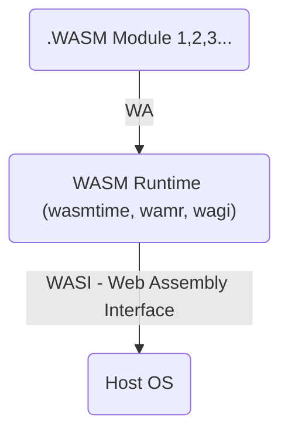

**TL;DR**

Understanding WASM and how it [relates with Containers](#wasm-vs-containers).

+++ [WASM + PWA](#wasm-and-pwa) as your FFMPEG [video](https://jalcocert.github.io/JAlcocerT/photo-video-tinkering/) editor
+++ Practical WASM with [VERT](#practical-wasm---vert) to convert files

Keep reading if you like portability and serverless/edge computing.

**Intro**

Context for WASM, in case you have been doing CSR projects recently, like I've been:


  



In a regular Client-Side Rendering (CSR) setup, the **JavaScript code is executed in the client's browser**, and this process involves an overhead that makes it slower than compiled languages. 

Here's the breakdown of why it takes more time:

* **Downloading the Code**: The browser first has to download the entire JS bundle. For large applications, this can be a big file, which adds to the initial load time.

* **Parsing and Interpretation**: Once downloaded, the browser's JavaScript engine must **parse and interpret** the code. It reads the text-based code, translates it into an intermediate format called bytecode, and then executes it line by line.

* **Just-in-Time (JIT) Compilation**: To improve performance, modern engines use a JIT compiler. The engine **monitors the running code** and identifies "hot spots" (frequently executed sections). It then compiles only those small parts of the bytecode into optimized machine code. This is an on-the-fly process that adds to the initial execution time as the engine decides what to optimize.

This entire process—from download to parsing and JIT compilation—happens on the user's machine, adding latency to the initial page load. 

A **pre-compiled language like WASM** skips most of these steps.

The browser can simply [download the already-compiled](#hosting-for-wasm) binary `.wasm` file and execute it directly, leading to faster startup and better performance for [computationally intensive tasks](#what-to-run-with-wasm).

## What about Web Assembly?

With **WASM** we can run Apps coded in other language *(other than web language like js)* in our browsers.

WASM allow us to compile code and run it in **various environments, like browsers**.

> Regardless of OS and even architecture ARM/X86/RISC-V...

With Docker we have (generally) bigger Images than WASM. 

> Wasm follows both OCI and w3c standards.

* You can get more ideas at [awesome-WASM](https://github.com/mbasso/awesome-wasm)



> Thanks to [DevOps Toolkit](https://www.youtube.com/watch?v=uZ8xI26sno8)


WebAssembly (WASM) is not a programming language in the way that C or JavaScript are. 

It's a **compilation target**, a low-level binary format that a browser's WASM engine can execute.

Think of it as a form of assembly code, but for a virtual machine rather than a specific physical processor.

WASM is very similar to C in concept because C is often used as the source language for code that gets compiled down to WASM.

#### WASM vs C

WASM and C are not interchangeable, but they have a strong, symbiotic relationship.

* **C is a high-level programming language** you write to be read by humans. It has a well-defined syntax and is used to express logic.
* **WASM is a low-level binary format** meant to be executed by a machine. It's not designed for humans to write by hand (though it has a text format for debugging).

**How they relate**: You write your performance-critical code in a language like C (or Rust, C++, etc.). Then, you use a special compiler (like **Emscripten** for C/C++) to translate that C code into a `.wasm` file. This `.wasm` file is what the browser actually loads and runs.

The reason they are so compatible is that C is a low-level language that gives the programmer direct control over memory, which is exactly what WASM is designed for. 

This makes C an ideal language for targeting WASM.

#### Getting Started with WASM

{}

Install emcc: 

```sh
git clone https://github.com/emscripten-core/emsdk.git
cd emsdk
./emsdk install latest

./emsdk activate latest
source ./emsdk_env.sh
```

This compiles the `C` to ---> `html, js, wasm` (this is our WASM Module):

```sh
#emcc helloworld.c -o helloworld.html
emcc -o hello.html hello.c
```

See what was created:

```sh
python3 -m http.server 8080 #choose any port
```

To run wasm inside docker: you need to enable it as Beta feature at this time of writing

```sh
sudo apt-get install ./docker-desktop-4.27.2-amd64.deb
#settings -> features in development -> Enable WASM
```

Now instead of compiling the html or js app, we will just compile the `.wasm` module:

```sh
emcc -o hello.wasm hello.c

#ll hello.wasm
#file hello.wasm
```

Create your Dockerfile for Wasm:

```Dockerfile
FROM scratch

COPY helloworld.wasm /helloworld.wasm
ENTRYPOINT [ "/helloworld.wasm" ]
```

Build your WASM Image:

```sh
docker buildx build --platform wasi/wasm -t fossengineer/helloworld-wasm -f DockerfileWasm .
#docker image ls | head
```

<!-- https://www.youtube.com/watch?v=kE2z1b-ZRM4 -->




Run WASM with Docker:

```sh
docker run --platform wasi/wasm --runtime io.containerd.wasmedge.v1 fossengineer/helloworld-wasm
```

Run an already created [WASM (as standalone)](https://wasmedge.org/docs/start/getting-started/quick_start_docker/#run-a-standalone-wasm-app) with docker:

```sh
docker run --rm --runtime=io.containerd.wasmedge.v1 --platform=wasi/wasm secondstate/rust-example-hello:latest
```
{}

## WASM and PWA

WebAssembly (WASM) and Progressive Web Apps (PWAs) can be combined, and doing so is a powerful way to create **modern, high-performance web applications.**

They complement each other perfectly because they solve different problems.

**How They Work Together**

* **PWA's Role**: The PWA part handles the **native-like app experience**. It manages offline functionality, provides push notifications, and allows the application to be installed on a user's device. This gives the user an app icon and a dedicated window, making the website feel like a regular application.

* **WASM's Role**: The WASM part handles the **heavy lifting and computational tasks**. It provides a way to run high-performance code, written in languages like C++ or Rust, with near-native speeds. This is used for tasks that would be slow or inefficient if done with JavaScript.

The synergy is what makes this combination so effective. 

For example, a **video editing PWA** could use its **service worker** to cache the application so the user can open it offline (PWA functionality). 

When the user wants to apply a complex filter, the application uses a **WASM module** to perform the intensive video processing quickly and efficiently in the browser (WASM functionality). 

> This provides a seamless, fast experience that was once only possible with a native desktop app.

You could create a PWA that does video processing using FFmpeg with WebAssembly. 

This is a very popular and powerful use case for WASM.

In fact, see: https://github.com/anhostfr/compress.lol, which [I forked here](https://github.com/JAlcocerT/compress.lol)

>  Compress videos in your browser to fit Discord limitations and more 

> > Note: Compression happens entirely in your browser. No files are uploaded to any server.

**How It Works**

This setup leverages the strengths of both technologies:

1.  **FFmpeg to WASM**: The core of this process involves compiling the powerful and well-established **FFmpeg** library from its original C code into a **WASM module**. This makes the video processing logic available to run directly inside a web browser.

2.  **PWA Functionality**: The PWA part gives your web application a native feel. You'd use a **service worker** to make the app work offline and a **manifest file** to allow users to install it on their home screen. The user interface (HTML, CSS, JavaScript) handles the front-end, like file selection and progress indicators.

3.  **The Video Processing Flow**:
    * A user visits your PWA and selects a video file.
    * The JavaScript in the app uses the File API to read the video.
    * The app then loads the FFmpeg WASM module.
    * The JavaScript passes the video data to the WASM module along with the desired commands (e.g., "convert to MP4," "resize video," or "add a filter").
    * The WASM module, running in the browser's memory, processes the video. This is the computationally expensive part, which is handled efficiently by WASM.
    * Once the processing is complete, the WASM module returns the output video data to the JavaScript, which then lets the user download the result.

This approach is highly beneficial because the heavy processing is done on the user's device, not your server. 

> This means you don't have to pay for server processing time or bandwidth for every video conversion.

---

## Conclusions

This **pelado nerd** video is a good starting point for WASM:

<!-- https://www.youtube.com/watch?v=bgWTf3m6HG0 -->



**Questions** Given an image, could this kind of calculations https://github.com/jlleongarcia/X-ray-imaging-analysis/tree/main be done with CSR or WASM?

```sh
choco install make
#make version
```

Yes, WebAssembly (Wasm) aims to make browsers a runtime environment not just for JavaScript but for many programming languages.

WebAssembly is designed as a portable, low-level bytecode format that can serve as a compilation target for languages like C, C++, Rust, and others, enabling them to run at near-native speed inside web browsers.

It complements JavaScript and is meant to overcome JavaScript's performance limitations in high-demand applications, such as 3D games and virtual/augmented reality.

The WebAssembly standard is also intended to be platform-independent and open, supporting execution outside browsers as well, paving the way for a universal runtime beyond just web usage.

This means browsers will be able to execute code compiled from diverse languages through a common runtime that includes sandboxing and security features, effectively making browsers a multi-language runtime environment alongside JavaScript.[1][2][10]

In summary, WebAssembly’s goal is to extend browser runtime capabilities to languages beyond JavaScript, creating a fast, secure, and portable execution environment for various languages compiled to Wasm.

### Practical WASM - VERT

VERT is a file conversion utility that uses WebAssembly to convert files on your device instead of a cloud. 

Check out the live instance at `vert.sh`.

* https://github.com/VERT-sh/VERT

>  The next-generation file converter. Open source, fully local* and free forever. 

>> VERT is built in Svelte and TypeScript.

You can try vert at: https://vert.sh

This can even convert video (but not in the browser) with FFMPEG and RUST: https://github.com/VERT-sh/VERT/blob/main/docs/VIDEO_CONVERSION.md


{}

Running FFmpeg with Rust bindings offers advantages mainly in safety and application integration but does not replace the default way FFmpeg is run, which is as a native C/C++ binary or through its CLI.

- **FFmpeg, by default, is written in C/C++** and runs as a command-line application (CLI) or through its C API for direct integration in software projects.[1][2]
- Most users interact with it via terminal commands, scripts, or through external programs that call the binary.[2]

Advantages of Rust Integration

- Rust bindings (or libraries like `rsmpeg` or `ez-ffmpeg`) allow developers to harness FFmpeg's power in Rust applications while leveraging Rust's robust memory safety and error handling.[3][4][5]
- Using Rust wrappers can help prevent memory leaks and common security issues inherent to directly using FFmpeg's C API, making your multimedia processing code more secure and reliable.[4][5]
- Rust abstractions can make multimedia tasks easier and more ergonomic compared to composing complex raw FFmpeg CLI commands, improving developer productivity and application stability.[5][3][4]

When to Use Which

- For most end-users and scripting tasks, calling the regular FFmpeg binary is fastest and simplest.
- For developers building complex or safety-critical applications, integrating FFmpeg with Rust provides extra benefits in safety, maintainability, and native performance, while preserving nearly all of FFmpeg's rich feature set.[3][4][5]

In summary, FFmpeg runs by default as a C/C++ CLI tool, but using it in Rust brings safety, easier integration, and cleaner code for application development without losing core functionality.[4][5][3]


[5](https://github.com/larksuite/rsmpeg)

{}


---

## FAQ

### Interpreted vs Compiled Languages

Neither JavaScript nor Python are traditional compiled languages. 

They are primarily **interpreted**, but modern engines use **Just-in-Time (JIT) compilers** to gain some of the benefits of compiled languages.


The main difference between these two categories is when the code is translated into machine-readable instructions.

* **Compiled Languages** 📝➡️💻: The source code is translated into machine code **before** the program is run. A separate program called a **compiler** reads the entire source code file and converts it into a binary file (an executable or `.exe`). You then run this binary file directly. Examples: C, C++, Go, Rust. 

* **Interpreted Languages** 📝➡️...➡️💻: The source code is translated and executed **line by line** at runtime by an **interpreter**. There is no separate pre-compilation step. When you run a script, the interpreter reads the first line, executes it, then moves to the next, and so on. Examples: Python, Ruby. 

JavaScript and Python are considered interpreted, but modern implementations blur the lines. 

When you run a Python script or a JavaScript file, the interpreter first compiles the code into a format called **bytecode**. 

This bytecode is then executed by a virtual machine.

However, to speed things up, modern JavaScript engines (like Google's V8) and Python implementations (like PyPy) use a **Just-in-Time (JIT) compiler**.

> This hybrid approach is why you might hear that JavaScript is both interpreted and compiled.


#### Compiled Languages

* **Pros:**
    * **High Performance** 🚀: Since the entire code is converted to optimized machine code ahead of time, compiled programs run much faster and more efficiently. This is critical for applications like video games, operating systems, and scientific simulations.
    * **Early Error Detection** 🐛: The compiler checks for many errors (like type mismatches) before the program even runs, making the final code more robust and reliable.
* **Cons:**
    * **Slower Development Cycle** ⏳: The compilation step can take a long time, especially in large projects. Every time you make a small change, you have to recompile the entire program.
    * **Platform-Dependent** 🌐: The compiled binary file is specific to the CPU and operating system it was compiled for (e.g., a Windows `.exe` won't run on macOS).

#### Interpreted Languages

* **Pros:**
    * **Faster Development Cycle** 🏃: You can run code immediately after writing it without a compilation step, which speeds up testing and prototyping.
    * **Platform-Independent** 🌍: The same source code can be run on any system that has the right interpreter installed.
* **Cons:**
    * **Slower Performance** 🐢: Without the optimizations of a full compiler, interpreted code generally runs slower than compiled code. Each line must be translated at runtime, which introduces overhead.
    * **Runtime Errors** 💥: Errors might not be found until the code is actually executed, which can be more difficult to debug.

### Hosting for WASM

As WASM is something that we compile and ser to clients to execute, you can use any static hosting alternative.


### What to run with WASM

Computationally expensive tasks are those that require a lot of processing power (CPU/GPU cycles) and time to complete. 

They often involve complex calculations, large datasets, or intricate simulations.

In the context of web applications, here are some common examples of such tasks:

#### 1. Media Processing

* **Image and Video Editing**: Think of tasks like applying filters, resizing high-resolution images, transcoding video formats, or rendering complex animations. These operations require manipulating millions of pixels and data points.
* **Audio Processing**: Tasks such as real-time audio effects, mixing multiple tracks, or encoding/decoding large audio files.

#### 2. Scientific and Engineering Simulations

* **Data Visualization**: Creating complex 3D graphs, plotting large scientific datasets, or rendering intricate models (e.g., CAD designs) on the fly. This often involves thousands of mathematical operations to represent the data visually.
* **Scientific Computations**: Running simulations for fields like physics, fluid dynamics, or financial modeling. These algorithms often involve many iterative calculations.


#### 3. Machine Learning and AI

* **Inference**: Running a pre-trained machine learning model directly in the browser to make predictions. This is common for things like a real-time face recognition tool, a text-to-speech converter, or a simple AI-powered image generator.
* **Training Models**: While full model training is usually done on a server, some smaller models can be trained on the client side, which is very computationally expensive.

#### 4. Gaming

* **Physics Engines**: Simulating realistic physics for in-browser games, including collision detection and particle effects. These tasks require constant, rapid calculations to keep the game running smoothly.
* **3D Rendering**: Drawing complex 3D environments, characters, and objects with realistic lighting and textures. This is a very CPU- or GPU-intensive task that a browser's JavaScript engine would struggle with.


### WASM vs Containers

That's an excellent question, as WASM and containers (like Docker and Podman) are both technologies for running applications, but they do it in fundamentally different ways.

**They aren't mutually exclusive**.

Instead, they represent two distinct approaches to achieving similar goals: **portability, security, and isolation**.

* **Containers are like shipping containers.** 📦 They bundle an application with everything it needs to run—the code, libraries, and even the entire operating system environment—into a single, isolated package. This package is then shipped to a server where it runs on top of the host machine's Linux kernel.
* **WASM is like a digital machine code for a universal virtual CPU.** 💻 It’s a low-level format that is executed by a lightweight virtual machine. It doesn’t need a full operating system; it only needs a small runtime that understands the WASM format.


| Feature | **Containers (e.g., Docker)** | **WASM** |
| :--- | :--- | :--- |
| **Isolation Model** | **Process-level isolation** via the host OS kernel (namespaces, cgroups).  | **Sandboxed environment** within a lightweight virtual machine. |
| **Dependencies** | Bundles the application's code and its dependencies, including the operating system's libraries. | Bundles only the application's code and a tiny runtime. |
| **Size** | Can be hundreds of megabytes or even gigabytes. | Typically a few kilobytes to a few megabytes. |
| **Target Host** | Requires a Linux kernel. | Can run on any system with a WASM runtime, including a web browser or a server. |
| **Use Case** | Ideal for running traditional server applications, databases, and microservices. | Ideal for running lightweight, single-purpose functions and applications, especially in the browser. |


The Relationship: Not Competitors, but **even Complements**

WASM is often seen as an alternative to containers for certain use cases, particularly for **serverless computing** and **edge computing**. 

Instead of spinning up a full container for a simple function, a platform could just run a tiny, fast WASM module. 

> This saves on memory and startup time.

However, they can also work together: You can run a WASM runtime inside a container.

This allows you to combine the security and isolation of a container with the portability and lightweight nature of WASM.

The container provides a standardized environment to deploy your WASM application, while WASM ensures the application itself is small and fast. 

This is a common pattern in the cloud where performance and resource efficiency are critical.