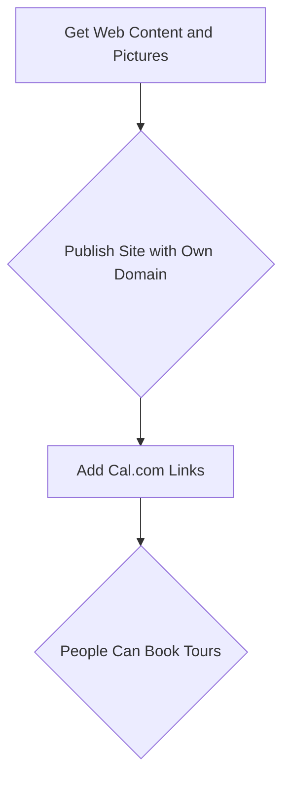

## Landing Page for Ourika

Astro Themes for inspiration on **Landing Pages**:

1. AstroZinc - https://astrozinc.exylons.com/

2. Luna Landing - https://github.com/JimmyCamus/luna-landing

* **Configurable** with a JSON!
* **MIT** | Template of a business landing page to be configured by json file `/src/data/landing.json`



* The fav icons works as configured with `"./public/favicon.svg"`

Which I could change *from png to svg* thanks to [adobe](https://www.adobe.com/express/feature/image/convert/png-to-svg) and provided `guideventure-logo.svg`

* The theme brings an **OG Image**, which equals to the first image of the landing.
* PagesSpeed: 100/100/100/100

> Compared with the competitor (WP) ~ping 30 vs ping ~300

<!-- 
https://pagespeed.web.dev/analysis/https-thingstodoinourika-com/guzs0y62la?form_factor=mobile
https://thingstodoinourika.com/ 
-->

* With [Cal.com](https://refer.cal.com/jalcocertech)


I needed to make few tweaks for the images to work (when they are at `public`)

```sh
sudo apt install webp

for file in *.jpg; do
  cwebp "$file" -o "${file%.jpg}.webp"
done
```

```sh
sudo apt install graphicsmagick-imagemagick-compat
convert tour1.webp -rotate 180 tour1_rotated.webp
```



It could be deployed quickly with CF Wrangler CLI:


Creating such view:



From [Travel](https://jalcocert.github.io/JAlcocerT/tech-for-a-trip/), to show your work, to helping others :)



**Other alternatives** explored were:

3. Minimal Studio
4. Sendit
5. [Energy Template](https://github.com/vbartalis/energy-template)




* https://taxiourika.pages.dev/
* https://github.com/JAlcocerT/taxi-web with the energy template



### The Result

* The Ourika site is hosted at: https://www.guideventuretour.com/
  * Source Code: https://github.com/JAlcocerT/ourika
  * Which leverage [cal.com](https://refer.cal.com/jalcocertech) for customer booking appointment and allow to the client to manage its own pricing/payment methods





---

## Conclusion

That was a one time setup, but one directional.

Im also exploring how these kind of themes do it so that it incorporates a KeystaticCMS:

**Update**

5. Mizar - https://github.com/majesticooss/mizar

* ✅ Localization
* ✅ Blog
* ✅ CMS for editing blog post (thanks to **Keystatic CMS**)
* ✅ PWA (thanks to vite-pwa)




# Keystatic CMS Integration in This Astro Theme

What is `keystatic.config.ts`?

The `keystatic.config.ts` file is the main configuration file for Keystatic CMS. It defines how content is managed, structured, and edited within your project. 

This file tells [Keystatic which collections](https://keystatic.com/showcase/marketing-landing-page) and [singletons](https://keystatic.com/docs/singletons) to manage, how fields are structured, where content is stored, and how the CMS UI should behave.

High-Level Configuration Options

- **storage**: Defines where and how content is stored (e.g., local filesystem, GitHub, etc.).
- **ui**: Controls branding and UI aspects of the CMS (e.g., logo, name, custom components).
- **singletons**: Defines single-instance content types (like global settings, header, footer, widgets), each with its own schema and storage path.
- **collections**: Defines repeatable content types (like posts, pages, works, authors), each with its own fields, schema, storage path, and options for previews and formatting.
- **fields**: Used within collections and singletons to describe the shape of each content entry (text, markdown, image, relationship, etc.).
- **custom components**: (Optional) For extending the editing experience with custom blocks or UI elements.

This configuration is the heart of your CMS setup. Editing it allows you to add new content types, change field structures, or adjust how content is organized and displayed in the Keystatic UI.

How Keystatic is Integrated

- **Keystatic is configured via `keystatic.config.ts` at the root of the repo.**
- The CMS manages content stored in the `src/content/` directory, organizing it into collections (e.g., `pages`, `posts`, `works`, `authors`) and singletons (e.g., `header`, `footer`, `widget`).
- Content is written in Markdown or JSON and edited visually via Keystatic's UI, which is powered by the configuration.
- The Astro theme loads content using standard Astro Content Collections, so changes made via Keystatic are reflected in the site automatically.
- Keystatic-related dependencies are listed in `package.json` (notably `@keystatic/core` and `@keystatic/astro`).

## Key Files for Keystatic Integration

| File/Directory                | Purpose                                                                 |
|------------------------------|------------------------------------------------------------------------|
| `keystatic.config.ts`         | Main Keystatic configuration. Defines collections, singletons, fields.  |
| `src/content/`                | All editable content managed by Keystatic lives here.                   |
| `package.json`                | Declares Keystatic dependencies.                                       |
| `.keystatic/` (if present)    | Keystatic icons and UI assets.                                          |

### Content Collections & Singletons
- **Collections**: `pages`, `posts`, `works`, `authors` (see `src/content/` subfolders)
- **Singletons**: `header`, `footer`, `widget` (see `src/content/global/`)

### How Content Flows
1. **Edit content** in the Keystatic UI (typically run locally).
2. **Content is saved** as Markdown/JSON under `src/content/`.
3. **Astro** loads this content at build time using its content collections.
4. **Site updates** automatically with new/edited content.

Customizing or Extending Keystatic
- Edit `keystatic.config.ts` to add new collections, fields, or singletons.
- Add new content files under `src/content/` or use the Keystatic UI.

References
- [Keystatic Docs](https://keystatic.com/docs)
- [Astro Content Collections](https://docs.astro.build/en/guides/content-collections/)

---
If you want to run the Keystatic CMS locally, make sure you have all dependencies installed and run the appropriate dev command (e.g. `pnpm keystatic dev` or check your scripts in `package.json`).




## High-Level Project Structure

Below is a Hugo-style filetree shortcode representation of the main structure of this Astro + Keystatic project:



  
    
      
      
      
      
      
      
      
      
      
      
      
    
  
  
  
  
  



6. https://github.com/majesticooss/mintaka

Currently this theme only works with the **premium version of GSAP**, the steps to use the standard version will be available in the future.

---

## FAQ

**What it is KeyStaticCMS?**

A tool that makes Markdown, JSON and YAML content in your codebase editable by humans.

Live edit content *on GitHub or your local file system*, without disrupting your existing code and workflows.

* https://keystatic.com/

> MIT | Content Management for your Codebase - https://github.com/Thinkmill/keystatic

**Using KeyStatic CMS** with [Mizar Astro Theme](https://github.com/JAlcocerT/mizar)

Once you install and run the dev server:

```sh
#git clone https://github.com/JAlcocerT/mizar

npm install
#rm -rf .git
npm run dev
```

You will see the regular `localhost:4321` to explore the theme

But also: `http://127.0.0.1:4321/keystatic/` is available.

```sh
npm run build
npx serve -s dist #http://localhost:3000 #from here /keystatic path wont be available as the server is not running
```

For existing sites, we have to:

1. **Add the keystatic integration** in your `astro.config.mjs` file:

The `output` field in your Astro configuration determines the fundamental rendering strategy for your entire site:

"static": Pre-render everything to static HTML at build time.
"server": Render pages on the server for each request.
"[hybrid](https://github.com/JAlcocerT/mizar/blob/main/astro.config.ts#L17)": Allows you to mix both static generation and server-side rendering on a per-page basis.

> The output field in your Astro configuration (astro.config.mjs or astro.config.ts) is not a mandatory field. [If not present](https://github.com/JAlcocerT/taxi-web/blob/main/energy-template/astro.config.mjs#L7), it will be considered `static`

When you want to plug in a CMS like Keystatic, the "hybrid" approach for your output configuration in Astro is generally the most recommended and flexible option. 

While you can use "static" with Keystatic, you'll need to ensure that your build process is triggered whenever content changes in Keystatic. This often involves setting up:

* Webhook integrations: Configuring Keystatic to trigger a rebuild of your Astro site on platforms like Netlify, Vercel, or others whenever content is updated.
* Manual builds: Manually triggering a build after content changes, which isn't ideal for a smooth content editing workflow.

```sh
#npm install keystatic
npm install @keystatic/core @keystatic/astro
```

```mjs
import keystatic from '@keystatic/astro'

// https://astro.build/config
export default defineConfig({
   integrations: [react(), markdoc(), keystatic()],
})
```

2. Create `keystatic.config.ts` in the root of the project and add the following code to define both your [storage type (local)](https://github.com/JAlcocerT/mizar/blob/main/keystatic.config.ts#L26), instead of [cloud](https://github.com/JAlcocerT/landingpad/blob/main/keystatic.config.tsx#L21). And a single content collection (posts).

```ts
// keystatic.config.ts
import { config, fields, collection } from '@keystatic/core';

export default config({
  storage: {
    kind: 'local', //or cloud one, depending on the theme and what you want
  },
  collections: {
    posts: collection({
      label: 'Posts',
      slugField: 'title',
      path: 'src/content/posts/*',
      format: { contentField: 'content' },
      schema: {
        title: fields.slug({ name: { label: 'Title' } }),
        content: fields.markdoc({ label: 'Content' }),
      },
    }),
  },
});
```