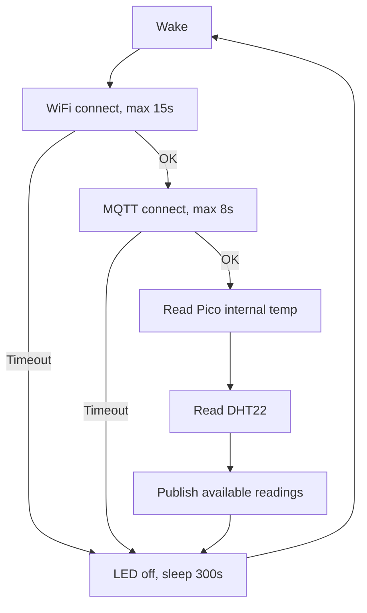

**TL;DR**

What if I'd had to study engineering again?

**Intro**

Those years were crazy: [calculus](https://jalcocert.github.io/JAlcocerT/calculus-101/) with the [Taylor Polynomials](https://jalcocert.github.io/JAlcocerT/genetic-algorithm-for-racing/#taylor-vs-splines) , [phase diagrams](https://jalcocert.github.io/JAlcocerT/2d-mbsd/#phase-portrait-analysis)

[algebra](https://jalcocert.github.io/JAlcocerT/algebra-101/)...

Now, some of my colleagues are married.

How have I ended up writing about heat transfer and electrical engineering?

Who knows :)

## Modelling 101

Before jumping to details...

Be aware of what you will be building on top of.

It helps if you use [open physics models](https://jalcocert.github.io/JAlcocerT/jalcocertech-services-snapshot/#open-physics)

## Mech

You might have heard about the 3 body problem:

```sh
git clone /ThreeBodies
cd ./ThreeBodies/ThePoincareLab

make deploy #https://the-poincare-lab.pages.dev/
```

[2D is a thing](https://jalcocert.github.io/JAlcocerT/2d-mbsd/)

But 3D mechanics has its unique magic.

https://jalcocert.github.io/JAlcocerT/ai-scripts-and-animated-data/#the-3-body-problem

$$\ddot{\vec{r}}_1 = -G m_2 \frac{\vec{r}_1 - \vec{r}_2}{|\vec{r}_1 - \vec{r}_2|^3} - G m_3 \frac{\vec{r}_1 - \vec{r}_3}{|\vec{r}_1 - \vec{r}_3|^3}$$

https://jalcocert.github.io/JAlcocerT/about-constrained-mechanism/#equations-of-motion-what-they-are-and-how-to-solve-them

**1st order**: $\frac{dx}{dt} = f(x, t)$ (velocity defined by position)

**2nd order**: $\frac{d^2x}{dt^2} = f(x, \dot{x}, t)$ (acceleration defined by position and velocity)

For mechanical systems, Newton's 2nd law gives us **2nd-order differential equations**:

$$m\ddot{x} = F(x, \dot{x}, t)$$

The Lagrangian approach gives us these same equations, but derived automatically from energy rather than force:

$$\frac{d}{dt}\left(\frac{\partial L}{\partial \dot{q}}\right) - \frac{\partial L}{\partial q} = 0$$

- **Kinetic Energy T**: Always comes from the *center of mass* velocity of each body, plus rotational motion

$$T = \sum_i \left(\frac{1}{2}m_i v_{cm,i}^2 + \frac{1}{2}I_i \omega_i^2\right)$$

- **Potential Energy V**: Comes from the *center of mass* height in gravity field, plus any other potential fields

$$V = \sum_i m_i g h_{cm,i} + V_{springs}$$




<!-- 
https://www.youtube.com/shorts/UjD94SGqIdM 
-->



<!-- 
https://www.youtube.com/shorts/IiuDQhFgmq4 
-->

### MBSD

Luckily Ive had a come back to this topic:

Tire Modelling has some interesting assumptions

At least with the honesty ~~unlike other disciplines~~ to call it [magic formula](https://jalcocert.github.io/JAlcocerT/kart-optimum-path/#pacejka-magic-formula)


  


```sh
git clone https://github.com/JAlcocerT/mbsd
```




### Fluids

Got a 101 [here](https://jalcocert.github.io/JAlcocerT/fluids/)

#### Aerodynamics

I was covering [some aero101 here](https://jalcocert.github.io/JAlcocerT/aerospace-101/)

Ive been wondering whats different between multirotors (drones) to fixed-wing aircraft like **ULMs (Ultralights/Microlights)** and **Gliders (Sailplanes)**.

The efficiency numbers jump into a completely different tier.

Multirotors must spend 100% of their power pushing air straight down to fight gravity. 

Fixed-wing aircraft use **wings** to generate lift from forward movement, so the engine only has to produce enough thrust to overcome **aerodynamic drag**.

The primary aerodynamic KPI for fixed-wing aircraft is the **Lift-to-Drag Ratio ($L/D$)**.

When translated into the same **$\text{g/W}$ (grams of supported mass per Watt of power)** metric used for drones, the comparison is striking:

```
[ FPV Drone ] ----> [ Camera Drone ] ----> [ ULM / Ultralight ] ----> [ Motorized Glider ] ----> [ Human-Powered Aircraft ]
  ~2.8 g/W            ~6.5 g/W                ~25–40 g/W                 ~120–160 g/W                   ~400 g/W

```

1. ULMs / Ultralight Aircraft

* **Lift-to-Drag Ratio ($L/D$):** $10:1 \text{ to } 15:1$
* **Equivalent Efficiency:** **$25 \text{ to } 40 \text{ g/W}$**

For every 10–15 kg of weight, an ultralight only needs about 1 kg of forward thrust to maintain level flight.

* **Real-World Example (Pipistrel Alpha Electro):**
* **All-Up Weight:** $400\text{ kg } (400,000\text{ g})$
* **Level Cruise Power:** $\sim 14\text{ kW } (14,000\text{ W})$ at $120\text{ km/h}$
* **Efficiency:** $\frac{400,000\text{ g}}{14,000\text{ W}} \approx \mathbf{28.5\text{ g/W}}$

2. Gliders / Sailplanes

* **Lift-to-Drag Ratio ($L/D$):** $35:1 \text{ to } 60:1$
* **Equivalent Efficiency:** **$120 \text{ to } 160+\text{ g/W}$**

<!-- 
https://www.youtube.com/watch?v=2GBuAHQ8Eu8 
-->




Modern composite sailplanes are the most aerodynamically refined machines on the planet.

With $L/D$ ratios around 45:1 or higher, a glider dropping at a rate of just 0.5 m/s travels 45 meters forward for every 1 meter it descends.

* **Real-World Example (Pipistrel Taurus Electro - Electric Motorized Glider):**
* **All-Up Weight:** $470\text{ kg } (470,000\text{ g})$
* **Sustaining Power Needed for Level Flight:** $\sim 3.2\text{ kW } (3,200\text{ W})$ at $85\text{ km/h}$
* **Efficiency:** $\frac{470,000\text{ g}}{3,200\text{ W}} \approx \mathbf{146.8\text{ g/W}}$

3. The Absolute Physics Ceiling: Human-Powered Planes

To see how high this metric can go, look at human-powered aircraft like the **MIT Daedalus 88**, which flew 115 km across the Mediterranean Sea:

* **All-Up Weight (Pilot + Aircraft):** $104\text{ kg } (104,000\text{ g})$
* **Power Output (Pilot pedaling):** $\sim 250\text{ W}$ continuous
* **Efficiency:** $\frac{104,000\text{ g}}{250\text{ W}} \approx \mathbf{416\text{ g/W}}$

| Aircraft Type | Primary Flight Metric | Power to Maintain Flight | Efficiency ($\text{g/W}$) |
| --- | --- | --- | --- |
| **Heavy FPV Drone** | Hover Thrust | $160\text{ W}$ for $0.45\text{ kg}$ | **$2.8\text{ g/W}$** |
| **DJI Mini 4 Pro** | Hover Thrust | $38\text{ W}$ for $0.25\text{ kg}$ | **$6.5\text{ g/W}$** |
| **Electric ULM** | $12:1 \text{ L/D}$ | $14,000\text{ W}$ for $400\text{ kg}$ | **$28.5\text{ g/W}$** |
| **Electric Glider** | $45:1 \text{ L/D}$ | $3,200\text{ W}$ for $470\text{ kg}$ | **$146.8\text{ g/W}$** |

There are really cool tinkerers out there:

https://www.youtube.com/@OpenSourceFPV

https://www.youtube.com/@rctestflight

https://www.youtube.com/@NicholasRehm/videos
https://www.youtube.com/watch?v=gZQEOjyjwhc


https://www.youtube.com/@thinkflight
https://www.youtube.com/watch?v=VCgpRQXFEaU

https://www.youtube.com/@RcLifeOn
https://www.youtube.com/watch?v=zP1nS3sIu2U


https://www.youtube.com/@NicholasRehm/videos who created https://github.com/nickrehm/dRehmFlight

#### FPV Design

If you have seen these awsome video series:

How about putting together a checklist with features and expected dron build behaviour?

```sh
cd ./poc/pwa-fpv-build

```

#### Came here for engines

For the PISTON engines (ICE) i mean.

Aint no replacement for displacement some say


https://www.youtube.com/watch?v=bWvv8Y4qhOA


https://www.youtube.com/watch?v=XctfCw4fKUg

https://www.youtube.com/watch?v=ZvdsGlxg2Bs

https://www.youtube.com/watch?v=1HqXs301_K8

https://www.youtube.com/watch?v=CJNhoSXvxYs

## Termodynamics

What can this help with?

How about sizing your house AC system?


### Heat Transfer

You can do very cool projects around this.

Want to transfer some heat from pipes?

Not a problem, get it simulated:

```sh

```

### Solar

When my x300 server disconnected and the emqx went down, my picoW got blocked and DHT22 info [got stucked like so](https://www.youtube.com/shorts/n2Fa_1YPhfk), until I [fixed this script](https://github.com/JAlcocerT/poc/tree/main/iot-rpi-dht/scripts-microcontrollers/firmware-picow):

```sh
# make flash-picow    #you can always go with Thonny portable!              
sqlite3 /home/jalcocert/poc/iot-rpi-dht-insulation/ingester/data/readings.sqlite "SELECT date(received_at) AS day, COUNT(*) AS rows, AVG(value) AS avg_value FROM readings WHERE metric = 'temperature' GROUP BY day ORDER BY day;"
```



Applied similar fix to [the esp32 deepsleep script](https://github.com/JAlcocerT/poc/blob/main/iot-rpi-dht/scripts-microcontrollers/firmware-esp32/esp32-dht11-mqtt-emqx-deepsleep.cpp)


## Electro Magn

[Electromagnetism](https://jalcocert.github.io/JAlcocerT/electromagnetism-101/) is a must have in your engineering toolbox.


### Signals and Telemetry

After mastering electro magnetism, you can derive [interesting fenomena like Friis](https://jalcocert.github.io/JAlcocerT/selfhosted-connectivity/)

> To go from that to throughput (mbps) you will need to plug also couple additional models

LoRa and ELRS are a thing

This is a great video around: **RF, Modulation, noise** and Lora *constrasting with WIFI connectivity!*



<!-- https://www.youtube.com/watch?v=ssmQkRkXE84 -->



ExpressLRS receivers utilize LoRa technology to achieve long-range communication, even in challenging environments like forests. 

By employing unique signal modulation techniques, these receivers can decode signals below the noise floor, allowing for impressive range capabilities compared to traditional systems.

Key points:

- ExpressLRS receivers can maintain connections over distances of up to 100 kilometers, even with obstacles like forests.
- Traditional Wi-Fi struggles with range due to higher frequency signals being easily blocked, while lower frequencies like 2.4 GHz used by ExpressLRS have longer wavelengths that penetrate obstacles better.
- Digital modulation techniques like FSK and QAM allow for higher data rates, but LoRa focuses on maximizing range by decoding signals below the noise floor.
- LoRa uses a "chirp" signal and Fast Fourier Transform (FFT) to extract frequency content, enabling it to filter out noise effectively.
- The video discusses four different ExpressLRS receivers, highlighting one that violates typical RF design rules by using a via for the antenna connection.
- The importance of impedance matching in RF design is emphasized, explaining how reflections can impact signal quality.

Notable quotes:

- "LoRa can decode signals below the noise floor. Even if you cannot see the LoRa signal, the receiver can still decode it."
- "Current flows in circles. The current that flows in the top trace to the antenna, well, an equal and opposite current must flow on the ground plane directly beneath it."



Which you can complement with:

<!-- 
https://www.youtube.com/watch?v=GK2pZ_oVU1o -->




### Circuits

More interesting effects around here.

Specially when you can simulate circuits and see that EMR kickback happen before you order and mount your components.

Thats the beauty of non-toy models: you can bet 

### Electronics

## Chemistry

https://jalcocert.github.io/JAlcocerT/making-soap-at-home/

$$
NaOH(s) \xrightarrow{H_2O} Na^+(aq) + OH^-(aq) + \text{heat}
$$

### Batteries

What?

This is a rabbit hole...


LiPo
Li-ion
LiFePo4


## Others


### Programming

Some say thats not pure engineering

I dont care at this point

If you are able to make a machine make something repeatable for you - you've won

### Embedded Systems

IoT is usually a subset or application area of embedded systems, but not all embedded systems are IoT.

A practical distinction:

* Embedded systems = computers built into devices to control hardware.
* IoT = embedded/networked devices that communicate with services, other devices, or the internet.

Examples:

- Embedded but not necessarily IoT: flight controller firmware, ESC firmware, washing machine controller, car ECU, microwave controller.
- IoT: ESP32 temperature sensor publishing MQTT, smart plug, Zigbee sensor, LoRaWAN tracker, Home Assistant-connected device.
- Overlap: an ESP32 running firmware that reads sensors and reports data over WiFi/MQTT is both embedded and IoT.

> Embedded is a broader parent category, with IoT, Drone, FPV, Firmware, MQTT, and Home Automation as more specific angles.

#### IoT

How is your energy/walls/sun or tomatoes experiment going?

- pico/temperature/dht22
- pico/humidity/dht22
- pico/temperature/internal
- esp32/temperature/dht11
- esp32/humidity/dht11

```sh
#curl -fsSL https://opencode.ai/install | bash
mosquitto_sub -h 127.0.0.1 -p 1883 -t 'pico/temperature/dht22' -v
mosquitto_sub -h 127.0.0.1 -p 1883 -t 'esp32/temperature/dht11' -v
```

when the setup is ready:

```sh
cd ./poc/iot-rpi-dht-insulation/ingester
#configure the mqtt host properly and
docker compose up -d && docker compose logs --tail 10
```

> `http://192.168.1.2:3011/`

You can check the latest readings at: `poc/iot-rpi-dht-insulation/ingester/data/readings.sqlite`

```sh
#mosquitto_sub -h 127.0.0.1 -p 1883 -t 'esp32/temperature/dht11' -v
sqlite3 -header -column /home/...readings.sqlite "SELECT * FROM readings ORDER BY received_ms DESC LIMIT 10;"
```

And this got me several (11) days without solar connection with the ESP32 having deep sleep and coming back every 60s:

```sh
sqlite3 /home/jalcocert/poc/iot-rpi-dht-insulation/ingester/data/readings.sqlite "SELECT date(received_at) AS day, COUNT(*) AS rows, AVG(value) AS avg_value FROM readings WHERE metric = 'temperature' GROUP BY day ORDER BY day;"

# sqlite3 /home/jalcocert/poc/iot-rpi-dht-insulation/ingester/data/readings.sqlite "SELECT MAX(received_at), MAX(received_ms), │ datetime(MAX(received_ms)/1000, 'unixepoch') FROM readings;"
```



<!-- https://youtube.com/shorts/n2Fa_1YPhfk -->


### Robotics

<!-- 
https://www.youtube.com/watch?v=_OpaEhzvRho 
-->



#### iot


<!-- 
https://www.youtube.com/watch?v=Tr_Pq89-BgA
https://www.youtube.com/watch?v=wPQf_Pz0APA
-->





#### Computer Vision

#### Drones/FPVs

ISDT 608AC charger


  


After 7min flight, i got 16.5mb of the flash with telemetry in the iflight with 1/4 1khz gyro scaled

Key findings from this log: 10 flight segments with the iFlight F722 TwinG. Coasting power ranges 50-174W depending on segment. Motor model fit: RMSE 6.6A,

Coasting power is nearly identical (~166W) suggesting the same battery/motor setup (with vs w/o cam)

> By contrast the meteor needs 10w with ~50g

Wanna experience pure Power/Weight?

~~Get~~...

I mean BUILD a drone

Ive experimented around:

* Meteor 75 pro with up to ~100w with ~50g
* Eachine with up to ~400w
* iFlight F722 with up to ~1kw (crazy, >1hp)

There is a lot of OSS around drones: https://github.com/betaflight/betaflight-configurator which is a PWA `https://app.betaflight.com/`

From the [welcome sound to edgeTX](https://github.com/EdgeTX/edgetx-sdcard-sounds)

A drone setup is not “one firmware”

It is usually: `EdgeTX for RC -> ExpressLRS for TX and RX -> Betaflight / dRehmFlight for FC -> ESC firmware -> motors/servos`

So a bad behavior can come from the radio model, RF link, receiver protocol, UART setup, flight-controller modes, mixer, failsafe, ESC config, or physical build.

##### Dron BOM

Wanna get into drons?

let me give you the bom and the price (going up, so that you dont get dissapointed with prices)

1. radiomaster pocket - 100$
2. 18650 (x2) batteries for the RC - 10$
3. meteor 75 pro - 150$ which brings to LiPo batteries

With those 2, you can fly as the dron pack comes with couple of batteries and a charger :)

The RC can charge the 18650 batteries, so no worries there.

Getting the right throtle levels is tricky

After you get that right, you'll have fun and probably consider a bigger project... 

like I did with the other 2 mentioned FPVs

You can get interesting second hand deals and test them properly with telemetry when they arrive:

Like an used Cidora for 150$ or a for 130$

Then...you will need some batteries and proper charger:

4. I got a NOVA 608AC *which apparently waited 2 years from production to be in my hands*

5. And some 4s batteries: 

To go all in, you'll also need some gogles, deciding beween analog and digital.

For now, i just mounted my oa5 into a dron:

##### DRON Telemetry RCA

Get ready to break some parts!

This is what happened to my `iflight f722` propeller as per the 19/32mb logs from the half battery ovonic packs and the one that accidentally died after 2/7min of expected flight 

```sh
make telemetry TELEMETRY_DECODED=BTFL_BLACKBOX_LOG_20260727_082759_IFLIGHT_F722_TWING_decoded.json LOG_INDEX=2
TELEMETRY_LONGEST=0 DURATION=0 FPS=30
#make imu-video │ IMU_DECODED=BTFL_BLACKBOX_LOG_20260727_082759_IFLIGHT_F722_TWING_decoded.json LOG_INDEX=2 │ DURATION=0 FPS=30 IMU_SIZE=1280x720
```

Get the **best offset** that matches the action cam with the acelerometer:

```sh
 python sync_offset_estimator.py `                                                             
    --decoded BTFL_BLACKBOX_LOG_20260727_082759_IFLIGHT_F722_TWING_decoded.json `               
    --video iflight-26jul/DJI_20260726095445_0040_D.MP4 `                                       
    --log-index 2 `
    --min-offset-s 0 `                                                                          
    --max-offset-s 30 `                                                                         
    --compare-s 105 `                                                                           
    --video-fps 8 `                                                                             
    --step-s 0.125 
```

Then just:

```sh
make telemetry-overlay VIDEO=iflight-26jul/DJI_20260726095445_0040_D.MP4 TELEMETRY_MP4=BTFL_BLACKBOX_LOG_20260727_082759_IFLIGHT_F722_TWING_imu_video_s2_101s.mp4
VIDEO_OFFSET=9 COMPOSITE_OUT=DJI_20260726095445_0040_D_with_imu.mp4                
                                                                               
make telemetry-overlay VIDEO=iflight-26jul/DJI_20260726095445_0040_D.MP4
TELEMETRY_MP4=BTFL_BLACKBOX_LOG_20260727_082759_IFLIGHT_F722_TWING_telemetry_s2_101s.mp4
VIDEO_OFFSET=9 COMPOSITE_OUT=DJI_20260726095445_0040_D_with_telemetry.mp4          
```



<!-- 
https://youtu.be/4opTp09Ne7A -->


## T-Shape Engineering

Wanna build end to end?

### Product Mindset

Experiments, self-funded R&D and just building is great

Unless you have the expectations that somebody will care and buy the thing that only matters to you

> Plot twist: there does not seem to be an unified/deterministic value of things. 

> > World experience and [pricing is subjective](https://jalcocert.github.io/JAlcocerT/real-estate-website/#pricing-strategy) 

But dont panic, you can A/B test to see what people wants you to build

Wants as in: wanna pay for

Aka: revealed preferences

Believe it or not, marketing matters to fund your R&D: 

<!-- 
https://www.youtube.com/watch?v=fze6k9rdcrU 
-->




Yep, im assuming you got the *Unit Economics* in your radar:

```

```

After mastering step 3, how about 1 and 2?

Attract -> Convert -> Deliver


---

## Conclusions




<!-- 
https://www.youtube.com/watch?v=evCUEQrAkn0 -->


All models are wrong, some are useful


So all of this to be able to dedicate your work life to be an engineer?


Maybe, think first [about your Ikigai](https://jalcocert.github.io/JAlcocerT/ideas-to-execution-with-dao/#about-ikigai)

If you want a money/effort focused career, there are definitely better ways.

Specially when you understand that engineering / R&D is part of Opex:

$$
P \times V \times GM \times OM \times IF \times T
$$

Yes, all your greatness is a expense without a certain ROI for someone.


In the meantime, you can measure instead of model, prepare the [ULM exam](#about-ulm-flights) or upskill with:


  
  


---

## FAQ

### Which engineering is for me?

Are you aware on how priviledge we are to be able to choose our hard?

* https://www.chartjs.org/docs/latest/axes/radial/

### About ULM and flights

* **ULM (Ultralight Pilot License):** A national recreational license for flying small sport aircraft (up to 600 kg) under day visual conditions.

* **CPL (Commercial Pilot License):** A professional EASA/ICAO license allowing you to get paid to fly as a pilot-in-command of single-pilot aircraft or first officer on commercial flights.

* **ATPL (Airline Transport Pilot License):** The highest tier of pilot certification, legally authorizing you to act as Captain (Pilot-in-Command) on multi-crew commercial airliners.

* **PPL** (Private Pilot License): An internationally recognized EASA/ICAO license that allows you to fly certified aircraft (like a Cessna, Piper, or Cirrus) and carry non-paying passengers anywhere in the world non-commercially.