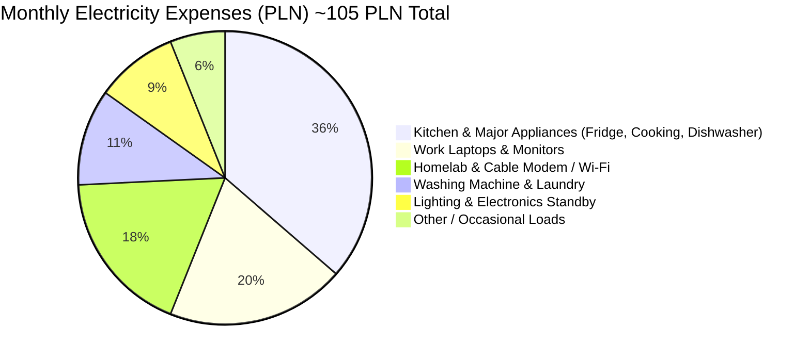
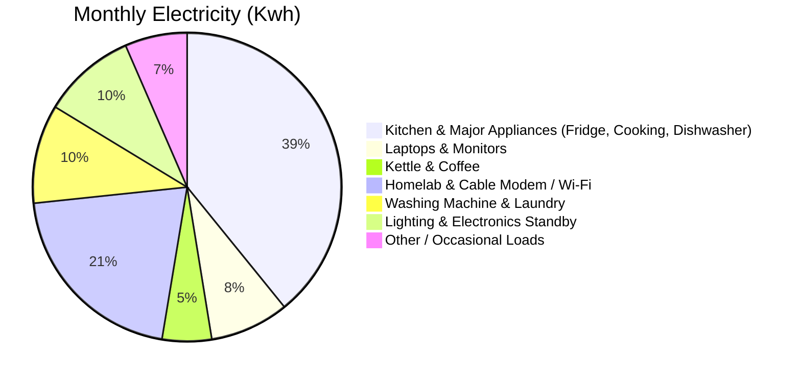

**Tl;DR**

One of those things in the bucket list of every tinkerer

**Intro**

* WHY Im writting this post: *bc Im done with the first watering setup version and I need proper encapsulation*
* What [Ive learnt](#conclusions) with it: *Ive ended making additional learnings around the watering setup: from voltage divider, measuring A/V/P from a solar panel, going from the original 3s to consider a 5v panel and 1s/1s2p*

I was trying to document myself on forums, like [fc](https://forocoches.com/foro/showthread.php?t=10360182) and reddit.

<!-- 
https://youtu.be/d6PyYCBft44?si=vsgHCiL2k2Fswwxd 
-->

* https://github.com/fluidd-core/fluidd

> gpl 3.0 | Fluidd, the klipper UI.



## Choosing a Printer

People recommended me: [Prusa](https://www.prusa3d.com/) or BambuLabs

* https://www.prusa3d.com/page/how-to-choose-a-3d-printer_229126/

> There has been some controversy about bambu printers this year



I found interesting the following resources:

* https://all3dp.com/2/3d-printing-for-beginners-all-you-need-to-know-to-get-started/
* https://www.prusa3d.com/page/basics-of-3d-printing-with-josef-prusa_490/
* https://www.reddit.com/r/3Dprinting/wiki/gettingstarted/
* https://www.reddit.com/r/prusa3d/comments/1eau9je/give_it_to_me_prusa_vs_bambu/
* https://www.reddit.com/r/BambuLab/comments/1cqn7ua/why_bambu_over_prusa_specifically_p1s_vs_prusa_mk4/

1. Type of 3D Printer (Technology)

- **FDM (Fused Deposition Modeling):** 
  - Uses [filament](https://www.prusa3d.com/category/filament/).
  - Great for functional prototypes, larger objects, and lower-cost printing.
  - Suitable for most hobbyists and general users.
- **SLA (Stereolithography):** 
  - Uses resin.
  - Offers higher resolution, ideal for intricate details like miniatures, jewelry, or dental models.
- **Other Technologies (e.g., SLS):** 
  - Mainly for industrial applications.
  - Typically more expensive and complex.

**Recommendation:** If you're a beginner or hobbyist, an FDM printer is usually a good starting point.

2. Build Volume

- **What to Know:** Build volume refers to the maximum size of objects you can print. Larger build volumes allow you to print bigger objects in one go, but they also mean a bigger, often more expensive printer.
- **Questions to Ask:** What size do you need? Are you printing small, intricate models or larger prototypes?

3. Print Material Compatibility

- **FDM Materials:** PLA, ABS, PETG, and flexible filaments like TPU.
- **SLA Materials:** Different types of resins (standard, tough, flexible, etc.).
- **What to Know:** Each material has different properties (strength, flexibility, temperature resistance), and some printers handle specific materials better. Ensure the printer supports the materials you intend to use.

4. Resolution and Print Quality

- **Layer Height:** The smaller the layer height, the finer the print details. 
  - FDM printers: 0.1-0.3 mm.
  - SLA printers: As low as 0.025 mm.
- **What to Know:** Higher resolution usually means longer print times. If detail is crucial, SLA might be better; otherwise, FDM offers a good balance.

5. Ease of Use

- **What to Know:** Some 3D printers are more user-friendly, especially for beginners, while others require advanced knowledge for calibration, maintenance, or troubleshooting.
- **Features to Look For:** Auto-bed leveling, filament sensors, touchscreen interfaces, and good support/documentation can make the printer easier to use.

6. Cost

- **Upfront Cost:** Includes the printer’s price, assembly (if 
you choose a kit vs. pre-assembled), accessories, and upgrades.
- **Operating Costs:** Filament or resin, replacement parts (nozzles, print beds), electricity, and time spent troubleshooting.
- **What to Know:** An affordable printer may be enticing, but factor in long-term costs and reliability. Mid-range printers (like Prusa i3 MK4) often offer better durability and support, reducing headaches over time.

7. Post-Processing

- **What to Know:** Some printers, especially SLA, require post-processing (e.g., cleaning and curing). For FDM, you might need to remove supports and sand the prints. Consider how much post-processing effort you’re willing to handle.

8. Community and Support

- **What to Know:** A strong user community and customer support can be invaluable, especially if you're new to 3D printing. 
- **Check:** Does the manufacturer provide regular software updates? Is there an active forum or helpdesk for troubleshooting?

9. Software Compatibility

- **Slicing Software:** Most 3D printers use slicer software to convert 3D models into G-code instructions.
- **What to Know:** Ensure the printer supports widely-used, open-source slicers like PrusaSlicer, Cura, or others. Check if the printer's software is easy to use, frequently updated, and supports various file formats (STL, OBJ, 3MF).

10. Print Speed

- **What to Know:** Faster printing speeds save time, but they can reduce print quality, especially on complex objects. FDM printers typically print slower than SLA printers, but this varies based on the model and settings.

- **For Beginners:** Focus on ease of use, price, and material compatibility. The **Prusa Mini+** or **i3 MK4** are great choices.
- **For Professionals or Enthusiasts:** Look into build volume, resolution, and software features. Consider a **Prusa XL** for FDM or an **SL1S Speed** for SLA printing.



### Why I wont buy one

In one word: time

Ive been happy with the couple of orders I made here

The lead time is a thing, but this is not my main life focus.

The avg costs I got on my orders: **eur per g**

I can imagine that having your own one goes with: initial capex + material + setup time + electricity




| **Category**               | **Item**                      | **Expected Price (USD)**     |
|----------------------------|-------------------------------|-----------------------------|
| **Primary Consumables**     | Filament                      | $20 - $50 per kg            |
|                            | Resin                         | $50 - $150 per liter        |
| **Operational Costs**       | Electricity                   | Varies (Typically $5 - $20 per month) |
|                            | Nozzles                       | $5 - $20 each               |
|                            | Print Bed Adhesives           | $5 - $15                    |
| **Maintenance Costs**       | Lubricants                    | $5 - $15                    |
|                            | Build Plates/Print Beds       | $20 - $60                   |
|                            | Replacement Parts (e.g., belts, fans, extruders, hot ends) | $10 - $100+ depending on the part |
| **Post-Processing Supplies**| Sandpaper                     | $5 - $20                    |
|                            | Isopropyl Alcohol (IPA)       | $10 - $30 per gallon        |
|                            | Curing Materials (UV light, curing stations) | $30 - $200+ depending on the setup |



As long as I place 50$/h as opportunity cost, the DFY option wins in price

I miss the learnings *for now* though

## 3DPrint Designs



* https://www.printables.com/es
* https://thangs.com/
* [maker world](https://makerworld.com/en/3d-models)
* ThingyVerse like https://www.thingiverse.com/thing:455324

> STL files! and you can do cool thinks like [this miniPC of ~1.2L](https://www.youtube.com/watch?v=_Euus3cum5k)

* https://www.reddit.com/r/3Dprinting/comments/1ep78yx/is_thingiverse_still_the_standard_place_to_get/
* https://www.reddit.com/r/3Dprinting/comments/ozg8xj/creality_vs_prusa_3d_printers/
* https://teachingtechyt.github.io/calibration.html



What cool things you can do? How about a **3d printed Hydrofoil**?



> It seems they used Prusa for it

https://www.youtube.com/watch?v=Iz0Ar_6GvfA&t=1062s

https://www.youtube.com/watch?v=mJlxe6rJkAk

### Software for DYI Designs

Prusa 3D printers primarily require files in G-code format for printing. 

**G-code** is the standard language used by most 3D printers to control the movements of the printer's components and manage the printing process.

* Model File Formats: STL, OBJ, 3MF (input files for slicing).
* Print File Format: G-code (file format used by Prusa printers to execute the print).

* I made some notes on [how to install some design programs](https://jalcocert.github.io/Linux/docs/debian/foss_engineering): Blender, FreeCad, OpenSCad

* https://github.com/nkallen/plasticity?tab=readme-ov-file

* Slice the Model:
    * Use a slicer software like PrusaSlicer to convert your 3D model file (e.g., STL, OBJ, or 3MF) into G-code.
    * Other Software: Slic3r, OctoPrint, Cura, Repetier-Host


* https://www.hackster.io/news/tom-stanton-3d-prints-an-ebike-conversion-kit-without-any-electronics-b081d2c8b598


These were *My 3D Printing Plans* early 2026:

Can't wait to make some mechanism design and see it work.

* There is an **awsome project by Gabemorris12** - https://github.com/gabemorris12/mechanism
    * ...which I forked and have pending to [give it a serious trial](https://github.com/JAlcocerT/mechanism)
* Most likely I will start with [a simple, yet useful Slider-Crank](https://github.com/JAlcocerT/Slider-Crank)

> If you like mechanism, you can have a look at my [Bicycle Dynamics Simulator](https://github.com/JAlcocerT/Bike_dynamic_simulator)

But...

### Manufacturing

#### 3D Printing

Which is a way of ~~design for~~ Manufacturing

I send my first prints here for a fpv stand and [got some learnings](https://github.com/JAlcocerT/poc/blob/main/blender/dron-standing-fea/z-learnings.md)

I made [a second order batch of prints](https://github.com/JAlcocerT/poc/blob/main/blender/order2.md) with interesting elements I found at thingyverse/makerworld with some minor edits

And I also made a custom encapsulation for the [automatic water power stage](https://github.com/JAlcocerT/poc/tree/main/iot-esp-water/esp32-cpp-mqtt-pump/power-stage-104)

I ordered the pcb I designed with KiCad CLI at `https://tspcb.pl` and got it in 8 days.

* https://github.com/diodeinc/pcb


For the tweaked FPV stand i used PETG and for the ESP covers PLA which gave very fined finished


### Prusa + Raspberry Pi

<!-- https://www.youtube.com/watch?v=qQmQ9ZpvHUo -->

<!--  -->



---

## Conclusions

Some people have businesses around 3dprinting:

<!-- https://www.youtube.com/watch?v=RyKvEcgcswg&t=123s -->




<!-- https://www.youtube.com/watch?v=o7qwIwoveA4 -->





### 3d Print x Power Stage

After making work in a bread->protoboard->PCB [this water pump power stage](https://github.com/JAlcocerT/poc/tree/main/iot-esp-water/esp32-cpp-mqtt-pump/power-stage-104)

Putting together a 3d print encapsulation was the obvious next step:

### mbsd

Coming from [the 0-7-0 release](https://jalcocert.github.io/JAlcocerT/jalcocertech-services-oct/#mbsd), its time for the 0-8-0.


Updating the [pwa](https://jalcocert.github.io/JAlcocerT/betaflight-dron-telemetry/#creating-a-pwa), creating the wheels locally has been interesting

```sh
#scp jalcocert@192.168.1.2:/home/jalcocert/multibody-tests/*.md . #v-0-5-0-concerns.md
scp jalcocert@192.168.1.2:/home/jalcocert/multibody-tests/v-0-5-0-concerns.md . 
```

I got inspired by this project roadmap: `https://dbackup.app/roadmap/`

{}


```sh
#http://192.168.1.2:3034/hermesagent/mbsd/src/branch/oss-core-2d/web
cd /home/jalcocert/Desktop/mbsd-framework/mbsd-core

git switch main
git merge --ff-only v0.6.0-dev
git tag -a v0.6.0 -m "MBSD Core v0.6.0"
git push origin main
git push origin v0.6.0

awk '
  /^## v0\.6\.0 / { found=1; next }
  /^## / && found { exit }
  found { print }
' CHANGELOG.md | gh release create v0.6.0 \
  --repo JAlcocerT/mbsd-core \
  --verify-tag \
  --title "MBSD Core v0.6.0 - Experimental 3D Vocabulary" \
  --notes-file - \
  --latest
```

Then examples:

```sh
cd /home/jalcocert/Desktop/mbsd-framework/mbsd-examples

git switch main
git merge --ff-only v0.6.0-dev
git tag -a v0.6.0 -m "MBSD Examples v0.6.0"
git push origin main
git push origin v0.6.0

awk '
  /^## v0\.6\.0 / { found=1; next }
  /^## / && found { exit }
  found { print }
' CHANGELOG.md | gh release create v0.6.0 \
  --repo JAlcocerT/mbsd-examples \
  --verify-tag \
  --title "MBSD Examples v0.6.0 - Diagnostics and Validation" \
  --notes-file - \
  --latest
```

The remaining roadmap:

2. 0.8.0: limited unconstrained, fixed-orientation translational dynamics.
3. 0.8.1: Mechanism.spatial() constrained-kinematics preview.
4. 0.8.2: fixed-orientation constrained translational dynamics.
5. 0.9.0: real rotational dynamics and orientation integration.
6. 0.9.1: rotational joints, forces and torques.
7. 0.9.2: 2D/3D API symmetry, documentation and API freeze.
8. 1.0.0: stable minimal 2D/3D kinematics and dynamics.

{}


> I couldnt avoid to email again to [Gabe Morris](https://github.com/gabemorris12/mechanism) :)

> > And email to `https://selfh.st/submit/`


There are other oss fwks with interesting potential to have a look:

* https://www.mbdyn.org/
  * https://github.com/zanoni-mbdyn/blendyn

MBDyn (https://www.mbdyn.org/) graphical post-processor for blender (https://www.blender.org/)

* Some people put together mbd x fem - https://mbdfem.com/ 
- Project Chrono/PyChrono
- Exudyn
- Siconos
- OpenModelica
- MBDyn
- preCICE

https://www.youtube.com/watch?v=NxZ1tf8J1oY

https://www.youtube.com/watch?v=4_Z05iMmDNU

https://www.youtube.com/watch?v=eFGkopoCTYY


#### 3D Printing x MBSD x Synthesis

https://jalcocert.github.io/JAlcocerT/2d-mechanism-synthesis/


#### Compliant Mechanisms

Dynamics is trickier when **solids are flexible** -- *aka when we stop saying that they are infinitely rigid*.

---

## FAQ

Very interesting video: western vs eastern design - https://www.youtube.com/watch?v=8UAsN9wvePE

* https://forocoches.com/foro/showthread.php?t=8677592
* https://forocoches.com/foro/showthread.php?t=6621713

### Designs as Code

1. **GIMP with python** - https://docs.gimp.org/2.10/en_GB/gimp-filters-python-fu.html

Before we start writing Python scripts in GIMP, we need to install the `Python-Fu` plug-in. 

This plug-in enables GIMP to run Python scripts.

2. **FreeCAD with Python** - https://wiki.freecad.org/Python_scripting_tutorial
    * Query2CAD: [Generating CAD models using natural language queries](https://arxiv.org/html/2406.00144v1)

### Free Software for 3D Printing

This is Onshape, a cloud-based 3D computer-aided design (CAD) software by PTC.

But why would you use it, when you have OSS:

1. **OctoPrint** - https://octoprint.org/
    * https://github.com/OctoPrint/OctoPrint
    * https://www.raspberrypi.com/tutorials/set-up-raspberry-pi-octoprint/
    * https://depau.github.io/3dprint-wiki/wiki/hardware/octoprint-devices/


  


> The snappy web interface for your 3D printer.

* **Klipper** - https://github.com/Klipper3d/klipper

>  Klipper is a 3d-printer firmware 

### Other DIY Stuff

* Someone made a [**3D Printed HydroFoil** and shared it in this YT Video](https://www.youtube.com/watch?v=Iz0Ar_6GvfA)

* [Micro Racer Car](https://github.com/StuckAtPrototype/Racer)
  * https://www.youtube.com/watch?v=6jzG-BMannc


ESP32 - https://www.cnx-software.com/2024/07/25/tinywatch-s3-is-an-open-source-customizable-smartwatch-powered-by-esp32-s3-soc/

<!-- https://github.com/hominoids/SBC_Case_Builder

https://www.cnx-software.com/2024/04/30/sbc-case-builder-v3-0-can-create-thousands-of-cases-for-popular-sbcs-and-standard-motherboards-mini-itx-pico-itx-nuc/ -->

<!-- 
https://github.com/dune3d/dune3d -->


https://mariushosting.com/synology-best-docker-containers-for-3d-printers/

---

## Conclusions

Blender

What can you use 3D printing for IRL?

From here...

Whats stopping us to buy a **3-axis CNC machine**?

Or a [kiln](https://fossengineer.com/raspberry-pi-kiln-controller/) and cast with your Pi?

Go from `so what` to a clear picture:


  
  


### Water Setup Updates

Coming from:

```sh
cd ./poc/iot-dashboard-v2
#make zigbee-up #make zigbee-logs #lsusb #ls -l /dev/serial/by-id
#http://192.168.1.2:8081/#/devices

make docker-up
#mosquitto_sub -h 192.168.1.2 -t "esp32/#" -v

docker run --rm --network host eclipse-mosquitto:2 \
  mosquitto_sub -h 192.168.1.2 \
  -t 'esp32/#' \
  -v

#make mqtt-live #It listens to esp32/#, pico/#, and zigbee2mqtt/#
#To filter:
make mqtt-live MQTT_TOPIC='esp32/#'
#It automatically uses Docker when mosquitto_sub isn’t installed.
```

It is implemented and running at `http://192.168.1.2:3038`.

> Where I had [zigbee2mqtt](https://github.com/JAlcocerT/poc/blob/main/iot-dashboard-v2/docker-compose-zigbee.yml) and emqx gathering data into [this v2 dashboard](https://github.com/JAlcocerT/poc/tree/main/iot-dashboard-v2)

deploy from the repository on 192.168.1.2, then open: `http://192.168.1.2:3038` → Energy

SQLite is compatible:

- No tables are dropped or replaced.
- New readings use the existing table.
- Missing columns/tables are added automatically.
- Docker rebuilds preserve the bind-mounted data/ directory.

On the homelab:

```sh
# Ensure .env contains:
FEATURE_POWER=true
make docker-up
```

Important: when transferring/pulling the code, do not overwrite the homelab’s live `data/readings.sqlite`.

A backup before deployment is still sensible. Retained MQTT battery values should appear shortly after startup.


I went from the [esp32 x dht11 deeper sleep script](https://github.com/JAlcocerT/poc/blob/main/iot-rpi-dht/scripts-microcontrollers/firmware-esp32/esp32-dht11-mqtt-emqx-deepersleep.cpp) to [this one](https://github.com/JAlcocerT/poc/blob/main/physics-electronics/voltage-divider/Makefile) that also provides the 1s voltage thanks to a simple [voltage divider](https://github.com/JAlcocerT/poc/blob/main/physics-electronics/voltage-divider/index.html)


It was so obvious to just bring also the data


---

## FAQ

### Energy

[Energy density](https://jalcocert.github.io/JAlcocerT/thermodynamics/#energy-density-calculation-heating-from-20c-to-90c) matters and not just for [gasoline vs batteries](https://jalcocert.github.io/JAlcocerT/understanding-batteries/#battery-vs-gasoline)

> http://192.168.1.2:3038/?tab=energy

But also for your home clean energy setup for all those hours where you have more inputs than consumptions.

On top of the sensors ive been working with to measure instead of modelling, ill be adding soon a Shelly as per [this fantastic blog i found](https://blog.bartzz.com/hybrid-gas-and-boiler-hot-water-with-solar-power/).

For my home, ill go with a *Shelly Pro EM-50* instead




Data to validate: `https://pvgis.com/es` era5


The author in the blog post is using the **classic Shelly 3EM** (Gen 1).

Here are the key differences between that device and the **Shelly Pro EM-50** recommended for your apartment:

---

Comparison: Classic Shelly 3EM vs. Shelly Pro EM-50

| Feature | Shelly 3EM (from the blog post) | Shelly Pro EM-50 (Recommended for you) |
| --- | --- | --- |
| **System Type** | **3-Phase (L1, L2, L3)** | **1-Phase (Single-Phase)** |
| **Why the author uses it** | He owns a detached house with rooftop solar panels (5.4 kWp) connected to a **3-phase grid supply**. | You have a standard apartment fed by a **single-phase supply**.

 |
| **Measurement Channels** | **3 independent lines** ($3\times$ 120A clamps) | **2 lines** on the same phase ($2\times$ 50A clamps) |
| **Physical Width (DIN)** | **Wide (~2 DIN modules / ~36 mm)** | **Narrow (1 DIN module / ~18 mm)** |
| **Fit in your panel** | Would take up the **entire blank space** on your rail, leaving zero room for anything else.

 | Takes up **only 1 slot**, leaving 1 slot completely free.

 |
| **Hardware Generation** | **Gen 1 (Older generation)**<br>

<br>• Wi-Fi only (no Bluetooth)<br>

<br>• Slower ESP8266 processor | **Gen 2 / Pro Line (Modern)**<br>

<br>• Wi-Fi + Bluetooth + RJ45 Ethernet port<br>

<br>• Faster ESP32 processor with scripting support |
| **Wiring Complexity** | Requires connecting 3 separate phase voltage wires ($V_A, V_B, V_C$) plus Neutral. | Needs only **1 Live wire + 1 Neutral wire** to power and reference. |

The author used a **Shelly 3EM** because his detached house receives all 3 phases from the street, and his solar inverter pushes power across all three lines.

For your apartment panel, which is strictly **single-phase**:

* The Shelly 3EM would be overkill and awkward: you would leave two of its measurement channels completely disconnected.
* The **Shelly Pro EM-50** is newer, fits your 1-phase supply natively, takes up only half the space on your DIN rail, and connects with significantly simpler wiring.



No excuses to better understand your utility bill and comsumption patterns


Under European grid regulations (IRiESD), grid operators place a hard legal cap on single-phase solar feeds:

* **Under or equal to 3.68 kWp:** You can install solar on a **single-phase connection**.
* Why $3.68\text{ kW}$? Because $230\text{ V} \times 16\text{ A} = 3,680\text{ W}$. The grid operator will not allow a single inverter to inject more than 16 Amps onto one phase to prevent local voltage spikes.
* A 3 kW to 3.6 kW system produces roughly **3,000 to 3,500 kWh per year**, which is enough to cover the annual electrical demand of most typical apartments or small homes.

* **Over 3.68 kWp:** By law, you **must upgrade to a 3-phase connection** and install a 3-phase inverter.

* The author from the blog post has a **5.4 kWp** system, which legally forced him to use a 3-phase inverter and a 3-phase meter like the Shelly 3EM.

* **Balcony Solar (Mikroinstalacja balkonowa):** If you are considering balcony solar panels (1 or 2 panels, usually 400W–800W plugged directly into an outlet via a micro-inverter), these are **100% single-phase**.



How have I merged the watering, dht and solar panel estimation with **INA226 I2C**?


The INA226 handles both tasks directly on silicon: I and V

1. **No External Voltage Divider Needed:**
* The INA226 has an internal, laser-trimmed precision resistor divider connected to its `VBUS` pin.
* It handles input voltages up to **36V DC** natively. Since your 12V 5W panel only peaks at ~22V open-circuit, you wire the panel's positive lead straight into `VBUS` (bridged to `IN+`). You don't need any external resistors to protect the ESP32's ADC.

2. **No External Load Resistor Needed (When Using the CN3722 MPPT Board):**
* The MPPT charger board itself acts as the active load.
* The CN3722 actively pulls current from the panel to charge your 3S battery while holding the panel at its optimal ~18V knee.
* The INA226 simply sits in-line between the panel and the charger, measuring the power as it passes through.


MPPT chooses the panel point, but [CC/CV](https://github.com/JAlcocerT/poc/tree/main/physics-electronics/cc-cv-cn3722) can [charge the battery safely](https://github.com/JAlcocerT/poc/tree/main/physics-electronics/battery-chargers) with the esp32



I had to put this power conversion together to understand thefull flow


MPPT and PWM answer different questions.

**MPPT asks**: “where should the panel operate?”

MPPT is a goal plus a control algorithm: measure panel voltage/current, then adjust the converter so the panel runs near maximum power. It can be dynamic tracking or a simpler fixed-voltage approximation such as the adjustable CN3722 target.

**PWM asks: “how is a switch driven?”**

PWM is a switching waveform: turn a switch on and off with a varying duty cycle. It can regulate a buck converter, dim an LED, run a motor, or pulse a panel connection.

PWM alone says nothing about whether maximum panel power is being tracked.

MPPT does not inherently mean PWM, though practical switch-mode MPPT  chargers usually use PWM-like MOSFET switching.

- PWM does not imply MPPT.
- PWM does not inherently require a MOSFET; it is a control method. MOSFET sare simply the normal efficient switch for your low-voltage solar/buck/boost hardware.

Typical bucks dont typically provide Li-ion CC/CV charging sequence, charge termination, temperature handling, or solar MPPT.


IC stands for Integrated Circuit.
      
It is a tiny semiconductor chip containing many electronic components— transistors, resistors, logic, amplifiers—fabricated together on one piece of silicon.

Examples from your project:

- TP4056 / TC4056: 1S Li-ion charger IC
- INA226: voltage/current/power measurement IC
- CN3722: solar battery-charger IC
- The unknown chip on the 3S BMS: cell-monitor/protection IC
- ESP32: microcontroller IC   

**What Reads the Current Instead?**

The current-sensing resistor is already physically soldered onto the INA226 breakout board.

If you look closely at the module, you will see a small, flat black rectangle labeled **`R100`** sitting right between the `IN+` and `IN-` screw terminals/pads. That is a **$0.1\,\Omega$ precision shunt resistor**. The chip measures the tiny millivolt drop across that component to calculate the amperage.

**The Entire Minimal Circuit**

For measuring the solar generation, the component count drops to just the modules themselves:

* **Panel $(+)$** $\rightarrow$ `IN+` & `VBUS` (bridge them together on the INA226)
* `IN-` $\rightarrow$ `IN+` on the CN3722 charger
* **Panel $(-)$** $\rightarrow$ `IN-` on the CN3722 charger
* **INA226 I2C pins** (`SDA`, `SCL`, `GND`, `VCC`) $\rightarrow$ Straight to the ESP32

No loose resistors, no breadboard dividers, and no ADC calibration code needed.

The INA226 wasn't built exclusively for solar panels—it is a **general-purpose, bidirectional DC power monitor**. 

Measuring battery charge and discharge is actually one of its primary design use cases.

**Why It Works for Battery Monitoring**

1. **True Bidirectional Current Sensing:**
* The INA226 can measure current flowing in **both directions** through its onboard shunt resistor.
* If current flows from `IN+` to `IN-` (e.g., solar charging the battery), it reads as a **positive amperage** ($+I$).
* If current flows from `IN-` to `IN+` (e.g., the ESP32 and water pump draining the battery), it reads as a **negative amperage** ($-I$).
* This allows you to track whether your battery is in net charge or net discharge at any second.

2. **0V to 36V Bus Range:**
* It natively supports 1S (~3.7V–4.2V), 2S (~7.4V–8.4V), 3S (~11.1V–12.6V), and up to 6S–7S lithium packs or 24V lead-acid systems without needing external voltage dividers.

3. **Coulomb Counting (State of Charge):**
* Because the INA226 gives high-resolution 16-bit current readings with low drift, you can integrate the amperage over time in ESPHome or Home Assistant:

$$\text{Ah consumed} = \int I \, dt$$

* This provides a true **Coulomb counter (State of Charge)**, similar to high-end battery monitors (like Victron SmartShunt), rather than relying on unreliable voltage-based percentage estimates.

**The One Consideration: Maximum Amperage**

The only factor to keep in mind when repurposing the board for battery loads is the **maximum current**:

* The stock module comes with an **$R100$ ($0.1\,\Omega$)** shunt resistor.
* The maximum differential voltage the INA226 can measure across that resistor is **$\pm 81.92\text{ mV}$**.
* Using Ohm's Law:

$$I_{max} = \frac{0.08192\text{ V}}{0.1\,\Omega} \approx \mathbf{0.82\text{ A}}\quad (\sim 820\text{ mA})$$

1. How the INA226 + CN Board Captures the Real Curve

If you tested the panel with just a passive resistor or an open circuit, you would get a distorted or clipped profile. With the **CN3722 board + INA226**, you capture the real-world operational output:

* **Active Load:** The CN board acts as an active MPPT load, holding the panel near its peak voltage knee (~17.5V–18V) while drawing whatever current the sun allows.
* **Precise Power Logging:** The INA226 sits on the input side and samples both $V$ and $I$ simultaneously:

$$P_{\text{solar}} = V_{\text{bus}} \times I_{\text{shunt}}$$

* **The Resulting Curve:** When plotted over a full day in Grafana or Home Assistant, you get an accurate bell curve that captures:
* The exact minute direct sunlight enters your loggia.
* The peak midday yield.
* The exact minute the building overhang or side wall casts shade and cuts production off.
* Any dips caused by clouds or balcony railings.

2. How the Battery Voltage Divider Validates State of Charge

While the INA226 records incoming solar power, the voltage divider on your 3S battery gives you the system's operational health:

* **Daytime Rise:** You will see the battery voltage steadily climb from ~11.1V up toward 12.4V–12.6V as the CN board absorbs solar energy.
* **Nighttime Drop:** You will see a slight downward slope overnight as the ESP32 and DHT22 run.
* **Pump Spikes:** Whenever the watering pump fires, you will see a temporary dip in voltage followed by an immediate recovery.
* **Safety Verification:** It guarantees the battery stays within its safe window (never dipping below ~9.6V and never exceeding 12.6V).

3. One Practical Bench Tip Before Assembling

Add a tiny **$100\text{ nF}$ ceramic capacitor** between the ESP32 ADC pin and ground alongside your $27\text{ k}\Omega$ bottom resistor.

Because high-value resistors ($100\text{ k}\Omega / 27\text{ k}\Omega$) have higher source impedance, the ESP32 ADC sampling capacitor can cause small noise fluctuations.

A simple ceramic capacitor smooths the analog readings, keeping the battery voltage curve flat and noise-free.

ill do the voltage divider for the battery use case and plot V over time. then our new INA226 will help me with W=IxV of the solar panel over time, does it make sense?

It makes complete sense, and that will give you the true power curve of the panel.

1. How the INA226 + CN Board Captures the Real Curve

If you tested the panel with just a passive resistor or an open circuit, you would get a distorted or clipped profile. With the **CN3722 board + INA226**, you capture the real-world operational output:

* **Active Load:** The CN board acts as an active MPPT load, holding the panel near its peak voltage knee (~17.5V–18V) while drawing whatever current the sun allows.
* **Precise Power Logging:** The INA226 sits on the input side and samples both $V$ and $I$ simultaneously:

$$P_{\text{solar}} = V_{\text{bus}} \times I_{\text{shunt}}$$

* **The Resulting Curve:** When plotted over a full day, you get an accurate bell curve that captures:
* The exact minute direct sunlight enters your loggia.
* The peak midday yield.
* The exact minute the building overhang or side wall casts shade and cuts production off.
* Any dips caused by clouds or balcony railings.

2. How the Battery Voltage Divider Validates State of Charge

While the INA226 records incoming solar power, the voltage divider on your 3S battery gives you the system's operational health:

* **Daytime Rise:** You will see the battery voltage steadily climb from ~11.1V up toward 12.4V–12.6V as the CN board absorbs solar energy.
* **Nighttime Drop:** You will see a slight downward slope overnight as the ESP32 and DHT22 run.
* **Pump Spikes:** Whenever the watering pump fires, you will see a temporary dip in voltage followed by an immediate recovery.
* **Safety Verification:** It guarantees the battery stays within its safe window (never dipping below ~9.6V and never exceeding 12.6V).

In fact, that is a complete, **publication-grade solar validation pipeline.**

You are synthesizing four independent data layers:

1. **The Ground Truth Geometry (Blender):** Gives you the exact structural shading mask (walls, overhang, railing cutoffs) based on sun elevation and azimuth.
2. **The Historical Climatology (ERA5 / PVGIS):** Provides typical multi-year solar irradiance, cloud cover statistics, and seasonal insolation averages for your exact coordinates.
3. **The Empirical Sensor Benchmark (ESP32 + 5W Panel + INA226 + CN3722):** Validates the microclimate inside your specific loggia—accounting for glass reflections, local wall albedo, and temperature derating.
4. **The Demand Profile (Shelly Pro EM-50):** Maps your real-time minute-by-minute baseline consumption while working from home.

How to Run the Final Synthesis

Once your test bench has logged 1–2 weeks of clean sunny and overcast days, bring the dataset together in a script (Python/Pandas or a spreadsheet):

1. **Calculate the Loggia Calibration Factor ($K_{\text{loggia}}$):**
Compare your ESP32's measured daily yield against the theoretical clear-sky ERA5 irradiance for that same day.

$$K_{\text{loggia}} = \frac{\text{Empirical Watt-hours (ESP32)}}{\text{Theoretical Direct Insolation (ERA5)}} \times \left(\frac{430\text{W}}{5\text{W}}\right)$$

This single factor bakes in your loggia’s physical shade envelope and glass losses.

2. **Project the Full Year Generation:**
Multiply the 8,760 hourly irradiance values from the typical meteorological year (ERA5/PVGIS) by $K_{\text{loggia}}$ and the micro-inverter efficiency (~96.5%). This outputs an hourly simulated AC generation profile: $P_{\text{solar}}(t)$ in Watts for all 365 days.

3. **Overlay with Your Shelly Baseline:**
Line up your typical weekday/weekend hourly consumption from the Shelly Pro EM-50: $P_{\text{load}}(t)$.
For every hour of the year:
* **Self-Consumed Power:** $\min(P_{\text{solar}}, P_{\text{load}})$
* **Exported Surplus:** $\max(0, P_{\text{solar}} - P_{\text{load}})$

4. **Extract the Definitive Go/No-Go Decision:**
* **Total Annual Savings (PLN):**

$$\text{Savings} = (\text{Self-Consumed kWh} \times 1.05\text{ PLN}) + (\text{Exported kWh} \times 0.28\text{ PLN})$$


### Is LiDAR Open Source? Where Can You Get It?

**LiDAR is not software—it is raw geospatial point cloud data.** 

While hardware sensors are proprietary, government agencies across the EU fly planes over their territory and release the resulting point clouds as **Public Open Data** (free to download and use commercially under Open Government Licenses).

Where to Download Free Raw LiDAR Data

* **Spain:** The **Instituto Geográfico Nacional (IGN)** runs the **PNOA** (Plan Nacional de Ortofotografía Aérea). Through the *Centro de Descargas del CNIG* (`centrodedescargas.cnig.es`), you can select any grid tile in Spain and download official airborne LiDAR point clouds for free under CC-BY 4.0.

* **Poland:** On **Geoportal.gov.pl**, turn on the *Dane do pobrania* (Data for download) $\rightarrow$ *Chmura punktów* (Point cloud) layer. You can click on any tile in Poland and download high-density raw **`.LAZ` (compressed LAS)** files for free (4 to 20 points/m²).

* **USA:** The **USGS 3DEP** (3D Elevation Program) covers the entire country; point clouds can be downloaded directly from OpenTopography or AWS Public Datasets.

#### The Open-Source Software Stack to Get It into Blender

To convert raw point clouds into a 3D building mesh you can raycast in Blender:

1. **CloudCompare** (Free, Open-Source): Visualizes the `.LAZ` point cloud, strips ground vegetation, and extracts the building envelope.
2. **QGIS** (Free, Open-Source): Has built-in point cloud tools to convert LAS tiles into digital surface meshes (DSM).
3. **Blender-GIS addon** (Free, Open-Source): A plugin for Blender that lets you enter an address, automatically pull the elevation terrain and OpenStreetMap building footprints, and extrude the 3D masses onto your canvas in seconds.

---

### How Did a 100 kWh/Month Spanish House End Up with a 10 kW System?

Installing a **10 kWp system** on a house that uses **100–300 kWh/month** is an extreme mismatch.

A 10 kWp solar array in southern/central Spain generates roughly **15,000 to 17,000 kWh per year** (~1,300 to 1,600 kWh/month). If the home consumes only 100 kWh/month (and 300 kWh in summer), its total annual demand is roughly **~1,600 kWh/year**.

The system is producing **ten times what the house consumes**. 

1. Commission-Driven Sales Incentives

Most residential solar salespeople are paid directly on **commission per kWp sold** (or margin on total project price).

* A 3 kWp installation might cost €4,500 with a €500 sales margin.
* A 10 kWp installation costs €11,000 with a €2,000+ margin.
* Sales reps pitch: *"Fill the roof! The fixed costs for scaffolding, permits, and inverters are already paid, so every extra panel is cheaper per watt."* They sell hardware volume rather than an optimized ROI.

2. The Illusion of the "Batería Virtual" (Virtual Battery) in Spain

In Spain, solar surplus compensation operates under *compensación simplificada*. 

Because you cannot be compensated below €0 on your energy bill (the grid operator will not write you a cash check for surplus), retail energy marketers introduced **Baterías Virtuales** (virtual batteries, offered by Octopus Energy, Próxima Energía, etc.).

* The sales pitch is: *"Overproduce in summer, build a cash credit in your virtual wallet, and use that credit to pay 100% of your winter bills—even for your second home!"*
* Homeowners are told their electricity bill will be "0 € forever," which sounds enticing until you run the payback math.

3. The Underlying Financial Math

Assume the 10 kWp system cost **€10,000**.

* **Home's Baseline Bill:** 100 kWh/month $\times$ €0.20/kWh = **€20/month** (~€240/year).
* **Summer Bill:** 300 kWh $\times$ €0.20/kWh = **€60/month** (for 2 months).
* **Total Annual Electric Spend:** **~€320 / year**.

Even if the system cuts their bill to €0 and their virtual battery pays the fixed grid access fees (*término de potencia*):

* A **3 kWp system** costing **€4,000** would have eliminated 95% of that €320 bill.
* Instead, they spent **€10,000** to wipe out a €320 annual cost.
* Even with surplus compensation credits, a €10,000 outlay against a €320 annual baseline has a raw payback period of **15 to 20+ years** (longer than the inverter warranty).

> *"Solar installers sell by the kilowatt-peak because their commission depends on it. An unoptimized 10 kWp system can take 16 years to pay off, whereas a right-sized 4 kWp system pays off in 5. My audit calculates your actual consumption profile and 3D roof shading to show you the exact system size that maximizes your return—before you sign a five-figure contract."*

You never give the specific actionable data away for free.

In consulting and auditing, you follow a strict rule: **Diagnose the symptom for free; charge for the cure.**

If a doctor tells you, *"Your blood tests show severe inflammation,"* they don’t tell you the exact dosage, compound, or schedule of the prescription until you pay for the treatment plan.

Here is how you package and structure the sales funnel so the client **must pay you before getting the numbers they need to challenge the installer.**


### The 3-Tier Funnel: Tease, Lock, Deliver

Lead AKA show a problem

Step 1: The Free "Red Flag" Screen (Zero Actionable Data)

The client sends you their installer’s proposal and their electricity bill.

You run a quick 5-minute sanity check (generation vs. consumption ratio).

You send them back a short, high-level summary:

> *"I reviewed the proposal from Installer X. They quoted you a 10 kWp array for €11,500.
> Based on your 1,600 kWh annual consumption, our preliminary check flags **two critical issues**:
> 1. **Massive Oversizing:** Over 68% of your generation will be dumped to the grid at low wholesale credits, pushing your real payback period past 14 years instead of the 5.5 years claimed in their brochure.
> 2. **Unmodeled Obstructions:** Their software ignored the dormer and chimney shadow, which will degrade String 2 between October and February.

> You are overpaying by roughly €4,000–€5,000 in unnecessary hardware."*


I got to know that B2C installations are *just* done by asking installed power and last 3m of invoices for consumption


**Notice what you gave them:**

* You confirmed they are getting ripped off.
* You quantified how much money they are about to waste (€4,000+).
* **What you did NOT give them:** The actual correct kWp size, the string layout, the panel exclusion zones, or the verified production curve.

If they go to the installer right now and say *"Someone told me 10 kWp is too big,"* the installer's rep will laugh and say: *"Who? What's your azimuth? What did they calculate for your winter heating? They don't know what they're talking about."* The client has no ammunition yet.

Step 2: The Paid Audit (€300 – €500 / ~1,500 PLN)

Now you present the offer:

> *"To challenge the installer and force them to resize the system—or to take a competitive spec to two other installers—you need the engineering proof.
> For €350, I will run the complete 3D LiDAR shade simulation and hourly consumption match. I deliver the independent engineering dossier that tells you:
> * The exact peak kWp your household actually absorbs.
> * The 3D shade heat map showing which roof zones must stay empty.
> * The exact hardware specification to send to installers for apples-to-apples bidding.
> 
> 
> If you don't save at least €1,500 off your installation quote using my report, I refund the €350 in full."*

The psychology is airtight: **Spend €350 to save €4,000 with a money-back guarantee.**

Step 3: The Paid Deliverable (The Ammunition)

Only *after* the Stripe payment or bank transfer clears do you deliver the 4-page PDF containing:

1. **The 3D Blender/LiDAR Render:** Showing the roof planes with color-coded shade losses.
2. **The "Installer Spec Sheet":** A clean 1-page bidding sheet that says:
* Target Capacity: **4.2 kWp** (not 10 kWp).
* Inverter: **Single-phase 3.6 kW or 4.0 kW dual-MPPT**.
* Panel placement: Restricted strictly to East/South faces, minimum 1.2m offset from chimney.

3. **The Script for the Installer:**
* *"Here is the independent engineering spec for our roof. Please requote based on this exact 4.2 kWp layout, or I will hand this tender to Installer B."*


### Why the Client Happily Pays

Clients don't pay you for "information." They pay you for:

1. **Validation & Peace of Mind:** Relieving the anxiety that they are signing a bad €10,000+ loan.
2. **The Tender Document:** They don't want to argue with aggressive solar salespeople using vague notions; they want an authoritative PDF with 3D shadow meshes that forces the salesperson to drop their price or back down.

You position your fee not as an added expense, but as an immediate discount on their capital expenditure.


Solar tracking systems (single-axis and dual-axis) dominate utility-scale solar farms in sunny deserts, yet you virtually never see them on residential houses or balconies.

The physics works—a single-axis tracker yields **15% to 25% more energy**, and a dual-axis tracker can deliver **30% to 40% more** by holding a direct 90° angle to the sun all day.

However, on a residential scale, the engineering and financial realities make them impractical.

1. The Cost of Silicon Collapsed

Twenty years ago, when solar panels cost **$5.00 to $8.00 per watt**, silicon was the single most expensive component in the entire system. 

At that price, spending money on motors, slewing drives, and steel pedestals to squeeze 30% more energy out of each precious panel made financial sense.

Today:

* A high-efficiency 430W panel costs **~60 to 70 EUR** (~$0.15/W wholesale).
* A motorized tracker costs hundreds to thousands of euros in mechanical gearing, actuators, wind sensors, and controllers.
* **The simple math:** If you need 30% more energy, it is dramatically cheaper to just buy two more fixed panels and bolt them down than it is to buy a motor and actuator to rotate your existing panels.

2. Roofs Turn into Giant Sails (Wind Load & Aerodynamics)

When panels are mounted flush to a pitched residential roof, wind flows smoothly over the array, creating minimal upward lift.

Once you put a panel on a tracking pedestal that tilts 60° to face the morning or evening sun:

* A standard 4-panel array becomes a **$8\text{ m}^2$ solid mechanical sail**.
* At a 70 km/h wind gust, that sail generates hundreds of kilograms of dynamic torsional torque.
* Residential wooden rafters and lightweight roof trusses are not designed to withstand twisting lever-arm loads. A strong storm will rip the mount out of the roof decking or tear the actuator gears to pieces.
* Utility farms solve this by using massive steel piles driven 2 meters deep into solid ground, paired with automated anemometers that force the trackers into a flat "stow mode" during high winds. You cannot easily do that on a domestic roof.

3. Moving Parts Violate the "Install & Forget" Rule

A standard static solar installation has **zero moving parts**. 

High-quality panels come with a **25-year linear output warranty**, and micro-inverters routinely carry 12- to 25-year warranties. 

You bolt them down, and they sit quietly in rain, snow, and hail for decades.

Add tracking mechanisms, and you introduce:

* Electric linear actuators or DC stepper motors.
* Mechanical worm gears, bearings, and linkages.
* Cable chains subject to continuous twisting and bending fatigue every single day.
* Optical or GPS-based tracking microcontrollers that can drift or freeze.

Outdoor mechanical actuators exposed to winter freezing, thermal expansion, moisture, and dust inevitably fail or seize within 3 to 7 years.

Climbing onto a slippery 2-story roof to rebuild an actuator motor completely erases any financial gains the extra energy provided.

4. Spacing and Self-Shading

When a panel tilts vertically to track the low morning or afternoon sun, it casts a massive, long shadow behind it.

* To prevent Panel Row 1 from shading Panel Row 2, tracked systems require **wide spacing** between rows (a low Ground Coverage Ratio).
* On a constrained residential roof or balcony, you don't have that room.
* If you pack moving panels closely together, they end up shadowing each other for half the morning and afternoon, negating the tracking benefit.

Where Trackers *Are* Used

| System Scale | Technology | Why? |
| --- | --- | --- |
| **Utility Scale (Ground Farms)** | **Horizontal Single-Axis (SAT)** | Land is flat, scale is in Megawatts, pile-driven steel handles the wind, and on-site maintenance crews service the gearboxes. |
| **Residential / Commercial Rooftops** | **Static Fixed (East-West or South)** | Zero maintenance, zero roof structural risk, and vastly cheaper to achieve higher yield simply by adding extra static panels. |
| **Small Off-Grid / DIY (Balkon)** | **Manual Seasonal Tilt Bracket** | A simple slotted aluminum hinge that you adjust by hand twice a year (30° in May, 60° in October). You get ~10–15% seasonal optimization with zero motors, electronics, or failure points. |

### Electric

The Smith chart is amazing

**Logic signals** are basic DC voltages switched on and off through wires to talk across a board, while **Wi-Fi, ELRS, and Zigbee** are high-frequency radio waves engineered to detach from conductors and fly through the air.

> 50ohms matter for RF *and for FPV VTX not to get fried*

### Voltage Divider

Just wanted to [recap electro-magnestism and to not fry an esp32](https://jalcocert.github.io/JAlcocerT/electromagnetism-101/#how-to-avoid-frying-an-esp32-due-to-kickback)

But ended up with all this, including a [voltage divider](https://jalcocert.github.io/JAlcocerT/home-lab-tools-for-iot/#voltage-divider) to tell me about battery/solar panel historical V.


  
  


<!-- https://youtube.com/shorts/1qZDohQySAQ -->




These are just about kirchof [as a voltage divider](https://github.com/JAlcocerT/poc/tree/main/physics-electronics/voltage-divider) works with 2 resistor in serios, having one of them much more ohms than the other



### 2s 3s 5v 12v

At only **3W (0.25A)**, running this small pump changes the balance significantly. 

With such low power, a **1S setup actually becomes viable**, but there are distinct trade-offs between sticking with a 1S shield vs. moving to 2S or 3S:

What Changes With a 3W Pump vs. a 20W Pump

* **20W Pump:** At $12\text{V}$, it draws $\approx 1.7\text{A}$. Boosting from a single $3.7\text{V}$ cell requires pulling over **$6\text{A}$ to $8\text{A}$** at startup, which causes massive battery voltage sags, trips power bank shield protections, and resets the ESP32.

* **3W Pump:** At $12\text{V}$, it draws only **$0.25\text{A}$ ($250\text{mA}$)**. Boosting from a single $3.7\text{V}$ cell requires pulling only **$\approx 0.9\text{A}$** at startup and **$\approx 0.35\text{A}$** while running. A quality 1S 18650 and an ordinary step-up module (like an MT3608) handle that without severe voltage collapse.

| Setup | How You Would Build It | Pros | Cons / Challenges |
| --- | --- | --- | --- |
| **Option A: Keep 1S (Your Current Shield)** | • 5V Panel $\to$ 1S Shield.<br>

<br>• ESP32 powered from shield's 5V rail.<br>

<br>• Add an MT3608 boost module ($3.7\text{V} \to 12\text{V}$) for the 3W pump.<br>

<br>• Controlled via your IRLZ44N MOSFET. | • You already have the shield working with your 5V panel and ESP32.<br>

<br>• No series cell-balancing needed.<br>

<br>• Simplest charging setup. | • **Deep-sleep shutoff:** If the shield is a power bank circuit, the ESP32 entering deep sleep (<20 µA) may cause the shield to turn off.<br>

<br>• Standby drain: The MT3608 boost converter will consume 2–5 mA idle unless switched on the input. |
| **Option B: 2S Pack (IP2326 Board)** | • 5V Panel $\to$ IP2326 board (stock) $\to$ 2S BMS $\to$ 2x 18650.

<br>

<br>• Add boost module ($7.4\text{V} \to 12\text{V}$) for pump.<br>

<br>• ESP32 powered via buck or LDO. | • Uses the IP2326 board you already have.

<br>

<br>• Less voltage boost ratio to 12V than 1S. | • Requires two converters: one to step down for the ESP32 and one to step up for the pump.<br>

<br>• More wiring complexity than 1S. |
| **Option C: 3S Pack (12V Native)** | • 12V Panel $\to$ CN3791 3S module $\to$ 3S BMS $\to$ 3x 18650.<br>

<br>• Pump runs straight from pack ($11.1\text{V} - 12.6\text{V}$).<br>

<br>• ESP32 powered via MP1584 buck converter ($5\text{V}$). | • **Zero boost converters needed** anywhere.<br>

<br>• Rock-solid voltage stability.<br>

<br>• Directly matches your JSON schematic. | • Requires buying a 3S BMS and a CN3791 module.<br>

<br>• Needs 3 matching cells. |


### 1s 5v solar and pump

As my [1S shield](https://github.com/JAlcocerT/poc/blob/main/physics-electronics/battery-chargers/azdelivery-18650-shield-v3.md) stays alive during ESP32 deep sleep, switching to a **5V pump** creates the most reliable, compact and simple build possible fully compatible with [my initial components](https://github.com/JAlcocerT/poc/blob/main/iot-esp-water/esp32-cpp-mqtt-pump/power-stage-104/components.json).

1. **One Single Voltage Rail (5V):** Everything runs at $5\text{V}$ (ESP32, pump, and charging input). 

This completely eliminate extra buck and boost converter modules (no MP1584, no MT3608, no multi-cell balancer (BMS)...).

2. **Simplified Solar & Battery:**

The **5V solar panel** charges the **1S battery shield** directly via its USB/input pads, and the shield's onboard circuitry handles battery protection.

3. **No Changes to Your Switch Stage:**

Your current MOSFET circuit (power stage) stays identical:

* **ESP32 GPIO23** $\longrightarrow$ $220\,\Omega$ resistor $\longrightarrow$ **IRLZ44N Gate** (with the $10\,\text{k}\Omega$ pull-down to GND).
* **Pump Positive** connects to the shield's **$5\text{V}$ rail**.
* **Pump Negative** connects to the **IRLZ44N Drain**.
* **IRLZ44N Source** connects to **GND**.
* **1N4007 Diode** across the pump terminals (cathode to $+5\text{V}$, anode to Drain) to protect against motor back-EMF.

```
[5V Solar Panel]
       │
       ▼ (Micro-USB / VIN)
[1S 18650 Battery Shield]
       │
       ├─► 5V Rail ──────┬─────────────────────► [Pump (+)]
       │                 │                            │
       │                 ▼                            ▼
       │            [ESP32 VIN]                  [1N4007 Diode] (across pump)
       │                 │                            │
       │                 ▼ (GPIO23)                   ▼
       │            [220Ω Resistor]              [Pump (-)]
       │                 │                            │
       │                 ▼                            ▼
       │            [10kΩ Pulldown] ──► [IRLZ44N Gate | Drain]
       │                                              │
       └─► Shared GND ────────────────────────► [Source] ──► [ESP32 GND]

```

Why This Is the Best Outcome

* **Zero DC-DC Converters:** You eliminate both the MP1584 buck converter and any 12V boost converters. Fewer conversion stages mean higher efficiency and zero risk of brownouts or parasitic converter drain.

* **No Cell Balancing Required:** 1S packs (whether one cell or two in parallel) balance themselves naturally and charge safely without individual cell-drift issues.

* **100% Component Reuse:** Your existing ESP32 code, the IRLZ44N MOSFET, the $220\,\Omega$ gate resistor, the $10\,\text{k}\Omega$ pull-down, and the 1N4007 flyback diode all drop into place without changing a single value.

Just remember to keep the **1N4007 flyback diode** directly across the pump's terminals (cathode/stripe to $+5\text{V}$, anode to the MOSFET drain) to absorb the inductive turn-off spike and protect both the MOSFET and ESP32.

Napięcie: DC 3-5 V
Prąd: 100-200 mA
Podniesienie: 0,3 – 0,8 m.
Wydajność 1,2–1,6 l/min *which is 1200g in 60s = 20/s@0.8m theoretically


Quite far from the [12v20w pump experiment](https://github.com/JAlcocerT/poc/blob/main/physics-pumps/brd.md#12-core-success-criteria) that pushed 34g/s@1.75m and 67g/s@65cm


### 1s2p 5v

Because the two cells are permanently wired in **parallel**, they share the same physical positive rail and negative rail.

Physics forces them to equalize to the **exact same voltage at all times**:

* **In a Series Pack (2S or 3S):**

Cells sit back-to-front. Current flows *through* them equally, but their voltages can drift apart due to tiny differences in internal resistance or manufacturing capacity. 

One cell might reach $4.25\text{V}$ while another sits at $3.90\text{V}$. That’s why a 2S/3S BMS needs dedicated balance taps to monitor each midpoint independently.

* **In a Parallel Pack (1S2P):**

Current divides naturally between the two cells. Neither cell can ever have a higher voltage than the other because they are directly tied together. 

A simple 1S protection circuit sees them as **one single, larger battery**.

How State of Charge (SoC) Is Measured

Because their voltage is identical:

1. **Voltage-Based State of Charge:** Any fuel gauge (like the 4 LEDs on your shield) reads the shared terminal voltage across both cells.

Since $3.7\text{V}$ on the bus means both cells are at $3.7\text{V}$, the estimated state of charge is the same for both.

2. **Current Sharing:** When discharging, the cell with slightly lower resistance supplies slightly more current until they balance out. When charging, current automatically splits between them until both reach $4.20\text{V}$ together.

A 1S BMS or shield cannot prevent one cell from dumping current into the other if they are connected while mismatched.

Whenever you insert the cells into the parallel holder for the first time:

* Measure both with a multimeter.
* Ensure both cells are within **$0.05\text{V}$ to $0.1\text{V}$** of each other.
* Once they are seated together, they remain locked at the same voltage forever.

> Id go for this 1s2p setup combined with a smaller solar panel instead of the 5v/15w i have with 20x40cm TBC

### How much hydraulic power i need...

ρgQH

H
(
Q
)
=
H
0
−
k
⋅
Q
2

Yes, the hydraulic power formula 

$$P_{\text{hyd}} = \rho g Q H$$

gives you the theoretical baseline, but in real-world pump selection, **motor and impeller efficiency dominate the calculation**.

1. The Raw Physics Baseline

For water lifted $5\text{ m}$ at a modest trickle ($Q = 30\text{ L/h} \approx 8.33 \times 10^{-6}\text{ m}^3/\text{s}$):

$$P_{\text{hyd}} = 1000\text{ kg/m}^3 \times 9.81\text{ m/s}^2 \times 8.33 \times 10^{-6}\text{ m}^3/\text{s} \times 5\text{ m} \approx 0.41\text{ W}$$

While the pure hydraulic work is under half a watt, small hobby pumps have very poor overall efficiency ($\eta \approx 10\%\text{–}25\%$). 

Friction inside the motor, viscous drag, and impeller leakage mean you need significantly more electrical power:

$$P_{\text{elec}} = \frac{P_{\text{hyd}}}{\eta} = \frac{0.41\text{ W}}{0.15} \approx 2.7\text{ W to } 4\text{ W}$$

2. Why $H$ (Pressure) Dictates the Pump Mechanism at 5 Meters

Even if the calculated wattage seems low, **a standard centrifugal pump cannot simply trade flow for height indefinitely**:

* **Centrifugal Submersibles:** Impeller tip speed directly limits maximum pressure head ($H_{\text{shutoff}} \propto v_{\text{tip}}^2$). To generate enough pressure for $5\text{ m}$ ($0.5\text{ bar} \approx 7.25\text{ psi}$), a centrifugal impeller must spin extremely fast or have a relatively large diameter. Most small 5V models max out at $1.5\text{–}2\text{m}$.

* **Positive Displacement (Diaphragm / Peristaltic):** These pumps build pressure mechanically by trapping volume in a chamber or tube rather than spinning water. They easily push through $5\text{ m}$ of head while maintaining a small flow rate and low power consumption.

Recommended Pump Types for a 5-Meter Lift

* **12V Mini Diaphragm Pump (e.g., FL-2202, R385 high-pressure, or 12V micro sprayer):**
* **Head:** Rated for $10\text{–}30\text{ m}$ ($1\text{–}3\text{ bar}$).
* **Power:** $\approx 10\text{–}15\text{ W}$ at $12\text{V}$.
* **Suitability:** Effortlessly lifts $5\text{ m}$ even with narrow tubing.

* **12V Brushless Centrifugal with High Head (e.g., JT-500 or JT-750 12V):**
* **Head:** Explicitly rated for $5\text{–}6\text{ m}$.
* **Power:** $\approx 10\text{–}15\text{ W}$.

* **Peristaltic Pump:**
* **Head:** Easily exceeds $5\text{ m}$.
* **Flow Rate:** Very slow ($30\text{–}100\text{ mL/min}$), best suited for dosing rather than rapid watering.

Practical Sizing Rule

Always look for a manufacturer rating where:

$$H_{\text{max}} \ge 1.3 \times H_{\text{target}} + H_{\text{friction}}$$

For a $5\text{ m}$ physical lift through a narrow $6\text{ mm}$ hose, select a pump rated for at least **$6.5\text{ to }7\text{ meters}$ maximum head** so that water emerges with adequate velocity at the top.

### Why Maximum Pressure Head Is Proportional to $v_{\text{tip}}^2$

A centrifugal pump does not push water like a piston; it works strictly through **kinetic energy conversion**:

1. **Spinning the Fluid:** As the impeller spins, centrifugal force flings the water outward. The water leaves the outer edge of the blades at roughly the impeller’s tangential tip velocity ($v_{\text{tip}}$).
2. **Energy Conservation:** At that moment, the water's kinetic energy per unit mass is:

$$\frac{E_{\text{kinetic}}}{m} = \frac{1}{2} v_{\text{tip}}^2$$

3. **Converting Velocity to Pressure:** The water exits the impeller into the volute (the snail-shell housing), where the channel widens. This slows the water down, converting its kinetic energy into static pressure head ($H$), according to Bernoulli's principle:

$$\rho g H \approx \frac{1}{2} \rho v_{\text{tip}}^2 \implies H \propto \frac{v_{\text{tip}}^2}{2g}$$

If you double the tip speed (either by doubling the RPM or doubling the impeller diameter), the maximum head height increases **fourfold**.

### Is That the Same as Lift on an FPV Drone?

**Yes, fundamentally it is the exact same dynamic pressure physics.**

In fluid dynamics, any force or pressure generated by moving through a fluid (whether air or water) scales with the dynamic pressure term:

$$q = \frac{1}{2} \rho v^2$$

* **On an FPV drone:** Aerodynamic lift generated by an airfoil or propeller blade is governed by:

$$L = \frac{1}{2} \rho v^2 S C_L$$


Double the prop tip speed (or forward flight speed), and lift scales by a factor of 4.

* **In a centrifugal pump:** The pump blade acts like a rotating wing inside water. The dynamic pressure it imparts on the fluid scales with $v_{\text{tip}}^2$. Because head is simply pressure divided by fluid weight ($H = P / \rho g$), maximum head scales with $v_{\text{tip}}^2$ as well.

The primary difference is the fluid density ($\rho$): water is roughly **$800\times$ denser than air**, meaning a small impeller moving water at moderate speeds generates massive hydraulic forces compared to a drone propeller spinning in air.

### Which Pump for a 5-Meter Lift?

For a 5-meter lift where flow can remain modest, the **12V micro diaphragm pump (e.g., FL-2202 or 12V R385 high-lift variant)** is the best choice.

* **Why not a small centrifugal pump?** Reaching 5 meters ($0.5\text{ bar}$) with a centrifugal impeller requires high rotational speed ($>6000\text{ RPM}$) or a relatively large rotor diameter. Small 5V/12V hobby centrifugal pumps either stall out completely or barely produce a trickle at that height.
* **Why the diaphragm pump wins:** It is a **positive displacement** pump. A motor-driven cam flexes rubber chambers with one-way check valves. Instead of throwing water against gravity, it physically traps and squeezes each volume forward. It easily generates $1.5\text{ to }3.0\text{ bar}$ ($15\text{–}30\text{ m}$ of head) while drawing only around $10\text{–}15\text{W}$, making a $5\text{m}$ lift completely effortless.

### Why Maximum Pressure Head Is Proportional to $v_{\text{tip}}^2$

A centrifugal pump does not push water like a piston; it works strictly through **kinetic energy conversion**:

1. **Spinning the Fluid:** As the impeller spins, centrifugal force flings the water outward. The water leaves the outer edge of the blades at roughly the impeller’s tangential tip velocity ($v_{\text{tip}}$).
2. **Energy Conservation:** At that moment, the water's kinetic energy per unit mass is:

$$\frac{E_{\text{kinetic}}}{m} = \frac{1}{2} v_{\text{tip}}^2$$

3. **Converting Velocity to Pressure:** The water exits the impeller into the volute (the snail-shell housing), where the channel widens. This slows the water down, converting its kinetic energy into static pressure head ($H$), according to Bernoulli's principle:

$$\rho g H \approx \frac{1}{2} \rho v_{\text{tip}}^2 \implies H \propto \frac{v_{\text{tip}}^2}{2g}$$

If you double the tip speed (either by doubling the RPM or doubling the impeller diameter), the maximum head height increases **fourfold**.

### Is That the Same as Lift on an FPV Drone?

**Yes, fundamentally it is the exact same dynamic pressure physics.**

In fluid dynamics, any force or pressure generated by moving through a fluid (whether air or water) scales with the dynamic pressure term:

$$q = \frac{1}{2} \rho v^2$$

* **On an FPV drone:** Aerodynamic lift generated by an airfoil or propeller blade is governed by:

$$L = \frac{1}{2} \rho v^2 S C_L$$

Double the prop tip speed (or forward flight speed), and lift scales by a factor of 4.

* **In a centrifugal pump:** The pump blade acts like a rotating wing inside water. The dynamic pressure it imparts on the fluid scales with $v_{\text{tip}}^2$. Because head is simply pressure divided by fluid weight ($H = P / \rho g$), maximum head scales with $v_{\text{tip}}^2$ as well.

The primary difference is the fluid density ($\rho$): water is roughly **$800\times$ denser than air**, meaning a small impeller moving water at moderate speeds generates massive hydraulic forces compared to a drone propeller spinning in air.

### FPV Telemetry

Ive analyzed the opendrone be repos:

```sh
#cd /home/jalcocert/Desktop/poc/fpv-kpis/videos/opendrone-validation-ladder
mkdir -p renders

npm run render -- \
  --quality delivery \
  --output renders/opendrone-validation-ladder.mp4
```

> `http://localhost:3002/#project/opendrone-validation-ladder?v=1&t=0&tab=design&rc=0`

The finished file will be: `renders/opendrone-validation-ladder.mp4`

It will include all nine am_michael Kokoro voice tracks and captions.


Simulate, measure, then trust


<!-- https://youtu.be/x3h8liOlx0Y -->



### Energy Consumption Data Points

Thanks to `http://192.168.1.2:3038/?tab=energy` and the *Forta smart plug*, i got to know that:

1. My kettle takes 1.9kw (rated 1.8kw-1.9kw) for couple mins to heat the water, taking the energy from 0.07kwh to 0.13kwh so its 0.06kwh each run, aka 0.015$ at 0,25$/kwh

2. Washing machine a sustained peak of ~2kw for ~25 min up to 1kwh, then lower than 200w and going down, with total consumption of 1.13kwh in a 2h run. When you heat to 40C/400rpm instead of 60C/1000rpm its ~0.17kwh vs ~1.1kwh. Say 10kwh/month.

3. A coffee machine goes to 1650w peak (heats water and pushes 19bar) for a short period, total energy 0.01kwh. 

With the Tappo I mapped:

1. My daily workflow to be aka 1 bluetti for 2 laptops: 0.4kwh/day aka 8kwh/month or say 10kwh as i do more than 9-5 :)
2. Homelab x Router 0.65kwh/day aka ~20kwh/month

