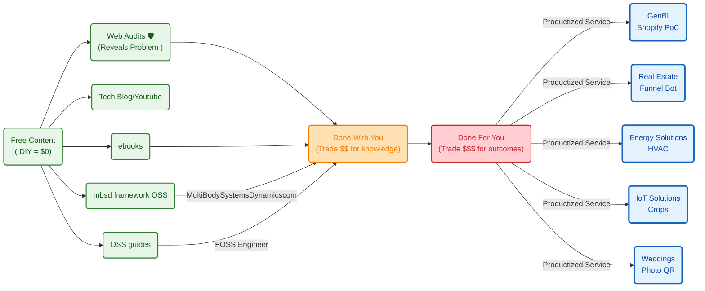


  



**TL;DR**

**Intro**

<!-- 
https://youtube.com/shorts/KeT0DuWryEI 
-->




  
  



```sh
  make coast                                                         
  ZUPT_DECODED=BTFL_BLACKBOX_LOG_METEOR75_PRO_20260710_165531_BETAFPV
  G473_decoded.json 
```

  25-30% throttle: ~9-10 W                                           
  30-35% throttle: ~12-13 W                                          
  35-40% throttle: ~14-15.5 W                                        
  40-45% throttle: ~16-18 W  

10-15% throttle: ~7.7 W,  ~746 eRPM, 1.82 A                        
  15-20% throttle: ~7.4 W,  ~752 eRPM, 1.90 A                        
  20-25% throttle: ~8.7 W,  ~817 eRPM, 2.21 A                        
  25-30% throttle: ~9.6 W,  ~974 eRPM, 2.46 A                        
  30-35% throttle: ~11.9 W, ~1066 eRPM, 3.07 A                       
  35-40% throttle: ~14.9 W, ~1177 eRPM, 3.88 A                       
  40-45% throttle: ~16.5 W, ~1210 eRPM, 4.46 A                       
                                                                     
  Interesting things:                                                
                                                                     
  - Power rises faster than eRPM at higher throttle. From 35-40% to  
    40-45%, eRPM barely rises, but power goes up. That can mean more 
    load, sag, airflow inefficiency, or less efficient operating     
    range.                                                           
  - Around 35-40% throttle, the quad seems to “coast/hold” around 14-    15 W and ~1170 eRPM.                
      - peak current: 24.9A                                          
      - peak power: 94.9W   

```sh
  python .\telemetry_video.py --decoded .                            
  \BTFL_BLACKBOX_LOG_METEOR75_PRO_20260710_165531_BETAFPVG473_decoded
  .json --log-index 1 --duration-s 158.4
```

You are looking right at the heart of what makes an FPV drone feel so intensely athletic: an absurd **Power-to-Weight Ratio**, and a fascinating look at how much energy is spent just "coasting" (hovering) versus sprinting.

Let’s look at the actual physics of your specific setup (Meteor75 Pro + 680mAh battery) to see how the numbers divide up.

1. The Insane Power-to-Weight Ratio

Your drone weighs roughly **31 grams** empty. With the new 680mAh battery ($\approx 16\text{g}$), your total takeoff weight is about **47 grams**.

* **The Power Input:** At 100% throttle, your motors draw about 16 Amps at 4.0V = **64 Watts of electrical power**.
* **The Power-to-Weight Ratio:** 
$$\frac{64\text{ Watts}}{0.047\text{ kg}} \approx 1,361\text{ Watts per Kilogram}$$


To put that into perspective, a high-performance sports car like a **Ferrari or Bugatti** usually has a power-to-weight ratio around **400 to 600 Watts per kilogram**. 

Your tiny plastic micro-drone packs nearly **triple** the proportional power of a hypercar! 

That's why it accelerates like a rocket ship when you punch the throttle.

2. Look at the Thrust Profile (Grams of Lift)

Your four 1102 motors spinning those 45mm propellers at full blast generate a combined maximum of roughly **200 grams of total upward thrust**.

$$\text{Thrust-to-Weight Ratio} = \frac{200\text{g Max Thrust}}{47\text{g Total Weight}} \approx 4.25 : 1$$

Your drone can push up into the sky with over **4 times its own weight**.

3. Coasting vs. Sprinting: Where is the energy going?

This is where your observation about "coasting" efficiency gets really interesting. Because of those exponential aerodynamic laws we talked about earlier, the energy map of your flight splits cleanly into two modes:

| Flight State | Thrust Needed | Power Drank | The Aerodynamic Reality |
| --- | --- | --- | --- |
| **Basic Hover ("Coasting")** | **47g** (Exactly its own weight) | **$\approx$ 13 Watts** | **High Efficiency:** The motors use only about **20% of their total available power** just to float. Because it sits in this highly efficient low-RPM zone, you get those long 6-minute cruise sessions! |
| **Full Throttle Punch ("Sprinting")** | **200g** (Max acceleration) | **$\approx$ 64 Watts** | **Brutal Inefficiency:** Moving from a hover to full throttle gives you 4x more thrust, but costs **5x more electrical power**. The extra energy is violently eaten up by air resistance and propeller drag. |

### 🧠 The Engineering Insight

When you write your Python script to analyze your logs, look at the **Throttle % vs. Power** line. You'll see that "coasting" around your living room keeps the drone in an incredibly peaceful, low-drain sweet spot. The moment you try to fight a gust of wind outside or do a massive loop, you cross a threshold where the drone throws its efficiency away in exchange for pure, raw, physics-defying acceleration.

It's a beautiful piece of engineering—it leaves 80% of its power completely hidden in reserve, waiting for you to call on it!

That $200\text{g}$ calculation comes directly from real-world **bench tests (thrust stands)** that pilots and engineers perform on your exact hardware combination!

When companies design motors, they bolt them down to a scale, plug in specific propellers, spin them to 100% throttle, and measure how many grams of physical force push down on the scale.

The math behind that $200\text{g}$ estimate breaks down like this:

### 1. The Per-Motor Data

For a **BetaFPV 1102 motor running at 22,000KV** on a fresh 1S LiHV battery ($\approx 4.35\text{V}$), pushing a **Gemfan 45mm 3-blade propeller**, a single motor generates roughly **48 to 52 grams of raw static thrust** at maximum throttle.

### 2. The Multiplier

Since your Meteor75 Pro has four motors working together:

$$\text{Total Thrust} = 4 \times 50\text{g} = 200\text{ grams of total thrust}$$

---

### 📉 Why this matches your real flights (The Reality Check)

This $200\text{g}$ figure is the *maximum dynamic burst capability* right when your battery is completely fresh. In real life, that number shifts slightly due to three factors you can actually track in your Python logs:

1. **Voltage Sag:** When you punch to 100% throttle, your battery voltage drops from $4.35\text{V}$ down to maybe $3.9\text{V}$ or $4.0\text{V}$. Because motor RPM drops with lower voltage, your thrust dips closer to **$170\text{g} - 180\text{g}$** later in the flight.
2. **Duct Efficiency:** Your Meteor75 Pro frame has plastic guard rings (ducts) around the propellers. These rings actually act like tiny airplane wings, trapping air and increasing thrust by roughly 5% to 10% compared to a drone with open propellers!
3. **The 80% Throttle Limit:** In normal indoor flight, you will find that your drone hovers at roughly **25% throttle**. Your data will show that to move up from a hover, you rarely ever need to punch the radio all the way to 100%; you have a massive mountain of extra thrust sitting completely in reserve!

```sh
make findings
```




```sh
make plot-throttle-current
#  make telemetry-latest
```


## Betaflight

Recently I got to know how OSS is baked into a PWA https://app.betaflight.com/#


### Betaflight Telemetry

* https://github.com/betaflight/blackbox-log-viewer/releases

Also available as PWA: https://blackbox.betaflight.com/


For the meteor 75 pro, one session of 6min filled ~13mb of the 16mb available for BBL logs.

  looptime = 312 us -> ~3205 Hz loop                                 
  Blackbox 1/4 -> ~801 Hz logging                                    
  gyro scaled -> human-usable gyro rate values    

```sh
Start-Process .\meteor75_blackbox_report.html 
#python .\run_blackbox_report.py --list
#python .\run_blackbox_report.py --index 1 
python .\run_blackbox_report.py --index 1 --mass-g 44.0
```

```sh
  For your July 10 segment 0, full duration is about 192.3s, so run: 
                                                                     
  python .\telemetry_video.py --decoded .                            
  \BTFL_BLACKBOX_LOG_METEOR75_PRO_20260710_103204_BETAFPVG473_decoded
  .json --log-index 0 --start-s 0 --duration-s 192.3 --fps 30        
                                                                     
  Or add a Make override:                                            
                                                                     
  make telemetry DURATION=192.3   
```


### Oa5 Pro x Telemetry

```sh
make telemetry-latest
#make telemetry-overlay-preview VIDEO="DJI_20260710093712_0013_D.MP4" VIDEO_OFFSET=18.4
make telemetry-overlay-preview VIDEO=DJI_20260712121438_0020_D.MP4 VIDEO_OFFSET=29 COMPOSITE_PREVIEW_OUT=DJI_20260712121438_0020_D_with_telemetry_preview60.mp4
                                                        
#If the timing looks right, render the full overlay:

#make telemetry-overlay VIDEO=DJI_20260712121438_0020_D.MP4 VIDEO_OFFSET=29     
#COMPOSITE_OUT=DJI_20260712121438_0020_D_with_telemetry.mp4

#TELEMETRY_MP4=BTFL_BLACKBOX_LOG_METEOR75_PRO_20260712_115632_BETAFPVG473_telemetry_s2_161s.mp4
                                                          
#You can override it if needed:                                                  
#make telemetry-overlay-preview VIDEO=DJI_20260712121438_0020_D.MP4 VIDEO_OFFSET=29     
#TELEMETRY_MP4=your_telemetry.mp4 
```

<!-- 
https://youtu.be/drupGz_-R38 
-->



```sh
make telemetry TELEMETRY_DECODED=BTFL_BLACKBOX_LOG_METEOR75_PRO_20260712_130543_BETAFPVG473_decoded.json TELEMETRY_SEQUENCE=0,1 DURATION=126 FPS=30

make telemetry-overlay-preview VIDEO=DJI_20260712124329_0021_D.MP4 VIDEO_OFFSET=27 TELEMETRY_MP4=BTFL_BLACKBOX_LOG_METEOR75_PRO_20260712_130543_BETAFPVG473_telemetry_s0-1_126s.mp4 COMPOSITE_PREVIEW_OUT=DJI_20260712124329_0021_D_with_telemetry_preview60.mp4
```



<!-- 
https://youtu.be/fb_zY9PMAO4 -->

All thanks to [ffmpeg](https://jalcocert.github.io/JAlcocerT/docs/coolresources/video/#ffmpeg), [just FYI](https://jalcocert.github.io/JAlcocerT/web-for-moto-blogger/#ffmpeg-video-workflow-for-windows):

```sh
ffmpeg -y -i "DJI_20260713180204_0003_D.MP4" `       
  -map 0:v:0 -map 0:a? `                             
  -vf "scale=1280:-2" `                              
  -c:v libx264 `                                     
  -pix_fmt yuv420p `                                 
  -crf 23 `                                          
  -preset veryfast `                                 
  -c:a aac `                                         
  -b:a 160k `                                        
  -movflags +faststart `                             
  "DJI_20260713180204_0003_D_browser.mp4"  

#ffmpeg -f concat -safe 0 -i file_list.txt -c copy D:\DCIM\DJI_001\output.mp4
```



Each segment in the logs seems to be a new run.


```sh
make timeline-viewer TIMELINE_DECODED=BTFL_BLACKBOX_LOG_METEOR75_PRO_20260714_152410_BETAFPVG473_decoded.json TIMELINE_VIDEO=DJI_20260714154902_0002_D_browser.mp4 TIMELINE_LOG_INDEX=5 TIMELINE_OFFSET=0
```


<!-- https://youtu.be/0zhNqTwm0oY -->


## Creating a PWA


---

## Conclusions


Remember to use betaflight to get the telemetry for a limited time not to overheat your controller with the rising temp




  
  





---

## FAQ

### Important before flying

1. Check applicable regulations: like `https://uav.pansa.pl/pilot-profile` and https://dronemap.pansa.pl/ , `https://drony.gov.pl/drone-tower`

2. Check [weather patterns](https://jalcocert.github.io/JAlcocerT/py-vacations/#conclusions): `https://www.windy.com`


### Buying second hand drons x Telemetry

What to do before connecting to your laptop:

1. Props out
2. No loose wires
3. VTX antena on *or it will fry in 60s*

Then just `https://app.betaflight.com/` and get the logs

### Interesting PWAs

* https://forocoches.com/foro/showthread.php?t=10665137
* https://gasolinapp.inforapida.es/

> WHich can be interesting for road trips!