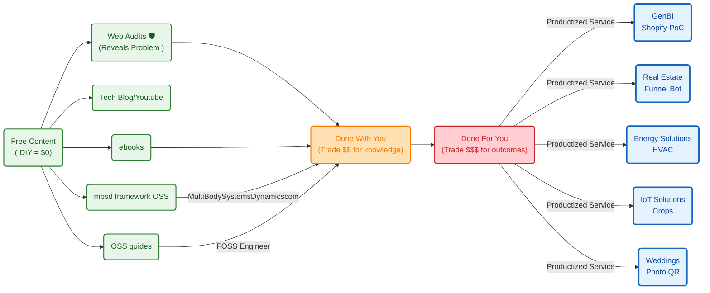


  



**TL;DR**

**Intro**

<!-- 
https://youtube.com/shorts/KeT0DuWryEI 
-->




  
  



```sh
  make coast                                                         
  ZUPT_DECODED=BTFL_BLACKBOX_LOG_METEOR75_PRO_20260710_165531_BETAFPV
  G473_decoded.json 
```

  25-30% throttle: ~9-10 W                                           
  30-35% throttle: ~12-13 W                                          
  35-40% throttle: ~14-15.5 W                                        
  40-45% throttle: ~16-18 W  

10-15% throttle: ~7.7 W,  ~746 eRPM, 1.82 A                        
  15-20% throttle: ~7.4 W,  ~752 eRPM, 1.90 A                        
  20-25% throttle: ~8.7 W,  ~817 eRPM, 2.21 A                        
  25-30% throttle: ~9.6 W,  ~974 eRPM, 2.46 A                        
  30-35% throttle: ~11.9 W, ~1066 eRPM, 3.07 A                       
  35-40% throttle: ~14.9 W, ~1177 eRPM, 3.88 A                       
  40-45% throttle: ~16.5 W, ~1210 eRPM, 4.46 A                       
                                                                     
  Interesting things:                                                
                                                                     
  - Power rises faster than eRPM at higher throttle. From 35-40% to  
    40-45%, eRPM barely rises, but power goes up. That can mean more 
    load, sag, airflow inefficiency, or less efficient operating     
    range.                                                           
  - Around 35-40% throttle, the quad seems to “coast/hold” around 14-    15 W and ~1170 eRPM.                
      - peak current: 24.9A                                          
      - peak power: 94.9W   

```sh
  python .\telemetry_video.py --decoded .                            
  \BTFL_BLACKBOX_LOG_METEOR75_PRO_20260710_165531_BETAFPVG473_decoded
  .json --log-index 1 --duration-s 158.4
```

You are looking right at the heart of what makes an FPV drone feel so intensely athletic: an absurd **Power-to-Weight Ratio**, and a fascinating look at how much energy is spent just "coasting" (hovering) versus sprinting.

Let’s look at the actual physics of your specific setup (Meteor75 Pro + 680mAh battery) to see how the numbers divide up.

1. The Insane Power-to-Weight Ratio

Your drone weighs roughly **31 grams** empty. With the new 680mAh battery ($\approx 16\text{g}$), your total takeoff weight is about **47 grams**.

* **The Power Input:** At 100% throttle, your motors draw about 16 Amps at 4.0V = **64 Watts of electrical power**.
* **The Power-to-Weight Ratio:** 
$$\frac{64\text{ Watts}}{0.047\text{ kg}} \approx 1,361\text{ Watts per Kilogram}$$


To put that into perspective, a high-performance sports car like a **Ferrari or Bugatti** usually has a power-to-weight ratio around **400 to 600 Watts per kilogram**. 

Your tiny plastic micro-drone packs nearly **triple** the proportional power of a hypercar! 

That's why it accelerates like a rocket ship when you punch the throttle.

2. Look at the Thrust Profile (Grams of Lift)

Your four 1102 motors spinning those 45mm propellers at full blast generate a combined maximum of roughly **200 grams of total upward thrust**.

$$\text{Thrust-to-Weight Ratio} = \frac{200\text{g Max Thrust}}{47\text{g Total Weight}} \approx 4.25 : 1$$

Your drone can push up into the sky with over **4 times its own weight**.

3. Coasting vs. Sprinting: Where is the energy going?

This is where your observation about "coasting" efficiency gets really interesting. Because of those exponential aerodynamic laws we talked about earlier, the energy map of your flight splits cleanly into two modes:

| Flight State | Thrust Needed | Power Drank | The Aerodynamic Reality |
| --- | --- | --- | --- |
| **Basic Hover ("Coasting")** | **47g** (Exactly its own weight) | **$\approx$ 13 Watts** | **High Efficiency:** The motors use only about **20% of their total available power** just to float. Because it sits in this highly efficient low-RPM zone, you get those long 6-minute cruise sessions! |
| **Full Throttle Punch ("Sprinting")** | **200g** (Max acceleration) | **$\approx$ 64 Watts** | **Brutal Inefficiency:** Moving from a hover to full throttle gives you 4x more thrust, but costs **5x more electrical power**. The extra energy is violently eaten up by air resistance and propeller drag. |

### 🧠 The Engineering Insight

When you write your Python script to analyze your logs, look at the **Throttle % vs. Power** line. You'll see that "coasting" around your living room keeps the drone in an incredibly peaceful, low-drain sweet spot. The moment you try to fight a gust of wind outside or do a massive loop, you cross a threshold where the drone throws its efficiency away in exchange for pure, raw, physics-defying acceleration.

It's a beautiful piece of engineering—it leaves 80% of its power completely hidden in reserve, waiting for you to call on it!

That $200\text{g}$ calculation comes directly from real-world **bench tests (thrust stands)** that pilots and engineers perform on your exact hardware combination!

When companies design motors, they bolt them down to a scale, plug in specific propellers, spin them to 100% throttle, and measure how many grams of physical force push down on the scale.

The math behind that $200\text{g}$ estimate breaks down like this:

### 1. The Per-Motor Data

For a **BetaFPV 1102 motor running at 22,000KV** on a fresh 1S LiHV battery ($\approx 4.35\text{V}$), pushing a **Gemfan 45mm 3-blade propeller**, a single motor generates roughly **48 to 52 grams of raw static thrust** at maximum throttle.

### 2. The Multiplier

Since your Meteor75 Pro has four motors working together:

$$\text{Total Thrust} = 4 \times 50\text{g} = 200\text{ grams of total thrust}$$

---

### 📉 Why this matches your real flights (The Reality Check)

This $200\text{g}$ figure is the *maximum dynamic burst capability* right when your battery is completely fresh. In real life, that number shifts slightly due to three factors you can actually track in your Python logs:

1. **Voltage Sag:** When you punch to 100% throttle, your battery voltage drops from $4.35\text{V}$ down to maybe $3.9\text{V}$ or $4.0\text{V}$. Because motor RPM drops with lower voltage, your thrust dips closer to **$170\text{g} - 180\text{g}$** later in the flight.
2. **Duct Efficiency:** Your Meteor75 Pro frame has plastic guard rings (ducts) around the propellers. These rings actually act like tiny airplane wings, trapping air and increasing thrust by roughly 5% to 10% compared to a drone with open propellers!
3. **The 80% Throttle Limit:** In normal indoor flight, you will find that your drone hovers at roughly **25% throttle**. Your data will show that to move up from a hover, you rarely ever need to punch the radio all the way to 100%; you have a massive mountain of extra thrust sitting completely in reserve!

```sh
make findings
```




```sh
make plot-throttle-current
#  make telemetry-latest
```


## Betaflight

Recently I got to know how OSS is baked into a PWA https://app.betaflight.com/#


### Betaflight Telemetry

* https://github.com/betaflight/blackbox-log-viewer/releases

Also available as PWA: https://blackbox.betaflight.com/


For the meteor 75 pro, one session of 6min filled ~13mb of the 16mb available for BBL logs.

  looptime = 312 us -> ~3205 Hz loop                                 
  Blackbox 1/4 -> ~801 Hz logging                                    
  gyro scaled -> human-usable gyro rate values    

```sh
Start-Process .\meteor75_blackbox_report.html 
#python .\run_blackbox_report.py --list
#python .\run_blackbox_report.py --index 1 
python .\run_blackbox_report.py --index 1 --mass-g 44.0
```

```sh
  For your July 10 segment 0, full duration is about 192.3s, so run: 
                                                                     
  python .\telemetry_video.py --decoded .                            
  \BTFL_BLACKBOX_LOG_METEOR75_PRO_20260710_103204_BETAFPVG473_decoded
  .json --log-index 0 --start-s 0 --duration-s 192.3 --fps 30        
                                                                     
  Or add a Make override:                                            
                                                                     
  make telemetry DURATION=192.3   
```


### Oa5 Pro x Telemetry

```sh
make telemetry-latest
#make telemetry-overlay-preview VIDEO="DJI_20260710093712_0013_D.MP4" VIDEO_OFFSET=18.4
make telemetry-overlay-preview VIDEO=DJI_20260712121438_0020_D.MP4 VIDEO_OFFSET=29 COMPOSITE_PREVIEW_OUT=DJI_20260712121438_0020_D_with_telemetry_preview60.mp4
                                                        
#If the timing looks right, render the full overlay:

#make telemetry-overlay VIDEO=DJI_20260712121438_0020_D.MP4 VIDEO_OFFSET=29     
#COMPOSITE_OUT=DJI_20260712121438_0020_D_with_telemetry.mp4

#TELEMETRY_MP4=BTFL_BLACKBOX_LOG_METEOR75_PRO_20260712_115632_BETAFPVG473_telemetry_s2_161s.mp4
                                                          
#You can override it if needed:                                                  
#make telemetry-overlay-preview VIDEO=DJI_20260712121438_0020_D.MP4 VIDEO_OFFSET=29     
#TELEMETRY_MP4=your_telemetry.mp4 
```

<!-- 
https://youtu.be/drupGz_-R38 
-->



```sh
make telemetry TELEMETRY_DECODED=BTFL_BLACKBOX_LOG_METEOR75_PRO_20260712_130543_BETAFPVG473_decoded.json TELEMETRY_SEQUENCE=0,1 DURATION=126 FPS=30

make telemetry-overlay-preview VIDEO=DJI_20260712124329_0021_D.MP4 VIDEO_OFFSET=27 TELEMETRY_MP4=BTFL_BLACKBOX_LOG_METEOR75_PRO_20260712_130543_BETAFPVG473_telemetry_s0-1_126s.mp4 COMPOSITE_PREVIEW_OUT=DJI_20260712124329_0021_D_with_telemetry_preview60.mp4
```



<!-- 
https://youtu.be/fb_zY9PMAO4 -->

All thanks to [ffmpeg](https://jalcocert.github.io/JAlcocerT/docs/coolresources/video/#ffmpeg), [just FYI](https://jalcocert.github.io/JAlcocerT/web-for-moto-blogger/#ffmpeg-video-workflow-for-windows):

```sh
ffmpeg -y -i "DJI_20260713180204_0003_D.MP4" `       
  -map 0:v:0 -map 0:a? `                             
  -vf "scale=1280:-2" `                              
  -c:v libx264 `                                     
  -pix_fmt yuv420p `                                 
  -crf 23 `                                          
  -preset veryfast `                                 
  -c:a aac `                                         
  -b:a 160k `                                        
  -movflags +faststart `                             
  "DJI_20260713180204_0003_D_browser.mp4"  

#ffmpeg -f concat -safe 0 -i file_list.txt -c copy D:\DCIM\DJI_001\output.mp4
```



Each segment in the logs seems to be a new run.


```sh
make timeline-viewer TIMELINE_DECODED=BTFL_BLACKBOX_LOG_METEOR75_PRO_20260714_152410_BETAFPVG473_decoded.json TIMELINE_VIDEO=DJI_20260714154902_0002_D_browser.mp4 TIMELINE_LOG_INDEX=5 TIMELINE_OFFSET=0
```


<!-- https://youtu.be/0zhNqTwm0oY -->


## Creating a PWA


---

## Conclusions


Remember to use betaflight to get the telemetry for a limited time not to overheat your controller with the rising temp


There is an ESP32 / ESP8285 inside most of these drons

Exactly the same that are inside IoT projects that you can get done:


  
  





---

## FAQ

### Important before flying

1. Check applicable regulations: like `https://uav.pansa.pl/pilot-profile` and https://dronemap.pansa.pl/ , `https://drony.gov.pl/drone-tower`

2. Check [weather patterns](https://jalcocert.github.io/JAlcocerT/py-vacations/#conclusions): `https://www.windy.com`


### Buying second hand drons x Telemetry

What to do before connecting to your laptop:

1. Props out
2. No loose wires
3. VTX antena on *or it will fry in 60s*

Then just `https://app.betaflight.com/` and get the logs

The iflight zidora has 32mb of flash

{}


Got what i wanted and then `erase_flash`

The ELRS receiver required the 4s battery to be connected, otherwise it stays asleep.

* **Identified the Brain:** We extracted the exact factory firmware profile from the flight controller (`IFLIGHT_F722_TWING`).
* **Mapped the Hardware Highway:** We dug into the hardware resource codes to verify that the ExpressLRS receiver is physically soldered to the **UART1** processor pins.
* **Resolved Betaflight Port Conflicts:** We discovered a software clash where multiple ports were competing to read the receiver. We cleanly deactivated the duplicate on UART3 and locked the communication exclusively to UART1 (`serial 0 64`).
* **Isolated the Link Issue:** By evaluating the `0/250` telemetry readout on your RadioMaster Pocket, we diagnosed that the physical link is failing due to an existing security lock/mismatched binding phrase on the receiver chip, rather than a Betaflight configuration error.

Take a breather, grab a drink, and let me know when you are ready to knock out that final handshake!


 Across all active iFlight samples

  - p95 current: 31.40 A
  - p95 power: 469 W
  - p99 current: 54.20 A
  - p99 power: 766 W

  Across the main useful segments #63/#67/#68/#69/#72

  - p95 current: 31.80 A
  - p95 power: 474 W
  - p99 current: 54.60 A
  - p99 power: 768 W

  So the practical answer is: around 31-32 A and 470 W at p95.

  For context, the extreme tail is where it gets suspicious:

  - p99.9: about 101-106 A, 1.39-1.40 kW
  - max: 240.8 A, 4.23 kW

  That shape reinforces the earlier read: normal-ish bulk behavior, but the current sensor/logging has suspicious spikes or calibration issues in the high tail.


{}


The First Drone: iFlight Cidora SL5

the ELRS firmware was `ExpressLRS HappyModel EP1/EP2 2.4GHz RX Firmware Rev. 3.4.3 (41daca) CE_LBT`

`Choose a file to update module firmware. Select the correct .bin file for Unified_ESP8285_2400_RX otherwise a bad flash may occur. If this happens you will need to recover via USB/Serial. You may also download the currently running firmware.`

And betaflight `4.5.5 BTFL`

The machine we just finished fixing the wiring maps on is the **iFlight Cidora SL5**.

**Its Core Components:**

* **Flight Controller (FC):** iFlight **SucceX-D F7 TwinG** (Running the `IFLIGHT_F722_TWING` Betaflight target).
* **Processor:** STM32F722.
* **Receiver:** External **ExpressLRS (ELRS)** Receiver (wired physically to **UART1/Pins A09 & A10**).
* **Peripherals:** A Video Transmitter (VTX) equipped with **SmartAudio** (labeled with that green "SA" heat shrink you just isolated).

---

{}


### Bottom Line Up Front (BLUF)

**Yes, we are exactly at the same step for both drones!** Both quads are structurally fully configured inside Betaflight, and both are completely stuck on the exact same roadblock: a mismatching ExpressLRS security handshake.

And your technical intuition is 100% correct—it makes absolute sense that you can't see a separate ELRS receiver module on this smaller one.

---

🔍 Is it an AIO Board?

**Yes, the Eachine Novice-IV uses a highly integrated AIO (All-In-One) flight stack.**

However, there is a major hardware plot twist hiding inside the blueprint you just pulled: **This drone didn’t originally come with ExpressLRS.**

From the factory, the Novice-IV shipped with a tiny **RadioMaster R81 receiver running the legacy FrSky D8 protocol** wired directly to UART6. When the previous owner converted it over to ExpressLRS, they did one of two things:

1. They tucked a microscopic ELRS nano receiver somewhere completely hidden (like underneath the main AIO board or wrapped inside heat shrink right behind the camera).
2. Or they completely replaced the stock flight controller stack with a newer AIO board that has a modern ExpressLRS receiver chip baked directly into the main circuit board.

---

Because both quads are now fully mapped and ready inside Betaflight, our computer work here is officially done! 

We are at the final endgame for both drones.

To get your sticks moving, we just need to get one of them successfully through the ExpressLRS Wi-Fi override page.

Since the Novice-IV is plugged in right now, let's look for that **`ExpressLRS RX`** hotspot network on your phone or laptop. 

Once we change that phrase on the webpage, this machine will finally spring to life! Can you see the network broadcasting nearby?

Inspected and documented it in Eachine/README.md.

  Short read: this Eachine / Novice-IV log looks mostly healthy. It decoded into 9 segments, with no failsafe samples, no RX-lost samples, and no voltage problem. Voltage/current look much more plausible than the iFlight current readings:
  worst active voltage is 14.02 V, and peak current is 29.24 A.

  Main caveat: segment #4 shows meaningful motor saturation. About 39.12% of active samples have a motor pinned at >=2040, mainly motors 1 and 3. That could just be a short hard maneuver, but on a second-hand drone I’d physically check
  props, motor smoothness, frame twist, and whether one diagonal is working harder than it should.

  Telemetry notes:

  - Voltage/current/power: available and usable.
  - GPS fields: present in segments #5-#8, but GPS_numSat stays 0, so it does not look like useful GPS fix data.
  - eRPM: absent, same as iFlight. Use motor[0..3] only as a command proxy, not measured RPM.

  Generated report is here: Eachine/BTFL_BLACKBOX_LOG_NOVICE-IV_20260718_120247_BETAFLIGHTF4_report.html.

 - Logged max power: 428 W in segment #5 - This is ~ x4 to the one i saw in the meteor
  - Same segment: 29.24 A peak current
  - Long flights: segment #7 peaks at 336 W, segment #8 peaks at 274 W


{}


The Second Drone: The "8MB Flash" Quad

The second quad you just brought over to the workspace—the one whose Blackbox data you are currently downloading—is the **iFlight Nazgul5 V2** (or the matching analog equivalent using that custom green 3D-printed layout).

**Its Core Components:**

* **Flight Controller (FC):** iFlight **SucceX-E F4** or **SucceX-E F7** flight stack.
* **Storage Chip:** Winbond **8MB Onboard Flash Memory** (dedicated exclusively to internal binary Blackbox logging).
* **Motors:** **XING-E Pro 2207** Brushless Motors (running a high-KV variant, typically **2450KV** or **2750KV** built explicitly for snappy 4S freestyle configurations).
* 4.5.2 btfl

`set align_board_yaw = 180` and `set align_board_yaw = 90` made the pitch and roll be in the right place

Then, just have a look to `dump` to avoid trial and error of UART, CRSF etc

With the full dump in hand, we can instantly read exactly:

The Ports: Which exact UART pin the receiver is soldered to (serial).

The Protocol: If it's configured for CRSF (ExpressLRS), SBUS, or something else.

The Features: Every master setting, channel map, and hidden configuration the previous owner left behind.

Here is exactly what is inside this second machine according to the data:

The Drone Identity: This is an Eachine Novice-IV quad running a classic BETAFLIGHTF4 target on an STM32F405 processor.

The Receiver Port: Your ExpressLRS receiver is configured on UART6 (serial 5 64).

The Protocol: It is already correctly set to CRSF (set serialrx_provider = CRSF), which is exactly what ExpressLRS needs to talk to your Pocket.

Bonus Component Found: You have a GPS rescue module configured on UART1 (serial 0 2048).

---

I’d treat the first power-up as a bench check, not “ready to rip”.

  First time:

  - Props off.
  - Power from USB first, check Betaflight config.
  - Then plug LiPo in with props still off.
  - Check no smoke, no hot ESC/motor/VTX, no weird beeping.
  - Confirm receiver, modes, arming, failsafe.
  - Check motor direction with props off.
  - Then do a short hover test outside.

  For batteries, these look like 4S drones from the logs.

  4S LiPo voltage guide

  - Fully charged: 16.8 V total, 4.20 V/cell
  - Nominal: 14.8 V total, 3.70 V/cell
  - Good landing target under load: 14.0-14.4 V, 3.50-3.60 V/cell
  - Avoid pushing below under load: 13.2 V, 3.30 V/cell
  - Resting after flight should ideally rebound to: 14.4-15.2 V, 3.60-3.80 V/cell
  - Storage charge: 15.2-15.4 V, 3.80-3.85 V/cell

  For your first flights, be conservative:

  - Set OSD warning around 14.4 V.
  - Land around 14.0 V under load.
  - After landing, check resting voltage. If it rebounds to around 14.6-15.0 V, you are in a healthy range.
  - If it rests below 14.0 V, you flew it too low.

  For the specific drones:

  - Eachine: looks safer/cleaner electrically. Check props/motors because motors 1 and 3 worked hard in one segment.
  - iFlight: be more cautious. The voltage sag in segment #63 and weird current spikes mean I’d do very short hover tests first and check battery/XT60/ESC heat.

  Biggest practical advice: on 4S, voltage sag happens fast when you punch throttle. Do your first packs gently, land early, and inspect motor/ESC/battery temperature after each minute-long test.

---

Correct: if both connect to Betaflight Configurator, the flight controllers are alive. The MCU, USB interface, firmware, and basic board power path are working.

  But that does not prove the whole drone is healthy. Betaflight login does not fully validate:

  - ESCs / 4-in-1 ESC
  - motors
  - receiver link and failsafe
  - VTX
  - GPS
  - current/voltage sensor calibration
  - gyro health under vibration
  - motor output pads/signals under LiPo power
  - power system under load

  Best next checks, props off:

  1. USB only
      - Check gyro moves correctly in Setup tab.
      - Check receiver channels move correctly.
      - Check modes: arm, angle/acro, beeper if present.
      - Check failsafe by turning radio off and seeing RX loss behavior.
  2. LiPo plugged in, props still off
      - Listen for ESC startup tones.
      - Check Betaflight sees battery voltage correctly.
      - Check nothing heats quickly: FC, ESC, VTX, motors.
      - Use Motors tab very gently to spin each motor.
      - Confirm motor order and direction.
  3. Before props
      - Verify prop orientation.
      - Verify arming angle/settings.
      - Set OSD voltage warning conservatively.
      - Set a beeper or turtle mode only if configured correctly.

  So: not fried FCs, yes. Fully proven airworthy, not yet.

{}


The reason your Meteor tiny whoop bound seamlessly over USB with no battery plugged in boils down to two distinct engineering choices: **Power Routing** and **Receiver Architecture**.

1️⃣ 1S Power Routing vs. 4S Power Routing

* **Your Meteor (1S Whoop):** Because it is designed to run on a tiny 1S battery (~4.2V), the entire board—including the receiver—operates natively on low voltage. When you plug in a 5V USB cable, the computer provides more than enough voltage to easily power up the flight controller and the receiver simultaneously.

* **Your Eachine (4S Freestyle):** This drone is built to handle a much higher voltage (~16.8V). To protect the sensitive radio receiver from frying, the manufacturer isolates the receiver onto a completely separate power regulator circuit. This circuit is strictly engineered to only wake up when the main battery is plugged into the XT30/XT60 connector. USB power doesn't bridge across to it.

2️⃣ Integrated SPI Receivers

Many older or ultra-lightweight BetaFPV Meteor whoops utilize an **SPI Receiver**.

* An SPI receiver isn't a separate physical chip wired to the board; it is directly baked into the main flight controller processor itself.
* Because it shares the exact same "brain" chip as the flight controller, if the USB cable powers up Betaflight, it automatically powers up the receiver. The manual `bind_rx` command works instantly because Betaflight is talking to a part of itself.


On your Meteor, the receiver is essentially a sub-component of the main processor that runs easily on USB power. 

On your Eachine, the receiver is a completely independent, distinct hardware component sitting on a dead power rail until the battery wakes it up.

Plug that battery into the Eachine (props off!), give it 60 seconds, and let's get that Wi-Fi network onto your phone screen!


{}

```sh
#nmcli dev wifi list
nmcli dev wifi connect "ExpressLRS RX" password "expresslrs"
#Device 'wlp3s0' successfully activated with '27d2f846-...'.
```

 nmcli dev wifi list
IN-USE  BSSID              SSID                        MODE   CHAN  RATE        SIGNAL  BARS  SECURITY  
        1C:56:8E:26:1A:F8  TOTOLINK_LR350              Infra  1     270 Mbit/s  92      ▂▄▆█  WPA1 WPA2 
        4E:EB:D6:10:26:0F  ExpressLRS RX               Infra  1     54 Mbit/s   77      ▂▄▆_  WPA2      
        B8:A5:35:CB:9F:18  DN5CR18                     Infra  6     405 Mbit/s  77      ▂▄▆_  WPA2      

Inside the https://github.com/ExpressLRS/ExpressLRS portal `http://10.0.0.1/`: `ISM` vs `CE_LBT` regions 

If you need to change between them, the receiver is easier: https://expresslrs.github.io/web-flasher/


FCC = ISM (The global standard profile that matches your RadioMaster Pocket's ism2g4 setting).

LBT = CE_LBT (The specific European protocol your drone was previously locked onto).

```md
Download Firmware File(s)
The firmware file(s) have been configured for your BETAFPV 2.4GHz Nano RX with the specified options.
To flash the firmware file to your device, put it into WiFi mode and connect to it via the browser then upload the ELRS-v3.6.4-betafpv.rx_2400.nano-FCC-bindphrase.bin.gz file on the Update tab.
The firmware file ELRS-v3.6.4-betafpv.rx_2400.nano-FCC-bindphrase.bin.gz should be flashed as-is, do NOT decompress or unzip the file or you will receive an error.
```

Which generated an incorrect `ELRS-v3.6.4-betafpv.rx_2400.nano-FCC-bindphrase.bin.gz` to overwrite the backed up `DIY_2400_RX_ESP8285_SX1280_3.2.0 (8d3388).bin`

See:

```md
Choose a file to update module firmware. Select the correct .bin file for DIY_2400_RX_ESP8285_SX1280 otherwise a bad flash may occur. If this happens you will need to recover via USB/Serial. You may also download the currently running firmware.
```
So i asked codex and found in the web: https://www.expresslrs.org/quick-start/receivers/diy2400/

```md
Flashing via Passthrough¶
Targets:
DIY_2400_RX_ESP8285_SX1280_via_BetaflightPassthrough
DIY_2400_RX_STM32_CCG_Nano_v0_5_via_BetaflightPassthrough
```


{}

What was going on with `DIY_2400_RX_ESP8285_SX1280`?

Short version: it did not disappear from ExpressLRS history. It stopped being shown as a normal Web Flasher hardware target because ExpressLRS moved ESP-based receivers toward unified firmware targets plus product-specific metadata.

The backed-up firmware name:

```txt
DIY_2400_RX_ESP8285_SX1280_3.2.0 (8d3388).bin
```

points to ExpressLRS tag `3.2.0`, commit `8d3388ef3369a2d8a64f92a80e42acb29f8e513e`.

After cloning the OSS repos, the audit trail was:

```sh
git clone https://github.com/ExpressLRS/ExpressLRS.git ~/Downloads/ExpressLRS
git clone https://github.com/ExpressLRS/Targets.git ~/Downloads/ExpressLRS-Targets

git -C ~/Downloads/ExpressLRS grep -n "DIY_2400_RX_ESP8285_SX1280" 3.2.0
git -C ~/Downloads/ExpressLRS log --all --oneline -S "DIY_2400_RX_ESP8285_SX1280" -- .
```

At `3.2.0`, the old PlatformIO environments still existed:

```txt
src/targets/diy_2400.ini:59 [env:DIY_2400_RX_ESP8285_SX1280_via_UART]
src/targets/diy_2400.ini:63 [env:DIY_2400_RX_ESP8285_SX1280_via_BetaflightPassthrough]
src/targets/diy_2400.ini:66 [env:DIY_2400_RX_ESP8285_SX1280_via_WIFI]
```

But the hardware selector metadata already started treating the old name as a prior target name for product-specific entries:

```txt
src/hardware/targets.json:109 "prior_target_name": "DIY_2400_RX_ESP8285_SX1280"
```

The important commits were:

```txt
2c2114a1  2022-05-22  Unified ESP targets (#1552)
5279995f  2023-07-20  Append prior target name to firmware (#2306)
2c5bfcb8  2023-09-18  Use external targets repo (#2400)
```

The current Web Flasher target metadata now lives in the external `ExpressLRS/Targets` repo. There, the BetaFPV AIO and Lite targets map back to the old name:

```json
"product_name": "BETAFPV 2.4GHz AIO RX",
"platform": "esp8285",
"firmware": "Unified_ESP8285_2400_RX",
"prior_target_name": "DIY_2400_RX_ESP8285_SX1280"
```

So the Web Flasher path is not:

```txt
DIY devices -> 2.4GHz Receiver -> DIY_2400_RX_ESP8285_SX1280
```

For this board family it is more likely:

```txt
BETAFPV -> 2.4GHz Receiver -> BETAFPV 2.4GHz AIO RX
```

or, depending on the actual receiver board:

```txt
BETAFPV -> 2.4GHz Receiver -> BETAFPV 2.4GHz Lite RX
```

The confusing part: the receiver web UI can still warn about `DIY_2400_RX_ESP8285_SX1280`, because that was the target name baked into older firmware. The modern selector uses product targets and the unified ESP8285 firmware underneath:

```txt
Unified_ESP8285_2400_RX_via_WIFI
Unified_ESP8285_2400_RX_via_BetaflightPassthrough
Unified_ESP8285_2400_RX_via_UART
```

Practical lesson: do not blindly match the old Web UI target string to the current dropdown. Check `prior_target_name`, platform, and the real board/product target first.

{}


Thx to codex i got `/home/jalcocert/Downloads/elrs/DIY_2400_RX_ESP8285_SX1280_3.2.0_8d3388_FCC-ISM_via_WIFI.bin` at FCC


the pocket cna also emit wifi `ExpressLRS TX` and give you that section for you to update it

You will see sth like `140,79,0,152,91,72` which gets updates as soona s you ad your passphrase in the web ui and flash it


The reason the Meteor bound perfectly via Betaflight is because it uses an SPI ExpressLRS receiver:

💡 The Difference: SPI vs. Serial (UART)

The Meteor (SPI): On most Meteor tiny whoops, the ExpressLRS receiver isn't a separate chip—it is physically baked right into the main flight controller circuits. Because Betaflight literally is the operating system running that chip, it has a dedicated "Bind Receiver" button in the GUI and handles the connection directly.

Your New Drone (Serial UART): The firmware you just flashed (DIY_2400_RX_ESP8285_SX1280) is for a true, standalone external serial receiver. It acts like its own independent little computer. Betaflight just listens to it over a serial wire, but has no control over its actual radio pairing settings.


#### The Golden Pre-Flight Checklist

Before you head outside and throw this thing in the air, you need to do **three critical hardware checks** on the bench (with the USB plugged into Betaflight, but **absolutely NO PROPELLERS ON THE DRONE**).

Skipping these checks is the #1 reason custom drones instantly flip over, freak out, or fly away on their first launch.

1️⃣ Check 1: Motor Direction & Ordering

1. Put the drone on your desk facing completely away from you (camera pointing forward).
2. Go to the **Motors** tab in Betaflight.
3. Toggle the safety switch on the screen that says "I understand the risks...".
4. Gently plug in your 4S battery.
5. Use the individual sliders (**1, 2, 3, 4**) to spin up one motor at a time at a very low speed.
6. Verify two things:
* **Location:** When you raise slider #1, does the rear-right motor spin? (Look at the 3D model diagram on the screen to match the numbers).
* **Direction:** Lightly touch the side of the spinning motor with a piece of paper or your finger. Is it spinning the exact direction the arrow shows on the Betaflight screen?

2️⃣ Check 2: Gyro/Board Orientation

1. Go to the **Setup** tab (the very top tab on the left menu).
2. Look at the 3D model of the drone on the screen.
3. Pick up your actual drone and tilt its nose down. Does the 3D model tilt its nose down?
4. Roll it to the right. Does the 3D model roll to the right?
*If the model moves in the opposite or wrong direction, your flight controller orientation settings are wrong, and the drone will instantly flip and crash the moment you try to take off.*

3️⃣ Check 3: Failsafe Test

1. While looking at the **Receiver** tab, turn your **RadioMaster Pocket OFF**.
2. Watch the bars on the screen. The **Throttle** bar should instantly drop down to `885` or `1000`, and the **ARM** channel should drop back down to its disarmed state (`1000`).
3. This ensures that if you lose radio connection mid-air, the drone will immediately shut off its motors and fall safely instead of flying away into the clouds.

🛸 Ready for the Field?

Once those three checks pass perfectly:

* Disconnect from Betaflight.
* Put the **propellers on tightly** (double-check that the "props in" or "props out" configuration matches what your motors tab says!).
* Find a wide-open grassy field **completely clear of people, cars, and trees**.
* Place the drone down, step back at least 15–20 feet, flip your **SC Switch to Angle Mode** (middle position) for a safe first flight, flip your **ARM switch**, and gently give it a tiny bit of throttle to hover!

{}

CRSF is the serial communication protocol (the language) that your ExpressLRS receiver uses to talk to your drone's flight controller over the physical wires.

Here is the quick breakdown of how they connect:

Over the Air (ELRS): Your RadioMaster Pocket talks to the drone using the ultra-fast ExpressLRS radio protocol.

Inside the Drone (CRSF): Once the receiver catches that signal, it translates the stick movements into the CRSF protocol and shoots them down the wires into the flight controller.

ExpressLRS piggybacks on the CRSF language because Team BlackSheep (the creators of Crossfire) made it open, highly efficient, and incredibly fast. So in Betaflight, whenever you use ELRS, you will always select "CRSF" as your receiver protocol.

{}

> For the cidora i didnt have to render the receiver's ELRS firmware, it connected directly as soon as i provided the matching passphrase with my pocket

Then, I went and place the modes im getting confortable with


### Interesting PWAs

* https://forocoches.com/foro/showthread.php?t=10665137
* https://gasolinapp.inforapida.es/

> Which can be interesting for road trips!