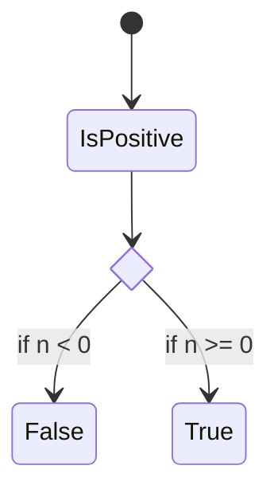
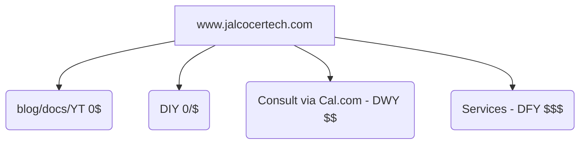

**Tl;DR**

Last year I made couple of 101 guides for [HUGO](https://jalcocert.github.io/JAlcocerT/using-hugo-as-website/) and [ASTRO](https://jalcocert.github.io/JAlcocerT/using-astro-as-website/).

But it was time to put cool components like this [ig gallery](https://github.com/JAlcocerT/real-estate-moi/blob/main/moirealestate-astro-theme/src/components/InstagramGalleryLocalFolder.astro) used [on this **mdx** here](https://github.com/JAlcocerT/real-estate-moi/blob/main/moirealestate-astro-theme/src/content/property/beachfront-paradise-instagram-gallery.mdx)

+++ People shared on reddit their [favourite minimalistic sites](https://www.reddit.com/r/webdev/comments/1gh38fz/whats_your_favorite_very_minimal_personal_website/)

+++ https://picsum.photos/ just in case you are tired of unsplash and just select what you want via https://picsum.photos/images

**Intro**

Wanna build a **sales pipeline**?

A way to capture leads?

Start with a **catchy landing first**.

The [data, streamlit web apps](https://jalcocert.github.io/JAlcocerT/ai-bi-tools/#pygwalker), pygwalker and [ApexCjarts Funnels](https://apexcharts.com/javascript-chart-demos/funnel-charts/) will come later.


Just get that **first YES**.


## Web Front End - Theme

* https://github.com/LaB-CH3/astrobrew
    * https://astro.build/themes/details/astrobrew/

[](https://github.com/LaB-CH3/astrobrew/stargazers)

>  Astrobrew is a free and open-source elegant **landing page for Micro SaaS** products built with Astro & Skeleton CSS


### Getting Started

Making a Landing should be easy already.

Specially with tools like: https://github.com/wandb/openui

> **OpenUI** let's you describe UI using your imagination, then see it rendered live.

Ok, ok, you have embraced the power of SSGs and aware of how many cool things can be done *,statically'* aka [in browser with CSR](https://jalcocert.github.io/JAlcocerT/csr-and-js/).

And surprisingly, [Front End can do many cool things, *including authentication*](https://jalcocert.github.io/JAlcocerT/front-end-and-auth/#whats-forward-auth)


  
  



**A Better Waiting2Landing** 

On [this post](https://jalcocert.github.io/JAlcocerT/waiting-list-pocketbase/) I thought Ill make a better version of the initial waiting2landing presented https://jalcocert.github.io/JAlcocerT/how-to-create-a-waiting-list/


Time to create:

```sh
git init
git branch -m main
git config user.name
git config --global user.name "JAlcocerT"
git config --global user.name
git add .
git commit -m "Initial commit: Waiting to Landing v2 with PB and Cloudflare Workers and Pages"

#sudo apt install gh
gh auth login
gh repo create waiting-to-landing-pb --private --source=. --remote=origin --push
```

There is one thing still stucked...

**How to make SSG edit friendly**?

Some WYSIWYG approach? 

Repurposing md note taking tools?

Or...giving a try to F/OSS CMS?

One more time, because I already gave a try to these from a [recent post](https://jalcocert.github.io/JAlcocerT/mailerlite-for-saas/#a-theme-to-test-this): [bcms](https://github.com/bcms/cms) and [pagescms](https://github.com/pages-cms/pages-cms)


  
  


This can be used to get [a cool ig like gallery](https://github.com/JAlcocerT/just-ssg/tree/main/astro-ssg/ig-gallery-folder) without importing each file independently, just the folder where they are saved:


```mdx
<GalleryLocalFolder
  folder="content/articles/exploring-netherlands-by-bike/imgs"
  initialLoadCount={6}
/>
```

Place those youtube videos:

```mdx
<div style="display: flex; justify-content: center;">
    <iframe width="560" height="315" src="https://www.youtube.com/embed/hj0MfciILEc" title="Vistula near Kazimierz Dolny Video" frameborder="0" allow="accelerometer; autoplay; clipboard-write; encrypted-media; gyroscope; picture-in-picture; web-share" referrerpolicy="strict-origin-when-cross-origin" allowfullscreen></iframe>
</div>
```


## Potential Themes for a Landing

1. This cool astro theme: https://github.com/ctrimm/astro-payroll-solution-theme

```sh
git clone https://github.com/ctrimm/astro-payroll-solution-theme #MIT Licensed
#https://payflo.corytrimm.com/ #demo

npm run dev -- --host 0.0.0.0 --port 4321 #http://192.168.1.11:4321/
```

Sounds familiar?

<!--  -->


  
  


## Vibe coding an Astro SSR Landing Page

Following the updated initial [BiP Prompt for vibe coding](https://jalcocert.github.io/JAlcocerT/docs/entrepreneur/bip/#initial-prompts-for-success):


  
  



And after creating [this quick landing](https://jalcocert.github.io/JAlcocerT/micro-saas/#creating-a-quick-landing) (email oriented) and driven by .md and .json




Go to whatever LLM you are using and ask: `do you think that these requirements are clear enough?`

```md
Create a Landing Page based on NextJS with a cool and modern UI

Include a `dockerfile` and `docker-compose.yml` that will control the title, description, open-graph image, favicon location and other global website variables via environment variables.

Create also a makefile with the following commands:

* `make help` - Show available commands
* `make install` - Prepare the dependencies for local development
* `make dev` - Run development server
* `make container` - Build and Run in Docker container
```

> This time I was more specific than others on the [UI, with **MUI** ](https://jalcocert.github.io/JAlcocerT/blog/dev-web-code-css/#material-ui---mui)

> > Also, [MIU has now its llm.txt](https://mui.com/material-ui/llms.txt)

Then go to [AntiGravity IDE](#antigravity-ide) and ask if the `brd.md` refined already with Gemini is clear enough.

If it is clear define the `z-development-plan.md` and proceed with the development phases.

```sh
# git init
# git branch -m main
# git config user.name
# git config --global user.name "JAlcocerT"
# git config --global user.name
# git add .
# git commit -m "Initial commit: Starting simple make podcast platform"
```

```sh
#sudo apt install gh
gh auth login
#gh repo create selfhosted-landing --private --source=. --remote=origin --push
    
git init && git add . && git commit -m "Initial commit: simple landing website" && gh repo create selfhosted-landing --private --source=. --remote=origin --push
###du -sh .
#docker stop $(docker ps -a -q) #stop all
#docker system df
```

**Technical Stack and Design Requirements**

To develop a **modern, secure, and scalable web platform** for hosting and streaming a single-user podcast.

The platform must offer a seamless, content-driven user interface and a flexible content management system supporting both web uploads and direct file system access.



After the vibe coding is completed, we go from this:


This very [simple state diagram](https://mermaid.js.org/syntax/stateDiagram.html) defines the 2 possible journeys:




  


```sh
git clone https://github.com/JAlcocerT/selfhosted-landing.git
#make help
```


| Requirement | Specification | Clarification / Decision |
| :--- | :--- | :--- |
| **Frontend Framework** | | |
| **Styling/UI Library** | | |
| **Backend/Database** | | |
| **Authentication** | | |

> I had to play with CSR again and trol a little bit!

Additionally: I embeded a cal calendar



  
  



### Adding a Simple ChatBot


  
  



---

## Conclusions

If you need icons, consider having a look to: https://www.jsdelivr.com/package/gh/selfhst/icons?ref=selfh.st

For just simpler Link Collection Themes, think about these selfhosted solutions:


  
  


Cool landings out-there: *these should be guiding `slubnechwile.com`*

Get a cool theme: https://www.builtatlightspeed.com/category/astro or from astro themes

1. `tydal.co`

2. `https://esim.holafly.com/` - landing with a very clear header

3. `purplepalm.ai` created [here](https://forocoches.com/foro/showthread.php?t=10455640&page=4) 

4. `https://operately.com/`

5. `https://kurz.fyi/`

6. Some include videos... `bersoagency.com`

Those should be enough for some **landing page inspiration**.

Resumen de los 3 puntos clave de emprendimiento:

1. **El marketing es más importante que la tecnología usada.** No pienses que un producto “molón” se venderá solo; a la empresa solo le importa que soluciones un problema real, sin importar cómo lo hagas (IA, Excel, etc.). Enfócate en B2B, ya que las empresas están más dispuestas a pagar por soluciones que resuelvan problemas concretos.

2. **Detecta un problema real.** Usa tu red de contactos y experiencia para identificar auténticas necesidades en empresas y luego dedícate a resolverlas, sin obsesionarte con la tecnología elegida.

3. **Valida la idea antes de programar o desarrollar nada.** Antes de ponerte a construir, crea una página de espera (waitlist) y comprueba si realmente hay interés (por ejemplo, recolectando correos de potenciales clientes). Solo si ves interés real, desarrolla la solución; si no, repite el proceso buscando otros problemas. Puedes hacer una pequeña demo simple con IA si es útil, pero manteniendo lo más básico posible.

> Which are inline with the BiP Recommendations from [product hunt, here](https://www.producthunt.com/products/build-in-public-cheatsheet?launch=build-in-public-cheatsheet) from [reddit](https://www.reddit.com/r/SaaS/comments/n42n8r/the_build_in_public_cheatsheet_how_people_go_from/)

Los puntos nuevos que aporta el post “Build In Public Cheatsheet” en Product Hunt son:

- **El enfoque consiste en compartir de forma transparente el desarrollo y el progreso de tu proyecto:** La idea es que construir en público no es solo marketing, sino crear una relación con potenciales usuarios y obtener feedback real durante todo el proceso.

- **Proporciona una lista práctica de tipos de publicaciones** que puedes hacer durante tu viaje de “build in public”: Ejemplos concretos como tuits, capturas de pantalla, avances, errores y aprendizajes.

- **Incluye una lista pública de otros emprendedores que construyen en público** y la opción de unirte a esa comunidad, facilitando networking y visibilidad.

- **Ofrece un tablero(pipeline) para planificar el viaje “Build in Public”**, permitiéndote organizar tus anuncios, lanzamientos y experimentos públicamente.

- **Enumera principios y buenas prácticas clave para construir en público**, ayudando a tener un marco ético y estratégico en tu comunicación.

- **Recomienda herramientas útiles para el proceso**, para facilitar desde publicación hasta análisis y seguimiento de comunidad.

- **El objetivo final es convertir la cheatsheet en un handbook más completo** basado en experiencia real y colectiva, con espacio para feedback y mejora constante por parte de los usuarios.

Esto añade elementos de comunidad, planificación estructurada y repertorio específico de acciones y herramientas al enfoque estándar de validar ideas y captar demanda antes de construir.

La comunidad de Reddit en r/SaaS, en general, coincide con los enfoques de la cheatsheet “Build In Public” y las recomendaciones de validar una idea antes de desarrollarla. Los usuarios destacan estos puntos adicionales:

- **Validación real:** Recomiendan aprovechar la construcción en público no solo como marketing, sino como vía para obtener feedback genuino y rápido de la comunidad sobre el producto y sus características.
- **Tipos de publicaciones útiles:** Compartir avances, errores, aprendizajes y ejemplos reales (tweets, capturas de pantalla, demos) ayuda tanto a validar ideas como a captar seguidores o potenciales usuarios.
- **Herramientas y organización:** Se valora contar con una plantilla o board para planificar qué compartir públicamente y tener muy claro el objetivo de cada comunicación.
- **Contribución de la comunidad:** Algunos comentarios sugieren personalizar la cheatsheet, compartir ideas de mejora y usar el repositorio como un espacio para sumar prácticas eficaces.
- **Cuidado con el “eco-chamber”:** Algunos advierten del riesgo de obtener feedback solo de la comunidad builder/tech (ejemplo: Twitter, IndieHackers, Reddit) y no del público objetivo real del producto, por lo que insisten en no perder el foco en los auténticos clientes.[2]

En resumen, hay consenso sobre la utilidad de construir en público para tener feedback temprano, pero se recalca la importancia de hacerlo con propósito y orientar la validación hacia el público objetivo, no solo hacia otros emprendedores o comunidades tech.


### People are doing

Simple things like these landing to collect leads and sell courses.

1. `https://invertiresvivir.es/newsletter/`
2. `https://www.genteinvencible.com/`
3. `https://pobremillennial.com/`
4. `https://www.fejeremy.com/2024-app-x`
5. `https://www.inviertejoven.es/`
6. `authority.io`
7. `https://www.invertirdesdecero.com/` 

Not to talk about the subscribe then see some info models:

1. `https://pobremillenial.substack.com/p/asi-empece-a-invertir-en-oro`

### Plugins for Astro Landings

**Directus** is fully self-hostable and commonly deployed using Docker containers. 

You can host it on your own servers or cloud infrastructure, providing control over your data, security, and updates. 

It requires a compatible environment like Docker and supports various SQL databases such as PostgreSQL, MySQL, SQLite, and more.[1][2]

> Design your data model, build powerful APIs, and manage content for anything from simple websites to complex applications.

Baserow also offers a self-hosted version alongside their cloud option. The self-hosted deployment gives full control over infrastructure but requires installation and server maintenance, suitable for teams with IT resources.[3][4]

NocoDB supports both cloud and self-hosted variants as well. When self-hosted, you have complete control over your data and can customize and secure the deployment on your own infrastructure.[5][6]

DB2REST is designed to be easily installed and self-hosted, allowing quick setup of secure REST APIs over databases on your servers.[7][8]

DreamFactory can be self-hosted to build and manage REST APIs on your own infrastructure, offering full control over security and deployment.[9]


| Tool        | Self-Hostable   | Notes                                   |
|-------------|-----------------|-----------------------------------------|
| [Directus](https://directus.io/)    | [Yes](https://directus.io/docs/getting-started/create-a-project)             | Docker-based, supports multiple DBs     |
| Baserow     | Yes             | Requires installation and maintenance   |
| NocoDB      | Yes             | Full control, customizable               |
| DB2REST     | Yes             | Lightweight, easy install                |
| DreamFactory| Yes             | Full control, enterprise-ready           |

What can I do with Directus?

With Directus, you can easily:

    Perform CRUD operations on your data
    Create roles so anyone can access the data
    Assign roles with fully configurable permissions
    Build beautiful dashboards and no-code applications
    Build complex data queries without having to know SQL
    Configure event-driven webhooks and task automation


### Example TinyHost

I got to know a very **cool SaaS** on twitter:


* https://tiiny.host/#pricing


Remember that you can always check how good a site is by:


  
  
    




  
  


### Adding OpenGraph

* https://alexsinelnikov.blog/open-graph-protocol-improving-your-saas-visibility-on-social-networks?s=35

### Outro

That's it from the technical side.

But if you are thinking to help and build websites for 100$, for people who complain about 70$/y for a protonmail subscription...

...while claiming to be living on easy mode and that [their car](https://jalcocert.github.io/JAlcocerT/buying-car-data-analytics/) pays on its own.

You better run away and/or change your product.

You could also get a [proper sales pipeline](https://jalcocert.github.io/JAlcocerT/apify/) to get you qualified leads who actually can benefit from your help.

There is a limit to your time.

And you can record yourself to typical questions and setups:





Also, you can write docs for anyone to replicate:


  
  


But ultimately: If you have also started cheap while learning and now you got so good that the supply << demand

Its time for stopping and **thinking whats next**. 




The concept: *diy vs dwy vs dfy is one that im trying to shape into reality*


  
  


<!-- https://www.youtube.com/watch?v=spXH1kJ6q-Q -->



> Chapter 7 was great inspiration!


---

## FAQ

### SSG Setup Installs

For Astro, see: https://stateofjs.com/en-US

```sh
#sudo apt install npm #this is ~180mb, but it will be an older version

curl -o- https://raw.githubusercontent.com/nvm-sh/nvm/v0.39.5/install.sh | bash

export NVM_DIR="$HOME/.nvm"
[ -s "$NVM_DIR/nvm.sh" ] && \. "$NVM_DIR/nvm.sh"  # This loads nvm

nvm install --lts

node --version
npm --v
```

For HUGO, based in GO:

```sh
hugo version
```

> Be mindful about HUGO extended versions for some themes to work!

#### Testing SSG Themes Locally

```sh
npm run dev -- --host 0.0.0.0 --port 4321 #http://192.168.1.11:4321/

time npm run build

#npm install -g http-server
#http-server ./dist

#cd ./dist
#python3 -m http.server 8009

#npm run build
#npx serve -s dist
#rm -rf .git
```

```sh
#hugo server 
hugo server --bind="0.0.0.0" --baseURL="http://192.168.1.106" --port=1319
```


#### SSG with Containers

To put astro/hugo inside a container is as simple as: *and you can also develop in this way, inside a container, without installing node/hugo/whatever:


  
  



### Checks before web delivery

The good thing about astro, is to plug that **image optimization** out of the box:

