**Tl;DR**

Last year I made couple of 101 guides for [HUGO](https://jalcocert.github.io/JAlcocerT/using-hugo-as-website/) and [ASTRO](https://jalcocert.github.io/JAlcocerT/using-astro-as-website/).

But it was time to put cool components like this [ig gallery](https://github.com/JAlcocerT/real-estate-moi/blob/main/moirealestate-astro-theme/src/components/InstagramGalleryLocalFolder.astro) used [on this **mdx** here](https://github.com/JAlcocerT/real-estate-moi/blob/main/moirealestate-astro-theme/src/content/property/beachfront-paradise-instagram-gallery.mdx)

+++ People shared on reddit their [favourite minimalistic sites](https://www.reddit.com/r/webdev/comments/1gh38fz/whats_your_favorite_very_minimal_personal_website/)

+++ https://picsum.photos/ just in case you are tired of unsplash and just select what you want via https://picsum.photos/images

**Intro**

Wanna build a **sales pipeline**?

A way to capture leads?

Start with a **catchy landing first**.

The [data, streamlit web apps](https://jalcocert.github.io/JAlcocerT/ai-bi-tools/#pygwalker), pygwalker and [ApexCjarts Funnels](https://apexcharts.com/javascript-chart-demos/funnel-charts/) will come later.


Just get that **first YES**.


## Web Front End - Theme

* https://github.com/LaB-CH3/astrobrew
    * https://astro.build/themes/details/astrobrew/

[](https://github.com/LaB-CH3/astrobrew/stargazers)

>  Astrobrew is a free and open-source elegant **landing page for Micro SaaS** products built with Astro & Skeleton CSS


### Getting Started

Making a Landing should be easy already.

Specially with tools like: https://github.com/wandb/openui

> **OpenUI** let's you describe UI using your imagination, then see it rendered live.

Ok, ok, you have embraced the power of SSGs and aware of how many cool things can be done *,statically'* aka [in browser with CSR](https://jalcocert.github.io/JAlcocerT/csr-and-js/).

And surprisingly, [Front End can do many cool things, *including authentication*](https://jalcocert.github.io/JAlcocerT/front-end-and-auth/#whats-forward-auth)


  
  



**A Better Waiting2Landing** 

On [this post](https://jalcocert.github.io/JAlcocerT/waiting-list-pocketbase/) I thought Ill make a better version of the initial waiting2landing presented https://jalcocert.github.io/JAlcocerT/how-to-create-a-waiting-list/


Time to create:

```sh
git init
git branch -m main
git config user.name
git config --global user.name "JAlcocerT"
git config --global user.name
git add .
git commit -m "Initial commit: Waiting to Landing v2 with PB and Cloudflare Workers and Pages"

#sudo apt install gh
gh auth login
gh repo create waiting-to-landing-pb --private --source=. --remote=origin --push
```

There is one thing still stucked...

**How to make SSG edit friendly**?

Some WYSIWYG approach? 

Repurposing md note taking tools?

Or...giving a try to F/OSS CMS?

One more time, because I already gave a try to these from a [recent post](https://jalcocert.github.io/JAlcocerT/mailerlite-for-saas/#a-theme-to-test-this): [bcms](https://github.com/bcms/cms) and [pagescms](https://github.com/pages-cms/pages-cms)


  
  


Comparing these three highlights the split between the **Git-based** (Decap CMS, Pages CMS) and **API-based** (Payload CMS) approaches to content management.

💻 CMS Comparison: Git-Based vs. API-Based

| Feature | Decap CMS (Git-Based, Formerly Netlify CMS) | Pages CMS (Git-Based) | Payload CMS (API-Based, Headless) |
| :--- | :--- | :--- | :--- |
| **Architecture** | **Git-Based / Static UI** (Runs in browser) | **Git-Based / Hosted or Self-Hosted App** | **Headless / Database-Backed Server** (Node.js) |
| **Content Storage** | Markdown, YAML, JSON **files** in Git repo. | Markdown, YAML, JSON **files** in Git repo. | **Database** (MongoDB, PostgreSQL, etc.). |
| **Decoupling Style** | Content moves via **Git commit/pull**. Delivery relies on the build process. | Content moves via **Git commit/pull**. Delivery relies on the build process. | Content moves via **REST/GraphQL API**. Delivery is a runtime API call. |
| **Container Setup (Self-Hosted)** | **Container 1 (CMS UI)**: Serves static assets for the Admin UI. **Container 2 (Auth)**: Must also deploy a separate Git Gateway/Auth server. | Similar to Decap: Requires a container to run the Pages CMS application/server, which handles the Git operations and Auth. | **Container 1 (CMS Server)**: Runs the entire Payload application (UI, Auth, API). **Container 2 (Database)**: Runs the persistent content database (e.g., PostgreSQL). |
| **Best for** | Simple websites, small blogs, static generation (SSG) projects. | Teams prioritizing a quick, clean editor experience and simple deployments. | Complex data models, high content velocity, multi-channel delivery, true decoupling. |


| CMS | Pros | Cons |
| :--- | :--- | :--- |
| **Decap CMS** | * **Lightweight:** The Admin UI is just a static React app. * **Low Overhead:** No separate database required. * **Git-Native:** Content fully version-controlled by Git. * **Astro Fit:** Extremely simple integration with Astro's file system routing. | * **Requires Auth Backend:** Self-hosting necessitates deploying a separate Git Gateway/OAuth container for security. * **Limited Scalability:** Not ideal for thousands of content items or frequent updates. * **Editor UX:** Less rich content editing features out-of-the-box compared to Payload. |
| **Pages CMS** | * **User Experience (UX):** Generally praised for its modern, clean, and intuitive content editor interface. * **Open Source:** Full control if self-hosting. * **Fewer Moving Parts (Cloud):** Simple setup if using its hosted service. | * **Newer/Smaller Community:** Less established ecosystem and documentation than Decap or Payload. * **Similar Self-Host Complexity to Decap:** Still requires running an application/server (not just static files) to manage Git and Auth. |
| **Payload CMS** | * **True Decoupling:** Content delivery is a clean API call. * **Developer Friendly:** TypeScript, auto-generated REST/GraphQL APIs. * **Rich Features:** Built-in Auth, file management, access control, versioning, and publishing workflows. * **Scalable:** Built on Node.js/Express and a proper database. | * **Higher Complexity:** Requires managing and containerizing a **database** (MongoDB/PostgreSQL). * **Overkill for Simple Sites:** More infrastructure and setup than a simple Astro landing page truly needs. * **Learning Curve:** Developers must learn Payload's schema-as-code configuration. |


These can be used to get [a cool ig like gallery](https://github.com/JAlcocerT/just-ssg/tree/main/astro-ssg/ig-gallery-folder) without importing each file independently, just the folder where they are saved:


```mdx
<GalleryLocalFolder
  folder="content/articles/exploring-netherlands-by-bike/imgs"
  initialLoadCount={6}
/>
```

Place those youtube videos like so: *just change the `src=https://www.youtube.com/embed/hj0MfciILEc` part*

```mdx
<div style="display: flex; justify-content: center;">
    <iframe width="560" height="315" src="https://www.youtube.com/embed/hj0MfciILEc" title="Vistula near Kazimierz Dolny Video" frameborder="0" allow="accelerometer; autoplay; clipboard-write; encrypted-media; gyroscope; picture-in-picture; web-share" referrerpolicy="strict-origin-when-cross-origin" allowfullscreen></iframe>
</div>
```

## Potential Themes for a Landing

1. This cool astro theme: https://github.com/ctrimm/astro-payroll-solution-theme

```sh
git clone https://github.com/ctrimm/astro-payroll-solution-theme #MIT Licensed
#https://payflo.corytrimm.com/ #demo

npm run dev -- --host 0.0.0.0 --port 4321 #http://192.168.1.11:4321/
```

Sounds familiar?

<!--  -->


  
  


## Vibe coding an Astro SSR Landing Page

Following the updated initial [BiP Prompt for vibe coding](https://jalcocert.github.io/JAlcocerT/docs/entrepreneur/bip/#initial-prompts-for-success):


  
  



And after creating [this quick landing](https://jalcocert.github.io/JAlcocerT/micro-saas/#creating-a-quick-landing) (email oriented) and driven by .md and .json




Go to whatever LLM you are using and ask: `do you think that these requirements are clear enough?`

```md
Create a Landing Page based on NextJS with a cool and modern UI

Include a `dockerfile` and `docker-compose.yml` that will control the title, description, open-graph image, favicon location and other global website variables via environment variables.

Create also a makefile with the following commands:

* `make help` - Show available commands
* `make install` - Prepare the dependencies for local development
* `make dev` - Run development server
* `make container` - Build and Run in Docker container
```

Then go to [AntiGravity IDE](#antigravity-ide) and ask if the `brd.md` refined already with Gemini is clear enough.

If it is clear define the `z-development-plan.md` and proceed with the development phases.

```sh
# git init
# git branch -m main
# git config user.name
# git config --global user.name "JAlcocerT"
# git config --global user.name
# git add .
# git commit -m "Initial commit: Starting simple make podcast platform"
```

```sh
#sudo apt install gh
gh auth login
#gh repo create selfhosted-landing --private --source=. --remote=origin --push
    
git init && git add . && git commit -m "Initial commit: simple landing website"
gh repo create selfhosted-landing --private --source=. --remote=origin --push

###du -sh .
#docker stop $(docker ps -a -q) #stop all
#docker system df
```

**Technical Stack and Design Requirements**

To develop a **modern, secure, and scalable web platform** for hosting and streaming a single-user podcast.

The platform must offer a seamless, content-driven user interface and a flexible content management system supporting both web uploads and direct file system access.



I chatted with gemini about SSR vs SSG one more time.

```
This is the right approach. Focusing on **Static Site Generation (SSG)** aligns perfectly with the goal of a fast, efficient, and simple landing page using Git-based content management (or manual JSON editing).

Here is a draft of the **Business Requirements Document (BRD)** tailored for your Astro SSG project, emphasizing the required decoupling and containerized deployment.
```

Then, I asked to `Claude Sonnet 4.5`

```
see the z-brd.md, would you have any questions to before creating a z-development-plan.md with the phases to be completed
```

Then... I clarified:

```
the slider represents the $/h that people values their time

min is 0, max is 600+

the FAQ can have some sample placer holders

the slider should just point with a cool arrow towards the calendar or to point to the faq section if its lower then 235

make sure to provide favicon of image support for sharing and meta description, you can make your own images if possible

makefile is also a must as per previous project wit baremetal vs container option, add also the lighthouse ci setup as another option

i plan to deploy just local for now
```

And started:

```
lets proceed with the development, make sure that every phase works before jumping tothe next one
```

After the vibe coding is completed, we go from this:


This very [simple state diagram](https://mermaid.js.org/syntax/stateDiagram.html) defines the 2 possible journeys:



  


```sh
git clone https://github.com/JAlcocerT/selfhosted-landing.git
#make help
#make docker build && make docker-up
```

> Going to `http://localhost:8080/`


| Requirement | Specification | Clarification / Decision |
| :--- | :--- | :--- |
| **Frontend Framework** | **Astro** | Using Astro v5 for Static Site Generation (SSG). Optimized for performance and content-heavy sites. |
| **Styling/UI Library** | **Tailwind CSS** | Using Tailwind v4 via Vite plugin. Custom dark/light theme logic was removed in favor of a consistent dark theme. |
| **Backend/Database** | **None (Static)** | Site is purely static HTML/JS/CSS. Content is managed via JSON/Markdown files in `src/content`. |
| **Authentication** | **None** | No user login required. Public-facing landing page only. |

Other Important Requirements

| Requirement | Specification | Clarification / Decision |
| :--- | :--- | :--- |
| **Deployment** | **Docker + Nginx** | Multi-stage Docker build serving static files via Nginx. Includes `docker-compose` for orchestration. |
| **Content Management** | **Astro Content Collections** | Type-safe content management using Zod schemas for validation (JSON for data, Markdown for legal pages). |
| **Analytics** | **Umami** | Privacy-focused analytics integrated via environment variables (`PUBLIC_UMAMI_SCRIPT_URL`, `PUBLIC_UMAMI_WEBSITE_ID`). |
| **Interactivity** | **Vanilla JS** | Minimal client-side JS for the interactive Time/Value slider and mobile menu. |
| **External Integrations** | **Cal.com & Formbricks** | Calendar booking and forms are handled via external service embeds/links to keep the stack simple. |


> I had to play with CSR again *and trol a little bit*!

> Together with x1 cal embeded and x3 Formbricks - **Survey Type = Link Survey**!


Make sure to regulate the perceived supply/demand of your time: **configure cal properly**

* https://cal.com/help/event-types/hideorganizersemail#hide-organizers-email
* https://cal.com/help/event-types/limit-future-bookings


And i tested lighthouse CI: *which creates a `assertion-results.json`*

```sh
make lighthouse
```


I made some change requests: *like this CR*

```
could we do so that instead of showing $/h value in the slider, we will show 3 options:

Im learning, when it touches 0%
A lot! when it goes >0 and <75% of the bar lenght
Lambo Money: >=75%

and the arrow should go on the right when we are on the A lot! to offer consulting

And an arrow on the left that directs to the FAQ when we are on the other 2 cases

the text and ranges should be easily configurable

make the colors of the arrows match our current design and also provide detection of light/dark theme preference and possibility to change it
```



  


Additionally: *I embeded a cal calendar, and also configured it better via its UI*


  
  




```mermaid
flowchart LR
    %% --- Styles ---
    classDef landing fill:#E3F2FD,stroke:#1976D2,stroke-width:3px,color:#0D47A1;
    classDef steps fill:#F3E5F5,stroke:#7B1FA2,stroke-width:2px,color:#4A148C;
    classDef slider fill:#FFF3E0,stroke:#F57C00,stroke-width:2px,color:#E65100;
    classDef free fill:#E8F5E9,stroke:#388E3C,stroke-width:3px,color:#1B5E20;
    classDef consult fill:#FFECB3,stroke:#FFA000,stroke-width:3px,color:#FF6F00;
    classDef dfy fill:#FFCDD2,stroke:#D32F2F,stroke-width:3px,color:#B71C1C;

    %% --- Nodes ---
    START("🏠 Landing Page<br/>(Hero + Value Prop)"):::landing
    STEPS("📋 Read Process<br/>(3-Step Guide)"):::steps
    SLIDER("🎚️ Interactive Slider<br/>(Assess Time Value)"):::slider
    
    FREE("📚 FREE Path<br/>(DIY Guides)"):::free
    CAL("📅 Consulting<br/>(Book Session)"):::consult
    DFY("💎 Done For You<br/>(Premium Service)"):::dfy

    %% --- Flow ---
    START --> STEPS
    STEPS --> SLIDER
    
    SLIDER -->|"0%<br/>I'm Learning"| FREE
    SLIDER -->|"1-74%<br/>A lot!"| CAL
    SLIDER -->|"75-100%<br/>Lambo Money"| DFY
    
    %% --- Outcomes ---
    FREE -.->|"Explore FAQ"| END1["📖 Self-Learn"]
    CAL -.->|"Book Time"| END2["🤝 Get Guidance"]
    DFY -.->|"Check Resources"| END3["⚡ Fast Track"]
```

When people are leaving the page - they should get a clear picture on how you deliver value.


### Adding a Simple ChatBot

How could I not continue vibe coding....

A sample **FastAPI x OpenAI based chatbot**:

```md
Create a simple chatbot for the landing page using OpenAI's API as per the tech stack below as a additional change request. Lets reason first if it makes sense or if you would tweak anything to make it work with the current project setup.

Lets also make sure that the python openai part system prompt can be tweaked easily as per a separated `.md` file.

Define the python project backend part in a `chatbot-logic` folder, make proper testing and make sure that the full setup works with containers.

The final docker-compose should have an additional on the astro part, that will control if the chat is available or not and also the openai API will be provided there, as well as on the `chatbot-logic/.env`

The API will be `OPENAI_API_KEY`
```

{}

The decision to use a **separate FastAPI container** for the logic is a great **architectural choice** that makes the system robust and scalable.

This is the tech stack table for the **Astro UI + FastAPI QnA Chatbot addition**, following your initial table format:

| Requirement | Tech Stack Component | Rationale / Integration |
| :--- | :--- | :--- |
| **Frontend Framework** | **Astro** (with SSG) | Primary framework for fast, static content delivery, utilizing the Islands Architecture for interactivity. |
| **Frontend Interactivity** | **Astro Island** (using React, Vue, or Svelte) | A framework component is needed to handle state (chat history) and client-side network calls (`fetch`). |
| **Styling** | **Tailwind CSS** (or similar) | Used for building a clean, responsive Chat Interface UI (input, send button, chat bubbles) directly in the frontend component. |
| **Backend API** | **FastAPI** (Python) | High-performance, asynchronous web framework for handling the core business logic (calling the LLM). |
| **LLM Integration** | **OpenAI Python SDK** | Used within the FastAPI container to securely make API calls to the OpenAI `chat/completions` endpoint. |
| **API Security** | **Environment Variables** (`OPENAI_API_KEY`) | Stored only in the FastAPI container's environment, **never** exposed to the Astro frontend. |
| **Orchestration** | **Docker & `docker-compose`** | Manages the independent deployment, networking, and scaling of both the Astro (Nginx-served) and FastAPI containers. |
| **Network & Routing** | **Nginx** (Reverse Proxy) | Serves static Astro files and acts as a reverse proxy to route specific API requests (e.g., `/api/chatbot`) to the internal FastAPI service. |
| **Communication** | **HTTP POST Requests** (`fetch` in Frontend) | The Astro Island uses a client-side `fetch` POST request to send the user's question to the FastAPI endpoint. |
| **Optional (Advanced)** | **LangChain/LlamaIndex** | n/a |


{}

```sh
make stack-up #This spins astro + the FastAPI backend for the chatbot QnA
```


This is the [last CR-5](https://github.com/JAlcocerT/selfhosted-landing/blob/master/z-change-request-5.md) (feature addition) on top of [the initial dev plan](https://github.com/JAlcocerT/selfhosted-landing/blob/master/z-development-plan.md) that the repo will have :)


  
  


* https://logto.io/ai - Auth and identity for AI


---

## Conclusions

Ive deployed my DWY consulting *trol for some* landing page: `consulting.jalcocertech.com`. 

See [these notes](#outro).

> Im not sure whats higher - The friction to pay, or the friction to do

If you need **icons**, consider having a look to: https://www.jsdelivr.com/package/gh/selfhst/icons

For just simpler Link Collection Themes, think about these selfhosted solutions:


  
  


Cool landings out-there: *these should be guiding `slubnechwile.com`*

Get a cool theme: https://www.builtatlightspeed.com/category/astro or from astro themes

1. `tydal.co`

2. `https://esim.holafly.com/` - landing with a very clear header

3. `purplepalm.ai` created [here](https://forocoches.com/foro/showthread.php?t=10455640&page=4) 

4. `https://operately.com/`

5. `https://kurz.fyi/`

6. Some include videos... `bersoagency.com`

Those should be enough for some **landing page inspiration**.

Resumen de los 3 puntos clave de emprendimiento:

1. **El marketing es más importante que la tecnología usada.** No pienses que un producto “molón” se venderá solo; a la empresa solo le importa que soluciones un problema real, sin importar cómo lo hagas (IA, Excel, etc.). Enfócate en B2B, ya que las empresas están más dispuestas a pagar por soluciones que resuelvan problemas concretos.

2. **Detecta un problema real.** Usa tu red de contactos y experiencia para identificar auténticas necesidades en empresas y luego dedícate a resolverlas, sin obsesionarte con la tecnología elegida.

3. **Valida la idea antes de programar o desarrollar nada.** Antes de ponerte a construir, crea una página de espera (waitlist) y comprueba si realmente hay interés (por ejemplo, recolectando correos de potenciales clientes). Solo si ves interés real, desarrolla la solución; si no, repite el proceso buscando otros problemas. Puedes hacer una pequeña demo simple con IA si es útil, pero manteniendo lo más básico posible.

> Which are inline with the BiP Recommendations from [product hunt, here](https://www.producthunt.com/products/build-in-public-cheatsheet?launch=build-in-public-cheatsheet) from [reddit](https://www.reddit.com/r/SaaS/comments/n42n8r/the_build_in_public_cheatsheet_how_people_go_from/)

Los puntos nuevos que aporta el post “Build In Public Cheatsheet” en Product Hunt son:

- **El enfoque consiste en compartir de forma transparente el desarrollo y el progreso de tu proyecto:** La idea es que construir en público no es solo marketing, sino crear una relación con potenciales usuarios y obtener feedback real durante todo el proceso.

- **Proporciona una lista práctica de tipos de publicaciones** que puedes hacer durante tu viaje de “build in public”: Ejemplos concretos como tuits, capturas de pantalla, avances, errores y aprendizajes.

- **Incluye una lista pública de otros emprendedores que construyen en público** y la opción de unirte a esa comunidad, facilitando networking y visibilidad.

- **Ofrece un tablero(pipeline) para planificar el viaje “Build in Public”**, permitiéndote organizar tus anuncios, lanzamientos y experimentos públicamente.

- **Enumera principios y buenas prácticas clave para construir en público**, ayudando a tener un marco ético y estratégico en tu comunicación.

- **Recomienda herramientas útiles para el proceso**, para facilitar desde publicación hasta análisis y seguimiento de comunidad.

- **El objetivo final es convertir la cheatsheet en un handbook más completo** basado en experiencia real y colectiva, con espacio para feedback y mejora constante por parte de los usuarios.

Esto añade elementos de comunidad, planificación estructurada y repertorio específico de acciones y herramientas al enfoque estándar de validar ideas y captar demanda antes de construir.

La comunidad de Reddit en r/SaaS, en general, coincide con los enfoques de la cheatsheet “Build In Public” y las recomendaciones de validar una idea antes de desarrollarla. Los usuarios destacan estos puntos adicionales:

- **Validación real:** Recomiendan aprovechar la construcción en público no solo como marketing, sino como vía para obtener feedback genuino y rápido de la comunidad sobre el producto y sus características.
- **Tipos de publicaciones útiles:** Compartir avances, errores, aprendizajes y ejemplos reales (tweets, capturas de pantalla, demos) ayuda tanto a validar ideas como a captar seguidores o potenciales usuarios.
- **Herramientas y organización:** Se valora contar con una plantilla o board para planificar qué compartir públicamente y tener muy claro el objetivo de cada comunicación.
- **Contribución de la comunidad:** Algunos comentarios sugieren personalizar la cheatsheet, compartir ideas de mejora y usar el repositorio como un espacio para sumar prácticas eficaces.
- **Cuidado con el “eco-chamber”:** Algunos advierten del riesgo de obtener feedback solo de la comunidad builder/tech (ejemplo: Twitter, IndieHackers, Reddit) y no del público objetivo real del producto, por lo que insisten en no perder el foco en los auténticos clientes.[2]

En resumen, hay consenso sobre la utilidad de construir en público para tener feedback temprano, pero se recalca la importancia de hacerlo con propósito y orientar la validación hacia el público objetivo, no solo hacia otros emprendedores o comunidades tech.


### People are doing

Simple things like these landing to collect leads and sell courses.

1. `https://invertiresvivir.es/newsletter/`
2. `https://www.genteinvencible.com/`
3. `https://pobremillennial.com/`
4. `https://www.fejeremy.com/2024-app-x`
5. `https://www.inviertejoven.es/`
6. `authority.io`
7. `https://www.invertirdesdecero.com/` 

Not to talk about the subscribe then see some info models:

1. `https://pobremillenial.substack.com/p/asi-empece-a-invertir-en-oro`

### Plugins for Astro Landings

**Directus** is fully self-hostable and commonly deployed using Docker containers. 

You can host it on your own servers or cloud infrastructure, providing control over your data, security, and updates. 

It requires a compatible environment like Docker and supports various SQL databases such as PostgreSQL, MySQL, SQLite, and more.[1][2]

> Design your data model, build powerful APIs, and manage content for anything from simple websites to complex applications.

Baserow also offers a self-hosted version alongside their cloud option.

The self-hosted deployment gives full control over infrastructure but requires installation and server maintenance, suitable for teams with IT resources.[3][4]

NocoDB supports both cloud and self-hosted variants as well. When self-hosted, you have complete control over your data and can customize and secure the deployment on your own infrastructure.[5][6]

DreamFactory can be self-hosted to build and manage REST APIs on your own infrastructure, offering full control over security and deployment.[9]


| Tool        | Self-Hostable   | Notes                                   |
|-------------|-----------------|-----------------------------------------|
| [Directus](https://directus.io/)    | [Yes](https://directus.io/docs/getting-started/create-a-project)             | Docker-based, supports multiple DBs     |
| Baserow     | Yes             | Requires installation and maintenance   |
| NocoDB      | Yes             | Full control, customizable               |
| DB2REST     | Yes             | Lightweight, easy install                |
| DreamFactory| Yes             | Full control, enterprise-ready           |

What can I do with Directus?

With Directus, you can easily:

* Perform CRUD operations on your data
* Create roles so anyone can access the data
* Assign roles with fully configurable permissions
* Build beautiful dashboards and no-code applications
* Build complex data queries without having to know SQL
* Configure event-driven webhooks and task automation


### Example TinyHost

I got to know a very **cool SaaS** on twitter:


* https://tiiny.host/#pricing


Remember that you can always check how good a site is by:


  
  
    




  
  


### Adding OpenGraph

* https://alexsinelnikov.blog/open-graph-protocol-improving-your-saas-visibility-on-social-networks?s=35

### Outro

That's it from the technical side.

But if you are thinking to *help and build websites* for 100$, for people who *literally* complain about 70$/y for a protonmail subscription...

...while claiming to be living on *easy mode* and that [their car](https://jalcocert.github.io/JAlcocerT/buying-car-data-analytics/) pays on its own.

You better run away and/or change your target audience/product.

You could also get a [proper **sales pipeline**](https://jalcocert.github.io/JAlcocerT/apify/) to get you qualified leads who actually can benefit from your help.

There is a limit to how much time you have.

And you can record yourself to typical questions and setups:



Even twice: *but some wont just do it anyways*



Also, you can write docs for anyone to replicate: *still the DO friction is huge*


  
  


**But ultimately**: If you have also started cheap while learning and now you got so good that the supply << demand

Its time for stopping and **thinking whats next**. 


**The concept**: *diy vs dwy vs dfy is one that im trying to shape into reality*


  
  


<!-- https://www.youtube.com/watch?v=spXH1kJ6q-Q -->



> Chapter **7** was great inspiration!


---

## FAQ

### SSG Setup Installs

For Astro, see: https://stateofjs.com/en-US

```sh
#sudo apt install npm #this is ~180mb, but it will be an older version

curl -o- https://raw.githubusercontent.com/nvm-sh/nvm/v0.39.5/install.sh | bash

export NVM_DIR="$HOME/.nvm"
[ -s "$NVM_DIR/nvm.sh" ] && \. "$NVM_DIR/nvm.sh"  # This loads nvm

nvm install --lts

node --version
npm --v
```

For HUGO, based in GO:

```sh
hugo version
```

> Be mindful about HUGO extended versions for some themes to work!

#### Testing SSG Themes Locally

```sh
npm run dev -- --host 0.0.0.0 --port 4321 #http://192.168.1.11:4321/

time npm run build

#npm install -g http-server
#http-server ./dist

#cd ./dist
#python3 -m http.server 8009

#npm run build
#npx serve -s dist
#rm -rf .git
```

```sh
#hugo server 
hugo server --bind="0.0.0.0" --baseURL="http://192.168.1.106" --port=1319
```


#### SSG with Containers

To put astro/hugo inside a container is as simple as: *and you can also develop in this way, inside a container, without installing node/hugo/whatever:


  
  



### Checks before web delivery

The good thing about astro, is to plug that **image optimization** out of the box:


### SSG vs SSR

The reason I framed the content setup as **SSG-only** when relying on local JSON files is rooted in the architecture of **Git-based content** and the principle of **decoupling** for a **simple landing page**.

1. The Nature of the Content (Landing Page)

Your content is for a simple landing page with a slider and a Cal.com link.

* **Content is Static:** The titles, descriptions, and slider items are generally edited and remain the same for every user, regardless of when they visit.
* **Content Source:** The content is coming from local JSON files committed to your Git repository.

In SSG, Astro reads those JSON files *once* during the build process and bakes the content into the static HTML files.

2. Efficiency and Performance

SSG is inherently faster, more efficient, and cheaper to host than SSR for static content.

| SSG (Static Site Generation) | SSR (Server-Side Rendering) |
| :--- | :--- |
| **When HTML is Generated** | **At build time.** | **On every user request.** |
| **Process** | Server reads JSON $\rightarrow$ Generates HTML. **DONE.** | Server receives request $\rightarrow$ Reads JSON $\rightarrow$ Generates HTML $\rightarrow$ Sends to user. (Repeated for every visit). |
| **Performance** | **Blazing fast.** HTML is served instantly from a CDN. | Slower than SSG because it involves server computation on every request. |
| **Cost & Scalability** | Very low cost, scales infinitely on a simple web server (like Nginx) or CDN. | Higher hosting cost due to persistent server runtime and higher server load. |

**In short:** Since the JSON content doesn't change from request to request, running the logic on the server for *every single user* (SSR) is a waste of server resources when you can do it once during the build (SSG).

3. The Coupling of Content and Code

When you use the **Astro Content Collections API** to read local JSON files:

* The content is sitting in the same folder structure as your code (`src/content`).
* This content is fully available and type-checked **at build time**.

While Astro *allows* you to read local files in an SSR context, the philosophy of Content Collections strongly aligns with pre-rendering. If you were truly decoupling with SSR, you would typically be fetching content from an external source (like Payload CMS's API) on every request, not reading local files.

4. When SSR **Would** Be Necessary

You would need to switch the Astro project to **SSR** if:

1.  **Personalized Content:** You needed to show content based on user login, a cookie, or their location (e.g., "Welcome back, John!" or displaying user-specific details).
2.  **Real-Time Data Fetching:** The slider data needed to be fetched from an external API (not your local JSON file) that updates every minute, and the site couldn't afford to wait for a rebuild.
3.  **API Routes:** You wanted to host an API endpoint (e.g., `/api/submit-form`) directly within the Astro server container to handle form submissions or Cal.com webhook responses.

**Conclusion:** Since your goal is a **simple landing page configurable via JSON**, **SSG** provides the maximum performance, efficiency, and cost savings while still achieving separation (via the Git/CI/CD pipeline) between the configuration data (JSON) and the delivery layer (Nginx serving static HTML).