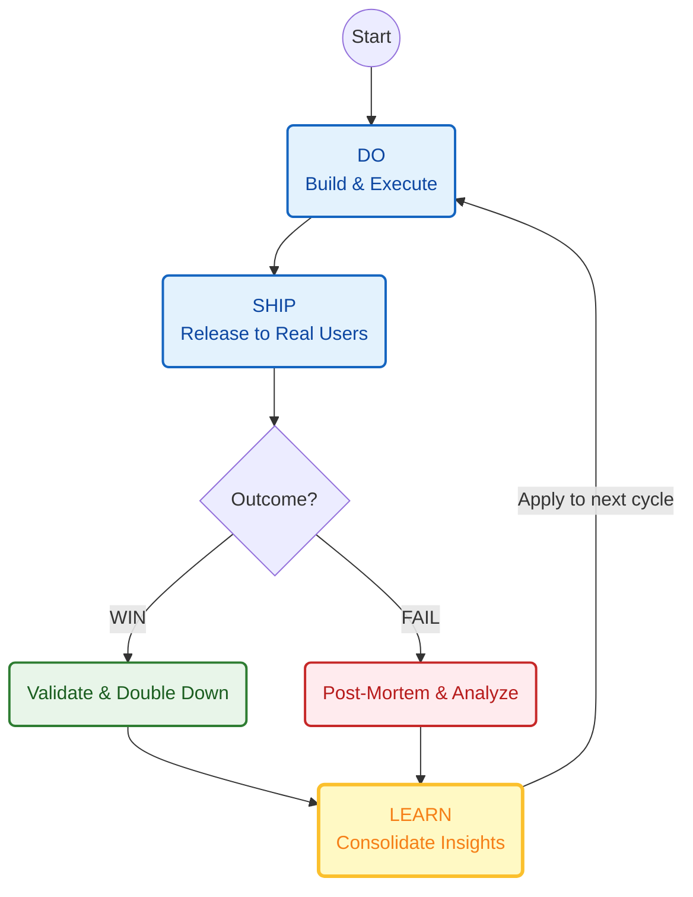

**Tl;DR**

Artists, artists...

Thats what social media has made us believe we are

All while we place the head of a pig in the public, while we actually sell dogs.


+++ Having a look to the latest: https://astro.build/themes/4/?search=&price%5B%5D=free


<!-- 
https://www.skool.com/@adriana-drozdowicz-4965 -->

**Intro**

If you are not a data professional, but a creative professional, like a music creator...


  



You will need to let the world know about your work/brand and where to find it.

That might be the thought of someone still trying to sell to the B2C world.

> As of today, im not sure if selling to 9-5 *,grey'* people is the best niche though

> > But hey, you got those likes and you are famous, keep reading :)


### SaaS around Links

People are building SaaS around links:

* Taplink
* bento.me
* https://getallmylinks.com/
* https://subscribepage.io/listy#
* https://linke.ro/
<!-- * Proposed: bogusiabachata.pro -->

* https://linktr.ee/lynnic
* https://www.youtube.com/@lynnic/featured


* https://indiepa.ge/charlieclark
* https://github.com/charlieclark
* https://www.liinks.co/?ref=indiepage_leaderboard

Which is validated to have done 1M+ https://indiepa.ge/leaderboard as of the time of writing

<!-- https://www.youtube.com/watch?v=uqah6bDkSxs -->




* https://www.liinks.co/i/plans
* https://www.youtube.com/watch?v=uqah6bDkSxs
* https://blog.liinks.co/link-in-bio-monetization-strategies-unlocking-new-revenue-streams-for-creators


#### OSS Links Web Profiles

I made couple of posts about ssg **themes for links**:


  
               


A Theme that [brings TinyCMS support and that i tried](https://jalcocert.github.io/JAlcocerT/gabemorris12-mechanism-project-setup/#tinacms) is: https://github.com/DBozhinovski/astro-theme-ltree

> An Astro theme that replicates Linktree _and_ Linkinbio rolled in one. Optional TinaCMS on top.

And recently I found about:

* https://github.com/francosuarez-dev/artistree
  * Which I could not avoid to fork: https://github.com/JAlcocerT/artistree

```md
#and added my fav tool of the year
Add a Makefile with bare metal install, dev and container-dev with also help
```


> **MIT** | Link in Bio Page for Artists 🎶

```sh
git clone https://github.com/JAlcocerT/artistree
cd artistree
make help
#make install & make dev
#make container-dev
```

Which can be an interesting compaion for LittleLink, which allow to builds links websites wo/code:


  
  



### What Links to show?

Because...

You have something more to show that social media apps...right?

Here you have some ideas with projects that I have been publishing about before.

Also, you can plug [Web Analytics](#web-analytics) or [Link Analytics](#link-analytics) to your links.

#### Waiting List for Products

I first built a Waiting2Landing: Two Astro Themes working together

First the waiting list theme captures leads via formbricks, then, changing to an agency landing page:


  
  



That should allow you to build DIY websites for your brand, as [I have been doing](https://jalcocert.github.io/JAlcocerT/gatsby-ghost-integration/#other-websites-ive-built)


  
  


I created this in the middle of the [last real estate updates post](https://jalcocert.github.io/JAlcocerT/real-estate-landing/#the-stack):


It's a clear example that, if you know what you are doing (at least vibe coding with the right fwk & instructions), you can get a: Cool UI/UX for Web, Admin Panel, with no external APIs, and a working waiting list to CSV for you to process later on.


#### Landing Page for your SaaS

After the waiting list and checking the PMF, comes building time.

For which you should have [a cool Landing Page](https://jalcocert.github.io/JAlcocerT/selling-with-a-landing-website/).

It does not have to be the Lando Norris Page, neither the genkinfy.

You could make it look impressive (yet not so much responsive)

But the aster you go from Idea to WaitingList/Landing *depending on your popularity* and to deployment into VPS, the higher changes to get Stripe notifications.

> It detects the framework, the web analytics, the ads...

A landing as companion for a link website does not have to be a multi-page one though:


> I migrated my brand to that data centered landing (and more) theme on [this post](https://jalcocert.github.io/JAlcocerT/keystaticcms-astrodb/)


Because some landing + video look fantastic, just that they are not so performant: https://github.com/midudev/landing-tesla

> Ejemplo de landing de Tesla con HTML, CSS, JavaScript, Astro y Tailwind
> > With very interesting video sections!

Haaad to fork this anyways: https://github.com/JAlcocerT/landing-tesla

> See `./public/video.webm` to see the video in action!


If you are confortable with animations on your landing, consider also:

* https://github.com/iann-mathaiya/nikola-tesla

> MIT | Which you guessed - I forked: https://github.com/JAlcocerT/nikola-tesla

https://jalcocert.github.io/JAlcocerT/selling-with-a-landing-website/


##### SaaS like...a t3chat?

t3-like-chat

##### Vibe Coded Landing Pages

This time, I wanted something quick with **NextJS**, and to try[ from the UI/X side **shadcn/ui**](https://jalcocert.github.io/JAlcocerT/blog/dev-web-code-css/#conclusions) and from the backend the **authJS** instead of the [last MUI + better auth x server](https://jalcocert.github.io/JAlcocerT/make-podcast/#auth-via-server-auth).



  
  


So taking the last learnings from [here](https://jalcocert.github.io/JAlcocerT/make-podcast/#creating-a-podcast-platform), I prepared:




Go to whatever LLM you are using and ask: `do you think that these requirements are clear enough?`

```md
Create a Landing Page based on NextJS with a cool and modern UI

There will be a login button that directs to `/login` from which via better-auth and a sqlite with a unique username and password provided as per .env that is the one who can access the `/admin`

Include a `dockerfile` and `docker-compose.yml` that will control the title, description, open-graph image, favicon location and other global website variables via environment variables.

Create also a makefile with the following commands:

* `make help` - Show available commands
* `make install` - Prepare the dependencies for local development
* `make dev` - Run development server
* `make container` - Build and Run in Docker container
```

> This time I was more specific than others on the [UI, with **MUI** ](https://jalcocert.github.io/JAlcocerT/blog/dev-web-code-css/#material-ui---mui)

> > Also, [MIU has now its llm.txt](https://mui.com/material-ui/llms.txt)

Then go to [AntiGravity IDE](#antigravity-ide) and ask if the `brd.md` refined already with Gemini is clear enough.

If it is clear define the `z-development-plan.md` and proceed with the development phases.

```sh
# git init
# git branch -m main
# git config user.name
# git config --global user.name "JAlcocerT"
# git config --global user.name
# git add .
# git commit -m "Initial commit: Starting simple make podcast platform"

#sudo apt install gh
gh auth login
#gh repo create make-podcast --private --source=. --remote=origin --push
    
git init && git add . && git commit -m "Initial commit: simple landing website" && gh repo create make-landing --private --source=. --remote=origin --push
```



Vibe coded it today, placed into [this previous post](https://jalcocert.github.io/JAlcocerT/micro-saas/) during my too optimistic period of 1 post a day earlier this year.

<!--  -->


  
  



For sth very quick and simple VanillaJS is enough, but if you really want to put a service behind, like users editing their own content etc...


```sh
git clone https://github.com/JAlcocerT/make-landing
cd make-landing
make help
#make install && make dev
```

> This is how easy is to go today beyond WP and Elementor!

> > And is not a bad niche at all, as I havent seen any Selfhostable SaaS for this kind of service with hosted version for money


https://jalcocert.github.io/JAlcocerT/selling-with-a-landing-website/


  
  



##### Status Pages

If you have few SaaS within your offer: you will want to prove the uptime status of your services


  



#### eBooks Pages

[Some People](https://jalcocert.github.io/JAlcocerT/ai-driven-ebooks/#how-people-send-ebooks) sell information via ebooks, why dont you do that?

In case you didnt know, creating [an ebook as a code](https://jalcocert.github.io/JAlcocerT/things-as-a-code/#ebooks-as-a-code) is not that hard:





<!-- https://github.com/JAlcocerT/sell-your-ebook -->


<!-- For now, this is a page with 1 ebook:


  
 -->

If you tinker with obfuscation, you can also publish a web/ook and allow to download the PDF as per certain conditions:


  
  


Additionally to the base theme: https://github.com/candidosales/landing-page-book-astro-tailwind

That I was tinkering with on [this post](https://jalcocert.github.io/JAlcocerT/cool-ebooks/)

There are other cool ones like:

* https://github.com/understanding-astro/understanding-astro-book

> The book content about astro is free available, but no license and no way to download the full pdf out of the box

You need to provide your contact details to get it for free :)


#### Obfuscated web/book pages

It all started [here](https://jalcocert.github.io/JAlcocerT/ai-driven-ebooks/#show-and-obfuscate) while testing how to create AI driven ebooks on [this repo: initially with RMD](https://github.com/JAlcocerT/ebooks).

<!-- 
https://github.com/JAlcocerT/obfuscate

 -->


  
  


> Now I have my ,webook' published: https://diy.jalcocertech.com thanks to that repo!

> > Will soon be something more than one ebook :)


  
  



##### Journals

If instead of photo centered, you are a text focused kind of person.

Something like ebooks that we talked, or a pure type centered link would be for you.

For you to focus on just-journal kind of thing.

* https://github.com/radishzzz/astro-theme-retypeset

> MIT |  Revive the beauty of typography


> > For sure this can inspire you to build web/ooks kind of things and enables multilanguage :)


#### Calendars

Something that looks really professional is to provide your availability.

As you are a cool creator, you will have a lot of demand:


  


If you ever had doubts how easy is to get cal embeded:

<!-- https://studio.youtube.com/video/qFMN0oDeCFg/edit -->


You can also bring your [MailerLite](https://jalcocert.github.io/JAlcocerT/mailerlite-for-saas/) subscription link:


  
  



#### Photo Galleries


I dont need to tell you why you need a photo centered link to your own photo gallery: *Im just here to tell you that you can*

0. https://github.com/iamnyasha/minimma - Check this one if you are modelling :)

> **MIT** | Interesting and simple Photo Centered Astro Theme

> > Could not avoid to fork - https://github.com/JAlcocerT/minimma as it reminded me to one Ghost Theme I used


But Ive been playing around quite a lot to get proper ig like galleries for real estate and for bloggers to have a cool place to publish.

<!-- 
 -->


  
    



1. https://github.com/obviyus/musee

> GPL3.0 | Fast, responsive , self-hosted image gallery. Ships minimal JS to the client.



* Simplicity: place your folder under `/src/assets/images/original/` and you are good to go
* Images are optimized to `.webp` at build time 
    * They go from ~1.92GB to 508mb (~75% reduction)

```bash
#npm install
npm install astro-purgecss@latest
```

Start development server

```bash
npm run dev
#npm run build
```



<!-- 
There is another Astro theme called musee
 -->


2. https://github.com/AREA44/astro-multiverse

> CC3.0 | One-page gallery design with a fully functional lightbox, designed by HTML5 UP


See also HUGO Theme Gallery implemented [here](https://jalcocert.github.io/JAlcocerT/websites-themes-2024/) and [here](https://jalcocert.github.io/JAlcocerT/creating-photo-centric-blog-with-hugo/)


3. https://github.com/crnacura/PlayersClub

>  Players Club is a free Astro template for showcasing music artists—an experimental proof of concept

4. https://github.com/evadecker/astro-photo-grid

Last time I wrote about Photo Galleries was [here](https://jalcocert.github.io/JAlcocerT/mailerlite-for-saas/#photo-gallery).

I have **added few** shortcodes/components: *like [whatsap bouble](https://github.com/JAlcocerT/just-ssg/tree/main/astro-ssg/whatsapp-bouble)*


  


Also, thanks to have tinkered with Nuxt (Vue) recently, got to know a very cool one: https://github.com/antfu/vue-starport



  
  


<!-- 
 
-->

#### Podcasts

By this time, you have a lot of audience: *you are an artist!*

So having one of the links pointing to your podcast platform is very simple.

<!--  -->


  
  


This is how to use **the astropod project** step by step:


  
  




To these themes you can also add formbricks and or calendar for more interactivity:


  
  


> You can also use [Gatsby SSG for Podcasting](https://jalcocert.github.io/JAlcocerT/gatsby-ghost-integration/#podcasts-in-gatsby)!

> > See how to bring audio via [Hugo components](https://github.com/JAlcocerT/JAlcocerT/tree/main/static/audio) as seen [here](http://localhost:1313/interesting-apis/#11labs)

#### Courses

Like...Skool for artists?

#### Tech Talks

If you have a podcast, chances are that you are **doing public speaking** out there.



  
  



##### PPT References

Who could have guess that you can do cool ppts as code:


  
  


And have them referenced into a repo to keep the history

While sharing the ppt as one of the links :)

##### Last Video Uploaded

Chances are also that you are recording the sessions and uploading them to youtube.

Get the last youtube video of your channel like: *just take the ChannelID*


  


1. Go to youtube studio and you will get the YT channelID
2. Then, use it into your link kindofwebsite via

<!-- 
https://studio.youtube.com/channel/UCPPMA8ZEusAe5dVH6PbjZFA/videos/ -->

```sh
curl -s "https://www.youtube.com/feeds/videos.xml?channel_id=UCPPMA8ZEusAe5dVH6PbjZFA"
#curl -s "https://www.youtube.com/feeds/videos.xml?channel_id=UCPPMA8ZEusAe5dVH6PbjZFA" | grep -oP '(?<=<title>).*?(?=</title>)' | head -5
```

##### Your CV

Oh I wrote tech talks instead of just motivational speaches: *because you are an artist.*

In case you are not, you could also plug as one of the links **your updated CV**:


  


If you have been having a long experience, you should [keep track of that](https://github.com/JAlcocerT/cv-laitex/tree/main/MyExperience)


> Just remember that one thing are beautiful CVs and other [machine readable cvs](https://github.com/JAlcocerT/cv-laitex/tree/main/CV_Parsing)

If you are looking to impress with a new curriculum, why not doing it as a **web CV**?

1. https://github.com/KonradSzwarc/devscard

> MIT | A fully customizable template to create your online (and paper) resume without writing a single line of code.

2. https://github.com/mmouzo/astro-cv-esquelete

> MIT | A free, easy-to-use CV template with a clean design. Just fill in your details and you're ready to go!


--- 

## Conclusions

This is also been a kind of...recap of websites too.


  
  



Botom line is simple: *Start!*




Examples of Portfolio Links websites?

* https://peladonerd.com/
* https://jalcocert.github.io/Portfolio - Deployed statically via GH Pages completely free!

More competitors on the **Saas Link Website domain**:

  * Taplink
  * bento.me *A comercial bento link website, owned by linktree*
  * https://getallmylinks.com/
  * https://subscribepage.io/listy#

  
I have been kind of trapped within SSGs to create cool websites as per a vibe coded version of what other real web devs have put together first.

But for simple link/bento/landing pages...just goahead and vibe code it from scratch via NextJS 'with a modern UI'.

Then, you wont probably need [session recording](https://jalcocert.github.io/JAlcocerT/how-to-record-web-sessions/) for such sites.

But you will want to validate the **web performance**:


  
  



```sh
#sudo apt-get install dnsutils -y #dns resolution
nslookup github.com 
dig google.com

curl -s -o /dev/null -w "dns_lookup: %{time_namelookup}s connect: %{time_connect}s appconnect: %{time_appconnect}s pretransfer: %{time_pretransfer}s starttransfer: %{time_starttransfer}s ---------- total: %{time_total}s http_code: %{http_code}" https://blog.jalcocertech.com
```


 









  
  


You will want to know **how your Website performs**:


* https://radar.cloudflare.com/scan/d92c5e34-6baf-42ad-bea1-e5c7e74a88bf/summary


* https://builtwith.com/theinstituteofskills.com/
* https://www.similarweb.com/website/theinstituteofskills.com/#traffic
<!-- 
* https://radar.cloudflare.com/scan?url=https://fossengineer.com/

 -->

> And maybe let others [place ads and get paid](https://jalcocert.github.io/JAlcocerT/trying-nuxt-themes/#adding-addsense)

### Vibe Coding is...old?

People seem to be moving from vibe coding to...sth new: spec driven development they call it.


And these are some tools:

* https://github.com/Fission-AI/OpenSpec

> MIT | Spec-driven development for AI coding assistants.

* https://github.com/github/spec-kit

> MIT | 💫 Toolkit to help you get started with Spec-Driven Development

* https://github.com/kirodotdev/Kiro

> Kiro is an agentic IDE that works alongside you from prototype to production.

#### About Web Development

Not sure how much better spec driven dev is.

But for sure that as of today you dont need to now [TS](https://jalcocert.github.io/JAlcocerT/whats-typescript/), neither [JavaScript](https://jalcocert.github.io/JAlcocerT/javascript-for-static-websites/) nor [CSS](https://jalcocert.github.io/JAlcocerT/blog/dev-web-code-css/) to create and publish a good looking and simple static website.

I recently tried [NuxtJS here](https://jalcocert.github.io/JAlcocerT/trying-nuxt-themes/).

And its quite clear that you better go with most popular fwks to build your own.


  
  


In case you need to, here are some useful components to provide inspiration to your agents:


  


---

## FAQ

### What we say vs what we do

* **Stated Preference (What they say):** Based on hypothetical questions. It captures what users *claim* they would choose.
* **Revealed Preference (What they do):** Based on actual behavior. It captures true preferences through real-world actions and choices.

La preferencia anunciada o preferencia declarada es un método para conocer las preferencias de los usuarios basado en lo que ellos dicen que elegirían en situaciones hipotéticas o que no han experimentado en la realidad.

Es muy utilizada en economía para anticipar cómo los consumidores podrían reaccionar ante nuevas opciones que aún no existen en el mercado. Por ejemplo, se puede preguntar a una persona qué opciones preferiría en un producto nuevo o servicio que no ha probado.[1]

Por otro lado, la preferencia revelada se basa en observar el comportamiento real de consumo del usuario, es decir, en las decisiones y elecciones efectivas que hace en la vida cotidiana.

La teoría de la preferencia revelada sostiene que las preferencias de los consumidores se pueden deducir de sus hábitos de compra reales, ya que el hecho de elegir un bien sobre otro revela cuál prefieren realmente bajo las restricciones de su presupuesto.

Esto implica que las preferencias se infieren a partir de las elecciones efectivas, no de declaraciones hipotéticas.[2]

| Type | Definition | PostHog Tool to Use |
| :--- | :--- | :--- |
| **Stated** | "I would use this feature." | **Surveys & Feedback:** Ask users directly what they want before building. |
| **Revealed** | They actually clicked/paid. | **Analytics & Session Replay:** Track clicks, retention, and time spent to see if they actually use it. |
| **The Goal** | **The Say/Do Gap** | Compare survey results against analytics to see if users are actually doing what they promised. |