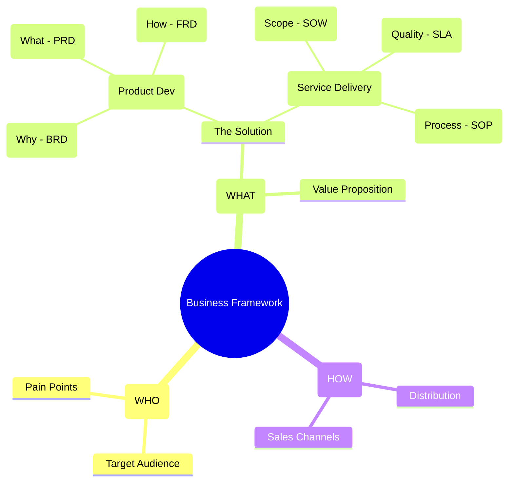
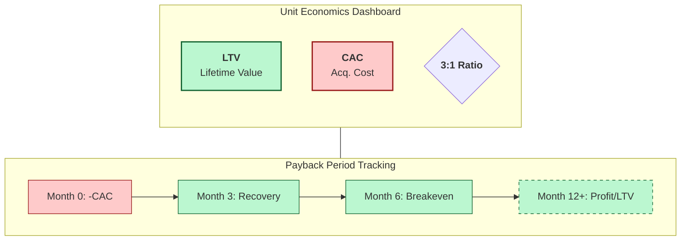

https://www.privategpt.io/
https://docs.privategpt.dev/recipes/choice-of-llm/list-of-ll-ms 


**Tl;DR**

Document Intelligence


  
  


PrivateGPT

What if having a **custom cool looking chatbot for your site** was a matter of copy-paste one snippet and configuring an UI the data sources?

    The Related: BRD, tech stack, dev phases, sales, more sales and landing psyc

The **launch strategy**: *aka, focus strategy*:

| Element | Decision |
| :--- | :--- |
| **One Avatar** | |
| **One Product** | |
| **One Channel** | |

The **Tier of Service**: 

* Enhanced DIY when you claim the free tier where you bring your own key and data + using built in functions
* DFY for custom logics like calling functions, calendar, forms...

The **customer segmentation**: SMB

The **tech stack**: *this solution can start as a consulting / setup service, then and only when there are PxV signals...a potential product*



| Requirement | Specification | Clarification / Decision |
| :--- | :--- | :--- |
| **Frontend Framework** | | |
| **Styling/UI Library** | | |
| **[Backend](https://jalcocert.github.io/JAlcocerT/docs/dev/fe-vs-be/)/Database** | | |
| **[Authentication](https://jalcocert.github.io/JAlcocerT/docs/dev/authentication/)** | | |


* Supply - DFY, finite *on demand basis*
* Demand - constrained
  * *Visitors of FossEngineer that are potential interested into OSS, but will be leaning more towards a DIY offer*
  * *Targeted users via APIFY google maps scrapping + cold emails / social media reach*

But it does not apply, as the goal of this is more closing a long chapter and making the final learnings with it.


  
  


As the why, what was very clear, its time to put together the final HOW:

```md
# Project Name: [SaaS Name]

## 1. The Why (BRD)
- **Problem:** [Describe the pain point]
- **Value Prop:** [How I solve it]
- **Monetization:** [e.g., $9/mo Subscription via Stripe]

## 2. The What (PRD)
- **Primary User Flow:** Landing -> Auth -> Core Feature -> Payment.
- **V1 Features:** - [ ] Auth (Google/Email)
  - [ ] Feature A (The core value)
  - [ ] Settings (Billing/Delete account)

## 3. The How (FRD)
- **Stack:** T3 Stack (Next.js, Prisma, TRPC)
- **DB Schema:** - User: id, email, stripe_id
  - Data: id, user_id, content, timestamp
```

**Intro**

You cant be an AI company behore you are a data centered company.

And before having LLMs to get company context...that context have to be somewhere.

Like in the selfhosted knowledge base I was commenting [here](https://jalcocert.github.io/JAlcocerT/knowledge-management/).

To make the solution trustless: selfhosted + local `.md` based + local LLM has to be the way forward.

Is very pleasent to navigate though projects docs with AI assistances to do QnA as commented [here](https://jalcocert.github.io/JAlcocerT/interesting-books-and-diy-offer/#a-chatbot-for-registered-ones-to-do-qna).



  
  


And as [commented during xmas with a friend](https://jalcocert.github.io/JAlcocerT/calculus-101/#helping-others), this can become a thing for SMB and mid companies that power the world, just that you havent heard of them.

## The Process to build a ChatBot Platform

Use cases:

* 🤖 Chatbots
* ❓ Question Answering
* 🔍 Semantic Search

{}

### Tinkered with websites

That bus trip to Vilna (to start the Vilnus-Tallin cycling trip) and discovering [Astro](https://jalcocert.github.io/JAlcocerT/create-your-website-astro-ssg/) paid off.

### Used Streamlit to add custom RAG

With a real estate example around a Python Web App.

And made tech talks around it.

### Used Ollama on my HomeLab

With [this initial post](https://fossengineer.com/selfhosting-llms-ollama/)

Later with [Open Web UI](https://fossengineer.com/ollama-open-webui-setup-with-docker/)

Then with [Deepseek as local model](https://fossengineer.com/how-to-use-deepseek-locally-for-free/)

All via containers

### Used Embeddings with LangChain

https://jalcocert.github.io/JAlcocerT/how-to-chat-with-pdfs and explored few frameworks like llamaindex and pandasAI.

Also tinkered with [RAG around CSVs](https://jalcocert.github.io/JAlcocerT/how-to-chat-with-your-data/).

Probably the 2 most common files type in any office!

### LLM communicating with DBs

Via langchain is also possible to [talk with a database](https://jalcocert.github.io/JAlcocerT/langchain-chat-with-database/).

This unlucks potential to have bots that are checking stocks in real time for their replies.

Or the ETA if you have a table that bring such info!

### Configured N8N on my VPS

And shared it with a couple marketers.

### Tested all around website embedding

Tested the drag'n'drop chatbots, like Typebot.

Made few custom chatbots, [with fastapi here](https://github.com/JAlcocerT/selfhosted-landing/tree/master/chatbot-logic) and [with typescript here](https://jalcocert.github.io/JAlcocerT/diy-landing-boilerplate/#typescript-custom-chatbot) that brought context.


### Got tired of cloning astro templates

So started vibe coding mine.

From diy-landings, that you can plug chatbots to [DFY real estate solutions](https://github.com/JAlcocerT/moi-realestate-pro-astro-bot).

### Put together a notes about KBs

Because Im a documentation geek and dont like to go over the same twice.

The path is clear once and has to be available to solve future doubts from the team.

### Talked with a friend about this

The potential use case of having companies in house documentation + RAG based QnA to about silos.

{}

Reading better and writing more has been one of my go tos.

Specially after putting together these repos:

And the final recent outcome: the one that [enables you](#you-can-also-do-this) to create.


## Building the solution

This has 2 sides:

1. The Local AI Part:


  
  


Something like a desktop app communicating with local llms running in house could be a thing. 

Like ~Goose.

2. The Local wiki / SknowledBase / [KB](https://jalcocert.github.io/JAlcocerT/knowledge-management/#conclusions) / [selfhostable notes](https://fossengineer.com/selfhostable-note-taking-tools/) / info part:


  
  


Same questions apply: web only? desktop app required? mobile?

3. How to treat huge amount of information: *embeddings , vector DBs, RAG architectures*


---

## Conclusions


### How Ive placed a Qna around my notes

Recently, I was talking about my new [1ton web/ook platform](https://github.com/JAlcocerT/1ton-ebooks).

Where Im distilling all my experience in short chapters for anyone *including llms* to consume.

I have just added the possibility for people to do [QnA directly to such knowledge base](https://jalcocert.github.io/JAlcocerT/interesting-books-and-diy-offer/#a-chatbot-for-registered-ones-to-do-qna).

You can get also perspective from [several domain ideas linked](#faq) thanks to that.


  
  



Because: programming, marketing and sales is all you need.

But if you are able to far transfer from other aspects of life, thats what will differenciate your vision and products.

### Need Help?


  
  


Because ebooks wont create succesfull ideas into reality for you: *would you dare to see whats behind the blur?*





---

## FAQ


### About some interesting books Ive read


https://jalcocert.github.io/JAlcocerT/blog/da-bk-learning/

https://jalcocert.github.io/JAlcocerT/negotiation-skills-data-analytics/

https://jalcocert.github.io/JAlcocerT/psychology-skills-data-analytics/


<!-- 
#range
#peak
#ultra learning 
https://jalcocert.github.io/JAlcocerT/blog/da-bk-learning/
-->


<!-- ## Spaced learning -->
<!-- ultra learning 
range - why generalist...
-->

This has been possible thanks to countless youtube videos, perplexity and notebookllm, together with a huge txt file of kindle notes I have:


  
  



#### NeuroMarketing


<!-- 
neuromarketing
brainfluence
the persuasion code -->

#### Story Telling

<!-- 
Data storytelling in analytics is important because it helps to uncover insights from data that might otherwise go unnoticed, and also helps to communicate those insights to others in a more engaging and memorable way. By presenting data in the form of a narrative, we can make the insights more relatable and understandable to a wider range of people. This is especially important in the world of business, where decisions need to be made based on data and insights, but not everyone may have the technical expertise to fully understand the underlying data.

Furthermore, data storytelling has been shown to be more effective at communicating insights and influencing decisions than simply presenting data in a spreadsheet or chart. By providing context and meaning to the data, data storytelling can help decision-makers better understand the implications of the data and make more informed decisions based on those insights. Overall, data storytelling is a powerful tool that can help organizations unlock the full potential of their data and use it to drive better decision-making and business outcomes. -->

<!-- 
story telling with data
 -->

<!-- In your analytics career, 
 -->

<!-- Data interacts with narratives and systems in the following ways:

* Data shapes a strategic narrative – Whether you’re segmenting customers or developing brand stories, data provides context to shape and share stories.
* Data visualizations deliver the story – In formats such as data journalism, data-inspired social media campaigns and analyst reports, organizations use data visualizations to deliver powerful stories.
* Data provides macro insights – Humans or AI interpret big-picture patterns in data to form an insight, which provides the basis for a story.
* Data shapes processes – Using visually prepared data – via dashboards – systems emerge that enable the control of workflows, processes and states by detecting anomalies and monitoring systems. 

-->


### Business Ideas from my Kindle Notes


#### Sales

It seems we are always selling in live.

Just that we dont realize it.


<!-- 
### The Punch Line -->


<!-- ## BIAS and Noise

<!-- 
how this relates to ml -->

<!-- ### The Prevalence of Noise

Remember that correlation **does not** implies causality. --> -->

<!-- 
## Interacting with others

59 seconds book -->
<!-- ### The shiny Object Syndrome -->

<!-- ### The Dunning-Krugger Effect

### Dilution Effect


### What is Wishful Thinking?

### Certainty Effect -->

<!-- 
what every body is saying 

the persuasion code
influence: the psy of persuasion
the persuasion code
-->


<!-- 
referencia a persuasion escrito en jan 2022

y aqui cositas de neuromarketing

the buying brain....
`brainfluence`

 -->

### About Journaling

I was tinkering around [markdown editors](https://jalcocert.github.io/JAlcocerT/astro-i18/#an-editor-for-astro-blog-posts) last year.

And put together a [journaling recap for artists](https://jalcocert.github.io/JAlcocerT/link-artists/#journals).

But wanted to cover in depth: https://github.com/subhamBharadwaz/scribbly

> **MIT** |  Scribbly is a web application built with Next.js and Prisma that allows users to create and manage their digital journal. With a user-friendly interface powered by Radix UI and Shadcn/UI components, Scribbly makes journaling a breeze. It includes features such as customizable reminders, secure user authentication with Clerk, and a subscription plan 


<!--  Gettings things done
7 Habits of highly effective 
essentialism
atomic habits
the power of habit
the power of now-->


<!-- Psychology-skills-data-analytics/#the-paradox-of-success
Psychology-skills-data-analytics/#the-optimism-bias -->

<!-- ### Requirements Gathering -->

<!-- * Listen -->

<!-- ### The Echo Chambers

is social media a source of tribalism

When society embraces disruptive new scientific theories, philosopher Thomas Kuhn explains that such changes demand a “paradigm shift”: People must debate and agree upon a new narrative before replacing the old one. 

Today, however, people often only engage with those who share their opinions. Digital channels have returned humans to a cave-like existence: Only a small social bubble within an echo chamber shares a given person’s view of reality.

“The multiplicity of digital channels allows us to avoid self-awareness and surround ourselves with the people (or machines, it is not always certain) who share our opinions.” 

Individuals that hold opposing viewpoints on reality encourage, criticize, and adjust one another's ideas, influencing economic and human behavior.

Different narratives, like an epidemic, may infect and alter communities, according to Shiller. 

The validity of a narrative has no bearing on its "contagion rate." 

Viral tales capture attention, look cohesive, and fit readily into existing narratives.

-->


<!-- ## Understanding Routines

Habits

Discipline must be saved for essential activities. -->

<!-- 
#thinking fast and slow
 -->
 
<!-- 
'psychology-skills-data-analytics' -->
<!-- 
### Binary Thinking

*Either or* -->