**Tl;DR**

Creating **Lead Magnet**: get a FREE web audit

*Leveraging the audit discoveries done [here](https://jalcocert.github.io/JAlcocerT/do-your-instagram/#web-audits)*


  
    


**Intro**

I have been following couple of sites on blogspot.

* `https://valdigijon.blogspot.com/`
* `https://elescritoriodetesla.blogspot.com/`

Could they have a responsive (and nice looking site), without loosing its old content?


## Programmatic Free Audits for Websites

Give me your contact details and I will move the world.

Or in this case: verify your email and select which if these audits you want to perform against your site for free (by default some will be selected).

Ive seen some good examples: `https://www.beedigital.es/analisis-seo-gratuito/`


Btw, the **pages speed insights**, can be done via **API**: *see [this .md](https://github.com/JAlcocerT/morita-web/blob/main/z-pagespeedinsight-101.md)*


Must have also Lighthouse-CI:

Could it also be a check on exposed API endpoints?

At least to have CORS and Rate limiting (?)

Whatever this is...I made it work into a secondary mission.

A side side side project.

I mean...the photo gallery v2 things i was tinkering during xmas *now winter holidays*

It incorporated a programmatic 101 web audit.



  



People who have some product/service still need a website.

Crazy.

Let's make them see how good is their current one.



```sh
#git init && git add . && git commit -m "Initial commit: Starting a landing with lead magnet" && gh repo create poc_webs_magnet --private --source=. --remote=origin --push
```

```md
what i want to create with this project is a modern landing page that acts as a lead magnet, by providing a free web audit for anyone that provides its website and contact details. 

So ideally we will have a clear frontend a backend part

could we create a z-brd.md to describe this?

could we also add a functional requirement, so that all the copy from the landing will be controlled from a site.md file?
```

```md
what it needs to happen so that when i do make dev it will be exposed to the local network not just localhost?
can we have a docker-compose.prod.yml

that makes the UI available into my network cloudflared_tunnel so that i can use it to expose via y custom domain?
just do one that the network will be external, as i have cf in a separated docker stack already

can we add a consent button to the t&c

which have to be created as a separated markown

i think we also need privacy policy

and to indicate that the result of the website performance will be provided by mail and that the user also accept marketing emails with possibility tu unsub anytime

can the footer content be alsocontrolled by the site.md copy?

can we do that the privacy and terms pages are better looking?

also, what could we do so that we use to the max the above the fold section? lets brainstorm here

open in new tab all hyperlink

so now if i run this, will the reply be dsaved to csv and formbricks?

can we have a docker-compose.prod.yml with such network?

networks:
  cloudflared_tunnel:
    external: true

add also the make comand like make-docker-prod-up

can we add this compatibility?

the id and web wshould be in the env variables of the prod yml

<script defer src="https://weban.fossengineer.com/script.js" data-website-id="abcdef"></script>
```

Powered by Gemini 3 Flash this time :)

Built with Astro 5 & Tailwind 4!


```sh
#./audit-master.sh https://beyondajourney.lol

make dev
```




First things first, give me the website name to analyze.

Then your email and contact details, consenting for marketing.

Then...we move forward:


You get via mail a detailed summary, with a transaction email.

Options for Anyone to get a Website: DIY/DWY/DFY.

This can play nicely with some guerrilla marketing: *scan and get a free audit!*


And this landing aims to show you that it can be done better.

Also more eco :)


  
  



One option for a great lead magnets are those who show a problem.

Like getting to know that your site is not that good actually.

---

## Conclusions

Scrapping BlogSpot for Migrating its content?

Get the owner consent.

Then see


A post of what I learnt about [Scrapping Tools](https://github.com/JAlcocerT/Scrap_Tools)


```sh
git clone https://github.com/JAlcocerT/poc_webs_magnet
cd poc_webs_magnet
make docker-prod-up
#docker ps -a --format "table {{.Names}}\t{{.Status}}\t{{.CreatedAt}}"
```

Which is plugged to .csv and to formbricks `web-audits` as per this doc. `https://app.formbricks.com`


Run it from the root directory:

```bash
bash test-formbricks.sh
```

You will need the survey id and the environentid!


You have this solution available at: `webaudit.jalcocertech.com` thanks to `auditmagnet-prod:3001` or `http://192.168.1.2:3023`.


When is done, you get:


Things that you get to know when you tinker with servers.

Want to get the website you deserve?

Without spending thillion hours?


  
  


If you are not doing that yet: *build with a git repo*


  
    


How does my current **value ladder** looks like?

```mermaid
flowchart LR
    %% --- Styles ---
    classDef free fill:#E8F5E9,stroke:#2E7D32,stroke-width:2px,color:#1B5E20;
    classDef low fill:#FFF9C4,stroke:#FBC02D,stroke-width:2px,color:#FBC02D;
    classDef mid fill:#FFE0B2,stroke:#F57C00,stroke-width:2px,color:#F57C00;
    classDef high fill:#FFCDD2,stroke:#C62828,stroke-width:2px,color:#C62828;

    %% --- Nodes ---
    L0("Free Content<br/>($0)"):::free
    L1("AuditMagnet 🛡️<br/>(Free Web Audit )"):::free
    L11(" Blog/Youtube"):::free
    L12(" ebooks"):::free
    L2("DIY<br/>(Optimization Guides) $"):::low
    L3("Done With You<br/>(Consulting) $$"):::mid
    L4("Done For You<br/>(Full Service) $$$"):::high

    %% --- Connections ---
    L0 --> L1
    L0 --> L2
    L0 --> L11
    L0 --> L12
    L2 --> L3
    L3 --> L4
```



Yep, the service tiers offering is getting some shape.

This is the perfect way to visualize the "trade-off" between these two routes. 

You are moving from a **Productized Commodity** (WebApp) to **Bespoke Strategic Partnership** (Fractional Agency).

In the **Value Ladder**, the difference is between **Efficiency (Save me effort)** and **Results (Make me money).**


#### 1. The Value Ladder Mapping

| Level | Route | Value Proposition | "The Vibe" |
| --- | --- | --- | --- |
| **Low-Mid (DIY+)** | **WebApp** | **"The Quick Solve"** | "I have a problem (need photos), give me a 5-minute solution that works." |
| **High (DWY/DFY)** | **Fractional Agency** | **"The Growth Engine"** | "I have a business, give me the brain that optimizes my entire formula." |

##### **The WebApp (DIY / Automated Service)**

* **Position:** **Low-friction utility.**
* **The Proposition:** You aren't selling "photography software"; you are selling the **removal of friction**.
* **Logic:** It's "DIY" in the sense that they set it up, but "Done-for-you" in the sense that the technology handles the heavy lifting instantly.
* **Formula Focus:** High ****, low ****. You succeed because the "cost of trying" is so low ($49) that the customer doesn't need a meeting to decide.

##### **The Fractional Agency (Done-With-You / Done-For-You)**

* **Position:** **Strategic Partner.**
* **The Proposition:** You aren't selling "reports"; you are selling **alpha**. You are the person who finds the "leaks".
* **Logic:** This is high-customization. You are looking at *their* specific Shopif data and giving *their* COO specific orders.
* **Formula Focus:** Low ****, very high ****. You succeed because the ROI of your "brain" is worth 10x your retainer.

---

#### 2. How the "Proposition" Changes the Formula

| Variable | **WebApp (Quick Solve)** | **Fractional (Strategic Partner)** |
| --- | --- | --- |
| **The [BET]** | "Our QR code is the fastest/prettiest." | "I will increase your Net Profit by 15%." |
| **Sales Cycle** | **3 minutes** (Automated) | **3 weeks** (Relationship-based) |
| **Customization** | **Low:** One size fits all. | **High:** Deep dive into specific pain points. |
| **Churn Risk** | **High per unit** (One-off events). | **Low per unit** (Long-term stickiness). |
| **COO Focus** | **Tech Stability:** Site must not crash. | **Client Results:** Insights must be accurate. |

---

#### 3. The "Moonlighter's" Strategic Advantage

Because you have **$100k+ in net assets** and **one stable job**, you have the luxury of "playing both sides" of the value ladder:

1. **The WebApp** is your "Scaling Engine." It builds an asset that could eventually be worth a **7-figure exit** (based on a multiple).
2. **The Fractional Agency** is your "Expertise Engine." It keeps your skills sharp and provides *high-ticket cash flow* that you can dump into the WebApp's **[GROWTH BET]** (Ads).

---

#### 4. Which one "Wins" for You?

* **Go WebApp** if you want to test your **Product/Marketing** skills. You want to build a "Machine" that makes money while you are at your 1st job.
* **Go Fractional** if you want to test your **Consulting/Strategic** skills. You want to be the "secret weapon" for other CEOs.

**The Ultimate Path:** Start the **WebApp** first.

Why? Because you already have the "Service" income from your 1st job.
 
Adding a second "Service" (the Agency) just adds more people-management. 

The WebApp adds **Leverage**.

---

## FAQ

### Preparing for BlogSpot Migration

Does it even have a sitemap?

```sh
#curl -s https://example.com/sitemap.xml -o /dev/null -w "%{http_code}\n"
curl -s https://valdigijon.blogspot.com/sitemap.xml -o /dev/null -w "%{http_code}\n" #200 means its there!

#optional - check robots.txt
curl -s https://valdigijon.blogspot.com/robots.txt | grep -i sitemap
```

> Search for any references to a sitemap URL within the `robots.txt` file. If found, you can use that URL to check for the sitemap instead



A sitemap is crucial for improving a website’s discoverability and SEO (Search Engine Optimization). Here’s why a sitemap matters and what happens if there's no `robots.txt`:

Why a Sitemap Matters

1. **Improves Search Engine Indexing:**
   A sitemap provides search engines like Google and Bing with a structured list of URLs on your site. It helps search engines discover and crawl all pages, especially those that might not be easily accessible through internal links.

2. **Better Crawling of Dynamic or Large Websites:**
   For large websites or those with dynamically generated content, a sitemap ensures that all important pages are indexed, even if they aren’t directly linked or deeply buried.

3. **Prioritization and Metadata:**
   Sitemaps can include metadata about each URL, such as the last modification date, update frequency, and page priority. This helps search engines determine how often to crawl the site and which pages are more important.

4. **Ensures Coverage of Non-standard Pages:**
   Pages that are difficult to discover via normal crawling (due to missing internal links or complex site structures) are more likely to be indexed when included in a sitemap.

5. **Helps with Internationalization and Media Content:**
   Sitemaps can include references to different language versions of a site or media like images and videos, ensuring that all variations are indexed and searchable.

**What If You Don’t See a `robots.txt` File?**

1. **Crawling Isn't Blocked, But It’s Less Controlled:**
   If a `robots.txt` file is missing, search engines will still crawl the site, but you won’t have explicit control over which pages or sections should be excluded. The `robots.txt` file is typically used to block crawlers from indexing certain pages, like admin panels or duplicate content.

2. **No Sitemap Declaration:**
   Some websites include the sitemap location within the `robots.txt` file, which helps search engines find it. If the `robots.txt` file isn’t present, search engines will still try to find the sitemap at the default location (`/sitemap.xml`). However, if it's stored elsewhere and there's no declaration, it may be harder for search engines to discover it.

3. **Default Crawling Behavior:**
   Without `robots.txt`, search engines will follow their default crawling behavior, which might include crawling unnecessary or unoptimized pages (such as login pages, search results, etc.). This can lead to inefficient crawling and negatively affect how well the site is indexed.

A sitemap enhances your website’s discoverability and SEO performance by ensuring that search engines can index all important content. 

Even if there's no `robots.txt`, search engines will crawl the site, but without the benefit of directives for exclusion or a clear sitemap location, which could lead to inefficiencies.




### Still Want a WP?

Wanna Tinker with [php](https://jalcocert.github.io/JAlcocerT/backend-alternatives/) and wordpress?


  
  


If you start **fresh on a VPS** and have Docker and WordPress set up, bringing your WordPress theme into that environment involves a few steps:


  



* https://jalcocert.github.io/JAlcocerT/automating-ghost-and-wordpress/

* https://jalcocert.github.io/JAlcocerT/no-code-websites/


1. Step 1: Prepare Your Docker WordPress Setup

Ensure your WordPress Docker container is running and accessible. Usually, you’ll have WordPress files mounted on a volume inside the container, often at `/var/www/html/wp-content/themes/`.

2. Step 2: Copy Your Theme to the VPS

You can bring the theme files over to the VPS using:

- **SCP or SFTP**: Upload your theme folder (which contains `style.css`, `functions.php`, and all necessary theme files) into the WordPress themes directory on the VPS.  

Example SCP command:
```bash
scp -r /local/path/to/my-theme username@vps_ip:/path-to-docker-volume/wp-content/themes/
```

- **Git Clone**: If your theme is in a Git repository (e.g., GitHub), you can clone it directly inside the themes folder if you have access on the VPS:  

```bash
cd /path-to-docker-volume/wp-content/themes/
git clone https://github.com/your_username/your-wordpress-theme.git
```

- **Docker Volume Mounting (for Development)**: When developing locally or on VPS, you can mount your local theme folder as a Docker volume in the container for live edits without copying each time.

Step 3: Activate the Theme in WordPress

Once your theme files are in the themes directory:

1. Log in to your WordPress admin at `http://your-vps-ip/wp-admin`.
2. Navigate to **Appearance → Themes**.
3. Find your uploaded theme and click **Activate**.

Step 4: Optional—Upload Theme ZIP via Admin

As an alternative, through the WordPress Admin UI:

- Go to **Appearance → Themes → Add New → Upload Theme**.
- Upload a zip archive of your theme; WordPress will install and activate it.


| Method | Description | When to Use |
|--------|-------------|-------------|
| SCP/SFTP Copy | Manually copy theme files | Direct file control, VPS access |
| Git Clone | Clone theme repo directly | Theme under Git version control |
| Docker Volume Mount | Mount theme folder as volume | Development/live sync |
| WordPress UI Upload | Upload via admin dashboard | Simple manual install |

This workflow lets you manage your themes conveniently on a fresh Docker WordPress VPS environment.

Yes, there are many open-source WordPress themes freely available on GitHub. 

In fact, thousands of developers and organizations—including Automattic (the company behind WordPress.com)—host and maintain GPL-licensed WordPress themes there.

These can be used, studied, modified, or forked for your own projects.

**Examples of Popular Open-Source WordPress Themes on GitHub**

Some of the most widely used and high-quality open-source WordPress themes include:

- **[Roots / Sage](https://github.com/roots/sage)** — a Laravel Blade-based WordPress starter theme with Tailwind CSS and full block editor support; a favorite among professional developers (over 13k stars).[1]
- **Automattic / themes** — a collection of official free themes built by the WordPress.com team, released under GPL-2.0.[2]
- **WordPress / community-themes** — a repository of block-based themes demonstrating WordPress’s new Full Site Editing (FSE) capabilities, developed collaboratively by the community.[3]
- **digitoimistodude / air-light** — a lightweight (<20 kB) starter theme optimized for developers, using HTML5 and minimal dependencies.[6]
- **them.es** — open-source starter themes built with Bootstrap or Material Design that support full site editing, responsive design, localization, and build automation.[8]
- **solstice23 / Argon** and **mirai-mamori / Sakurairo** — popular modern community-maintained designs supporting internationalization and colorful UI.[1]

You can explore thousands more in the **GitHub “wordpress-theme” topic**, which currently includes over 4,000 public repositories across PHP, CSS, and JavaScript projects.[1]

**Installing Themes from GitHub**

You can manually download a theme ZIP file from GitHub and install it through **WordPress → Appearance → Themes → Upload Theme**.  

Alternatively, use tools like **WP Pusher** or **GitHub Updater** to install and automatically update WordPress themes directly from public GitHub repositories.[5][9]

All of these themes respect GPL open-source licensing, meaning you can modify or even resell them under your own distribution as long as you retain the same license.