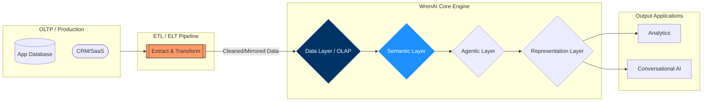
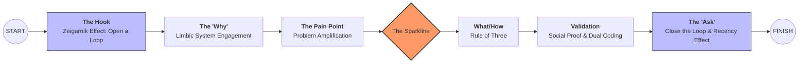
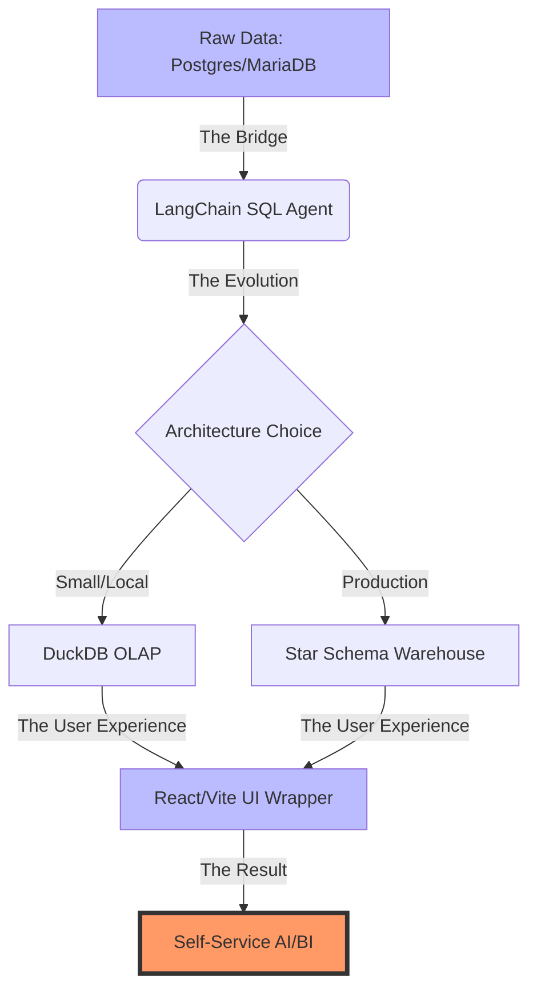
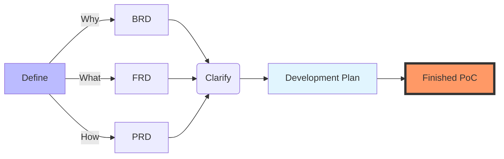
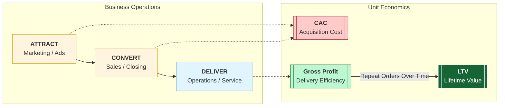

**TL;DR**

Creating **green field POCs** based on this pattern helped me a lot.

Get the benefits of it, without having to build it from scratch.


**Intro**

How good are your ideas? How good are you describing them?

I was thinking to put these notes in a separated repo to [the n ebooks](https://github.com/JAlcocerT/1ton-ebooks).

The ones that are going to get you to ship ideas. Fast.

I changed my mind for the sake of simplicity: *last thing I created in this direction, is [inside the n ebooks post](https://jalcocert.github.io/JAlcocerT/interesting-books-and-diy-offer/#building-n-ebooks-for-a-webook)*

Previously I was thinking to have this in a separated repo:

* https://github.com/JAlcocerT/bip-boilerplate-saas
* https://github.com/JAlcocerT/boilerplate



  
  


But for now, im putting it together here: *as im not focusing on free community building*


  



## Why Creating like a BA

Are you a BA/PM/Product Manager?

Well, before moving forward answer these questions:

* Can you specify goals? 
* Can you provide context? 
* Can you divide up tasks?
* Can you give feedback?
* How good are you at articulating ideas?

Wanna ship like an entire dev team?

If you got ideas and now how to manage a project and people, excuses are over.

This is what it will make you ship.


  


Is curiosity a career liability?

Well...maybe not if you know how to **far transfer** your learning.

Agentic development abstract the *how to* so that if you have a Why and a What you can get the code running:


### Shipping Features 

This is exactly what I did to put together **an UI** to the [Database QnA plug and play analytics around langchain](https://jalcocert.github.io/JAlcocerT/plug-and-play-data-analytics/).


How about an example around: Selfservice data analytics?

<!-- 
https://youtu.be/qf-oNNNDXS0 -->


 

<!-- 
 
-->



Langchain db query to postgres container and custom bi over it? 

What if it would be possible not just doing QnA, but also generating insights via graphs?


---

## Conclusions

It seems we are moving to a state where its more about collecting ideas to make something people wants powered by agents.

See something that people need?

Why not building people's dream as a way to succeed?

I have proven that you can do [a DIY landing page in ~ 30 minutes](https://youtu.be/4xQVUw5YirE), or this plug and play data analytics full stack app [in ~ 40 minutes](https://youtu.be/qf-oNNNDXS0).


  
  


### The tech talk

We can call this: *The Boilerplate brd prd frd tech talk.*

Or the *From Business focused to Makers - Agentic BI Development*

Or...the spec-driven development guide: *all about the role, context, task, with up to date superpowers.*

The idea is to show non tech business users couple success examples.

Let’s explore the core principles that make AI your powerful and safe teammate: the ai mindset

1. Default to Assist: Before starting any task, think about how AI can support you, for example, by creating drafts, exploring ideas, or checking content.
2. Human in the Loop: Humans always make the final decisions.
All deliverables — whether committed to repositories or shared with clients — must be reviewed by a person before submission.
3. Small Iterations:Work in short cycles: break the task down → write a focused prompt → review the quick result → refine as needed.
4. Reproducibility: Save and version your effective prompts and context (as templates or collections) just like code, so others can reuse and improve them.
5. Source Validation: When using AI-generated content, ask for references and clearly separate facts from AI-generated assumptions in your reports or documents.
6. Effectiveness Over Magic: Focus on measurable impact (time saved, fewer defects, better coverage) rather than on the “wow” effect of AI output.

Let’s explore how to craft effective prompts for AI, so you get accurate, structured, and actionable outputs. The key is to think of prompting as a flow:

Goal -> Context -> Instruction -> Contrains -> Output Format

Remember these principles:

Use short, iterative prompts rather than overloading a single one.

Require reasoning or references when applicable.

Prefer structured outputs like JSON or tables for clarity and consistency.

So, use Structured prompts when you need precise, machine-readable outputs (configs, data extraction, or templates). 

And use Natural-Language prompts for open-ended, creative, or exploratory tasks (like explanations, brainstorming, or translations).

The context window is the amount of information an AI model can “hold in memory” and use when generating a response. Think of it as the model’s workspace: everything placed there (your prompt, open files, conversation history, or documentation) affects the accuracy and relevance of its output.


For example, in Cursor, if you have index.js open alongside config.json, the model can “see” both files within its context window and, for example, suggest the correct environment variable setup. However, if a file is too large to fit entirely, some information may fall outside the context window, and the model could make mistakes.


Each model has its own limit for how much information it can process at once. Here are some examples:

GPT-4-Turbo: up to 128k tokens (~100–200 pages of text)

Claude 3 Opus: up to 200k tokens

GPT-3.5: up to 16k tokens (~10–15 pages)

LLaMA 2 70B: ~65k tokens

Include only relevant information — keep files, snippets, and docs focused; minimize noise.
Work iteratively — avoid dumping entire repos or huge logs at once.
Use RAG or indexing for large projects — load only necessary data into the context on demand.
Be aware of limits — information beyond the model’s context window is “forgotten.”
Summarize or checkpoint — preserve reasoning and important details in long sessions.

```json
[
  {
    "id": "US-1",
    "title": "string",
    "description": "string",
    "acceptance_criteria": ["string"],
    "risks": ["string"],
    "open_questions": ["string"]
  }
]
```

Task → JSON Output — helps you clearly define role, goal, context, and output format.

{
  "role": "Business Analyst",
  "goal": "Transform meeting notes into backlog",
  "context": "Minimal, no PII",
  "constraints": "Company standards, deadline",
  "output": {
    "summary": "string",
    "actions": ["string"],
    "risks": [{"name": "string", "mitigation": "string"}]
  }
}

{
  "role": "Business Analyst",
  "context": "Meeting transcript (anonymized)",
  "task": "Extract backlog",
  "output": [
    {
      "id": "US-<number>",
      "title": "string",
      "description": "string",
      "acceptance_criteria": ["string"],
      "dependencies": ["string"],
      "risks": ["string"],
      "open_questions": ["string"]
    }
  ]
}
> “Can I use AI to make this task faster or better?”


before sending to AI

- Context minimized, no PII/secrets
- Clear goal, constraints, output format
- Request sources/evidence where needed

Prompt Template: HLD → ADR

Role: System Architect
Task: Analyze non-functional requirements
Output: table with [Quality Attribute | Metric/Target | Risks | Validation]

Prompt Template: Mermaid Sequence

Role: Architect
Task: Generate Mermaid sequence for “authentication + purchase”
Constraints: show SLA points, retries, timeouts

Role: UX Lead
Task: Create 3 payment screen variants (mobile-first)
Constraints: WCAG AA
Output: list [elements | hierarchy | states | KPI for A/B testing]

Just do what you know, The Planning and contex: *with proper context, you make agents outputs more predictable*

* **BRD (Business Requirements):** Answers **"WHY build this?"** (The Vision & Goals).
* **PRD (Product Requirements):** Answers **"WHAT are we building?"** (The Features & Roadmap).
* **FRD (Functional Requirements):** Answers **"HOW does it work?"** (The Technical Logic & CRUDs).


Mainly the plug and play D&A tinkered [here](https://jalcocert.github.io/JAlcocerT/plug-and-play-data-analytics/#conclusions).


  
  


And also the DIY component based Landing created [here](https://jalcocert.github.io/JAlcocerT/diy-landing-boilerplate/#the-diy-landing-project)


  


To spin the slidev ppt for BAs/PMs: *clone this, go to the folder and enjoy*

```sh
git clone https://github.com/JAlcocerT/selfhosted-landing
cd y2026-tech-talks/2- ba-brd-development
#npm run dev 
```

Ive also used the opportunity to improve how I do my ppts.

To make my posts **and presentations more engaging** from a psychological perspective, I should shift from a "Technical Documentation" style to a "Narrative Transformation" style.

With a [skeleton for slidev](https://github.com/JAlcocerT/selfhosted-landing/blob/master/y2026-tech-talks/sample-skeleton-slides.md) to be consumed by agents and this notes about [engagement tactics](https://github.com/JAlcocerT/selfhosted-landing/blob/master/y2026-tech-talks/engaging-presentations.md).

See how powerful such *psyc stack ideas* are on [this mindmap](https://mermaid.live/edit#pako:eNpdU11v2zAM_CuEHooWa7qm-awxDMjSYCuwoFnSZUCRF0WmbSGyaEhyNq_ofx-dNLXXBwMyyaPujtSzUBSjiESubZzLYmMBHFE4P5_ZVKaYow2ftu7j54WvVEaG0urioi4CmOUUNFlp4BvR7hgDWDjaGsxhkhdGJ1rJuuaUBFhl0mEMM4t51UTvY75GJxUspLawIG3DKTklG5z0AR4zJNfC8D-sCul2Rltswr8yGeDew94fj1MqTQxfXismIdQ3kYW5tK_yTtgn1Kl0Vu9gliSoQtPzoUAL34kK38R-WoeezJ7FzCsfsKG2QpN0vqJF9147qTqk4EeJvk612s2ZCDs5KWMdfOOlzqWq4AyWqNCqlvoF_UZ3IKZt2uozUXXjzoPT3JC5TQ35pmJKqdVB77Eek0Jfp07Yu5Lvn1LcCgGsta_DH2CNbitNm6_LpY7hTsvUyfyNwbI0CJTwdBy2prKQbLyztY4jhf98weBrTA90wLylnlJXc2S6d9orVlK6Vs99RxmtdiAtu_TOziXGpUK4twm5YxIe9ugMyfhY9OhK3qkzNjxk5HR4s_a4iqGCidGpbe9HzUim-WGCS0xY9X9WzWVQGUcOM-RhIaxJyW1pZGs1SGm2k5VR0iCn0vMqhxrWkvCoc-wE6qwyXcBaGh0fdIhLkTodiyi4Ei9FfpwDP-DnGroRIeOl3oiIjzEmsjRhIzb2hWGFtE9E-QnpqEwzESXSeP4rC26Pr9N8K0Ebo-MXZIOIRr3rQw8RPYs_Iur0bodXw_F43B2Nbvrj0Wh4KSoRdQeDq5vB9WDY5--m3-_1Xy7F38O13at-d3w7GvSvGdbr8_fyD50JZmY)  which follows [such flow](https://mermaid.live/edit#pako:eNqFk2Fv2jAQhv-K5aoqSKRtCCQ0qpBY6QZStVVNtEob--DEl8TCsaPEaUsR_32OAylomsoH5Du_fu71-bLFsaSAfZyWpMhQOF8JpH-BIqXq9YJw9hT2-8iypmgh5fr3bTQNMzDr26toehuVV9PHUkYccjTLC84SFhPFpDA7AfDE-gYCSpNDs5oy9aet0P43IEMPQVRasv1RgEAPUha7Y9l-1yifs83BxoVeX3Q-lhSEYmqDZpylIteBST-wPGIxuhcpSaHJnhjQBEN9ZC9SHbgm6LhNJihIueZMgMk8Z0ShZYVeKmSWd7LmFH2BE7KBGHYged3cv7O9kK8ftp9qDkgmKMxKaPHzmnDNpEykaM6Ifpm8OkEfgK3zUsqkQf8knNG2-Qd2IGOmWUbS3oXlYClpBRkr0BxyeWq50RnoE1T7Gts7Liv490k-FObAvaDd9WbV-uh6EIOIN-g-SSBWXUNDKVia6dZlhHMQ6WnvNK3tnJJFr_d1-X0ZLPr9lWh3z8_1xka_RtrGlQ6gm5GEce6fJTfuoFKlXIN_5jjOsfDI-adaM5-tKoqS_6kau5-K2nnYV0ySEaWdko7Ite3tQ-uVUZX5w-IND_RXySj2VVnDAOdQ5qQJ8bbhrrDK9DyvsK-XFBJSc7XCK7HTxwoifkmZH06Wsk4z7CeEVzqqCz0lsB-sTgKCQqkHWSjs29eOZyDY3-I3HY_cS8-Z2PbQHdv2zdAe4A32rbHnXY482x4PHa0YD73dAL-bsvala09c2_Wca2_iThx3uPsLikFleQ).



For example:




> The presentation now leverages Contrast Theory, Dual Coding, Social Proof, and the Zeigarnik Effect for maximum psychological impact on your BA audience!

> > Together with an [example brd](https://github.com/JAlcocerT/langchain-db-ui/blob/master/brd-langchain-ui.md), [clarifications](https://github.com/JAlcocerT/langchain-db-ui/blob/master/z-clarifications.md) and [development plan](https://github.com/JAlcocerT/langchain-db-ui/blob/master/development-phases.md).



From now I do: tinkering + tech ppt with engagement + email proposal + slack promo.


Im working on that complementary *psychological stack*. See the [mindmap](https://mermaid.live/edit#pako:eNpdVF1v20YQ_CuLeygS1HIVWR-xUBRQJDc1YMOs5TpAoJcTuaQWOt6ye0cnjOH_3qUcmVTfqNnb2bmZPT2blDM0c1OSz0pbbTyAMMd37xLBgD7aSOx_38pvfyShSXfsuGjev2-PAVyV3Fatg7-Y968YQCK8dVjCoqwc5ZQeGI5FgPXOCmZw5bFseqiz6R5Wt5BY8pAw-Xgs3lC5pVQbCltgiV0B4GGH8GXXQE4SenBSS8UBgZ9Q4IYLSo-1JfsoNsS2k6U5ZVpXVvaOPHbwl52NcB3gKbx-Lrl2GXz6eWIRo8rR273ysjs2fkUqrHjaw1WeY9qTdlehV0lchQ77x6vV7J7UldsmROx0rdHlg8_oUf5vIqctlMLfNYa21KNb1BnFVvFawzsxLBEqbdrAL3CPKfq0d_-Ev6lXrTryRZ8sbdkHd0LKowKXjkN3YsmFp0hPqLgVim-Eq1qXYsmZHu24Him08K_wiLK1rivcopSWMliRLcSWb-Pva6ch5hqOYC-UxKrv4ttLvM7vO_NJ2P_AwZrUTxl8Zpd12R_F3rDNenTChQYQ2sqKQqo3rKU37nGwdKTLufDqXs9r7cvbtsMDeJC628DrrF2L2MDCUeFPVzYRW5SH6O4x18ueOLRqvCIp3N3ftgEudeW2_NasoZOO0rmcdz1Lq5u-jho69nJ7oBIHkQfrHVXwaB1lJxv0pxWVbH3IUXreLWC9J-cCRIbFdTuprGKP9eo7pnW0-rxV_b81yWG9gjkzhVBm5lFqPDPla5z6p_Lctm5M3Om5jZnrZ4a5rV3cmI1_0bbK-q_M5bFTuC52Zp5bF_RXXalo_LkUb6igz1D0Ifpo5pPJ9EBi5s_mu5kPRqPx-XA6m8wuL6bD4WQ2mp2Zxsw_jCbnF5ez8XSildlw-vHi5cz8OAz-cD7-eDkejRSbDkfj8eXFy38FxZK0).




To this you can manage change of scope by adding change request like `CRQ01.md`

---

## FAQ

### Businesses Unit Economics

This visualization illustrates the fundamental "unit economics" of a healthy business.

1. The Relationship: LTV vs. CAC

The box on the right represents the **LTV:CAC Ratio**.

* **CAC (Customer Acquisition Cost):** The red box. This is the amount of money you spend to get one new customer (marketing, sales, etc.).
* **LTV (Lifetime Value):** The green box. This is the total revenue a customer generates for you over the entire time they use your service.
* **The Goal:** For a business to be sustainable, the green box must be significantly larger than the red box. A common "Gold Standard" for SaaS is an **LTV:CAC ratio of 3:1**.

2. The Timeline: "Payback Period"

The bar chart shows how this plays out over **Time**:

* **The Initial Dip (Red Bar):** At the start (Time 0), you are in the negative. This is because you just paid the **CAC** to acquire the customer, but they haven't paid you enough yet to cover that cost.
* **The Recovery (Green Bars):** As time passes, the customer continues to pay (subscriptions, repeat purchases). Each green bar represents the profit from that customer over time.
* **The "Payback Period":** This is the moment the green bars cross above the horizontal line. A healthy company usually wants to recover their CAC in under 12 months.

The diagram says: **"I spend a little (CAC) to start a relationship that loses money initially, but over time, the customer provides much more value (LTV) than they cost to acquire."**

If the red bars stayed below the line or the CAC box was bigger than the LTV box, the business would eventually run out of money.


Too long payback period and good ideas can go out of track: *Payback period ~ cash flow isues*


Great questions. 

These terms are the building blocks of that "Payback Period" chart you liked.

To understand them, think of your business as a **leaky bucket**. 

**Revenue** is the water coming in, and **Profit** is what stays in the bucket after it passes through different "filters" (expenses).

1. Gross Profit: The "Core" Efficiency

**Gross Profit** measures how much you keep after the **direct costs** of delivering your service.

* **The Formula:**  (Cost of Goods Sold).
* **What is COGS?** These are the costs that go up every time you sell one more unit. In a restaurant, it's the ingredients. In software (SaaS), it’s things like server hosting fees, customer support, and payment processing fees.
* **Why it matters:** It shows if your core product is actually worth making. If you sell a burger for **$10** and the meat/bun costs **$4**, your Gross Profit is **$6**.

2. Net Profit: The "Bottom Line"

**Net Profit** is what is left after **absolutely everything** is paid.

* **The Formula:** .
* **What are Operating Expenses?** These are "overhead" costs that you pay even if you don't sell anything today, such as office rent, management salaries, and legal fees.
* **Why it matters:** This is the "final answer" for your business. It tells you if the company is actually making money or losing it.


3. Where does CAC come in?

**CAC (Customer Acquisition Cost)** is primarily an **Operating Expense**. 

It usually lives in the "Sales and Marketing" line of your financial statements.

In your chart with the red and green bars, CAC is the **reason** for that initial red dip:

* **Gross Profit** is usually the "Green Bar" height (Revenue minus the direct cost to serve that customer).
* **CAC** is the "Initial Investment" you paid upfront to get that customer.
* **Net Profit per Customer** only becomes positive once those green bars (cumulative Gross Profit) have "paid back" the initial red bar (CAC).

| Metric | Includes | Where it sits |
| --- | --- | --- |
| **Gross Profit** | Revenue - COGS (Servers, Support) | Near the Top |
| **CAC** | Sales & Marketing (Ads, Sales Reps) | In the Middle |
| **Net Profit** | Gross Profit - (CAC + Rent + Taxes) | The Bottom Line |

Summary

* **Gross Profit** tells you if your **product** is good.
* **CAC** tells you if your **marketing** is efficient.
* **Net Profit** tells you if your **entire business** is sustainable.

Would you like me to show you how a high **CAC** can "kill" a company even if their **Gross Profit** looks amazing?

#### The operational heartbeat

The **Attract, Convert, and Deliver** workflow is the operational heartbeat of a business. 

Your unit economics (CAC, LTV, and Gross Profit) act as the "scoreboard" for how well each stage of this workflow is performing.

Here is how the financial metrics map directly to your operations:

1. Attract & Convert (The "CAC" Zone)

This phase is everything you do to turn a stranger into a customer.

It is the primary driver of your **Customer Acquisition Cost (CAC)**.

* **Attract:** Costs include ad spend, content creation, and SEO efforts designed to bring people into your "Awareness" funnel.
* **Convert:** Costs include sales team salaries, demos, and CRM tools needed to close the deal.
* **Performance Indicator:** If your workflow is inefficient (e.g., you attract the wrong audience or have a leaky conversion funnel), your **CAC will rise**, making that "initial red dip" in your chart much deeper.

2. Delivery (The "Gross Profit" Zone)

Once a customer is converted, you must provide the product or service. This is where **Gross Profit** is determined.

* **Delivery:** This involves the "Cost of Goods Sold" (COGS)—direct costs like raw materials, shipping, server hosting, and customer support labor.
* **Performance Indicator:** Your **Gross Profit Margin** tells you how efficiently you are "delivering". A high margin means it costs you very little to fulfill the promise you made during the Convert stage.

3. The "Full Workflow" Connection (LTV)

The **Lifetime Value (LTV)** is the result of how well you continue to **Deliver** and **Retain** over time.

| Workflow Stage | Primary Metric | Purpose |
| --- | --- | --- |
| **Attract & Convert** | **CAC** | Measuring the efficiency of your sales and marketing "engine". |
| **Delivery** | **Gross Profit** | Measuring the efficiency of your production or service "engine". |
| **Retention** | **LTV** | Measuring the long-term value of the customer relationship. |

How they relate to your chart:

* **The Red Bar (Month 0):** This is the cost of your **Attract & Convert** workflow.
* **The Green Bars (Future Months):** This is the **Gross Profit** generated by your **Delivery** workflow.
* **The Goal:** You want a "Deliver" workflow so efficient (high Gross Profit) and a "Convert" workflow so effective (low CAC) that you reach the **Payback Point** as quickly as possible.




Its up to you to choose between: *CAC ~0 vs high LTV business*