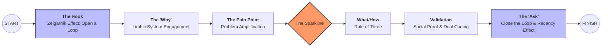
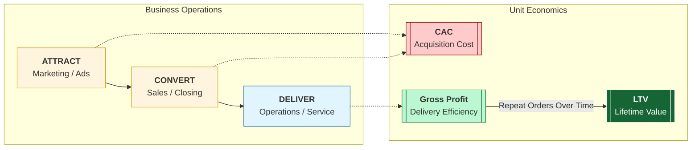

**TL;DR**

Creating green field POCs based on this pattern helped me a lot.

Get the benefits of it, without having to build it from scratch.

**Intro**

I was thinking to put these in a separated repo to [the n ebooks](https://github.com/JAlcocerT/1ton-ebooks).

But i changed my mind for the sake of simplicity: *last thing I created in this direction, is [inside the n ebooks post](https://jalcocert.github.io/JAlcocerT/interesting-books-and-diy-offer/#building-n-ebooks-for-a-webook)*

Previously I was thinking to have this in a separated repo

* https://github.com/JAlcocerT/bip-boilerplate-saas
* https://github.com/JAlcocerT/boilerplate

  



  



## Why Creating like a BA

Are you a BA/PM/Product Manager?

Well, before moving forward answer these questions:

* Can you specify goals? 
* Can you provide context? 
* Can you divide up tasks?
*  Can you give feedback?

Wanna ship like an entire dev team?

If you got ideas and now how to manage a project and people, excuses are over.

This is what it will make you ship.


  


Is curiosity a career liability?

Well...maybe not if you know how to **far transfer** your learning.

Agentic development abstract the *how to* so that if you have a Why and a What you can get the code running:


### Shipping Features 

This is exactly what I did to put together an UI to the [Database QnA plug and play analytics around langchain](https://jalcocert.github.io/JAlcocerT/plug-and-play-data-analytics/).


How about an example around: Selfservice data analytics?

<!-- 
https://youtu.be/qf-oNNNDXS0 -->


 

<!-- 
 
-->


Langchain db query to postgres container and custom bi over it? 

What if it would be possible not just doing QnA, but also generating insights via graphs?


---

## Conclusions

It seems we are moving to a state where its more about collecting ideas to make something people wants powered by agents.

See something that people need?

Why not building people's dream as a way to succeed?

I have proven that you can do [a DIY landing page in ~ 30 minutes](https://youtu.be/4xQVUw5YirE), or this plug and play data analytics full stack app [in ~ 40 minutes](https://youtu.be/qf-oNNNDXS0).

### The tech talk

We can call this: The Boilerplate brd prd frd tech talk.

The idea os to show non tech business users couple success examples.

Mainly the plug and play D&A tinkered [here](https://jalcocert.github.io/JAlcocerT/plug-and-play-data-analytics/#conclusions).


  
  


And also the DIY component based Landing created [here](https://jalcocert.github.io/JAlcocerT/diy-landing-boilerplate/#the-diy-landing-project)


  


To spin the slidev ppt for BAs/PMs:

```sh
git clone https://github.com/JAlcocerT/selfhosted-landing
cd y2026-tech-talks/2- ba-brd-development
#npm run dev 
```

Ive also used the opportunity to improve how I do my ppts.

With a [skeleton for slidev](https://github.com/JAlcocerT/selfhosted-landing/blob/master/y2026-tech-talks/sample-skeleton-slides.md) to be consumed by agents and this notes about [engagement tactics](https://github.com/JAlcocerT/selfhosted-landing/blob/master/y2026-tech-talks/engaging-presentations.md).



---


## FAQ

### Businesses Unit Economics

This visualization illustrates the fundamental "unit economics" of a healthy business.

1. The Relationship: LTV vs. CAC

The box on the right represents the **LTV:CAC Ratio**.

* **CAC (Customer Acquisition Cost):** The red box. This is the amount of money you spend to get one new customer (marketing, sales, etc.).
* **LTV (Lifetime Value):** The green box. This is the total revenue a customer generates for you over the entire time they use your service.
* **The Goal:** For a business to be sustainable, the green box must be significantly larger than the red box. A common "Gold Standard" for SaaS is an **LTV:CAC ratio of 3:1**.

2. The Timeline: "Payback Period"

The bar chart shows how this plays out over **Time**:

* **The Initial Dip (Red Bar):** At the start (Time 0), you are in the negative. This is because you just paid the **CAC** to acquire the customer, but they haven't paid you enough yet to cover that cost.
* **The Recovery (Green Bars):** As time passes, the customer continues to pay (subscriptions, repeat purchases). Each green bar represents the profit from that customer over time.
* **The "Payback Period":** This is the moment the green bars cross above the horizontal line. A healthy company usually wants to recover their CAC in under 12 months.

The diagram says: **"I spend a little (CAC) to start a relationship that loses money initially, but over time, the customer provides much more value (LTV) than they cost to acquire."**

If the red bars stayed below the line or the CAC box was bigger than the LTV box, the business would eventually run out of money.


Too long payback period and good ideas can go out of track: *Payback period ~ cash flow isues*


Great questions. These terms are the building blocks of that "Payback Period" chart you liked.

To understand them, think of your business as a **leaky bucket**. **Revenue** is the water coming in, and **Profit** is what stays in the bucket after it passes through different "filters" (expenses).

1. Gross Profit: The "Core" Efficiency

**Gross Profit** measures how much you keep after the **direct costs** of delivering your service.

* **The Formula:**  (Cost of Goods Sold).
* **What is COGS?** These are the costs that go up every time you sell one more unit. In a restaurant, it's the ingredients. In software (SaaS), it’s things like server hosting fees, customer support, and payment processing fees.
* **Why it matters:** It shows if your core product is actually worth making. If you sell a burger for **$10** and the meat/bun costs **$4**, your Gross Profit is **$6**.

2. Net Profit: The "Bottom Line"

**Net Profit** is what is left after **absolutely everything** is paid.

* **The Formula:** .
* **What are Operating Expenses?** These are "overhead" costs that you pay even if you don't sell anything today, such as office rent, management salaries, and legal fees.
* **Why it matters:** This is the "final answer" for your business. It tells you if the company is actually making money or losing it.


3. Where does CAC come in?

**CAC (Customer Acquisition Cost)** is primarily an **Operating Expense**. It usually lives in the "Sales and Marketing" line of your financial statements.

In your chart with the red and green bars, CAC is the **reason** for that initial red dip:

* **Gross Profit** is usually the "Green Bar" height (Revenue minus the direct cost to serve that customer).
* **CAC** is the "Initial Investment" you paid upfront to get that customer.
* **Net Profit per Customer** only becomes positive once those green bars (cumulative Gross Profit) have "paid back" the initial red bar (CAC).

| Metric | Includes | Where it sits |
| --- | --- | --- |
| **Gross Profit** | Revenue - COGS (Servers, Support) | Near the Top |
| **CAC** | Sales & Marketing (Ads, Sales Reps) | In the Middle |
| **Net Profit** | Gross Profit - (CAC + Rent + Taxes) | The Bottom Line |

Summary

* **Gross Profit** tells you if your **product** is good.
* **CAC** tells you if your **marketing** is efficient.
* **Net Profit** tells you if your **entire business** is sustainable.

Would you like me to show you how a high **CAC** can "kill" a company even if their **Gross Profit** looks amazing?

#### The operational heartbeat

The **Attract, Convert, and Deliver** workflow is the operational heartbeat of a business. 

Your unit economics (CAC, LTV, and Gross Profit) act as the "scoreboard" for how well each stage of this workflow is performing.

Here is how the financial metrics map directly to your operations:

1. Attract & Convert (The "CAC" Zone)

This phase is everything you do to turn a stranger into a customer. It is the primary driver of your **Customer Acquisition Cost (CAC)**.

* **Attract:** Costs include ad spend, content creation, and SEO efforts designed to bring people into your "Awareness" funnel.
* **Convert:** Costs include sales team salaries, demos, and CRM tools needed to close the deal.
* **Performance Indicator:** If your workflow is inefficient (e.g., you attract the wrong audience or have a leaky conversion funnel), your **CAC will rise**, making that "initial red dip" in your chart much deeper.

2. Delivery (The "Gross Profit" Zone)

Once a customer is converted, you must provide the product or service. This is where **Gross Profit** is determined.

* **Delivery:** This involves the "Cost of Goods Sold" (COGS)—direct costs like raw materials, shipping, server hosting, and customer support labor.
* **Performance Indicator:** Your **Gross Profit Margin** tells you how efficiently you are "delivering". A high margin means it costs you very little to fulfill the promise you made during the Convert stage.

3. The "Full Workflow" Connection (LTV)

The **Lifetime Value (LTV)** is the result of how well you continue to **Deliver** and **Retain** over time.

| Workflow Stage | Primary Metric | Purpose |
| --- | --- | --- |
| **Attract & Convert** | **CAC** | Measuring the efficiency of your sales and marketing "engine". |
| **Delivery** | **Gross Profit** | Measuring the efficiency of your production or service "engine". |
| **Retention** | **LTV** | Measuring the long-term value of the customer relationship. |

How they relate to your chart:

* **The Red Bar (Month 0):** This is the cost of your **Attract & Convert** workflow.
* **The Green Bars (Future Months):** This is the **Gross Profit** generated by your **Delivery** workflow.
* **The Goal:** You want a "Deliver" workflow so efficient (high Gross Profit) and a "Convert" workflow so effective (low CAC) that you reach the **Payback Point** as quickly as possible.




Its up to you to choose between: *CAC ~0 vs high LTV business*