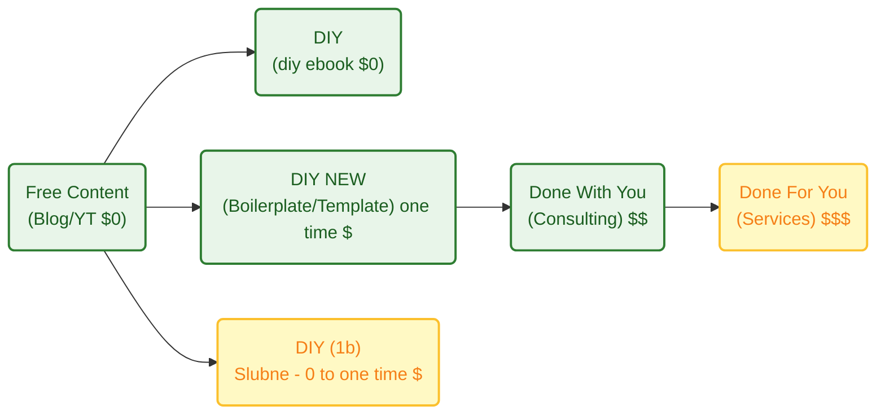

**TL;DR**

When thinking about **ways to decouple time and value delivery**...

How to create a landing page that converts the non so lazy and enables to create via a **one time payment to adquire knowledge that is proven to work**?

The **launch strategy**: *aka, focus strategy*

| Element | Decision |
| :--- | :--- |
| **One Avatar** | Undicided people w/o a clear way how to proceed|
| **One Product** | |
| **One Channel** | |

The **Tier of Service**: DIY (1a - *leverages on knowledge*)

The **tech stack**: *see how it has been done on [this section](https://jalcocert.github.io/JAlcocerT/diy-landing-boilerplate/#now---creating-diy-landing-boilerplate)*

| Requirement | Specification | Clarification / Decision |
| :--- | :--- | :--- |
| **Frontend Framework** | | |
| **Styling/UI Library** | | |
| **[Backend](https://jalcocert.github.io/JAlcocerT/docs/dev/fe-vs-be/)/Database** | | |
| **[Authentication](https://jalcocert.github.io/JAlcocerT/docs/dev/authentication/)** | | |
| Others | Web Analytics / ads / Cal / Formbricks / ESP | Yes, via MailTrp |

* TAM: *not calculated, if it helps someone, would be amazing*
* LTV: *not calculated*
* CaC: ~0$ + the time cost of sharing on social media / forums from my time at this point

So...if all of that is...undefined: whats **the goal**?

To move away from "selling time" (which caps your income) to "selling value" (which creates scale).

This might also be combined with [the upcoming offers](#my-offer-after-diy-landing) DIY x PaaS to enable people to have a wordpress going and the N ebooks / web/ook.


**Intro**

I saw sth interesting across social media and forums [here](https://forocoches.com/foro/showthread.php?t=10544529) and [here](https://forocoches.com/foro/showthread.php?t=10544108)

People need stg...but are not able to articulate the what.

And having a website is so easy, everyone does that and If i would want to....id also do mine.

Specially with AI, its... 3 seconds.

No action.

So, as my BRD of doing these landings works so good, im *productionazing it* with the shape of...**code + life time access and a landing.**


Kind of...

People are using them to sell ebooks `https://readmake.com/` or ways to code: `https://codefa.st/#pricing`, `https://shipfa.st/?ref=indiepage`

Or to sell simple microSaaS services like: `https://poopup.co/`


Lets get to it.


  
  



## What should a landing have?

An effective landing page is less like a brochure and more like a focused conversation. 

Since it usually has one specific goal—getting a visitor to sign up, buy, or download—every element needs to point toward  conversion.

Here are the essential parts to consider, organized by how a user typically experiences them:

### The "Above the Fold" Essentials

This is what users see before they even start scrolling. You have about five seconds to convince them to stay.

* **Headline:** This should be your **Unique Value Proposition (UVP)**. Don't describe what you are; describe the primary benefit the user gets.
* **Sub-headline:** A brief explanation that supports the headline by adding context or addressing a common pain point.
* **Primary Call to Action (CTA):** A high-contrast button that tells the user exactly what to do next (e.g., "Get Started for Free" vs. "Submit").
* **Hero Image/Video:** A visual that shows the product in action or represents the "feeling" of the desired result.

### Building Authority & Trust

People are naturally skeptical. You need to prove you can deliver on your promises.

* **Social Proof:** Testimonials, customer logos, or "As Seen In" badges. Real faces and full names make testimonials much more believable.
* **Trust Signals:** Security badges, money-back guarantees, or data regarding your success (e.g., "Joined by 10,000+ professionals").

### The "Why" and "How"

Now that they are interested, you need to provide the logic to back up the emotional hook.

* **Features vs. Benefits:** Don't just list technical specs. Explain *how* those features solve the user's problem.
* *Feature:* "256-bit encryption."
* *Benefit:* "Your data stays private and secure, no matter what."


* **The "How it Works" Section:** A simple 1-2-3 step breakdown of the process to lower the perceived barrier to entry.

### Friction Reduction

This is where you remove the final excuses a user might have for leaving.

* **FAQ Section:** Address the most common objections or "what if" questions right on the page.
* **Simplified Form:** If your goal is a lead, keep the form fields to a minimum. Every extra field reduces your conversion rate.
* **Secondary CTA:** A repeat of your main button at the bottom of the page so the user doesn't have to scroll back up once they finish reading.


| Element | Purpose |
| --- | --- |
| **Clarity** | Can a stranger understand what you offer in 5 seconds? |
| **Consistency** | Does the page match the ad or link that brought them there? |
| **Speed** | Does the page load instantly? (Crucial for mobile users). |
| **Singular Focus** | Is there only **one** goal for the page? (Remove navigation menus). |

## My Journey creating Landings


{}

### Discovering AntiGravity

### Got to know mailerlite

Wouldnt it be nice to capture email into a Email marketing platform (EMP)?

It is also possible by copy pasting snippets.

And via OSS with Listmonk.

### Tested few ESP

From the email service providers tested [here](https://jalcocert.github.io/JAlcocerT/emails-101/)

I decided to continue with Mailtrap API due to its nice deliverability.


Specially via the API (SMTP tends to go to spam).

**Why it is considered the best:**

* **Deliverability:** Unlike other services, the author noted that with Mailtrap, the **"email flows directly to your inbox"** using a custom domain, whereas others (like Mailjet or Mailgun) often ended up in the spam folder during testing.
* **Ease of Use:** It is described as being **"among the easiest to configure for developers,"** especially for testing and sandboxing.
* **Integration:** It offers a wide range of integrations, including a native **n8n node**, **Supabase**, and even an **MCP tool for VS Code**, allowing you to send emails directly from your code editor.
* **Reliability with Backends:** The author successfully used it as the SMTP relay for **PocketBase**, confirming it works well for sending one-time codes and magic links.


| Service | Author's Rank | Key Strength |
| --- | --- | --- |
| **Mailtrap** | **#1** | Best deliverability to inbox & developer-friendly testing. |
| **Resend** | **#2** | Great API, Cloudflare integration, and can *receive* mail. |
| **Mailjet** | **#3** | Ideal for high-volume marketing/transactional relay via Listmonk. |


### Created a DWY landing page

With formbricks and cal.com support: `consulting.jalcocertech.com` done [here](https://github.com/JAlcocerT/selfhosted-landing).


The only thing is that emails were not verfied, neither I was sending a thing to them.

Well, stripe emails are...,verified' behind a paywall :)


### Combined email capture with programmatic emails

If you got unverified emails from formbricks or from sth like the `make-landing` project that saves them into a `.db` or `.csv`

You can do [programmatic emails via ESP](https://github.com/JAlcocerT/make-landing/blob/master/mailetrap-esp.ipynb) to send them goodies: *info, attachments, verifications, etc.*

[](https://colab.research.google.com/github/JAlcocerT/make-landing/blob/main/mailetrap-esp.ipynb)


### VibeCoded via BRDs

Because if [a BRD](https://jalcocert.github.io/JAlcocerT/brd-vs-frd-for-data-analytics/) is supposed to make things clear for a dev team, it can do the same for agents.

Adding features via **Change Requests** like [this one](https://github.com/JAlcocerT/selfhosted-landing/blob/master/z-change-request-5.md), have also been great.


### Now - Creating diy-landing-boilerplate

Enough about past, last fast forward to now and create:

```sh
git init && git add . && git commit -m "Initial commit: Starting N ebooks DIY" && gh repo diy-landing-boilerplate --private --source=. --remote=origin --push
```

{}


{}

```sh
#git init && git add . && git commit -m "Initial commit: Starting N ebooks DIY" && gh repo create 1toN-ebooks --private --source=. --remote=origin --push
```

{}


---

## Conclusions

You can think of it this way: Listmonk (the EMP) is your operating system for managing lists...

Mailjet *(the ESP/SMTP)* is your high-performance engine that ensures your emails actually reach the inbox.

And your landing page is what your potential clients see and get to know about you within 5 seconds.


  
  



### My Offer after DIY Landing


