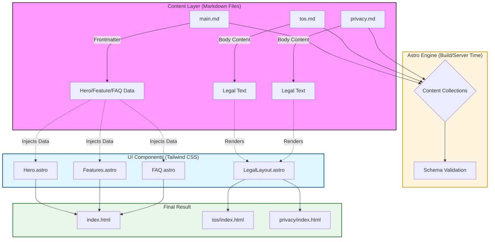
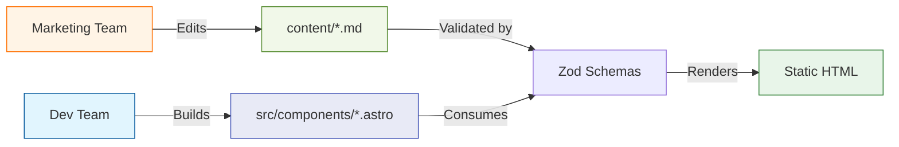
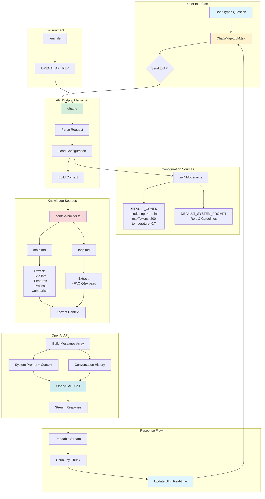
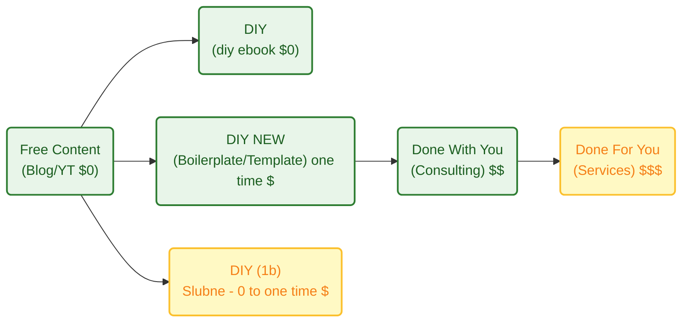

**TL;DR**

When thinking about **ways to decouple time and value delivery**...

How to create a landing page that converts the non so lazy and enables to create via a **one time payment to adquire knowledge that is proven to work**?

+++ A better [Landing Page Architecture via components](#landing-features-x-components)!

The **launch strategy**: *aka, focus strategy*

| Element | Decision |
| :--- | :--- |
| **One Avatar** | Undicided people w/o a clear way how to proceed|
| **One Product** | Simple knowledge to vibe code effectively|
| **One Channel** | Forums like reddit|

The **Tier of Service**: DIY (1a - *leverages on knowledge*)

The **tech stack**: *see how it has been done on [this section](https://jalcocert.github.io/JAlcocerT/diy-landing-boilerplate/#now---creating-diy-landing-boilerplate)*

| Requirement | Specification | Clarification / Decision |
| :--- | :--- | :--- |
| **Frontend Framework** | | Tab favicon and og must be available |
| **Styling/UI Library** | | |
| **[Backend](https://jalcocert.github.io/JAlcocerT/docs/dev/fe-vs-be/)/Database** | | |
| **[Authentication](https://jalcocert.github.io/JAlcocerT/docs/dev/authentication/)** | | |
| Others | Web Analytics / ads / Cal / Formbricks / ESP | Yes, via MailTrap |

* TAM: *not calculated, if it helps someone, would be amazing*
* LTV: *not calculated*
* CaC: ~0$ + the time cost of sharing on social media / forums from my time at this point

So...if all of that is...undefined: whats **the goal**?

To move away from "selling time" (which caps your income) to "selling value" (which creates scale).

This might also be combined with [the upcoming offers](#my-offer-after-diy-landing) DIY x PaaS to enable people to have a wordpress going and the N ebooks / web/ook.


**Intro**

I saw sth interesting across social media and forums [here](https://forocoches.com/foro/showthread.php?t=10544529) and [here](https://forocoches.com/foro/showthread.php?t=10544108)

People need stg...but are not able to articulate the what.

And having a website is so easy, everyone does that and If i would want to....id also do mine.

Specially with AI, its... 3 seconds.

No action.

So, as my BRD of doing these landings works so good, im *productionazing it* with the shape of...**code + life time access and a landing.**


Kind of...

People are using them to sell ebooks `https://readmake.com/` or ways to code: `https://codefa.st/#pricing`, `https://shipfa.st/?ref=indiepage`

Or to sell simple microSaaS services like: `https://poopup.co/`


Lets get to it.


  
  



## What should a landing have?

An effective landing page is less like a brochure and more like a focused conversation. 

Since it usually has one specific goal—getting a visitor to sign up, buy, or download—every element needs to point toward  conversion.

Here are the essential parts to consider, organized by how a user typically experiences them:

### The "Above the Fold" Essentials

This is what users see before they even start scrolling. You have about five seconds to convince them to stay.

* **Headline:** This should be your **Unique Value Proposition (UVP)**. Don't describe what you are; describe the primary benefit the user gets.
* **Sub-headline:** A brief explanation that supports the headline by adding context or addressing a common pain point.
* **Primary Call to Action (CTA):** A high-contrast button that tells the user exactly what to do next (e.g., "Get Started for Free" vs. "Submit").
* **Hero Image/Video:** A visual that shows the product in action or represents the "feeling" of the desired result.

### Building Authority & Trust

People are naturally skeptical. You need to prove you can deliver on your promises.

* **Social Proof:** Testimonials, customer logos, or "As Seen In" badges. Real faces and full names make testimonials much more believable.
* **Trust Signals:** Security badges, money-back guarantees, or data regarding your success (e.g., "Joined by 10,000+ professionals").

### The "Why" and "How"

Now that they are interested, you need to provide the logic to back up the emotional hook.

* **Features vs. Benefits:** Don't just list technical specs. Explain *how* those features solve the user's problem.
* *Feature:* "256-bit encryption."
* *Benefit:* "Your data stays private and secure, no matter what."


* **The "How it Works" Section:** A simple 1-2-3 step breakdown of the process to lower the perceived barrier to entry.

### Friction Reduction

This is where you remove the final excuses a user might have for leaving.

* **FAQ Section:** Address the most common objections or "what if" questions right on the page.
* **Simplified Form:** If your goal is a lead, keep the form fields to a minimum. Every extra field reduces your conversion rate.
* **Secondary CTA:** A repeat of your main button at the bottom of the page so the user doesn't have to scroll back up once they finish reading.


| **Element** | Purpose |
| --- | --- |
| **Clarity** | Can a stranger understand what you offer in 5 seconds? |
| **Consistency** | Does the page match the ad or link that brought them there? |
| **Speed** | Does the page load instantly? (Crucial for mobile users). |
| **Singular Focus** | Is there only **one** goal for the page? (Remove navigation menus). |

### Landing Features x Components

As I will be doing this one via **Astro SSR**...

A clear distinction of "Application-first" vs. "Content-first...

{}

Using Astro in **SSR (Server-Side Rendering)** mode—or more accurately, **"Hybrid" mode**—gives you the same dynamic capabilities as Next.js, such as user authentication, private dashboards, and real-time data fetching.

In 2025, the gap between the two has narrowed significantly. Here is how you achieve "Next.js-like" power in Astro.

**A. The "Islands" vs. "Full App" Mental Model**

In **Next.js**, the entire site is a React application. When you navigate, React handles the transition.
In **Astro**, you are building a **Multi-Page Application (MPA)**. Each page is a fresh HTML request. If you need "app-like" smooth transitions, you use the built-in **View Transitions API**, which makes an MPA feel like a Single Page App (SPA).

**B. Server Actions**

Next.js has a very mature "Server Actions" feature for handling form submissions. Astro recently introduced **Astro Actions**, which provide a type-safe way to define and call server-side functions from your client components (React, Vue, etc.) without manually fetch-calling an API.

4. When to choose Astro SSR over Next.js?

**Use Astro SSR if:**

* You want **better performance**: Even in SSR mode, Astro often ships significantly less JavaScript than Next.js because it doesn't force a "hydration" of the entire page.
* You want **flexibility**: You can use React for your dashboard, but Svelte for a lightweight contact form on the same site.
* You prefer **simpler code**: Astro’s frontmatter (the `---` block) is just standard JavaScript/TypeScript that runs on the server.

**Stick with Next.js if:**

* Your app is extremely "state-heavy" (like a complex photo editor or a real-time collaborative doc) where maintaining a complex client-side state across navigation is critical.
* You are already deeply integrated into the Vercel/React ecosystem and use advanced features like Incremental Static Regeneration (ISR) extensively.


Using Astro in **SSR (Server-Side Rendering)** mode—or more accurately, **"Hybrid" mode**—gives you the same dynamic capabilities as Next.js, such as user authentication, private dashboards, and real-time data fetching.

Here is how you achieve "Next.js-like" power in Astro:

1. How to Enable SSR

By default, Astro is static. To enable SSR, you need to add an **adapter** for your hosting provider (e.g., Vercel, Netlify, or Node.js for VPS) and set the output mode in `astro.config.mjs`.

```javascript
// astro.config.mjs
import { defineConfig } from 'astro/config';
import vercel from '@astrojs/vercel/serverless'; // Example for Vercel

export default defineConfig({
  output: 'server', // Use 'hybrid' if you want most pages to stay static
  adapter: vercel(),
});

```

2. Feature Comparison: Astro SSR vs. Next.js

If you are coming from Next.js, here is how the core "app" features translate:

| Capability | Next.js (App Router) | Astro (SSR/Hybrid) |
| --- | --- | --- |
| **Data Fetching** | `fetch()` in Server Components | Top-level `await` in `.astro` frontmatter |
| **API Routes** | `app/api/route.ts` | `src/pages/api/endpoint.ts` |
| **Middleware** | `middleware.ts` | `src/middleware.ts` |
| **Auth** | NextAuth / Clerk | **Auth.js (for Astro)** / Clerk / Lucia |
| **Routing** | File-based (`page.tsx`) | File-based (`index.astro`) |
| **Layouts** | `layout.tsx` (nested) | Standard components with `<slot />` |


3. Key Differences in "The Feel"

While the capabilities are similar, the execution differs in two major ways:

**A. The "Islands" vs. "Full App" Mental Model**

In **Next.js**, the entire site is a React application. When you navigate, React handles the transition.
In **Astro**, you are building a **Multi-Page Application (MPA)**. Each page is a fresh HTML request. If you need "app-like" smooth transitions, you use the built-in **View Transitions API**, which makes an MPA feel like a Single Page App (SPA).

**B. Server Actions**

Next.js has a very mature "Server Actions" feature for handling form submissions. Astro recently introduced **Astro Actions**, which provide a type-safe way to define and call server-side functions from your client components (React, Vue, etc.) without manually fetch-calling an API.


4. When to choose Astro SSR over Next.js?

**Use Astro SSR if:**

* You want **better performance**: Even in SSR mode, Astro often ships significantly less JavaScript than Next.js because it doesn't force a "hydration" of the entire page.
* You want **flexibility**: You can use React for your dashboard, but Svelte for a lightweight contact form on the same site.
* You prefer **simpler code**: Astro’s frontmatter (the `---` block) is just standard JavaScript/TypeScript that runs on the server.

**Stick with Next.js if:**

* Your app is extremely "state-heavy" (like a complex photo editor or a real-time collaborative doc) where maintaining a complex client-side state across navigation is critical.
* You are already deeply integrated into the Vercel/React ecosystem and use advanced features like Incremental Static Regeneration (ISR) extensively.

For your specific goal—a high-performing landing page with a chatbot, a calendar, and an email capture—**Astro is the superior choice.**

It allows you to build the "brochure" parts of your site with zero JavaScript while "plugging in" a React component for the chatbot only where it's needed.


**Astro (The Performance King)**

Astro uses **Islands Architecture**.

It renders your page as static HTML and only "hydrates" (loads JS for) the specific components you mark as interactive.

| **Pros** | **Cons** |
| --- | --- |
| **Speed:** Ships zero JS by default. This leads to perfect Lighthouse scores and better SEO out-of-the-box. | **State Management:** Sharing data *between* different islands (like a chatbot and a header) is slightly more manual than in Next.js. |
| **Multi-Framework:** You can use a React chatbot, a Vue calendar, and a Svelte form on the same page. | **Not an SPA:** By default, page changes are full refreshes (though "View Transitions" makes this feel like an app). |
| **Simpler mental model:** If you know HTML and standard JS, you're 90% there. No complex React "Server vs. Client" component rules. | **Smaller Ecosystem:** While growing fast, there are fewer "all-in-one" enterprise templates compared to Next.js. |
| **Lower Hosting Costs:** Because it's static-first, you can host it for free on almost any CDN (Cloudflare, GitHub Pages). | **SSR Setup:** Requires adding an "adapter" (like Vercel or Node) to enable backend features like your SQLite saving. |

**Next.js (The Application Powerhouse)**

Next.js is a full React framework.

It is designed for complex, state-heavy applications where the user stays on the site for a long time (like a dashboard).

| **Pros** | **Cons** |
| --- | --- |
| **Deep React Integration:** Access to the world's largest library of pre-made UI components (like complex Chatbot UIs). | **JS Overhead:** Even a "static" Next.js page ships a React runtime (approx. 70-100kb), which can slightly hurt mobile SEO. |
| **Server Actions:** Extremely mature way to handle form submissions (like your email capture) without writing API routes. | **Complexity:** The "App Router" has a steep learning curve regarding caching, revalidation, and server/client boundaries. |
| **Ecosystem:** Almost every 3rd-party service (Calendly, Stripe, etc.) has a first-class Next.js "plug-and-play" library. | **Vendor Lock-in:** It is heavily optimized for Vercel. Hosting it elsewhere (like a private VPS) can be more difficult. |
| **ISR (Incremental Static Regeneration):** Updates static content in the background without a full rebuild—great for huge sites. | **Build Times:** As the project grows, Next.js build times can become significantly longer than Astro's. |


**The Verdict for Your Project**

**Go with Astro if:**

* You want the **fastest possible landing page** (crucial for converting ads).
* Your "backend" needs are simple (saving an email to SQLite).
* You want to "plug and play" a Chatbot as an isolated widget.

**Go with Next.js if:**

* You plan to turn this landing page into a **full SaaS product** with a login area and a complex dashboard later.
* You are already a React expert and don't want to learn a new file syntax.

**How to start the Astro + SQLite + Chatbot setup:**

1. **Initialize:** `npm create astro@latest` (Choose "Server" mode for SQLite).
2. **Add React:** `npx astro add react` (To power your Chatbot).
3. **Add Tailwind:** `npx astro add tailwind` (For your "plug and play" UI components).
4. **Database:** Install `better-sqlite3` to handle your email collection.


{}


{}

 Using **Firebase Authentication with Astro SSR** is a very common and powerful pattern. 
 
 It allows you to have the performance of a static landing page while still protecting specific routes (like a `/dashboard` or `/admin`) using server-side logic.

In fact, because Astro is an MPA (Multi-Page Application), you actually get a very secure "session-based" flow that is often easier to reason about than the complex hydration rules in Next.js.

How it works in Astro SSR

To make this work, you typically use a "Double SDK" approach:

1. **Firebase Client SDK:** Used on your Login/Register pages to handle the actual login (social login, email/password) in the browser.
2. **Firebase Admin SDK:** Used in your Astro **Middleware** or **API Routes** to verify the session on the server before the page even reaches the user.

---

The Architecture: Firebase + Astro SSR

1. The Login Flow

When a user logs in via your React/Vue chatbot or a standard form, you get an `idToken` from Firebase. You then POST this token to an Astro API route (e.g., `/api/auth/signin`).

2. The Session (Server-side)

In that API route, you use the **Firebase Admin SDK** to verify the token and create a session cookie. This is much more secure than storing the token in `localStorage`.

```typescript
// src/pages/api/auth/signin.ts
export const POST: APIRoute = async ({ request, cookies }) => {
  const idToken = await request.json();
  // Verify with Firebase Admin and set a 'session' cookie
  cookies.set("session", sessionCookie, { path: "/" });
  return new Response(JSON.stringify({ status: "success" }));
};

```

3. Protecting Routes (Middleware)

You can use Astro's `src/middleware.ts` to check every request. If someone tries to access `/dashboard` without a valid Firebase session cookie, you can redirect them to the landing page immediately.

{}

Astro vs. Next.js for Firebase Auth

| Feature | Astro SSR + Firebase | Next.js + Firebase |
| --- | --- | --- |
| **Logic Location** | Mostly in `middleware.ts` and API routes. | Spread across Server Components and Actions. |
| **Security** | Easy to enforce "Server-only" auth checks. | Can be tricky with "Client vs Server" components. |
| **Performance** | Only loads the Firebase Client SDK on the login page. | Often bundles parts of the SDK into the main app. |
| **Setup** | Requires manual cookie handling or a library like `astro-firebase`. | Often uses `next-firebase-auth-edge` for similar results. |


If you want to build a **high-converting landing page** that later redirects a user to a **private dashboard**, Astro SSR is excellent.

You keep the landing page lightning-fast (no Firebase JS loaded) and only trigger the "heavy" auth logic when the user actually interacts with your login or chatbot.


Astro is uniquely suited for this because it can mix **static content** (for speed) with **interactive islands** (for the chatbot and calendar) seamlessly.

1. Above the Fold (The Hook)

* **The Component:** Headline (Unique Value Proposition), Sub-headline, and the "Hero" Call to Action (CTA).
* **Astro's Role:** These should be **Static Astro Components**. Since they are the first thing a user sees, rendering them as pure HTML (zero JavaScript) ensures they load instantly.
* **Best Practice:** Use a high-contrast button. In Astro, you can use a simple `<button>` or a styled `<a>` tag with Tailwind CSS.

2. Social Proof (The Trust)

* **The Component:** Logos of companies using your product, or a "Joined by 5,000+ users" badge.
* **Astro's Role:** These are static. You can use Astro's built-in **`<Image />` component** to automatically optimize these logos into modern formats like `.webp`, ensuring they don't slow down the page.

3. The "How it Works" / Features (The Logic)

* **The Component:** A 3-step process or a grid of benefits.
* **Astro's Role:** Use **Astro Components with Props**. You can create one `Feature.astro` component and reuse it across the page to keep your code clean.
* **2025 Trend:** Use "Scroll-linked animations." You can add a tiny bit of JS to an Astro component to make elements fade in as the user scrolls.

4. Interactive Islands (The Functionality)

This is where Astro shines compared to other frameworks. You can "plug in" different frameworks for specific needs:

* **The Chatbot (React/Vue):** Use the `client:idle` directive. This tells Astro: "Load the chatbot's JavaScript only after the main page is finished loading." It keeps your initial load speed perfect.
* **The Calendar (React/Svelte/Vanilla):** Use `client:visible`. The calendar's code won't even download to the user's phone until they scroll down to that section.

5. Conversion Zone (The Goal)

* **The Component:** The Email Capture Form.
* **Astro's Role:** Since you want to save to **SQLite**, you will use **Astro Actions** (introduced in late 2024/2025). This allows you to write a function that runs on the server to save the email safely without needing to set up a separate API.
* **Firebase Auth:** For the "Login" part of this zone, you'd use a small React component to handle the Firebase popup, then use Astro Middleware to redirect the user to the `/dashboard`.


| Section | Component Type | Interaction Mode | Why? |
| --- | --- | --- | --- |
| **Hero/Headline** | `.astro` (Static) | None | Max speed for SEO and users. |
| **Testimonials** | `.astro` (Static) | None | Fast-loading images. |
| **Chatbot** | `.jsx` (React) | `client:idle` | Loads after the page is usable. |
| **Calendar** | `.jsx` or Embed | `client:visible` | Don't load JS until needed. |
| **Email Form** | `.astro` + Action | SSR (Server) | Securely write to SQLite. |


To get started with "plug-and-play" components in Astro, I recommend checking out **[AstroWind](https://astrowind.vercel.app/)** or **[shadcn/ui for Astro](https://www.google.com/search?q=https://github.com/shadcn-ux/shadcn-astro)**. 

They give you the blocks (Hero, Features, Pricing) ready to go, and you just add your custom Chatbot and SQLite logic on top.


To maximize conversions, your landing page needs to move the user from **Curiosity** to **Trust** and finally to **Action**. 

The placement of your Calls to Action (CTAs) should follow the user’s "internal temperature"—putting a high-friction CTA (like "Buy Now") too early can actually scare users away.

**The Conversion Journey**

| Component | Psychological Role | Conversion "Tactic" | CTA Strategy |
| --- | --- | --- | --- |
| **Hero (Headline/UVP)** | **Attention** | Hooks the user by promising a specific result in under 5 seconds. | **Primary CTA:** High-contrast button (e.g., "Get Started" or "Join Now"). |
| **Social Proof (Logos/Stats)** | **Validation** | Removes the "am I the only one using this?" fear. | **None:** Keep the focus on the logos to build credibility. |
| **Features/Benefits** | **Education** | Translates technical parts into "What's in it for me?" | **Secondary CTA:** Small text link or button after the strongest benefit. |
| **Chatbot (AI Assistant)** | **Engagement** | Overcomes specific objections by answering questions in real-time. | **Soft CTA:** Chatbot can "suggest" signing up based on the conversation. |
| **The Calendar** | **Commitment** | Shifts the mindset from "maybe" to a specific date and time. | **The Action:** The "Schedule" button *is* the CTA here. |
| **Testimonials** | **Trust** | Uses "people like me" to prove the value proposition is real. | **None:** Let the praise speak for itself. |
| **Email Lead Magnet** | **Low-Friction Entry** | Captures users who aren't ready to buy/login but want value. | **Email CTA:** "Send me the guide" or "Keep me updated." |
| **Final Closer (Footer)** | **The Last Chance** | Catches the user after they've scrolled through all the info. | **Repeat Primary CTA:** Large button to prevent scrolling back up. |


### CTAs Maximum Impact and AB Testing

An effective landing page uses two types of CTAs: **Direct** (hard) and **Transitional** (soft).

1. The "Above the Fold" CTA (Direct)

* **Location:** Directly under your sub-headline.
* **Goal:** To catch the "high-intent" users who already know they want your service. Like the ones coming from ads.
* **Design:** The most vibrant color on the page.

2. The "Sticky" or Repeating CTA (Convenience)

* **Location:** In your header (if you have one) or repeated after every major "value block."
* **Goal:** To ensure that the moment a user is "sold" on your idea, they don't have to look for the button.

3. The "Exit Intent" or Email Capture (Transitional)

* **Location:** Middle of the page or as a final section before the footer.
* **Goal:** To save the lead in your **SQLite** database even if they don't go to the `/dashboard`. This allows you to follow up later.

How Astro Makes This "Conversion-Ready": Astro’s ability to handle **A/B testing** easily is a secret weapon for conversions.

Since your page is divided into components, you can create two versions of your Hero component:

1. `HeroA.astro` (Focus on speed)
2. `HeroB.astro` (Focus on ease of use)

Because Astro is SSR-capable, you can serve one or the other to different users and see which one populates your SQLite database with more emails.


## My Journey creating Landings

Arriving up to this point...has not be one afternoon.

But it can be one hour for if you choose it to, [jumping here](#conclusions).


{}

### Discovering AntiGravity

Or any agentic IDE :)


### Got to know mailerlite

Wouldnt it be nice to capture email into a Email marketing platform (EMP)?

It is also possible by copy pasting snippets.

And via OSS with Listmonk.

### Tested few ESP

From the email service providers tested [here](https://jalcocert.github.io/JAlcocerT/emails-101/)

I decided to continue with Mailtrap API due to its nice deliverability.


Specially via the API (SMTP tends to go to spam).

**Why it is considered the best:**

* **Deliverability:** Unlike other services, the author noted that with Mailtrap, the **"email flows directly to your inbox"** using a custom domain, whereas others (like Mailjet or Mailgun) often ended up in the spam folder during testing.
* **Ease of Use:** It is described as being **"among the easiest to configure for developers,"** especially for testing and sandboxing.
* **Integration:** It offers a wide range of integrations, including a native **n8n node**, **Supabase**, and even an **MCP tool for VS Code**, allowing you to send emails directly from your code editor.
* **Reliability with Backends:** The author successfully used it as the SMTP relay for **PocketBase**, confirming it works well for sending one-time codes and magic links.


| Service | Author's Rank | Key Strength |
| --- | --- | --- |
| **Mailtrap** | **#1** | Best deliverability to inbox & developer-friendly testing. |
| **Resend** | **#2** | Great API, Cloudflare integration, and can *receive* mail. |
| **Mailjet** | **#3** | Ideal for high-volume marketing/transactional relay via Listmonk. |


### Created a DWY landing page

With formbricks and cal.com support: `consulting.jalcocertech.com` done [here](https://github.com/JAlcocerT/selfhosted-landing).


The only thing is that emails were not verfied, neither I was sending a thing to them.

Well, stripe emails are...,verified' behind a paywall :)


### Combined email capture with programmatic emails

If you got unverified emails from formbricks or from sth like the `make-landing` project that saves them into a `.db` or `.csv`

You can do [programmatic emails via ESP](https://github.com/JAlcocerT/make-landing/blob/master/mailetrap-esp.ipynb) to send them goodies: *info, attachments, verifications, etc.*

[](https://colab.research.google.com/github/JAlcocerT/make-landing/blob/main/mailetrap-esp.ipynb)

The good thing about programmatic stuff, is that you can customize email html templates via antigravity.

### Email html vs mjml Templates

And...as asking qq's you get to know nice things: html, mjml and maizzle templates...

```sh
python3 send_email.py

#npm install -g mjml
#mjml --version

python3 send_mjml_email.py #with mjml template
```

Those worked with my favicon: https://www.jalcocertech.com/favicon.ico


### VibeCoded via BRDs

Because if [a BRD](https://jalcocert.github.io/JAlcocerT/brd-vs-frd-for-data-analytics/) is supposed to make things clear for a dev team, it can do the same for agents.

Adding features via **Change Requests** like [this one](https://github.com/JAlcocerT/selfhosted-landing/blob/master/z-change-request-5.md), have also been great.


### Now - Creating diy-landing-boilerplate

Enough about past, last fast forward to now and create:

```sh
git init && git add . && git commit -m "Initial commit: Starting DIY Web BoilerPlate" && gh repo diy-landing-boilerplate --private --source=. --remote=origin --push
```

Together with **this BRD as scope**...after chatting with Gemini :)

{}


```md
see the brd on this repo, is the scope well defined enough? lets close the gaps first
```

And if this is not the first landing that you vibe code...you are very aware that the **content has to be controlled and versioned via markdown**!

```md
the terms of service and privacy policy has to be controlled by a separated .md files
```

{}

This is actually one of Astro's greatest strengths.

It has a feature called **Content Collections** specifically designed for this.

Using Markdown to control your landing page is a brilliant move for a solo developer because it **separates your "Marketing Brain" from your "Coding Brain."**

You can tweak your headlines and FAQ answers in a simple text file without touching a single line of HTML or CSS.

1. The Strategy: "Component Mapping"

Instead of rendering one giant blob of Markdown, you can treat your `main.md` as a **configuration file**. 

Each section of your Markdown file (using "Frontmatter") tells Astro which UI component to load and what text to put inside it.


2. How to Structure Your Files

**The Content (`src/content/landing/main.md`)**

You use the **Frontmatter** (the area between the `---`) to store your structured data like headlines and CTA text.

```markdown
---
title: "My Amazing Product"
hero:
  headline: "Stop wasting time on manual tasks."
  subheadline: "The AI-powered assistant that lives in your browser."
  cta: "Get Started for Free"
features:
  - title: "Fast Setup"
    desc: "Up and running in 2 minutes."
  - title: "Secure"
    desc: "Your data never leaves your VPS."
faq:
  - q: "Is there a free trial?"
    a: "Yes, 14 days, no credit card required."
---

Optional: Extra long-form content can go here.


**The Page (`src/pages/index.astro`)**

Astro reads that file and "injects" the data into your components.

```astro
---
import { getEntry } from 'astro:content';
import Hero from '../components/Hero.astro';
import Features from '../components/Features.astro';
import FAQ from '../components/FAQ.astro';

const entry = await getEntry('landing', 'main');
const { hero, features, faq } = entry.data;
---

<Layout>
  <Hero headline={hero.headline} sub={hero.subheadline} cta={hero.cta} />
  <Features items={features} />
  <FAQ items={faq} />
</Layout>

```


3. Legal Pages (`tos.md` and `privacy-policy.md`)

For these, you don't even need a mapping. Astro can just render the Markdown directly into a layout.

* **File:** `src/content/legal/tos.md`
* **Dynamic Route:** `src/pages/[slug].astro`

When you go to `/tos`, Astro sees the `tos.md` file and converts the Markdown into clean HTML for you automatically.


4. Pros & Cons of Markdown-Driven Landing Pages

| Pros | Cons |
| --- | --- |
| **No "Code Fear":** You can fix typos in seconds without breaking the layout. | **Initial Setup:** You have to define a "Schema" so Astro knows what data to expect. |
| **Version Control:** Your marketing copy is tracked in Git just like your code. | **Complexity:** If you want a very custom layout for *just one* feature, Markdown can feel restrictive. |
| **AI-Friendly:** You can tell an AI: "Rewrite the `hero` section of `main.md` to be more aggressive for a 20% discount sale." |  |

{}

Since we are focusing on **UI/UX first**, I recommend setting up your **Content Schema** now. 

This acts as the "Contract" for your landing page. 

See [brd](https://github.com/JAlcocerT/diy-landing-boilerplate/blob/master/z-brd-mvp.md) -> [clarifications](https://github.com/JAlcocerT/diy-landing-boilerplate/blob/master/z-clarifications.md) *with a clear DoD!*-> [architectural](https://github.com/JAlcocerT/diy-landing-boilerplate/blob/master/z-arch-walkthrough.md) walkthrough -> [development plan](https://github.com/JAlcocerT/diy-landing-boilerplate/blob/master/z-development-plan.md).



**Content first architecture** be like:




## The DIY Landing Project

This is a landing...that sells...ways to do landings (?! yyyea...)

{}

```sh
#git init && git add . && git commit -m "Initial commit: Starting N ebooks DIY" && gh repo create 1toN-ebooks --private --source=. --remote=origin --push
```

{}


<!-- https://youtu.be/P6MQBU3YpmM -->



<!-- 
https://youtu.be/4xQVUw5YirE -->

I said 5 min - i meant of you telling next next next to antigravity.

The full process took ~30 min:



| Section | Status | Purpose | Why it's critical for Conversion |
| --- | --- | --- | --- |
| **Navbar** | ✅ Current | Navigation | Provides a consistent "Escape Hatch" to the CTA. |
| **Hero** | ✅ Current | Attention | Explains the "What" and "Why" in 5 seconds. |
| **Tech Stack** | ✅ Current | **Authority** | Proves the boilerplate is modern (Astro, Tailwind, Docker). |
| **The "Problem"** | ✅ Current | **Empathy** | Agitates the pain of WordPress/No-Code limitations. |
| **Features** | ✅ Current | Logic | Lists the technical capabilities of the tool. |
| **Process (1-2-3)** | ✅ Current | **Clarity** | Shows how easy it is to go from "Repo" to "Live." |
| **Comparison** | ✅ Current | **Value** | Explicitly shows why your tool is better than the status quo. |
| **Calendar** | ✅ Current | **Social Proof** | Scarcity is a powerful motivator. |
| **Testimonials** |✅ Current | **Social Proof** | Uses "Others are doing this" to reduce perceived risk. |
| **FAQ** | ✅ Current | Friction Removal | Answers the "What if?" questions that stop sign-ups. |
| **Email Form** | ✅ Current | Conversion | The primary goal: capturing the lead. |
| **Legal/Footer** | ✅ Current | Trust/Compliance | Proves this is a legitimate, professional project. |
| **ChatBot** | ✅ Current | Engagement | Interactive support with canned responses. Answers common questions instantly. |


### Typescript Custom ChatBot

How could I not...add the **ChatBot funcionality**.

With custom knowledge base, unlike the previous simpler FastAPI based one.

* https://github.com/JAlcocerT/selfhosted-landing

* https://jalcocert.github.io/JAlcocerT/selling-with-a-landing-website/#adding-a-simple-chatbot


| Feature | TypeScript/Node | Python/FastAPI |
|---------|----------------|----------------|
| **LLM API Calls** | ✅ Excellent | ✅ Excellent |
| **Streaming** | ✅ Native | ✅ Native |
| **Type Safety** | ✅ TypeScript | ✅ Pydantic |
| **Deployment** | ✅ Vercel/Netlify | ⚠️ Separate service |
| **Cold Start** | ✅ Fast | ⚠️ Slower |
| **ML Libraries** | ⚠️ Limited | ✅ Extensive |
| **RAG/Embeddings** | ⚠️ Fewer options | ✅ Mature ecosystem |
| **Single Stack** | ✅ Yes | ❌ No |

```md
could we create a separated component called ChatWidgetLLM.tsx that would do the QnA via OpenAI calls, with typescript and having a way to specify what are the input markdown files that are the knowledge sources?

the system has to have those in context, as well as the previous questions asked in a single conversation

create a z-change-request-bot-llm.md with the plan first?
```

```sh
#npm install openai
npm run dev -- --host
#make docker-up
```

> Dont forget to configure the site url via `astro.config.mjs`!

Plug any new component, like the chatbot x openAI one,  to the diy landing boilerplate `index.astro`:

```
<ChatWidgetLLM 
  client:load 
  knowledgeSources={['main', 'faqs']}
  model="gpt-4o-mini"
  systemPrompt="Your custom prompt here"
/>
```




After knowing that this is as simple as its gets...

Why would a marketer or someone chasing automation bother with:


  
  


When they can have a **DIY bot**: *with their knowledge sources and custom instructions*


  
  


Where's the code responsible for the bots?

In these 2 separated components, one with just UI, other with the Back-end logic:

* https://github.com/JAlcocerT/diy-landing-boilerplate/blob/master/src/components/ChatWidget.tsx
* https://github.com/JAlcocerT/diy-landing-boilerplate/blob/master/src/components/ChatWidgetLLM.tsx


### Custom Forms via Astro


  
  




  
  



### Custom LogIns


---

## Conclusions

You can think of it this way: Listmonk (the EMP) is your operating system for managing lists...

Mailjet *(the ESP/SMTP)* is your high-performance engine that ensures your emails actually reach the inbox.

And your landing page is what your potential clients see and get to know about you within 5 seconds.


  
  



### My Offer after DIY Landing

This diy landing based on astro components is enhancing my DIY and will be promoted towards the PaaS offering:




### Tech Talk - Shipping Apps as a BA

I cant believe more BAs / non technical users are not creating/shipping like crazy.

```sh
git clone https://github.com/JAlcocerT/slidev-editor
#git branch -a
#git checkout -b logtojseauth main
```


---

## FAQ

### Lead Generation vs Long Form Sales

Yes, what you are building is essentially a **long-form sales page**, though in the tech world, we often call it a **Product Landing Page**.

The difference between a "short" page (just a headline and an email box) and a "long" page (like yours) is the **level of education required**. 

Since you are asking someone to change their workflow (from WordPress to Astro), you need the extra length to handle their objections and build trust.

### What is a Click-Through?

In marketing, a **Click-Through (CT)** is the physical act of a user clicking a link or a button that takes them from where they are (an ad, an email, or your Hero section) to the next step in your funnel.

#### 1. Click-Through Rate (CTR)

This is the math behind the click. It is the percentage of people who saw your button and actually clicked it.

* **Example:** If 100 people visit your landing page and 5 people click "Get the Boilerplate," your **CTR is 5%**.

#### 2. The "Click-Through" vs. "Conversion"

It is important to distinguish these two:

* **Click-Through:** "I'm interested enough to see what's next." (e.g., clicking a 'Learn More' button).
* **Conversion:** "I have completed the goal." (e.g., actually submitting the email form or booking the calendar).


### Is your page a "Long Form Sales" page?

Yes, and here is why that is the right choice for a **DIY Boilerplate**:

1. **High Consideration:** Switching tech stacks is a big decision. A short page doesn't give a developer enough "meat" to trust the tool.

2. **Objection Handling:** Developers are skeptical. You need the long form to explain *why* Docker is used, *how* Zod works, and *why* SQLite is enough.

3. **The "Scroll" is the Filter:** In long-form sales, the further a user scrolls, the more "qualified" they become. If they reach the **Email Form** at the very bottom after reading everything, they are a much higher-quality lead than someone who just clicked a popup.


| Element | Optimization Goal |
| --- | --- |
| **Primary CTA Button** | Use a contrasting color (e.g., Bright Orange or Green) so it's the first thing the eye sees. |
| **Button Copy** | Instead of "Submit," use action-oriented words like "Claim my Boilerplate" or "Start Building." |
| **Micro-Copy** | Add a small note under the button like "No credit card required" to reduce the "fear" of clicking. |

Since you have the "long form" structure ready, the most important thing is to make sure your **Primary CTA** (the one in the Hero) and your **Final CTA** (the Email Form) stand out visually.