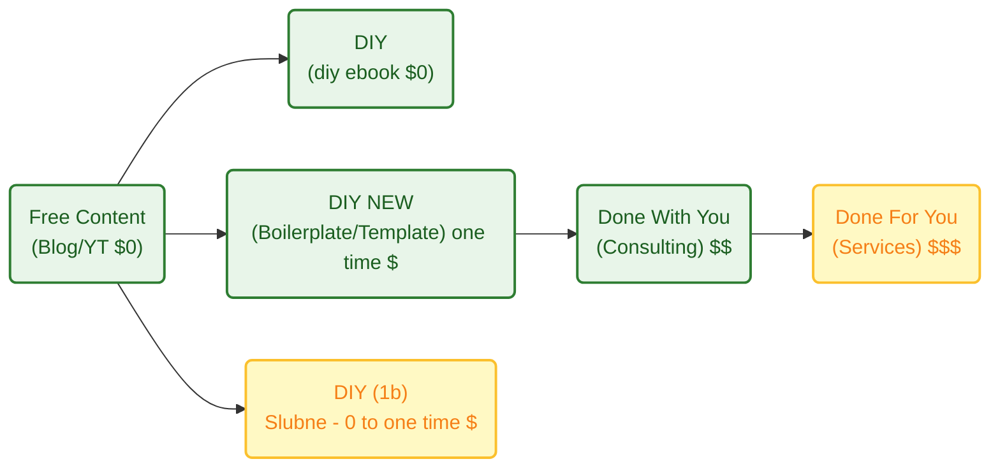

**TL;DR**

When thinking about **ways to decouple time and value delivery**...

How to create a landing page that converts the non so lazy and enables to create via a **one time payment to adquire knowledge that is proven to work**?

The **launch strategy**: *aka, focus strategy*

| Element | Decision |
| :--- | :--- |
| **One Avatar** | Undicided people w/o a clear way how to proceed|
| **One Product** | Simple knowledge to vibe code effectively|
| **One Channel** | |

The **Tier of Service**: DIY (1a - *leverages on knowledge*)

The **tech stack**: *see how it has been done on [this section](https://jalcocert.github.io/JAlcocerT/diy-landing-boilerplate/#now---creating-diy-landing-boilerplate)*

| Requirement | Specification | Clarification / Decision |
| :--- | :--- | :--- |
| **Frontend Framework** | | Tab favicon and og must be available |
| **Styling/UI Library** | | |
| **[Backend](https://jalcocert.github.io/JAlcocerT/docs/dev/fe-vs-be/)/Database** | | |
| **[Authentication](https://jalcocert.github.io/JAlcocerT/docs/dev/authentication/)** | | |
| Others | Web Analytics / ads / Cal / Formbricks / ESP | Yes, via MailTrp |

* TAM: *not calculated, if it helps someone, would be amazing*
* LTV: *not calculated*
* CaC: ~0$ + the time cost of sharing on social media / forums from my time at this point

So...if all of that is...undefined: whats **the goal**?

To move away from "selling time" (which caps your income) to "selling value" (which creates scale).

This might also be combined with [the upcoming offers](#my-offer-after-diy-landing) DIY x PaaS to enable people to have a wordpress going and the N ebooks / web/ook.


A clear distinction of "Application-first" vs. "Content-first...

{}

Using Astro in **SSR (Server-Side Rendering)** mode—or more accurately, **"Hybrid" mode**—gives you the same dynamic capabilities as Next.js, such as user authentication, private dashboards, and real-time data fetching.

In 2025, the gap between the two has narrowed significantly. Here is how you achieve "Next.js-like" power in Astro.

**A. The "Islands" vs. "Full App" Mental Model**

In **Next.js**, the entire site is a React application. When you navigate, React handles the transition.
In **Astro**, you are building a **Multi-Page Application (MPA)**. Each page is a fresh HTML request. If you need "app-like" smooth transitions, you use the built-in **View Transitions API**, which makes an MPA feel like a Single Page App (SPA).

**B. Server Actions**

Next.js has a very mature "Server Actions" feature for handling form submissions. Astro recently introduced **Astro Actions**, which provide a type-safe way to define and call server-side functions from your client components (React, Vue, etc.) without manually fetch-calling an API.


4. When to choose Astro SSR over Next.js?

**Use Astro SSR if:**

* You want **better performance**: Even in SSR mode, Astro often ships significantly less JavaScript than Next.js because it doesn't force a "hydration" of the entire page.
* You want **flexibility**: You can use React for your dashboard, but Svelte for a lightweight contact form on the same site.
* You prefer **simpler code**: Astro’s frontmatter (the `---` block) is just standard JavaScript/TypeScript that runs on the server.

**Stick with Next.js if:**

* Your app is extremely "state-heavy" (like a complex photo editor or a real-time collaborative doc) where maintaining a complex client-side state across navigation is critical.
* You are already deeply integrated into the Vercel/React ecosystem and use advanced features like Incremental Static Regeneration (ISR) extensively.


Yes, you absolutely can. Using Astro in **SSR (Server-Side Rendering)** mode—or more accurately, **"Hybrid" mode**—gives you the same dynamic capabilities as Next.js, such as user authentication, private dashboards, and real-time data fetching.

In 2025, the gap between the two has narrowed significantly. Here is how you achieve "Next.js-like" power in Astro.


1. How to Enable SSR

By default, Astro is static. To enable SSR, you need to add an **adapter** for your hosting provider (e.g., Vercel, Netlify, or Node.js for VPS) and set the output mode in `astro.config.mjs`.

```javascript
// astro.config.mjs
import { defineConfig } from 'astro/config';
import vercel from '@astrojs/vercel/serverless'; // Example for Vercel

export default defineConfig({
  output: 'server', // Use 'hybrid' if you want most pages to stay static
  adapter: vercel(),
});

```

2. Feature Comparison: Astro SSR vs. Next.js

If you are coming from Next.js, here is how the core "app" features translate:

| Capability | Next.js (App Router) | Astro (SSR/Hybrid) |
| --- | --- | --- |
| **Data Fetching** | `fetch()` in Server Components | Top-level `await` in `.astro` frontmatter |
| **API Routes** | `app/api/route.ts` | `src/pages/api/endpoint.ts` |
| **Middleware** | `middleware.ts` | `src/middleware.ts` |
| **Auth** | NextAuth / Clerk | **Auth.js (for Astro)** / Clerk / Lucia |
| **Routing** | File-based (`page.tsx`) | File-based (`index.astro`) |
| **Layouts** | `layout.tsx` (nested) | Standard components with `<slot />` |


3. Key Differences in "The Feel"

While the capabilities are similar, the execution differs in two major ways:

**A. The "Islands" vs. "Full App" Mental Model**

In **Next.js**, the entire site is a React application. When you navigate, React handles the transition.
In **Astro**, you are building a **Multi-Page Application (MPA)**. Each page is a fresh HTML request. If you need "app-like" smooth transitions, you use the built-in **View Transitions API**, which makes an MPA feel like a Single Page App (SPA).

**B. Server Actions**

Next.js has a very mature "Server Actions" feature for handling form submissions. Astro recently introduced **Astro Actions**, which provide a type-safe way to define and call server-side functions from your client components (React, Vue, etc.) without manually fetch-calling an API.


4. When to choose Astro SSR over Next.js?

**Use Astro SSR if:**

* You want **better performance**: Even in SSR mode, Astro often ships significantly less JavaScript than Next.js because it doesn't force a "hydration" of the entire page.
* You want **flexibility**: You can use React for your dashboard, but Svelte for a lightweight contact form on the same site.
* You prefer **simpler code**: Astro’s frontmatter (the `---` block) is just standard JavaScript/TypeScript that runs on the server.

**Stick with Next.js if:**

* Your app is extremely "state-heavy" (like a complex photo editor or a real-time collaborative doc) where maintaining a complex client-side state across navigation is critical.
* You are already deeply integrated into the Vercel/React ecosystem and use advanced features like Incremental Static Regeneration (ISR) extensively.

For your specific goal—a high-performing landing page with a chatbot, a calendar, and an email capture—**Astro is the superior choice.**

It allows you to build the "brochure" parts of your site with zero JavaScript while "plugging in" a React component for the chatbot only where it's needed.


**Astro (The Performance King)**

Astro uses **Islands Architecture**.

It renders your page as static HTML and only "hydrates" (loads JS for) the specific components you mark as interactive.

| **Pros** | **Cons** |
| --- | --- |
| **Speed:** Ships zero JS by default. This leads to perfect Lighthouse scores and better SEO out-of-the-box. | **State Management:** Sharing data *between* different islands (like a chatbot and a header) is slightly more manual than in Next.js. |
| **Multi-Framework:** You can use a React chatbot, a Vue calendar, and a Svelte form on the same page. | **Not an SPA:** By default, page changes are full refreshes (though "View Transitions" makes this feel like an app). |
| **Simpler mental model:** If you know HTML and standard JS, you're 90% there. No complex React "Server vs. Client" component rules. | **Smaller Ecosystem:** While growing fast, there are fewer "all-in-one" enterprise templates compared to Next.js. |
| **Lower Hosting Costs:** Because it's static-first, you can host it for free on almost any CDN (Cloudflare, GitHub Pages). | **SSR Setup:** Requires adding an "adapter" (like Vercel or Node) to enable backend features like your SQLite saving. |

**Next.js (The Application Powerhouse)**

Next.js is a full React framework.

It is designed for complex, state-heavy applications where the user stays on the site for a long time (like a dashboard).

| **Pros** | **Cons** |
| --- | --- |
| **Deep React Integration:** Access to the world's largest library of pre-made UI components (like complex Chatbot UIs). | **JS Overhead:** Even a "static" Next.js page ships a React runtime (approx. 70-100kb), which can slightly hurt mobile SEO. |
| **Server Actions:** Extremely mature way to handle form submissions (like your email capture) without writing API routes. | **Complexity:** The "App Router" has a steep learning curve regarding caching, revalidation, and server/client boundaries. |
| **Ecosystem:** Almost every 3rd-party service (Calendly, Stripe, etc.) has a first-class Next.js "plug-and-play" library. | **Vendor Lock-in:** It is heavily optimized for Vercel. Hosting it elsewhere (like a private VPS) can be more difficult. |
| **ISR (Incremental Static Regeneration):** Updates static content in the background without a full rebuild—great for huge sites. | **Build Times:** As the project grows, Next.js build times can become significantly longer than Astro's. |


**The Verdict for Your Project**

**Go with Astro if:**

* You want the **fastest possible landing page** (crucial for converting ads).
* Your "backend" needs are simple (saving an email to SQLite).
* You want to "plug and play" a Chatbot as an isolated widget.

**Go with Next.js if:**

* You plan to turn this landing page into a **full SaaS product** with a login area and a complex dashboard later.
* You are already a React expert and don't want to learn a new file syntax.

**How to start the Astro + SQLite + Chatbot setup:**

1. **Initialize:** `npm create astro@latest` (Choose "Server" mode for SQLite).
2. **Add React:** `npx astro add react` (To power your Chatbot).
3. **Add Tailwind:** `npx astro add tailwind` (For your "plug and play" UI components).
4. **Database:** Install `better-sqlite3` to handle your email collection.


{}


{}

 Using **Firebase Authentication with Astro SSR** is a very common and powerful pattern. 
 
 It allows you to have the performance of a static landing page while still protecting specific routes (like a `/dashboard` or `/admin`) using server-side logic.

In fact, because Astro is an MPA (Multi-Page Application), you actually get a very secure "session-based" flow that is often easier to reason about than the complex hydration rules in Next.js.

How it works in Astro SSR

To make this work, you typically use a "Double SDK" approach:

1. **Firebase Client SDK:** Used on your Login/Register pages to handle the actual login (social login, email/password) in the browser.
2. **Firebase Admin SDK:** Used in your Astro **Middleware** or **API Routes** to verify the session on the server before the page even reaches the user.

---

The Architecture: Firebase + Astro SSR

1. The Login Flow

When a user logs in via your React/Vue chatbot or a standard form, you get an `idToken` from Firebase. You then POST this token to an Astro API route (e.g., `/api/auth/signin`).

2. The Session (Server-side)

In that API route, you use the **Firebase Admin SDK** to verify the token and create a session cookie. This is much more secure than storing the token in `localStorage`.

```typescript
// src/pages/api/auth/signin.ts
export const POST: APIRoute = async ({ request, cookies }) => {
  const idToken = await request.json();
  // Verify with Firebase Admin and set a 'session' cookie
  cookies.set("session", sessionCookie, { path: "/" });
  return new Response(JSON.stringify({ status: "success" }));
};

```

3. Protecting Routes (Middleware)

You can use Astro's `src/middleware.ts` to check every request. If someone tries to access `/dashboard` without a valid Firebase session cookie, you can redirect them to the landing page immediately.

{}

Astro vs. Next.js for Firebase Auth

| Feature | Astro SSR + Firebase | Next.js + Firebase |
| --- | --- | --- |
| **Logic Location** | Mostly in `middleware.ts` and API routes. | Spread across Server Components and Actions. |
| **Security** | Easy to enforce "Server-only" auth checks. | Can be tricky with "Client vs Server" components. |
| **Performance** | Only loads the Firebase Client SDK on the login page. | Often bundles parts of the SDK into the main app. |
| **Setup** | Requires manual cookie handling or a library like `astro-firebase`. | Often uses `next-firebase-auth-edge` for similar results. |


If you want to build a **high-converting landing page** that later redirects a user to a **private dashboard**, Astro SSR is excellent.

You keep the landing page lightning-fast (no Firebase JS loaded) and only trigger the "heavy" auth logic when the user actually interacts with your login or chatbot.


**Intro**

I saw sth interesting across social media and forums [here](https://forocoches.com/foro/showthread.php?t=10544529) and [here](https://forocoches.com/foro/showthread.php?t=10544108)

People need stg...but are not able to articulate the what.

And having a website is so easy, everyone does that and If i would want to....id also do mine.

Specially with AI, its... 3 seconds.

No action.

So, as my BRD of doing these landings works so good, im *productionazing it* with the shape of...**code + life time access and a landing.**


Kind of...

People are using them to sell ebooks `https://readmake.com/` or ways to code: `https://codefa.st/#pricing`, `https://shipfa.st/?ref=indiepage`

Or to sell simple microSaaS services like: `https://poopup.co/`


Lets get to it.


  
  



## What should a landing have?

An effective landing page is less like a brochure and more like a focused conversation. 

Since it usually has one specific goal—getting a visitor to sign up, buy, or download—every element needs to point toward  conversion.

Here are the essential parts to consider, organized by how a user typically experiences them:

### The "Above the Fold" Essentials

This is what users see before they even start scrolling. You have about five seconds to convince them to stay.

* **Headline:** This should be your **Unique Value Proposition (UVP)**. Don't describe what you are; describe the primary benefit the user gets.
* **Sub-headline:** A brief explanation that supports the headline by adding context or addressing a common pain point.
* **Primary Call to Action (CTA):** A high-contrast button that tells the user exactly what to do next (e.g., "Get Started for Free" vs. "Submit").
* **Hero Image/Video:** A visual that shows the product in action or represents the "feeling" of the desired result.

### Building Authority & Trust

People are naturally skeptical. You need to prove you can deliver on your promises.

* **Social Proof:** Testimonials, customer logos, or "As Seen In" badges. Real faces and full names make testimonials much more believable.
* **Trust Signals:** Security badges, money-back guarantees, or data regarding your success (e.g., "Joined by 10,000+ professionals").

### The "Why" and "How"

Now that they are interested, you need to provide the logic to back up the emotional hook.

* **Features vs. Benefits:** Don't just list technical specs. Explain *how* those features solve the user's problem.
* *Feature:* "256-bit encryption."
* *Benefit:* "Your data stays private and secure, no matter what."


* **The "How it Works" Section:** A simple 1-2-3 step breakdown of the process to lower the perceived barrier to entry.

### Friction Reduction

This is where you remove the final excuses a user might have for leaving.

* **FAQ Section:** Address the most common objections or "what if" questions right on the page.
* **Simplified Form:** If your goal is a lead, keep the form fields to a minimum. Every extra field reduces your conversion rate.
* **Secondary CTA:** A repeat of your main button at the bottom of the page so the user doesn't have to scroll back up once they finish reading.


| Element | Purpose |
| --- | --- |
| **Clarity** | Can a stranger understand what you offer in 5 seconds? |
| **Consistency** | Does the page match the ad or link that brought them there? |
| **Speed** | Does the page load instantly? (Crucial for mobile users). |
| **Singular Focus** | Is there only **one** goal for the page? (Remove navigation menus). |

## My Journey creating Landings


{}

### Discovering AntiGravity

### Got to know mailerlite

Wouldnt it be nice to capture email into a Email marketing platform (EMP)?

It is also possible by copy pasting snippets.

And via OSS with Listmonk.

### Tested few ESP

From the email service providers tested [here](https://jalcocert.github.io/JAlcocerT/emails-101/)

I decided to continue with Mailtrap API due to its nice deliverability.


Specially via the API (SMTP tends to go to spam).

**Why it is considered the best:**

* **Deliverability:** Unlike other services, the author noted that with Mailtrap, the **"email flows directly to your inbox"** using a custom domain, whereas others (like Mailjet or Mailgun) often ended up in the spam folder during testing.
* **Ease of Use:** It is described as being **"among the easiest to configure for developers,"** especially for testing and sandboxing.
* **Integration:** It offers a wide range of integrations, including a native **n8n node**, **Supabase**, and even an **MCP tool for VS Code**, allowing you to send emails directly from your code editor.
* **Reliability with Backends:** The author successfully used it as the SMTP relay for **PocketBase**, confirming it works well for sending one-time codes and magic links.


| Service | Author's Rank | Key Strength |
| --- | --- | --- |
| **Mailtrap** | **#1** | Best deliverability to inbox & developer-friendly testing. |
| **Resend** | **#2** | Great API, Cloudflare integration, and can *receive* mail. |
| **Mailjet** | **#3** | Ideal for high-volume marketing/transactional relay via Listmonk. |


### Created a DWY landing page

With formbricks and cal.com support: `consulting.jalcocertech.com` done [here](https://github.com/JAlcocerT/selfhosted-landing).


The only thing is that emails were not verfied, neither I was sending a thing to them.

Well, stripe emails are...,verified' behind a paywall :)


### Combined email capture with programmatic emails

If you got unverified emails from formbricks or from sth like the `make-landing` project that saves them into a `.db` or `.csv`

You can do [programmatic emails via ESP](https://github.com/JAlcocerT/make-landing/blob/master/mailetrap-esp.ipynb) to send them goodies: *info, attachments, verifications, etc.*

[](https://colab.research.google.com/github/JAlcocerT/make-landing/blob/main/mailetrap-esp.ipynb)

The good thing about programmatic stuff, is that you can customize email html templates via antigravity.


### Email html vs mjml Templates

And...as asking qq's you get to know nice things: html, mjml and maizzle templates...

```sh
python3 send_email.py

#npm install -g mjml
#mjml --version

python3 send_mjml_email.py #with mjml template
```

Those worked with my favicon: https://www.jalcocertech.com/favicon.ico


### VibeCoded via BRDs

Because if [a BRD](https://jalcocert.github.io/JAlcocerT/brd-vs-frd-for-data-analytics/) is supposed to make things clear for a dev team, it can do the same for agents.

Adding features via **Change Requests** like [this one](https://github.com/JAlcocerT/selfhosted-landing/blob/master/z-change-request-5.md), have also been great.


### Now - Creating diy-landing-boilerplate

Enough about past, last fast forward to now and create:

```sh
git init && git add . && git commit -m "Initial commit: Starting DIY Web BoilerPlate" && gh repo diy-landing-boilerplate --private --source=. --remote=origin --push
```

{}


{}

```sh
#git init && git add . && git commit -m "Initial commit: Starting N ebooks DIY" && gh repo create 1toN-ebooks --private --source=. --remote=origin --push
```

{}


---

## Conclusions

You can think of it this way: Listmonk (the EMP) is your operating system for managing lists...

Mailjet *(the ESP/SMTP)* is your high-performance engine that ensures your emails actually reach the inbox.

And your landing page is what your potential clients see and get to know about you within 5 seconds.


  
  



### My Offer after DIY Landing





### Tech Talk - Shipping Apps as a BA


