**Tl;DR**

Dont have the time to learn, neither the willing to pay for custom?

Benefit from what's automated for the masses.

+++ Selfhosting [Postgres](#selfhost-postgres) 101

**Intro**

I want to **combine a Landing x PaaS Tool**s to enable B2C users to get up to speed quickly with certain services that dont require any customization.

A Micro-SaaS on Top of PaaS x (SSG + CMS + other services TBC).

Not trying to do a:

* `https://railway.com/pricing`
* `elestio`

Specially after learning about the different [business games](#the-idea-side) and the full stack formula that rules them all: NP = P*V*GM*OM*F*T

A PaaS can be an option if you dont have the time to read/learn, neither willingness to pay a DFY:


  
  


Why?

```mermaid
flowchart LR
    %% --- Styles ---
    classDef free fill:#E8F5E9,stroke:#2E7D32,stroke-width:2px,color:#1B5E20;
    classDef low fill:#FFF9C4,stroke:#FBC02D,stroke-width:2px,color:#FBC02D;
    classDef mid fill:#FFE0B2,stroke:#F57C00,stroke-width:2px,color:#F57C00;
    classDef high fill:#FFCDD2,stroke:#C62828,stroke-width:2px,color:#C62828;
    classDef bridge fill:#E3F2FD,stroke:#1565C0,stroke-width:3px,color:#0D47A1;

    subgraph "Phase 1: Attraction"
        L0("Free Content (Blog/YT/eBooks)"):::free
    end

    subgraph "Phase 2: The Audit Magnets"
        L1_Web("Web/UI Audit 🛡️<br/>(Find UX Leaks)"):::free
        AP_Pro("AuditPro Landing 🚀<br/>(Find Profit Leaks)"):::bridge
    end

    subgraph "Phase 3: Service Tiers"
        L2("DIY Guides ($)"):::low
        L3("Consulting (DWY) $$<br/>(Web Optimization)"):::mid
        L4("Full Service (DFY) $$$<br/>(Data Analytics / Success Fee)"):::high
    end

    %% --- Connections ---
    L0 --> L1_Web
    L0 --> AP_Pro
    
    L1_Web --> L2
    L1_Web --> L3
    
    AP_Pro --> L4
    
    %% Cross-sell
    L3 -.-> |"Upsell"| L4
```



Because you need something generic, yet customizable with your time and definitely not configured by others.

So im going to take one of these selfhosted PaaS that we covered previously:


  
  


**Get a server** and wrap it up with a landing via vibe coding.


  


Simple, uh?

## Creating a DIY PaaS Offering

### The Idea Side

The **launch strategy**: *aka, focus strategy*

| Element | Decision |
| :--- | :--- |
| **One Avatar** | Undicided people w/o a clear way how to proceed|
| **One Product** | Simple knowledge to vibe code effectively|
| **One Channel** | Forums like reddit|

The **Tier of Service**: DIY (1b - *leverages on tech*)

The **Lead Magnet**: get a FREE web audit *leveraging the discoveries done [here](https://jalcocert.github.io/JAlcocerT/do-your-instagram/#web-audits)*

The **tech stack**: 

| Requirement | Specification | Clarification / Decision |
| :--- | :--- | :--- |
| **Frontend Framework** | | Tab favicon and og must be available |
| **Styling/UI Library** | | |
| **[Backend](https://jalcocert.github.io/JAlcocerT/docs/dev/fe-vs-be/)/Database** | | |
| **[Authentication](https://jalcocert.github.io/JAlcocerT/docs/dev/authentication/)** | | |
| Others | Web Analytics / ads / Cal / Formbricks / ESP | Yes, via MailTrap |

* TAM: *not estimated*
* LTV: *not estimated*
* CaC: ~0$, wont be promoted directly
* Supply: scalable via server resources

Why...am I doing this then?

To *hopefully* move away from "selling time" (which caps your income) to "selling value" (which creates scale).


  
  


#### Inspiration for the Idea

For SaaS, there are OSS starter kits like: https://github.com/nextacular/nextacular

* https://nextacular.co/
  * https://docs.nextacular.co/

> **MIT** |  An open-source starter kit that will help you build full-stack **multi-tenant SaaS platforms efficiently** and help you focus on developing your core SaaS features. Built on top of popular and modern technologies such as Next JS, Tailwind, Prisma, and Stripe. 

{}

### Tinkered with Cloud

### Tinkered with MiniPCs

And put together a KPI around: performance, volume, power

### Covered SelfHosted PaaS few Times

{}


---

## Conclusions


### 1 - Stopping Low value commitments

From the [stop doing](https://jalcocert.github.io/JAlcocerT/tech-recap-and-more-2025/#stop-doing) section for this year: *For the hard to sell people: it needs to be fully scalable or nothing - accounting for my opportunity cost. *

```sh
git clone https://github.com/JAlcocerT/ourika
#whois guideventuretour.com | grep -i -E "(creation|created|registered)"
#created a hand-over.md
pandoc hand-over.md -o hand-over.pdf
#cd /home/jalcocert/Desktop && zip -r ourika.zip ourika -x "ourika/node_modules/*" -x "ourika/.git/*"
```

For anyone offended:



  
  


PS: *there is a trick*


---

## FAQ

### Selfhost Postgres

I read this fantastic [post about selfhosting postgres](https://pierce.dev/notes/go-ahead-self-host-postgres?ref=selfh.st).

And how could I not addit to the mix.

As PG is [one of the DBs](https://jalcocert.github.io/JAlcocerT/setup-databases-docker/) that you can set in your servers to do D&A or as a companion to many services.

And [pgsql can do](https://jalcocert.github.io/JAlcocerT/setup-databases-docker/#postgresql) several parts of a tech stack all together


  
  


```sh
docker compose up -d

#docker exec postgres_container psql -U admin -d myapp -c "SELECT 1;"

docker exec -it postgres_container psql -U admin -d myapp
#SELECT version();
#\dt       -- List tables (empty for now)
#\q        -- Quit
```

Let's use it with [the sample **chinook DB**](https://github.com/lerocha/chinook-database/releases): *yes, im cooking sth on top of LangChain+DBs again*


  
    


This is all you need to ***plug* an existing database** into your just created **PGSQL container instance**:

```sh
curl -L -O https://github.com/lerocha/chinook-database/releases/download/v1.4.5/Chinook_PostgreSql.sql
cat Chinook_PostgreSql.sql | docker exec -i postgres_container psql -U admin -d myapp

docker exec postgres_container psql -U admin -d myapp -c "\l"

docker exec postgres_container psql -U admin -d chinook -c "\dt"

docker exec -it postgres_container psql -U admin -d chinook
#\dt
#SELECT * FROM artist LIMIT 5;
```

We will be using this very soon :)

> In the mentioned article, Pierce Freeman argues that the fear surrounding self-hosting PostgreSQL is largely a marketing narrative pushed by cloud providers. 

> > He suggests that for many developers, self-hosting is not only more cost-effective but also provides better performance and control.

The Case for Self-Hosting

1. The "Cloud Myth"

Cloud providers (like AWS RDS) pitch reliability and expertise as their main value. However, Freeman points out:

* **Identical Engines:** Managed services usually run the same open-source Postgres you can download yourself.
* **False Security:** Managed services also experience outages. When they do, you have fewer tools to fix the problem than if you owned the infrastructure.
* **Cost Gap:** As of 2025, cloud pricing has become aggressive. A mid-tier RDS instance can cost over $300/month, while a dedicated server for the same price offers vastly superior hardware (e.g., 32 cores vs. 4 vCPUs).

2. Operational Reality

Freeman shares his experience running a self-hosted DB for two years, serving millions of queries daily. He notes that maintenance is surprisingly low-effort:

* **Weekly:** 10 mins (Checking backups and logs).
* **Monthly:** 30 mins (Security updates and capacity planning).
* **Quarterly:** 2 hours (Optional tuning and disaster recovery tests).

3. When to Self-Host (and When Not To)

* **Self-Host If:** You are past the "vibe coding" startup phase but aren't a massive enterprise yet. It’s the "sweet spot" for most apps.
* **Stick to Managed If:** You are a total beginner, a massive corporation with enough budget to outsource the labor, or you have strict regulatory compliance needs (HIPAA, FedRAMP).


If you choose to self-host, Freeman emphasizes that standard Docker defaults aren't enough. 

You must tune these three areas:

Memory & Performance Tuning

* **`shared_buffers`**: Set to ~25% of RAM.
* **`effective_cache_size`**: Set to ~75% of RAM to help the query planner.
* **`work_mem`**: Be conservative to avoid running out of memory during complex sorts.

Connection Management

* **Avoid Direct Connections:** Postgres connections are "expensive."
* **Use PgBouncer:** Use a connection pooler by default to handle parallelism efficiently, especially for Python or async applications.

Storage Optimization

* **NVMe Settings:** Modern SSDs change the math on query planning. You should lower `random_page_cost` (to ~1.1) to tell Postgres that random reads are nearly as fast as sequential ones.

### Building Webs with AI

See which are the top LLMs as per their *ELO fights* https://web.lmarena.ai/leaderboard

* https://github.com/atuinsh/atuin

> MIT | ✨ Magical shell history

### Status Page

I like the shopify one: `https://www.shopifystatus.com/`

See as reference the:


### Competitors


<!-- 
https://issyinformatica.es/

-->

<!-- More ppl to help - future CLIENTS

* you dont need to pay for wordpress themes, its already there and it works
  * https://generatepress.com/pricing/

* Pablo Couto - https://www.buildingfuturecapital.com/

https://web-check.xyz/check/https%3A%2F%2Fwww.buildingfuturecapital.com%2F


* Sofia - zofienkagram
  * https://wnba.pl/ - another wordpress (good looking)
  * monika ciolkowska - monikacio
    * https://monikaciolkowska.portfoliobox.net/
    * Using the low tier without domain of https://www.portfoliobox.net/pricing (46$/y)
      * Interesting section with a table comparing services and faq (go below)

* Gym Trainer - https://trenujswiadomie.pl/kokpit/

* Gym Trainer - https://trenujswiadomie.pl/kokpit/


-->


<!-- 
* Weddings...
* bodas.net

http://divephiphiisland.com/ 

-->

More ppl to help - future CLIENTS

* you dont need to pay for wordpress themes, its already there and it works
  * https://generatepress.com/pricing/

* Pablo Couto - https://www.buildingfuturecapital.com/

https://web-check.xyz/check/https%3A%2F%2Fwww.buildingfuturecapital.com%2F


https://quadscadiz.com/

* Sofia - zofienkagram
  * https://wnba.pl/ - another wordpress (good looking)
  * monika ciolkowska - monikacio
    * https://monikaciolkowska.portfoliobox.net/
    * Using the low tier without domain of https://www.portfoliobox.net/pricing (46$/y)
      * Interesting section with a table comparing services and faq (go below)


* Hosting Costs:
  * https://banahosting.com/web-hosting ~5eur/month
  * https://webtolearn.pl/cennik ~20eur/month

* Customer management systems - CMS
  * https://wakems.com/index.php
  * https://clubspeed.com/pricing/

* Custom websites
  * https://zeon.studio/estimate-project
  * https://hormigasenlanube.com/
  * https://lyk-website.pl/brief/
