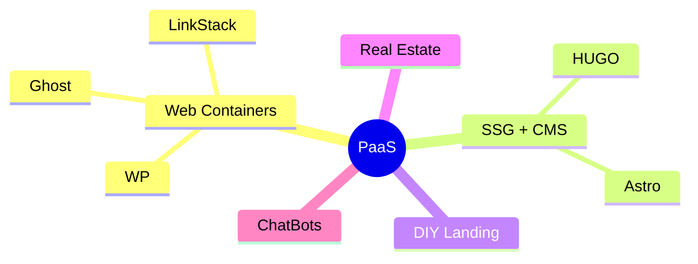

**Tl;DR**

Last year I completed all these pieces of the puzzle: [PaaS](https://jalcocert.github.io/JAlcocerT/selfhosted-server-paas/) + [DecapCMS x Astro](https://jalcocert.github.io/JAlcocerT/open-source-minimalist-websites/#using-decap-cms)

Time to put those together with a quick WebApp/SaaS to free my time and **enhance the output of people's DIYs**.


  
  


**Intro**

How about improving CX for DIYs websites?

The thing is: Does it needs to be a trade of between a Wordpress/Ghost/Wix or a code driven cool SSG?

Cant we go ECO and green and have websites that respect the environment?

The **launch strategy**: *aka, focus strategy*

| Element | Decision |
| :--- | :--- |
| **One Avatar** | |
| **One Product** | |
| **One Channel** | |

The **Tier of Service**: DIY (1b - *leverages on actual tech stack Ive put together - PaaS x (WP/Ghost or SSG+CMS)*)

The **tech stack**:

| Requirement | Specification | Clarification / Decision |
| :--- | :--- | :--- |
| **Frontend Framework** | | |
| **Styling/UI Library** | | |
| **[Backend](https://jalcocert.github.io/JAlcocerT/docs/dev/fe-vs-be/)/Database** | | |
| **[Authentication](https://jalcocert.github.io/JAlcocerT/docs/dev/authentication/)** | | |



  
  


<!-- FIRST SUMMARY POST OF SGG'S
THEN THIS ONE REFERENCES TO ALL OF THEM -> ALL SSG'S + FIREBASE + CLOUDFLARE + gh pAGES... -->


<!-- 
forget about this costs
https://generatepress.com/pricing/
https://www.mangomedia.pl/pl/portfolio.html
-->



  
  



## The journey to a CMS managed cool Website


  
  



{}

### Discovering Github Pages

### Discovering SSGs

### Being amazed by Astro

### Think I could tweak them

### FrontMatterCMS was not enough

### Try few CMS and fail

### Build some flask/next webapps as CMS and fail

### Tried Nuxt Content, was nice, BUT

* Canvas Nuxt ContentCMS

* https://github.com/bloggrify/bloggrify

### DecapCMS finally did the trick

With Twilight astro Theme first and the double terminal

```sh

```

Then with Portfolio where it worked with local + github oauth with changes commited and going to Ci/CD automatically

```sh

```

And to some extent, with EntreAgujayPunto (hugo theme gallery), where the container setup....

```sh
#git clone https://github.com/JAlcocerT/EntreAgujayPunto.git #http://jalcocert-x300-1:8090/
npm install npm-run-all --save-dev
#npm run dev:full #decapcms local + hugo local dev
HUGO_BASEURL="http://jalcocert-x300-1" HUGO_PORT=1313 npm run dev:full

#hugo server --bind="0.0.0.0" --baseURL="http://192.168.1.100" --port=1313
#npm run cms
make dev-all
```

The last round was very recently, on [this post](https://jalcocert.github.io/JAlcocerT/interesting-books/#decap-x-existing-astro-x-localhost).

{}

## The journey of the infra side

Because not everything is code.

{}

### Played with Ubuntu

### Got a Pi

### Liked containers

### Got a VPS

### Liked Docker

### Tried VPSs

### Consolidated docker configs

### Understood Proxies for HTTPs

### Tried few PaaS Tools

### Tinkered with UptimeKuma

### And with LightHouse CI


{}


## What the experience show me

**a CMS x Astro, why?**

From the experience: Dont do more than 3 websites to very close people if you they are not able to enable **self-service**.

Thats where [selfhosted tools](https://docs.vrite.io/self-hosting/configuration/) like: https://github.com/vriteio/vrite are supposed to shine.

>  Open-source developer content platform 

I also got inspired by tools listed: https://www.awesome-homelab.com/category/writing

Particularly by https://www.awesome-homelab.com/item/novel-editor

> I would recommend you to consider DecapCMS or....


  
  


## The journey of putting this together

Fast forward to today: lets put a web/app with UI to bundle all this.

### Creating a DIY x PaaS


{}

```sh
git init && git add . && git commit -m "Initial commit: Starting N ebooks DIY" && gh repo create 1toN-ebooks --private --source=. --remote=origin --push
```

{}

---

## Conclusions

Remember, you can always do your [wordpress stuff](#still-want-a-wp).




### Programmatic Free Audits for Websites


Btw, the **pages speed insights**, can be done via **API**: *see [this .md](https://github.com/JAlcocerT/morita-web/blob/main/z-pagespeedinsight-101.md)*


Must have also Lighthouse-CI:


---

## FAQ


If you are building websites, get inspired:

 1. https://github.com/gridaco/grida

 > Apache v2 |  Grida — Ambitious 2D Graphics Editor for the Web 

### Interesting Features for any Web

1. Pop up at time or location of page


2. Maps ✅


* https://github.com/roblabs/maps-withastro ✅
* Leaflet + OSM ✅
* MapLibre ✅ - https://github.com/roblabs/maps-withastro/blob/main/src/MapLibre.astro
    * An open source **visual editor** for the '**MapLibre Style** Specification'  - https://github.com/maplibre/maputnik
* komoot embed OK


* Adding interactive globe with the countries you have visited
    * From [astro bento portfolio](https://github.com/IoTechCrafts/astro-bento-portfolio-ssg/blob/master/src/components/Globe.tsx) (d3 & solid-js library) ✅


### Still Want a WP?

Wanna Tinker with [php](https://jalcocert.github.io/JAlcocerT/backend-alternatives/) and wordpress?

If you start **fresh on a VPS** and have Docker and WordPress set up, bringing your WordPress theme into that environment involves a few steps:


  



https://jalcocert.github.io/JAlcocerT/automating-ghost-and-wordpress/

https://jalcocert.github.io/JAlcocerT/no-code-websites/


Step 1: Prepare Your Docker WordPress Setup

Ensure your WordPress Docker container is running and accessible. Usually, you’ll have WordPress files mounted on a volume inside the container, often at `/var/www/html/wp-content/themes/`.

Step 2: Copy Your Theme to the VPS
You can bring the theme files over to the VPS using:

- **SCP or SFTP**: Upload your theme folder (which contains `style.css`, `functions.php`, and all necessary theme files) into the WordPress themes directory on the VPS.  
  Example SCP command:
  ```bash
  scp -r /local/path/to/my-theme username@vps_ip:/path-to-docker-volume/wp-content/themes/
  ```

- **Git Clone**: If your theme is in a Git repository (e.g., GitHub), you can clone it directly inside the themes folder if you have access on the VPS:  

```bash
cd /path-to-docker-volume/wp-content/themes/
git clone https://github.com/your_username/your-wordpress-theme.git
```

- **Docker Volume Mounting (for Development)**: When developing locally or on VPS, you can mount your local theme folder as a Docker volume in the container for live edits without copying each time.

Step 3: Activate the Theme in WordPress

Once your theme files are in the themes directory:

1. Log in to your WordPress admin at `http://your-vps-ip/wp-admin`.
2. Navigate to **Appearance → Themes**.
3. Find your uploaded theme and click **Activate**.

Step 4: Optional—Upload Theme ZIP via Admin

As an alternative, through the WordPress Admin UI:

- Go to **Appearance → Themes → Add New → Upload Theme**.
- Upload a zip archive of your theme; WordPress will install and activate it.


| Method | Description | When to Use |
|--------|-------------|-------------|
| SCP/SFTP Copy | Manually copy theme files | Direct file control, VPS access |
| Git Clone | Clone theme repo directly | Theme under Git version control |
| Docker Volume Mount | Mount theme folder as volume | Development/live sync |
| WordPress UI Upload | Upload via admin dashboard | Simple manual install |

This workflow lets you manage your themes conveniently on a fresh Docker WordPress VPS environment.

Yes, there are many open-source WordPress themes freely available on GitHub. 

In fact, thousands of developers and organizations—including Automattic (the company behind WordPress.com)—host and maintain GPL-licensed WordPress themes there.

These can be used, studied, modified, or forked for your own projects.

**Examples of Popular Open-Source WordPress Themes on GitHub**

Some of the most widely used and high-quality open-source WordPress themes include:

- **[Roots / Sage](https://github.com/roots/sage)** — a Laravel Blade-based WordPress starter theme with Tailwind CSS and full block editor support; a favorite among professional developers (over 13k stars).[1]
- **Automattic / themes** — a collection of official free themes built by the WordPress.com team, released under GPL-2.0.[2]
- **WordPress / community-themes** — a repository of block-based themes demonstrating WordPress’s new Full Site Editing (FSE) capabilities, developed collaboratively by the community.[3]
- **digitoimistodude / air-light** — a lightweight (<20 kB) starter theme optimized for developers, using HTML5 and minimal dependencies.[6]
- **them.es** — open-source starter themes built with Bootstrap or Material Design that support full site editing, responsive design, localization, and build automation.[8]
- **solstice23 / Argon** and **mirai-mamori / Sakurairo** — popular modern community-maintained designs supporting internationalization and colorful UI.[1]

You can explore thousands more in the **GitHub “wordpress-theme” topic**, which currently includes over 4,000 public repositories across PHP, CSS, and JavaScript projects.[1]

**Installing Themes from GitHub**

You can manually download a theme ZIP file from GitHub and install it through **WordPress → Appearance → Themes → Upload Theme**.  

Alternatively, use tools like **WP Pusher** or **GitHub Updater** to install and automatically update WordPress themes directly from public GitHub repositories.[5][9]

All of these themes respect GPL open-source licensing, meaning you can modify or even resell them under your own distribution as long as you retain the same license.

[1](https://github.com/topics/wordpress-theme)
[2](https://github.com/Automattic/themes)
[3](https://github.com/WordPress/community-themes)
[4](https://github.com/topics/wordpress-starter-theme)
[5](https://www.fastcomet.com/kb/install-wordpress-themes-and-plugins-from-github)
[6](https://github.com/digitoimistodude/air-light)
[7](https://sourceforge.net/directory/wordpress-themes/)
[8](https://them.es)
[9](https://www.wpbeginner.com/pl/beginners-guide/how-to-install-wordpress-plugins-and-themes-from-github/)
[10](https://ltheme.com/wordpress-github-plugin/)


### Building Webs with AI

See which are the top LLMs as per their *ELO fights* https://web.lmarena.ai/leaderboard

* https://github.com/atuinsh/atuin

> MIT | ✨ Magical shell history

#### How Ive improved my websites

##### FOSS

Fossengineer Docs and Theme Directory!

WIP

1. Keep HUGO as SSG
2. Create Doc like section as companion to the blog
3. Create theme directory that works as per the config added at the [homelab repo](https://github.com/JAlcocerT/Home-Lab/tree/main)


##### BaJ

Beyond a journey...


### Other Static CMS

What are Static Site Generators?

* https://github.com/plentico/plenti

> Apache v2 | **Static Site Generator** with Go backend and Svelte frontend 

Build-Time Render Engine (aka Static Site Generator) with Go backend and Svelte frontend

Ships with a fully integrated Git-CMS that you can host for cheap/free right with your static site

Install [plenti](https://snapcraft.io/plenti):

```sh
snap install plenti
```

As the author mentions: Plenti = Hugo + NetlifyCMS 
<!-- https://www.youtube.com/watch?v=T4b55nfZiIw -->


<!-- 
https://www.youtube.com/watch?v=Gr3KTOnsWEM&list=PLbWvcwWtuDm0tIrvD_xHvUXHBftbHDy5T 
-->




This is a very cool proposal for landing pages see https://plenti.co/themes !

1. https://github.com/keystonejs/keystone

* https://keystonejs.com/docs

Keystone helps you build faster and scale further than any other CMS or App Framework. Describe your schema, and get a powerful GraphQL API & beautiful Management UI for your content and data.

> MIT | The superpowered headless CMS for Node.js — built with GraphQL and React 