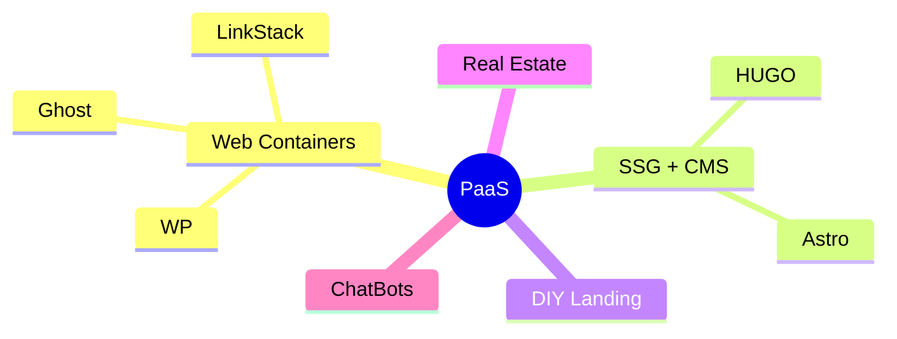

**Tl;DR**

Last year I completed all these pieces of the puzzle: [PaaS](https://jalcocert.github.io/JAlcocerT/selfhosted-server-paas/) + [DecapCMS x Astro](https://jalcocert.github.io/JAlcocerT/open-source-minimalist-websites/#using-decap-cms)

Time to put those together with a quick WebApp/SaaS to free my time and **enhance the output of people's DIYs**.


  
  


+++ [Gitlab Pages](#what-about-gitlab-pages)

**Intro**

How about **improving CX** for DIYs websites?

You know that you can reach `webaudit.jalcocertech.com`

The thing is: Does it needs to be a trade of between a Wordpress/Ghost/Wix or a code driven cool SSG?

Cant we go ECO and green and have websites that respect the environment?

The **launch strategy**: *aka, focus strategy*

| Element | Decision |
| :--- | :--- |
| **One Avatar** | |
| **One Product** | |
| **One Channel** | |

The **Tier of Service**: DIY (1b - *leverages on actual tech stack Ive put together - PaaS x (WP/Ghost or SSG+CMS)*)

The **tech stack**:

| Requirement | Specification | Clarification / Decision |
| :--- | :--- | :--- |
| **Frontend Framework** | | |
| **Styling/UI Library** | | |
| **[Backend](https://jalcocert.github.io/JAlcocerT/docs/dev/fe-vs-be/)/Database** | | |
| **[Authentication](https://jalcocert.github.io/JAlcocerT/docs/dev/authentication/)** | | |



  
  


<!-- FIRST SUMMARY POST OF SGG'S
THEN THIS ONE REFERENCES TO ALL OF THEM -> ALL SSG'S + FIREBASE + CLOUDFLARE + gh pAGES... -->

<!-- 
forget about this costs
https://generatepress.com/pricing/
https://www.mangomedia.pl/pl/portfolio.html
-->



  
  



## The journey to a CMS managed cool Website


  
  



{}

### Discovering Github Pages

### Discovering SSGs

### Being amazed by Astro

### Think I could tweak them

### FrontMatterCMS was not enough

### Try few CMS and fail

### Build some flask/next webapps as CMS and fail

### Tried Nuxt Content, was nice, BUT

* Canvas Nuxt ContentCMS

* https://github.com/bloggrify/bloggrify

### DecapCMS finally did the trick

With the [Twilight](https://github.com/JAlcocerT/Twilight) astro Theme first and the double terminal working in local mode:

```sh
npm run dev
npx decap-server #in terminal 2
```

Then with [Portfolio](https://github.com/JAlcocerT/Portfolio) where it worked with local + github oauth with changes commited and going to Ci/CD automatically

```sh
make hugo-dev #hugo server --bind="0.0.0.0" --baseURL="http://localhost" --port=1313 #localhost:1313
```

And to some extent, with [EntreAgujayPunto](https://github.com/JAlcocerT/EntreAgujayPunto) (hugo theme gallery), where the container setup....

```sh
#git clone https://github.com/JAlcocerT/EntreAgujayPunto.git #http://jalcocert-x300-1:8090/
npm install npm-run-all --save-dev
#npm run dev:full #decapcms local + hugo local dev
HUGO_BASEURL="http://jalcocert-x300-1" HUGO_PORT=1313 npm run dev:full

#hugo server --bind="0.0.0.0" --baseURL="http://192.168.1.100" --port=1313
#npm run cms
make dev-all
```

The last round was very recently, on [this post](https://jalcocert.github.io/JAlcocerT/interesting-books/#decap-x-existing-astro-x-localhost).

{}

## The journey of the infra side

Because not everything is code.

{}

### Played with Ubuntu

### Got a Pi

### Liked containers

### Got a VPS

### Liked Docker

### Tried VPSs

### Consolidated docker configs

### Understood Proxies for HTTPs

### Tried few PaaS Tools

### Tinkered with UptimeKuma

### And with LightHouse CI


{}


## What the experience show me

**a CMS x Astro, why?**

From the experience: Dont do more than 3 websites to very close people if you they are not able to enable **self-service**.

Thats where [selfhosted tools](https://docs.vrite.io/self-hosting/configuration/) like: https://github.com/vriteio/vrite are supposed to shine.

>  Open-source developer content platform 

I also got inspired by tools listed: https://www.awesome-homelab.com/category/writing

Particularly by https://www.awesome-homelab.com/item/novel-editor

> I would recommend you to consider DecapCMS or....


  
  


## The journey of putting this together

Fast forward to today: lets put a web/app with UI to bundle all this.

### Creating a DIY x PaaS


{}

```sh
git init && git add . && git commit -m "Initial commit: Starting N ebooks DIY" && gh repo create 1toN-ebooks --private --source=. --remote=origin --push
```

{}

---

## Conclusions

Remember, you can always do your [wordpress stuff](#still-want-a-wp).




---

## FAQ


If you are building websites, get inspired:

 1. https://github.com/gridaco/grida

 > Apache v2 |  Grida — Ambitious 2D Graphics Editor for the Web 

### Interesting Features for any Web

1. Pop up at time or location of page


2. Maps ✅


* https://github.com/roblabs/maps-withastro ✅
* Leaflet + OSM ✅
* MapLibre ✅ - https://github.com/roblabs/maps-withastro/blob/main/src/MapLibre.astro
    * An open source **visual editor** for the '**MapLibre Style** Specification'  - https://github.com/maplibre/maputnik
* komoot embed OK


* Adding interactive globe with the countries you have visited
    * From [astro bento portfolio](https://github.com/IoTechCrafts/astro-bento-portfolio-ssg/blob/master/src/components/Globe.tsx) (d3 & solid-js library) ✅


#### How Ive improved my websites


  
  


##### FOSS

Fossengineer Docs and Theme Directory!

WIP

1. Keep HUGO as SSG
2. Create Doc like section as companion to the blog
3. Create theme directory that works as per the config added at the [homelab repo](https://github.com/JAlcocerT/Home-Lab/tree/main)


##### BaJ

Beyond a journey...


### Other Static CMS

What are Static Site Generators?

* https://github.com/plentico/plenti

> Apache v2 | **Static Site Generator** with Go backend and Svelte frontend 

Build-Time Render Engine (aka Static Site Generator) with Go backend and Svelte frontend

Ships with a fully integrated Git-CMS that you can host for cheap/free right with your static site

Install [plenti](https://snapcraft.io/plenti):

```sh
snap install plenti
```

As the author mentions: Plenti = Hugo + NetlifyCMS 
<!-- https://www.youtube.com/watch?v=T4b55nfZiIw -->


<!-- 
https://www.youtube.com/watch?v=Gr3KTOnsWEM&list=PLbWvcwWtuDm0tIrvD_xHvUXHBftbHDy5T 
-->




This is a very cool proposal for landing pages see https://plenti.co/themes !

1. https://github.com/keystonejs/keystone

* https://keystonejs.com/docs

Keystone helps you build faster and scale further than any other CMS or App Framework. Describe your schema, and get a powerful GraphQL API & beautiful Management UI for your content and data.

> MIT | The superpowered headless CMS for Node.js — built with GraphQL and React 

### What about GitLab Pages?

Hosting a static website can be simple, secure, and cost-effective.

GitLab Pages embodies these qualities by providing developers with a straightforward platform for hosting static sites directly from GitLab repositories.

GitLab Pages is an integrated feature within GitLab that allows users to publish static websites directly from repositories in their GitLab accounts.

It supports various static site generators like Jekyll, Hugo, and others, or simply HTML, CSS, and JavaScript, making it a versatile option for all types of static content.



One of the distinguishing features of **GitLab is its open-source nature** and the ability to self-host the platform using Docker.

> You dont need to - but you can go deep the **rabbit hole** and have [full control of Gitlab]

This contrasts significantly with services like GitHub Pages, Firebase, and Cloudflare Pages, where you do not control the underlying infrastructure.

**Key Comparisons:**
- **Open Source**: GitLab is fully open source, which allows users to inspect, modify, and enhance the source code, providing a level of transparency and customization that is not available in proprietary platforms like Firebase or fully managed environments like GitHub Pages and Cloudflare Pages.
- **Self-Hosting**: With GitLab, you have the **option to self-host** your entire DevOps platform using Docker. This offers complete control over your data and the infrastructure, which is particularly important for organizations with strict data sovereignty or privacy requirements.
- **Infrastructure Control**: While platforms like GitHub Pages and Cloudflare Pages offer convenience and ease of use, they do not allow for infrastructure control. This means you rely entirely on their managed services, which can be a limitation if you need more control over performance optimizations, security settings, or compliance measures.

By choosing **GitLab**, you leverage the benefits of an **open ecosystem** and the flexibility to host your own instance, ensuring that you have full authority over your development and hosting environment.




Key Features of GitLab Pages

- **Seamless Integration with GitLab**: Directly connect your static site's repository with GitLab Pages for continuous integration and deployment without leaving the GitLab ecosystem.
- **Custom Domain Support**: Easily connect your custom domain to your GitLab Pages site with the added benefit of free SSL certificates provided by Let's Encrypt.
- **Automatic HTTPS**: Secure your site by default with HTTPS, enhancing security and trust for your visitors.
- **CI/CD Pipeline**: Leverage GitLab's powerful CI/CD tools to automate the build and deployment process, ensuring that updates are pushed live with minimal manual intervention.
- **Free and Unlimited**: Yes, you read that right. GitLab Pages is completely free and offers unlimited bandwidth, so you can focus on building and sharing your projects without worrying about hidden costs.

Getting Started with GitLab Pages

1. **Set Up Your Project**:
   - Ensure your static site project is hosted in a GitLab repository. If you're using a static site generator, set up your project according to the specific requirements of that generator.

2. **Configure GitLab CI/CD**:
   - Create a `.gitlab-ci.yml` file in the root of your repository to define the build and deployment process. GitLab Pages integrates with GitLab CI/CD to build and deploy your site whenever you push changes.

3. **Enable GitLab Pages**:
   - In the project’s settings, navigate to the 'Pages' section to configure and enable GitLab Pages. This will automatically deploy your site to a GitLab subdomain, which you can then link to a custom domain if preferred.

Enhancing Your Static Site with GitLab Pages

GitLab Pages is not just for serving static content. You can enhance site interactivity and functionality using modern web development approaches:

- **Client-Side JavaScript**: Enrich your site with dynamic content and interactive elements using JavaScript frameworks like React or Vue.js.
- **Third-Party APIs**: Integrate APIs to bring dynamic data into your static site, such as e-commerce platforms, CMSes, or social media feeds.
- **WebAssembly**: Use WebAssembly for high-performance web applications directly in the browser, which can be hosted as part of your static GitLab Pages site.


  
  


---

### TBC

WIP

to go with boilerplate at some poiint (?) or as ebook

  

Entrepre-AI Quick Sping

```sh
git clone
make container-build
make container-up
```

* CTA's
    * Quieres el premium? No, correre el riesgo!
    * You don’t have to miss out
    * They all laugh when…
    * What sounds better than privacy?
    * Is your Business performing at 100%? Here is the best/easiest way to find out
        * Measure, Check, Act
    * Blinded pa lazyness?
    * A friend told me that this will fail as people on ig has really nothing to say
      * Lets proove him wrong

* Interesting catchy sentences:
  * Pollo hecho en serio y no en serie
  * Hay una casa para cada persona, hay una app para todas las casas.
  * Lets sea
  * We ve bean waiting for you (coffee)
  * Make IT happen
  * Fotografiamos historias de amor. 
    * La historia la escribís vosotros; nosotros la contaremos con imágenes.
