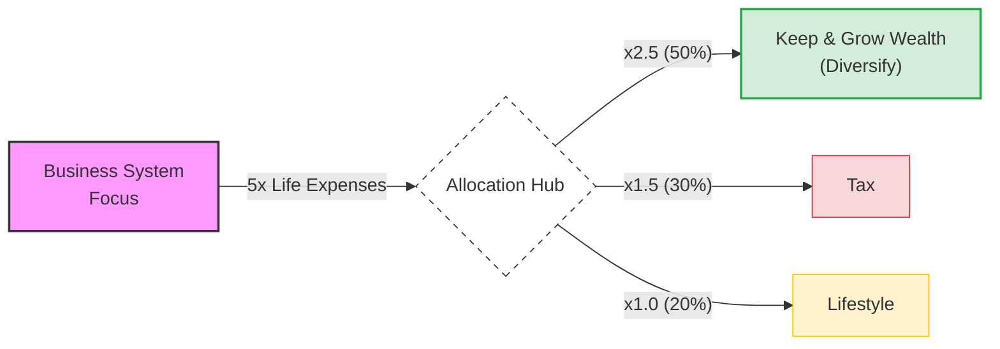

**TL;DR**

Is it possible that agents will not only reply a query based on the real content of a database,

But also would provide a proper visualization?

Why are we still building dashboards for one-off questions?


**Intro**

After getting that pnp D&a with langchain and pgsql ready [here](https://jalcocert.github.io/JAlcocerT/plug-and-play-data-analytics/#conclusions).


And having a [session for non-tech users](https://jalcocert.github.io/JAlcocerT/a-diy-boilerplate-to-ship/#the-tech-talk) to learn to vibe code similar tools.

Its time to review some existing generative BI tools available.

And build something.

## Existing GenBI Solutions



  
  


### Rill

Go beyond dashboards
with BI-as-code

A high-performance, AI-native alternative to legacy BI, backed by modern analytical databases.

* https://github.com/rilldata/rill

### WrenAI

* https://docs.getwren.ai/oss/guide/connect/duckdb
* https://wrenaicloud.statuspage.io/

* https://docs.getwren.ai/oss/overview/how_wrenai_works
* https://docs.getwren.ai/oss/overview/cloud_vs_self_host

> Wren AI - Open-Source GenBI Agent

```sh
git clone https://github.com/Canner/WrenAI.git
#https://github.com/JAlcocerT/WrenAI
cd WrenAI/docker
cp .env.example .env
docker-compose up -d
#docker stats
#docker compose down
# sudo docker ps

# CONTAINER ID   IMAGE                                    COMMAND                  CREATED          STATUS                  PORTS                                         NAMES
# da91dea45d04   ghcr.io/canner/wren-ui:0.32.2            "docker-entrypoint.s…"   7 seconds ago    Up 3 seconds            0.0.0.0:3000->3000/tcp, [::]:3000->3000/tcp   wrenai-wren-ui-1
# e0f4caa1ba51   ghcr.io/canner/wren-ai-service:0.29.0    "/app/entrypoint.sh"     8 seconds ago    Up 4 seconds            0.0.0.0:5555->5555/tcp, [::]:5555->5555/tcp   wrenai-wren-ai-service-1
# a8f102d87fb7   ghcr.io/canner/wren-engine:0.22.0        "/__cacert_entrypoin…"   8 seconds ago    Up 4 seconds            7432/tcp, 8080/tcp                            wrenai-wren-engine-1
# f0273f90175a   qdrant/qdrant:v1.11.0                    "./entrypoint.sh"        14 seconds ago   Up 5 seconds            6333-6334/tcp                                 wrenai-qdrant-1
# 7f54128c5212   ghcr.io/canner/wren-engine-ibis:0.22.0   "./entrypoint.sh"        14 seconds ago   Up 5 seconds            8000/tcp, 8888/tcp                            wrenai-ibis-server-1
```


Data modeling adds a logical layer over your original data schema, organizing relationships, semantics, and calculations. 

This helps AI align with business logic, retrieve precise data, and generate meaningful insights. More details

## Building 

But first, some recap on what drove me to this point.

{}

### Explored LangChain

Explored few frameworks like llamaindex and pandasAI.

Also tinkered with [RAG around CSVs](https://jalcocert.github.io/JAlcocerT/how-to-chat-with-your-data/).

And chatted [with PDFS](https://jalcocert.github.io/JAlcocerT/how-to-chat-with-pdfs).

### LLM x Databases

Via langchain is also possible to [talk with a database](https://jalcocert.github.io/JAlcocerT/langchain-chat-with-database/).

Which I rebamped into this [pgsql x langchain with few real examples](https://jalcocert.github.io/JAlcocerT/plug-and-play-data-analytics/#the-related-tech-talk).

### Enabled the team

By sharing in couple ways: 

* The technical one for big data communities
* The non-tech for business users - With [a video proof](https://youtu.be/qf-oNNNDXS0) that this can be done in less than 1h

{}

### Adding Generative BI to PlugnPlay D&A

Now, time to continue where I left the repository: *yes, its going to be the same one*


  


```sh
git clone https://github.com/JAlcocerT/langchain-db-ui

```

I got couple of ideas on how to do this.

1. To get some graph recommended via function calling.
2. To do so via BAML

* https://github.com/boundaryml/baml
* /JAlcocerT/using-baml-to-query-a-database

> I got to use BAML last year here, while trying to improve the repo to doc generation tasks

One of their doc example resonated with this: https://baml-examples.vercel.app/examples/book-analyzer

For which they provided the code: https://github.com/BoundaryML/baml-examples/tree/main/nextjs-starter/app/examples/book-analyzer

---

## Conclusions


  



 Document Logic (The Planning)
BRD (Business Requirements): Answers "WHY build this?" (The Vision & Goals).
PRD (Product Requirements): Answers "WHAT are we building?" (The Features & Roadmap).
FRD (Functional Requirements): Answers "HOW does it work?" (The Technical Logic & CRUDs).
2. Data Logic (The Analytics)
Fact Tables: Answer "WHAT happened (and how much)?"
Examples: visit_count, revenue, quantity_sold.
Dimension Tables: Answer "WHO / WHERE / WHICH context?"
Examples: customer_name, product_category, country_origin.

Yes, your understanding is spot on. In the world of data engineering, these concepts form the fundamental "fork in the road" between how we store data for **action** versus how we store it for **analysis**.


1. OLTP: The "Action" Layer

**OLTP (Online Transaction Processing)** systems are built to handle the daily operations of a business (e.g., swiping a credit card, updating a password, or placing an order).

* **Mapping:** **ER Modeling**  **Normalization**
* **The Goal:** **Data Integrity.** You want to ensure that if a customer changes their address, you only have to update it in *one* place.
* **Why Normalization?** By breaking data into many small, related tables (usually 3rd Normal Form), you eliminate redundancy. This makes "writes" (INSERT, UPDATE, DELETE) lightning-fast and prevents data anomalies.
2. OLAP: The "Analysis" Layer

**OLAP (Online Analytical Processing)** systems are built for complex decision-making (e.g., "What were our total sales in the Northeast region vs. the Southwest over the last three years?").

* **Mapping:** **Dimensional Modeling**  **Denormalization**
* **The Goal:** **Query Performance & Simplicity.** Analysts don't want to join 50 tables to get one report. They want the data pre-organized for speed.
* **Why Denormalization?** You intentionally bring data back together. While this creates "redundancy" (the same city name might appear 1,000 times), it drastically reduces the number of "joins" the database has to perform, making "reads" much faster.

3. Star vs. Snowflake (The OLAP Variations)

Within Dimensional Modeling, you have two primary ways to structure your "Dimensions":

| Feature | **Star Schema** (Most Common) | **Snowflake Schema** |
| --- | --- | --- |
| **Structure** | **Denormalized.** Dimension tables are flat. | **Normalized.** Dimension tables are broken down further. |
| **Visual** | Looks like a star (Fact table in the center). | Looks like a snowflake (Dimensions have sub-dimensions). |
| **Performance** | **Faster.** Fewer joins required. | **Slower.** More joins required. |
| **Maintenance** | Harder; data redundancy is high. | Easier; less redundancy (easier to update a category name). |

| System Type | Modeling Style | Strategy | Focus |
| --- | --- | --- | --- |
| **OLTP** | Entity-Relationship (ER) | **Normalization** | Fast Writes / Data Integrity |
| **OLAP** | Dimensional | **Denormalization** | Fast Reads / Easy Analysis |


### Related Tech Talk

```sh
git clone https://github.com/JAlcocerT/selfhosted-landing
cd y2026-tech-talks/3-genbi-langchain
#npm run dev 
```


---

## FAQ

This diagram outlines a strategic approach to wealth management and lifestyle design, likely originating from a high-performance or entrepreneurial coaching framework.

It emphasizes the transition from **focused income generation** to **disciplined wealth distribution.**



Here is a breakdown of what this graph suggests and why it is a powerful (though aggressive) financial model:


1. The Engine: Business System (Focus)

The starting point is a single "Business System" generating roughly **5x your life expenses.** * **The "Focus" Tag:** This is critical. It suggests that before you worry about complex investing or lifestyle upgrades, you must first build a singular, scalable engine that produces high cash flow.

* **The 5x Target:** By aiming for 5x your expenses, you create a massive "margin of safety." Most people live on 1x or 1.2x their income; this model demands you over-earn significantly relative to your needs to fuel the rest of the system.

2. The Multiplier Strategy

The blue numbers (, , ) represent the allocation weight relative to your lifestyle:

* **Lifestyle (x1):** This is your baseline. If your lifestyle costs $10,000/month, that is your "1 unit."
* **Tax (x1.5):** This assumes a roughly 30% tax bracket on the total. It treats tax as a mandatory "expense" that is actually larger than your personal lifestyle costs.
* **Wealth (x2.5):** This is the most aggressive part. It suggests you should be putting **2.5 times more money** into investments than you spend on your daily life.

3. The Output: The 50/30/20 Split

Once the cash flows through the "Focus" phase, it is split into three buckets:

* **50% Keep & Grow Wealth [Diversify]:** Half of every dollar earned goes into assets (stocks, real estate, etc.). This is where the transition from "Active Income" (Business) to "Passive Wealth" happens.
* **30% Tax:** A realistic, conservative estimate for high-earning individuals to ensure no legal or cash-flow surprises.
* **20% Lifestyle:** This is the "Golden Handcuffs" prevention. By capping lifestyle at 20% of total earnings, you ensure that even if you have a massive year, you don't inflate your spending to a level that requires the business to run forever.

My Assessment

**Strengths:**

* **Prevents Lifestyle Creep:** Most people increase their spending as they earn more. This graph forces spending to stay a fixed, small percentage of the whole.
* **Psychological Clarity:** It tells you exactly when you are allowed to "diversify." You don't play with stocks until the business system is hitting that 5x marker.
* **Aggressive Compounding:** Putting 50% of gross income into wealth-building assets will lead to financial independence much faster than traditional 10–15% savings rates.

**Potential Risks:**

* **The "Focus" Trap:** Staying in "Focus" mode too long can lead to burnout if the 5x target is set too high or if the business is extremely volatile.
* **Tax Efficiency:** Depending on your jurisdiction, 30% might be too low or too high. Strategic tax planning (corporate structures) might be needed to keep that number from eating into the "Wealth" bucket.

**Overall, this is a "Wealth Accelerator" map.** It is designed for someone who wants to work intensely for a decade to never have to work again, rather than someone looking for a slow, 40-year retirement plan.

Would you like me to help you calculate what these numbers would look like based on a specific target monthly expense?

### More Tools to Interact with DBs